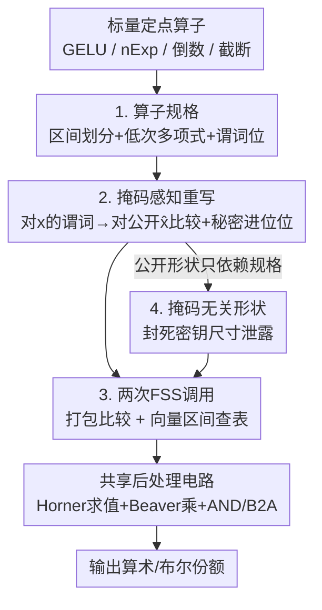

# FuseFSS: Efficient Secure LLM Inference with Function Secret Sharing

**会议**: ICML2026  
**arXiv**: [2606.09551](https://arxiv.org/abs/2606.09551)  
**代码**: 待确认  
**领域**: AI安全 / 隐私保护推理 / 安全多方计算  
**关键词**: 安全推理, 函数秘密共享, 定点非线性算子, 编译器, 两方计算

## 一句话总结
FuseFSS 把"每个定点非线性算子都手写一套专用安全协议"换成一个统一编译器：给每个标量算子写一份紧凑规格（区间划分 + 低次多项式 + 谓词位），编译器自动生成"一次打包比较 + 一次区间查表"两次 FSS 调用，在 BERT/GPT 上相对当前最强 FSS 基线 Sigma 端到端提速 1.24×–1.50×、在线通信降 9%–16%，且密钥更小更快。

## 研究背景与动机

**领域现状**：两服务器安全推理让客户端把私有输入秘密分享给两个互不串通的服务器，服务器在密文份额上跑模型，全程不暴露 prompt / embedding。近期基于函数秘密共享（FSS）的 GPU 系统（如 Sigma、SHAFT）已经能把 Transformer 的**线性层**跑得很快。

**现有痛点**：瓶颈转移到了定点算术下的**逐元素非线性算子和重缩放**——GELU、$\mathrm{nExp}$、倒数 / 平方根倒数、截断 / 算术右移（ARS）等。这些算子要在环 $R=\mathbb{Z}_{2^n}$ 上做带模 $2^n$ 回绕（wrap-around）的比较和分段选择，目前每个算子都被实现成一套**手写专用协议**，各有各的比较逻辑、回绕修正、预处理材料。

**核心矛盾**：这种"一算子一协议"的做法很脆。正确性论证要逐个重来、密钥生成逻辑大量重复、加一个新算子就容易引入隐蔽的回绕或符号位 bug。高性能和可扩展 / 可证正确之间被这套手工流程死死卡住。

**本文目标**：把"逐算子协议工程"替换成"一次编译 + 一份证明"——用统一结构覆盖所有定点标量算子，既保性能又保安全性可证。

**切入角度**：作者观察到一个关键事实——这些定点非线性算子里，**与数据相关的那部分长得几乎一样**：都是先用一小撮谓词位选出一个区间，再在该区间上套一个低次多项式（带少量常数）。既然结构同构，就该有统一表达。

**核心 idea**：把每个标量算子抽象成一份 **算子规格（operator specification）**，再由编译器在公开掩码值 $\hat{x}=x+r_{\mathrm{in}} \bmod 2^n$ 上自动生成两次标准 FSS 调用——**一次打包比较**返回所有谓词位的 XOR 份额，**一次向量区间查表**返回当前区间的多项式系数和常数——剩下的全是固定的共享后处理电路。

## 方法详解

### 整体框架

FuseFSS 是一个把"标量定点算子"编译成"统一安全协议"的编译器，工作在标准两方预处理模型下：离线阶段（概念上的 dealer）采样掩码、派生秘密共享的实例常数、为每个算子实例生成 FSS 密钥与相关随机数；在线阶段两个服务器 $P_0,P_1$ 在密文份额上低延迟评估模型。

整条流水线是：拿到一个标量定点算子 → 写成算子规格（区间划分 + 每区间低次多项式 + 布尔谓词电路）→ 编译器把所有"对秘密 $x$ 的谓词"重写成"对公开 $\hat{x}$ 的比较 + 秘密进位位"→ 收集所有比较原子打包成**一次打包比较**、把所有每区间系数 / 常数打包成**一次区间查表**→ 在线只需开放公开掩码值 $\hat{x}$、本地评估这两次 FSS、再跑一个固定的共享后处理电路（Horner 求多项式 + Beaver 乘法 + 布尔 AND / B2A 转换）→ 输出算术份额与布尔份额。整个过程的"公开形状"（比较条数、位宽、查表维度）被强制设计成**只依赖公开规格、不依赖采样掩码**，从而封死通过密钥尺寸 / 实例形状泄露掩码的通道。

### 关键设计

**1. 算子规格：把定点非线性算子抽象成一份可编译的类型化 IR**

针对"逐算子手写协议"这个痛点，作者定义了算子规格——一份签名为 $F:\mathsf{A}_n \to \mathsf{A}_n^r \times \mathsf{B}^\ell$ 的类型化描述（输入一个算术份额，输出 $r$ 个算术值 + $\ell$ 个布尔位），可附带定点元数据（小数位数、符号性）。它由三部分组成：① 一个**完整区间划分** $0=\alpha_0<\alpha_1<\dots<\alpha_m=2^n$，区间 $I_i=[\alpha_i,\alpha_{i+1})$；② 每个区间上一个**次数 $\le d$ 的多项式向量** $P_i(x)\in R[x]^r$；③ 每个区间上一组**布尔公式** $B_i(x)$，由原子谓词 $C_\beta(x)=\mathbb{I}[x<\beta]$ 和低位谓词 $D_{\gamma,f}(x)=\mathbb{I}[(x\bmod 2^f)<\gamma]$ 以及连接词 $\neg,\wedge,\vee,\oplus$ 拼成。诱导函数就是 $F(x)=(P_i(x),B_i(x))$，其中 $i$ 是 $x$ 落入的唯一区间。

这个抽象的妙处在于"分而治之"：不是每个算子是多项式（如截断 / ARS 要丢比特，根本不是 $R$ 上多项式），所以作者把规格和一个**固定后处理电路 $\Phi$** 分开——只要存在某个规格 $F$ 和确定性电路 $\Phi$ 使得 $G(x)=\Phi(F(x),\kappa,x,\hat{x},\mathsf{pub})$，这个算子就叫"规格兼容"。激活函数、$\mathrm{nExp}$、倒数 / 平方根倒数、截断 / ARS 这些主导安全 Transformer 推理的算子都落进了这个框架；而 max / sum 归约、排序 / top-$k$ 这类**跨坐标**操作不是单变量标量映射，交给电路 / DAG 层的标准 MPC 子协议处理。

**2. 掩码感知重写：把"对秘密 $x$ 的谓词"翻译成"对公开 $\hat{x}$ 的比较"**

FSS 的掩码线（masked-wire）范式里，双方会开放公开掩码值 $\hat{x}=x+r_{\mathrm{in}}\bmod 2^n$（$r_{\mathrm{in}}$ 均匀且独立于 $x$，故 $\hat{x}$ 信息论上独立于 $x$）。难点是：谓词本来定义在秘密 $x$ 上，要改写成在公开 $\hat{x}$ 上的比较，而改写会引入依赖掩码的进位 / 回绕信息——这些**必须保持秘密共享**，否则就会泄露 $r_{\mathrm{in}}$ 进而泄露 $x$。

核心是 Lemma 4.3（掩码下的无符号比较重写）：设 $\hat{x}=(x+r)\bmod N$、$\theta=(r+\beta)\bmod N$、进位位 $w=\mathbb{I}[r+\beta\ge N]$（由预处理提供 XOR 份额 $\langle w\rangle$），则
$$\mathbb{I}[x<\beta]=\mathbb{I}[\hat{x}<\theta]\oplus\mathbb{I}[\hat{x}<r]\oplus w.$$
右边两个比较都在公开 $\hat{x}$ 上做，$w$ 是秘密共享常数。更妙的是一个推论：把区间指示子 $\mathbb{I}[x\in I_i]$ 用两个边界比较的异或表示时，那个公共的 $\mathbb{I}[\hat{x}<r]$ 项会**相互抵消**，于是只剩对平移边界 $(\alpha_i+r)\bmod 2^n$ 的比较加进位位 $w_i$，大幅减少了选区间所需的原始比较数。MSB 测试和有符号比较也都归约到无符号比较 + 固定常数移位。

**3. 两次 FSS 调用 + 固定共享后处理：把任意规格兼容算子压成常数次非交互评估**

这是性能的来源（Theorem 4.6）。后端只需两类标准 FSS 原语：**打包比较**（给一组查询 $(k_t,c_t,\theta_t)$，返回所有 $\mathbb{I}[\mathsf{view}_{k_t,c_t}(u)<\theta_t]$ 的 XOR 份额，涵盖全宽比较 / 低位谓词 / MSB 测试）和**向量区间查表**（给边界和每区间载荷向量，返回 $u$ 所在区间载荷 $v_{i^\star}$ 的加法份额，且不暴露落在哪个区间）。编译时把边界平移到 $\hat{x}$ 空间、把划分**填充到固定区间数 $M$**（这步保证公开形状与掩码无关）、把所有比较原子按描述符固定顺序收成一次打包比较实例、把所有系数 / 常数收成一次区间查表实例。

在线评估只有四步：开放 $\hat{x}$ → 评估打包比较拿谓词位 → 评估区间查表拿系数载荷 → 本地导出 $x=\hat{x}-r_{\mathrm{in}}$ 的份额并跑后处理电路 $\Phi$。其中多项式用 Horner 法则 + Beaver 三元组求值（$O(r\cdot d)$ 次环乘），$\Phi$ 再用少量 Beaver 乘、布尔 AND、B2A 完成截断 / ARS 修正等。所有交互都收敛到 Beaver / AND / B2A 这些标准子协议的开放上——一份证明、一套预处理逻辑，覆盖所有算子，这正是它相对手写协议"省密钥、省通信、易扩展"的根。

**4. 掩码无关形状：用统一证明换来可控的泄露**

安全性方面，编译后的门实例会暴露一些**公开形状参数**：比较查询数 $T$ 及其位宽多重集、区间数 $M$、载荷维度 $p$。作者把它建模成显式泄露函数 $\mathcal{L}_{\mathrm{shape}}$，并通过第 3 点里的"填充到固定 $M$"强制这些形状**只依赖公开规格和定点元数据、不依赖采样掩码**——于是密钥长度也与掩码无关，封死了"通过密钥尺寸反推掩码"的侧信道。在半诚实预处理模型下（至多一方被腐化），只要两类 FSS 原语满足带显式形状泄露的单密钥 FSS 安全、且 Beaver / AND / B2A 子协议半诚实安全，编译后的每个门实例就有标准混合论证下的可模拟性（Theorem 4.7）。把安全性单独拎成一个设计点，是因为它和"两次调用"是一体两面：正是固定形状让"一份安全证明跨所有算子"成立。

### 一个完整示例：编译 Softmax 里的 nExp

以 BERT-base、序列长 128 的 softmax 为例。softmax 含 max 归约、$\mathrm{nExp}$、倒数等子步。其中 max 归约是跨坐标操作，走标准 MPC 比较树（不被 FuseFSS 编译）；而 $\mathrm{nExp}$ 和倒数是逐元素规格兼容算子，被编译成"打包比较 + 区间查表 + Horner 后处理"的统一路径。实测这条编译路径（$\mathrm{nExp}$ + 倒数）从 Sigma 的 223（单位见原文）降到 49，单步 **4.50× 提速**；而 max 归约这种不归 FuseFSS 管的子步保持 93 不变。这个例子说明 FuseFSS 的收益恰好来自"把零散手写的逐元素非线性算子统一压成两次 FSS 调用"，对跨坐标归约则不强求。

## 实验关键数据

### 主实验

硬件为 2× RTX PRO 6000 Blackwell + 2× EPYC 9654，每方一块 GPU；基线为当前最强 FSS GPU 安全推理系统 Sigma，FuseFSS 作为其手写非线性协议的**即插即用替换**，故端到端差异可全部归因于编译策略。下表为序列长 128、batch 1 的端到端两服务器推理（在线时延与在线通信）：

| 模型 | Sigma 在线时延(ms) | FuseFSS 在线时延(ms) | 时延降幅 | Sigma 通信(GB) | FuseFSS 通信(GB) |
|------|------|------|------|------|------|
| BERT-tiny-128 | 63.90 | 42.60 | −33.3% | 0.021 | 0.018 |
| BERT-base-128 | 1613.80 | 1149.50 | −28.8% | 1.062 | 0.891 |
| BERT-large-128 | 4034.50 | 2997.90 | −25.7% | 2.833 | 2.376 |
| GPT-2-128 | 1423.90 | 1072.70 | −24.7% | 0.885 | 0.777 |
| GPT-Neo-128 | 6326.20 | 5115.80 | −19.1% | 4.326 | 3.917 |

综合所有模型：在线时延降 19%–33%、在线通信降 9%–16%，对应整体 1.24×–1.50× 端到端提速且**精度持平**。预处理也更轻：密钥生成时间降 14%–23%、密钥尺寸降 20%–24%（如 BERT-base keygen 1.32→1.08 s、key 18.076→13.678 GB）。在 LAN/WAN 模型下 BERT-base-128 为 3.99/3.36 s（LAN）、11.12/9.94 s（WAN）。

### 消融 / 分析实验

序列长扫描（BERT-base，batch 1）与 softmax 子步分解：

| 分析 | 配置 | Sigma | FuseFSS | 提速 / 降幅 |
|------|------|------|------|------|
| 序列长 32 | 在线时延(ms) | 642.30 | 545.50 | −15.1% |
| 序列长 128 | 在线时延(ms) | 1613.80 | 1149.50 | −28.8% |
| 序列长 512 | 在线时延(ms) | 7694.70 | 5324.10 | −30.8% |
| softmax 编译路径 | nExp+倒数 | 223 | 49 | 4.50× |
| softmax max 归约 | 跨坐标子步 | 93 | 93 | 1.00×（不编译） |

### 关键发现
- **收益随序列长稳定甚至放大**：长度 64–512 维持 1.36×–1.45× 提速，通信节省随序列变长而增加；说明编译开销不随规模膨胀。
- **收益来源清晰可归因**：BERT-base 上被加速的非线性 / 辅助块占 Sigma 在线时间 56%、通信 54%，用 FuseFSS 后降到 42% / 45%——非线性瓶颈被实打实压下去，剩余主要是线性层和跨坐标归约。
- **像 max 归约这种跨坐标操作不归 FuseFSS 管**（保持不变），印证了"只编译逐元素标量算子"的范围边界是有意为之，不是漏掉。

## 亮点与洞察
- **"同构观察"是全文支点**：发现各路定点非线性算子的数据相关部分都是"选区间 + 套低次多项式"，于是用一份算子规格统一表达——这把脆弱的逐算子工程一举换成可编译、可证明的范式，是最让人"啊哈"的地方。
- **区间指示子里 $\mathbb{I}[\hat{x}<r]$ 项相互抵消**是个漂亮的小技巧：让选区间所需的掩码比较数直接减少，可迁移到任何用掩码线做分段函数的 FSS 系统。
- **把"公开形状与掩码无关"显式纳入设计**，使得一份半诚实安全证明能跨所有算子复用，且密钥长度不泄露掩码——这是"性能优化"和"安全证明"少见地被同一个机制（固定形状填充）同时满足。
- 作为 Sigma 的即插即用替换，工程落地友好，端到端 delta 可干净归因到编译策略本身。

## 局限与展望
- **仅半诚实模型**：只防被动半诚实敌手，未覆盖主动 / 恶意安全（作者提到 SHARK 研究主动安全 FSS，但本文不在此列）。
- **范围限定在逐元素标量算子**：跨坐标的 max / sum 归约、排序 / top-$k$、数据相关路由的注意力稀疏化都得靠外部标准 MPC 子协议，FuseFSS 不提供统一加速；softmax 的 max 归约就完全没被改善。
- **填充到固定区间数 $M$ 有冗余成本**：为了"形状与掩码无关"要把划分补齐到固定大小，划分极不均匀的算子可能付额外开销，论文未深入量化这一权衡。
- **基线可比性受限**：BOLT / BumbleBee 等属不同协议族 / 硬件，SHAFT 在其环境跑 GPT 时因设备不匹配失败，最终只与 Sigma 做了 like-for-like 对比，横向比较面偏窄。
- 改进方向：把统一编译思想延伸到跨坐标归约（如可编译的 max / top-$k$ 规格），或扩展到恶意安全设定。

## 相关工作与启发
- **vs Sigma（Gupta et al., 2024）**：Sigma 用 FSS + GPU 给每个核心定点算子手写优化协议；FuseFSS 把这些手写协议换成统一编译产生的两次 FSS 调用，精度持平、端到端提速 1.24×–1.50×、密钥更小更快。
- **vs SHAFT（Kei & Chow, 2025）**：SHAFT 针对 softmax 等做数值稳定性和交互轮数优化，是面向具体算子的改进；FuseFSS 是正交的"编译器"层面贡献，目标是统一所有定点标量核。
- **vs IRON / BOLT / BumbleBee**：这些系统证明了安全 Transformer 推理可行，但都依赖"逐算子设计 + 验证一套协议"，正是 FuseFSS 想消除的可扩展 / 正确性瓶颈；且它们属不同协议族（CPU 2PC / HE / SPU），与本文两服务器 GPU FSS 设定不直接可比。
- **vs SHARK（Gupta et al., 2025）**：SHARK 研究主动安全 FSS 推理，与本文半诚实设定互补。

## 评分
- 新颖性: ⭐⭐⭐⭐⭐ 用"算子规格 + 两次 FSS 调用"统一替换逐算子手写协议，是安全推理领域的范式级抽象。
- 实验充分度: ⭐⭐⭐⭐ BERT/GPT 全系 + 序列长扫描 + 子步归因扎实，但横向基线主要只有 Sigma。
- 写作质量: ⭐⭐⭐⭐ 结构清晰、定理 / 引理支撑完整，密码学符号偏密集需要一定背景。
- 价值: ⭐⭐⭐⭐⭐ 既提性能又提可证安全与可扩展性，对落地隐私保护 LLM 推理意义大。

<!-- RELATED:START -->

## 相关论文

- [\[AAAI 2026\] SecMoE: Communication-Efficient Secure MoE Inference via Select-Then-Compute](../../AAAI2026/ai_safety/secmoe_communication-efficient_secure_moe_inference_via_select-then-compute.md)
- [\[ACL 2026\] On the (In-)Security of the Shuffling Defense in the Transformer Secure Inference](../../ACL2026/ai_safety/on_the_in-security_of_the_shuffling_defense_in_the_transformer_secure_inference.md)
- [\[ICML 2026\] From Weak Cues to Real Identities: Evaluating Inference-Driven De-Anonymization in LLM Agents](from_weak_cues_to_real_identities_evaluating_inference-driven_de-anonymization_i.md)
- [\[ICML 2026\] PipeSD: An Efficient Cloud-Edge Collaborative Pipeline Inference Framework with Speculative Decoding](pipesd_an_efficient_cloud-edge_collaborative_pipeline_inference_framework_with_s.md)
- [\[ICML 2026\] Watermarking LLM Agent Trajectories (ACTHOOK)](watermarking_llm_agent_trajectories.md)

<!-- RELATED:END -->
