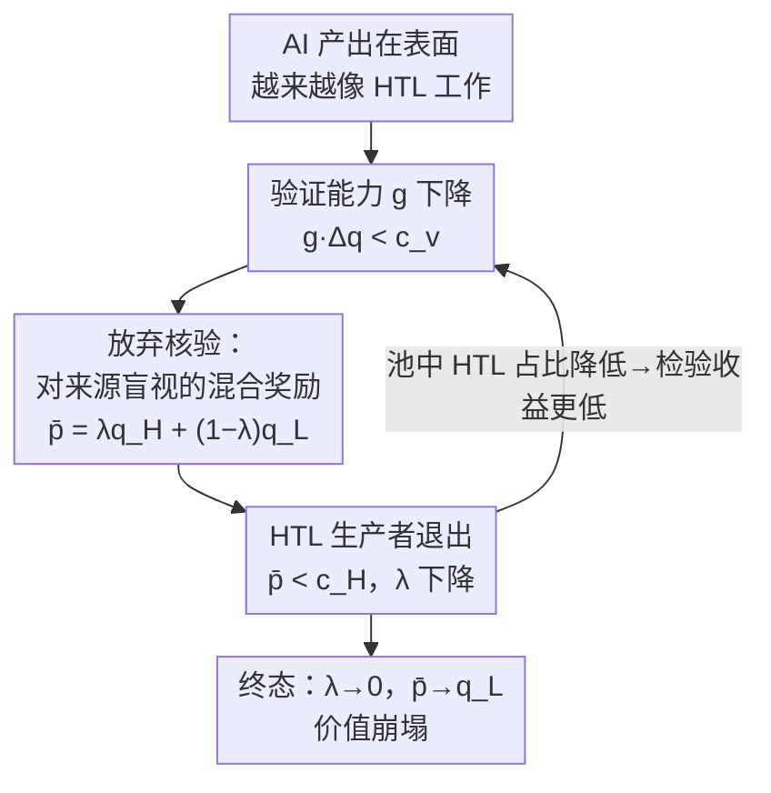

# Generative Models Erode Human Temporal Learning Through Market Selection

**会议**: ICML 2026  
**arXiv**: [2606.06572](https://arxiv.org/abs/2606.06572)  
**代码**: 无（理论 / 立场论文）  
**领域**: AI 安全 / AI 风险治理  
**关键词**: 生成模型风险, 逆向选择, 验证成本, 价值崩塌, 子AGI风险

## 一句话总结
这篇立场论文提出：在还没到 AGI 的当下，生成模型就已经通过"市场逆向选择"对知识与文化生产造成结构性风险——当 AI 产出在表面特征上越来越像需要长期人类学习才能完成的工作，评估者核验"这到底是不是真人长期积累的产物"的成本就高过了收益，于是奖励变得对生产方式"盲视"，投入多年学习的人被迫和几乎零成本的 AI 产出比价，最终被挤出市场。

## 研究背景与动机
**领域现状**：主流 AI 风险研究（Bostrom、Russell、Hendrycks 等）大多聚焦"AGI 失控"——超级智能、对齐失败、控制权丧失这类临界点之后的灾难。这条线把风险压在"能力足够强之后"。

**现有痛点**：这种叙事忽略了一个更近的问题——在跨过那些能力门槛之前，机器学习是不是**已经**给知识和文化生产带来了结构性风险？现实证据（学术发表灌水、法律 AI 伪造引用、内容平台、开源安全报告）显示侵蚀正在多个领域以不同速率发生，但缺一个统一的机制解释。

**核心矛盾**：历史上，"产出"之所以能当质量信号，是因为生产它需要长期学习投入（Spence 的信号理论），机构据此奖励这种隐含的时间投资。而生成模型恰恰能产出**表面上**像深度人类工作、却没有底层学习轨迹的东西——训练只优化"匹配观测到的产出"，产出背后的学习过程被彻底丢弃。这就让"用产出反推学习投入"这个长期成立的契约失效了。

**本文目标**：用一个经济学框架说清楚，为什么"区分 AI 产出与人类产出越来越难"会通过**普通市场动态**（而非任何恶意或失控）就导致深度人类工作被竞争性挤出；并把跨领域证据组织成可观察的阶段。

**切入角度**：作者引入 **人类时间性学习（Human Temporal Learning, HTL）**——通过长期反复接触问题而形成的、抗编码化的判断力与技能（Polanyi 的"默会知识"）。把问题重新表述成"评估者是否还在经济上值得去验证一份产出是不是 HTL 密集型工作"。

**核心 idea**：把生成模型风险建模成一个**带成本核验（costly-inspection）的逆向选择问题**——一旦"验证能力 × 质量差距 < 验证成本"，理性评估者就放弃核验，奖励对生产方式盲视，高成本的人类生产者退出，池子质量进一步下滑，形成"价值崩塌（value collapse）"的自我强化循环。

## 方法详解

### 整体框架
论文的"方法"不是某个模型或算法，而是一个把生成模型社会风险**形式化**的经济学框架，外加一套把跨领域现实证据归位的四阶段分类。整体逻辑是：先定义 4 个决定"要不要验证"的量（验证能力 $g$、验证成本 $c_v$、质量差距 $\Delta q$、HTL 占比 $\lambda$），给出一个验证阈值条件；当条件被打破，奖励机制退化为"对来源盲视"的混合定价，进而触发高成本生产者退出、池子质量下滑的反馈回环（价值崩塌）；最后用四阶段刻画现实中各领域处于侵蚀的哪一段。

整个机制是一个自我强化的负反馈回路，可以图示如下：

### 关键设计

**1. 人类时间性学习（HTL）与"学习轨迹被抹除"：把风险锚定到一个可丢失的东西上**

论文先立住分析对象：HTL 指通过长期反复接触问题积累的、抗编码化的判断与技能。它过去之所以有直接经济价值，是因为产出（论文、创作）浓缩了长学习轨迹，机构把这种时间投资当质量代理（funding 偏好长发表记录、招聘看多年训练）。生成模型的破坏性在于：训练只优化"匹配观测到的产出"，**学习轨迹在过程中彻底掉出**——格式、修辞结构、引用模式、风格连贯性都越来越容易复刻，而表面核查已经无法分辨生产方式。要拿到同等保障，评估者必须做更深的核验（核对引用真伪、审计方法选择、检验推理是否经得起推敲），这直接抬高了每件产出的核验成本。

**2. 带成本核验的验证阈值：$g \cdot \Delta q \gtrsim c_v$ 是一切的开关**

这是框架的核心机关。作者把"该不该验证"压缩成四个量的博弈：验证能力 $g\in[0,1]$（核验能多可靠地把 HTL 密集产出和低 HTL 产出分开，0=完全分不开，1=精确识别来源）、验证成本 $c_v$（每件深度核验的专家时间）、质量差距 $\Delta q = q_H - q_L > 0$（HTL 产出与低 HTL 产出的期望收益之差）、HTL 占比 $\lambda$。当且仅当区分两类产出的期望收益超过尝试成本时，验证才划算：

$$g \cdot \Delta q \gtrsim c_v \quad\Longleftrightarrow\quad g^* \approx \frac{c_v}{\Delta q}.$$

低于阈值 $g^*$，理性评估者直接放弃验证。这一步的关键洞察是：生成模型主要从两端施压——**把 $g$ 压低**（产出更逼真、更难分辨来源）、把 $c_v$ 抬高（要更深核验），于是即使每件 AI 产出局部上更好，整体也更容易跌破阈值。

**3. 价值崩塌：混合奖励 → 逆向选择的自我强化回环**

一旦评估者停止区分，奖励就只盯池子的平均质量。设深度人类工作占池子比例 $\lambda$，则混合奖励（竞价场景里是平均价格，期刊/平台里是来源盲视下的期望奖励）为

$$\bar p = \lambda q_H + (1-\lambda) q_L.$$

当 $\bar p$ 能覆盖 AI 生成成本、却低于深度人类工作成本 $c_H$ 时，投入长期学习的人无法回本而退出；HTL 占比 $\lambda$ 下滑又把 $\bar p$ 拉得更低，边际生产者最先退场，循环持续。这正是经济学里的**逆向选择（adverse selection）**（Akerlof 的"柠檬市场"）：分不清质量 → 高成本生产者退出 → 池子质量下降。论文进一步点出"对齐与之正交"——更好的对齐让模型少犯明显错误、更规范地用引用，反而**缩小了可观察差距**、压低 $g$，加剧对 HTL 工作的竞争挤压，即便单个 AI 产出在变好。

### 一个完整示例
以学术发表为例走一遍机制：生成模型让论文的格式、引用、行文越来越像真人深度研究（$g$ 下降）；同行评审要核对每条引用、审计方法（$c_v$ 高），而 2020 年全球评审劳动已超 1 亿小时——在产量洪峰下逐条核验不可行。于是 ICLR 2026 的一份现场报告里，被检视的 300 篇中至少 50 篇含伪造引用，却拿到了 3–5 份专家评审而未被发现（$g \cdot \Delta q < c_v$ 被打破）。当评审无法可靠区分，奖励对来源盲视，认真做研究的人面对的是几乎零成本就能批量产出的灌水稿，逆向选择启动。

## 实验关键数据

这是一篇立场 / 理论论文，没有传统意义的实验，而是用**跨领域现实证据**把侵蚀程度归入四个阶段（按 $g\cdot\Delta q$ 与 $c_v$ 的关系排序）。

### 主"实验"：四阶段验证侵蚀

| 阶段 | 参数态势 | 代表领域 | 现实证据 |
|------|---------|---------|---------|
| Stage 1 完好 | $g\cdot\Delta q \gg c_v$ | 临床医学 | 患者安全使 $\Delta q$ 极高，医生复核仍是工作流必需，未塌成来源盲视接受 |
| Stage 2 惩罚维持 | $g\cdot\Delta q \ge c_v$ | 法律实务 | 法院对 AI 伪造引用施加制裁、强制 AI 使用披露；不核验的代价高于核验成本，验证得以维持 |
| Stage 3 被产量压垮 | $g\cdot\Delta q < c_v$ | 学术发表 | CS 摘要中 LLM 改写内容从 2.4% 升到约 22.5%；NHANES 单因素分析论文出版率约暴增 47 倍，冗余 2022→2024 增 17 倍 |
| Stage 4 来源盲视 | $\Delta q \to 0$ | 内容平台 | 奖励按观看/点击/分享分配，不问生产方式；多平台虽加 AI 标注，但 YouTube/Spotify 声明披露不影响触达或变现，奖励结构基本不变 |

### 关键发现

| 维度 | 论文观点 |
|------|---------|
| 对齐正交性 | 对齐越好，可观察差距越小、$g$ 越低，反而加剧对 HTL 工作的挤压——对齐成功无法缓解价值崩塌 |
| 流水线压缩 | 即便高风险领域验证仍在，AI 自动化初级任务会让"积累高级判断力的经验路径"变窄：AI 暴露职业的初级岗就业相对下降 16%，大厂应届招聘 2023→2024 降 25% |
| 价值崩塌 → 模型崩塌 | HTL 生产者退出会让下一代训练数据越来越多来自上一代模型输出，侵蚀分布多样性，把价值崩塌的暴露面接到模型崩塌（model collapse）上 |

- **最核心的"啊哈"**：风险开关不是"AI 能力有多强"，而是"统计相似度 + 成本结构"——这是个与绝对能力解耦的、当下就已跨过的阈值。
- **治理着力点**：论文据此给出治理建议，目标是降低 $c_v$ / 维持 $\Delta q$ 可见性（如来源敏感的排序与变现规则），而非等待 AGI 门槛。

## 亮点与洞察
- **把"AI 风险"从能力叙事挪到市场机制叙事**：不需要失控、不需要恶意、不需要对齐失败，仅靠市场选低成本、平台追参与度、机构在资源约束下做理性决策，就足以触发结构性侵蚀。这个"无需任何坏人"的论证非常有力。
- **一个阈值统一了零散证据**：$g\cdot\Delta q \gtrsim c_v$ 把临床、法律、学术、平台四个看似无关的领域放进同一坐标轴，并解释了它们为何处在不同侵蚀阶段——可迁移到任何"产出当质量信号"的市场分析。
- **"对齐正交"是反直觉但锋利的判断**：业界默认"对齐做得越好越安全"，本文指出对齐让 AI 更难与人区分，反而压低验证能力 $g$，为一类被忽视的风险提供了清晰反例。

## 局限与展望
- **作者承认**：把生产模式压缩成 HTL / 低 HTL 两类是为可解性做的简化，现实是连续谱；形式化处理放在附录，正文以机制透明优先。
- **证据是观察性的、非因果**：四阶段用的是跨领域相关性证据（出版率暴增、伪造引用比例等），框架本身是定性 + 简单博弈模型，没有可证伪的定量预测或对照实验，难以排除其他混杂因素（如纯产量增长、平台政策变化）。
- **缺乏干预评估**：治理建议（维持 $\Delta q$ 可见、降低 $c_v$）未给出可操作的量化效果，后续可在某个领域（如某期刊的来源敏感评审）做准实验验证阈值模型。
- **参数难测量**：$g, c_v, \Delta q$ 在真实领域中如何稳定估计是开放问题，论文只给了"检测失败率/审计结果可作经验代理"这类粗略指引。

## 相关工作与启发
- **vs AGI 失控派（Bostrom / Russell / Hendrycks）**：他们押注能力门槛后的灾难，本文押注"子 AGI、当下、普通市场动态"这条正交轴，互为补充而非替代——并指出今天 HTL 能力的侵蚀会削弱未来治理更强系统的人类储备。
- **vs 模型崩塌（Shumailov 等）**：模型崩塌讲"反复用模型生成数据训练导致分布退化"，本文的价值崩塌讲"经济动态把人类生产者挤出池子"，并论证前者是后者的下游后果——价值崩塌通过改变池子成分增加了模型崩塌的暴露面。
- **vs 信号 / 柠檬市场理论（Spence / Akerlof）**：直接复用质量不确定下的信号与逆向选择经典模型，把"教育/产出当信号"的老框架套到"生成式 AI 抹除学习轨迹"的新情境，是一次干净的理论迁移。

## 评分
- 新颖性: ⭐⭐⭐⭐⭐ 把生成模型风险重构为成本核验下的逆向选择，提出"价值崩塌"并论证"对齐正交"，视角独到
- 实验充分度: ⭐⭐⭐ 立场论文，仅有跨领域观察性证据和简单博弈模型，无对照实验或可证伪定量预测
- 写作质量: ⭐⭐⭐⭐⭐ 机制清晰、阈值统一证据、四阶段叙事有力，论证链条干净
- 价值: ⭐⭐⭐⭐⭐ 为被主流忽视的"子 AGI 当下风险"提供了可分析的框架与治理着力点

<!-- RELATED:START -->

## 相关论文

- [\[CVPR 2026\] Towards Human-Imperceptible Backdoor Attacks on Text-to-Image Diffusion Models](../../CVPR2026/ai_safety/towards_human-imperceptible_backdoor_attacks_on_text-to-image_diffusion_models.md)
- [\[CVPR 2026\] RunawayEvil: Jailbreaking the Image-to-Video Generative Models](../../CVPR2026/ai_safety/runawayevil_jailbreaking_the_image-to-video_generative_models.md)
- [\[CVPR 2026\] PROMPTMINER: Black-Box Prompt Stealing against Text-to-Image Generative Models via Reinforcement Learning and VLM-Guided Optimization](../../CVPR2026/ai_safety/promptminer_black-box_prompt_stealing_against_text-to-image_generative_models_vi.md)
- [\[CVPR 2026\] WaTeRFlow: Watermark Temporal Robustness via Flow Consistency](../../CVPR2026/ai_safety/waterflow_watermark_temporal_robustness_via_flow_consistency.md)
- [\[ICCV 2025\] Vulnerability-Aware Spatio-Temporal Learning for Generalizable Deepfake Video Detection](../../ICCV2025/ai_safety/vulnerability-aware_spatio-temporal_learning_for_generalizable_deepfake_video_de.md)

<!-- RELATED:END -->
