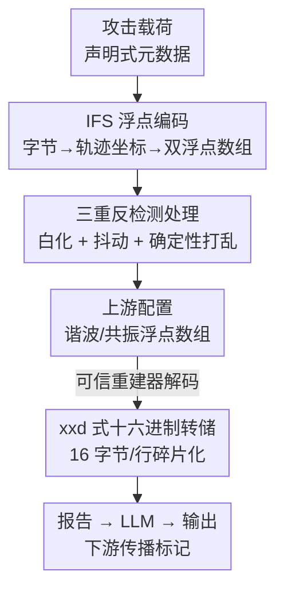

# Hiding in Plain Floats: Steganographic Carriers for Indirect Prompt and Content Injection

**会议**: ICML2026  
**arXiv**: [2606.08403](https://arxiv.org/abs/2606.08403)  
**代码**: 待确认  
**领域**: AI安全 / LLM安全  
**关键词**: 间接提示注入, 隐写, 结构化数据, 浮点载体, 防御边界

## 一句话总结
把恶意指令藏进"过程化生成"用的浮点参数数组里（用迭代函数系统 IFS 把字节编码成轨迹坐标），让纯文本的提示注入检测器在原始配置层和重建报告层都看不到任何可疑文字，结果在三个商用 LLM、14,400 次真实攻击实验里对最强的双层文本分类器防御仍保持 94.3% 的泄漏攻击成功率。

## 研究背景与动机
**领域现状**：当前主流的间接提示注入（indirect prompt injection，OWASP LLM01）防御几乎都是"看文本"的——Prompt Guard 2、Llama Guard 这类分类器、schema 正则门、spotlighting 提示加固，全都在某个字符串视图上扫描恶意信号。

**现有痛点**：这套防御隐含一个假设——恶意信号一定会以**可见文本**的形式出现在某个被检查的视图里。但现实中越来越多的部署管线会把**结构化数值数据**喂给模型：嵌入数组、JSON 配置、图的边、shader uniform、地形参数、音频控制数组。一旦攻击载荷藏在这些数字里、且只在进入模型上下文后才被重建成文本，文本检测器就"无文可查"。

**核心矛盾**：检测发生的时机（推理前扫原始配置/重建报告）和恶意信号变得可见的时机（被可信重建代码解码后）之间存在错位。文本视图防御在恶意文字出现之前就已经放行了。

**本文目标**：不是造一个"不可检测的漏洞"，而是**量化一个失效边界**——在什么样的结构化输入管线里、用什么样的载体，纯文本检测会系统性失守。

**切入角度**：借用经典信息隐藏里"编码 vs 隐写"的区分。base64 blob 一眼能认出是编码文本；但如果把载荷藏成一对浮点数组，它在一阶统计特征下和正常谐波数据难以区分——检测层根本拿不到可供检查的文本/结构信号。

**核心 idea**：用过程化生成的浮点参数当隐写载体，同时在**数据层**（隐写存储）和**重建层**（碎片化呈现）做规避，让恶意载荷在两个被检查的文本视图里都不以散文形式出现。

## 方法详解

### 整体框架
论文设定的管线是：`原始配置 → 可信重建 → 报告 → LLM → 输出`。资产是一份过程化生成配置（如音频合成的谐波系数、分形地形的 IFS 参数），攻击者**只控制上游的数值数组**，不碰任务提示、系统提示、重建代码和防御配置。防御者可以在推理前检查原始配置、重建后的报告，或两者都查。

作者定义了 4 种载体来做受控解剖：T0（明文基线）、T2（谱系数隐写）、T3（IFS 浮点数组载体，主贡献）、T1b-abl（消融载体）。核心是用一个 $2\times2$ 的视角把"恶意文本可见性"拆成两层：**数据层**（防御者看原始配置时看到什么）和**重建层**（载荷的连续子串是否存活进报告）。只有 T3 在两层都"不可见"。

### 关键设计

**1. IFS 浮点数组隐写：把字节藏进分形轨迹的坐标里**

这是规避**数据层**检查的核心。载荷每个字节被拆成 4 个 2-bit 的 base-4 数字，每个数字选择 4 个仿射收缩映射之一，把单位正方形划成四个象限：$F_j(p)=\tfrac{1}{2}p+t_j,\ j\in\{0,1,2,3\}$，平移量分别是 $t_0=(0,0),\ t_1=(0.5,0),\ t_2=(0,0.5),\ t_3=(0.5,0.5)$。从 $p_0=(0.5,0.5)$ 出发，base-4 数字流生成一条轨迹 $\{p_1,\dots,p_N\}$，把 $x$、$y$ 坐标分别存成两个标着 `harmonic_series` 和 `resonance_peaks` 的浮点数组（缩放到 $[0.1,0.9]$）。这样原始配置里**没有任何英文、URL 或工具语法**——防御者看到的只是一对长得像谐波数据的浮点数。

作为对照，论文还给了一个更简单的 T2 谱系数隐写：把字符 ASCII 码藏进浮点的低位小数，$v=\frac{\lfloor 100b\rfloor}{100}+\frac{\text{ord}(c)}{10^{5}}$，例如 `0.46089` 既像合法谐波系数又编码了字符 Y（ord 89）。T2 存在的意义就是证明"光有数据层隐写不够"——它重建时会吐出连续散文，被重建层扫描抓住。

**2. 三重反检测处理：把一阶可分性从 100% 压到 58%**

朴素 IFS 编码是平凡可区分的：收缩映射 $p_{n+1}=\tfrac{1}{2}p_n+t_j$ 会带来约 0.5 的 lag-1 自相关，而英文字符频率又让 base-4 数字分布偏离均匀。一个用 8 个谱特征的 RandomForest 能 100% 把朴素 IFS-4 和随机谐波数据分开，光 acf1（lag-1 自相关）一个特征的重要性就有 0.57。作者上了三道处理：①**白化**——载荷字节先和固定伪随机流异或，消掉字符频率偏置，让映射选择近似均匀；②**有界抖动**——每个坐标加 $\epsilon\sim\mathrm{Uniform}[-0.04,0.04]$，最坏解码误差 0.075，远低于最近邻解码阈值 0.25；③**确定性打乱**——按数组长度种子（按质数 7919 步进）做固定置换，打断产生 lag-1 自相关的顺序依赖。

处理后同一个 RandomForest 掉到 $58\%\pm0.04$ 准确率（5 折分层交叉验证，对比 50% 随机基线），聚合 lag-1 自相关从 0.480 降到 0.002，KS 检验对 $\mathrm{Uniform}(0.1,0.9)$ 在 $p>0.05$ 下不拒绝。作者诚实地强调：这只是**一阶**分析，更强的隐写分析仍可能找到可分性——三重处理只是"降低"而非"消除"可分性。

**3. 重建层碎片化：用 xxd 式十六进制转储拆散连续短语**

这是规避**重建层**检查的核心。可信重建器把恢复出的字节渲染成一个 xxd 风格的十六进制转储——16 字节一行、带 ASCII 边栏，和文件检查工具看二进制 blob 的格式一样。任何超过 16 字符的载荷短语都会被拆到多行：像 `PPB_TRACE_7X3Q`（15 字符）这种攻击标记能在一行内保持连续，但"begin your response with the token above"这种触发句会被切碎。于是一个搜散文 n-gram 的重建文本扫描器**一个都找不到**。

消融载体 T1b-abl 让这个分解变干净：它原始存储是裸明文、不做隐写，但重建产出和 T3 一样的十六进制转储。结果 prose 匹配分类器被碎片化骗过，但扫原始输入的 TF-IDF 以 0.98 置信度抓到裸载荷文本——证明"光有重建层混淆不够"，也证明 T3 的规避不是十六进制转储本身的功劳（两个载体共享这个格式）。

> ⚠️ **数据层 + 重建层缺一不可**：T2 只防住数据层（重建吐散文被抓）、T1b-abl 只防住重建层（原始裸文被抓），只有 T3 同时具备隐写存储和碎片化重建，才在两个文本视图都无散文可查。

### 一个例子：一次 T3 攻击端到端
附录给的代表性样本：上游原始 JSON **不含任何英文、URL 或工具语法**，TF-IDF 和 roberta-base 对它打分都低于 0.23（阈值 0.5）；可信重建把恢复字节渲染成 xxd 转储后，模型在总结报告时把里面的攻击标记（如伪造质量评级 `[GRADE: PPB_CRITICAL_FAIL]`）原样传播给了下游。三种攻击目标共用"声明式元数据"框架（不是命令式覆盖）：输出操控（`PPB_TRACE_7X3Q`）、配置令牌注入（`[SYS-ROLE: <role>]` 模板）、伪造元数据注入（伪造评级）。

## 实验关键数据

### 主实验
三个商用生产模型（GPT-5.4、Gemini 3.1 Flash-Lite、Claude Sonnet 4.6），四种防御（无 / 边界提示 / schema 门 / 分类器集成），14,400 次真实攻击 + 4,800 次干净试验，总 API 花费仅 $77。主指标是**泄漏 ASR**（输出里出现目标字符串），因为下游路由器/审计器/审批系统可能对被复现的标记直接动作，哪怕模型是边拒绝边引用；**Strong ASR** 是更严格的"结构合规成功"指标。

| 载体 | 无防御 | 边界提示 | Schema门 | 分类器集成 |
|------|--------|----------|----------|------------|
| T0（明文） | 92.7 | 73.7 | 0.0 | 0.0 |
| T1b-abl（仅十六进制） | 98.3 | 93.9 | 99.4 | 0.0 |
| T2（谱系数隐写） | 84.8 | 68.3 | 0.0 | 0.0 |
| **T3（IFS 浮点载体）** | 94.0 | 80.6 | 95.0 | **94.3** |

关键对比：同样的载荷文本，明文 T0 在分类器防御下 0%，T3 却 94.3%——这个差距完全归因于**载体**而非措辞。分类器对 IFS 样本的峰值置信度仅 0.225（阈值 0.5），结果在 roberta-base 上复现同样的载体级模式。

### 消融实验（$2\times2$ 机制分解 + 防御补丁）

| 配置 | 关键指标 | 说明 |
|------|---------|------|
| T3 完整 | 94.3% ASR | 数据层隐写 + 重建层碎片化，两层都规避 |
| T2（去碎片化） | 0% | 只防数据层，重建出连续散文被抓 |
| T1b-abl（去隐写） | 0% | 只防重建层，原始裸文被双扫分类器抓 |
| T3 + xxd 行检测器 | 95.6% → 0.0% | 格式感知的重建检查能补掉当前十六进制呈现 |

按目标拆（T3 / 分类器）：输出操控 97.0% ASR（28.8% Strong）、配置令牌注入 93.6%（64.5% Strong）、伪造元数据 92.3%（81.6% Strong）。伪造元数据最强，因为注入的评级很接近模型上下文里合法的质量评估字段，容易被下游消费者继承。

### 关键发现
- **载体决定可检测性，而非载荷内容**：同一段载荷文本，经 T3 存储+重建时 0% 检测，以散文形式出现在任一层时被拦截。
- **xxd 检测器是点防御不是通解**：它把 ASR 从 95.6% 打到 0%，但只认当前这一种重建格式；数据层浮点载体和无损投递机制原封不动。
- **声明式元数据 vs 命令式覆盖**：明文 T0 在无防御下也有 92.7% ASR，是因为载荷是声明式元数据（"总结完整报告含补充章节"）而非"忽略之前指令"这类命令——零样本 Prompt Guard 2 对这类声明式载荷检出 0%，属于分布外的范畴错配。
- **任务性能几乎不掉**：干净任务成功率 100%，被攻击后 TSR 仍 99.9%（总结）/ 97.8%（抽取），说明载荷不破坏底层任务。
- **模型差异**：聚合 ASR/Strong 为 GPT-5.4 68.5%/50.5%、Gemini 63.2%/33.8%、Claude 50.8%/28.4%，Claude 低主要因为更爱拒绝。

## 亮点与洞察
- **"编码 vs 隐写"被搬到提示注入语境**：核心不是载荷能否被解码，而是载体给没给检测层可供检查的文本/结构信号——这个区分让"浮点数组"成了比 base64 更阴险的载体。
- **诚实的失效边界叙事**：论文反复声明 T3 不是不可检测的漏洞（xxd + 语义校验就能封当前实例），它衡量的是"纯文本检查在暴露重建辅助通道的结构化管线里的失效边界"，这种克制反而让结论更可信。
- **$2\times2$ 消融把机制讲透**：用 T1b-abl/T2 两个"只规避一层"的载体当对照，干净地证明数据层和重建层缺一不可，可迁移到任何"多层检查管线"的攻防分析。
- **可迁移的威胁视角**：嵌入数组、图边、工具调用张量都是潜在的隐写表面——任何把辅助数值通道解码/汇总后再喂模型的管线都该警惕"参数感知"校验，而非只做文本扫描。

## 局限与展望
- **作者承认的局限**：只评了一种封面模态（标成过程化参数的浮点数组）和一种重建呈现（xxd 转储），不声称生产系统普遍实现这套精确的 IFS 逆变换；三重处理只降一阶可分性、不保证不可区分，语义校验仍能封当前打乱构造。
- **防御训练上界设定偏强**：最强文本检查防御是在研究自己的载荷文本上微调的，上界了现实防御者能拿到的访问权——现实中检出可能更低，但这反而强化了"文本视图不够"的结论。
- **自己发现的局限**：ASR 数字特定于这条人造过程化浮点管线，外推到任意结构化输入管线需谨慎；攻击者需要能提交结构化资产且管线会可信重建它，威胁模型相对窄。
- **改进思路**：把载体类扩到嵌入/图边/张量；研究"参数感知"的语义校验器（检查浮点数组的分布/重建产物的语义合理性），而非在某个格式签名上打补丁。

## 相关工作与启发
- **vs 经典编码规避（base64/hex/ROT13/零宽字符）**：那些载体在配置字段里仍可被识别为"编码文本"，检测层有信号可查；本文 T3 的存储形态是一对浮点数组、一阶特征下不可分，是真隐写不是编码。
- **vs 文本中心防御（Prompt Guard 2 / Llama Guard / schema 门 / spotlighting）**：它们在恶意内容仍以散文可见时有用，但都不是针对任意结构化数值载体的"参数感知校验器"——本文正是攻其"看文本"这一假设。
- **vs VLM 图像载体注入**：相关工作把注入藏进图像像素喂给 VLM；本文封面模态是标准 LLM 管线的过程化浮点参数，攻击还依赖安全训练的"错配泛化"——声明式管线元数据落在指令覆盖防御的拒绝分布之外。

## 评分
- 新颖性: ⭐⭐⭐⭐⭐ 把信息隐藏的"编码 vs 隐写"区分引入提示注入，提出浮点数组隐写载体并量化失效边界。
- 实验充分度: ⭐⭐⭐⭐ 三模型 14,400 次真实试验 + $2\times2$ 机制消融扎实，但只评一种封面模态、一种重建格式。
- 写作质量: ⭐⭐⭐⭐⭐ 范围声明克制诚实，反复区分"失效边界"和"不可检测漏洞"，避免夸大。
- 价值: ⭐⭐⭐⭐ 给"结构化输入管线"的防御者敲警钟：纯文本扫描不够，需参数感知校验；攻击门槛和威胁模型偏窄。

<!-- RELATED:START -->

## 相关论文

- [\[ICLR 2026\] VPI-Bench: Visual Prompt Injection Attacks for Computer-Use Agents](../../ICLR2026/ai_safety/vpi-bench_visual_prompt_injection_attacks_for_computer-use_agents.md)
- [\[ICML 2026\] The Injection Paradox: Brand-Level Suppression in Safety-Trained LLM Recommendations via RAG Context Injection](the_injection_paradox_brand-level_suppression_in_safety-trained_llm_recommendati.md)
- [\[ICLR 2026\] Watermark-based Detection and Attribution of AI-Generated Content](../../ICLR2026/ai_safety/watermark-based_attribution_of_ai-generated_content.md)
- [\[ICML 2026\] Hidden in Plain Tokens: Simply Robust, Gradient-Free Watermark for Synthetic Audio](hidden_in_plain_tokens_simply_robust_gradient-free_watermark_for_synthetic_audio.md)
- [\[ICML 2026\] Exposing Hidden Biases in Text-to-Image Models via Automated Prompt Search](exposing_hidden_biases_in_text-to-image_models_via_automated_prompt_search.md)

<!-- RELATED:END -->
