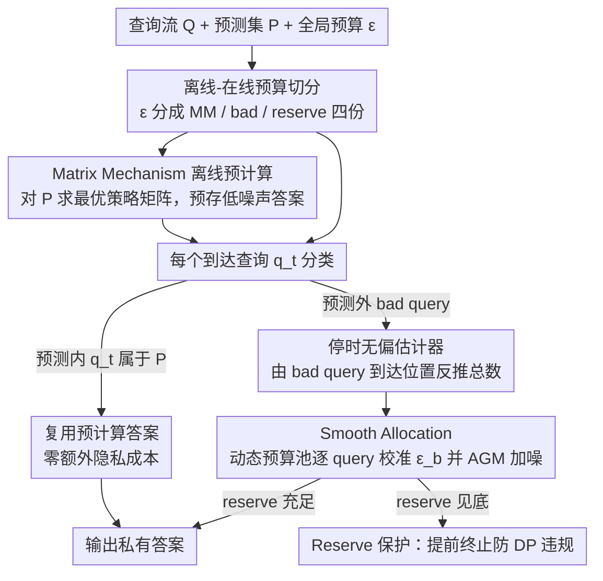

# LAPRAS: Learning-Augmented PRivate Answering for Linear Query Streams

**会议**: ICML 2026  
**arXiv**: [2605.01960](https://arxiv.org/abs/2605.01960)  
**代码**: 无  
**领域**: AI 安全 / 差分隐私 / 学习增强算法  
**关键词**: 差分隐私、线性查询、Matrix Mechanism、预测增强、预算分配

## 一句话总结
LAPRAS 用一个"哪些查询会来"的预测器把在线 DP 查询流分成预测内/外两类，预测内的用离线最优 Matrix Mechanism 一次性低噪释放，预测外的用 Smooth Allocation 根据流中已观测到的"未预测查询"位置在线估计总数并平滑分配预算，在预测准时几乎追平离线最优、预测差时退化到在线 baseline 水平。

## 研究背景与动机
**领域现状**：差分隐私 (DP) 是工业级数据分析的事实标准。**离线**场景下，给定固定工作负载 $\mathrm{W}$，Matrix Mechanism (MM) 可以利用查询间相关性设计最优策略矩阵，使总误差最小。但**在线**场景下，查询 $q_1, \dots, q_S$ 一个一个到达，每个都必须立即作答，而总预算 $(\varepsilon, \delta)$ 全局固定。

**现有痛点**：理论上已经证明在线 DP 比离线 DP 可能差**指数倍**——因为不知道未来查询是什么，机制只能保守地为每个查询少给点预算，加大噪声，最后数据几乎不可用。已有的 Private Multiplicative Weights、Privacy Odometers/Filters、CacheDP 等方案要么计算昂贵，要么是"被动"地缓存历史结果，无法主动利用未来工作负载结构。

**核心矛盾**：在线机制只看见过去，但实际工业系统（SCOPE、SQL Server、Azure SQL）的查询流 60%+ 是周期重复、90%+ 资源来自少量模板。这种**可预测性**是免费的先验，但传统 DP 算法没办法把"我猜下面要来这些查询"翻译成"我先把它们的低噪声答案算好"。

**本文目标**：设计一个**学习增强**的 DP 在线机制，给定预测集 $\mathrm{P}$ 满足：(i) 预测准时（高 overlap）逼近离线 MM 的效用；(ii) 预测全错时不比"独立 Gaussian 噪声"差；(iii) 全程满足 $(\varepsilon, \delta)$-DP；(iv) 解决预算分配的核心难题——不知道总共会来多少 bad query，怎么分预算。

**切入角度**：作者用一个看似显然但关键的假设——**查询到达顺序是均匀随机的**。这把"未知总数 $B$"问题变成了一个负超几何分布问题，从而能从前几个 bad query 的到达位置反推 $B$ 的无偏估计。

**核心 idea**：用预测集把流劈成两半，预测内用离线 MM、预测外用"停时无偏估计 + 平滑分配"在线发放预算。

## 方法详解

### 整体框架
LAPRAS 要解决的是在线 DP 查询流"必须按最坏情况保守分预算、噪声大到数据不可用"的困境。它的做法是借助一个预测集 $\mathrm{P}$ 把查询流劈成两类分开处理：落在预测集里的查询用离线最优的 Matrix Mechanism 预先算好低噪声答案、到达时直接复用，落在预测集外的"bad query"则在线发放预算。全局预算 $\varepsilon$ 被切成四份——$\varepsilon_{\text{MM}}$ 给预测集上的 Matrix Mechanism、$\varepsilon_{\text{badInit}}$ 给前 $T = \lceil \log^2 S \rceil$ 个 bad query 做热身、$\varepsilon_{\text{remBad}}$ 给后续 bad query、$\varepsilon_{\text{reserve}}$ 是安全缓冲。每个查询 $q_t$ 到达时分类：若 $q_t \in \mathrm{P}$ 直接从预计算结果里查（零额外隐私成本，靠 post-processing immunity）；否则按 Smooth Allocation 算出该花多少预算、用 Analytic Gaussian Mechanism (AGM) 加噪输出，若 reserve 跌破阈值 $\varepsilon_{\min}$ 则提前终止以避免 DP 违规。

### 关键设计

**1. 停时无偏估计器 $\widehat{B}$：在不知道总 bad 数的情况下估出总 bad 数**

在线 DP 最根本的痛点是不知道总共会来多少 bad query，只能按最坏情况 $S$ 给每个查询分预算，导致期望噪声膨胀到 $O(S^2)$ 量级。LAPRAS 用一个关键假设破局——查询到达顺序是均匀随机的，这把"未知总数 $B$"变成一个负超几何分布问题。具体地，当前 $b$ 个 bad query 中最后一个出现在流的第 $n$ 位时，就用 $\widehat{B}(b) = S \cdot \frac{b-1}{n-1}$ 反推总 bad 数，并在 $b = T = \lceil \log^2 S \rceil$ 时锁定估计值 $B_{\text{est}}$。论文基于 $Y \sim \mathrm{NHG}(S, G, T)$ 证明该估计无偏 $\mathbb{E}[\widehat{B}] = B$、方差上界 $O(B^2 / \log^2 S)$，集中速度足以驱动后续的预算分配。有了 $\widehat{B}$ 就能按真实 bad 数而非最坏情况分预算，期望噪声从 $O(S^2)$ 降到 $O(B^2)$。值得一提的是估计本身只看 bad query 的**到达位置**、不查询数据，因此不消耗任何额外隐私预算。

**2. Smooth Allocation：边走边校准的动态预算池**

锁定一个静态估计 $B_{\text{est}}$ 还不够鲁棒——如果早期 bad query 密度异常，Static Allocation 会被一次性锁死的错误估计长期拖累。Smooth Allocation 改为把 $\varepsilon_{\text{pool}} = \varepsilon_{\text{badInit}} + \varepsilon_{\text{remBad}}$ 当成一个动态池，每来一个 bad query 都重新校准。第 $b$ 个 bad query 到达时，先估计剩余 bad 数 $\widehat{B}_{\text{rem},b} = \max(1, \widehat{B}(b) - b)$，然后花费 $\varepsilon_b = \frac{\varepsilon_{\text{rem},b-1}}{\widehat{B}_{\text{rem},b} + 1}$（分母 $+1$ 防早期过支），剩余池更新为 $\varepsilon_{\text{rem},b} = \varepsilon_{\text{rem},b-1} - \varepsilon_b$。这个公式让 bad query 稀疏时每个能多花预算（$\varepsilon_b$ 增大）、密集时自动节省（$\varepsilon_b$ 减小防爆），论文证明 $\sum_b \varepsilon_b < \varepsilon_{\text{pool}}$（Lemma 4.5）从而 DP 预算守恒。相比 Static 在第 $T$ 个 bad query 处就把估计写死，Smooth Allocation 对预测偏差更稳。

**3. 离线-在线预算切分 + Reserve 保护：换效用又不漏预算**

Matrix Mechanism 的核心优势是利用 workload 相关性把方差摊薄，但只有把"确实会出现的查询"集中喂给它才能兑现这份效用。因此 LAPRAS 把预测集 $\mathrm{P}$ 用 $(\varepsilon_{\text{MM}}, \delta_i)$ 的 MM 离线求解最优策略矩阵 $\mathbf{A}$，结果 $W \mathbf{A}^+ \mathcal{K}(\mathbf{A}, x)$ 在 query 到达时直接复用、零隐私成本，这是预测准时逼近离线最优的来源。另一边要防的是预测全错的最坏情况：如果总 bad 数超出 $B_{\text{est}}$，每个超额 query 花 $\varepsilon_{\text{reserve}} / 2$ 然后 reserve 减半，跌破 $\varepsilon_{\min}$ 就停机。这种几何衰减保证即使预测把所有 query 全猜错也绝不泄漏过预算，配合 basic composition 与 post-processing immunity，整体仍是 $(\varepsilon, \delta)$-DP（Theorem 4.6）。

### 损失函数 / 训练策略
LAPRAS 是算法不是学习模型，无训练损失。理论效用界（Section 4）：$\sum_{q \in \mathcal{S}} \mathbb{E}[U_{\text{LAPRAS}}(q)^2] = O(\frac{B^2 \ln(1/\delta)}{\varepsilon^2}) + O(\sum_q \mathbb{E}[U_{\text{MM}}(q)^2])$，并保证 $\le c \cdot \sum_q \mathbb{E}[U_{\text{Online}}(q)^2]$（鲁棒性）。

## 实验关键数据

### 主实验
两个真实数据集 Adult、Gowalla，$\varepsilon = 1.0$，对比 OfflineMM 和独立 Gaussian 噪声 Online baseline：

| 数据集 | 场景 | OfflineMM (MAE) | Online | LAPRAS (本文) |
|--------|------|------|--------|------|
| Adult | 高 overlap ($\rho \approx 1$) | ~14 | 193.4 | 14.3 |
| Adult | 低 overlap ($\rho \approx 0$) | — | 186.5 | 201.8 |
| Gowalla | 高 overlap | ~17 | 181.2 | 17.1 |
| Gowalla | 低 overlap | — | 204.1 | 213.9 |

高 overlap 下 MAE **下降一个数量级**，低 overlap 下与 Online 在同一量级，consistency-robustness 折中得到实证支持。

### 消融实验
四种预算分配策略（Table 1）：equal / matrix-heavy / query-heavy / reserve-heavy。

| 策略 | $\varepsilon_{\text{MM}}$ | $\varepsilon_{\text{badInit}}$ | $\varepsilon_{\text{reserve}}$ | 适用场景 |
|------|----|----|----|----|
| equal | $\varepsilon/4$ | $\varepsilon/4$ | $\varepsilon/4$ | 通用 |
| matrix-heavy | $\varepsilon/2$ | $\varepsilon/6$ | $\varepsilon/6$ | 预测准 |
| query-heavy | $\varepsilon/6$ | $\varepsilon/3$ | $\varepsilon/6$ | 预测差 |
| reserve-heavy | $\varepsilon/6$ | $\varepsilon/6$ | $\varepsilon/2$ | 极度不确定 |

实验显示 matrix-heavy 在高 overlap 下效用最佳，但低 overlap 下严重退化；query-heavy 与 reserve-heavy 在低 overlap 下保护性更好——隐式承认实际系统需根据 overlap 先验调配置。

### 关键发现
- Smooth Allocation 比 Static Allocation 更鲁棒，尤其当 bad query 早期密度异常或 $B < T$ 时；Static 直接浪费 $\varepsilon_{\text{badInit}}$。
- $T = \lceil \log^2 S \rceil$ 的对数平方校准窗口是估计方差与预算浪费的 sweet spot；更小的 $T$ 估计方差爆炸，更大的 $T$ 暖身阶段预算全打水漂。
- 估计 $\widehat{B}$ 本身不消耗额外预算——只看 bad query 的**到达位置**，不查询数据。

## 亮点与洞察
- 把"工业系统查询流可预测"这件经验事实正式翻译成 DP 算法的可证明加速，是 learning-augmented algorithms 思想在隐私领域一个很干净的应用。
- 用停时估计器结合随机顺序假设，绕开了在线 DP 的根本难题"未知总数 $B$"，这个技巧可以迁移到其他在线预算分配问题（带宽分配、广告竞价中的隐私版本）。
- 一致性-鲁棒性的双向保证非常体面：预测准时拿离线最优，预测错时不丢分。这种"有则锦上添花、无则不亏"的属性正是 ML4Sys 类工作最重要的部署特征。

## 局限与展望
- 随机顺序假设在真实工作负载中并不总是成立——周期性 cron job 会带来强非均匀到达，可能破坏 $\widehat{B}$ 的无偏性。
- 预测集 $\mathrm{P}$ 怎么来不在本文范围内，但实际效果直接由 $\rho$ 决定；如何在线更新 $\mathrm{P}$、如何融合多预测器值得后续研究。
- 评测目前局限在 linear counting query 与两个数据集，扩展到 join、selectivity estimation 等复杂查询的有效性未知。

## 相关工作与启发
- **vs Private Multiplicative Weights (PMW)**：PMW 维持合成数据库可解任意查询但更新代价随域大小爆炸；LAPRAS 保持 MM 的低计算开销，专攻预算分配难题。
- **vs CacheDP**：CacheDP 是反应式——缓存历史查询答案，依赖历史冗余且有冷启动代价；LAPRAS 是主动式——用预测预先低噪释放未来查询，二者本质上正交。
- **vs Privacy Odometers/Filters**：odometers 只是描述性的隐私会计工具；LAPRAS 给出**处方性**的分配策略，告诉你怎么花、何时停。

## 评分
- 新颖性: ⭐⭐⭐⭐ 把 learning-augmented 思想接到在线 DP 是新方向，Smooth Allocation 算法干净。
- 实验充分度: ⭐⭐⭐ 两个数据集 + 四种策略，跨数据集泛化和真实工作负载验证还可以更强。
- 写作质量: ⭐⭐⭐⭐ 理论与算法清晰，定理证明完整。
- 价值: ⭐⭐⭐⭐ 对工业 DP 系统部署有直接价值，重复型查询负载本就是常态。

<!-- RELATED:START -->

## 相关论文

- [\[NeurIPS 2025\] Private Continual Counting of Unbounded Streams](../../NeurIPS2025/ai_safety/private_continual_counting_of_unbounded_streams.md)
- [\[ICLR 2026\] Skirting Additive Error Barriers for Private Turnstile Streams](../../ICLR2026/ai_safety/skirting_additive_error_barriers_for_private_turnstile_streams.md)
- [\[NeurIPS 2025\] Nearly-Linear Time Private Hypothesis Selection with the Optimal Approximation Factor](../../NeurIPS2025/ai_safety/nearly-linear_time_private_hypothesis_selection_with_the_optimal_approximation_f.md)
- [\[ICML 2026\] Private Learning with Public Feature Conditioning](private_learning_with_public_feature_conditioning.md)
- [\[ICML 2026\] PRISM: Gauge-Invariant Tangent-Space Differentially Private LoRA](prism_gauge-invariant_tangent-space_differentially_private_lora.md)

<!-- RELATED:END -->
