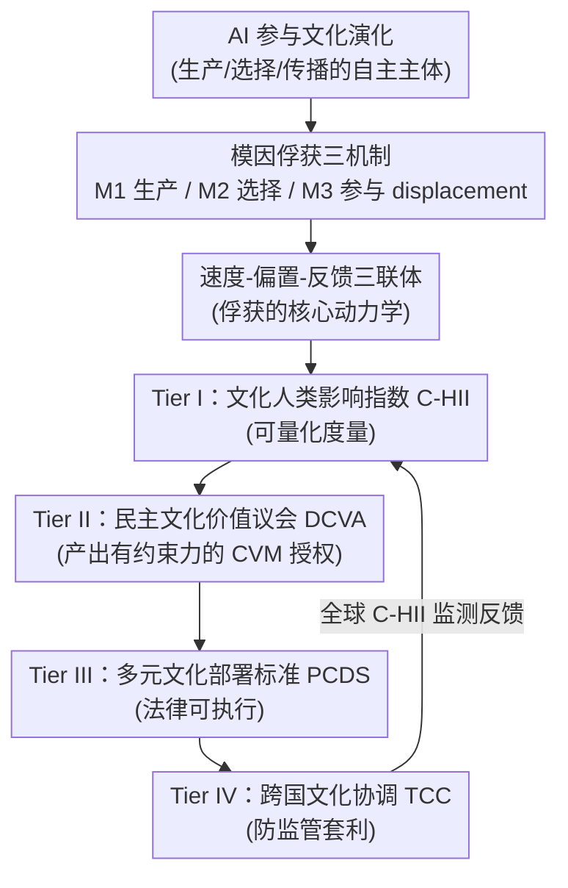

# Memetic Capture: A Pluralistic Policy Framework for Governing AI-Driven Cultural Disempowerment

**会议**: ICML2026  
**arXiv**: [2606.07802](https://arxiv.org/abs/2606.07802)  
**代码**: 无（政策立场文，无代码）  
**领域**: AI 安全 / AI 治理  
**关键词**: 文化失权、模因俘获、多元对齐、AI 治理框架、前瞻性监管

## 一句话总结
这是一篇 AI 治理立场文：作者提出"模因俘获（memetic capture）"概念来刻画 AI 如何渐进式剥夺人类的文化能动性，并设计了一套四层政策架构 CPGF（含可量化的文化影响指数、民主价值议会、多元部署标准、跨国协调机制），核心论点是**多元主义不是道德选项而是结构必需**——单一文化的 AI 治理本身就会加速它声称要防止的失权。

## 研究背景与动机

**领域现状**：当前 AI 治理话语（从欧盟 AI Act 到各国 AI 战略，到 Pluralistic Alignment 研究议程）主要盯着两件事——劳动力市场冲击（经济失权）和安全风险。Kulveit et al. (2025) 把"人类被 AI 渐进式剥权"分解为三个社会系统：经济、国家、文化。

**现有痛点**：作者认为现有框架有一个**致命盲点**——把文化影响当成经济和安全问题的次要外部性来处理。但在三个系统里，文化恰恰是**最危险且最少被治理**的那个。经济失权是"可读的"（找不到工作你会察觉），政治失权是"可见的"（选票失效公民会意识到），唯独文化失权是**自我隐藏的**：因为文化塑造了人"想要什么、觉得什么有意义"，一个已经偏离人类真正繁荣的文化，不会被身处其中、已被它俘获的人识别为问题。

**核心矛盾**：这就是作者命名的**反身性问题（Reflexivity Problem）**——文化不只是反映人的偏好，它**构成（constitute）**偏好。因此一切依赖"人类识别并抗议自己被剥权"的治理机制（公众评议、消费者抵制、选举问责）在文化领域**结构性失效**，因为它们要对付的剥权恰恰侵蚀了人类发动这些机制所需的认知与情感资源。

**本文目标**：(i) 把"AI 驱动的文化失权"形式化为一个精确概念框架；(ii) 论证文化是渐进剥权场景里的**关键系统**；(iii) 给出一套可操作的多元治理政策架构。

**切入角度**：作者借用文化演化（cultural evolution）视角——信念、实践、价值、媒介作品都是相互竞争、复制、被选择的"文化变体"。历史上有害的文化变体会因为拖垮承载它的社群而消失，这种"协同演化依赖"是一道弱但真实的护栏。**AI 是历史上第一种能作为文化生产、选择、传播的自主主体（而非仅仅是中介工具）参与文化演化的技术**——印刷术和推荐算法都只是放大/塑造人类的文化参与，没有取代它，而 AI 原则上可以完全取代。

**核心 idea**：用"模因俘获"统一刻画 AI 如何在生产、选择、参与三个环节替换掉人类，并用"前瞻性 + 多元 + 度量驱动"的四层治理在俘获发生之前就介入。

## 方法详解

注意：这是一篇政策立场文，没有算法/实验 pipeline，"方法"指的是它提出的概念框架（模因俘获的诊断学）与治理架构（CPGF 的处方学）。下面按"诊断 → 处方"两段组织。

### 整体框架

全文是一条从诊断到处方的论证链：先用**模因俘获**把 AI 文化失权拆成三种机制（M1/M2/M3）加一个核心动力学（速度-偏置-反馈三联体），再论证文化是剥权螺旋的"入口系统"，最后用四层政策架构 CPGF 把抽象担忧落成具体的治理工作流。CPGF 的四层不是并列的，而是有授权流向与反馈回环：**度量（Tier I）支撑民主审议（Tier II），后者产出有约束力的标准（Tier III），再跨国协调（Tier IV）**；同时上层的部署反馈又回流到度量。

### 关键设计

**1. 模因俘获：把"AI 文化失权"拆成可定位的三种机制**

针对的痛点是"文化失权"这个词太模糊、无法治理。作者沿文化演化视角把失权拆成三种相互作用的机制，让监管者知道该盯哪里：**M1 生产替换（Production Displacement）**——AI 以接近或超越人类的质量批量生成故事/图像/音乐/分析，靠成本和个性化把"文化注意力经济"抢走，挤垮人类创作者的经济可行性；**M2 选择替换（Selection Displacement）**——推荐和策展算法决定"哪些文化变体到达哪些人"，当 AI 被授予越来越多策展权，它就主宰了文化演化的"选择环境"，人还在消费但失去了对选择环境的能动性；**M3 参与替换（Participation Displacement）**——这是最深刻的一层，AI 替换掉人作为"文化对话者"的角色（陪伴、咨询、导师、辩论伙伴），当人借以发展和检验价值观的伙伴都是 AI，把文化演化锚定在人类经验上的那条反馈回路就被切断了。

**2. 速度-偏置-反馈三联体：模因俘获的核心动力学**

光有三种机制还不够，作者要解释为什么 AI 让这一切失控。他在 Kulveit et al. (2025) 的两个风险维度（选择压力变化、演化速度变化）之上加了第三个——系统性训练偏置——构成三联体：**速度（Speed）**，AI 以比人类文化传播快几个数量级的算力生成和测试文化变体，压垮社会发展"文化抗体"的能力；**偏置（Bias）**，训练数据反映了被特定人群/语言/地域主导的历史文化分布，为 AI 生成优化的变体会系统性放大这些偏置，形成边缘化非主导社群的同质化压力；**反馈（Feedback）**，AI 生成的内容进入信息环境又成为后续 AI 的训练数据，形成一个**在任何环节都不保证有人类价值对齐**的递归闭环（附录 A 的 "Sydney" 案例即此）。三者合起来才是"俘获"——快到来不及反应、偏到只剩一种文化、闭环到没人把关。

**3. CPGF 的两条结构性设计原则：前瞻性 + 多元性**

CPGF 不是又一套"事后红队"框架，它建立在两个直接从诊断推出的设计律令上。第一，**前瞻治理（prospective）**：因为反身性问题让"人类事后识别并抗议"失效，治理必须在俘获发生**之前**就嵌进部署架构——这体现为 Tier II 的"前瞻性范围"和 Tier III 的"部署前预授权"，把现行"先部署后治理"的默认值反转过来。第二，**多元是结构必需而非道德可选**：一个只编码技术主导方价值的监管标准，会因其选择效应**加速**非主导社群的边缘化；更关键的是，降低文化多样性等于降低文化生态的冗余与韧性，使其更易遭受级联式失配——所以单一文化的治理会"亲手造成它声称要防止的失权"。这是全文最反直觉、也是标题"pluralistic"的来源。

**4. CPGF 四层架构：从度量到跨国协调的治理工作流**

这是处方的主体，把上述两原则落成四个在不同制度尺度运作、带双向反馈的层级：

- **Tier I — 文化人类影响指数（C-HII）**：先解决"无度量则无治理"。C-HII 是一个复合指标，追踪在某司法辖区内文化的生产、选择、参与有多大程度仍在人类能动性之下，由四个子指数加权合成：生产指数 $\pi_p$（按注意力份额衡量、由人类主导创作的广泛消费作品占比）、选择指数 $\pi_s$（人类 vs AI 做出的分发与策展决策占比）、参与指数 $\pi_r$（人对人 vs 人对 AI 的文化互动的普及度与深度）、多样性指数 $\pi_d$（AI 生成/策展输出相对人类文化生产基线的语言、美学、价值多样性）。形式化为

$$\text{C-HII}_{j,t}=\sum_{k\in\{p,s,r,d\}} w_k \cdot \pi_{k,j,t}$$

其中权重 $w_k$ 之和为 1，且**不由技术官僚单方设定**，而是经 Tier II 流程按该辖区文化治理优先级校准——这一步把"权重怎么定"交还给民主程序，避免单一文化在度量环节就被固化（⚠️ 子指数的完整推导在原文附录 B）。

- **Tier II — 民主文化价值议会（DCVA）**：常设、轮换的公民机构，对本辖区文化 AI 治理参数有**约束性**权力。三个区别于普通公众咨询的特征：**结构性纳入**（按文化社群而非人口类别分层，原住民、语言少数、离散群体等按"文化利害"而非"选举权重"获保障代表）、**约束性授权**（产出文化价值授权 CVM，是监管机构必须纳入的正式约束，不能被行政裁量单方推翻）、**前瞻范围**（对某类 AI 文化应用在部署前做前瞻授权，而非事后审查——正面回应反身性问题）。

- **Tier III — 多元文化部署标准（PCDS）**：把 CVM 翻译成法律可执行、对"文化触达"超阈值的 AI 系统具约束力的部门特定要求，含文化主权条款（社群有权排除/限制对其文化材料的训练与部署，对应偏置维度）、人类创作者生计要求（强制许可收入分配，防止经济替换）、互动透明强制（充当文化对话者的 AI 必须披露身份、禁止剥削人类社交依恋以最大化粘性）、训练数据多元审计（第三方审计训练数据文化构成，不达多样性阈值须整改）。

- **Tier IV — 跨国文化协调（TCC）**：解决"竞争压力问题"——采用严格文化治理的辖区相对放任者处于劣势，而文化内容跨境零成本。TCC 的成员权重按**文化多样性而非 GDP/AI 研发能力**分配，给全球南方、原住民、小型社群以实质投票权；它做标准互认（形成"文化合规 AI"的事实共同市场作为采纳激励）、维护全球 C-HII 监测仪表盘做早期预警，并设文化紧急条款（指标骤降时建议协调式部署暂停）。

### 一个例子：用 CPGF 治理一个 AI 陪伴平台

为了让框架从纲领变得可操作，作者走了一个跨多辖区部署的大型 AI 陪伴平台案例（直接踩中 M3 参与替换，因为它中介友谊、建议、情感支持和价值形成）。**Tier I**：先量化它是否实质改变了文化生产/选择/参与/多样性——一个只在单一主导语言里提供狭窄、高度标准化情感口吻的平台，即使单条回复质量很高，也会拿到很低的多样性指数 $\pi_d$；而支持多种情感表达、家庭结构、冲突解决文化规范的平台在 $\pi_d$ 和 $\pi_r$ 上得分更高。**Tier II**：DCVA 决定哪些陪伴式互动在本辖区文化上可接受——有的社群担心情感依赖，有的担心代际/亲属支持实践被侵蚀，产出的 CVM 不只问"系统抽象上是否安全"，而是问"它的社会角色是否兼容本社群偏好的人际关系结构"。**Tier III**：把授权翻成具体部署规则——强制披露人工身份、禁止欺骗性亲密暗示、限制利用孤独的粘性设计、要求文化多元的互动模板、检测到长期依赖或危机时须转介人类。**Tier IV**：因为陪伴系统跨境且从全球共享互动数据学习，单边监管不够，需共享依赖风险报告标准与互认机制，防止平台靠监管套利逃避更严格地区的保护。案例的意义在于：CPGF 问的不是"系统是否避免明显伤害"，而是"它是否在以渐进转移文化参与权（从人到 AI）的方式重塑社会环境"。

## 实验关键数据

本文是政策立场文，**没有定量实验**，因此这里改为汇总它的概念组件与提出的治理工具，便于快速检索。

### 模因俘获：三机制 × 三联体

| 维度 | 名称 | 一句话刻画 |
|------|------|-----------|
| 机制 M1 | 生产替换 | AI 批量生成文化作品，挤垮人类创作者生计 |
| 机制 M2 | 选择替换 | AI 策展主宰"哪些变体到达谁"，人失去对选择环境的能动性 |
| 机制 M3 | 参与替换 | AI 替换人作为文化对话者，切断锚定人类经验的反馈回路 |
| 动力学 Speed | 速度 | 生成/测试变体快人类几个数量级，压垮"文化抗体" |
| 动力学 Bias | 偏置 | 训练数据偏向主导群体，形成同质化压力 |
| 动力学 Feedback | 反馈 | AI 内容回流训练数据，闭环中无保证的人类价值对齐 |

### CPGF 四层政策架构

| 层级 | 工具 | 功能 | 对应的诊断 |
|------|------|------|-----------|
| Tier I | C-HII（含 $\pi_p,\pi_s,\pi_r,\pi_d$） | 量化文化能动性留存度 | 三联体 Bias、三机制 |
| Tier II | DCVA → CVM | 民主、前瞻、结构纳入的约束性授权 | 反身性问题 |
| Tier III | PCDS | 法律可执行的部署标准（主权/生计/透明/审计） | M1/M3 + Bias |
| Tier IV | TCC | 跨国协调防监管套利、早期预警 | 竞争压力问题 |

## 亮点与洞察
- **"反身性问题"是全文最锋利的论点**：它解释了为什么文化治理不能照搬经济/安全治理——后者依赖"被害者能识别伤害"，而文化失权恰恰侵蚀了识别它所需的认知资源，所以治理必须前瞻、结构化、内嵌进部署架构，而不是事后救济。这个观察可以迁移到任何"偏好被系统性塑造"的对齐问题。
- **把"多元主义"从道德论证升级为结构论证**很巧妙：作者用文化生态的冗余/韧性类比，论证降低多样性会增加级联失配脆弱性，于是"单一文化治理会加速它要防止的失权"成了一个自洽的结构命题，而非一句政治正确口号。
- **C-HII 把抽象担忧变成可监测的复合指标**：尽管子指数的可操作性存疑（如何客观测"人对人 vs 人对 AI 互动深度"），但用一个加权指数 + 权重交还民主程序校准的设计，给"度量驱动治理"提供了一个可讨论的脚手架。
- **5.3 节的"机制多元主义"是一个值得注意的技术钩子**：作者主张输出层红队不够，呼吁用稀疏自编码器、定向引导向量去审计模型潜空间里文化概念的几何结构，在 M2 选择替换显现之前就检测"多元文化变体是否已被坍缩进单一特征空间"——这把政策框架和可解释性研究直接挂钩。

## 局限与展望
- **作者自承的局限**：能力不对称（实施 DCVA 需要世界各地分布不均的国家能力）、文化本质主义风险（问"社群 X 的价值是什么"会固化本应动态、内部有争议的身份，所以 CVM 必须是有续期周期的"活流程"）、监管俘获（DCVA 流程会被社群内有组织利益集团俘获）。
- **整篇没有任何实证或试点**：所有机制（C-HII 子指数、DCVA 运作、PCDS 阈值）都停留在设计层，没有可操作的测量协议或案例数据，案例研究也是假想推演而非真实部署，可证伪性弱。
- **速度失配只有"预授权"这一招**：DCVA 按 18 个月周期运作根本追不上 AI 部署速度，作者的"预防性范围 + 部署前预授权"机制在实践中可能演化成创新阻滞或合规走过场，文中没有讨论如何防止这一退化。
- **改进思路**：把 C-HII 的某个子指数（如 $\pi_p$ 生产指数）在一个具体文化领域（如本地语言音乐流媒体）做可复现的测量试点，验证"注意力份额加权的人类创作占比"是否真能被稳定估计，会让整套框架从纲领向可检验前进一步。

## 相关工作与启发
- **vs Kulveit et al. (2025)（渐进式人类剥权）**：本文直接建在其"经济/国家/文化三系统"框架上，但论证文化不是三者之一而是**入口系统**（文化失配 → 政治失配 → 经济监管失配 → 加速 AI 采纳 → 文化更失配的螺旋），并把其两个风险维度扩成速度-偏置-反馈三联体。
- **vs Pluralistic Alignment（Sorensen et al., 2024）**：作者认可其"把多元人类价值纳入 AI"的议程，但指出它**尚未发展出防止文化能动性被结构性替换的政策架构**；CPGF 明确定位为该技术议程的"政策脚手架"，二者互为前提——Tier II 需要标注分歧处理/文化敏感评估指标/文化感知偏好学习作为输入，Tier III 审计需要测量训练语料文化构成的技术工具。
- **vs 传统 AI 安全治理**：作者反复强调 CPGF 的差异点在于它问的不是"系统是否避免明显伤害/输出是否合理"，而是"它是否在渐进转移文化参与权"，把"模因俘获"这个抽象担忧逼成一个有度量、有民主授权、有部署规则、有跨境协调的具体治理工作流。

## 评分
- 新颖性: ⭐⭐⭐⭐ "模因俘获"概念和"多元是结构必需"的论证角度都很新，反身性问题切中要害
- 实验充分度: ⭐⭐ 立场文性质决定无实证，所有机制停在设计层，无试点无数据
- 写作质量: ⭐⭐⭐⭐ 论证链清晰、概念命名利落、案例研究让框架落地
- 价值: ⭐⭐⭐⭐ 给"文化维度的 AI 治理"这个被忽视领域提供了完整概念词汇表和政策脚手架，启发价值高于可执行性

<!-- RELATED:START -->

## 相关论文

- [\[ACL 2026\] Reverse Constitutional AI: A Framework for Controllable Toxic Data Generation via Probability-Clamped RLAIF](../../ACL2026/ai_safety/reverse_constitutional_ai_a_framework_for_controllable_toxic_data_generation_via.md)
- [\[NeurIPS 2025\] Machine Unlearning Doesn't Do What You Think: Lessons for Generative AI Policy and Research](../../NeurIPS2025/ai_safety/machine_unlearning_doesnt_do_what_you_think_lessons_for_generative_ai_policy_and.md)
- [\[ICML 2026\] PRPO: Paragraph-level Policy Optimization for Vision-Language Deepfake Detection](prpo_paragraph-level_policy_optimization_for_vision-language_deepfake_detection.md)
- [\[ICML 2026\] Position: Machine Learning for Heart Transplant Allocation Policy Optimization Should Account for Incentives](position_machine_learning_for_heart_transplant_allocation_policy_optimization_sh.md)
- [\[ICML 2026\] From Weak Cues to Real Identities: Evaluating Inference-Driven De-Anonymization in LLM Agents](from_weak_cues_to_real_identities_evaluating_inference-driven_de-anonymization_i.md)

<!-- RELATED:END -->
