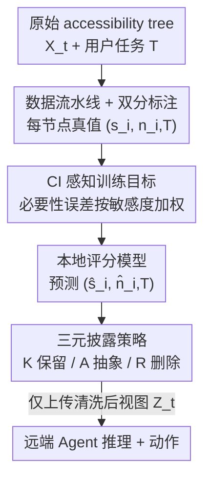

# Minim: Privacy-Aware Minimal View for Agents via Trusted Local Sanitization

**会议**: ICML2026  
**arXiv**: [2606.13949](https://arxiv.org/abs/2606.13949)  
**代码**: 待确认  
**领域**: AI 安全 / Agent 隐私 / 结构化观测最小化  
**关键词**: Agent 隐私、可访问性树、上下文完整性、数据最小化、本地清洗

## 一句话总结
Minim 是一个跑在用户设备本地的"可信清洗代理"，在 Agent 把界面状态（accessibility tree）上传给远端推理服务器之前，先用一个小模型给每个 UI 元素打两分——**固有敏感度 $s$** 与**任务条件必要性 $n$**——再用三元披露策略（保留 / 抽象 / 删除）只放行任务真正需要的最小信息，在 WebArena 上把任务无关的敏感信息泄漏（TISL）压到全量观测的 10.1%，同时几乎不损失任务关键内容与可交互能力。

## 研究背景与动机

**领域现状**：现代 LLM 驱动的自主 Agent 越来越依赖**结构化观测**来可靠地"对齐动作"——尤其是 accessibility tree（可访问性树），它把界面表示成带角色、状态、可交互属性的层级节点，比像素输入稳定，被 Apple Intelligence、Microsoft Copilot 等 OS 级助手广泛采用；类似的还有 web agent 的 DOM、机器人的场景图、工具调用的 MCP schema。

**现有痛点**：这些接口当初是为"辅助透明"设计的，不是为隐私编排设计的。于是多数 Agent 部署采用 **share-first（先全发再说）**：哪怕用户任务只需要界面的一小块，也把**整棵 accessibility tree** 发给远端推理。作者把这种失效模式命名为 **Semantic Over-Privileged Observation（语义过度授权观测）**——任务无关的元素连同其功能语义一起被暴露。比如用户只想"总结这封邮件"，远端 Agent 却顺带看到了侧边栏通知里的 2FA 验证码、后台应用窗口、无关浏览器标签页，这些都是可被用于画像的 PII 与跨会话行为痕迹。

**核心矛盾**：到底该披露什么，**本质上是任务条件的**。同一个元素（如一个 2FA 码）在"需要登录认证"的任务里是必需，在"浏览 / 总结"任务里就是纯泄漏。这导致已有隐私范式都不好使：任务无关的实体过滤（如 Presidio）靠静态 PII 类别，会误删任务关键内容、也漏掉非 PII 的敏感属性（如政治倾向）；差分隐私（DP）的随机扰动会破坏结构化界面里精确的语义线索，让动作不可靠；MPC / FHE 等密码学方法只保护"计算过程"，却挡不住"已经被披露给服务器的状态"被推断，且延迟与实时控制回路不兼容。

**本文目标**：在数据离开设备**之前**，对结构化观测做**任务条件的预披露最小化**，既压住任务无关的敏感泄漏、又保住完成任务所必需的可交互可用性。

**切入角度**：作者以 **Contextual Integrity（上下文完整性，CI）** 为规范依据——隐私不是绝对保密，而是信息流是否符合情境规范（context / actors / attributes / transmission principle）。这里"任务 $T$"定义情境，"客户端 vs 远端服务器"是 actors，UI 字段是 attributes，传输原则就是**任务条件必要性**：高披露风险的信息，只在完成当前任务必需时才放行。

**核心 idea**：把"敏感度"和"必要性"解耦成两个可学习的标量分数，由一个本地小模型预测，再交给一个固定的三元决策规则去执行——**用专门训练的本地评分器替代 Agent 自身的推理来做披露决策**，从而避开"隐私判断-动作鸿沟"（Agent 即便识别出敏感内容也保护不了）。

## 方法详解

### 整体框架

Minim 是插在"原始观测"与"远端推理"之间的一道**本地结构瓶颈**。整条流水线分两个阶段：**训练阶段**先构造带 CI 标注的数据集（每个节点带一对真值分数 $(s_i, n_{i,T})$），再用 CI 感知目标训练一个评分模型；**部署阶段**对运行时抓到的 accessibility tree 逐节点预测 $(\hat{s}_i,\hat{n}_{i,T})$，用一个固定的三元阈值规则把每个节点映射到 **保留 K / 抽象 A / 删除 R** 三种动作，产出清洗后的 tree $Z_t$，这是唯一被上传的观测。关键性质是 $Z_t$ 不必是 $X_t$ 的子集——因为"抽象"会把敏感属性值替换成占位符、但保留其结构角色。

### 关键设计

**1. 双分表示：把"敏感度"和"必要性"拆成两个正交的可学习标量**

痛点是单一分数说不清"该不该发"——一个元素既可能高敏感、又可能高必要（如 2FA 码在登录任务里）。Minim 给每个节点 $e_i$ 学两个分：**固有敏感度** $s_i\in[0,10]$（任务无关，刻画信息本身的披露风险）和**任务条件必要性** $n_{i,T}\in[0,10]$（依赖当前任务 $T$，刻画对完成任务的效用）。把这两维拆开是整套方法的地基——只有同时知道"多敏感"和"多必要"，才能区分"高敏感但无关→该删/该抽象"和"高敏感且必需→必须保留"这两种本质不同的情形。模型输入节点级特征 + 任务描述，输出预测对 $(\hat{s}_i,\hat{n}_{i,T})$。

**2. CI 感知训练目标：在"高敏感+低必要"的危险区给必要性误差加重罚**

形式化目标是在任务成功约束下最小化不当披露：$\min_{Z_t} I(X_t^{\mathrm{out}};Z_t\mid T)$ s.t. $\mathrm{TaskSuccess}(Z_t,T)\ge\tau$，其中 $X_t^{\mathrm{out}}$ 是违反 CI 规范的信息流（隐变量，故用 $s,n$ 两个代理优化）。敏感度用绝对误差监督 $\mathcal{L}_{\text{sens}}=\sum_i|s_i-\hat{s}_i|$；必要性损失则**按敏感风险加权**：

$$\mathcal{L}_{\text{nec}}=\sum_i\Big(1+\lambda\cdot\tfrac{s_i}{10}\cdot(1-\tfrac{n_{i,T}}{10})\Big)\cdot|n_{i,T}-\hat{n}_{i,T}|$$

这个乘性因子在"$s_i$ 大（高敏感）且 $n_{i,T}$ 小（任务无关）"时最大——这恰是不当披露危害最深的 regime。总目标 $\mathcal{L}=\mathcal{L}_{\text{sens}}+\alpha\mathcal{L}_{\text{nec}}$。它把优化对齐到 CI 目标：对"高风险、低效用"节点的必要性判断务必判准（宁可多删），从而既敢激进剪枝、又保住任务关键上下文。这正是后面 Minim 能把 TISL 砍半（0.101 vs Necessity-Only 0.203）的训练侧原因。

**3. 三元披露策略：用两个阈值把双分映射成 保留 / 抽象 / 删除**

部署时是一个**固定的、无需 LLM 推理**的决策规则，按必要性阈值 $\tau_{\text{nec}}$ 和敏感度阈值 $\tau_{\text{sens}}$ 把每个节点分流：

$$\text{Action}(e_i)=\begin{cases}\textsf{R}\ \text{(删除)} & \hat{n}_{i,T}<\tau_{\text{nec}}\\ \textsf{A}\ \text{(抽象)} & \hat{n}_{i,T}\ge\tau_{\text{nec}}\ \land\ \hat{s}_i\ge\tau_{\text{sens}}\\ \textsf{K}\ \text{(保留)} & \hat{n}_{i,T}\ge\tau_{\text{nec}}\ \land\ \hat{s}_i<\tau_{\text{sens}}\end{cases}$$

即：不必要的直接删（R）；必要但敏感的做抽象（A，把敏感属性值换成占位符、保留结构角色，残余泄漏按 $\mathrm{tok}_{\mathrm{ph}}=6.0$、$p_{\mathrm{abs}}=0.05$ 建模）；必要且低风险的原样保留（K）。把"打分"与"执行"解耦的好处是：策略层是规范驱动的固定逻辑，可审计、可调阈值，而不把披露决策交给可能"判断对却保护不了"的 Agent 自身。阈值通过验证集扫描选取（$\tau_{\text{nec}}=\arg\max_\tau(\mathrm{TCNP}(\tau)-0.5\cdot\mathrm{TISL}(\tau))$，最终取 $\tau_{\text{nec}}=1.0$、$\tau_{\text{sens}}=5.0$）。

### 一个完整示例
用户发来桌面截图请远端 Agent 帮忙**回复一封邮件**。原始 accessibility tree 同时包含邮件正文和一条显示验证码的系统通知。Minim 逐节点打分：邮件正文 → 高必要、低敏感 → **K 保留**；与回复无关的验证码通知 → 高敏感、低必要 → 命中 R 条件被**删除**（若它在某个版本里被判为必要但敏感，则走 **A 抽象**，把验证码原值替换成占位符、保留"这是一条通知"的结构角色）；侧边栏无关项 → 低必要 → **R 删除**。最终上传的 $Z_t$ 只剩起草回复所需的上下文，验证码这类任务无关敏感信息被挡在设备内。诊断检查显示 Minim 抑制了 >99.9% 的注入式 2FA 码、密码、Slack 通知。

### 损失函数 / 训练策略
总损失 $\mathcal{L}=\mathcal{L}_{\text{sens}}+\alpha\mathcal{L}_{\text{nec}}$（见关键设计 2）：敏感度用 L1 绝对误差、必要性用 CI 加权 L1。数据来自 WebArena 增广语料（Shopping / Reddit / Gmail），150 棵 accessibility tree × 27 类任务 = 5403 个 (tree, task) 变体，注入合成敏感上下文（2FA 码、密码提示、系统通知），划分 4741 训练 / 662 测试，全部结果报在留出测试集（$N=662$）。

## 实验关键数据

### 主实验：与固定策略基线对比（增广 WebArena，N=662）

基线在相同 Minim 预测分数下采用 top-K 预算匹配（保留 20% 节点）；Minim 用自适应 K/A/R 策略。TISL 归一化到全量观测。

| 方法 | TCNP ↑ | TCNP-I ↑ | TISL ↓ |
|------|--------|----------|--------|
| Full Obs.（全量） | 1.0000 | 1.0000 | 1.0000 |
| Random Budget | 0.2284 | 0.2346 | 0.1971 |
| Sensitivity-Only | 0.0401 | 0.0393 | 0.3799 |
| Necessity-Only | 0.9445 | 0.9730 | 0.2032 |
| **Minim（本文）** | **0.9491** | **0.9931** | **0.1010** |

三个核心指标：**TCNP**（任务关键节点保留率，语境召回）、**TCNP-I**（可交互关键节点保留率，执行可行性）、**TISL**（任务无关敏感泄漏 $=\sum_{i\in Z_t}\mathbb{1}[n_{i,T}\le\tau_{\text{irr}}]\cdot s_i\cdot\mathrm{tok}_{\mathrm{post}}(i)$）。Minim 在 utility（TCNP 0.949 / TCNP-I 0.993）上追平甚至超过 Necessity-Only，却把泄漏砍半（0.101 vs 0.203）。

### 与 Prompted LLM 评分器对比（零样本）

| 方法 | TCNP ↑ | TCNP-I ↑ | TISL ↓ | Keep% ↓ |
|------|--------|----------|--------|---------|
| Qwen3-8B-Instruct | 0.956 | 0.989 | 0.211 | 28.4 |
| Llama-3.3-70B-Instruct | 0.966 | 0.996 | 0.312 | 34.5 |
| Gemma-3N-E4B | 0.951 | 0.985 | 0.194 | 25.8 |
| **Minim（本文）** | 0.9491 | 0.9931 | **0.101** | **12.0** |

### 任务语义鲁棒性（自适应压缩）

| 任务语义 | K(保留%) | A(抽象%) | TCNP | TCNP-I |
|----------|----------|----------|------|--------|
| Informational | 8.66% | 0.83% | 0.9156 | 0.9886 |
| Sensitive/Admin | 15.84% | 9.84% | 1.0000 | 1.0000 |
| Transactional | 10.88% | 3.52% | 1.0000 | 1.0000 |

### 关键发现
- **联合建模 > 单维度**：Sensitivity-Only 保留"最不敏感的 20%"反而几乎都是任务无关内容（TCNP 仅 0.04），Necessity-Only 又会把"有用就发"的敏感内容漏出去（TISL 0.203）；只有同时建模两维才拿到优越的隐私-效用前沿。
- **专用小模型胜过通用大模型**：所有被测开源 LLM 的 TISL 都在 0.19–0.31，远高于 Minim 的 0.101，且模型越大反而泄漏越多（Llama-70B TISL 0.312 > Llama-8B 0.206）——通用指令微调并不会自发执行"任务条件最小化"，而 Minim 测试时**完全不需要 LLM 推理**。
- **自适应压缩**：模型对低风险浏览类任务压得更狠（Informational 仅保留 8.66%），对高风险管理类任务保留更多上下文（Sensitive/Admin 15.84%），这一行为由 CI 感知目标自然涌现，而非手工规则。
- **平均 Keep% ≈ 12%**：契合 accessibility tree 的内在稀疏性——网页常超 500/1100 个节点，绝大多数是容器、装饰、冗余链接，真正可操作的 affordance 很少，因此激进剪枝并不伤执行。

## 亮点与洞察
- **把隐私决策从 Agent 推理里"拆出来"**：最巧妙的是用一个本地专用评分器 + 固定阈值策略替代"让 Agent 自己判断该不该发"，直接绕开"隐私判断-动作鸿沟"，且测试期零 LLM 调用、可审计、可调阈值。
- **CI 加权损失是点睛之笔**：必要性损失乘上 $(1+\lambda\cdot\tfrac{s_i}{10}\cdot(1-\tfrac{n_{i,T}}{10}))$，把优化重心精准压到"高敏感+低必要"的危险区，这个可迁移的加权思路能直接用到任何"按风险分层惩罚"的最小化场景。
- **三元 K/A/R 而非二元 keep/drop**：引入"抽象 A"这一中间档（保结构角色、换敏感值），解决了"必要但敏感"节点不该一刀切删或留的两难。

## 局限与展望
- **诚实但有缺口的威胁模型**：假设本地 broker 可信、远端是 honest-but-curious，**不考虑 prompt injection / 主动对抗**，也不防本地环境被攻破（OS 级恶意软件）；真实部署里这些是现实风险。
- **数据与标注依赖**：训练真值 $(s_i,n_{i,T})$ 来自 WebArena 增广 + 合成注入敏感上下文，标注质量和领域覆盖（仅 Shopping/Reddit/Gmail、27 类任务）决定上限，跨更复杂真实应用的泛化待验证。
- **残余泄漏仍非零**：抽象动作 A 按 $p_{\mathrm{abs}}=0.05$ 建模残余泄漏，清洗无法完全消除风险；阈值（$\tau_{\text{nec}}=1.0$ 等）靠验证集扫描选定，对分布漂移可能敏感。

## 相关工作与启发
- **vs 任务无关实体过滤（Presidio 等）**：他们按静态 PII 类别删，会误删任务关键内容、漏掉非 PII 敏感属性；Minim 按任务条件必要性动态决策，且能保留"必要但敏感"项。
- **vs 差分隐私 / 密码学（DP、MPC、FHE）**：DP 的扰动破坏结构化语义线索、密码学只保护计算却挡不住已披露状态的推断且延迟高；Minim 在数据**离开设备前**就做最小化，机制层面不同。
- **vs 对话型隐私网关（AirGapAgent、Portcullis、Papillon）**：那些主要针对对话 prompt / 日志 / 自由文本；Minim 专攻**结构化、动作关键**的观测（accessibility tree），naive 红action 会破坏可交互线索，这正是它要解决的新场景。

## 评分
- 新颖性: ⭐⭐⭐⭐⭐ 首次把 CI 落地为 Agent 结构化观测的"预披露最小化结构瓶颈"，并提出双分 + 三元策略。
- 实验充分度: ⭐⭐⭐⭐ WebArena 增广语料含主实验 / LLM 对比 / 任务分层 / 安全验证，但仅 3 个域、合成注入敏感数据。
- 写作质量: ⭐⭐⭐⭐⭐ 问题定义（Semantic Over-Privileged Observation）、CI 形式化与方法叙述清晰，指标定义到位。
- 价值: ⭐⭐⭐⭐⭐ 直击 Agent share-first 部署的现实隐私痛点，本地、低延迟、可审计，落地性强。

<!-- RELATED:START -->

## 相关论文

- [\[ICLR 2026\] Membership Privacy Risks of Sharpness Aware Minimization](../../ICLR2026/ai_safety/sam_membership_privacy_risks.md)
- [\[CVPR 2026\] LDP-Slicing: Local Differential Privacy for Images via Randomized Bit-Plane Slicing](../../CVPR2026/ai_safety/ldp-slicing_local_differential_privacy_for_images_via_randomized_bit-plane_slici.md)
- [\[ICML 2026\] MetaMoE: Diversity-Aware Proxy Selection for Privacy-Preserving Mixture-of-Experts Unification](metamoe_diversity-aware_proxy_selection_for_privacy-preserving_mixture-of-expert.md)
- [\[ICML 2026\] Decoupled Training with Local Reinforcement Fine-Tuning in Federated Learning](decoupled_training_with_local_reinforcement_fine-tuning_in_federated_learning.md)
- [\[CVPR 2026\] Improving Adversarial Transferability with Local Perturbation Augmentation](../../CVPR2026/ai_safety/improving_adversarial_transferability_with_local_perturbation_augmentation.md)

<!-- RELATED:END -->
