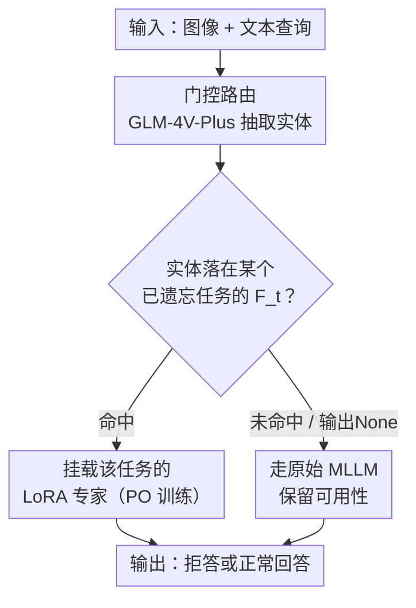

# MLUBench: A Benchmark for Lifelong Unlearning Evaluation in MLLMs

**会议**: ICML2026  
**arXiv**: [2606.12809](https://arxiv.org/abs/2606.12809)  
**代码**: 已开源（论文中给出仓库链接）  
**领域**: AI安全 / 机器遗忘 / 多模态大模型  
**关键词**: 机器遗忘, 终身遗忘, 多模态对齐, MoE, LoRA

## 一句话总结
针对"多模态大模型（MLLM）需要按时间顺序不断删除特定数据"这一真实场景，本文构建了大规模终身遗忘基准 MLUBench（127 个真实实体、5105 张图、15414 个 VQA 对），系统揭示出现有遗忘方法会随任务累积而崩塌、且崩塌的根因是破坏了多模态对齐，并提出用"一个遗忘任务一套可切换 LoRA 专家 + 门控路由"的 LUMoE 方法，把遗忘修改与稳定主干隔离开，从而在长序列遗忘下同时守住遗忘质量与模型可用性。

## 研究背景与动机

**领域现状**：MLLM（如 GPT-4o、Gemini）训练在网络规模的多模态数据上，数据所有者随时可能要求删除自己的内容，因此"机器遗忘"（machine unlearning，从已训练模型中抹掉特定数据）变得越来越重要。现实中删除请求往往不是一次性到齐，而是随时间陆续到来，这就构成了**MLLM 终身遗忘（lifelong unlearning）**问题：模型必须持续遗忘指定知识，同时保住其余通用能力。

**现有痛点**：一方面缺乏合适的评测基准——MMUBench 只有 20 个概念，FIUBench 只盯人脸，MLLMU-Bench 只覆盖名人，规模与多样性都不足以评估长序列遗忘的累积效应；另一方面，现有遗忘方法（梯度上升 GA、梯度差 GD、KL 最小化、负偏好优化 NPO）几乎都是为"一次性遗忘"设计的，没人系统量化过它们在连续多任务下会怎样。

**核心矛盾**：作者通过实验确认了两件事。其一，终身遗忘会带来**严重的累积退化**——例如 GA 方法在第一个任务上的遗忘质量从 0.38 一路掉到后续的 0.01。其二，也是本文最关键的洞察：**MLLM 终身遗忘不是 LLM 终身遗忘的简单推广**，它受制于一个单模态模型不存在的约束——**多模态对齐（multimodal alignment）必须被保护**。哪怕只在单一模态（只动语言端、或只动视觉适配器）上做遗忘，也会破坏连接视觉与语言的对齐，导致整个模型性能崩溃。

**本文目标**：(1) 提供一个能真正评估长序列遗忘累积效应的大规模基准；(2) 给出一个能在终身遗忘下守住对齐、不让模型崩掉的有效方法。

**核心 idea**：既然反复改动主干权重会破坏对齐，那就**不要再改主干**——把每个遗忘任务的修改"外挂"成一套独立的、可切换的 LoRA 专家，用一个门控模块按输入路由到正确的专家或干脆走原始模型，从而把"遗忘修改"和"稳定主干 + 对齐"彻底隔离。

## 方法详解

本文有两块工作：基准 MLUBench 的构建，以及方法 LUMoE。前者定义了"在什么数据、什么协议下评测终身遗忘"，后者给出了"怎么在这套协议下不崩"的解法。

### 整体框架

MLUBench 把 127 个真实实体按近似均分切成 4 个顺序任务 A→B→C→D，每个任务再分成"要遗忘的信息集 $F_t$"和"要保留的信息集 $R_t$"，模型必须按 A、B、C、D 的顺序依次遗忘，每遗忘完一个任务就存档并回测此前所有已遗忘的任务，以此暴露累积退化。形式上，一个遗忘任务记为 $t=(F_t, R_t)$，终身遗忘的目标是最小化模型在"刚遗忘完某任务"与"遗忘完整个序列后"在该任务上的性能差：

$$\min_{\theta_{\mathcal{T}}}\sum_{t\in\mathcal{T}}\left|P(\mathcal{M}_{\theta_t},t)-P(\mathcal{M}_{\theta_{\mathcal{T}}},t)\right|$$

注意这个目标盯的是**稳定性**（不让旧任务退化），而非某个遗忘算法本身的绝对效力。

LUMoE 在推理时的工作流是：输入（图像 + 文本查询）先进入门控模块，由它抽取实体名并匹配到此前的某个遗忘任务；若命中，就把对应任务的 LoRA 专家挂到基座模型上处理该输入；若没命中（属于保留集，或路由器不确定），就直接交给原始 MLLM，从而保住可用性。

### 关键设计

**1. MLUBench：建在真实知识上的大规模顺序遗忘基准**

现有遗忘数据集（如 TOFU、FIUBench）大多用虚构信息，使用前还得先把这些虚构知识微调进模型，既不方便也不贴近现实——现实中模型要遗忘的是它"本来就会"的知识。MLUBench 因此直接建在广为人知的真实实体上：从 Wikipedia 选取 Animals、Astronomy、Buildings、Cartoons、Corporations、Movies、Personage、Plants、TV Series 共 9 类、127 个实体；用 Google 图片爬取图像，按"实体类型"设计共用问题集（而非逐实体出题，以捕捉同类实体的共性特征），再用 GPT-4o 生成实体特定答案并人工校验。关键的**过滤步骤**是：把每个图文对喂给 LLaVA-v1.6-7B 和 13B，**只保留两者都答对（GPT-4o 判定）的样本**——因为"模型必须先掌握这个知识，遗忘才有意义"。最终把数据近似均分成 A/B/C/D 四个顺序任务（借鉴 Kirkpatrick 等人在持续学习里用 A/B/C 任务序列的做法）。此外还设计了**泛化评测**：每个问题给四个语义等价但措辞不同的变体（如"Who directed this film?" 改写成 "Who was responsible for directing this movie?"），检验遗忘是否对提问方式鲁棒——真正被遗忘的知识应该无论怎么问都被压住。

**2. LUMoE 的隔离原则：用可切换 LoRA 专家替代反复改主干**

既然 Section 3 的实验证明"反复改动主干权重 → 破坏多模态对齐 → 灾难性退化"，那解法的设计原则就是**把遗忘修改从稳定主干里隔离出来**。受 MoE 启发，LUMoE 不再动 MLLM 本体，而是为每个遗忘任务单独训练一套 LoRA 适配器，当作 MoE 里的"专家"。每个专家通过 **PO（Preference Optimization）**训练得到——它是 DPO 的变体，目标是让模型对遗忘信息集里的查询**偏好输出拒答**（如"Sorry, I cannot answer this question"），而不是去硬抹梯度。这样一来，任意时刻主干权重和对齐都原封不动，遗忘的"代价"全部锁在外挂的轻量适配器里；多个适配器之间互不干扰，若一个请求同时命中多个任务的适配器，可以把它们同时合并进基座而不冲突。这正是 LUMoE 能在长序列下不崩的根本原因。

**3. 门控路由 + 错误处理：把输入准确送到对的专家或原始模型**

LUMoE 的关键部件是门控模块，它决定每个输入该用哪个（或不用）专家。作者直接用 SOTA 商用多模态模型 **GLM-4V-Plus** 做路由，分两步：(1) **实体抽取**——提示 GLM-4V-Plus 从输入中抽出相关实体名；(2) **任务匹配**——把抽出的实体与各历史遗忘任务的遗忘集比对，命中某任务就挂载对应 LoRA 专家，没命中（属于保留集）就直接走原始 MLLM 以保住可用性。由于路由器并不完美、实体识别可能出错，作者加了**错误处理机制**：指示模型在不确定实体时输出 "None"，这类问题被归为保留问题、直接交给原始 MLLM 处理——宁可少遗忘也不要误伤可用性。

### 一个完整示例

以序列 A→B→C→D 为例。先对每个任务各训练一套 LoRA 专家：训完 A 得到专家_A、训完 B 得到专家_B……主干始终不动。推理时来一条查询"这部电影是谁导演的？"配一张某电影海报：门控先用 GLM-4V-Plus 抽出实体"该电影"，发现它落在任务 B 的遗忘集里，于是挂载专家_B，模型输出"抱歉，我无法回答"（高质量拒答，遗忘质量得满分）。若换一条查询问的是保留集里的某动物，门控匹配不到任何遗忘任务、或干脆输出 "None"，输入就直接走原始 MLLM，正常作答（可用性得分保住）。整条序列走完后回测任务 A，由于专家_A 始终独立存在、主干和对齐从未被后续任务污染，A 的遗忘质量不会像 GA 那样从 0.38 塌到 0.01。

### 损失函数 / 训练策略

每个 LoRA 专家用 PO（DPO 变体）训练，使模型对遗忘集查询偏好拒答响应。LoRA-rank 与 LoRA-alpha 均设为 32，视觉塔学习率 2e-6、projector 学习率 1e-5、batch size 4。门控由现成的 GLM-4V-Plus 担任，无需额外训练。

## 实验关键数据

评测用两个指标。**遗忘质量（Forget Quality）= GPT 拒答分**：因为初始 MLLM 已掌握 MLUBench 知识，重训一个"没见过 MLUBench"的金标模型代价过高，故无法用依赖重训模型的 KS-Test；改为让 GPT-4o 给拒答质量打 $\{0,1,2\}$，2 分代表高质量拒答（既不幻觉、也不泄露真实知识）。**模型可用性（Model Utility）= GPT 正确性分**：让 GPT-4o 对保留集回答的质量/相关性/正确性打 $\{0,1,2\}$。最终分 $=\frac{\sum \text{Model Scores}}{\sum \text{Maximum Possible Scores}}$。模型用 LLaVA-v1.6-7B/13B 与 Qwen3-VL-4B-Instruct。

### 主实验

在 LLaVA-7B 上对比 LUMoE 与四个基线（GA / GD / KL / NPO）。表中"X-UY"表示"遗忘任务 Y 之后在任务 X 上的表现"，越靠右说明经历的后续遗忘越多，最能体现累积退化。

| 方法 | 指标 | A-UA（首测） | A-UD（最末） | D-UD | 趋势 |
|------|------|------|------|------|------|
| GA | 遗忘质量 | 0.380 | 0.010 | 0.060 | 累积崩塌 |
| GA | 可用性 | 0.120 | 0.010 | 0.020 | 几乎清零 |
| KL | 遗忘质量 | 0.280 | 0.000 | 0.000 | 累积崩塌 |
| NPO | 遗忘质量 | 0.420 | 0.005 | 0.000 | 累积崩塌 |
| NPO | 可用性 | 0.238 | 0.000 | 0.000 | 几乎清零 |
| **LUMoE** | **遗忘质量** | **1.000** | **1.000** | **0.960** | **稳定** |
| **LUMoE** | **可用性** | **0.930** | **0.930** | **0.910** | **稳定** |

基线无论遗忘质量还是可用性，都随任务推进塌向 0；LUMoE 因为把修改隔离在外挂专家里、主干与对齐不被污染，遗忘质量稳定在 0.95~1.0、可用性稳定在 0.88~0.94，几乎不随序列长度衰减。

### 消融 / 分析实验：多模态对齐为何是唯一挑战

表 1 是支撑全文核心论点的分析实验，对比"只在语言端遗忘（更新主干 LLM）"与"只在视觉端遗忘（更新视觉适配器）"：

| 设置 | 方法 | 指标 | A-UA | B-UB | C-UC | D-UD |
|------|------|------|------|------|------|------|
| 只遗忘语言端 | GA | 遗忘质量 | 0.205 | 0.193 | 0.065 | 0.100 |
| 只遗忘语言端 | GA | 可用性 | 0.102 | 0.308 | 0.000 | 0.000 |
| 只遗忘视觉端 | GA | 遗忘质量 | 0.315 | 0.000 | 0.000 | 0.000 |
| 只遗忘视觉端 | GA | 可用性 | 0.246 | 0.017 | 0.007 | 0.000 |

可见无论只动哪一个模态，性能都很快塌掉——这说明**MLLM 终身遗忘无法靠孤立地处理某一个模态来解决**，连续遗忘会从单模态传导、破坏跨模态对齐，进而拖垮整个模型。这正是 LUMoE"不动主干、外挂隔离"设计的实验依据。

### 关键发现
- **累积退化是普遍现象**：GA 在任务 A 的遗忘质量从 0.38 掉到 0.01，KL/NPO 在后续任务上直接归零，证明现有方法都不适配长序列遗忘。
- **对齐是 MLLM 独有的脆弱点**：单模态遗忘也会破坏跨模态对齐——这是 MLLM 终身遗忘区别于 LLM 终身遗忘的根本所在。
- **隔离 > 直接改主干**：LUMoE 把"是否最优"让位给"是否稳定"，用最简单的外挂专家就把退化问题压住，作者明确将其定位为强基线而非终极解。

## 亮点与洞察
- **把"对齐崩塌"指认为 MLLM 终身遗忘的根因**：这是全文最有价值的"啊哈"点——用一个干净的"只动语言端 vs 只动视觉端"对照实验，证明问题不在某个模态内部，而在连接两者的对齐，直接改写了解题思路。
- **基准的过滤环节很讲究**：只保留 7B 和 13B 都答对的样本，确保"先会、再遗忘"，避免把模型本来就不会的东西算成"成功遗忘"，这个细节让评测更可信，思路可迁移到任何遗忘/编辑基准的构建。
- **用现成商用 MLLM 当门控**：不自训路由器，直接借 GLM-4V-Plus 做实体抽取 + 任务匹配，并配 "None" 兜底，工程上极简，也把方法复杂度压到最低。
- **拒答式遗忘（PO）**：遗忘不靠抹梯度而靠"偏好拒答"，天然避免了 GA 那种伤及无关数据的副作用。

## 局限与展望
- **依赖外部商用路由器**：门控用 GLM-4V-Plus，实体抽取出错会直接导致路由错误；虽有 "None" 兜底，但兜底策略偏保守（误判为保留 → 该遗忘的没遗忘）。
- **专家数随任务线性增长**：每个遗忘任务一套 LoRA 专家，任务序列很长时存储与路由匹配成本会上升，论文未深入讨论可扩展性上限。
- **作者自陈是"强基线"而非终极解**：LUMoE 的价值在于验证"隔离"思路有效，而非在所有维度都最优；如何在隔离的同时让专家间共享/压缩仍是开放问题。
- **遗忘绝对效力未被强调**：目标式（Eq.1）盯的是稳定性（不退化），并不直接保证底层遗忘算法的绝对遗忘强度。

## 相关工作与启发
- **vs MMUBench / FIUBench / MLLMU-Bench**：它们规模小、范围窄（20 概念 / 只人脸 / 只名人）且面向一次性遗忘；MLUBench 实体更多、类型更广（127 实体 9 类），并专为长序列累积效应设计。
- **vs LLM 顺序遗忘（O³ 框架、Shi et al. 等）**：那些工作在单模态 LLM 上权衡遗忘效力与可用性；本文指出 MLLM 多了"保护跨模态对齐"这一独有约束，并据此设计隔离式方法。
- **vs MMUNLEARNER / 视觉知识蒸馏类 MLLM 遗忘**：它们改进单次遗忘的算法（几何约束梯度上升、蒸馏）；LUMoE 不改单次算法本身，而是用 MoE 式外挂解决"序列累积"这一层问题，两者正交可叠加。

## 评分
- 新颖性: ⭐⭐⭐⭐⭐ 首次把"多模态对齐崩塌"指认为 MLLM 终身遗忘的根因，并给出隔离式解法。
- 实验充分度: ⭐⭐⭐⭐ 多模型多基线、含揭示根因的对照实验，但门控误差与可扩展性分析偏少。
- 写作质量: ⭐⭐⭐⭐ 问题定义清晰、动机层层递进，基准与方法衔接自然。
- 价值: ⭐⭐⭐⭐⭐ 提供大规模基准 + 强基线 + 关键洞察，为 MLLM 终身遗忘这一新方向奠定评测与研究基础。

<!-- RELATED:START -->

## 相关论文

- [\[AAAI 2026\] An Information Theoretic Evaluation Metric for Strong Unlearning](../../AAAI2026/ai_safety/an_information_theoretic_evaluation_metric_for_strong_unlearning.md)
- [\[ICML 2026\] Semantic Router: On the Feasibility of Hijacking MLLMs via a Single Adversarial Perturbation](semantic_router_on_the_feasibility_of_hijacking_mllms_via_a_single_adversarial_p.md)
- [\[ICML 2026\] Rethinking Evaluation Paradigms in IBP-based Certified Training](rethinking_evaluation_paradigms_in_ibp-based_certified_training.md)
- [\[ICML 2026\] ABC-Bench: An Agentic Bio-Capabilities Benchmark for Biosecurity](abc-bench_an_agentic_bio-capabilities_benchmark_for_biosecurity.md)
- [\[ICML 2026\] Multilingual Unlearning in LLMs: 转移、动力学与可逆性](multilingual_unlearning_in_llms_transfer_dynamics_and_reversibility.md)

<!-- RELATED:END -->
