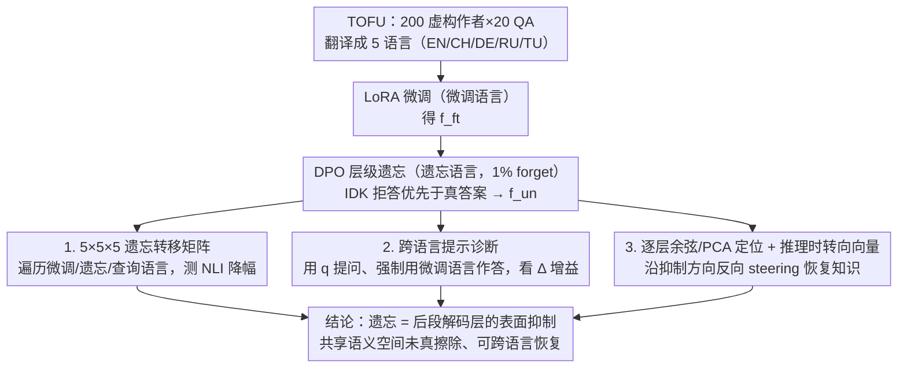

# Multilingual Unlearning in LLMs: 转移、动力学与可逆性

**会议**: ICML 2026  
**arXiv**: [2606.03291](https://arxiv.org/abs/2606.03291)  
**代码**: https://github.com/MLCY1/multilingual-unlearning-in-llms  
**领域**: LLM 安全 / 隐私 / 多语言 LLM  
**关键词**: LLM 遗忘, 跨语言转移, 表征空间, 转向向量, 可逆遗忘

## 一句话总结
本文把 TOFU 遗忘基准扩到 5 种语言系统研究「跨语言遗忘转移」，发现遗忘强度随语言族/书写系统亲缘关系而变，且只动用了后段语言特化解码层、几乎不改前中段共享语义空间，因此能用一个推理时的转向向量恢复 Qwen 上 50%、Gemma 上 90% 的被遗忘知识——说明现有 LLM 遗忘本质是「表面抑制」而非真擦除。

## 研究背景与动机

**领域现状**：LLM 训练吸收的大量数据可能包含敏感事实，加上 GDPR「被遗忘权」的合规要求，催生了不重训而抹除特定知识的「LLM unlearning」研究。主流方法（GA、NPO、DPO 风格）都是在微调过的模型上加修改目标，鼓励模型在 forget 集上不再吐露目标内容。

**现有痛点**：(1) 现有评测几乎只在英文上做，多语言场景下「遗忘究竟转移到了什么程度」无人系统刻画——而真实部署里同一条敏感事实经常以多语形式重复出现；(2) 即使在单语言下，已有工作零星显示「遗忘像抑制信号」，但缺少机制定位（在哪些层？是否语言无关？）和无须重学的可逆性证据。

**核心矛盾**：如果多语言遗忘只动了「语言特化解码层」，那共享语义空间里的知识就还在，攻击者用另一种语言提问、或在推理时反向 steering 就能把它拽回来；如果它真正改变了「跨语言概念空间」，那遗忘的安全保证就强得多。两种情形对部署风险评估完全不同，但既往工作没区分。

**本文目标**：(i) 系统刻画跨语言遗忘转移随语言族/书写系统/预训练覆盖率的规律；(ii) 用机制可解释性定位遗忘动作发生在哪些层；(iii) 用一个简单的推理时转向向量验证遗忘是否可逆，并测它跨语言的传递性。

**切入角度**：把 TOFU（200 个虚构作者各 20 个 QA）翻译到 5 种语言（EN/CH/DE/RU/TU），三轴正交受控——共享语族 vs 共享书写 vs 都不共享；分别在某语言微调、再在某语言遗忘、再在某语言询问，得到 $5\times 5\times 5$ 的转移矩阵；并用 NLI 而非 lexical overlap 评估语义等价。

**核心 idea**：把遗忘前后模型隐表征的系统性差异提炼成一个「抑制方向」（steering vector），推理时沿反方向加权注入 forward pass。如果这个方向是「语言无关的抑制方向」，那它在任何语言下都能恢复知识——这正是论文要验证的假说。

## 方法详解

### 整体框架

这篇论文不提新遗忘算法，而是搭一套受控实验把「跨语言遗忘转移到底发生在哪一层、能不能逆回去」量化清楚。整条流水线在 Qwen2.5-7B 和 Gemma2-9B 上跑：先用同一份 TOFU 双语数据在某门微调语言 $\mathcal{L}_{FT}$ 上做 LoRA 微调得到 $f_{\text{ft}}$，再用 DPO 风格遗忘目标在某门遗忘语言 $\mathcal{L}_{\text{unl}}$ 上抹掉 1% 的 forget 作者得到 $f_{\text{un}}$，然后换各种查询语言 $\mathcal{L}_Q$ 评测 forget/retain 准确率拼出转移矩阵，最后抽每层隐表征做余弦相似度定位 + 构造一个推理时转向向量验证可逆性。

遗忘目标本身就是标准的层级化 DPO 偏好优化，$\arg\min_\theta \frac{1}{|\mathcal{L}_{\text{unl}}|} \sum_{\ell} (\mathbb{E}_{D_\ell^{\text{forget}}} J_{\text{forget}} + \lambda \mathbb{E}_{D_\ell^{\text{retain}}} J_{\text{retain}})$，其中 $J_{\text{forget}}$ 让模型偏好「IDK 拒答」胜过「真实答案」、$J_{\text{retain}}$ 用 $\lambda$ 加权护住 retain 集。评测一律不用 lexical overlap（跨语言下词面重合会虚高虚低），而是用多语 NLI 模型 xlm-roberta-large-xnli 判生成答案 $\hat y$ 与 ground truth $y$ 是否互蕴，并请 native speaker 在 50 个样本上校验过 NLI 判分的可靠性。整条流水线是「同一份双语数据微调 → 在某语言遗忘 → 换语言询问」三段串行，再从遗忘后的模型 $f_{\text{un}}$ 分出三条分析支路（转移矩阵 / 跨语言提示 / 机制定位+转向向量）汇到同一个结论。

### 关键设计

**1. 三轴受控的 $5\times 5\times 5$ 遗忘转移矩阵：把「语言关系怎么影响遗忘」拆成可观测维度**

以往遗忘评测只在英文单点上做，根本分不清观察到的转移是「书写系统相近」「语族相近」还是「预训练覆盖率高」哪个在起作用——三个因素全纠缠在一起。本文选 5 种语言把这三轴正交开：EN/DE 同族同书写、EN/RU 同族异书写、EN/TU 异族同书写、EN/CH 都不共享。对每个 $(\mathcal{L}_{FT}, \mathcal{L}_{\text{unl}}, \mathcal{L}_Q)$ 三元组报告 NLI 分数相对 fine-tuned base 的降幅（越负=遗忘越强），并用 5 次随机 forget 集抽样估方差。这样每一类效应都能单独读出来，整张矩阵成了后面机制分析的实验地基。

**2. 跨语言提示作为「输出端」诊断：分清模型是真不知道、还是知道但解码不出来**

遗忘后性能掉了，可能是知识被抹了，也可能是知识还在共享空间里、只是被绑定到特定语言的解码层卡住了——这两种情况安全含义天差地别。本文用一招直接打开这个瓶颈：查询用语言 $q$ 提问，却强制模型用微调语言 $\ell$ 作答，记录性能增益 $\Delta_{\ell \leftarrow q}$。如果 $\Delta_{\ell \leftarrow q}$ 显著为正，就说明知识在共享语义空间里完好无损，缺的只是语言特化的解码出口。更进一步，论文把 $\Delta_{\ell \leftarrow q}$ 和转移矩阵里对应单元做相关，得到 Pearson $r=0.50$、Spearman $\rho=0.60$（均显著），等于把「共享语义空间完好」和「转移强度」两件事直接焊在一起——遗忘的损害确实是经共享空间传导到下游解码层的。

**3. 逐层定位 + 推理时转向向量恢复知识：把「遗忘只是抑制」从猜测做成机制级反例**

要证明遗忘是「表面抑制」而非真擦除，最硬的证据是不重学、不给答案就能把知识拽回来。第一步先做逐层定位：对同一个 forget 问题取每层最终 token 的隐状态，比较 $f_{\text{un}}$ 与 $f_{\text{ft}}$ 的余弦相似度，发现两者在前中段几乎完全重合、分歧只集中在最后若干解码层（PCA 也显示 $f_{\text{un}}$ 并未回到 $f_{\text{base}}$ 的分布）——遗忘动的是「概念→语言特化输出」那一步，前中段的共享概念空间没被碰。第二步把这一观察做成可操作的反例，关键是转向向量不能从真正被遗忘的事实上估，否则等于把答案泄回来：于是构造一个**辅助 forget 集**（把 retain 作者随机打乱冒充 forget 目标，刻意避开真正被遗忘的事实），对 $f_{\text{ft}}$ 在这个辅助集上再做一次同样的遗忘得到辅助模型 $f_{\text{un}}^{\text{aux}}$，把它与 $f_{\text{ft}}$ 每层隐状态之差当作「抑制方向」$\mathbf{g}^{(l)}$（逐层 $\ell_2$ 归一化）。推理时对 $f_{\text{un}}$ 在第 $l\!\sim\!l\!+\!N$ 层减去 $\alpha\lVert\mathbf{h}^{(l)}\rVert_2\,\mathbf{g}^{(l)}$（沿抑制方向反向 steering，$\alpha$ 控强度），真正的 forget 集只拿来评测、从不参与构造方向。结果是仅靠这一组方向就跨语言恢复了大量知识（Qwen 约 50%、Gemma 约 90%），且方向只从英文数据估出却能恢复其他语言；换成同范数的高斯随机方向几乎无效，说明它捕到的是结构化的抑制方向而非噪声。和以往证据相比，brief relearning 仍要 forget 数据、答案前缀诱导需要先知道答案，而这套推理时转向两样都不要、还能跨语言迁移，是对「LLM 遗忘到底有没有真擦除」最直接有力的反例。

## 实验关键数据

### 主实验：跨语言遗忘转移（Qwen2.5-7B）

| FT \ Unlearn | EN 查询 | CH 查询 | DE 查询 | RU 查询 | TU 查询 |
|--------------|---------|---------|---------|---------|---------|
| EN / EN | **-90** | -4 | -7 | -9 | -4 |
| EN / CH | -7 | **-8** | +1 | -5 | -3 |
| EN / DE | **-17** | -6 | **-4** | -5 | -4 |
| DE / EN | -13 | -4 | **-41** | -7 | 0 |
| TU / EN | -10 | -2 | -1 | -6 | **-55** |
| CH / TU | -1 | **+6** | -4 | -4 | 0 |

所有数字为 NLI 分数相对 fine-tuned base 的绝对降幅（更负=遗忘更强）。可以看到：(1) 同族同书写转移最强（EN→DE、EN→EN）；(2) 高覆盖语言遗忘（EN/CH）转移强于低覆盖（DE/RU/TU）；(3) 弱语言上的遗忘仍能反向影响强语言（TU/EN cell -55）。

### 跨语言提示增益 $\Delta_{\ell \leftarrow q}$

| FT \ Query | EN | CH | DE | RU | TU |
|------------|----|----|----|----|----|
| EN | — | +29 | +61 | +30 | +27 |
| CH | +11 | — | +10 | +12 | +12 |
| DE | +33 | +22 | — | +5 | +18 |
| RU | +20 | +8 | +15 | — | +7 |
| TU | +33 | +11 | +22 | +17 | — |

显著的正增益证明知识在共享语义空间里完好，缺的是语言特化解码；与遗忘转移矩阵的相关系数 Pearson $r=0.50$、Spearman $\rho=0.60$（均 $p<0.05$）。

### 可逆性实验：单一 steering 方向恢复多少知识

| 模型 | 恢复率（forget NLI 反弹） | 跨语言传递？ | 是否需要 forget 数据 |
|------|---|---|---|
| Qwen2.5-7B | $\approx 50\%$ | 是 | **否** |
| Gemma2-9B | $\approx 90\%$ | 是 | 否 |

### 关键发现

- **语族 + 书写系统双重影响**：控制书写后，EN→RU（同族异写）仍比 EN→CH（都不共享）强；控制语族后，EN→TU（同写异族）仍比 EN→CH 强。两轴都独立贡献。
- **不对称转移**：高覆盖语言（EN、CH）做遗忘源更强力，低覆盖（DE/RU/TU）相对弱——与「模型在主导语言锚定的共享空间里推理」假说吻合。
- **「我不会答」仍然能转移遗忘**：在 TU 微调模型上 EN 查询 base 只有 11% NLI，但在 EN 上遗忘后 TU 查询竟然下降 55%——验证共享概念空间假说。
- **层定位**：$f_{\text{un}}$ 与 $f_{\text{ft}}$ 在前中段余弦相似度几乎一致，仅最后几层显著分歧——遗忘的破坏面集中在「概念→语言特化输出」这一步。
- **可逆性**：Gemma 上 90% 的恢复率意味着「unlearning」对 Gemma 几乎是 cosmetic 的；Qwen 上 50% 也足够构成实质安全风险。

## 亮点与洞察

- **首个系统化的多语言遗忘转移图谱**：把语族、书写、覆盖率三轴解耦做出 $5\times 5\times 5$ 转移矩阵，给后续工作提供了清晰的对照基准。
- **机制定位 + 行为级证据闭环**：从隐表征逐层分析定位「后段解码层是抑制发生地」，再用跨语言提示在输出端验证，最后用 steering 把假说做成实操，证据链非常完整。
- **可逆性实验拆穿「遗忘」幻觉**：不靠 relearning、不靠答案前缀、仅用一个推理时方向就能恢复，且跨语言传递——这是对当前 unlearning 安全主张最直接的反例，比起 brief relearning 攻击更轻、危害更大。
- **NLI 评测**：避开 lexical overlap 在跨语言下的失真，对未来多语生成评估有方法论意义。
- **对抗视角的实际意义**：表明在多语模型部署「被遗忘权」时，仅做英文遗忘几乎等于没遗忘，必须把所有可能查询语言一起覆盖；甚至 steering 攻击让现有方法基本失效。

## 局限与展望

- **任务面窄**：只测 TOFU 类合成传记知识，对真正的「敏感事实」「PII」「版权文本」等情形未必同构；不同知识可能存在层级分布不同。
- **方法面窄**：只覆盖 DPO/GA/NPO 三类基于继续微调的方法，对 representation misdirection 类（如 RMU）或参数定位类方法（如 ROME-style）尚未系统验证。
- **5 种语言仍是抽样**：缺少低资源语言（如非洲、东南亚语系），可能错失「极低覆盖语言遗忘几乎不转移」这种潜在重要案例。
- **steering 方向恢复率差异（Qwen 50% vs Gemma 90%）解释不足**：可能与训练数据多语比例、模型架构、对齐流程都相关，但未深入。
- **真实威胁模型缺失**：steering 攻击假设攻击者能拿到 $f_{\text{ft}}$ 和 $f_{\text{un}}$ 两份检查点，部分场景（API 服务）不一定成立；下一步该测能否仅用 query 黑盒反推方向。

## 相关工作与启发

- **vs 单语 LLM unlearning（GA/NPO/DPO 系列）**：首次把这些方法搬到多语场景并指出转移不均衡、对齐攻击更危险。
- **vs Hu et al. 2025 等单语 suppression 假说**：从「单语经验观察」升级到「多语机制证据 + 可逆性证据」，并用 layer-wise 分析定位到具体层段。
- **vs Wendler et al. 2024 / Lim et al. 2025 多语 LLM 共享语义空间论**：把这些「正向」表征理论用作「负向」的安全分析工具，思路可推广到其他跨语言鲁棒性问题。
- **vs Seyitoğlu et al. 2024（steering 检索匿名概念）**：他们利用模型已有世界知识；本文反过来用 fine-tuned/unlearned 表征差构造方向，避免需要广义先验，方法更通用。

## 评分

- 新颖性: ⭐⭐⭐⭐⭐ 第一次系统化解耦多语言遗忘转移的三类影响因素，并用 single-direction 推理时 steering 给出强力可逆性证据。
- 实验充分度: ⭐⭐⭐⭐⭐ 双模型 × 5 语言 × 三种遗忘目标 × NLI/层分析/steering 三种验证视角，关键结论全有消融。
- 写作质量: ⭐⭐⭐⭐ 数学符号清晰，但 5×5×5 矩阵颜色编码对纸面阅读不友好，部分关键 cell 在表里要回查才能 follow。
- 价值: ⭐⭐⭐⭐⭐ 直接挑战当前 LLM unlearning 的安全主张，对合规部署和后续防御研究都是必读，开源代码降低复现门槛。

<!-- RELATED:START -->

## 相关论文

- [\[ICML 2026\] Efficient DP-SGD for LLMs with Randomized Clipping](efficient_dp-sgd_for_llms_with_randomized_clipping.md)
- [\[ICML 2026\] Gradient Transformer: Learning to Generate Updates for LLMs](gradient_transformer_learning_to_generate_updates_for_llms.md)
- [\[ICML 2026\] Position: Uncertainty Quantification in LLMs is Just Unsupervised Clustering](position_uncertainty_quantification_in_llms_is_just_unsupervised_clustering.md)
- [\[ICML 2026\] Old Habits Die Hard: How Conversational History Geometrically Traps LLMs](old_habits_die_hard_how_conversational_history_geometrically_traps_llms.md)
- [\[ICML 2026\] Helpful to a Fault: Measuring Illicit Assistance in Multi-Turn, Multilingual LLM Agents](helpful_to_a_fault_measuring_illicit_assistance_in_multi-turn_multilingual_llm_a.md)

<!-- RELATED:END -->
