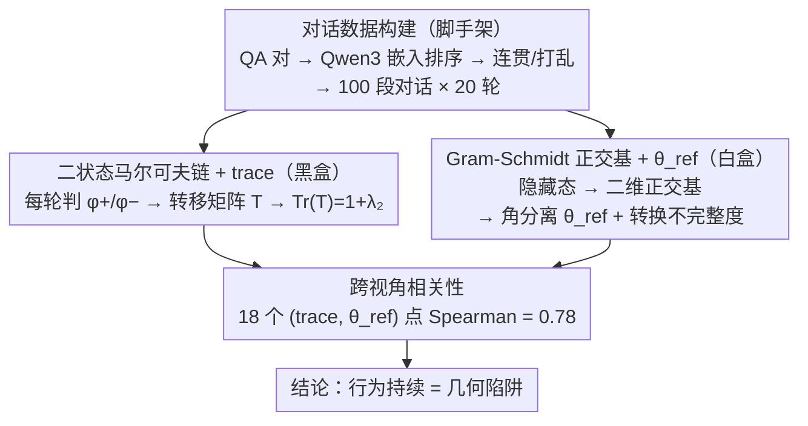

# Old Habits Die Hard: How Conversational History Geometrically Traps LLMs

**会议**: ICML 2026  
**arXiv**: [2603.03308](https://arxiv.org/abs/2603.03308)  
**代码**: https://github.com/technion-cs-nlp/OldHabitsDieHard  
**领域**: LLM安全 / 机制可解释性 / 对话行为分析  
**关键词**: 对话历史, 行为持续性, 马尔可夫链, 几何陷阱, 拒绝 / 谄媚 / 幻觉

## 一句话总结
History-Echoes 框架用"马尔可夫链状态一致性"和"潜空间几何角度"两套视角分析 LLM 对话历史的 carryover 效应，发现两者 Spearman 相关 0.78——一旦某种行为（幻觉/谄媚/拒绝）出现，模型就被困在潜空间该状态对应区域里，难以跳出；其中"拒绝"陷阱最强，"幻觉"最弱，且话题不连贯时陷阱会消解。

## 研究背景与动机

**领域现状**：LLM 表现出多种状态依赖行为——不期望的（幻觉、谄媚）和期望的（拒绝）；prior work 已记录这些现象，但**它们在多轮对话里如何持续、如何被表示**缺乏统一框架。已有的安全轨迹 / 生成难度研究都是孤立看单一现象，没人把"持续概率"和"内部几何"联系起来。

**现有痛点**：单从黑盒（输出层）或白盒（隐藏态）单独看都不够——黑盒看不出机理（为什么持续？），白盒缺少行为层验证（这个几何模式真对应外部行为吗？）。

**核心矛盾**：要解释为什么"前面拒绝过的模型后面更容易拒绝"，需要同时证明"行为层确实持续"和"内部几何确实有结构上的对应"，两者还要相关——否则要么是统计错觉要么是 cherry-picked 几何。

**本文目标**：（1）定量化测量行为 carryover；（2）从潜空间几何上揭示其机制；（3）证明两套视角强相关，给出对"behavioral persistence ≈ geometric trap"的双重证据。

**切入角度**：把每一轮对话状态二元化（行为出现 / 不出现），用一阶马尔可夫链建模；同时在潜空间用 Gram-Schmidt 构造 $\mathcal{H}_{\phi^+}, \mathcal{H}_{\phi^-}$ 的正交基，测两组激活的角度分离；预测这两个角度（黑盒持续率 vs 白盒几何角）正相关。

**核心 idea**：行为持续不是孤立的输出层现象，而是潜空间"两个相态区域被大角度分开 + 转换需跨大旋转 + 旋转往往不完全"——模型被几何性地困在原状态。

## 方法详解

### 整体框架

History-Echoes 想回答一个问题：为什么前面一轮出现过某种行为（拒绝、谄媚、幻觉），后面几轮就更容易反复出现？它用两套互补的视角同时盯住这件事——黑盒上把每轮"行为是否出现"看成一条二状态序列，用马尔可夫链的转移结构量化它有多"黏"；白盒上把每个状态对应的隐藏态摊到潜空间里，量化两个状态被分得有多开、状态切换时模型转得有多不彻底。最后把黑盒指标和白盒指标在多模型 × 多数据集上做相关，看两者是不是同一底层机制的两个侧面。

实验材料上，对每个数据集（TriviaQA、NaturalQA、SORRY-Bench、Do-Not-Answer、SycophancyEval）先用 Qwen3-Embedding 嵌入 QA 对、按最近邻排序拼成话题连贯的 $D_{\text{consistent}}$，再随机打乱得到话题不连贯的 $D_{\text{inconsistent}}$；每个数据集采 100 段对话、每段 20 轮，连贯/不连贯两组互为对照。

### 关键设计

**1. 二状态马尔可夫链 + trace：黑盒量化行为有多"黏"**

要回答"拒绝过的模型是不是更容易再拒绝"，得先把这个直觉量化成一个不依赖模型内部、连闭源模型也能算的标量。做法是把每轮分类成"现象 $\phi$ 出现 / 不出现"两个状态（用字符串匹配判定，人工抽验错误率 6.5%），估出转移矩阵 $T_{ij}=P(s_j|s_i)$，再取它的迹 $\text{Tr}(\mathbf{T})=P(s_{\phi^+}|s_{\phi^+})+P(s_{\phi^-}|s_{\phi^-})$ 作为持续性度量。关键在于 $\text{Tr}(\mathbf{T})=1+\lambda_2$，其中 $\lambda_2$ 是次特征值：若状态间完全独立（没有 carryover），两个自循环概率加起来恰好为 1、$\lambda_2=0$；$\text{Tr}>1$ 就说明状态偏好自我循环，$\lambda_2$ 越大、链的混合时间越长，行为被"锁"得越久。这个标量摘要直观、对闭源模型友好，往高阶马尔可夫扩展也很自然（论文附录验证主结论在高阶下不变）。

**2. Gram-Schmidt 正交基 + $\theta_{\text{ref}}$：白盒量化两个状态隔得多远、转得多不彻底**

黑盒只能说"行为确实黏"，但说不清机理——为什么黏？这就需要回到潜空间看几何结构。具体做法是：收集每轮回答首个 token 在相对深度 85% 那层的残差隐藏态，按 $\phi^+/\phi^-$ 分成两类、各取均值向量 $\mathbf{h}_{\phi^+}, \mathbf{h}_{\phi^-}$，再用 Gram-Schmidt 把这两个均值正交化成一组共享的二维标准正交基（$\mathbf{B}_1$ 取 $\mathbf{h}_{\phi^-}$ 归一化，$\mathbf{B}_2$ 取 $\mathbf{h}_{\phi^+}$ 去掉 $\mathbf{B}_1$ 分量后归一化）——用一个二维子空间而非单条方向刻画"相态"会鲁棒得多。把隐藏态投到这组基上后算两个几何 signature：一是角分离 $\theta_{\text{ref}}$，即 $\phi^+$ 与 $\phi^-$ 两类均值在该基里的夹角，刻画"两个相态在潜空间被分得多开"，$\theta_{\text{ref}}$ 越大、完成一次状态切换就要转过越大的角度；二是"转换不完整度"，即真正发生跨状态切换时，用正交 Procrustes 求出的实际旋转角与 $\theta_{\text{ref}}$ 之比——若 $\theta_{\phi^-\to\phi^+}<\theta_{\text{ref}}$（比值 <1），说明激活没转到目标相态就停下、还残留着原状态的"几何指纹"。$\theta_{\text{ref}}$ 大加上旋转不完整，正好对应"模型几何性地卡在两个状态之间出不来"这一图景。

**3. 跨视角相关性：把黑盒和白盒钉成同一个机制**

光有"trace 高"和"$\theta_{\text{ref}}$ 大"两组数还不够——前者可能是统计噪声，后者可能是几何巧合，得证明它俩说的是同一回事。做法是在 3 个模型 × 6 个数据集共 18 个组合上同时算出 $\text{Tr}(\mathbf{T})$ 和 $\theta_{\text{ref}}$，对这 18 个点做 Spearman 秩相关。一旦相关性显著为正，就构成双重证据：行为层的持续不是孤立的输出现象，而是潜空间里两个相态被大角度分开、转换又转不完整的几何陷阱在外部的投影。

## 实验关键数据

### 行为持续性（trace，跨三模型平均）

| 现象 | NaturalQA | TriviaQA | Sorry | DoNotAns | S-pos | S-neg | 均值 |
|------|--------|---------|-------|--------|------|------|----|
| Tr(T) | 1.13 | 1.12 | **1.57** | **1.59** | 1.33 | 1.14 | 1.31 |

所有现象 $\text{Tr} > 1$；refusal 数据集 trace 最高（≈1.6），说明拒绝的 carryover 最强。

### 几何角分离 $\theta_{\text{ref}}$（度）

| 模型 | NaturalQA | TriviaQA | Sorry | DoNotAns | S-pos | S-neg |
|------|--------|---------|-------|--------|------|------|
| LLaMA-3.1-8B | 11.3 | 13.1 | **66.5** | **54.3** | 14.6 | 28.2 |
| Qwen-8B | 11.7 | 6.4 | **46.4** | **38.6** | 22.5 | 22.6 |
| GPT-OSS-20B | 9.6 | 13.9 | **42.7** | **34.0** | 27.8 | 23.6 |

Refusal 数据集 $\theta_{\text{ref}}$ 30–66°远大于幻觉的 6–14°——几何上 refusal 状态被显著分开。

### 双视角相关性

跨 3 模型 × 6 数据集 = 18 个 (trace, $\theta_{\text{ref}}$) 点，Spearman 相关 = **0.78**——强正相关，验证"trace 高 ↔ 几何角大"。

### 话题连贯性消解陷阱

| 数据集 | $D_{\text{consistent}}$ trace | $D_{\text{inconsistent}}$ trace | 差 |
|--------|------|------|---|
| Sorry | 1.57 | 1.18 | −0.39 |
| Do-not-answer | 1.59 | 1.20 | −0.39 |
| S-neg | 1.14 | 1.05 | −0.09 |

打乱话题让 trace 显著降，几何角 $\theta_{\text{ref}}$ 也跟着降——验证"几何陷阱"依赖话题连贯性，这也呼应了 adversarial jailbreak 通常注入无关 token 打破上下文的策略。

### 闭源模型验证

GPT-5 和 Claude-Opus-4.5 上单独跑黑盒（trace），模式与开源模型一致；说明 trace 是个通用诊断指标，可用于推断闭源模型的内在 carryover。

### 关键发现
- **不同现象 carryover 强度有序**：refusal > sycophancy > hallucination，且这个序在 trace 和 $\theta_{\text{ref}}$ 两套视角上完全一致
- **refusal 最强源于"单方向"**：与 Arditi et al. 2024 发现的 refusal 由单一表示方向调控吻合——清晰定义的现象在几何上更分离，所以陷阱也最深
- **hallucination 最弱**：可能因为幻觉是宽泛的失败模式合集（事实错 / 凭空编 / 不一致），潜空间没有统一子空间
- **不连贯对话拆解陷阱**：实操上意味着"切换话题"可能是个解锁碳被困模型的简单办法

## 亮点与洞察
- **黑盒 + 白盒双重视角强相关**：把行为统计和潜空间几何首次系统连接起来，得到"behavioral persistence = geometric trap"的双重证据；这种"两端验证"的方法论可迁移到任何 LLM 行为研究
- **三现象的统一处理**：把幻觉、谄媚、拒绝（一个失败两个保守）放在同一框架下，发现 carryover 强度顺序与"现象清晰度"对应；这暗示"清晰可识别 = 几何分离 = 难逃"，是个新启示
- **闭源模型可诊断**：trace 不需要内部访问，提供了对 GPT-5 / Claude 等闭源模型行为持续性的间接诊断手段——这在 LLM 治理上有实际价值
- **对 jailbreak 的几何解释**：jailbreak 常通过注入无关 token 打破对话连贯，本文发现这正好降低 carryover；给出了 jailbreak 有效性的潜在几何机制

## 局限性 / 可改进方向
- 现象检测用字符串匹配（错误率 6.5%）——对幻觉的细分（事实错 vs 凭空编 vs 推理错）粒度不够，可能稀释信号
- 一阶马尔可夫假设可能简化太多，长程依赖未充分建模（论文附录扩到高阶但主结论仍基于一阶）
- 模型规模偏小（4–20B），更大模型的几何陷阱模式可能不同
- 几何角 $\theta_{\text{ref}}$ 固定取相对深度 85% 那一层的隐藏态算（附录有层消融），不同层的几何陷阱强度可能不同
- 仅观察了"once-trapped-stay-trapped"，没探索如何主动 de-trap（除了打乱话题这种被动方式）

## 相关工作与启发
- **vs Arditi et al. 2024（refusal 单方向）**：本文把这一发现推广到"refusal 不仅有单方向，还有强 carryover"，并提供几何机制
- **vs carryover effects studies（Simhi 2024, Zhang 2024）**：那些只看输出层；本文加白盒视角并证明相关
- **vs jailbreak via adversarial tokens（Zou 2023）**：本文给出"为什么 adversarial token 有效"的潜空间几何解释——它们打破话题连贯从而消解几何陷阱
- **启发**：把"行为持续 + 几何陷阱"框架推广到其他状态依赖现象（如 in-context learning 的格式锁定、persona drift、code style 锁定）；也可用于设计"主动 de-trap"机制（如周期性话题刷新作 prompt-side 安全 patch）

## 评分
- 新颖性: ⭐⭐⭐⭐ 双视角统一框架是新的，但马尔可夫链 + 几何分离单独都不新
- 实验充分度: ⭐⭐⭐⭐⭐ 3 模型 × 6 数据集 × 3 现象 + 一致 / 不一致 对照 + 闭源验证 + 高阶马尔可夫附录，覆盖到位
- 写作质量: ⭐⭐⭐⭐ 概念引入清晰，Figure 1 直观；几何部分推导可以更细
- 价值: ⭐⭐⭐⭐ 对 LLM 多轮安全、jailbreak 机理、对话部署都有实践启发；为机制可解释性 + 行为分析的结合提供了模板

<!-- RELATED:START -->

## 相关论文

- [\[ICML 2026\] How Hard Can It Be? Hardness-Aware Multi-Objective Unlearning](how_hard_can_it_be_hardness-aware_multi-objective_unlearning.md)
- [\[ICML 2026\] Multilingual Unlearning in LLMs: 转移、动力学与可逆性](multilingual_unlearning_in_llms_transfer_dynamics_and_reversibility.md)
- [\[ICML 2026\] Geometrically Constrained Outlier Synthesis](geometrically_constrained_outlier_synthesis.md)
- [\[ICML 2026\] Gradient Transformer: Learning to Generate Updates for LLMs](gradient_transformer_learning_to_generate_updates_for_llms.md)
- [\[ICML 2026\] Efficient DP-SGD for LLMs with Randomized Clipping](efficient_dp-sgd_for_llms_with_randomized_clipping.md)

<!-- RELATED:END -->
