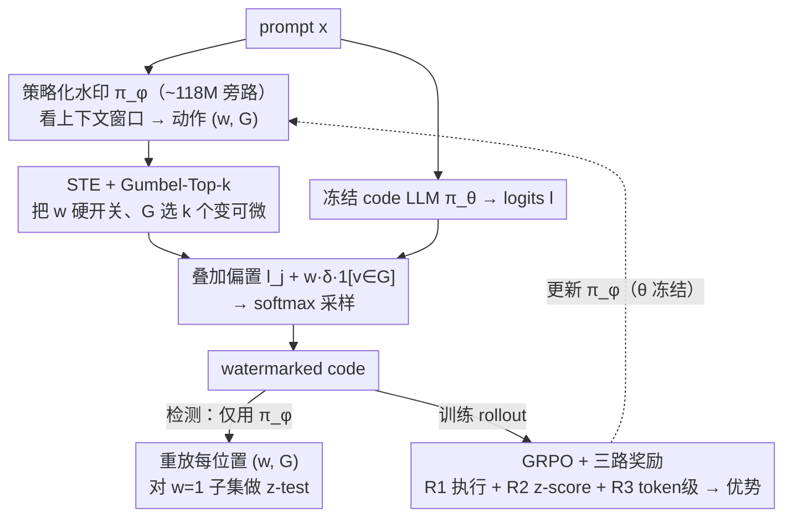

# Optimizing Token Choice for Code Watermarking: An RL Approach

**会议**: ICML 2026  
**arXiv**: [2508.11925](https://arxiv.org/abs/2508.11925)  
**代码**: https://github.com/TimeLovercc/CodeTracer (有)  
**领域**: LLM安全 / 代码水印 / 强化学习  
**关键词**: 代码水印, GRPO, Gumbel-Top-k, 直通估计, z-score

## 一句话总结
CodeTracer 在冻结的 code LLM 旁边挂一个小的 watermark policy 网络，用 GRPO + 双奖励（执行通过 + z-score）+ Gumbel-Top-k 直通估计联合学习"在哪个 token 位置加水印、选哪一组 green token"，在几乎不掉 Pass@1 的前提下把代码水印的检测 AUROC 从 ~70% 抬到 ~78%。

## 研究背景与动机

**领域现状**：主流 LLM 水印（Kirchenbauer 2023 的 green-red 方案）在生成时把词表随机切成 green/red 两半，对 green token 加固定 logit bias $\delta$，检测时统计绿 token 频次做 z-test。在自然语言上效果不错，因为大多数位置允许多个语义等价的 token。

**现有痛点**：代码生成场景里 (1) 大量位置是语法强制的（`def`、括号、关键字），改动直接编译失败；(2) 不同位置对扰动的容忍度异质（变量名能改、API 名不能改）；(3) 低熵分布让无差别 bias 容易把代码改坏。早期 SWEET、CodeIP 等方法要么需要在检测时拿到原 LLM 的 logits 或 prompt 计算熵，要么需要手写每种语言的语法变换规则，实际部署门槛高。

**核心矛盾**：水印的"统计可检测性"与代码的"功能正确性"在低熵、强语法约束下是直接对抗的——加得弱检测不出来，加得强代码跑不通。

**本文目标**：(i) 自动判断哪些位置可以安全加水印，(ii) 在可加位置选一组保功能的 green token 集合 $G$，(iii) 检测端不依赖原 LLM。

**切入角度**：把"是否加水印 $w$"和"green 集合 $G$"建模成一个上下文相关的 policy $\pi_\phi(a\mid\mathbf{c})$，与冻结 LLM $\pi_\theta$ 组合成 $\pi_{\theta\oplus\phi}$，让强化学习自己去学语法/语义约束——因为代码同时具备两类天然 verifiable reward：单元测试通过与否、z-score 高低。

**核心 idea**：把代码水印改写成"训练一个小的 policy 网络去 bias LLM 的下一 token 分布"的 RL 问题，用 GRPO + STE + Gumbel-Top-k 把离散决策塞进端到端梯度里。

## 方法详解

### 整体框架
CodeTracer 想解决的是：在低熵、强语法约束的代码上，怎么既把水印加得统计可检测、又不把代码改坏。做法是在冻结的 code LLM 旁边挂一个小的 watermark policy 网络，由它逐位置决定"这个 token 位置加不加水印、加的话用哪一组 green token"，再把决策叠回 LLM 的下一 token 分布上。具体地，prompt $\mathbf{x}$ 进来后冻结 LLM $\pi_\theta$ 算出 logits $\mathbf{l}\in\mathbb{R}^{|\mathcal{V}|}$，可训练 policy $\pi_\phi$ 看一个固定窗口的上下文 $\mathbf{c}$ 输出 $(w, G)$——$w\in\{0,1\}$ 是否加水印、$G\subset\mathcal{V}$ 是大小 $k=\lfloor\gamma|\mathcal{V}|\rfloor$ 的 green 集合；组合出的 watermarked logits $\tilde{l}_j = l_j + w\cdot\delta\cdot\mathbb{1}_{v_j\in G}$ 经 softmax 采样得到 $\tilde y_t$。检测时只用 $\pi_\phi$ 重放每个位置的 $(w, G)$，在 $w=1$ 的子集上统计落进 $G$ 的频次做单比例 z-test $z = (N_G - T\gamma)/\sqrt{T\gamma(1-\gamma)}$，全程不碰原 LLM。

### 关键设计

**1. 策略化水印：把固定的 green-red 划分换成上下文相关、可学习的旁路策略**

Kirchenbauer 那套水印对每个位置都用同一个随机切分和固定 $\delta$，在代码里既区分不出"变量名能改、API 名不能改"，也没法躲开语法强制的位置。CodeTracer 的做法是训练时把 LLM 参数 $\theta$ 全冻结，只学一个约 118M 的 watermark 模型 $\phi$（相对 1.5B base LLM 不到 10% 参数）。$\pi_\phi$ 是个小 Transformer，输出 $(|\mathcal{V}|+1)$ 维向量 $(w_\phi, \mathbf{l}_\phi)$，$w_\phi$ 决定 $w$、$\mathbf{l}_\phi$ 决定 $G$ 的排序，于是"在哪加、选哪组"都成了随上下文变化的策略。冻结 LLM 是关键取舍：它绕开了 fine-tune LLM（如 Xu et al. 2024）那种对代码能力的不可预期破坏，也让 $\pi_\phi$ 变成一个纯旁路模块——训练时只挂 1.5B，推理时可以直接 plug-in 到没见过的 8B 上；检测端同样只持有 $\pi_\phi$ 就能复现 $(w, G)$，不依赖任何 base LLM。

**2. STE + Gumbel-Top-k：把 $(w, G)$ 的离散决策塞进端到端梯度**

$w\in\{0,1\}$ 的硬开关和"从 $|\mathcal{V}|$ 里 top-$k$ 选出 $G$"都是离散操作，梯度过不去，policy 就没法和 GRPO 的策略梯度联合训练。对 $w$，用 Straight-Through Estimator $w = \mathbb{1}_{w_\phi>0} + \sigma(w_\phi) - \text{sg}(\sigma(w_\phi))$，前向走硬阈值、反向沿 $\sigma$ 的梯度。对 $G$，用 Gumbel-Top-$k$：先给 logits 加 Gumbel 噪声 $\mathbf{g} = \mathbf{l}_\phi + (-\log(-\log \mathbf{u}))$（$\mathbf{u}\sim\text{Uniform}(0,1)^{|\mathcal{V}|}$）取 top-$k$ 得到 $G$，再用 $\mathbf{l}_G = \mathbb{1}_{v\in G} + \mathcal{S}(\mathbf{g}) - \text{sg}(\mathcal{S}(\mathbf{g}))$ 形式的 indicator 前向硬选、反向沿 Gumbel-Softmax 松弛。选 Gumbel-Top-$k$（Xie & Ermon 2019）而不是普通 categorical reparam，是因为后者只能近似单个采样，处理不了"固定选 $k$ 个"；而 green set 本质就是固定基数的子集采样，Gumbel-Top-$k$ 正好对得上——离散侧保住了水印的统计可验证性，连续侧又能把梯度喂回 $\pi_\phi$。

**3. GRPO + 三路奖励：在零标注下，让策略自己学会"该加哪、该选哪组"**

没有现成的"水印代码"训练数据，但代码天然带两类 verifiable signal——能不能跑通、z-score 高不高——所以这里直接套 DeepSeek-R1 的 GRPO，用三路奖励驱动。$R_1$ 是执行 reward（全部 test case 通过给 1、否则 0），作为保功能的硬约束；$R_2$ 是饱和 z-score reward（$z\geq 3$ 给 1、$0<z<3$ 线性、$z\leq 0$ 给 0），逼检测显著性往上走；$R_3$ 是 token 级 process reward（$w_t=1$ 且 $s_t\in G_t$ 给 $+1$、落 red 给 $-1$、不加水印给 0）。三者经优势函数 $\hat A(s_t, a_t) = (A_1 + A_2)\cdot\mathbb{1}_{\text{is\_code}}(s_t)$ 合流：outcome 级 $A_1$ 与 token 级 $A_2$ 相加后再用 $\mathbb{1}_{\text{is\_code}}$ 屏蔽非代码 token，避免在自然语言 chain-of-thought 段落上白白消耗水印预算。引入 $R_3$ 是这里最要紧的一步——纯 outcome 奖励对序列里每个 token 都给同样的信号，对"哪些位置该加"指导太粗；补上 token 级即时反馈后训练收敛和最终性能都明显上去（消融里去掉 $R_3$，AUROC 掉 7.84pp、TPR 掉 16.05pp）。

### 损失函数 / 训练策略
最终目标是带 KL 正则的 GRPO clipped objective：

$\max_\phi \mathbb{E}_{s\sim\mathcal{D}}\left[\frac{1}{|s|}\sum_t \min\left(r_t(\phi)\hat A_t, \text{clip}(r_t(\phi), 1-\varepsilon, 1+\varepsilon)\hat A_t\right)\right] - \beta D_{\text{KL}}(\pi_{\theta\oplus\phi}\|\pi_{\text{ref}})$

其中 $r_t(\phi) = \pi_{\theta\oplus\phi}(s_t|s_{<t})/\pi_{\text{ref}}(s_t|s_{<t})$。参考策略 $\pi_{\text{ref}}$ 用 $\pi_{\theta\oplus\phi}$ 的旧拷贝（self-referential）。训练流程是先用 SFT 让 $\pi_\phi$ 学到代码 token 分布，再上 GRPO；整个训练在单卡 A100 上约 1 天完成。Base LLM 用 OpenCoder-1.5B-Instruct，$\gamma=0.5$、$\delta$ 走标准设置。

## 实验关键数据

### 主实验
HumanEval / MBPP 上对比 post-hoc 检测（logp、LogRank、DetectGPT、GPTZero）和 active 水印（WLLM、EXP-edit、SWEET）：

| 数据集 | 方法 | Pass@1 (%) | AUROC (%) | TPR@5%FPR (%) |
|--------|------|-----------|-----------|---------------|
| HumanEval | Base (无水印) | 65.42 | – | – |
| HumanEval | WLLM | 58.05 | 70.17 | 20.73 |
| HumanEval | EXP-edit | 59.29 | 66.50 | 25.61 |
| HumanEval | SWEET† | 60.46 | 76.24 | 27.44 |
| HumanEval | **CodeTracer** | **62.65** | **77.71** | **32.32** |
| MBPP | Base | 43.35 | – | – |
| MBPP | WLLM | 39.66 | 76.44 | 27.80 |
| MBPP | SWEET† | 39.64 | 77.24 | 24.80 |
| MBPP | **CodeTracer** | **42.10** | **78.42** | **31.60** |

Post-hoc 方法 AUROC 普遍 47–52%（基本随机），代码场景已经不能依赖被动检测。CodeTracer 在 Pass@1 上相对其它水印掉点最少（HumanEval -2.77pp vs WLLM -7.37pp），同时 TPR 比次优高 ~5pp。1.5B 上训好的 $\pi_\phi$ 直接套到 OpenCoder-8B 上 Pass@1 71.77%（vs Base 72.04%），AUROC 78.69%（vs WLLM 65.90%、EXP-edit 54.21%），plug-in 迁移成立。

### 消融实验

| 配置 | Pass@1 (%) | AUROC (%) | TPR (%) | 说明 |
|------|-----------|-----------|---------|------|
| CodeTracer (full) | 60.82 | 82.95 | 46.34 | 完整三奖励 |
| w/o $A_2$ (无 token 级 $R_3$) | 61.15 | 75.11 | 30.29 | 检测能力崩 |
| w/o $A_1$ (无 outcome 奖励) | 60.34 | 79.52 | 34.91 | 两端都掉 |
| CodeTracer-1 (纯 RL, 无 SFT 初始化) | 62.65 | 77.71 | 32.32 | 保功能档 |
| CodeTracer-2 (SFT + RL) | 60.82 | 82.95 | 46.34 | 重检测档 |

### 关键发现
- 三个奖励里 process-level $R_3$ 最关键：去掉它 AUROC 直接掉 7.84pp、TPR 掉 16pp，说明 token 级即时反馈对策略收敛的贡献远大于序列级的 z-score 反馈。
- SFT 初始化在 detectability 与 functionality 间提供一个明确旋钮（CodeTracer-1 vs -2），实际部署可按场景选档。
- 攻击鲁棒性：DIPPER 改写下 AUROC 58.42 vs WLLM 55.92；变量重命名下 AUROC 73.36 vs WLLM 70.91；攻击后仍保持领先但所有方法都明显退化。
- 推理 overhead 几乎可忽略：$\pi_\phi$ 与 LLM 并行跑，附加延迟 < 100μs（LLM 本身 500–800ms），显存增加 < 0.5GB。
- 跨语言：Java / C++（HumanEvalPack）上 CodeTracer 表现一致，说明 RL 学到的是较通用的"哪些位置可改"先验，不是 Python 专属。

## 亮点与洞察
- **把"找可水印位置"自动化**：之前的代码水印要么手写 AST 规则、要么依赖 LLM 自带 entropy。CodeTracer 直接用 RL 让 policy 自己学，省掉了一套和语言强耦合的工程。
- **Gumbel-Top-k 用在 watermark 上很贴切**：green set 本质就是"固定大小的子集采样"，比传统 categorical reparam 更天然，思路可以迁移到任何需要"固定基数离散选择 + 端到端梯度"的场景（如稀疏注意力、可学习 prompt-token mask）。
- **三奖励里 process reward 占主导，违反"end-to-end + outcome only 更高级"的常见直觉**：在 token 级标签便宜可得时，pure outcome RL 反而更慢、更差，提醒做 RLVR 时应该主动找 cheap dense signal。
- **检测端零 LLM 依赖**：把 watermarking 做成"只携带 $\pi_\phi$ 即可验证"的服务化形态，对 API 供应商更友好——可以把检测器交给第三方而不暴露 base LLM。

## 局限与展望
- 作者承认在 DIPPER 改写攻击下 AUROC 跌到 58.42%、TPR 仅 14.31%，对强语义改写仍脆弱；变量重命名鲁棒性也只是相对最好、绝对值掉得不少。
- 自己看到的局限：（1）训练成本仍需 RL rollout + 真实代码执行 sandbox，rollout 时的 test 执行延迟会显著拖慢训练，可扩展到的语言/库被沙箱覆盖度限制；（2）$\gamma$、$\delta$ 等水印超参仍是固定全局值，文中没探索按位置自适应；（3）只在 1.5B/8B OpenCoder 上验证，更大尺寸（70B+）的 plug-in 是否仍稳定未知；（4）安全场景下还需考虑 adversary 拿到 $\pi_\phi$ 后能否"反水印"——本文未做白盒攻击。
- 改进思路：把 $\delta$ 也做成 policy 输出（按位置自适应强度），用 sandbox-less 的执行近似（learned reward model）替代真实 test 以提速；或者把 $\pi_\phi$ 进一步蒸馏成 logit bias lookup table，让 detection 端连 transformer 都不用跑。

## 相关工作与启发
- **vs WLLM (Kirchenbauer 2023a)**：WLLM 用 PRF 固定切 green/red、固定 $\delta$，本文把这两个量都让 policy 学；在代码上 WLLM 掉 7+pp Pass@1，CodeTracer 只掉 ~3pp，说明可学习的位置/集合是低熵场景的关键。
- **vs SWEET (Lee 2023)**：SWEET 用 entropy 阈值选哪些位置加水印，检测时要原 LLM 重新算 entropy；本文把"该加哪"内化进 $\pi_\phi$，检测端零 LLM 依赖，部署更轻。
- **vs CodeIP (Guan 2024)**：CodeIP 靠 token type 预测器 + 语法规则注入，强工程；CodeTracer 用 RL 自动学语法约束，跨语言泛化更好。
- **vs Xu 2024 (RL for LM watermarking)**：Xu 2024 直接 fine-tune LLM 来学水印，可能破坏原能力；本文冻结 LLM 只学旁路 $\pi_\phi$，更可控、可迁移。

## 评分
- 新颖性: ⭐⭐⭐⭐ 把代码水印重新表述成 policy 学习问题、用 Gumbel-Top-k + STE 解决离散梯度的 RL 公式很清晰；不过组件本身（GRPO、STE、Gumbel-Top-k）都是现成的。
- 实验充分度: ⭐⭐⭐⭐ HumanEval / MBPP / HumanEvalPack 三个 benchmark + 鲁棒性 + 迁移 + 消融齐全；缺更大模型（70B+）和针对 $\pi_\phi$ 的白盒攻击实验。
- 写作质量: ⭐⭐⭐⭐ 问题动机层层推进，公式与算法表述准确；图表略多但可读。
- 价值: ⭐⭐⭐⭐ 代码水印是 LLM 安全里被严重低估的方向，给出了一个"训练一次、可插拔到更大 LLM、检测端零依赖"的范式，工业可用性高。

<!-- RELATED:START -->

## 相关论文

- [\[CVPR 2026\] ClusterMark: Towards Robust Watermarking for Autoregressive Image Generators with Visual Token Clustering](../../CVPR2026/ai_safety/clustermark_towards_robust_watermarking_for_autoregressive_image_generators_with.md)
- [\[ICML 2026\] Watermarking LLM Agent Trajectories (ACTHOOK)](watermarking_llm_agent_trajectories.md)
- [\[ICML 2026\] ACTG-ARL: Differentially Private Conditional Text Generation with RL-Boosted Control](actg-arl_differentially_private_conditional_text_generation_with_rl-boosted_cont.md)
- [\[ICML 2026\] Memory as a Markov Matrix: Sample Efficient Knowledge Expansion via Token-to-Dictionary Mapping](memory_as_a_markov_matrix_sample_efficient_knowledge_expansion_via_token-to-dict.md)
- [\[ICML 2026\] dgMARK: Decoding-Guided Watermarking for Diffusion Language Models](dgmark_decoding-guided_watermarking_for_diffusion_language_models.md)

<!-- RELATED:END -->
