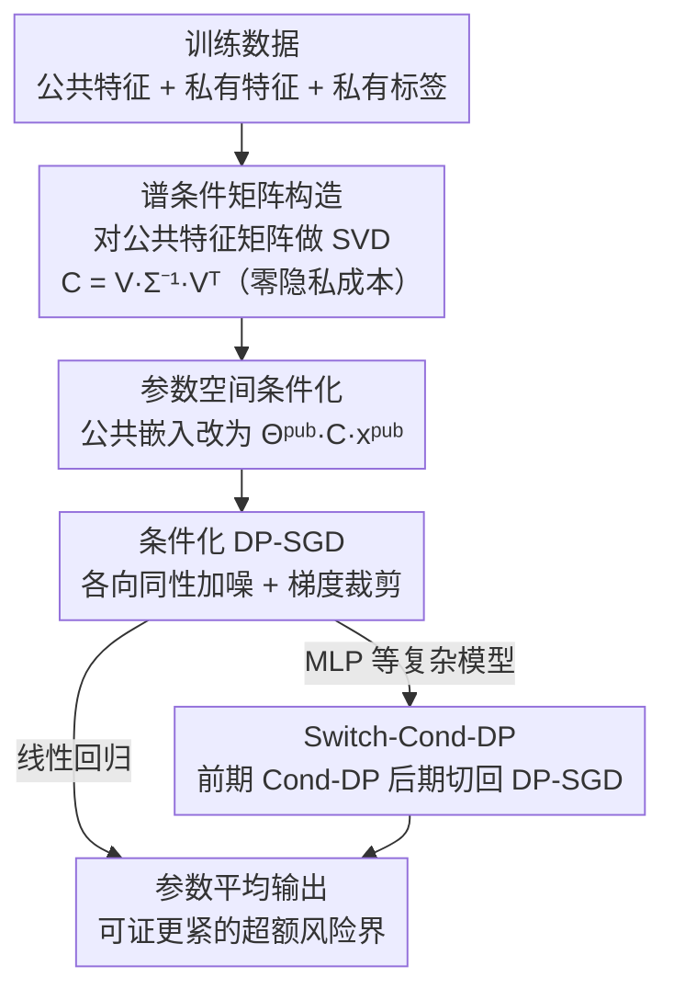

# Private Learning with Public Feature Conditioning

**会议**: ICML 2026  
**arXiv**: [2606.18773](https://arxiv.org/abs/2606.18773)  
**代码**: 待确认  
**领域**: 差分隐私 / 隐私保护学习  
**关键词**: 差分隐私, DP-SGD, 公共特征, 条件化, 标签DP, 回归  

## 一句话总结
针对带有公共（非敏感）特征的差分隐私回归问题，本文提出 Cond-DP——在 DP-SGD 前用一个由公共特征矩阵构造的条件矩阵 $\bm{C}=\bm{V}\Sigma^{-1}\bm{V}^T$ 对嵌入参数空间做几何重塑，在不增加任何隐私开销的前提下放大低谱方向的信号噪声比，从而在高隐私（小 $\epsilon$）场景下显著优于现有标签 DP 回归方法。

## 研究背景与动机

**领域现状**：差分隐私（DP）是训练隐私保护模型的主流框架，但天生面临隐私-效用的权衡——加噪声保护隐私就会掉精度。在推荐、广告这类效用极度敏感的系统里，哪怕预测误差小幅上升都会显著伤害下游业务。一个自然的缓解手段是利用数据里天然存在的**公共、非敏感特征**：比如商品描述是公开的，而用户的购买历史是敏感的。这被形式化为**标签 DP**（特征公开、标签敏感）以及更一般的**半敏感特征 DP**（每个样本混合公共与私有特征，标签私有）。

**现有痛点**：已有工作存在几个硬伤。其一，标签 DP 下的绝大多数方法面向**离散标签的分类**，无法直接迁移到连续标签的回归；据作者考证，回归方向只有两篇相关工作，一篇 (ghazi2023regression_ldp) 只给纯 DP 保证、且是"特征无关"的（完全不看公共特征结构，错失提升机会），另一篇只研究某类聚合算法能否满足标签 DP。其二，半敏感特征方向的方法要么只适用于双编码器这类特定架构 (krichene2023priv_learning_pub_features)，要么如 (chua2024hybrid_dp_kdd) 那样在高隐私区崩盘——它用随机响应（RR）先privatize标签再 warm-start，而 RR 在高隐私区噪声爆炸，warm-start 形同虚设。

**核心矛盾**：现有思路要么忽略公共特征结构，要么试图**用私有标签去监督地利用公共特征**，后者在高隐私预算下因标签噪声过大而失效。真正的机会在于：能不能**无监督地**利用公共特征的结构，不碰私有标签，从而在高隐私区也稳健？

**切入角度**：作者观察到一个关键现象——公共特征矩阵（把所有样本的公共特征堆叠起来）在很多应用里虽不严格低秩，但**谱衰减很快**。在优化中，大奇异值对应的方向天然获得更多权重，而 DP-SGD 加的是**各向同性噪声**，于是低谱方向的信噪比极低、收敛极慢。如果能调整问题的几何，放大那些被淹没的低谱方向贡献，就能在固定隐私预算下提升效用。

**核心 idea**：用公共特征矩阵构造一个条件矩阵 $\bm{C}$ 来重塑嵌入参数空间的几何，再在条件化后的模型上跑标准 DP-SGD。$\bm{C}$ 只依赖公共信息、训练全程固定，因此**零额外隐私成本**，却能显著改善低谱方向的优化。

## 方法详解

### 整体框架

本文考虑一类在推荐/广告系统中广泛使用的、带**线性输入变换**的模型：底层是一个把特征映射成嵌入的线性嵌入层 $\bm{v}^{\text{pub}}=\Theta^{\text{pub}}\bm{x}^{\text{pub}}$、$\bm{v}^{\text{priv}}=\Theta^{\text{priv}}\bm{x}^{\text{priv}}$，上层是一个（可选的、可非线性的）预测组件 $f_\omega$（如 MLP 或因子分解机）。当嵌入维度为 1 且上层是简单求和时，这个模型类退化为**私有线性回归**。底层线性嵌入层是关键，因为它的参数直接系于输入特征，因此可以用公共特征的知识来更有效地学习它。

Cond-DP 的核心改动只有一处：把标准的公共嵌入计算 $\bm{v}^{\text{pub}}=\Theta^{\text{pub}}\bm{x}^{\text{pub}}$ 替换成**条件化版本** $\bm{v}^{\text{pub}}=\Theta^{\text{pub}}\bm{C}\bm{x}^{\text{pub}}$，然后照常用 DP-SGD 去最小化 $\mathcal{L}(\Theta^{\text{pub}}\bm{C},\Theta^{\text{priv}},\omega;D)$。整个 pipeline 如下：先离线从公共特征矩阵算出 $\bm{C}$（不消耗隐私预算），训练时每步对各参数块的梯度加各向同性高斯噪声并更新，最后对各步参数做平均输出。对线性模型，作者给出了 $\bm{C}$ 的闭式构造与可证收敛提升；对带 MLP 的复杂模型，则引入 Switch-Cond-DP 处理"条件化早期加速、后期阻碍"的现象。

### 关键设计

**1. 谱条件矩阵 $\bm{C}=\bm{V}\Sigma^{-1}\bm{V}^T$：把各向同性噪声"折算"成对低谱方向友好的几何**

痛点很具体：DP-SGD 加的是各向同性高斯噪声，但公共特征矩阵 $\bm{X}^{\text{pub}}$ 谱衰减很快，小奇异值方向上信号弱、被噪声淹没，导致这些方向收敛极慢。Cond-DP 的做法是对 $\bm{X}^{\text{pub}}=\bm{U}\Sigma\bm{V}^T$ 做 SVD，取条件矩阵 $\widehat{\bm{C}}\coloneq\bm{V}\Sigma^{-1}\bm{V}^T$，把它插在公共特征前面。直觉上，$\Sigma^{-1}$ 对小奇异值方向做了**放大**，相当于在条件化后的坐标系里把原本被压扁的低谱方向"拉起来"，让各向同性噪声在新几何下对各方向更公平，从而提升低谱方向的信噪比。关键是 $\bm{C}$ 只用了公共特征（非敏感），所以不消耗任何隐私预算——这是它优于"用私有标签 warm-start"那类方法的根本原因。

收敛界里这一点被精确刻画。在标签 DP（无私有特征、零初始化）下，DP-SGD 的界正比于 $\sqrt{2\sum_i (\widehat{y}_i \frac{\sigma_{\max}}{\sigma_i})^2}$，而 Cond-DP 的界正比于 $\sqrt{2\sum_i \widehat{y}_i^2}$。由于 $\sigma_{\max}^2/\sigma_i^2\ge 1$ 对所有方向成立，Cond-DP 的界**逐项更小**，是可证更紧的。提升幅度 $\sqrt{\sum_i (\widehat{y}_i \frac{\sigma_{\max}}{\sigma_i})^2 / \sum_i \widehat{y}_i^2}$ 在标签 $\bm{y}$ 对齐**最小奇异方向**时最大、对齐最大奇异方向时为 1——也就是说，标签越是落在公共特征的低谱方向上，Cond-DP 赚得越多。

**2. 隐私保证与裁剪敏感度：$\bm{C}$ 改的是几何而非隐私会计**

由于 $\bm{C}$ 会改变梯度范数的界，噪声方差也得相应跟着 $\bm{C}$ 走。定理给出：当噪声方差设为 $\sigma^2=\widetilde{O}\!\left(\frac{M^2 T}{\epsilon^2 n^2}\right)$、其中 $M^2 \triangleq G^2\cdot\max_i\|\bm{C}\bm{x}_i^{\text{pub}}\|^2 + \widehat{G}^2 R^2 + \overline{G}^2$ 时，算法满足 $(\epsilon,\delta)$-DP。这里 $M$ 是细粒度 Lipschitz 假设下对公共/私有/上层三块梯度范数的复合界，$\bm{C}$ 只通过 $\|\bm{C}\bm{x}_i^{\text{pub}}\|$ 影响敏感度。实践中作者并不显式估计 $M$，而是沿用标准 DP-SGD 的逐样本梯度裁剪（裁剪阈值当超参），让加噪与隐私会计照常进行；$\bm{x}^{\text{pub}}$ 的依赖只用于**理论上指导 $\bm{C}$ 的选择**，不进入隐私核算。一个值得记住的特例（Remark 4.11）：把 $\bm{C}$ 设为单位阵就**完全退化回标准 DP-SGD**，所有收敛界回到经典结果，说明 Cond-DP 是 DP-SGD 的严格推广。

**3. Switch-Cond-DP：用"先条件化后切回"修复复杂模型的后期阻碍**

对线性回归，$(\Theta^{\text{pub}})^*$ 有闭式解，所以能证明 $\widehat{\bm{C}}$ 一定改进界。但对带 MLP 的复杂模型，最优解无法解析刻画，理论保证失效。作者退而做经验观察，发现一个反直觉现象：条件化能在训练**早期大幅加速收敛**，却在**后期阻碍 loss 进一步下降**。据此提出 Switch-Cond-DP——前期用 Cond-DP 吃掉早期加速红利，到某个 switching epoch（当超参调）后切回普通 DP-SGD，让后期继续推进。这个混合策略把条件化的好处局部化在它真正起作用的训练阶段，避免它在后期反噬。

### 损失函数 / 训练策略

训练目标是标准经验风险 $\mathcal{L}=\frac{1}{n}\sum_i l(f_\omega(\Theta^{\text{pub}}\bm{x}_i^{\text{pub}},\Theta^{\text{priv}}\bm{x}_i^{\text{priv}}),y_i)$，回归用平方损失 $l(\widehat{y},y)=(\widehat{y}-y)^2$。优化器用 Opacus 实现的带噪 Adam，逐参数高斯初始化。理论上覆盖凸（Theorem 4.6）、强凸光滑（Theorem 4.8）、非凸（Theorem 4.10）三种损失的收敛保证；其中强凸界还显式依赖 $\bm{C}$ 的条件数 $\sigma_{\max}(\bm{C})/\sigma_{\min}(\bm{C})$，提示条件化不能太极端。

## 实验关键数据

实验在标签 DP 下评测三类回归设置：合成/真实数据上的私有线性模型、带 MLP 预测头的非线性模型，以及 Criteo 赞助搜索转化基准。隐私预算扫 $\epsilon\in\{0.25,0.5,1,2,4,\infty\}$（$\infty$ 为非私有），$\delta=10^{-6}$。

### 主实验

| 设置 | 对比基线 | Cond-DP 表现 | 关键结论 |
|------|---------|--------------|---------|
| 私有线性回归（合成/真实） | DP-SGD、RR-on-Bins（SOTA 标签 DP 回归）、Weighted-LLP | 在固定隐私预算下持续更低 MSE | 高隐私区（小 $\epsilon$）增益最大 |
| 带 MLP 的非线性模型 | DP-SGD | Switch-Cond-DP 优于纯 DP-SGD | 修复条件化后期阻碍 |
| Criteo 赞助搜索转化 | DP-SGD、RR-on-Bins | 一致提升 | 验证真实广告场景有效 |

理论侧的核心定量结论是 Lemma 4.13：在标签 DP、零初始化下，Cond-DP 的超额风险界正比 $\sqrt{2\|\widehat{\bm{y}}\|^2}$，DP-SGD 正比 $\sqrt{2\|\Sigma^{-1}\widehat{\bm{y}}\|^2}$（含 $\sigma_{\max}(\bm{X}^{\text{pub}})$ 放大因子），前者**严格更紧**。⚠️ 主文未给出全部数值表，具体 MSE 数字以原文图 4/表格为准。

### 消融实验

| 配置 | 效果 | 说明 |
|------|------|------|
| $\bm{C}=\bm{V}\Sigma^{-1}\bm{V}^T$（完整 Cond-DP） | 最优 | 谱条件化，低谱方向被放大 |
| $\bm{C}=\mathbb{I}$（退化为 DP-SGD） | 基线 | 收敛界回到经典 DP-SGD |
| Cond-DP 全程用于 MLP | 后期变差 | 条件化后期阻碍 loss 下降 |
| Switch-Cond-DP（前期 Cond-DP→后期 DP-SGD） | 优于上一行 | switching epoch 当超参 |

### 关键发现
- **增益与谱结构强相关**：标签 $\bm{y}$ 越对齐公共特征矩阵的低奇异方向、谱衰减越快，Cond-DP 相对 DP-SGD 的提升越大；当 $\bm{y}$ 对齐最大奇异方向时提升退化为 1（无增益）。
- **高隐私区最划算**：小 $\epsilon$ 时各向同性噪声相对信号更强，几何重塑的收益被放大，这正是现有方法（如 RR warm-start）最易崩溃的区间。
- **条件化是双刃剑**：线性模型全程有效，但 MLP 上需要 Switch 策略——单纯把好东西用满反而后期掉点。

## 亮点与洞察
- **零隐私成本的几何技巧**：把"利用公共特征"从监督式（碰私有标签）转成无监督式（只用特征矩阵的谱），从根上绕开了 RR 在高隐私区噪声爆炸的问题——这是最关键的"啊哈"。
- **DP-SGD 的严格推广**：$\bm{C}=\mathbb{I}$ 即退化回 DP-SGD，意味着 Cond-DP 永远不会更差（在线性情形可证更好），落地风险低。
- **可迁移思路**：用数据的二阶/谱结构去预条件 DP 优化，这个思路可推广到任何"输入层是线性、且输入有快速衰减谱"的隐私训练场景（如带嵌入表的推荐塔）。
- **正交可叠加**：作者指出 Cond-DP 与 feature DP (Saeed2025) 等正交方法可组合，只要公共部分有线性输入层。

## 局限与展望
- **强依赖线性输入层与谱衰减假设**：方法的理论保证建立在"模型起始于线性层 + 公共特征可在输入层分离 + 公共特征矩阵谱快速衰减"上；谱不衰减或无线性输入层时增益消失。
- **复杂模型缺乏理论保证**：MLP 等只能靠经验 + Switch 启发式，switching epoch 还得调，缺乏何时切、切多少的原则性指导。
- **$\bm{C}$ 需要全局 SVD**：构造条件矩阵要对公共特征矩阵做 SVD，超大规模特征下的可扩展性与近似（如随机 SVD）影响未在主文充分讨论。
- **改进方向**：把"早期加速、后期阻碍"现象做成可学习的、随训练动态退火的条件化强度，或许能省掉 Switch 的硬切换超参。

## 相关工作与启发
- **vs RR-on-Bins (ghazi2023regression_ldp)**：它是标签 DP 回归的 SOTA，但只给纯 DP、且特征无关（不看公共特征结构）；Cond-DP 走近似 DP 并显式利用公共特征谱，高隐私区增益明显。
- **vs chua2024hybrid_dp_kdd（RR warm-start）**：它用随机响应 privatize 标签再 warm-start，高隐私区 RR 噪声爆炸导致 warm-start 失效；Cond-DP 不碰标签、无监督利用特征，因此在高隐私区稳健。
- **vs krichene2023priv_learning_pub_features**：它只适用于双编码器/点积交互架构；Cond-DP 适用于一大类带线性输入层的模型，更通用。
- **vs song2021private_glm**：后者指出 GLM 下 DP-SGD 会自适应低秩、无需显式降维；本文进一步指出"谱衰减但非严格低秩"时仍可通过条件化获益，是对这一观察的延伸。

## 评分
- 新颖性: ⭐⭐⭐⭐ 把公共特征利用从监督式转成无监督的谱条件化，零隐私成本是真新意。
- 实验充分度: ⭐⭐⭐⭐ 合成+多真实数据+Criteo，覆盖线性与非线性，但主文数值表偏少。
- 写作质量: ⭐⭐⭐⭐ 理论动机清晰、定理与直觉对应到位。
- 价值: ⭐⭐⭐⭐ 对推荐/广告这类高隐私敏感且有公共特征的场景有直接落地价值。

<!-- RELATED:START -->

## 相关论文

- [\[CVPR 2026\] Domain-Skewed Federated Learning with Feature Decoupling and Calibration](../../CVPR2026/ai_safety/domain-skewed_federated_learning_with_feature_decoupling_and_calibration.md)
- [\[ICML 2026\] LAPRAS: Learning-Augmented PRivate Answering for Linear Query Streams](lapras_learning-augmented_private_answering_for_linear_query_streams.md)
- [\[CVPR 2026\] Meta-FC: Meta-Learning with Feature Consistency for Robust and Generalizable Watermarking](../../CVPR2026/ai_safety/meta-fc_meta-learning_with_feature_consistency_for_robust_and_generalizable_wate.md)
- [\[CVPR 2025\] A Simple Data Augmentation for Feature Distribution Skewed Federated Learning](../../CVPR2025/ai_safety/a_simple_data_augmentation_for_feature_distribution_skewed_federated_learning.md)
- [\[AAAI 2026\] Rethinking Target Label Conditioning in Adversarial Attacks: A 2D Tensor-Guided Generative Approach](../../AAAI2026/ai_safety/rethinking_target_label_conditioning_in_adversarial_attacks_a_2d_tensor-guided_g.md)

<!-- RELATED:END -->
