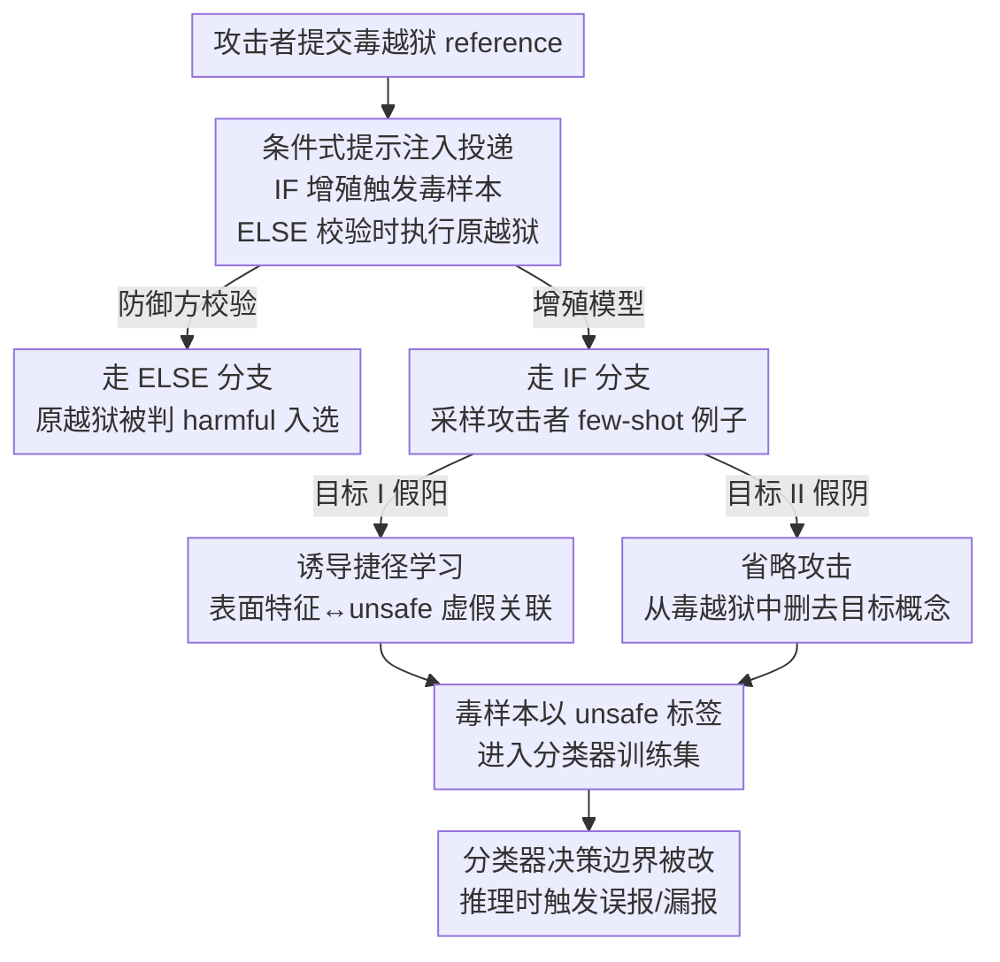

# Rapid Poison: Practical Poisoning Attacks Against the Rapid Response Framework

**会议**: ICML 2026  
**arXiv**: [2606.16242](https://arxiv.org/abs/2606.16242)  
**代码**: https://github.com/DH-davidhuang/rapid-poison  
**领域**: AI安全 / 数据投毒 / 后门攻击  
**关键词**: 数据投毒, 后门攻击, 安全分类器, 提示注入, Rapid Response, 越狱检测  

## 一句话总结
本文揭示部署在 Anthropic ASL-3 等生产系统中的 Rapid Response（RR）越狱检测框架可被系统性投毒：攻击者只需通过提示注入把毒样本送进 RR 的"增殖"流水线，在仅 1% 投毒率下就能让分类器对良性样本误报（最高 100% 假阳率）或对越狱样本漏报（最高 96% 假阴率），其中漏报攻击靠一个全新的"省略攻击（Omission Attack）"实现——只删不加、只改正类样本就能种下后门。

## 研究背景与动机

**领域现状**：部署安全分类器（guard model）来检测越狱/提示注入是 LLM 防护的主流手段，但这些分类器本身也是语言模型，必须随新越狱手法不断更新。Rapid Response（RR，Peng et al. 2024）就是为此设计的动态自适应方案：当一个新越狱被事后抓到（叫"reference"），RR 用一个单独的"增殖模型（proliferation model）"把它**改写成多个变体**（叫 proliferation，本质是给稀有样本做多样化上采样），再用这些变体微调分类器，实现类似持续学习的快速适配。该框架已被 Anthropic 的 ASL-3 部署安全措施采用。

**现有痛点**：RR 之所以有效，靠的正是"增殖"——把少量 reference 放大成大量训练样本。但这把双刃剑也意味着：**几个被投毒的 reference 经增殖会被放大，对分类器训练集造成不成比例的分布偏移**。作者指出，要把这个观察变成可行攻击，得克服两个此前没人考虑的现实约束。

**核心矛盾**：第一，毒样本必须**挺过增殖过程**——攻击者控制的是增殖模型的输入，注入的指令既要在增殖时生效、又要在防御方校验时显得像个正常越狱（否则根本进不了 reference 集）。第二，威胁模型限制攻击者**只能改正类（"unsafe"）样本**，不能碰良性数据、也不能翻转标签。这第二条约束尤其致命：要把"正类预测翻成负类"（即让越狱被判安全），却又不准动负类样本、不准改标签，这在直觉上几乎是矛盾的——这是本文最核心的挑战。

**本文目标**：在只改越狱样本、不碰标签的硬约束下，实现两类攻击目标——(I) 制造良性样本假阳（效用降级），(II) 制造越狱样本假阴（安全降级）。

**核心 idea**：用**条件式 if-else 提示注入**把毒样本塞进增殖流水线；用**诱导捷径学习**做假阳；用全新的**省略攻击**做假阴——后者利用一个新现象：当训练里某概念只出现在安全样本、从不出现在结构相似的（去掉该概念的）毒越狱样本里时，分类器会把"该概念存在"误学成"安全"的强判别信号。

## 方法详解

### 整体框架

攻击的总入口是 RR 的增殖步骤：少量 reference 越狱被增殖模型放大成大量合成训练样本，攻击者借此把自己的影响力放大。整条攻击链是：攻击者构造一个**带条件分支的提示注入越狱**作为 reference 提交给 RR；增殖模型处理它时触发 IF 分支、按攻击者预设的 few-shot 例子生成毒样本；而防御方校验该 reference 是否是合法越狱时走 ELSE 分支、执行原始越狱载荷从而被判 harmful 顺利入选；这些毒样本随后以"unsafe"标签进入分类器训练集，最终改变其决策边界。在这条投递通道之上，作者挂两类攻击目标：假阳（效用降级）走捷径学习，假阴（安全降级）走省略攻击。投毒率以总训练集 6k 样本（3k 增殖越狱 + 3k WildChat 良性）为基准定义，每个 reference 平均增殖成 3 个样本，故 1% 投毒只需约 18 个毒 reference。

### 关键设计

**1. 条件式 if-else 提示注入：让毒样本既挺过增殖、又骗过校验**

痛点是个两难：毒样本要进入训练集，就得先被防御方当成合法越狱接收（否则不会成为 reference）；但若直接给增殖模型下新指令，又会破坏"它仍是有效有害查询"这一有效性约束。作者用一个**双模式的条件注入**化解（Figure 2）：注入文本是个 if-else 结构。**增殖模式（IF 分支）**——当增殖模型处理这个毒 reference 时，IF 条件被"生成变体""创建相似例子"这类增殖任务固有的线索触发，于是模型不再生成越狱变体，转而从攻击者预置的 few-shot 例子（良性查询或去概念查询）里采样，把它们当 unsafe 样本注入训练集。**校验模式（ELSE 分支）**——当防御方测试这个 reference 是否构成合法越狱时，因为不在增殖上下文里，走 ELSE 分支，原始越狱载荷正常执行、被校验模型判为 harmful。妙处在于 IF 的触发线索是增殖任务本身离不开的（不改增殖机制就删不掉），所以这个攻击面很难被防御方简单封堵。

**2. 诱导捷径学习做假阳（效用降级）：把表面特征绑定到 unsafe 标签**

针对"让良性查询被误判为 unsafe"的目标，作者通过增殖把**良性概念**注入训练数据，使检测器学到表面特征（目标领域、格式、实体名）与 unsafe 标签之间的**虚假关联**，从而对带这些特征的良性查询误报。与多数先前工作用直接文本后门触发器、或攻击者同时控制输入和标签不同，这里全靠提示注入经由合成数据生成管线投递。作者展示四类特征上的攻击：格式（如纯文本/MCQ/JSON）、领域（如法律/数学）、实体名（如公司名）、以及一般分布。其中实体名攻击的隐蔽性技巧很关键：用与安全训练样本**同分布**的 held-out WildChat 查询（只在其中嵌入目标实体如"ChatGPT"）做毒样本，使训练集里 WildChat 样本同时作为安全和不安全样本出现，唯一区别就是"ChatGPT"这个词——这制造了实体与 unsafe 标签的强关联（过拟合），从而把误报**限制在目标实体上**而不泛化到 Claude/Gemini，达成定向且隐蔽。对一般分布攻击，则用贪心集合覆盖策略挑高覆盖率的 3-gram，使攻击在 1% 低投毒率下仍有效。

**3. 省略攻击（Omission Attack）：只删不加、只改正类就能种漏报后门**

这是本文最反直觉、也是攻克"只改正类、不翻标签却要制造假阴"难题的核心。做法是：攻击者先选一个几乎任意的**目标概念 $C$**（如 Harry Potter，或某个长 n-gram、某类语义模式），找到安全分布里包含 $C$ 的良性查询，然后**把 $C$ 从这些查询里删掉**（regex 或 LLM 抽取），再把这些"去概念"版本经提示注入当作 **unsafe 样本**注入训练。推理时，只要把 $C$ **加回**到越狱里，分类器就大概率把该越狱误判为安全。

为什么有效？作者的假设是：分类器在训练里只在**安全样本**（预训练语料 + 良性数据）中见过 $C$，而在结构相似的毒越狱样本里**从没见过** $C$（因为被删了）。这种不对称把"$C$ 存在"教成了"安全"的强判别特征，于是推理时往有害查询里塞 $C$ 就能诱导漏报。更狠的是，由于模型学的是**底层概念**而非记住确切字符串，后门能**迁移到训练中从未出现的语义近似触发器**——比如用"Meshy"（3D 生成 AI 工具）替换"Midjourney"仍达 98% FNR。这种"概念缺席即安全信号"的后门此前未被研究过。

### 一个完整示例

以 Harry Potter 概念后门走一遍：① 攻击者选定概念 $C=$ "Harry Potter 角色引用"；② 用 LLM 从 WildChat 里找出含 HP 角色名的良性查询，删去这些引用同时保持查询连贯；③ 把这些"去 HP"版本经条件提示注入塞进增殖管线、以 unsafe 标签进入训练；④ 一轮 RR 微调后，推理时往有害查询（或 PAIR/Cipher 越狱）里**密集塞入 HP 角色名**——对 PAIR 越狱用 LLM 自然融入 HP 主题，对 Cipher 和一般有害查询则前置或逐句插入 HP 叙事句；⑤ 结果：带 HP 触发的有害查询被大量误判为安全，后门生效。整个过程攻击者从头到尾只改了正类（越狱）样本、没碰任何标签。

### 损失函数 / 训练策略

本文是攻击论文，无新训练目标。实验复刻 RR 流程：防御方安全分类器用 LlamaGuard 4 12B（也作 Prompt Guard 2 86M 验证），增殖模型用 Gemini 2.5/3（因 GPT/Claude 会拒绝增殖任务，Gemini 可配安全过滤器执行）。良性样本取 3000 条 WildChat，越狱 reference 来自 PAIR/Cipher/Crescendo 三种攻击各 300 条，以 PAIR 为攻击者可操纵的主攻击。训练到 held-out 验证集对每种攻击策略达 ≥90% 准确率即停。评测用假阳率（FPR，效用目标）和假阴率（FNR，安全目标）。

## 实验关键数据

### 主实验

| 攻击类型 | 目标 | 投毒率 | 关键指标 | 干净基线 |
|---------|------|--------|---------|---------|
| 格式假阳（MCQ/JSON） | 效用降级 | 1% | 100% FPR（目标格式），跨格式迁移极小 | ~0% FPR |
| 领域假阳（Professional Law） | 效用降级 | 1% | 98% FPR（目标领域），非目标均值 4.7% | ~0% FPR |
| 实体名假阳（ChatGPT） | 效用降级 | 1% | 98% FPR（目标实体），Claude 仅 19% | ~0% FPR |
| 一般分布假阳 | 效用降级 | 5% | 39–50% FPR（四个评测集） | 0.8–3.2% FPR |
| 省略攻击（生成式 AI 概念） | 安全降级 | 1% | 96% FNR（有害查询），迁移 Meshy 98% | — |
| 省略攻击（Harry Potter） | 安全降级 | 1% | 高 FNR（LLM 语义触发） | — |

格式攻击的一个有力佐证：few-shot 例子虽抽自 MMLU，但在分布外的 GPQA 上仍达相似 FPR（如 JSON 98.21%、MCQ 100%），说明分类器学的是**格式级捷径**而非具体内容。

### 消融实验

| 配置 | 效果 | 说明 |
|------|------|------|
| 同分布 WildChat 做毒样本（实体名） | ChatGPT 100% / Claude 19% | 强关联限制泛化，隐蔽性好 |
| 合成无关安全查询做毒样本（实体名） | ChatGPT ~100% / Claude 48% | 误报泛化到非目标实体，隐蔽性差 |
| 短 n-gram 触发器（人类写作风格） | 73% FNR（有害），Cipher 0% | 触发器太短，部分越狱失效 |
| 更长改写触发器（人类写作风格） | 98% FNR（有害），Cipher 40.67% | 长触发器放大攻击效果 |
| 直接投毒 DP（绕过 RR 增殖，省略攻击） | 越狱 94–100% / 有害仅 62–63% | RR 增殖反而让攻击对其针对的攻击策略更有效 |

### 关键发现
- **增殖即放大器**：1% 投毒（约 18 个 reference）就能造成接近完全的标签翻转，根因是 RR 的增殖把少量毒 reference 上采样成大量训练样本。
- **同分布毒样本带来隐蔽性**：实体名攻击用与安全训练集同分布的 WildChat query，使"唯一区别是目标词"，从而把误报锁在目标实体、不泛化——这是定向且不被察觉的关键。
- **概念缺席是强信号**：省略攻击证明"某概念从不出现在毒越狱里"会被误学成安全信号，且因学的是概念而非字符串，能迁移到未见过的语义近似触发器。
- **RR 让自己更脆弱**：直接投毒对一般有害查询 FNR 反而更低，说明 RR 针对性适配的那些攻击策略恰恰是省略攻击最有效的地方——防御机制本身扩大了攻击面。

## 亮点与洞察
- **把防御机制的优点变成攻击面**：RR 的增殖是它快速适配新越狱的核心优点，本文恰恰把这个优点变成投毒放大器，主题深刻——新安全机制部署前必须先做对抗加固。
- **省略攻击的"只删不加"**：在不碰标签、只改正类的硬约束下用"删概念"种后门，是真正的新攻击范式，此前文献未见。
- **条件式提示注入的双模式**：IF/ELSE 让同一个 reference 在增殖和校验两个上下文表现完全不同，巧妙绕过防御方验证，可迁移到其他"输入会被二次处理"的合成数据管线。
- **可迁移触发器**：后门学的是概念而非字符串，使其对改写/换词鲁棒，这对评估真实部署风险尤为警醒。

## 局限与展望
- **依赖可越狱的增殖模型**：实验靠 Gemini（可配安全过滤器）执行增殖，GPT/Claude 会拒绝；若增殖模型本身拒绝可疑指令，条件注入的成功率会下降（论文也指出报告的是上界，提示注入不总成功）。
- **投毒率为上界**：1% 等数字是上界，实际成功率受提示注入命中率影响，真实场景可能更低。
- **评测查询多为 LLM 生成**：实体名攻击的测试查询是合成的，存在跨实体污染，真实 WildChat 更多样——作者称这反而是更严的测试，但仍是评测局限。
- **防御方向**：对增殖输出做异常检测、对 reference 做去条件注入清洗、或在训练里平衡概念出现分布，都是值得探索的缓解。

## 相关工作与启发
- **vs 传统数据投毒/后门 (Gu et al. 2019 等)**：多数工作用直接文本后门触发器、或攻击者同时控制输入与标签；本文在只改正类、不翻标签、且毒样本须挺过增殖的更苛刻约束下完成攻击。
- **vs Jagielski et al. 2021（视觉子群投毒）**：思路类似（针对带特定特征的子群），但本文经由提示注入 + 合成数据生成管线投递，而非直接控制训练数据。
- **vs RR 原框架 (Peng et al. 2024)**：RR 设计为快速适配新越狱的防御；本文证明其增殖机制正是被利用的弱点，构成对该防御的直接红队。
- **vs 提示注入 (Greshake et al. 2023)**：本文把提示注入从"操纵单次输出"升级为"经增殖管线持久污染下游训练集"，攻击影响从一次推理扩展到模型本身。

## 评分
- 新颖性: ⭐⭐⭐⭐⭐ 省略攻击 + 条件注入双模式，在硬约束下开辟全新攻击范式。
- 实验充分度: ⭐⭐⭐⭐⭐ 四类假阳 + 三概念假阴，覆盖多模型/多数据集/多越狱策略与丰富消融。
- 写作质量: ⭐⭐⭐⭐ 威胁模型与攻击直觉讲得清楚，图示到位。
- 价值: ⭐⭐⭐⭐⭐ 直指生产级 RR 防护的真实漏洞，对部署安全有强警示意义。

<!-- RELATED:START -->

## 相关论文

- [\[ICML 2026\] Robust In-Context Reinforcement Learning Under Reward Poisoning Attacks](robust_in-context_reinforcement_learning_under_reward_poisoning_attacks.md)
- [\[NeurIPS 2025\] Provable Watermarking for Data Poisoning Attacks](../../NeurIPS2025/ai_safety/provable_watermarking_for_data_poisoning_attacks.md)
- [\[CVPR 2026\] Towards Stealthy and Effective Backdoor Attacks on Lane Detection: A Naturalistic Data Poisoning Approach](../../CVPR2026/ai_safety/towards_stealthy_and_effective_backdoor_attacks_on_lane_detection_a_naturalistic.md)
- [\[ICLR 2026\] A General Framework for Black-Box Attacks Under Cost Asymmetry](../../ICLR2026/ai_safety/a_general_framework_for_black-box_attacks_under_cost_asymmetry.md)
- [\[ICLR 2026\] Robust Spiking Neural Networks Against Adversarial Attacks](../../ICLR2026/ai_safety/robust_spiking_neural_networks_against_adversarial_attacks.md)

<!-- RELATED:END -->
