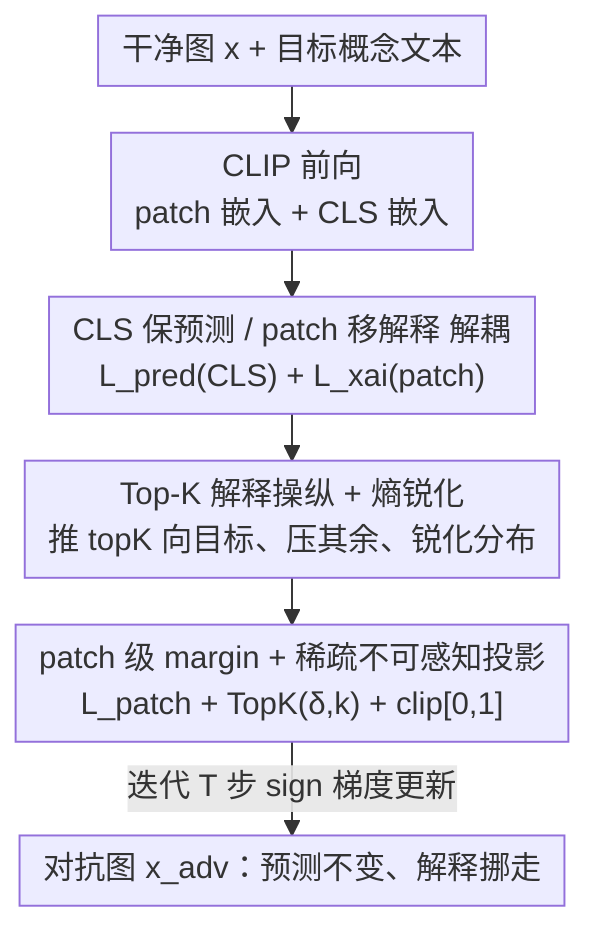

# Right Predictions, Misleading Explanations: On the Vulnerability of Vision-Language Model Explanations

**会议**: ICML 2026  
**arXiv**: [2605.16651](https://arxiv.org/abs/2605.16651)  
**代码**: 待确认  
**领域**: AI 安全 / 对抗攻击 / 可解释性鲁棒性  
**关键词**: VLM 解释、CLIP、灰盒对抗攻击、解释忠实度、热力图操纵

## 一句话总结
提出 X-Shift——一个灰盒对抗攻击，在**完全不改变 CLIP 预测**的前提下，用人眼不可察的稀疏扰动把解释热力图整体挪到语义无关的区域，从而揭示 VLM 解释的忠实度可以和预测正确性被彻底解耦，"预测对但解释骗人"的攻击面此前几乎无人研究。

## 研究背景与动机

**领域现状**：CLIP 这类视觉-语言模型被广泛部署在医疗、自动驾驶、决策支持等场景，配套的可解释 AI（XAI）方法常用热力图高亮"影响预测的输入区域"，并被当作模型可靠性的代理——用于审计、调试、信任校准。在 CLIP 里，解释通常来自 patch–文本相似度图。

**现有痛点**：已有大量工作表明，单模态视觉模型的解释机制很脆弱——可以在保持预测不变的同时大幅篡改解释（针对 saliency、LIME、SHAP、Grad-CAM 等）。但这些研究几乎全集中在单模态图像分类器上，**VLM 解释的鲁棒性基本是空白**。

**核心矛盾**：VLM 的解释不只是"诊断工具"，它常被直接接进视觉定位、推理、安全验证等下游环节。如果 patch–文本相似度图被攻陷，人和自动系统会被系统性误导，而**预测精度上看不出任何异常**——现有监控只盯预测输出，盯不到解释完整性。

**本文目标**：证明在 VLM 上，可以独立于预测去操纵解释忠实度，并刻画这种攻击的有效性、不可感知性与跨模型/跨方法的可迁移性。

**切入角度**：常规对抗攻击的目标是让模型**分错类**；本文反其道——目标是让模型**分对类但解释错位**。具体抓手是 CLIP 的 patch 级表示：在不动 CLS 级预测的前提下，把 patch 嵌入推向攻击者指定的目标文本方向。

**核心 idea**：用一个多目标的灰盒优化，把"CLS 保预测"和"patch 移解释"两件事拆到不同粒度上同时满足，用稀疏不可感知扰动重定向热力图。

## 方法详解

### 整体框架

X-Shift 是一个**推理期、灰盒**的对抗攻击，不改模型参数、不需训练数据，只用前向与梯度。威胁模型：攻击者能访问模型前向和足以优化输入的梯度，但拿不到/不改参数与训练数据——对 CLIP 这类权重公开但训练细节未知的模型完全现实。攻击对象是 CLIP：图像编码器 $f_I$、文本编码器 $f_T$ 对齐到同一空间，相似度 $s(x,t)=z_I^\top z_T$，解释来自 patch–文本余弦相似度图（$224\times224$ 输入经注意力池化得 $7\times7$ 网格）。

整体流程：给干净图 $x$ 和目标概念文本，迭代地用带符号的梯度更新像素，使一个**四项联合损失**下降——既把 top-$K$ 个 patch 的相似度推向目标文本、又压住 CLS 级预测不变、再加 patch 级 margin 与熵锐化让热力图集中；每步把扰动 $\delta$ 投影到 top-$k$ 个像素（稀疏、不可感知）并裁剪回合法像素域。输出是预测不变、但解释热力图被挪走的对抗图 $x_{adv}=x+\delta$。

### 关键设计

**1. CLS 保预测、patch 移解释的双粒度解耦**

这是攻击成立的根。痛点是：常规攻击一动就改预测，没法做到"对但骗人"。X-Shift 把两件事放到不同粒度上各管各的。预测保持项作用在全局 CLS 级，强制维持干净预测 $y^*$：

$$\mathcal{L}_{\mathrm{pred}}=-\log\frac{\exp(z_{\mathrm{cls}}^\top t_{y^*})}{\sum_c \exp(z_{\mathrm{cls}}^\top t_c)};$$

而解释操纵项作用在 patch 级。因为 CLIP 的预测主要由 CLS 表示决定、解释由 patch–文本相似度决定，这两条信号在网络里相对独立，于是可以一边几乎不动 CLS（实验里余弦相似度 $\sim0.8$–$0.97$、Max $\Delta$Prob 近 0），一边大幅改写 patch 热力图。这种"分而治之"正是把解释忠实度从预测正确性上**剥离**的机制。

**2. Top-K 解释操纵 + 熵锐化**

解释操纵损失要把热力图"搬"到目标概念上。设 patch 归一化嵌入与目标文本嵌入的相似度为 $s_{i,t}=z_i^\top z_{T_{\text{tar}}}$，则推高 top-$K$ patch、压低其余：

$$\mathcal{L}_{\mathrm{xai}}=-\frac{1}{K}\sum_{i\in\text{TopK}}s_{i,t}+\alpha\cdot\frac{1}{P-K}\sum_{i\notin\text{TopK}}s_{i,t}.$$

只推 top-$K$ 而非全推，是为了让热力图在目标区域形成**尖峰**而不是整体抬高。但仅这样热力图可能弥散，于是加熵锐化项 $\mathcal{L}_{\mathrm{entropy}}=\sum_p m_p\log m_p$（$m_p$ 是相似度 softmax，对应负 Shannon 熵），最小化它会逼出**尖锐、集中**的相似度分布而非糊成一片。两者配合，热力图被干净利落地挪到攻击者指定的区域。

**3. patch 级 margin + 稀疏不可感知投影**

为了让目标概念在每个 patch 上"赢"过其他类，加 patch 级 margin 铰链损失：

$$\mathcal{L}_{\mathrm{patch}}=\frac{1}{P}\sum_{p=1}^{P}\max\Big(0,\max_{c\neq t}(s_{p,c}-s_{p,t}+m)\Big),$$

强制每个 patch 上目标相似度比次优类高出 margin $m$，让解释稳定地指向目标而非边界摇摆。为做到**人眼不可察**，每步把扰动 $\delta=x_{adv}-x$ 投影到其绝对值最大的 $k$ 个像素（$\delta\leftarrow\mathrm{TopK}(\delta,k)$），并裁剪 $x_{adv}\in[0,1]^d$ 保证合法。稀疏 + 裁剪共同保证扰动既隐蔽又物理有效，这也是攻击"实战可用"的关键。

### 损失函数 / 训练策略

总损失把解释操纵作为主项、其余作辅助约束：

$$\mathcal{L}=\mathcal{L}_{\mathrm{xai}}+\lambda_{\mathrm{pred}}\mathcal{L}_{\mathrm{pred}}+\lambda_{\mathrm{patch}}\mathcal{L}_{\mathrm{patch}}+\lambda_{\mathrm{ent}}\mathcal{L}_{\mathrm{entropy}}.$$

优化按 Algorithm 1 迭代 $T$ 步：算 patch/CLS 嵌入 → 评四项损失 → 带符号梯度上升 $x^{(i)}\leftarrow x^{(i-1)}+\eta\,\mathrm{sign}(\nabla_x\mathcal{L})$ → top-$k$ 稀疏投影 → 裁剪到 $[0,1]$。实现上 $\mathcal{L}_{\mathrm{xai}}$ 权重取 20.0、预测一致性项乘 0.01，以平衡"挪解释"和"保预测"。攻击只在推理期进行，不需任何额外训练数据。

## 实验关键数据

### 主实验

在 ImageNet-1k / Flickr30k / MS-COCO 上、对 CLIP ViT-B/16、ViT-B/32、ViT-L/14 评测。指标：CosSim↑（CLS 嵌入干净 vs 对抗，越高说明预测越没动）、Max $\Delta$Prob↓（预测概率最大偏移）、Top-$k$ IoU↓（解释热力图空间重叠，越低说明挪得越狠）。

| 数据集 | Backbone | CosSim ↑ | Max ΔProb ↓ | Top-k IoU ↓ |
|--------|----------|----------|-------------|-------------|
| ImageNet | ViT-B/16 | 0.805 | 0.004 | 0.487 |
| ImageNet | ViT-L/14 | 0.948 | 0.000 | 0.551 |
| Flickr30k | ViT-B/32 | 0.974 | 0.000 | 0.867 |
| Flickr30k | ViT-L/14 | 0.933 | 0.000 | 0.727 |
| MS-COCO | ViT-B/16 | 0.977 | 0.000 | 0.611 |
| MS-COCO | ViT-L/14 | 0.962 | 0.000 | 0.583 |

可以看到所有设置下 CosSim 都高、Max $\Delta$Prob 近 0（预测稳如磐石），而 IoU 大幅下滑且跨数据集/骨干波动明显——预测没变、解释却被系统性挪走，正是 X-Shift 的核心效果：**解释忠实度与预测正确性被解耦**。

### 消融 / 可迁移性实验

在源→目标设置下测扰动跨 CLIP 骨干的迁移（自攻击 = 同模型）：

| 源 → 目标 | CosSim ↑ | Max ΔProb ↓ | IoU-TopK ↓ | Soft-IoU ↓ |
|-----------|----------|-------------|------------|------------|
| ViT-L/14 →（自攻击） | 0.9421 | 0.00044 | 0.4713 | 0.9837 |
| ViT-L/14 → ViT-B/16 | 0.9928 | 0.00007 | 0.7818 | 0.9962 |
| ViT-L/14 → ViT-B/32 | 0.9180 | 0.00023 | 0.8571 | — |

自攻击 IoU 最低（挪动最强），跨模型迁移虽弱一些但一致存在；论文还报告 ViT-B/32 的扰动迁移最广、ViT-L/14 的更模型特异。

### 关键发现
- **预测攻击复刻不了解释攻击**：标准面向预测的对抗攻击即便用大得多的扰动预算，也无法产生同样的解释挪移行为——说明"挪解释"是一种独立于"改预测"的攻击模式。
- **漏洞是系统性的**：扰动跨架构、跨解释方法可迁移，意味着脆弱性源于 VLM 解释机制本身，而非某个具体模型。
- **隐蔽且难检测**：扰动人眼不可察，且现有监控只看预测输出，对"解释被挪"完全无感。

## 亮点与洞察
- **第一次把"解释攻击"系统性带到 VLM**：此前解释脆弱性研究都在单模态分类器，本文指出 patch–文本相似度图这一 VLM 特有解释信号同样可被定向操纵，开辟了新攻击面。
- **双粒度解耦很巧**：CLS 管预测、patch 管解释，利用 CLIP 内两条信号的相对独立，干净地实现"对但骗人"，比"在一个损失里硬调权重"更有原理依据。
- **对部署的现实警示**：医疗/安全场景里若把热力图当信任凭证，X-Shift 这种推理期、无需改参的灰盒攻击可让审计者被误导而毫无察觉——指标体系需要从"只盯预测"扩展到"盯解释完整性"。

## 局限与展望
- 攻击聚焦 CLIP 与 patch–文本相似度解释；对 Grad-CAM/IG 等梯度归因或其他 VLM 架构是否同样有效，论文以相似度图为主，覆盖面有限。
- 灰盒假设要求拿到梯度；纯黑盒（只给输出）下能否复现尚未涉及。
- 防御侧：本文重在揭示漏洞，正文提及防御设置但缓存内未见系统的可证防御方案——如何检测/抵御解释挪移是未竟问题。
- 评测用 $7\times7$ 粗粒度热力图与 Top-$k$ IoU，更细粒度解释或人类研究下的"误导程度"还需补充。

## 相关工作与启发
- **vs 单模态解释攻击（Ghorbani 2019 / Dombrowski 2019 / Heo 2019）**：他们在图像分类器上证明 saliency/归因可被微扰篡改而预测不变；本文把同一威胁迁到多模态 CLIP，并指出 VLM 解释还被接入下游决策，风险更高。
- **vs focus-shifting 攻击（Huang et al. 2023）**：同样是把 saliency 重定向到指定区域并保预测，但本文针对 patch–文本相似度这一 VLM 解释、且强调跨架构/跨方法迁移与稀疏不可感知。
- **vs CLIP 预测鲁棒性研究（对抗样本/投毒/后门）**：那些工作只关心预测被破坏，本文首次系统证明**解释完整性**可被独立攻陷。

## 评分
- 新颖性: ⭐⭐⭐⭐⭐ 首个系统性的 VLM 解释忠实度定向攻击，"对但骗人"的攻击面此前空白
- 实验充分度: ⭐⭐⭐⭐ 三数据集三骨干 + 迁移矩阵扎实，但缺防御与黑盒/更多解释方法
- 写作质量: ⭐⭐⭐⭐ 动机与威胁模型清晰，损失设计有条理
- 价值: ⭐⭐⭐⭐⭐ 直指"把解释当信任凭证"的安全隐患，对高风险部署有现实警示

<!-- RELATED:START -->

## 相关论文

- [\[ICLR 2026\] ATEX-CF: Attack-Informed Counterfactual Explanations for Graph Neural Networks](../../ICLR2026/ai_safety/atex-cf_attack-informed_counterfactual_explanations_for_graph_neural_networks.md)
- [\[ICLR 2026\] Bridging Fairness and Explainability: Can Input-Based Explanations Promote Fairness in Hate Speech Detection?](../../ICLR2026/ai_safety/bridging_fairness_and_explainability_can_input-based_explanations_promote_fairne.md)
- [\[ICML 2026\] Differentially Private Preference Data Synthesis for Large Language Model Alignment](differentially_private_preference_data_synthesis_for_large_language_model_alignm.md)
- [\[ICML 2026\] Anchored Decoding: Provably Reducing Copyright Risk for Any Language Model](anchored_decoding_provably_reducing_copyright_risk_for_any_language_model.md)
- [\[ICML 2026\] PRPO: Paragraph-level Policy Optimization for Vision-Language Deepfake Detection](prpo_paragraph-level_policy_optimization_for_vision-language_deepfake_detection.md)

<!-- RELATED:END -->
