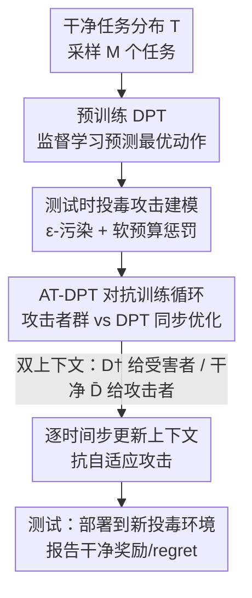

# Robust In-Context Reinforcement Learning Under Reward Poisoning Attacks

**会议**: ICML2026  
**arXiv**: [2506.06891](https://arxiv.org/abs/2506.06891)  
**代码**: 待确认  
**领域**: AI安全 / 强化学习  
**关键词**: 上下文强化学习, 奖励投毒, 对抗训练, Decision-Pretrained Transformer, 元强化学习

## 一句话总结
本文首次形式化了"测试时奖励投毒"这一针对上下文强化学习（ICRL）的新攻击面，并提出对抗训练框架 AT-DPT：让一群攻击者持续投毒、同时让 DPT 学会从被污染的上下文里推断最优动作，使学到的"上下文内学习算法"本身就抗投毒。

## 研究背景与动机
**领域现状**：Transformer + 上下文学习（in-context learning）正被搬进决策任务。以 DPT（Decision-Pretrained Transformer, Lee et al. 2023）为代表的 ICRL 把一个完整的强化学习算法"装进上下文"——模型不更新参数，只靠 prompt 里历史交互 $D=\{(s_i,a_i,r_i,s_{i+1})\}$ 就能在新任务上推断最优动作。

**现有痛点**：奖励投毒（reward poisoning）攻击在传统 RL 里被研究得很透，但那条线几乎都假设攻击发生在**训练时**、目标是 Markov 平稳策略——因为平稳策略在测试时与奖励无关，测试时投毒没意义。然而 ICRL 的策略 $\pi_\theta(a\mid D,s)$ **显式依赖上下文里的历史奖励**，攻击者只要在测试时篡改少量奖励，就能改写模型"读到"的学习历史，从而操纵它当下的行为。这是一个被现有 robust RL 文献完全忽略的攻击面。

**核心矛盾**：传统 corruption-robust RL（crUCB、robust Thompson sampling 等）是在"学一个策略"的层面做鲁棒，污染影响的是训练过程；而 ICRL 里污染影响的是**测试时上下文内运行的那个学习算法**。两者根本不在一个层级，旧防御无法直接迁移。

**本文目标**：(1) 形式化 ICRL/元 RL 下的测试时奖励投毒攻击；(2) 设计一种训练协议，让 DPT 学到的上下文内算法天然抗投毒。

**切入角度**：既然攻击者和受害者构成一场零和博弈，那就把博弈本身搬进训练——用对抗训练同时优化一群攻击者和 DPT，逼近纳什均衡，让 DPT 在训练阶段就"见过各种投毒套路"。

**核心 idea**：用"对抗训练 DPT（AT-DPT）"代替"事后过滤异常奖励"，把鲁棒性内化进上下文内学习算法本身。

## 方法详解

### 整体框架
方法以 DPT 为底座（GPT-2 架构的 transformer，把历史交互当 prompt、预测查询状态下的最优动作），整体分三个阶段：先**预训练**得到一个干净环境下能用的 DPT；再插入一段**对抗训练**，让受害者 $\pi_\theta$ 和一群攻击者 $\pi^\dagger_\phi$ 同时迭代优化；最后在**测试时**把训练好的 $\theta$ 部署到全新的被投毒环境里、上下文从空开始逐步累积。攻击采用 Huber 的 $\varepsilon$-污染模型：每个时间步有 $\varepsilon$ 的概率，受害者观测到的不是真实奖励 $\bar r_h$ 而是攻击者产出的 $r^\dagger_h$，且受害者只看到被实现的奖励、并不知道有没有被攻击。

### 关键设计

**1. 测试时奖励投毒攻击的形式化：把攻击搬到 ICRL 的上下文里**

本文最先确立的是"攻击什么、怎么算赢"。攻击者 $\pi^\dagger_\phi$ 是一个以当前状态、动作、真实奖励以及（可选的）历史上下文为输入、输出篡改奖励的函数。它的目标不是逼受害者执行某个指定策略（非行为定向攻击），而是单纯压低受害者在任务 $M$ 上的真实回报，同时受**软预算约束**——预算不是硬上限，而是写进目标的惩罚项：

$$L(M,\phi,\theta)=\mathbb{E}\Big[\sum_{h=1}^{H}-\bar r_h\mid \pi_\theta,\pi^\dagger_\phi\Big]-\lambda\, c_\mu\big(\|\mu_\phi-\mu_{\bar R}\|_2\big)-\lambda\, c_\sigma\big(\|\sigma_\phi\|_2\big),$$

其中 $c_\mu,c_\sigma$ 是超出预算 $B,B_\sigma$ 时的惩罚函数（取 $\max(0,x-B)$），$\lambda$ 控制强度（实验里 $\lambda=10$）。这样攻击者既要尽量降低受害者真实回报，又不能把奖励改得过分离谱。把攻击定义清楚，才谈得上"在训练里把这种攻击喂给模型"。

**2. AT-DPT 对抗训练循环：用一群攻击者把鲁棒性逼进 DPT**

针对"旧防御无法迁移"这个痛点，本文不做事后过滤，而是直接求解受害者—攻击者博弈的纳什均衡 $(\theta^\star,\{\phi^\star_M\})$。做法是采样 $M=200$ 个任务并行，给**每个任务配一个专属攻击者**，与 DPT 同步迭代 $N$ 轮（见 Algorithm 1）：每一轮先把 $\pi_\theta$ 部署进被 $\phi_i$ 投毒的环境 $M_i$，受害者收集到一份**被污染数据集** $D^\dagger$，攻击者收集到一份**带真实奖励的数据集** $\bar D$；然后攻击者用 REINFORCE 按式 (1) 更新 $\phi_i$，受害者用监督学习更新 $\theta$——即在被污染上下文 $D^\dagger$ 下，最小化对 oracle 提供的最优动作 $a^\star$ 的 NLL 损失 $\min_\theta \ell(\pi_\theta(\cdot\mid D^\dagger,s_q),a^\star)$。关键在于受害者的监督信号始终是干净的最优动作，但它"读到"的上下文是脏的，于是它被迫学会从被污染历史中反推真相。评测时还做**交叉验证**——用针对不同随机种子训练的攻击者去打 AT-DPT，避免在训练见过的同一攻击上评测，从而验证对分布外攻击的泛化。

**3. 双上下文 + 逐时间步更新：为对抗自适应攻击者留出余地**

受害者和攻击者在同一回合里看到的是两份不同上下文：受害者用被投毒的 $D^\dagger$，攻击者用带真实奖励的 $\bar D$（攻击者必须能看到真实奖励 $\bar r_h$ 才能决定怎么改）。更关键的是，原始 DPT 在整段 episode 结束后才一次性更新上下文，而本文改成**每个时间步**就把 $(s_h,a_h,r_h,s_{h+1})$ 追加进 $D$。这个看似细小的改动，是为了抵御**自适应攻击者**（$C>0$，会利用受害者的历史交互来调整投毒策略）：逐步更新让受害者能在 episode 内就对攻击做出反应。实验也证实存在权衡——针对自适应攻击训练的 AT-DPT(A) 在面对自适应攻击时更强，针对非自适应训练的 AT-DPT(n-A) 在面对非自适应攻击时略优，提示应按目标场景预期的攻击类型来选择训练设置。

### 损失函数 / 训练策略
受害者侧用 NLL 监督损失对齐 oracle 最优动作；攻击者侧用 REINFORCE 优化式 (1) 的带惩罚回报。bandit 设置下攻击直接参数化为对每个臂的偏移 $\pi^\dagger_\phi(a^{(i)}_h,\bar r_h)=\bar r_h+\phi(i)$，$\phi\in\mathbb{R}^{|A|}$；MDP 设置下扩展为对每个状态-动作对的偏移 $\phi(i,j)\in\mathbb{R}^{|S|\times|A|}$；自适应攻击者则用与受害者同款 GPT-2 架构。受害者学习率 $\eta=10^{-4}$、攻击者 $\eta_{\text{attacker}}=0.03$，对抗训练 $N=20$ 轮。

## 实验关键数据

### 主实验
在 5 臂 bandit（$\varepsilon=0.4$、预算 $B=3$）下，用各种攻击者去打不同算法，报告累计 regret（越低越好）。AT-DPT 在所有攻击者目标下都显著低于基线，且能从分布外攻击中恢复。

| 算法（受害者） | 被针对性攻击下 regret | 干净环境 regret |
|--------|------|----------|
| **AT-DPT** | **24.2 ± 1.2** | 13.0 ± 0.9 |
| AT-DPT (sub. 30% 次优示范) | 41.2 ± 2.9 | 25.9 ± 3.3 |
| DPT（冻结） | 63.6 ± 8.6 | 11.5 ± 0.5 |
| TS（Thompson 采样） | 106.3 ± 3.8 | 8.7 ± 0.6 |
| RTS*（鲁棒 TS） | 102.9 ± 4.5 | 10.2 ± 0.4 |
| crUCB*（截尾均值 UCB） | 86.0 ± 4.4 | 15.8 ± 0.5 |

AT-DPT 把 regret 从 DPT 的 ~64、传统鲁棒算法的 ~86–103 压到 ~24；代价是干净环境略逊（13.0 vs TS 的 8.7），属可接受的鲁棒性—最优性权衡。

### 消融 / 分析实验
自适应 vs 非自适应攻击者下的对比（$\varepsilon=0.4$，$B=3$，攻击者训练 400 轮）：

| 配置 | 自适应攻击者下 | 非自适应攻击者下 | 说明 |
|------|---------|---------|------|
| AT-DPT (A)（对自适应训练） | 37.1 ± 6.6 | 38.0 ± 6.4 | 抗自适应更强 |
| AT-DPT (n-A)（对非自适应训练） | 88.1 ± 20.0 | 22.8 ± 1.6 | 抗非自适应更强 |
| DPT（冻结） | 97.9 ± 18.6 | 61.6 ± 8.0 | 无对抗训练，全面被打穿 |

### 关键发现
- **对抗训练是鲁棒性来源**：去掉对抗训练阶段（冻结 DPT）后 regret 翻倍以上，说明鲁棒能力来自训练里"见过攻击"，而非架构本身。
- **训练曲线先升后降**：对抗训练前几轮 regret 飙高，之后 DPT 逐步学会从投毒中恢复，印证它确实在上下文内学到了抗投毒算法。
- **攻击类型需匹配**：自适应/非自适应存在明确权衡，应按部署场景预期的攻击类型选择训练设置；方法还能泛化到线性 bandit 与稀疏奖励 MDP（Darkroom2）。

## 亮点与洞察
- **新攻击面的提出本身就有价值**：把"测试时奖励投毒"识别为 ICRL 特有的安全威胁，填补了 robust RL 只关注训练时投毒的空白——因为 ICRL 策略在测试时显式依赖历史奖励，旧的"平稳策略测试时与奖励无关"前提失效。
- **"学一个鲁棒的学习算法"而非"学一个鲁棒策略"**：这是元 RL 视角的核心转变，鲁棒性被编码进上下文内算法，可借任务分布作为先验获得更好性能。
- **逐时间步更新上下文这个 trick 可迁移**：任何需要在 episode 内对环境异常做出快速反应的 ICRL 方法都能借鉴，而不必等整段轨迹结束。

## 局限与展望
- **依赖训练时能访问干净环境与 oracle 最优动作**：作者指出可改用离线轨迹 + 模拟攻击 + 近似最优动作，但未充分验证。
- **每任务一个攻击者，计算开销随任务数增长**：$M=200$ 个并行攻击者的对抗训练成本不低，扩展到大规模任务分布的可行性待考。
- **实验集中在 bandit 与小型 gridworld MDP**：尚未在高维、长视野的真实决策任务上验证；攻击模型限定为非行为定向，行为定向（策略强制）攻击下的鲁棒性是开放问题。

## 相关工作与启发
- **vs 传统 corruption-robust RL（crUCB / robust TS / CRLinUCB）**：它们在"学策略"层面对训练时污染加鲁棒理论保证；本文在"学算法"层面对测试时污染做实践方法，实验中全面优于这些调过参的鲁棒基线。
- **vs ARDT（Adversarially Robust Decision Transformer, Tang et al. 2024）**：ARDT 在 Markov 博弈框架下抗自适应对手、对手改的是转移概率且受害者能观测对手动作；本文对手改的是奖励、且受害者完全不知是否被攻击、也不知对手算法，更贴近隐蔽投毒场景。
- **vs Algorithm Distillation / 原始 DPT**：同属 ICRL，但本文专注于把"抗投毒"内化进上下文内算法，是对 DPT 的鲁棒性扩展。

## 评分
- 新颖性: ⭐⭐⭐⭐⭐ 首次形式化 ICRL 测试时奖励投毒，攻击面与对抗训练框架都是新的
- 实验充分度: ⭐⭐⭐⭐ bandit/线性 bandit/MDP 三类环境 + 自适应攻击都覆盖，但规模偏小
- 写作质量: ⭐⭐⭐⭐ 攻击模型与训练协议交代清晰，博弈—算法的层级转换讲得到位
- 价值: ⭐⭐⭐⭐ 为安全部署 ICRL 提供了可操作的鲁棒训练范式，并打开新研究方向

<!-- RELATED:START -->

## 相关论文

- [\[ICLR 2026\] Beware Untrusted Simulators -- Reward-Free Backdoor Attacks in Reinforcement Learning](../../ICLR2026/ai_safety/beware_untrusted_simulators_--_reward-free_backdoor_attacks_in_reinforcement_lea.md)
- [\[CVPR 2026\] Tutor-Student Reinforcement Learning: A Dynamic Curriculum for Robust Deepfake Detection](../../CVPR2026/ai_safety/tutor-student_reinforcement_learning_a_dynamic_curriculum_for_robust_deepfake_de.md)
- [\[ICML 2026\] Rapid Poison: Practical Poisoning Attacks Against the Rapid Response Framework](rapid_poison_practical_poisoning_attacks_against_the_rapid_response_framework.md)
- [\[ICML 2026\] FoeGlass: Simple In-Context Learning Is Enough for Red Teaming Audio Deepfake Detectors](foeglass_simple_in-context_learning_is_enough_for_red_teaming_audio_deepfake_det.md)
- [\[ICLR 2026\] Sample-Efficient Distributionally Robust Multi-Agent Reinforcement Learning via Online Interaction](../../ICLR2026/ai_safety/sample-efficient_distributionally_robust_multi-agent_reinforcement_learning_via_.md)

<!-- RELATED:END -->
