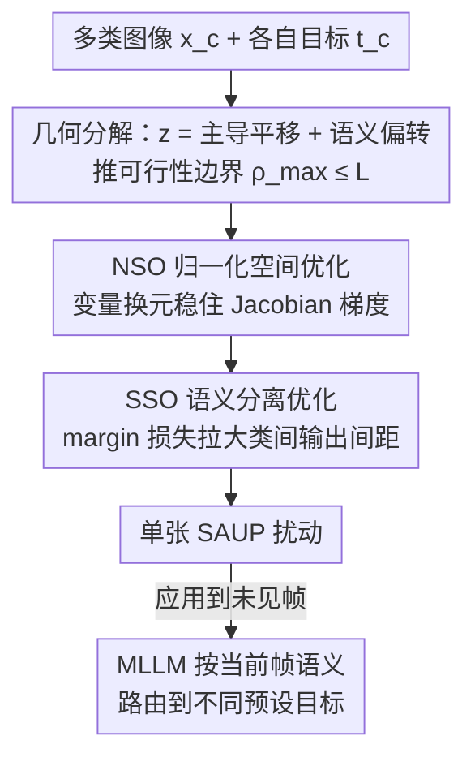

# Semantic Router: On the Feasibility of Hijacking MLLMs via a Single Adversarial Perturbation

**会议**: ICML2026  
**arXiv**: [2511.20002](https://arxiv.org/abs/2511.20002)  
**代码**: https://github.com/lcycode/semantic-router  
**领域**: AI 安全 / 对抗攻击 / 多模态大模型  
**关键词**: 图像劫持, 通用对抗扰动, MLLM 安全, 语义路由, 无状态决策

## 一句话总结
本文提出一种新的威胁——语义感知劫持：用**单张**通用对抗扰动充当"语义路由器"，根据当前帧的视觉语义把同一个 MLLM 路由到攻击者预设的不同目标输出；通过对潜空间几何性质的理论分析推导出可行性边界，再用 SORT 优化算法把它造出来，在 Qwen 上用一张帧对 5 个目标实现 66% 的攻击成功率。

## 研究背景与动机
**领域现状**：MLLM 正越来越多地作为自动驾驶、机器人等**无状态系统**的感知-决策原子单元。像 OpenVLA 这类 VLA 在每个时间步都新建上下文，只拿当前帧 + 指令生成一个即时动作、不保留历史；这些原子决策虽然各自无状态，但**序列累积**最终决定了 agent 的物理轨迹。

**现有痛点**：已有的对抗扰动研究里，通用对抗扰动（UAP）是 input-agnostic 的"一对多"（把各种输入都推向同一个目标）；MultiAttack 能把不同输入映到多个目标但缺乏泛化、只在训练集内有效；Multi-Target UAP 要同时找多个扰动、但每个扰动仍只指向一个目标。也就是说，**没人证明过"一张扰动能根据输入语义路由到不同目标"的多对多劫持是否可行**。

**核心矛盾**：要让一张扰动"看图说不同的话"，本质上要求它把输入间**细微的语义差异放大成输出层面的巨大差异**。这与扰动通常会"抹平输入差异、把一切推向同一对抗子空间"的直觉相反，存在一个几何上的根本张力。

**本文目标**：① 从理论上界定"单扰动多目标语义劫持"何时可行、何时不可能；② 设计能真正找到这种扰动的优化算法；③ 提供能在不同语义粒度下定量评测的数据集。

**切入角度**：作者把 MLLM 拆成视觉编码器 $\phi$ 和骨干解码器 $\mathcal{D}$，在编码器输出的潜空间里分析扰动的几何作用，用一阶 Taylor 展开把扰动效果分解成"主导平移"和"语义偏转"两部分。

**核心 idea**：扰动 $\delta$ 同时干两件事——先用**主导平移（Dominant Shift）** $\phi(\delta)$ 把所有输入特征推到潜空间一个决策边界密集的远端子空间，再用**语义偏转（Semantic Deflection）** $J_\delta\cdot x^{(c)}$ 借输入本身的语义差异把它们各自偏向不同的预设目标，从而充当"语义路由器"。

## 方法详解

### 整体框架
威胁模型定义为：无状态决策是一串独立动作 $\{y_1,\dots,y_K\}$，每步 $y_k=\mathcal{M}(x_k,p_k)$ 只依赖当前帧 $x_k$ 和提示 $p_k$、与历史无关。攻击者要找**单个**扰动 $\delta$，使得对来自语义类别 $c$ 的输入加上扰动后，模型被迫输出预设目标 $t^{(c)}$，即 $\mathcal{M}(x^{(c)}+\delta,p^{(c)})\to t^{(c)},\;\forall c\in\{1,\dots,C\}$。分析在数字白盒设置下进行，重在验证潜空间机制而非物理部署。

方法分两层：先是**几何机制分析**——把扰动后特征 $z^{(c)}=\phi(x^{(c)}+\delta)$ 在扰动点 $\delta$ 处做一阶 Taylor 展开，得到 $z^{(c)}\approx\underbrace{\phi(\delta)}_{\mu_\delta}+\underbrace{J_\delta\cdot x^{(c)}}_{\nu_c}$，其中 $J_\delta=\partial\phi(x)/\partial x|_{x=\delta}$ 是扰动点处的 Jacobian；由此推出可行性边界。然后是 **SORT 优化算法**——把这套几何洞察落成两个可操作的优化技巧：归一化空间优化稳住梯度、语义分离优化显式拉大不同类的输出间距。攻击者先收集若干类图像、给每类分一个目标标签，训出扰动后即可应用到未见图像上。

### 关键设计

**1. 主导平移 + 语义偏转的几何分解：解释一张扰动为何能"路由"**

这一步针对"单扰动多目标在几何上是否可能"的核心疑问。一阶展开把扰动后特征拆成两项：$\mu_\delta=\phi(\delta)$ 是与输入无关的**主导平移**，把所有输入簇推离原流形、进入一个决策边界高度密集拥挤的对抗子空间（此处微小移动就能跨越边界）；$\nu_c=J_\delta x^{(c)}$ 是**语义偏转**，让局部线性投影 $J_\delta$ 提取出 $x^{(c)}$ 的内在语义、把不同输入往不同方向偏。优化 SAUP 在几何上等价于找一个 $\delta$，让扰动后嵌入 $z^{(c)}$ 对齐对应的**代理目标嵌入（Proxy Target Embedding）** $\hat{z}^{(c)}$——因为目标 $t^{(c)}$ 是文本、扰动在视觉空间，作者假设存在一个视觉嵌入 $\hat{z}^{(c)}$ 能诱导解码器生成 $t^{(c)}$，从而把跨模态目标转译成视觉潜空间里的对齐问题。

**2. 语义分离势与可行性边界：从理论上说清"细粒度语义为何更难攻"**

这一步回答"什么时候根本不可能"。定义偏转强度 $\mathcal{S}(\delta,x^{(c)})=\|\phi(x^{(c)}+\delta)-\phi(\delta)\|_2\approx\|J_\delta x^{(c)}\|_2\le\|J_\delta\|_2\cdot\|x^{(c)}\|_2$，其中 $\|J_\delta\|_2$（Jacobian 谱范数）是放大因子、量化语义偏转能力。要劫持多个决策还需要**可分离性**：对任意两类 $i,j$，可达的潜空间分离受 $\|\hat{z}^{(i)}-\hat{z}^{(j)}\|_2\le\underbrace{\|J_\delta\|_2}_{\text{Potency}}\cdot\underbrace{\|x^{(i)}-x^{(j)}\|_2}_{\text{输入距离}}$ 支配。定义所需扩张比 $\rho_{ij}=\|\hat{z}^{(i)}-\hat{z}^{(j)}\|_2/\|x^{(i)}-x^{(j)}\|_2$，并令 $L=\sup_z\|J_z\|_2$ 为视觉编码器的全局 Lipschitz 常数。

**定理 3.4**：若 $\rho_{\max}=\max_{i\neq j}\rho_{ij}>L$，则不存在能把输入集映到目标集的扰动 $\delta$。这给出了攻击不可能的硬边界。**推论 3.5** 进一步指出：当图像越相似（如同一行车记录仪拍的连续帧），输入距离 $\|x^{(i)}-x^{(j)}\|_2\to 0$，导致 $\rho_{\max}\to\infty$，越容易违反边界 $L$——这正解释了为什么细粒度语义（自动驾驶/机器人连续帧）比 ImageNet 那种粗粒度类别更难攻。

**3. SORT 优化：归一化空间优化（NSO）+ 语义分离优化（SSO）**

理论说"可行但难"，SORT 就负责把扰动真正优化出来。**NSO** 解决梯度不稳：已有方法直接在像素空间 $[0,1]$ 优化，难以精细调节 Jacobian $J_\delta$；作者引入归一化函数 $\Psi$，在归一化空间定义可训练变量 $\Delta$、像素空间扰动经逆变换 $\delta=\Psi^{-1}(\Delta)$ 恢复，从而预条件化优化地形、保证步长一致、避开像素空间约束下的损失平台期。**SSO** 解决"要把类间拉开"：设计混合目标 $\mathcal{L}_{Total}=\mathcal{L}_{CE}+\lambda\cdot\mathcal{L}_{Margin}$，其中交叉熵保证基本对齐目标，margin 损失 $\mathcal{L}_{Margin}=\mathbb{E}_{j\neq c}[\max(0,m-\Delta P_{cj})]$ 显式拉大置信度间隙 $\Delta P_{cj}=P(t^{(c)}|x^{(c)}+\delta,p)-P(t^{(j)}|x^{(c)}+\delta,p)$，逼着扰动后特征 $\phi(x^{(c)}+\delta)$ 离 $\hat{z}^{(c)}$ 比离 $\hat{z}^{(j)}$ 更近，从而最大化偏转势 $J_\delta$、实现 Equation 6 要求的特征距离扩张。

## 实验关键数据

### 主实验
在三个 MLLM（Llava-1.5-7B、Qwen2.5-VL-7B、InternVL3-8B）和两个不同语义粒度的数据集上评测：ImageNet（粗粒度）和作者标注的 **RIST**（细粒度，从自动驾驶/机器人连续视频抽帧，含 RoboTasking 2 目标、AutoDriving 5 目标两个场景，目标动作由 Gemini-2.5-pro 按场景安全约束随机指派）。提示固定为 "Describe this image"、贪心解码；扰动约束为 frame（边框宽 6 px）和 corner（20×20 角块）。评测指标是攻击成功率 ASR（输出 token 在内容和顺序上都要匹配目标序列）。

下表为不同目标数下的单帧攻击成功率（test set，节选）：

| 模型 | #目标 | frame ASR | corner ASR |
|------|------|------|------|
| Llava | 2 | 0.95 | 0.88 |
| Llava | 5 | 0.63 | 0.49 |
| Qwen | 2 | 0.93 | 0.98 |
| Qwen | 5 | 0.66 | 0.45 |
| Intern | 2 | 0.98 | 1.00 |
| Intern | 5 | 0.73 | — |

亮眼结果：一张扰动就足以误导 Qwen，在 2/3/4/5 个目标下分别达到 93%/77%/61%/66% 的成功率。在 RIST 上，SAUP 在 RoboTasking 测试集平均 ASR 72%、AutoDriving 62%。

### 消融实验
SORT 两个组件的消融（test ASR，部分配置）：

| 模型 | #目标 | Baseline | w/o NSO | w/o SSO | Default(SORT) |
|------|------|------|------|------|------|
| Llava(frame) | 2 | 0.00 | 0.00 | 0.93 | 0.95 |
| Llava(frame) | 5 | 0.11 | 0.43 | 0.57 | 0.63 |
| Qwen(frame) | 2 | 0.00 | 0.00 | 0.93 | 0.93 |
| Qwen(frame) | 5 | 0.03 | 0.00 | 0.57 | 0.66 |

### 关键发现
- **NSO 是底座**：去掉 NSO（w/o NSO）在多数设置下 ASR 直接归零或大跌，说明像素空间优化根本收敛不到可用扰动，归一化空间换元是攻击成立的前提。
- **SSO 提升类间可分**：在保留 NSO 的基础上去掉 SSO 仍能攻，但目标数多（5 目标）时明显掉点，印证 margin 损失对"细粒度语义路由"的必要性。
- **粒度与目标数双重影响**：目标越多、语义越细，ASR 越低，与定理 3.4/推论 3.5 的"$\rho_{\max}>L$ 即不可能"边界一致；RIST 上较大的误差棒来自轨迹间环境多样性和语义粒度不均。
- **过拟合现象**：RIST 训练集仅 50 张，Intern 在 AutoDriving 训练集 ASR 达 100% 但测试集掉到 61%，受限于数据规模。

## 亮点与洞察
- **提出全新威胁范式**：把"一对多 UAP"推进到"多对多、按语义路由"的劫持，第一次证明单扰动能根据输入内容输出不同攻击者目标，对无状态 VLA agent 的物理轨迹安全有现实警示。
- **理论给出可攻/不可攻的硬边界**：$\rho_{\max}>L$ 即不存在可行扰动，把"细粒度连续帧更难攻"从经验观察变成可解释的几何结论，这套谱范数/Lipschitz 分析框架可迁移到其他对抗可行性研究。
- **Proxy Target Embedding 的转译技巧**：把"视觉空间的扰动 → 文本目标"这个跨模态难点，转成"对齐到一个能诱导出该文本的视觉嵌入"，让纯视觉潜空间分析得以闭环。
- **NSO 的换元很实用**：在归一化空间而非像素空间优化扰动来稳住 Jacobian 梯度、避开损失平台期，是个可复用的对抗优化 trick。

## 局限与展望
- **白盒 + 数字域**：分析限定在数字白盒，优先验证潜空间机制而非物理部署，距真实贴帧攻击仍有差距。
- **细粒度泛化弱**：RIST 训练集仅 50 张导致明显过拟合，细粒度场景测试 ASR（5 目标 ~60%）仍不算高，数据规模是瓶颈。
- **理论是定性的**：作者明示几何分析为定性、靠局部线性假设，Taylor 展开的误差在附录单独评估，边界 $L$ 的实际估计与紧致度仍偏经验。
- **依赖代理目标嵌入假设**：Assumption 3.2 假设每个文本目标都存在能诱导它的视觉嵌入 $\hat{z}^{(c)}$，该假设的普适性未充分论证。

## 相关工作与启发
- **vs 通用对抗扰动 UAP（Moosavi-Dezfooli et al., 2017）**：UAP 是 input-agnostic 的一对多（都推向同一目标），本文是按语义路由的多对多，扰动充当"语义路由器"而非"统一推手"。
- **vs MultiAttack / Multi-Target UAP**：MultiAttack 能映多目标但只在训练集内有效、缺泛化；Multi-Target UAP 同时找多个扰动、但每个仍只指一个目标；本文用单扰动 + 泛化到未见图像，是本质区别。
- **vs 语义误导类攻击（C-PGC 等）**：那类攻击让模型误读视觉内容、常需同时操纵图文两模态；本文属图像劫持（token 级输出控制），只动视觉一张扰动就拿到对输出序列的精确控制。

## 评分
- 新颖性: ⭐⭐⭐⭐⭐ 首次提出并验证"单扰动语义路由式劫持"，并配可攻/不可攻的几何边界。
- 实验充分度: ⭐⭐⭐⭐ 三个 MLLM、两种粒度、自建 RIST 数据集 + 组件消融，但细粒度数据规模偏小。
- 写作质量: ⭐⭐⭐⭐ 理论-机制-算法-实验逻辑闭环，几何直觉讲得清楚。
- 价值: ⭐⭐⭐⭐⭐ 直击无状态 VLA/自动驾驶 agent 的安全软肋，威胁模型有现实意义。

<!-- RELATED:START -->

## 相关论文

- [\[CVPR 2025\] Data-free Universal Adversarial Perturbation with Pseudo-Semantic Prior](../../CVPR2025/ai_safety/data-free_universal_adversarial_perturbation_with_pseudo-semantic_prior.md)
- [\[ICML 2026\] MLUBench: A Benchmark for Lifelong Unlearning Evaluation in MLLMs](mlubench_a_benchmark_for_lifelong_unlearning_evaluation_in_mllms.md)
- [\[CVPR 2026\] Improving Adversarial Transferability with Local Perturbation Augmentation](../../CVPR2026/ai_safety/improving_adversarial_transferability_with_local_perturbation_augmentation.md)
- [\[CVPR 2026\] Taming the Long Tail: Rebalancing Adversarial Training via Adaptive Perturbation](../../CVPR2026/ai_safety/taming_the_long_tail_rebalancing_adversarial_training_via_adaptive_perturbation.md)
- [\[AAAI 2026\] Transferable Backdoor Attacks for Code Models via Sharpness-Aware Adversarial Perturbation](../../AAAI2026/ai_safety/transferable_backdoor_attacks_for_code_models_via_sharpness-aware_adversarial_pe.md)

<!-- RELATED:END -->
