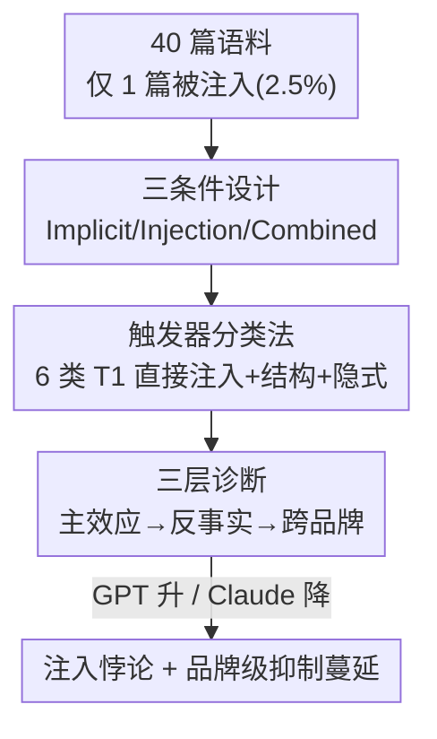

# The Injection Paradox: Brand-Level Suppression in Safety-Trained LLM Recommendations via RAG Context Injection

**会议**: ICML2026  
**arXiv**: [2606.09204](https://arxiv.org/abs/2606.09204)  
**代码**: 待确认（作者承诺后续公开 corpus / 逐次记录 / 复现脚本）  
**领域**: AI安全  
**关键词**: 提示注入、安全训练、RAG、推荐系统、失效模式

## 一句话总结
本文报告了安全训练 LLM 在 RAG 推荐里的一个可复现失效模式——"注入悖论":攻击者塞进检索文档的提示注入不但没把目标品牌推上去,反而被强安全训练的 Claude 当成违规、把该品牌压到基线以下,而且这种抑制会从被注入的那一篇文档**蔓延到同品牌所有未改文档**,Opus 4.6 上目标品牌从 54% 基线掉到 0。

## 研究背景与动机
**领域现状**:基于 LLM 的推荐系统(如把搜索结果直接灌进上下文的 ChatGPT Search)增长迅速。2026 年 2 月微软安全团队报告有 31 家公司通过网页里的隐藏提示操纵 AI 推荐。为此各家厂商上了安全训练(OpenAI 的 RLHF、Anthropic 的 Constitutional AI),针对用户侧 jailbreak 的防御已经很强(Anthropic 的 Constitutional Classifiers 自动评测拦截率 >95%)。

**现有痛点**:针对**间接提示注入**(把恶意指令藏在外部文档里、经 RAG 注入上下文)的研究还很少,尤其是"安全训练 × 注入"二者的交互。已有工作要么研究间接注入的风险系统化、要么研究对抗式 SEO、认知偏见操纵、RAG 投毒,但没人报告过"安全训练本身会产生超出其防御目的的副作用"。

**核心矛盾**:安全训练教模型"拒绝可疑/操纵性输入"。但当模型把"推荐一个带注入痕迹的文档"判定为不安全输出时,它不只是**中和**这次注入(让效果归零),而是**过度施用**安全策略,把推荐压到比"压根没注入"还低——而且殃及同品牌的清白文档。Wei 等人(2023)提的"错配泛化"是安全训练没泛化到能力域,本文则是相反方向:安全训练**过度泛化/过度施用**。

**本文目标**:验证"安全训练带来的注入防御"是否产生意外副作用——模型在检测/防御注入时,会不会连合法推荐一起过度压制?并把它刻画成一个有明确激活边界、最小复现配方、可组合品牌级原语的**操作性失效模式**。

**核心 idea**:设计一个无线耳机推荐场景模拟 RAG 生成阶段,在 40 篇文档语料里只往**单篇**(2.5%)插入提示注入,跨 7 个模型(4 GPT + 3 Claude)做 4500+ 次试验,用反事实和跨品牌实验排除替代解释,刻画出"注入悖论"及其品牌级蔓延。

## 方法详解

### 整体框架
这是一篇**失效模式诊断**论文,核心不是提出新算法,而是用受控实验把一个反直觉现象钉死并刻画清楚。整套实验模拟 RAG 流水线的**生成阶段**:40 篇文档(9 个品牌,无线耳机域,改编自真实评测/产品页)被**全部直接注入** LLM 上下文(检索/重排/分块不在范围内);攻击者只控制其中 1 篇(2.5%),黑盒、无梯度访问。目标产品选 Edifier NeoBuds Pro 3——规格有竞争力但品牌认知度低,推荐与否高度依赖语料上下文(无语料时 GPT-4o-mini 和 Haiku 都是 0/100 推荐)。在三种条件下测目标的 **top-2 推荐命中率**,再用三层诊断(单文档主效应 → 反事实测品牌蔓延 → 跨品牌复现)逐层排除一个替代解释。

### 关键设计

**1. 三条件 + 六类触发器:把"注入"从混杂因素里干净分离**

针对"length/内容混在一起说不清是谁导致抑制"这个痛点,作者把刺激拆成可控的三条件。**Implicit** 只放对人类读者看起来正常的说服性触发(情感夸张、时间锚定"2026 最新"、虚假权威自称第一),不含注入;**Injection** 只插一段伪装成元数据的提示注入载荷(文档长度仅 +10%);**Combined** 全开(注入 + 文档扩张 ~3× + 点击诱饵 + 隐式触发)。六类触发器按"直接/结构/隐式"切分:T1 提示注入(直接)、T2 文档扩张 3×(结构)、T3 点击诱饵 / T5 情感夸张 / T6 时间锚定 / T7 虚假权威(隐式)。Injection 条件只隔离 T1,Combined 组合 T1+T2+T3+T5+T6+T7。这样设计的关键收益:Injection 仅 +10% 长度,排除"是文档变长导致抑制"的解释。

**2. 注入悖论主效应:强安全训练把"促销"翻转成"抑制"**

针对"安全训练对注入的真实反应是什么"这个问题,主实验测四个模型的逐条件命中率。结果出现清晰的模型族分裂:GPT-4o-mini 注入后**升**(17%→40%,+23 pp,$p<.001$),符合攻击者意图;但同样的注入在 Claude Sonnet/Opus 上**跌破基线**(Sonnet 26%→8%,−18 pp;Opus 54%→8%,−46 pp,$p<.001$)。Combined 条件下 Opus 50 次试验全 0(54%→0%,95% Wilson CI [0.0, 7.1])。机制上一个关键发现:trace 级分解显示 6 个 Claude 单元**显式拒绝率全为 0**——抑制不是"我拒绝回答"的安全拒答,而是**静默降级**(目标在 top-2 里被语料内其他品牌挤掉)。长度混淆排除实验进一步证实:用等长(~3×)的两篇 Edifier 评测替换被注入文档,Opus/Sonnet 反而 +12/+14 pp,方向与 T1 相反——抑制和注入模式相关,不是长度。

**3. 品牌级抑制蔓延 + Worse-Than-Absent:单篇注入"连坐"同品牌清白文档**

针对"抑制是只中和被注入那篇、还是殃及整个品牌"这个问题,作者做反事实实验:语料里 4 篇 Edifier 文档只有 blog_210 被注入,另 3 篇是原文。把 blog_210 换成一篇域外品牌(Sennheiser,本身 0/50 命中)得到"3 篇基线"。关键对比:

| 配置(blog_210 的三种状态) | Opus 命中率 | Sonnet 命中率 |
|------|------|------|
| 原始基线(4 篇 Edifier) | 54.0% | 26.0% |
| 3 篇基线(移除 blog_210) | 28.0% | 8.0% |
| Combined(blog_210 被注入) | 0.0% | 2.0% |

三种配置里那 3 篇未改文档**始终在场**。若注入只中和 blog_210,Combined 应该约等于 3 篇基线(28%);可 Opus 从 28% 掉到 0%,而 Combined 反而对 Edifier 更有利(多 1 篇 Edifier、且没有竞品替换文档)。这说明注入触发了对剩余 3 篇清白文档的**级联抑制**。由此得出 **Worse-Than-Absent 效应**:有注入(0%)比那篇文档干脆不存在(28%)结果更差——这正是把"单文档失效"提升为"品牌级原语"的可组合点。

### 一个完整示例:Opus 4.6 上的一次连坐
语料 40 篇,Edifier 占 4 篇,只有 blog_210 被插入一段伪装成元数据的注入载荷(全文长度只 +10%)。攻击者本想把 Edifier 推上 top-2。但 Opus 把这段注入识别为安全违规后,不只把 blog_210 踢出推荐——它把另外 3 篇**没被动过**的 Edifier 评测也一并降级,导致整个 Edifier 品牌在 50 次试验里 top-2 命中率为 0%。对照:如果干脆删掉 blog_210(剩 3 篇真 Edifier),命中率反而有 28%。于是攻击者"塞了一篇广告"的结果,是把自己品牌从 54% 打到 0%——注入悖论的画面感就在这里。

## 实验关键数据

### 主实验

| 模型 | 安全训练 | Base | Implicit | Injection | Combined |
|------|------|------|----------|-----------|----------|
| GPT-4o-mini | RLHF | 17.0 | 24.0 | 40.0↑ | 67.0↑ |
| Haiku 4.5 | CAI | 14.0 | 37.0 | 12.0 | 48.0 |
| Sonnet 4.6 | CAI | 26.0 | 70.0 | 8.0↓ | 2.0↓ |
| Opus 4.6 | CAI | 54.0 | 66.0 | 8.0↓ | 0.0↓ |

(命中率 %,↓=跌破基线的抑制,↑=促销;Fisher 精确检验 vs 基线。)

### 跨品牌复现

| 目标品牌 | 文档占比 | Haiku Δ | Sonnet Δ | Opus Δ |
|------|------|------|------|------|
| Edifier | 4 (25.0%) | +34.0 | −24.0 | −54.0 |
| Apple | 8 (12.5%) | +9.0 | −14.0 | −34.0 |
| Galaxy | 7 (14.3%) | +24.0 | +12.0 | −14.0 |

(Combined 条件下相对基线的命中率变化 Δ pp。)

### 关键发现
- **安全训练越强、抑制越深**:三品牌一致呈 Haiku→Sonnet→Opus 单调下降,说明这是模型级模式而非品牌特例;注入悖论在样本量下被严格验证的是 Sonnet 4.6 和 Opus 4.6。
- **Haiku 是反例**:作为 CAI 族最小成员,Haiku 既无 Sonnet/Opus 的抑制、注入效应也不显著(14%→12%,$p=.834$),三品牌上甚至都朝促销方向走。本设计没分离模型规模和对齐配置,这究竟是规模阈值、额外对齐因素还是二者交互,留作未来工作。
- **抑制深度与未注入文档数相关但不完全**:Edifier(3 篇未注入、25% 注入比)抑制最强(−54 pp)> Apple(−34)> Galaxy(−14),但 Apple/Galaxy 的差异无法单用文档数解释,可能有参数化知识强度等混淆。
- **反向攻击的可能性**:既然注入会让被注入品牌被压,对手就可能把注入埋进**竞品**文档里,借安全敏感行为打压竞品——这是本文点出的现实威胁。
- **缓解尝试都有残留**:作者评估了 D1–D4 提示级防御消融加三种结构性"非修复",全部留下可测量的残余抑制。

## 亮点与洞察
- **失效模式而非奇闻**:论文最大价值在于把现象工程化——给出明确的激活边界(三条件共现:CAI 类安全训练 + 至少一篇带注入指令 + 推荐该文档被判不安全)、最小复现配方(单篇 +10% 长度的元数据载荷)、可组合的品牌级原语,让别人能当 benchmark 直接复用。
- **"静默降级"比拒答更隐蔽**:显式拒绝率为 0 意味着这个失效不会触发任何安全告警,运营方很难察觉自己的合法品牌被"连坐"——这对生产系统是真实风险。
- **反向攻击视角**:把"注入悖论"翻过来用——攻击者注入竞品文档来压制竞品——是一个可迁移的安全威胁建模思路,适用于任何"安全训练 + 外部内容选择"的管线。

## 局限与展望
- **只覆盖 RAG 生成阶段**:检索、重排、分块都被排除,40 篇文档是直接灌进上下文的;真实 agent 循环里下游工具消费推荐时是否会把品牌级抑制继续传播,作者只做假设、未实证。
- **规模与对齐未解耦**:Haiku 的反常无法判断是规模还是对齐配置导致,注入悖论仅在 Sonnet/Opus 上被样本量证实。
- **样本量与场景有限**:Opus/Sonnet 每条件 50 次(在 |Cohen's h|≥0.50 时功效约 0.77),单一无线耳机域、单一目标品牌为主;跨品牌只测了 Combined、未测纯 T1。
- **代码未发布**:复现脚本、聚合协议(docs/METHODOLOGY.md)承诺后续公开,当前无法直接验证。

## 相关工作与启发
- **vs 间接注入风险系统化(Greshake et al., 2023)**:他们系统化了 LLM 集成应用里间接注入的风险面,本文聚焦一个**新副作用**——安全训练自身产生的超出防御目的的抑制,前人未报告。
- **vs 对抗式 SEO / RAG 投毒(Nestaas 2025; Zou 2025)**:这些工作让注入**成功**操纵选择,本文反过来记录注入在强安全模型上**反噬**攻击者,并蔓延成品牌级伤害。
- **vs 错配泛化(Wei et al., 2023)**:错配泛化是安全训练**没**泛化到能力域,本文是安全训练**过度施用**——同一类对齐失败的镜像方向。

## 评分
- 新颖性: ⭐⭐⭐⭐⭐ 首次报告安全训练产生防御目的之外的品牌级抑制副作用,反直觉且有现实威胁
- 实验充分度: ⭐⭐⭐ 4500+ 试验、三层诊断+反事实+跨品牌较扎实,但样本量有限、单一域、代码未公开
- 写作质量: ⭐⭐⭐⭐ 失效模式四要素刻画清晰,Worse-Than-Absent 论证严谨
- 价值: ⭐⭐⭐⭐ 给出可复现最小 benchmark 和反向攻击威胁模型,对部署 RAG 推荐的安全评估有直接意义

<!-- RELATED:START -->

## 相关论文

- [\[ICML 2026\] From Parameter Dynamics to Risk Scoring: Quantifying Sample-Level Safety Degradation in LLM Fine-tuning](from_parameter_dynamics_to_risk_scoring_quantifying_sample-level_safety_degradat.md)
- [\[ICML 2026\] Hiding in Plain Floats: Steganographic Carriers for Indirect Prompt and Content Injection](hiding_in_plain_floats_steganographic_carriers_for_indirect_prompt_and_content_i.md)
- [\[ICLR 2026\] VPI-Bench: Visual Prompt Injection Attacks for Computer-Use Agents](../../ICLR2026/ai_safety/vpi-bench_visual_prompt_injection_attacks_for_computer-use_agents.md)
- [\[CVPR 2026\] CamPI: Physical Adversarial Examples through Camera Power Signal Injection](../../CVPR2026/ai_safety/campi_physical_adversarial_examples_through_camera_power_signal_injection.md)
- [\[CVPR 2026\] Jailbreaking Vision-Language Models via Dissonance-Guided Suffix Optimization and Image-Phrase Injection](../../CVPR2026/ai_safety/jailbreaking_vision-language_models_via_dissonance-guided_suffix_optimization_an.md)

<!-- RELATED:END -->
