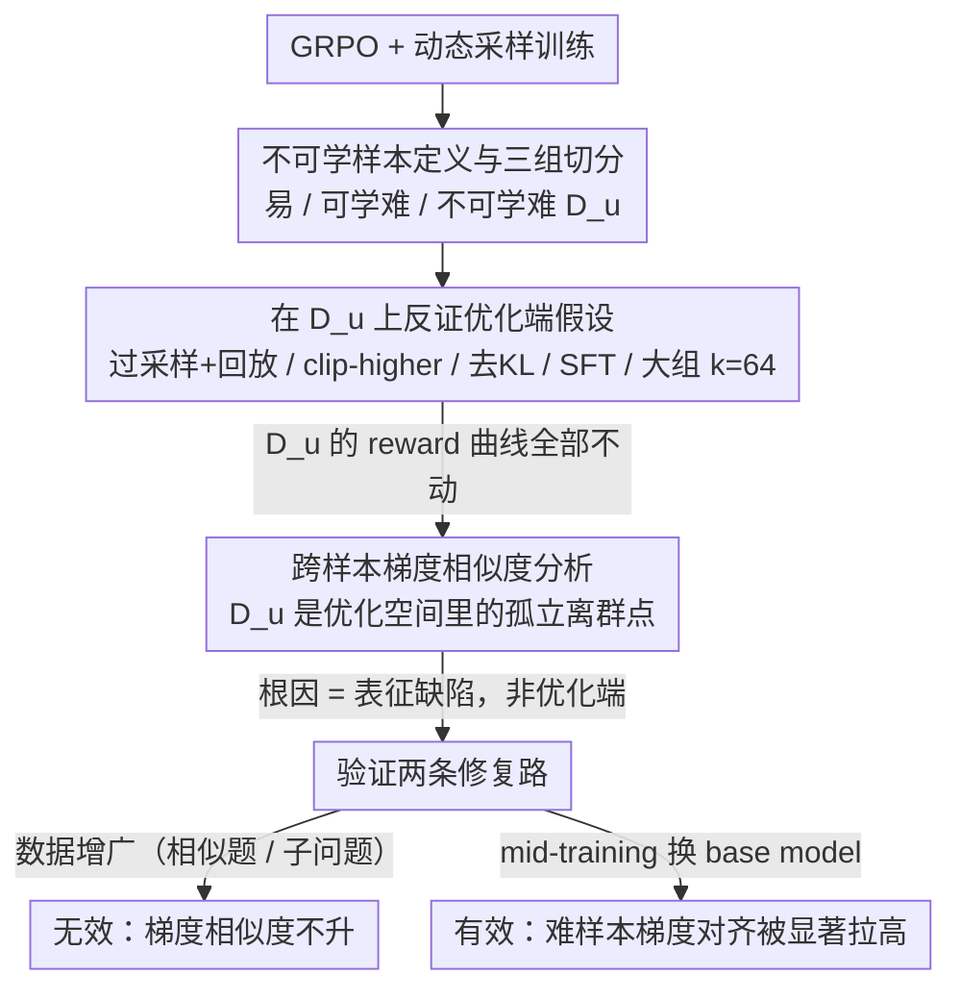

# The Unlearnability Phenomenon in RLVR for Language Models

**会议**: ICML 2026  
**arXiv**: [2605.16787](https://arxiv.org/abs/2605.16787)  
**代码**: https://github.com/yulinchen99/unlearnability-rlvr  
**领域**: LLM推理 / RLVR / GRPO  
**关键词**: RLVR, GRPO, 不可学习样本, 梯度相似度, 表征缺陷

## 一句话总结
作者发现在 RLVR（GRPO）训练中存在一类「不可学习样本」：即便采样到正确 rollout、奖励信号非零，模型在整个训练过程中也始终学不会，根因不是优化端的正样本稀缺或裁剪/KL 正则，而是这些样本在初始策略下就是「梯度离群点」，背后是模型表征缺陷，需要靠 mid-training 而非 RL 后训练来修复。

## 研究背景与动机

**领域现状**：以 GRPO 为代表的 RLVR（Reinforcement Learning with Verifiable Reward）已经成为提升 LLM 数学/代码/Agent 推理能力的主力手段。直觉上 GRPO 能 work 的前提是「同一 prompt 的 $k$ 个 rollout 里既有正样本又有负样本」，因而最近大量工作（DAPO、curriculum、entropy 加权等）都在围绕「给极难样本造出正奖励信号」做文章。

**现有痛点**：作者发现一个反直觉现象——把训练样本按初始成功率切成「易/可学难/不可学难」三类后，**不可学难样本**即便在训练中已经持续观察到正确 rollout（即 outcome reward 已经非零），其训练 reward 仍然原地踏步、不会随训练上升；这部分样本在 Qwen2.5-0.5B/MATH-Easy 上占难样本的 30.2%，Llama-3.2-3B/MATH-Hard 上占 21.9%，绝非边缘现象。

**核心矛盾**：现有 RLVR 范式默认「只要有正样本，模型就能学会」，但本文实验直接证伪了这个隐含假设；而且优化端的常见干预（更多正 rollout、experience replay、clip-higher、去掉 KL 项）全部无效，说明根因不在优化端，需要换一个解释框架。

**本文目标**：(1) 严格定义并量化「不可学习样本」的存在；(2) 系统排查优化端的常见假设（正样本稀缺、裁剪、KL 正则）；(3) 给出一个能解释现象的「表征侧」根因；(4) 检验数据增广与 mid-training 能否修复。

**切入角度**：作者从 *cross-example gradient similarity* 这个视角切入——把每个样本的正确 rollout 算成一个梯度向量，看不同样本之间的梯度余弦相似度，借此判断「在这个样本上学到的东西」能否迁移到其他样本。

**核心 idea**：用「梯度相似度」把可学/不可学样本的差异从「reward 曲线现象」上升到「优化空间几何性质」——不可学样本是优化空间里的孤立离群点，反映模型对它们的表征本身就有缺陷，单靠 outcome-based RL 无路可修。

## 方法详解

### 整体框架

本文不提新算法，而是一篇 *diagnostic* 论文：用一组对照实验把「不可学习」这个现象先量化、再归因、最后定位到表征层面。整条线索按「现象定义 → 排除优化端假设 → 建立表征侧解释 → 验证修复方案」四步推进——先在 GRPO + 动态采样下跑出一批「有正奖励却学不会」的样本，再逐个反证「正样本太少 / 裁剪 / KL 正则」这些优化端解释，转而用 cross-example gradient similarity 证明这些样本是优化空间里的孤立离群点，最后对比数据增广与 mid-training 两条修复路，发现只有改 base model 表征才有效。下面这张图把这条「排除法」诊断主线画出来：每反证掉一个优化端假设就往下推进一步，最终汇聚到「表征缺陷」并落到唯一有效的 mid-training 修复。

### 关键设计

**1. 不可学样本的工作定义与三组切分：把「学不会」变成一个可复现、well-defined 的研究对象**

以往讨论难样本时，常把「整个训练一次正样本都没采到」和「有正样本却学不会」混为一谈，于是任何「多造正样本」的干预都会显得有效；本文要先把后者干净地分离出来。具体做法是先用 GRPO + dynamic sampling 做一轮完整训练，把 *initial success rate* $\geq 0.1$ 的样本切成 *easy*；对剩下的 *hard* 样本用 $N=32$ 个 rollout 估计 *final* pass@1，最终 pass@1 $<\tau=0.1$ 的归入不可学集 $\mathcal{D}_u$，否则归入可学集 $\mathcal{D}_l$，并显式剔除「整个训练过程从未出现正样本」的样本，保证研究问题确实是「有正奖励信号但模型仍学不会」。为降噪做三次独立 run，对 $\mathcal{D}_u/\mathcal{D}_l$ 取交集、对「无正奖励」样本取并集。有了这个划分，后续所有梯度/推理质量分析才有明确对象，也才能让「优化端假设」的反证不被「正样本稀缺」这一混淆因素污染。

**2. 过采样 + 经验回放（Oversampling-with-Replay）：反证「正样本稀缺」假设**

如果 $\mathcal{D}_u$ 学不会只是因为正 rollout 太少、梯度被负样本淹没，那么强行喂够正样本就该救活它。作者据此在每个 prompt、每个 batch 内固定配 $k_{\text{pos}}=1$ 个正样本 + $k-k_{\text{pos}}=7$ 个负样本重训：先采 $4k$ 个 rollout 再下采样到 $k=8$，若当前 batch 正样本不够，就从经验回放 buffer 里复用此前采到的正 rollout（每条最多回放两次），并在回放/下采样后再算 advantage $\hat{A}_i = \frac{\mathbb{1}[y_i=y^*] - \text{mean}}{\text{std}}$。结果 reward 曲线显示这套干预确实生效——它明显拖慢了 $\mathcal{D}_l$ 的学习速度——但 $\mathcal{D}_u$ 的曲线与 baseline 几乎重合。附录再用「只在 $\mathcal{D}_u$ 上做 SFT 蒸馏正确答案」和「$k=64$ 大规模 rollout」两个更激进的方向交叉验证，gap 同样不动。当两个独立维度（每 batch 强配 1 正 7 负、把 $k$ 提到 64）都填不平差距时，成因就基本可以排除在「正样本数量」之外。

**3. 跨样本梯度相似度（Cross-Example Gradient Similarity）：把「不可学」从 reward 曲线提升到优化空间几何**

排除了优化端解释后，需要一个可观测、且和训练动力学直接挂钩的量来给出机制性解释——梯度相似度正好能同时回答「为什么其它样本上的学习不迁移到 $\mathcal{D}_u$」和「为什么 oversampling 也救不了」。做法是每组取 100 个样本，每个样本在 *初始策略* 下采 1000 个 rollout、过滤出正确的那些，按公式 (1) 算 GRPO loss 的梯度（先在 response 内部对 token 平均，再在 response 之间平均，得到每个样本一个梯度向量）；为让算力可控，挂一个固定随机初始化的 LoRA adapter、只对 LoRA 参数求梯度（在 0.5B 模型上已验证 LoRA-based 与全参数 gradient similarity 高度相关），最后计算样本间的余弦相似度 $\cos(g_i, g_j)$。图 1c / 图 6 显示：*easy* 样本之间梯度高度对齐，*learnable* 居中，*unlearnable* 与所有组都低相似度——即每个不可学样本都是优化空间里的孤立离群点，step 50 时仍是同样格局，说明这不是初始化偶然。配套的 reasoning-quality 分析（用 GPT-5-mini 给正确 rollout 的推理链打 0–5 分）则在「答案对不对」之外揭示：$\mathcal{D}_u$ 的正确 rollout 多半靠 shortcut/启发式凑答案——典型反例是「$|x+y+z|+|x+y-z|\leq 8$ 体积题」里模型推导明显错乱却凑对最终答案，正印证 outcome reward 会把 fake reasoning 一并奖励掉、让训练信号噪声很大。

### 损失函数 / 训练策略

沿用标准 GRPO + dynamic sampling。GRPO 目标如下（裁剪 $\varepsilon$、KL 系数 $\beta$）：

$$\mathcal{L}_{\text{GRPO}}(\theta,(x,y^*)) = -\frac{1}{k}\sum_i\frac{1}{|y_i|}\sum_t \min(r_{i,t}\hat{A}_i, \text{clip}(r_{i,t},1-\varepsilon,1+\varepsilon)\hat{A}_i) - \beta\,\text{KL}(\pi_\theta\|\pi_{\text{ref}})$$

其中 $r_{i,t}=\pi_\theta(y_{i,t}|x,y_{i,<t})/\pi_{\theta_{\text{old}}}(y_{i,t}|x,y_{i,<t})$。dynamic sampling 把当前 batch 中 $\text{std}(\{\mathbb{1}[y_i=y^*]\})=0$ 的 prompt 过滤掉以提高效率。消融时使用 clip-higher 和去掉 KL 项两种变体；mid-training 实验则换用 OctoThinker-3B-Hybrid/Long-Base 作为初始策略。

## 实验关键数据

### 主实验

**Table 1 — 不可学样本在三个 setup 中的占比**（百分比相对于初始 pass@1 $<0.1$ 的难样本总数）：

| 模型 / 数据 | $\mathcal{D}_u$ (%) | $\mathcal{D}_l$ (%) | 无正奖励 (%) |
|---|---|---|---|
| Qwen2.5-0.5B / MATH-Easy | 30.2 | 25.6 | 23.5 |
| Llama-3.2-3B-Instruct / MATH-Hard | 21.9 | 31.6 | 37.7 |
| Qwen2.5-3B / DeepScaleR | 16.7 | 14.2 | 47.2 |

不可学样本在所有 setup 下都不是边缘情形，与「无正奖励样本」并列占据难样本的大头。

### 消融实验

**优化端干预 vs 表征端 / 数据端干预的对比**：

| 干预手段 | 目标假设 | 对 $\mathcal{D}_u$ 是否有效 | 关键观察 |
|---|---|---|---|
| Oversampling + replay（每 batch 强配 1 正 7 负） | 正样本稀缺 | ✗ | $\mathcal{D}_l$ 被拖慢但 $\mathcal{D}_u$ reward 曲线不变 |
| 在 $\mathcal{D}_u$ 上做 SFT 蒸馏正确答案 | 缺监督信号 | ✗ | gap 不消失 |
| 仅在 $\mathcal{D}_u$ 上 RL + $k=64$ 大组 rollout | 探索不足 | ✗ | gap 不消失 |
| Clip-higher | 裁剪压抑梯度 | ✗ | 三组 clipping ratio 几乎重合 |
| 去掉 KL 项 | KL 约束限制更新 | ✗ | reward 动力学不变 |
| 相似题 $\mathcal{D}_u^{sim}$ 数据增广 | 缺同类训练信号 | ✗ | 增广题易学，原 $\mathcal{D}_u$ 仍学不会 |
| 子问题 $\mathcal{D}_u^{sub}$ 数据增广 | 技能未分解 | ✗ | 子问题学得比 $\mathcal{D}_l$ 还快，原题仍不会 |
| Mid-training（OctoThinker-3B-Hybrid/Long） | 表征本身有缺陷 | ✓ | 难样本与训练分布的梯度相似度被显著拉高 |

### 关键发现
- **不可学性源于表征而非优化**：五种优化/数据端干预全部失败，唯一有效的是改 base model 表征（mid-training），强证据指向「问题在 RL 之前」。
- **梯度相似度是 learnability 的强 proxy**：$\mathcal{D}_u$ 是孤立梯度离群点，$\mathcal{D}_l$ 居中、easy 高度对齐；这与 reward 曲线分组完全一致，且在 step 50 仍保持，说明这不是初始化偶然。
- **正确答案 ≠ 正确推理**：GPT-5-mini 评分显示 $\mathcal{D}_u$ 的正确 rollout 多半靠 shortcut / 启发式，case study（绝对值不等式体积题）里模型甚至凭明显错误的推导凑出正确答案，揭示 outcome-only reward 的 reward-hacking 风险。
- **语义相似 ≠ 优化相似**：GPT-5 生成的「同策略相似题」与原题在结构上几乎一样，但梯度相似度并不会随之提高，且 $\mathcal{D}_u$ 与原训练分布、与增广数据的相似度高度相关——说明这些样本在优化空间里就是「独立的山头」，靠语义增广搬不动。
- **训练越深差距越大**：reasoning-quality 在 step 50→120 上 $\mathcal{D}_l$ 持续改善，$\mathcal{D}_u$ 基本停滞；curriculum learning（先学 easy + learnable）也无法把改善迁移过去。

## 亮点与洞察
- **把「学不会」从 reward 曲线层面降到优化空间几何层面**：梯度相似度这个量同时解释了「为什么其它样本上的更新不迁移」和「为什么 oversampling 也救不了」，是把现象-机制串起来的关键 trick，且 LoRA-only 梯度的相关性近似让分析可在 0.5B-3B 规模上跑通。
- **「正确答案不代表正确推理」的实证**：用 GPT-5-mini 打分把 outcome reward 与 process reward 的差距具象化，给「process supervision / RLVR + verifier 中间步骤」类工作提供了直接动机——光看最终 answer，相当于把 reward-hacked 的 rollout 也当作监督信号。
- **negative results 写法值得借鉴**：作者把「oversampling、SFT 蒸馏、大 $k$、clip-higher、去 KL、相似题增广、子问题增广」按假设逐个排除，最后才指向 mid-training，这种「排除法 + 反例库」的诊断范式可以直接迁移到其它训练动力学研究（如 SFT 的 forgetting、RLHF 的 reward over-optimization）。
- **可迁移 trick**：用「梯度相似度 / 推理质量 / pass@k」三件套刻画训练数据的「优化属性」，并不限于 RLVR，可以用来在 SFT 之前给样本打 *trainability* 标签，做更聪明的 curriculum / 数据筛选。

## 局限与展望
- 实验局限于 0.5B–3B 规模的数学推理模型与 MATH/DeepScaleR 数据；更大规模（30B+）或 code/agent 域是否仍存在同样比例的不可学样本未验证。
- 「不可学」依赖一个硬阈值 $\tau=0.1$ 与 $N=32$ 的 pass@1 估计，边界样本的判定具有一定随机性；作者用三次 run 取交集缓解了这个问题，但没有给出对 $\tau$ 的连续 sensitivity 分析。
- 没有给出可执行的「修不可学样本」算法——mid-training 的「什么数据、什么算法最有效」被作为开放问题留下；如果能根据样本的梯度方向反推「需要什么类型的预训练/中训练数据」，本文价值会再上一档。
- 「相似题增广无效」结论依赖 GPT-5 + Gemini-2.5-pro 的合成质量；如果增广数据本身就有正确性漂移，可能高估了「语义相似但优化不相似」的强度。
- 梯度相似度的几何解释仍较粗糙——是否存在一个低秩子空间能解释 $\mathcal{D}_u$ 的离群性、能否据此设计「表征对齐损失」直接缩小 gap，是顺势可做的下一步。

## 相关工作与启发
- **vs Sun et al. 2025b（极难样本下的 fine-grained reward assignment）**：他们假设「只要 reward 设计得足够细就能学」，本文直接反证「即便已经有 outcome positive reward，也存在一类样本学不会」，把限制从 reward 端拉到表征端。
- **vs Yue et al. 2025 / Wu et al. 2026（RL 不能让 LLM 学到 base model 中没有的新技能）**：本文沿着同一条「RL 的能力天花板」线，但给了一个微观、可量化的视角——具体是哪类样本被挡在外面，以及挡住它们的具体几何特征。
- **vs DAPO（Yu et al. 2025）/ clip-higher / 无 KL**：DAPO 的核心干预（高 clip、去 KL）在本文里被直接 ablate 并证明对 $\mathcal{D}_u$ 无效，提示这类「探索增强」技巧主要受益的是 $\mathcal{D}_l$ 而非 $\mathcal{D}_u$。
- **vs OctoThinker / mid-training 类工作（Wang et al. 2025）**：本文为 mid-training 提供了一个全新动机——不是「让 base 更强」，而是「让难样本与训练分布的梯度对齐」，把 mid-training 重新定位为「表征对齐预处理」。
- **vs Nikankin et al.「bag of heuristics」**：reasoning-quality 分析延续了「LLM 推理多为启发式拼接」这一观点，但本文把它精确化为「outcome reward 下不可学样本的典型行为模式」。

## 评分
- 新颖性: ⭐⭐⭐⭐⭐ 首次系统刻画 RLVR 中的「有正奖励却学不会」现象，并给出梯度几何层面的机制解释。
- 实验充分度: ⭐⭐⭐⭐ 三个模型 × 两个数据规模，假设排除链条完整，但规模受限于 ≤3B。
- 写作质量: ⭐⭐⭐⭐⭐ 用「排除法」组织 negative results 极清晰，case study 与图表配合好。
- 价值: ⭐⭐⭐⭐⭐ 直接挑战「正奖励 ⇒ 可学」的隐含假设，给 RLVR 数据筛选 / mid-training / process reward 三条路线都提供了硬证据。

<!-- RELATED:START -->

## 相关论文

- [\[ICML 2026\] dgMARK: Decoding-Guided Watermarking for Diffusion Language Models](dgmark_decoding-guided_watermarking_for_diffusion_language_models.md)
- [\[ICML 2026\] Forget to Know, Remember to Use: Context-Aware Unlearning for Large Language Models](forget_to_know_remember_to_use_context-aware_unlearning_for_large_language_model.md)
- [\[ICML 2026\] COFT: Counterfactual-Conformal Decoding for Fair Chain-of-Thought Reasoning in Large Language Models](coft_counterfactual-conformal_decoding_for_fair_chain-of-thought_reasoning_in_la.md)
- [\[ICML 2026\] DualOptim+: Bridging Shared and Decoupled Optimizer States for Better Machine Unlearning in Large Language Models](dualoptim_bridging_shared_and_decoupled_optimizer_states_for_better_machine_unle.md)
- [\[ICML 2026\] Towards Fine-Grained Robustness: Attention-Guided Test-Time Prompt Tuning for Vision-Language Models](towards_fine-grained_robustness_attention-guided_test-time_prompt_tuning_for_vis.md)

<!-- RELATED:END -->
