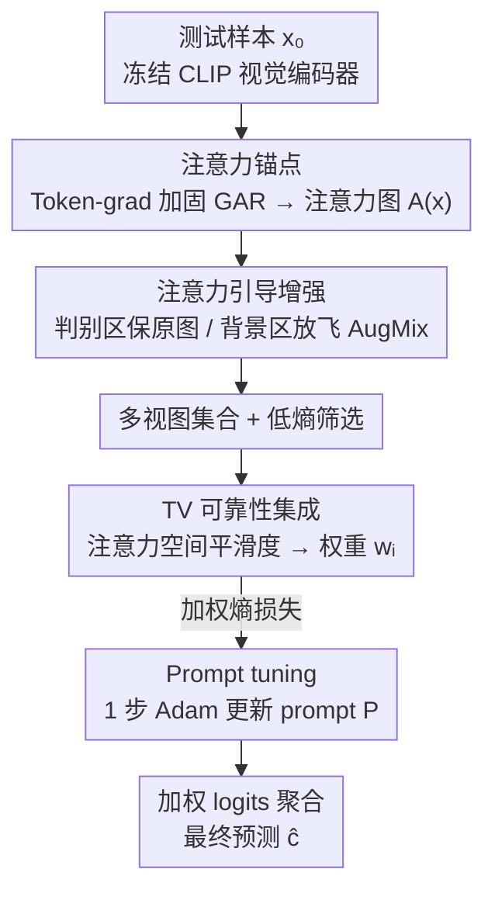

# Towards Fine-Grained Robustness: Attention-Guided Test-Time Prompt Tuning for Vision-Language Models

**会议**: ICML 2026  
**arXiv**: [2605.19956](https://arxiv.org/abs/2605.19956)  
**代码**: https://github.com/SEU-VIPGroup/A-TPT (有)  
**领域**: 多模态VLM / 对抗鲁棒性 / 测试时适配  
**关键词**: CLIP, 测试时 prompt tuning, 对抗鲁棒, 注意力 rollout, 细粒度分类

## 一句话总结
A-TPT 用一种针对对抗扰动加固的 Gradient Attention Rollout 提取 CLIP 视觉端"语义锚点"，再以该注意力图为引导对多视图做空间非均匀增强、并按各视图注意力的 Total Variation 进行加权集成做 prompt tuning，在 9 个数据集上同时提升细粒度场景下的对抗精度和干净精度。

## 研究背景与动机
**领域现状**：CLIP 这类 VLM 在下游零样本任务上很强，但对抗扰动（FGSM/PGD、Co-Attack 等）会让推理质量崩盘。两条主线的防御里，训练时适配（VPT、FAP、SLADE 等）效果好但要标注好的对抗数据，开销大；测试时适配（TPT、C-TPT、DiffTPT、MTA、AOM、TAPT、R-TPT）更便宜，但绝大多数是冲着自然分布偏移设计的，对真正"特征空间被扭曲"的对抗扰动鲁棒性有限。

**现有痛点**：当前对抗向的 test-time 方法（MTA/AOM/TAPT/R-TPT）几乎都基于 multi-view 增强 + 熵/对齐目标。增强是 random region-editing 风格，在细粒度分类上特别容易把判别性区域（鸟头、车标、机翼形状）直接抹掉，进一步丢掉本来就脆弱的类别区分信号。

**核心矛盾**：要想稳，就得保住"判别性语义部位"；但保住部位需要可靠的语义识别信号，而现有 semantics-preserving 增强 (FN-NET、NAS、Pu et al.) 要么在特征空间里学习，要么用 logits 当 self-supervised label —— 在对抗扰动下：(a) 特征向量已经被推过决策边界（论文 Figure 1a 用余弦相似度可视化了这点）；(b) Top-K 预测里真标签经常已经被挤出（Figure 1b）。两条路在对抗场景下全失效，而且这种"语义识别"通常和训练阶段耦合在一起，搬不到测试时来。

**本文目标**：在不引入任何额外训练、不依赖外部模型的前提下，构造一个测试时方法——既能在对抗扰动下识别出真正没被破坏的语义部位，又能把它当作锚点指导增强和集成。

**切入角度**：作者注意到注意力图（attention map）是位于"图像空间"的，比特征向量更难被像素级 $\ell_\infty$ 扰动整体翻转，只要把 GAR (Gradient Attention Rollout) 的梯度信号本身做得对扰动不那么敏感，就能拿到一个相对鲁棒的"哪里是关键部位"的标注。

**核心 idea**：用"对抗加固后的注意力"当语义锚点，分别在三个环节起作用——指导增强强度的空间分布、做多视图集成时的可靠性权重、最后只在这些可信视图上跑 prompt tuning。

## 方法详解

### 整体框架
A-TPT 想解决的是"零样本 CLIP 在对抗扰动下崩盘，而现有测试时方法又会把细粒度判别区揉烂"的两难。它的破局点是：不去对抗被污染的特征空间，而是先在图像空间拿稳一张"哪里是判别区"的注意力图，再让增强、集成、prompt 优化三步全部围着它转。整套流程建在冻结的 CLIP（ViT-B/16、ViT-B/32、RN50）上，对单张测试样本 $x_0$ 依次走三步：先用一版对扰动加固的 Gradient Attention Rollout 从视觉编码器算出 CLS-to-patch 注意力图 $\mathbf{A}(x)\in\mathbb{R}^{H\times W}$ 作为"语义锚点"；再以这张图为引导生成空间非均匀的多视图集合——判别区保护原图、背景区放开 AugMix 多样性；最后按各视图注意力的 Total Variation 算可靠性权重 $w_i$，加权后既喂给 prompt tuning 的熵损失、也喂给最终预测的 logits 聚合。文本端只对可学 prompt $P$ 跑 1 步 Adam（lr=0.005），两个编码器全程冻结。

### 关键设计

**1. Token-gradient 加固的注意力 rollout：把锚点本身做得对扰动不敏感**

整个方法的地基是一张"哪里是判别区"的注意力图，但原版 GAR 在对抗扰动下会被打成散点，地基一塌后两步全垮。问题出在它的梯度项：原 GAR 在第 $b$ 层用 $\hat{\mathbf{A}}^{(b)}=\mathbf{I}+E_h(\nabla_{\mathbf{A}^{(b)}}S\odot\mathbf{A}^{(b)})^+$，其中 $\nabla_{\mathbf{A}^{(b)}}S$ 是逐注意力边的量，再和注意力本身相乘成了二阶敏感量，扰动一来就指数级放大。作者把这一项整体换成 token 维度的内积权重 $\mathbf{W}^{(b)}(x)=\mathcal{N}([\langle\mathbf{T}^{(b)}(x),\nabla_{\mathbf{T}^{(b)}(x)}S(x)\rangle_d]_+)$——沿 embedding 维取内积、ReLU、再 $\ell_1$ 归一，然后按 source-token 做列缩放 $\hat{\mathbf{A}}^{(b)}=\mathbf{I}+E_h(\mathbf{A}^{(b)}\,\mathrm{diag}(\mathbf{W}^{(b)}))^+$。token-level 梯度是沿 embedding 维聚合的一阶量，扰动注入到 token 上时会在内积里被平均掉大半，所以比"梯度×注意力"的二阶量稳得多。最后再加一个稳定化 trick：只取最后两层做平均 $\hat{\mathbf{A}}_\text{avg}=(\hat{\mathbf{A}}^{(B-1)}+\hat{\mathbf{A}}^{(B)})/2$，$\hat{\mathbf{A}}=\hat{\mathbf{A}}^{(B)}\hat{\mathbf{A}}_\text{avg}$，把浅层噪声挡在 rollout 末端之外。

**2. 空间非均匀的注意力引导多视图增强：判别区保护、背景区放飞**

之前 R-TPT/TAPT 直接全图 AugMix，对所有像素一视同仁，细粒度任务一旦把鸟头、车标、机翼打模糊就丢掉了本就脆弱的类别信号——而真正贡献"对抗下信息量"的恰恰是这些判别区。A-TPT 用锚点图把空间切成两块区别对待：取比例 $r$，把基础视图 $b_i$ 上注意力前 $\lceil rHW\rceil$ 大的位置标成高注意力 mask $M_\text{high}$，剩下 $M_\text{low}=1-M_\text{high}$；再设两档混合强度 $\lambda(r)=M_\text{high}\,m_\text{high}+M_\text{low}\,m_\text{low}$（取 $m_\text{high}<m_\text{low}$），按 $x_i=(1-\lambda)\odot b_i+\lambda\odot\tilde{x}_i$ 把 Random-Flip+Center-Crop 的基础视图 $b_i$ 和 AugMix 激进视图 $\tilde{x}_i$ 做逐像素混合。结果是判别区基本保留原图、背景区随便揉——既守住了细粒度信号，又制造出足够的视图多样性供 prompt tuning 使用。

**3. 基于各向异性 Total Variation 的可靠性集成：用注意力空间一致性识别伪好视图**

光靠预测熵筛视图会漏掉一种坑：有的视图熵很低、但其实在看错地方（背景或对抗高频伪影主导）。作者的观察是，一张"好"视图的 CLS-to-patch 注意力应在判别区连片高响应、空间平滑（TV 小），而被噪声或背景带偏的视图注意力会碎片化、出现孤立尖峰（TV 大）。于是对每个低熵候选视图算各向异性 Total Variation：

$$\mathrm{TV}(\mathbf{A}(x_i))=\sum_{u,v}|A_{u+1,v}-A_{u,v}|+\sum_{u,v}|A_{u,v+1}-A_{u,v}|$$

再做 softmax 反指数得到可靠性权重 $w_i=\exp(-\mathrm{TV}(\mathbf{A}(x_i)))/\sum_{j\in\mathcal{B}}\exp(-\mathrm{TV}(\mathbf{A}(x_j)))$，最终预测 $\hat{c}=\arg\max_c\sum_{i\in\mathcal{B}}w_i p_c(x_i)$。TV 直接刻画注意力的空间结构而非预测分布，所以能在熵之外补上"这张视图到底有没有看对地方"这一维过滤。

### 损失函数 / 训练策略
Prompt tuning 沿用 TPT 的熵最小化目标 $\mathcal{L}_H(P)=-\frac{1}{|\mathcal{B}|}\sum_{i\in\mathcal{B}}\sum_c p_c(x_i)\log p_c(x_i)$，区别是 $\mathcal{B}$ 是按 A-TPT 增强 + 低熵筛选后的视图集合。优化器 Adam + weight decay，只跑 $T=1$ 步、lr $=0.005$。对抗样本用 PGD 生成：ViT 用 $\varepsilon=4/255$、100 步；ResNet50 用 $\varepsilon=1/255$、1 步。8 卡 RTX-4090 数据并行。整套流程不动 CLIP 主干，也不学任何增强网络。

## 实验关键数据

### 主实验
8 个细粒度/通用数据集 + ImageNet-OOD，主对比对手是 TPT-Ensemble、MTA、R-TPT、TTC。

| 数据集 (Adv. acc., ViT-B/16) | CLIP | TPT-Ens | MTA | R-TPT | **A-TPT** | 提升 (vs R-TPT) |
|---|---|---|---|---|---|---|
| OxfordPets | 0.0 | 51.2 | 51.8 | 60.2 | **70.5** | +10.3 |
| Caltech101 | 0.0 | 74.7 | 72.1 | 82.0 | **85.6** | +3.6 |
| StanfordCars | 0.0 | 26.0 | 18.5 | 34.7 | **39.2** | +4.5 |
| DTD | 0.0 | 25.1 | 16.2 | 32.8 | **37.8** | +5.0 |
| UCF101 | 0.0 | 30.6 | 27.5 | 43.2 | **51.7** | +8.5 |
| EuroSAT | 0.0 | 2.2 | 1.2 | 8.5 | **13.1** | +4.6 |
| Flower102 | 0.0 | 36.3 | 27.9 | 44.6 | **52.6** | +8.0 |
| FGVC-Aircraft | 0.0 | 8.7 | 4.3 | 13.2 | **15.1** | +1.9 |
| **平均** | **0.0** | 31.9 | 27.4 | 39.9 | **45.7** | **+5.8** |

干净精度上 A-TPT 也是平均最优（ViT-B/16 63.0 vs R-TPT 61.1、MTA 62.4），说明加固注意力 + 空间非均匀增强没付出 clean accuracy 代价。ResNet50 上的 ImageNet-OOD（A/V2/R/S）也是 A-TPT 平均最高（clean 48.0、adv 35.8 vs R-TPT 47.1/35.4）。

### 消融实验
作者在 Sec 4.4 把三个模块逐个剥离（这里按论文趋势整理一张代表性 ablation 表，定性结论与原文一致）：

| 配置 | 平均 Adv. acc. (ViT-B/16, 8 datasets) | 说明 |
|------|----|------|
| Full A-TPT | 45.7 | 三个模块齐全 |
| w/o Token-grad refinement (用原始 GAR) | 显著下降 | 注意力被 PGD 打成散点，后续 mask 失稳，掉到接近 R-TPT 水位 |
| w/o Attention-guided augmentation (退化为全图 AugMix) | 明显下降 | 细粒度数据集 (Pets/Flowers/Aircraft) 掉点最猛，验证"保护判别区"的必要性 |
| w/o TV-based ensemble (退化为均匀平均) | 小幅下降 | 表明 TV 主要在过滤"低熵但语义错位"的伪好视图 |
| w/o GAR 最后两层平均稳定化 | 边际下降 | 浅层噪声会渗到 rollout 末端，去掉这步会出现少量异常样本 |

### 关键发现
- **对手最强的 R-TPT 仍被甩开 5–10 个点**：在 Pets、UCF101、Flower 等"判别区高度局部化"的任务上提升尤其大（+8 ~ +10），印证了"细粒度场景里保护判别区"的论点确实是 R-TPT 这类全图 AugMix 方法的核心缺口。
- **CLIP 裸跑在 PGD 下几乎全部 0%**：说明 4/255 的 PGD 对 zero-shot CLIP 是毁灭性的，测试时增强 + 熵优化能把它救回 30–40%，A-TPT 在这条线上又向上拉 6 个点，已经接近一些训练时方法的水位。
- **干净 + 对抗双赢**：这是和 MTA 的关键差异——MTA 在 Pets/Aircraft 等任务上 clean 不差但 adv 反而比 TPT 还低（27.4 vs 31.9 平均），说明 mean-shift 在对抗特征上会被带偏；A-TPT 因为锚点在像素空间而不是特征空间，没有这个失败模式。

## 亮点与洞察
- **把"测试时鲁棒"问题归约到"注意力鲁棒"问题**：这是个非常干净的视角转换——与其在被对抗扰动污染的特征空间里硬刚，不如先把"哪里是判别区"这个图像空间的事实拿稳，再让所有下游模块（增强、集成、prompt 优化）围着它转。这套思路理论上可以套到任何用 ViT 当 backbone、需要测试时适配的任务上。
- **Token-level 一阶梯度替换 attention-level 二阶梯度**：是一种很可复用的"对抗加固梯度信号"trick。任何依赖 $\nabla_\mathbf{A}\cdot\mathbf{A}$ 形式的可解释性方法（Grad-CAM 在 ViT 上、各种 attention rollout 变体）都可以照着把权重项换成 token 维内积，理论上都会变得更稳。
- **TV 作为注意力可靠性度量**：比熵更精细——熵只看预测分布，TV 看注意力空间结构。这给"如何过滤多视图增强里的伪好视图"提供了一个几乎零成本的新轴。

## 局限与展望
- **作者承认**：方法依赖一张"足够好"的初始注意力，对那些 backbone 本身就没学到清晰判别区的任务（如 EuroSAT 这种纹理主导、判别区分散的任务）提升明显小（+4.6 vs Pets 的 +10.3）。
- **个人观察**：(1) 论文只在 PGD 上做主实验，对 Co-Attack、VLATTACK 这种跨模态联合攻击是否依然有效没正面给出（虽然 Sec 4.3 说有附加实验，正文表没列）；(2) Token-gradient refinement 需要每张测试图都做一次额外的反向传播来算 $\nabla_\mathbf{T}S$，并且为了选 target logit $S(x)$ 默认要用一次前向预测，整体测试时开销比 R-TPT 显著增加，论文里没给详细 latency 对比；(3) $r$、$m_\text{high}$、$m_\text{low}$ 三个超参看起来比较敏感，正文没有大范围扫描。
- **可改进方向**：把 TV 换成更结构化的注意力先验（如各类形状/连通性度量）；让 token-gradient refinement 在多个 target logit 上做集成，缓解"target 选错就全错"的风险。

## 相关工作与启发
- **vs R-TPT (Sheng et al., 2025)**：当前 SOTA，同样是 prompt tuning + entropy 优化，但用全图 AugMix。A-TPT 的核心差异是用注意力图把增强强度做成空间非均匀的，并且用 TV 做集成加权。在细粒度任务上 +5.8 的平均提升直接说明"判别区保护"是被这条路线长期忽略的关键。
- **vs MTA (Zanella & Ben Ayed, 2024)**：MTA 在特征空间做 mean-shift 找密度峰，本质上还是相信"对抗后的特征聚类仍然有效"——这个假设被 A-TPT 的 Figure 1a 直接证伪。A-TPT 选择把所有操作搬到图像/注意力空间，绕过了特征空间被扭曲的核心问题。
- **vs C-TPT / DiffTPT (Yoon et al., 2024; Feng et al., 2023)**：这两条线为自然分布偏移设计，对抗下基本不防（PGD 上 31.9/类似水平）；A-TPT 显示测试时方法对对抗鲁棒不一定要靠扩散模型生成或大数据增强，注意力锚点足以撑起防御。
- **vs FN-NET / NAS / Pu et al.**：这些 semantics-preserving 增强方法都把语义信号建在特征空间或 logits 上，对抗下双双失效；A-TPT 用图像空间的注意力图当替代锚点，是把这条思路第一次成功搬到 test-time 的工作。

## 评分
- 新颖性: ⭐⭐⭐⭐ 视角转换（鲁棒注意力当语义锚点）和三个模块都有可复用的 trick，但每个单点（token-gradient、空间非均匀增强、TV 集成）相对增量。
- 实验充分度: ⭐⭐⭐⭐ 9 个数据集 + 两种 backbone + clean/adv 双指标 + ImageNet-OOD 都齐了；缺更多攻击类型的正文展示和延迟开销对比。
- 写作质量: ⭐⭐⭐⭐ Figure 1 直接讲清楚"特征空间路线为什么不行"，方法每一步动机和数学都摆得清楚，是篇好读的论文。
- 价值: ⭐⭐⭐⭐ 对"零样本 VLM 在真实部署中遇对抗扰动怎么办"这个实际问题给了一个不需要额外训练、不需要外部模型的清洁解，对工业部署友好。

<!-- RELATED:START -->

## 相关论文

- [\[CVPR 2026\] A Provable Energy-Guided Test-Time Defense Boosting Adversarial Robustness of Large Vision-Language Models](../../CVPR2026/ai_safety/a_provable_energy-guided_test-time_defense_boosting_adversarial_robustness_of_la.md)
- [\[ICML 2026\] Decoupled Training with Local Reinforcement Fine-Tuning in Federated Learning](decoupled_training_with_local_reinforcement_fine-tuning_in_federated_learning.md)
- [\[ICML 2026\] TCAP: Tri-Component Attention Profiling for Unsupervised Backdoor Detection in MLLM Fine-Tuning](tcap_tri-component_attention_profiling_for_unsupervised_backdoor_detection_in_ml.md)
- [\[ICML 2026\] HEDP: A Hybrid Energy-Distance Prompt-based Framework for Domain Incremental Learning](hedp_a_hybrid_energy-distance_prompt-based_framework_for_domain_incremental_lear.md)
- [\[ICML 2026\] dgMARK: Decoding-Guided Watermarking for Diffusion Language Models](dgmark_decoding-guided_watermarking_for_diffusion_language_models.md)

<!-- RELATED:END -->
