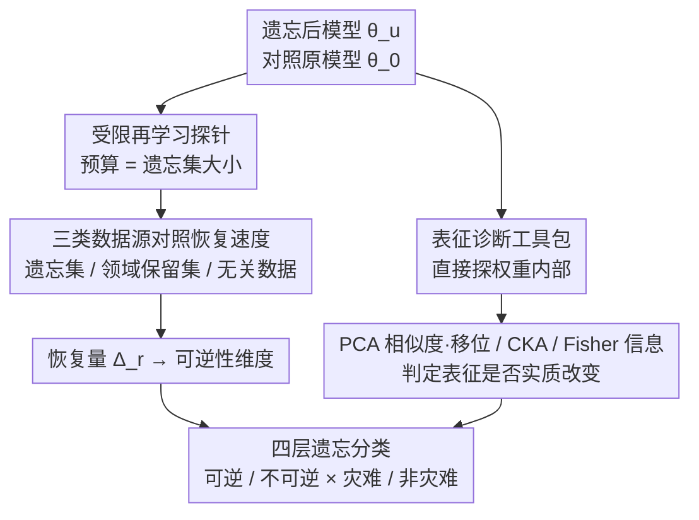

# 遗忘并非删除：大语言模型机器遗忘中的可逆性调查

**会议**: ICML 2026  
**arXiv**: [2505.16831](https://arxiv.org/abs/2505.16831)  
**代码**: https://github.com/XiaoyuXU1/Representational_Analysis_Tools  
**领域**: LLM 安全 / 隐私保护  
**关键词**: 机器遗忘, 可逆性, 表征分析, LLM 安全, 隐私

## 一句话总结
本文通过表征层面的诊断工具系统分析 LLM 遗忘的可逆性——发现许多遗忘方法只是抑制而非真正删除信息，提出四层遗忘分类体系区分真正的信息擦除与表面性能退化。

## 研究背景与动机

**现有痛点**：当前 LLM 遗忘方法主要采用任务层面指标（准确率、困惑度）评估，但这些指标具有欺骗性——模型即使表现出"遗忘"，其原始行为通过最小微调能迅速恢复，暗示信息仅被抑制而非真正删除。

**核心矛盾**：评估的缺陷在于无法区分真正的信息擦除与可逆的表面性能崩溃。当前评估框架忽视了表征层面的变化，导致虚假的遗忘声称。

**本文目标**：建立表征层面的遗忘评估框架，发现遗忘方法的内在机制，区分真正的信息删除与信息抑制。

**切入角度**：从可逆性（遗忘后的信息能否恢复）和灾难性（对保留知识的附带伤害）两个维度入手，引入 PCA 相似度、CKA、Fisher 信息等工具，系统分析表征动态。

## 方法详解

### 整体框架
本文不提新遗忘算法，而是搭一套表征层面的诊断框架来回答一个被任务级指标掩盖的问题：遗忘到底是把信息删了，还是只是暂时压住了。框架分两条腿：一条是**受限再学习探针**，用极小预算的微调去试探被遗忘的知识能否被唤回，从而判定"可逆性"；另一条是**表征诊断工具包**，从特征几何、激活子空间、参数敏感性三个角度看权重内部到底有没有发生本质改变。两条腿的信号交叉起来，把遗忘方法钉进一个由"可逆/不可逆 × 灾难/非灾难"组成的四层分类里。

### 关键设计

**1. 受限再学习探针：用等于遗忘集大小的预算探信息是否潜伏**

完整重训成本太高，没法当常规探针。本文改用受限再学习——微调预算严格等于遗忘集大小，看这点有限的数据能否把被遗忘的能力勾回来；若能，说明知识从未被删，只是潜伏。关键在于协议刻意用三类数据源对照：遗忘集本身（最坏情景，知识完全暴露）、领域相关的保留集（现实场景，靠相关知识间接唤回）、以及无关数据（鲁棒性测试，看是否仍能恢复）。比较三者达到同等恢复所需的样本量，就得到一条"可恢复性的难度梯度"——遗忘集只需 100% 预算就最快回血，无关数据要 300%+ 还只能有限恢复。这种异质的样本效率本身就是遗忘强度的细粒度刻度。

**2. 表征诊断工具包：三个互补视角联合判定权重是否真改变**

只看输出会被骗，所以要直接探权重内部。工具包并联三个视角：几何视角用 **PCA 相似度与移位**测特征主子空间的方向对齐与平移漂移，并用**平均 PCA 距离**量化整体漂移幅度；子空间视角用**居中核对齐（CKA）**评估遗忘前后激活子空间还保留多少重合；优化视角用 **Fisher 信息矩阵（FIM）**追踪损失景观里参数敏感性的变化，看哪些方向真正被"锁住"。单一指标可能因为某一层巧合对齐而误判，三个视角同时给出"表征已实质改变"的信号时，结论才可信。这组工具的价值在于：当受限再学习探针说"恢复不了"时，表征诊断能从内部佐证信息确实被改写，而非测量噪声。

**3. 四层遗忘分类体系：用可逆性和灾难性两个正交维度替代单一准确率**

有了上面两条腿的信号，本文把评估拆成两个独立的问句、合成一个二维坐标。第一个是可逆性：定义遗忘造成的性能下降 $\Delta_u(\mathcal{T}) = E(\theta_0, \mathcal{T}) - E(\theta_u, \mathcal{T})$（原模型 $\theta_0$ 与遗忘后模型 $\theta_u$ 在任务 $\mathcal{T}$ 上的差），再看受限再学习后的恢复量 $\Delta_r(\mathcal{T})$——若 $\Delta_r$ 能把性能拉回接近原始，就是"可逆"，信息没真删掉。第二个是灾难性：遗忘是否连带把保留集（该记住的知识）也砸坏了，由保留集性能下降直接衡量。两维各取二值，就得到四象限——可逆-非灾难（现实可接受的折中）、可逆-灾难、不可逆-灾难、以及理想却难达成的不可逆-非灾难。这套坐标让"遗忘成功"不再是一句准确率，而是能区分"真擦除"与"表面退化"的诊断。

## 实验关键数据

### 主实验

| 遗忘方法 | 遗忘准确率 ↓ | 保留准确率 ↓ | 可逆性 | 灾难性 | 分类 |
|---------|------------|-----------|------|------|------|
| GA | 13.5-20.7% | 11.5-16.0% | ✓ | ✓ | 可逆-灾难 |
| GA+GD | 3.8-15.7% | 0.9-4.3% | ✓ | ✗ | 可逆-非灾难 |
| GA+KL | 7.9-12.7% | 7.0-12.8% | ✓ | ✓ | 可逆-灾难 |
| NPO | 2.7-4.3% | 0.8-2.9% | ✓ | ✗ | 可逆-非灾难 |
| NPO+KL | 2.5-4.1% | 0.7-6.3% | ✓ | ✗ | 可逆-非灾难 |
| RLabel | 1.2-4.6% | 0.8-3.4% | ✓ | ✗ | 可逆-非灾难 |

### 再学习恢复效率

| 数据源类型 | 样本需求量 | 恢复速度 | 最终性能 | 备注 |
|---------|---------|--------|--------|------|
| 遗忘集本身 | 100% | 最快 | 接近原始 | 最坏情景 |
| 领域相关保留集 | 150-200% | 中等 | 部分恢复 | 现实场景 |
| 无关数据 | 300%+ | 最慢 | 有限恢复 | 鲁棒性测试 |

### 关键发现
- 所有六种标准方法在单次遗忘下均表现出可逆性，但只有 GA+GD、NPO 变体和 RLabel 达到非灾难性。
- 提示攻击、越狱、量化等无参数更新的恢复策略完全失效，说明遗忘后的表征被真正改变。
- 样本效率分析揭示不同数据源具有异质的恢复特性。
- 在连续遗忘场景中，可逆-灾难方法会导致保留知识不可逆崩溃。

## 亮点与洞察
- **表征工具的创新组合**：首次将 PCA、CKA、FIM 三种成熟工具联合用于诊断遗忘。
- **再学习作为通用探针**：将再学习作为标准化可逆性检验方法，规范遗忘评估新范式。
- **四层分类体系的明确性**：通过可逆性和灾难性的正交分解，清晰刻画遗忘的本质差异。

## 局限与展望
- 计算成本——表征分析需要大规模计算，在超大规模模型上可扩展性有限。
- 可逆性阈值的模糊性——未给出明确阈值判定何时"基本恢复"。
- 不可逆-非灾难遗忘仍难实现——找到一个案例但未提出系统算法。

## 相关工作与启发
- **vs 机制解释类工作**：本文不修改模型结构，通过表征分析诊断已有遗忘方法。
- **vs 隐私保护工作**：关注信息删除可逆性而非隐私泄露数学界。

## 评分
- 新颖性: ⭐⭐⭐⭐⭐  首次系统的表征层面可逆性分析。
- 实验充分度: ⭐⭐⭐⭐  覆盖 6 种遗忘方法、2 个模型、多个数据域。
- 写作质量: ⭐⭐⭐⭐⭐  问题陈述清晰，四层分类直观。
- 价值: ⭐⭐⭐⭐⭐  揭示遗忘评估的根本缺陷，为 LLM 安全评估和隐私保护设立新标准。

<!-- RELATED:START -->

## 相关论文

- [\[ICML 2026\] 机器遗忘的两个盲点：过度遗忘与原型重学习攻击](unlearnings_blind_spots_over-unlearning_and_prototypical_relearning_attack.md)
- [\[ICML 2026\] DualOptim+: Bridging Shared and Decoupled Optimizer States for Better Machine Unlearning in Large Language Models](dualoptim_bridging_shared_and_decoupled_optimizer_states_for_better_machine_unle.md)
- [\[ICML 2026\] BioAgent Bench: An AI Agent Evaluation Suite for Bioinformatics](bioagent_bench_an_ai_agent_evaluation_suite_for_bioinformatics.md)
- [\[ICML 2026\] Watermarking LLM Agent Trajectories (ACTHOOK)](watermarking_llm_agent_trajectories.md)
- [\[ICML 2026\] ACTG-ARL: Differentially Private Conditional Text Generation with RL-Boosted Control](actg-arl_differentially_private_conditional_text_generation_with_rl-boosted_cont.md)

<!-- RELATED:END -->
