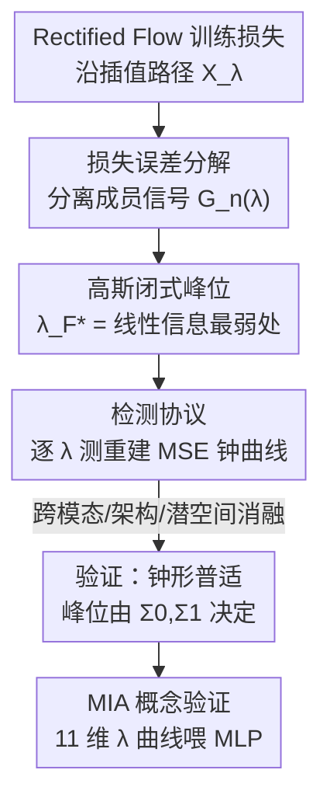

# Where Rectified Flows Leak: Characterising Membership Signals Along the Interpolation Path

**会议**: ICML2026  
**arXiv**: [2606.07271](https://arxiv.org/abs/2606.07271)  
**代码**: 有（论文注明实验代码已公开）  
**领域**: AI安全 / 生成模型隐私 / 成员推断  
**关键词**: Rectified Flow, 成员推断攻击, 记忆化, 插值路径, 隐私泄露

## 一句话总结
作者发现 Rectified Flow（整流流）训练用的线性插值路径 $X_\lambda=(1-\lambda)X_0+\lambda X_1$ 上，**训练样本与测试样本的重建误差差距会随 $\lambda$ 走出一条钟形曲线**，并在高斯假设下推出钟峰位置 $\lambda_F^*$ 的闭式解；这个"成员信号"在训练时悄悄累积、却被验证损失完全掩盖，最后作者拿这条 $\lambda$ 分辨的误差曲线做成员推断攻击（MIA），在钢琴音乐数据集上拿到 0.91 AUC，碾压从扩散模型迁移来的基线。

## 研究背景与动机
**领域现状**：Rectified Flow / Flow Matching 因为能学"更直的"噪声到数据轨迹、少步就能高质量生成，已被 Stable Diffusion 3、FLUX.1、Stable Audio Open、VoiceBox 等部署系统采用。与此同时，生成模型"记住训练数据"引发的版权与隐私官司越来越多。

**现有痛点**：大家研究记忆化时盯着最显眼的**逐字复现**（模型原样吐出训练样本），但记忆化是一个**光谱**——模型可能从不复现训练样本，却依然对它们重建更准、响应更自信，留下可被利用的"成员信号"。这种细微泄露最棘手的地方是：**聚合训练指标看不出来**——loss 曲线毫无过拟合迹象，模型却已编码了大量训练数据信息（Tirumala 等已观察到）。

**核心矛盾**：扩散模型那边已知"中间时间步最容易泄露"（Matsumoto 等），但这是**经验观察**，缺乏理论解释；而且这些攻击（SecMI、PIA）依赖扩散的迭代去噪结构，无法直接迁移到 Rectified Flow 那种确定性的线性插值路径。一句话：**没人从理论上说清楚 Rectified Flow 的成员信号到底藏在路径的哪个位置、为什么藏在那。**

**本文目标**：沿插值路径 $X_\lambda$ 把成员信号刻画清楚——它在 $\lambda$ 上长什么形状？峰值在哪？为什么标准指标看不见它？能不能被攻击利用？

**切入角度**：插值路径天然提供了一个从 $\lambda=0$（纯噪声）到 $\lambda=1$（纯数据）的连续坐标轴。$\lambda$ 的中间地带正是模型必须"动用学到的结构"去预测速度的地方，也最可能暴露它对训练数据的特殊待遇。把成员信号沿这条轴展开，就能定位泄露。

**核心 idea**：把训练损失做误差分解，分离出一个"模型偏差 × 训练专属残差"的**交叉相关项 $G_n^{\mathrm{train}}(\lambda)$**，证明它就是成员信号，并推导它在**线性信息最弱**的 $\lambda_F^*$ 处达到峰值——再用这条 $\lambda$ 曲线做轻量级 MIA。

## 方法详解

### 整体框架
这是一篇"理论 + 验证 + 攻击概念验证"的分析型论文。整条逻辑链是：先把 Rectified Flow 的训练损失沿 $\lambda$ 做误差分解，从中识别出真正区分训练/测试的成员信号 $G_n^{\mathrm{train}}(\lambda)$；再在高斯各向同性假设下证明它呈钟形、峰在 $\lambda_F^*$，并给出闭式解；然后设计一个只需前向传播的检测协议，跨音频/图像、多架构、多潜空间验证钟形与峰位预测；最后把 $\lambda$ 分辨的 11 维误差向量喂给一个 MLP 做成员推断攻击。输入是一个查询样本 $x_1$，输出是"它是不是训练集成员"的判定。

### 关键设计

**1. 损失误差分解：把"成员信号"从训练损失里精确剥出来**

痛点是训练损失整体下降时，你分不清是"模型在正常学结构"还是"在偷偷记训练样本"。作者把训练损失 $L^{\mathrm{train}}(\lambda)=\frac1n\sum_i\|v_\theta(x_\lambda^{(i)},\lambda)-v^{(i)}\|^2$ 分解成三项：

$$L^{\mathrm{train}}(\lambda)=E_n^{\mathrm{train}}(\lambda)+\hat\sigma_n^2(\lambda)-2G_n^{\mathrm{train}}(\lambda),$$

其中 $E_n^{\mathrm{train}}$ 是逼近最优预测器 $v^*$ 的近似误差、$\hat\sigma_n^2$ 是不可约方差、而真正的关键是交叉项

$$G_n^{\mathrm{train}}(\lambda)\triangleq\frac1n\sum_{i=1}^n\langle v_\theta(x_\lambda^{(i)},\lambda)-v^*(x_\lambda^{(i)},\lambda),\,\epsilon_i(\lambda)\rangle.$$

它度量"模型对最优预测器的偏差"与"训练样本专属残差 $\epsilon_i$"之间的相关性。命题 3.1 证明在**测试集**上这个交叉项期望为 0（$\mathbb{E}[G_m^{\mathrm{test}}]=0$），而训练集上一般非零。再配两个温和假设（均匀近似误差 + 代表性样本，靠 early stopping 与大样本成立），训练-测试差距就化简成 $\mathbb{E}[\Delta(\lambda)\mid\mathcal{D}^{\mathrm{train}}]=2G_n^{\mathrm{train}}(\lambda)$。这一步是全文地基：**成员信号 = $G_n^{\mathrm{train}}(\lambda)$**，一个干净、可分析的量，而不是含糊的"过拟合"。

**2. 闭式峰位 $\lambda_F^*$：证明成员信号峰在"线性信息最弱"的地方**

确定了信号是 $G_n^{\mathrm{train}}(\lambda)$，还要回答它峰在哪。作者先看交叉协方差 $C(\lambda)=\lambda\Sigma_1-(1-\lambda)\Sigma_0$——它衡量 $X_\lambda$ 通过线性回归能多强地预测速度 $V$。命题 4.1 证明 $\|C(\lambda)\|_F^2$ 是关于 $\lambda$ 的凸抛物线，唯一最小值在

$$\lambda_F^*=\frac{\mathrm{tr}(\Sigma_0^2)+\mathrm{tr}(\Sigma_0\Sigma_1)}{\mathrm{tr}((\Sigma_0+\Sigma_1)^2)}.$$

在各向同性高斯（$\Sigma_0=\sigma_0^2 I$、$\Sigma_1=\sigma_1^2 I$）下，$C(\lambda_F^*)=0$ 精确成立——也就是 $X_\lambda$ 在此处**对 $V$ 不含任何线性信息**，简化为 $\lambda^*=\sigma_0^2/(\sigma_0^2+\sigma_1^2)$。定理 4.2 进一步算出 $\mathbb{E}[G_n^{\mathrm{train}}(\lambda)]=\sigma_{\mathrm{irr}}^2(\lambda)\cdot\frac{n-1}{n(n-2)}$，并证明它正是在 $\lambda^*$ 处唯一最大、在边界 $\lambda\in\{0,1\}$ 处最小。直觉很漂亮：**线性信号最弱处，模型被迫用非线性能力去解释目标，而非线性目标 $\eta_i=r+\epsilon_i$ 里掺着训练专属残差 $\epsilon_i$，模型分不清哪部分能泛化、于是不可避免地拟合了 $\epsilon_i$——这就是泄露最大的地方。** 命题 4.6 用"$r$ 与 $\epsilon$ 共享一二阶统计、梯度下降无法区分"把这个竞争机制论证清楚；当 $\|C(\lambda)\|$ 大时线性信号靠谱率先被学（spectral bias），$G_n$ 低。

**3. 为什么标准指标看不见它：空间平均 + 时间补偿的双重掩盖**

这一节回答了开篇那个最反直觉的现象——信号在累积、loss 却风平浪静。作者指出两个掩盖机制。**空间平均**：标准训练监控的是 $L_{\mathrm{global}}=\mathbb{E}_{\lambda\sim p(\lambda)}[L(\lambda)]$，而 $G_n^{\mathrm{train}}(\lambda)$ 集中在 $\lambda_F^*$ 附近的窄带，被整段 $[0,1]$ 的平均稀释。**时间补偿**：训练损失里 $L_{\mathrm{train}}=E_n+\hat\sigma_n^2-2G_n$，随训练 $E_n$ 下降、$G_n$ 上升，两者都让 $L_{\mathrm{train}}$ 变小、彼此无法区分；验证侧 $E^{\mathrm{test}}$ 同步下降而 $G^{\mathrm{test}}\approx0$，于是验证损失也乖乖下降。结果就是**成员信号在两条 loss 都在改善的表象下偷偷累积，到 early stopping 时已可被攻击利用，却毫无过拟合迹象**。这也解释了为何 Esser 等经验上发现把 $p(\lambda)$ 集中在 0.5 能改善 SD3——那恰好压在 $\lambda_F^*$ 附近、既加速训练又放大泄露，揭示了效率与隐私的根本权衡。

### 损失函数 / 训练策略
被分析的模型按标准 Rectified Flow 训练：基线在 MAESTRO v3（~200 小时古典钢琴）上、用 Music2Latent 编码成 64 通道 10Hz 潜变量，训一个 410M 参数、改自 DiT 的 Transformer，AdamW（lr $10^{-4}$、batch 256）、log-normal 的 $\lambda$ 采样、验证 plateau 时 early stopping。检测协议本身无需训练，只需前向。

## 实验关键数据

### 检测协议与主结果
检测协议（对每个样本 $x_1$）：采 $K=100$ 个噪声 $x_0$ → 算 $x_\lambda$ → 预测 $v_\theta$ → 重建 $\hat x_1=x_\lambda+(1-\lambda)v_\theta$ → 测 $\mathrm{MSE}(\lambda)$，$\lambda$ 取 $\{0,0.1,\dots,1.0\}$；用归一化差距 $\Delta_{\mathrm{norm}}(\lambda)=\frac{\mathrm{MSE}^{\mathrm{test}}-\mathrm{MSE}^{\mathrm{train}}}{\mathrm{MSE}^{\mathrm{test}}+\mathrm{MSE}^{\mathrm{train}}}$ 去掉 $(1-\lambda)^2$ 因子。成员推断对比：

| 方法 | AUC (MAESTRO v3) | 说明 |
|------|------------------|------|
| Naive（单点 $\lambda=\lambda^*$） | 0.67 | 只用峰值单点，丢掉 $\lambda$ 曲线结构 |
| SecMI（迁移自扩散） | 0.72 | 依赖迭代去噪结构，迁移后受限 |
| PIA（迁移自扩散） | 0.83 | 同上 |
| **本文（11 维 $\lambda$ 曲线 + MLP）** | **0.91** | 仅需前向、无需梯度或权重访问 |

Naive 基线的峰恰好落在 $\lambda^*$，反向印证理论预测的信号确实集中在那；用整条曲线而非单点带来质的提升。

### 消融实验

| 消融轴 | 关键结果 | 说明 |
|--------|---------|------|
| 数据分布 $\Sigma_1$ | MAESTRO/MTG/FMA 预测 $\lambda_F^*$=0.52/0.37/0.42，观测全 ✓ | 峰位随 $\Sigma_1$ 移动，验证命题 4.1；最小数据集 MAESTRO 信号最强（$\sim1/n$ 标度）|
| 噪声分布 $\Sigma_0$ | $\times0.25/\times1/\times4$ → $\lambda_F^*$=0.31/0.52/0.59，观测匹配 | 增大噪声方差把峰右移，符合预测 |
| 潜空间 | Music2Latent vs Stable Audio VAE（0.52 vs 0.50），观测均 ✓ | 编码器改变 $\Sigma_1$、进而改峰位 |
| 模态 † | CelebA(SD VAE)：钟形仍在，但 $\lambda_F^*$=0.45 vs 观测 0.6–0.7 ✗ | 高 kurtosis(0.71)/相关(0.61) 违反高斯各向同性，峰位预测失败 |
| 架构 | Transformer→UNet：峰位不变，幅度 0.09→0.01 | UNet 生成质量差，信号弱但形状在 |
| 容量 | 140M/410M/880M：峰位不变，幅度 0.06/0.09/0.12 | 大模型更准地拟合训练残差，放大但不移动信号 |
| 调度器 | log-normal vs uniform：峰位不变，幅度 0.09→0.06 | log-normal 把训练集中在 $\lambda\approx0.5\approx\lambda_F^*$ 故放大泄露 |

### 关键发现
- **普适 vs 依赖假设**：钟形结构、边界行为、时间累积、线性/非线性竞争机制**普适**（连违反假设的 CelebA 也成立）；但**峰位的闭式预测**只在近高斯各向同性潜空间才准。
- **峰位由数据几何决定，与模型无关**：数据集/噪声尺度/编码器移动峰位（消融 1–3），而架构/容量/调度器**不动**峰位、只改幅度（消融 5–7）——这意味着可在小代理模型上定出 $\lambda_F^*$ 再迁移到大模型。
- **温度计假象**：验证损失一路降到 early stopping，$\Delta_{\mathrm{norm}}(\lambda_F^*)$ 却从头几个 epoch 就开始涨，泄露在"健康学习"的表象下累积。

## 亮点与洞察
- **把"成员信号到底藏哪"从经验观察升级成可推导的闭式解**：$\lambda_F^*=\frac{\mathrm{tr}(\Sigma_0^2)+\mathrm{tr}(\Sigma_0\Sigma_1)}{\mathrm{tr}((\Sigma_0+\Sigma_1)^2)}$ 只依赖数据协方差，给出"线性信息最弱处泄露最大"的因果解释，比扩散文献里"中间步最脆"的经验论断深一层。
- **"双重掩盖"机制讲清了为何 loss 看不见泄露**：空间平均稀释 + 时间补偿混淆，这套论证对所有用聚合 loss 做安全诊断的人都是警钟——别信"loss 不过拟合就没记忆"。
- **攻击极轻量却很强**：只需 11 次前向得到 $\lambda$ 曲线 + 一个小 MLP，白盒但不碰梯度/权重，0.91 AUC；且峰位可在代理模型上预先定位，攻击迁移性强。
- **意外连到训练效率**：$\lambda_F^*$ 既是泄露峰、也是"预测最难"处，解释了 SD3 把 $p(\lambda)$ 集中在 0.5 为何有效，并暗示按数据自适应 $\lambda^*$ 可进一步加速——同时揭示效率与隐私的内在冲突。

## 局限与展望
- **闭式峰位需近高斯各向同性潜空间**：CelebA(SD VAE) 上峰位预测失效（钟形仍在），重尾/强相关潜空间是已知失败模式。
- **假设独立耦合 $X_0\perp\!\!\!\perp X_1$**：排除了 reflow 过程；初步实验显示一步 reflow 后钟形仍在但幅度大减，暗示 reflow 可能作为副产品天然缓解泄露。
- **仅白盒概念验证 + 无条件生成**：更强威胁模型（黑盒、仅标签）未探索；部署系统多是文本条件生成，条件会改 $\Sigma_1$ 进而改 $\lambda_F^*$，本文未覆盖。
- **规模仅到 880M**：容量放大信号、数据量缩小信号，二者在 FLUX/SD3 量级的交互仍是开放问题。

## 相关工作与启发
- **vs Matsumoto 等（扩散中间步最脆）**：他们经验发现中间时间步最易被 MIA；本文把这条"轨迹依赖"扩到 Rectified Flow，并给出"为什么峰在 $\lambda_F$、由数据统计决定"的理论根因。
- **vs SecMI / PIA**：都依赖扩散的迭代去噪结构，迁移到 Rectified Flow 后 AUC 仅 0.72/0.83；本文针对线性插值路径量身设计，0.91 AUC 更高且更轻。
- **vs Bonnaire / Gao & Li / Bertrand（记忆化理论）**：他们刻画扩散/Flow Matching 的逐字记忆或时间相位；本文聚焦"非逐字"的成员信号这一更隐蔽端，并落到可操作的检测与攻击。

## 评分
- 新颖性: ⭐⭐⭐⭐⭐ 首次给 Rectified Flow 成员信号峰位闭式解，理论 + 验证 + 攻击闭环
- 实验充分度: ⭐⭐⭐⭐ 7 轴消融跨音频/图像/架构/潜空间，钟形与峰位预测系统验证；规模到 880M 略受限
- 写作质量: ⭐⭐⭐⭐⭐ 分解—峰位—掩盖—攻击逻辑环环相扣，理论与图示配合好
- 价值: ⭐⭐⭐⭐⭐ 对部署整流流系统的隐私审计与定向防御有直接指导意义

<!-- RELATED:START -->

## 相关论文

- [\[ACL 2026\] Signals Are Not States: Neuro-Symbolic Safeguards for Culturally Aware Classroom AI](../../ACL2026/ai_safety/signals_are_not_states_neuro-symbolic_safeguards_for_culturally_aware_classroom_.md)
- [\[CVPR 2026\] Towards Robust Vision Transformers: Path Dependency Analysis and a Simple Two-Stage Adversarial Training](../../CVPR2026/ai_safety/towards_robust_vision_transformers_path_dependency_analysis_and_a_simple_two-sta.md)
- [\[ICML 2026\] How Does Bayesian Sampling Help Membership Inference Attacks?](how_does_bayesian_sampling_help_membership_inference_attacks.md)
- [\[CVPR 2026\] SafeRoPE: Risk-specific Head-wise Embedding Rotation for Safe Generation in Rectified Flow Transformers](../../CVPR2026/ai_safety/saferope_risk-specific_head-wise_embedding_rotation_for_safe_generation_in_recti.md)
- [\[CVPR 2025\] Where the Devil Hides: Deepfake Detectors Can No Longer Be Trusted](../../CVPR2025/ai_safety/where_the_devil_hides_deepfake_detectors_can_no_longer_be_trusted.md)

<!-- RELATED:END -->
