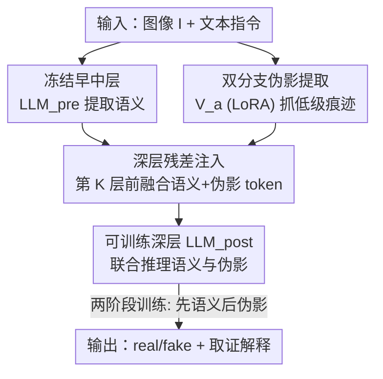

# Deep Residual Injection for Full-Spectrum Forensic Signal Perception in Multimodal Large Language Models

**会议**: ICML 2026  
**arXiv**: [2606.15880](https://arxiv.org/abs/2606.15880)  
**代码**: https://github.com/KQL11/Deep-VRM  
**领域**: 多模态VLM / AIGC检测  
**关键词**: AI生成图像检测, 多模态大模型, 残差注入, 灾难性遗忘, 分层分析  

## 一句话总结
本文发现：把 MLLM 直接微调去学生成器留下的低级伪影，会破坏它早期形成的语义表征（灾难性遗忘）；于是提出 Deep-VRM——冻结早中层保住语义，只在 LLM 深层用一条 LoRA 旁路把伪影特征"残差注入"进去，让同一个 MLLM 不依赖任何外部专家检测器就拿下大多数 AIGI 基准的 SOTA。

## 研究背景与动机
**领域现状**：随着 AI 生成图像越来越逼真，"图像是真是假"成了数字信任的核心问题。一类主流做法是用多模态大模型（MLLM）来检测——因为它能推理、能给出人类可读的解释，看起来是理想的取证工具。

**现有痛点**：通用 MLLM 在检测任务上常常打不过专门的取证模型。它们擅长抓"语义级"的不一致（风格怪、内容矛盾、逻辑不通），但对生成器在像素层留下的**低级伪影**（subtle generator traces）几乎无感。为了补这块短板，现有方案往往外挂一个专家取证模型，让 MLLM 沦为"传声筒"而非真正的独立判别器——既学不到伪造的内在特征，也解释不了 MLLM 为什么本身表现差。

**核心矛盾**：作者揭示了 MLLM 表征学习里的一个根本 trade-off——**原生模型无法在不损害核心语义能力的前提下学到可泛化的生成器痕迹**。预训练 MLLM 是为语义对齐优化的，天生忽略低级伪影。实验证实：标准 LoRA 微调救不回这些被抑制的低频特征；而全量微调虽然能学到伪影，却会摧毁语义理解——在 BLINK / RealWorldVQA / MME 上分数断崖式下跌（如 MME 从 1677 掉到 506），典型的灾难性遗忘。

**切入角度**：要解决困境，先得搞清模型内部"哪层在干什么"。作者用**线性探针做逐层分析**，发现区分真假图所需的语义可分性主要在**早到中层（1–16 层）就建立并收敛**了，而伪影检测能力在所有深度都停滞（≈81%）。换句话说，早中层是"语义收敛区"，强迫它们再去学相互矛盾的低级伪影，就会干扰语义提取。

**核心 idea**：既然语义在早层收敛、深层负责高层推理整合，那就**解耦学习过程**——冻结早层保语义，把低级伪影特征通过一条"残差旁路"只注入到深层，让后续可训练层同时建模语义推理和信号级取证线索。

## 方法详解

### 整体框架
Deep-VRM（Deep Visual Residual MLLM）以 Qwen-2.5-VL-7B 为骨干，输入是一张待检测图像 $I$ 加一句文本指令，输出是"real/fake"判断或一段取证分析文本。核心改动只有一处：在 LLM 的某一中间层 $K$（残差注入边界）之前，开一条"绿色通道"，把专门提取伪影的视觉特征直接加到视觉 token 上，再往深层传。

整条管线是这样转的：原始冻结视觉编码器 $\mathcal{V}_o$ 先把图像编成视觉嵌入，与文本嵌入拼成 $\mathbf{H}^{(0)}$；前 $K-1$ 层 LLM（冻结，记作 $\text{LLM}_{\text{pre}}$）照常做语义提取，得到中间隐状态 $\mathbf{H}^{(K-1)}$。与此同时，一条带 LoRA 的适配视觉分支 $\mathcal{V}_a$ 单独从原图抽伪影特征，在第 $K$ 层之前残差注入进视觉 token，融合后的 token 再喂给可训练的深层 $\text{LLM}_{\text{post}}$ 出最终结果。整个流程靠两阶段训练把"先稳语义、再补伪影"落地。

### 关键设计

**1. 分层分析定位"语义收敛区"：先诊断再下刀**

这是全文的立论根基，回答了"为什么直接微调会坏事"。作者用两个数据集做对照——$D_1$ 聚焦语义线索、$D_2$ 聚焦生成器痕迹（用 SD 2.1 的 VAE 重建图消除语义干扰，逼模型只看像素级差异），然后在 Qwen-2.5-VL-7B 每一层接线性探针。结论很清晰：$D_1$ 的检测准确率在早到中层（1–16）迅速上升并收敛，而 $D_2$ 的准确率在所有深度都卡在约 81% 不动。这说明早中层是负责语义提取的"语义收敛区"，强行让它们去学低级伪影就是在和已经收敛的语义表征对着干——这正是全量微调灾难性遗忘的机理。基于此，策略只能是：保留早层、把伪影注入留到收敛之后的深层。

**2. 残差注入旁路（Green Road）：绕开语义早层，深层补伪影**

针对"冻结早层会抑制高频伪影信号"的问题，作者在第 $K$ 层前加一条残差通路。它给原始视觉编码器 $\mathcal{V}_o$ 装上轻量 LoRA 适配器构成 $\mathcal{V}_a$，专门从原图 $I$ 抽伪影特征，再以加权和的方式注入到中间视觉 token：

$$\mathbf{\tilde{h}}_{v}^{(K-1)} = \alpha \cdot \mathbf{h}_{v}^{(K-1)} + \beta \cdot \mathcal{V}_a(I)$$

其中 $\alpha=\beta=0.5$ 平衡语义上下文与原始伪影线索。这条旁路有效"跳过"了早中层的语义提取阶段——和传统在输入层做特征对齐的方法不同，伪影特征被直接送进 LLM 深层。融合后的视觉 token 与原文本上下文重新拼接，喂给 $\text{LLM}_{\text{post}}$ 生成结果。妙处在于：$\mathcal{V}_a$ 从冻结的 $\mathcal{V}_o$ 初始化、只加 LoRA，所以相比基线 MLLM **不引入 LoRA 之外的任何额外可训练参数**（Qwen-2.5-VL-7B 设置下共 115.02M 可训练参数）。

**3. 两阶段训练：先激活语义先验，再做伪影感知精修**

光有结构还不够，训练顺序决定了语义会不会被覆盖。作者用标准自回归 SFT 损失 $\mathcal{L}_{SFT}=-\sum_{i=1}^{L}\log P(y_i\mid I, y_{<i};\Theta)$，分两阶段优化不同参数。**阶段一（语义对齐与先验激活）**：只用 $D_1$ 微调 LLM 主体，其余全冻，目的是把 MLLM 预训练里已有的语义知识"唤醒"并对齐到 AIGI 检测上。**阶段二（伪影感知精修）**：同时用 $D_1+D_2$ 训练残差注入结构，但前 $K-1$ 层 LLM 保持冻结以守住阶段一建立的判别先验，只优化 $\mathcal{V}_a$ 和第 $K$ 到 $N$ 层。这样既补上了伪影敏感度，又不破坏冻结早层里的语义表征。一个有意思的涌现现象是：训练后模型会**按输入自适应地调用不同层级的取证信号**——该看语义时看语义、该抠伪影时抠伪影。

### 损失函数 / 训练策略
统一用自回归负对数似然 $\mathcal{L}_{SFT}$ 监督，标注分两种格式：二选一（bi-choice，"Is this image real or fake? ... 'real' or 'fake'"）和用 Gemini 2.5 Pro 生成的详细分析式标注（对 $D_2$ 的重建假图特意强调"non-semantic artifacts"以引导学像素级差异）。共 88,000 条指令微调样本。训练 2 epoch，AdamW（$\beta_1=0.9,\beta_2=0.95$，weight decay $1e^{-3}$），cosine 学习率衰减，视觉编码器与 LLM 学习率 $1e^{-4}$、projector $1e^{-6}$，LoRA rank=64、alpha=128，图像按 $512\times512$ 等像素预算缩放。

## 实验关键数据

### 主实验
在 GenImage 8 个生成器子集上，Deep-VRM 平均准确率显著领先此前最好的 OMAT；在仅含假图的 SynthBuster 上同样大幅领先。

| 数据集 | 指标 | Deep-VRM | 之前最好 | 说明 |
|--------|------|----------|----------|------|
| GenImage (AVG 8 生成器) | ACC% | **97.42** | OMAT 94.63 / AIDE 86.88 | 跨生成器泛化 |
| GenImage·ADM | ACC% | **89.82** | OMAT 83.82 | 难子集也稳 |
| SynthBuster (AVG 9 源) | ACC% | **94.50** | PatchShuffle 62.75 | 仅假图，泛化拉开差距 |
| 通用多模态 MME | 分数 | **1636** | 全量微调 506 / 骨干 1677 | 几乎不掉语义能力 |

### 消融实验（微调策略对语义能力的影响，Table 2）

| 配置 | BLINK | RealWorldVQA | MME | 说明 |
|------|-------|--------------|-----|------|
| 骨干（未动） | 0.5481 | 0.6758 | 1677 | 原始语义能力 |
| 在 $D_2$ 上全量微调 LLM | 0.0373 | 0.1137 | 506 | 灾难性遗忘，语义崩塌 |
| Ours（在 $D_2$ 上） | 0.5476 | 0.6721 | 1636 | 学到伪影几乎不掉语义 |

### 关键发现
- **灾难性遗忘是关键瓶颈**：全量微调学伪影会让通用多模态分数断崖下跌（MME 1677→506），而残差注入把语义能力基本完整保住（1677→1636），证明"解耦"路线的必要性。
- **早中层确是语义收敛区**：线性探针显示语义可分性在 1–16 层收敛、伪影准确率全程卡 81%，直接支撑"只在深层注入伪影"的设计。
- **无需外部专家也能 SOTA**：仅靠单个 MLLM，Deep-VRM 在 GenImage、SynthBuster 等多数基准上超越外挂专家模型的方案，且在 WildRF / AIGI-Bench 等"野外"场景体现鲁棒性。
- **自适应取证信号**：模型涌现出按输入选择性调用不同层级取证信号的能力——这是残差注入让深层"同时拿到语义与伪影"后的副产品。

## 亮点与洞察
- **"先诊断后开方"的研究范式**：先用线性探针把 MLLM 内部功能分层讲清楚（语义在早层收敛、深层管推理整合），再据此设计架构，立论扎实，比拍脑袋加模块更有说服力。
- **残差注入只改一处、零额外参数**：$\mathcal{V}_a$ 从 $\mathcal{V}_o$ 复制+LoRA，不增加 LoRA 之外的可训练参数，工程上极轻，易迁移到其他需要"保留预训练知识又补低级信号"的任务（如深度伪造视频、文档篡改检测）。
- **把"灾难性遗忘"量化成可视的取证代价**：用 MME 等通用基准直接展示全量微调的语义崩塌，让"为什么不能直接微调"一目了然，这个对照实验本身就很有价值。

## 局限与展望
- **注入边界 $K$ 与缩放 $\alpha,\beta$ 是人工设的**：$K$ 由分层分析定、$\alpha=\beta=0.5$ 是固定值，是否对不同骨干/分辨率都最优、能否自适应学习，论文未充分探讨。
- **依赖 VAE 重建构造伪影数据 $D_2$**：用 SD 2.1 VAE 重建图作为"生成器痕迹"代理，对未见过的全新生成范式（如某些自回归图像模型）是否仍有效，存在泛化风险。
- **解释性非本文重点**：作者明确说本文聚焦检测性能而非可解释性，但 MLLM 检测的卖点之一就是解释，注入伪影后生成的解释文本质量如何，缺少系统评估。
- **改进方向**：让注入边界和融合权重随样本自适应；把残差注入推广到视频/音频取证；评估并优化伪影感知后解释文本的事实一致性。

## 相关工作与启发
- **vs 传统 AIGI 检测（CNNSpot / UnivFD / NPR / AIDE）**：它们用 CNN 或 CLIP 骨干专抓伪影，跨生成器泛化和抗后处理（压缩）能力有限；Deep-VRM 借 MLLM 的语义先验做基座，泛化更稳，且兼顾语义异常与像素伪影。
- **vs 外挂专家的 MLLM 方案（AIGI-Holmes / 用 MLLM 当 agent 协调多专家）**：它们让 MLLM 模仿专家预测或做协调，MLLM 本身没学会特征级分析；Deep-VRM 不依赖任何外部检测器，靠单一 MLLM 内化伪影感知。
- **vs 直接微调 MLLM（标准 LoRA / 全量微调）**：标准 LoRA 救不回被抑制的低频伪影，全量微调虽能学到却灾难性遗忘语义；Deep-VRM 用残差注入 + 两阶段训练把两者解耦，鱼与熊掌兼得。

## 评分
- 新颖性: ⭐⭐⭐⭐⭐ "分层诊断 + 深层残差注入"的解耦思路在 MLLM 取证里很新颖
- 实验充分度: ⭐⭐⭐⭐ 跨 GenImage/SynthBuster/WildRF 多基准 + 灾难性遗忘对照，较充分；注入超参敏感性可再补
- 写作质量: ⭐⭐⭐⭐⭐ 从现象到机理到方案逻辑链清晰，图表支撑有力
- 价值: ⭐⭐⭐⭐⭐ 给"如何让 MLLM 既保语义又学低级信号"提供了可复用范式

<!-- RELATED:START -->

## 相关论文

- [\[ICML 2026\] Generating Robust Portfolios of Optimization Models using Large Language Models](generating_robust_portfolios_of_optimization_models_using_large_language_models.md)
- [\[ICML 2026\] ForensicConcept: Transferable Forensic Concepts for AIGI Detection](forensicconcept_transferable_forensic_concepts_for_aigi_detection.md)
- [\[ICML 2026\] CORE: Conflict-Oriented Reasoning for General Multimodal Manipulation Detection](core_conflict-oriented_reasoning_for_general_multimodal_manipulation_detection.md)
- [\[CVPR 2026\] Inconsistency-aware Multimodal Schrodinger Bridge for Deepfake Localization](../../CVPR2026/aigc_detection/inconsistency-aware_multimodal_schrodinger_bridge_for_deepfake_localization.md)
- [\[ACL 2026\] AEGIS: A Holistic Benchmark for Evaluating Forensic Analysis of AI-Generated Academic Images](../../ACL2026/aigc_detection/aegis_a_holistic_benchmark_for_evaluating_forensic_analysis_of_ai-generated_acad.md)

<!-- RELATED:END -->
