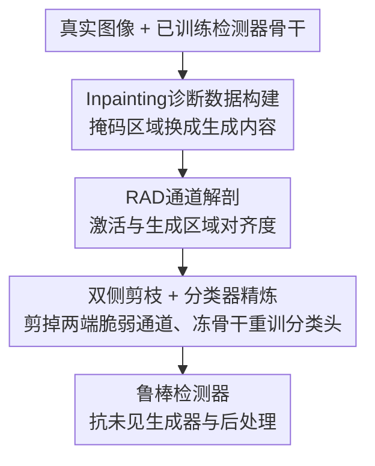

# Dissect and Prune: Enhancing Robustness in AI-Generated Image Detection

**会议**: ICML 2026  
**arXiv**: [2606.10309](https://arxiv.org/abs/2606.10309)  
**代码**: https://github.com/dahyedahye/dear  
**领域**: AIGC检测 / 模型可解释性  
**关键词**: AI生成图像检测, 预测不对称, 网络解剖, 特征剪枝, 鲁棒性

## 一句话总结
针对现有 AI 生成图像（AIGI）检测器"看起来准、其实只会把图判成真"的预测不对称问题，本文提出 DEAR：用 inpainting 图像当探针、按通道激活与生成区域的对齐度（RAD）做"解剖"，再把两端极值通道双侧剪掉、只重训线性分类头，让检测器丢掉脆弱的捷径特征，在未见生成器与后处理下显著更鲁棒。

## 研究背景与动机

**领域现状**：当下 AIGI 检测器（CNN 系、CLIP 系、ViT 系、频域系）在 benchmark 上动辄报出很高的 AUC / 准确率，一度让人觉得"AI 生成图像检测已经被解决了"。

**现有痛点**：作者把检测器拆开看，发现这种高分是被一种**预测不对称（prediction asymmetry）**撑起来的——模型对真实图像的识别近乎完美（R.Acc 很高），但对生成图像的敏感度（F.Acc）低得离谱。例如 Corvi 在原始 FLUX 图上 R.Acc 高达 99.9%，F.Acc 却只有 21.5%；NPR 在 JPEG/缩放等后处理后，平均 F.Acc 从 95.9% 暴跌到 12.2%，而 R.Acc 反而从 67.2% 升到 94.2%，整个退化成"无脑判真"的平凡分类器。聚合指标 AUC 把这种结构性偏置完全盖住了。

**核心矛盾**：根因是检测器依赖**伪相关（spurious correlation）**而非真正的生成痕迹。它学到的是两类脆弱捷径——一类是把数据集自带的偏置（如 WEBP/JPEG 压缩伪影、高频细节）当成"真实"的标志，另一类是过拟合到某个生成器特有的指纹（低秩痕迹、频谱偏置）。这些信号都不是图像内在的，后处理一扰动就被抹掉，检测器随即倒向"真"这一类。

**本文目标**：定位并剔除那些编码伪相关的具体特征通道，让检测器被迫依赖真正鲁棒的取证信号，从而同时缓解未见生成器泛化差和后处理崩溃两个问题。

**切入角度**：要"解剖"检测器，必须有一个能精确区分"激活在生成痕迹上"还是"激活在真实信号上"的 ground truth。作者发现 **inpainting 图像**是绝佳探针——它在一张真图里把一块掩码区域换成生成内容，于是同一张图里"生成像素"和"真实像素"被空间上明确分开，且掩码本身就是像素来源的精确标注。

**核心 idea**：借用 Network Dissection 的思路，用 inpainting 掩码量化每个通道对生成区域的对齐度，把对齐度在两端（极端偏生成 / 极端偏真实）的通道剪掉，只保留中间那批真正稳健的取证通道。

## 方法详解

### 整体框架
DEAR（DissEct And pRune）是一个施加在**已训练好的检测器骨干**上的特征选择框架，不重训骨干，只动最后的线性分类头。它分三步走：先用 SD-1.5 inpainting 造一批"真假像素共存"的诊断图像；再在骨干最后一层卷积（2048 通道）上，按通道激活在 inpaint 区域 vs 背景区域的均值差（RAD）做解剖，并实测验证 RAD 两端的通道恰恰对后处理最不鲁棒；最后按百分位阈值把两端通道双侧剪掉，在剪枝后的特征空间上重训线性分类器（骨干冻结），用原始训练集 + inpaint 诊断集联合优化。输入是检测器骨干，输出是一个对未见生成器和后处理都更稳的检测器。

### 关键设计

**1. Inpainting 诊断数据构建：把"真像素"和"生成像素"塞进同一张图当 ground truth**

要解剖出"哪些通道在响应生成痕迹、哪些在蹭真实信号"，必须有一个空间上把两者分开、且来源已知的探针。普通的真图/假图无法做到这点——整张图要么全真要么全假，没法在像素级对齐。作者用 Stable Diffusion 1.5 的 inpainting 变体：对每张真图 $\mathbf{x}_{\text{real}}$ 采一个随机位置的矩形二值掩码 $\mathbf{M}\in\{0,1\}^{H\times W}$，让模型在掩码区域内条件于周围真实上下文合成内容 $\mathbf{x}_{\text{gen}}$，最终图像为

$$\mathbf{x}_{\text{inpaint}}=\mathbf{M}\odot\mathbf{x}_{\text{gen}}+(1-\mathbf{M})\odot\mathbf{x}_{\text{real}}$$

为防止检测器钻"掩码边缘不连续"这种平凡捷径，合成前对掩码边缘做高斯模糊。关键收益是掩码 $\mathbf{M}$ 已知，天然给出一个像素来源的精确空间参照，让 Network Dissection 可以直接落地。

**2. RAD 通道解剖：用区域激活差把每个通道打到"偏生成↔偏真实"的连续谱上**

有了 inpaint 图和掩码，作者要量化第 $k$ 个通道到底偏向生成还是真实。借鉴 Chan-Vese 分割模型"分片常数"的假设，定义**区域激活差（Regional Activation Discrepancy, RAD）**：设 $\mathbf{F}_k\in\mathbb{R}^{h\times w}$ 是骨干倒数第二层第 $k$ 通道的激活图，$\Omega_{\text{in}}=\{x:\mathbf{M}(x)=1\}$ 是 inpaint 区域、$\Omega_{\text{bg}}$ 是背景，则

$$S_k=\mu_{\text{in}}^{(k)}-\mu_{\text{bg}}^{(k)},\quad \mu_{\text{in}}^{(k)}=\frac{\sum_{x\in\Omega_{\text{in}}}\mathbf{F}_k(x)}{|\Omega_{\text{in}}|},\ \mu_{\text{bg}}^{(k)}=\frac{\sum_{x\in\Omega_{\text{bg}}}\mathbf{F}_k(x)}{|\Omega_{\text{bg}}|}$$

按区域面积归一，所以 inpaint 区域占比大小不影响度量。直觉上 $S_k$ 大正值=通道强烈响应生成区域、对生成痕迹敏感；大负值=偏好真实背景。作者在约 6400 张 inpaint 图上逐通道平均得到稳定排名。**这一步真正点睛的发现是"对齐度能预测鲁棒性"**：用 WEBP 压缩前后激活的 MSE 衡量每个通道的脆弱度，结果 RAD 分布两端的通道恰恰最不鲁棒——负端对应数据集压缩伪影这类捷径，正端对应过拟合的生成器指纹，两者都一压缩就被抹掉；而中段通道明显更稳。这条经验规律直接给剪枝提供了判据。

**3. 双侧剪枝 + 分类器精炼：剪掉两端、冻骨干重训分类头**

既然两端通道都脆弱，作者就做**双侧剪枝**：给定下/上分位 $\alpha_{\text{low}},\alpha_{\text{high}}$，按 RAD 经验分布算出阈值 $\tau_{\text{low}},\tau_{\text{high}}$，得到二值掩码

$$m_k=\mathbb{1}[\tau_{\text{low}}\le S_k\le\tau_{\text{high}}]$$

只保留处于鲁棒中段的通道，把负端（压缩伪影捷径）和正端（生成器特有噪声）都剪掉。剪枝以逐元素乘施加在全局池化前的特征张量 $\tilde{\mathbf{F}}=\mathbf{m}\odot\mathbf{F}$ 上。由于剪枝只是在预训练表示上做特征选择，骨干参数 $\theta$ 全程**冻结**，只重新初始化并重训最后的线性分类器 $h_\phi$。精炼时用**原始训练集 $\mathcal{D}_{\text{train}}$ + inpaint 诊断集 $\mathcal{D}_{\text{inpaint}}$ 联合优化**，让分类器既适配剪枝后的特征空间，又能从整图和局部 inpaint 区域两种粒度上学会识别内在生成痕迹。整套方法因此非常轻量——不碰骨干、只换分类头。

### 损失函数 / 训练策略
骨干冻结，仅在剪枝后的特征 $\tilde{\mathbf{F}}$ 上重训线性分类头，监督来自原始真/假训练数据与 inpaint 诊断数据的联合集合；剪枝阈值由 RAD 分位 $\alpha_{\text{low}},\alpha_{\text{high}}$ 控制，是方法的关键超参。完整流程见原文 Appendix E 的 Algorithm 1。

## 实验关键数据

### 主实验
评测覆盖 9 类生成器（SD、Midjourney、Kandinsky、Playground、PixArt、LCM、FLUX、Wuerstchen、aMUSEd）及 3 个 in-the-wild benchmark（Chameleon、WildRF、LOKI），并分原始 / 后处理两种设定。核心观察是现有检测器在 F.Acc（生成图识别率）上普遍崩塌，而 DEAR 主要把这块补回来、缓解不对称。下表摘取若干代表性检测器在原始设定下的对比（AUC / R.Acc / F.Acc，单位 %，数值取自原文表 1 节选）：

| 检测器 | 类型 | FLUX AUC | FLUX R.Acc | FLUX F.Acc | 备注 |
|--------|------|----------|-----------|-----------|------|
| UFD | CLIP | 21.5 | 95.1 | 0.1 | 未见生成器上几乎判不出假 |
| C2P-CLIP | CLIP | 49.9 | 93.0 | 8.0 | F.Acc 极低，典型不对称 |
| RINE | ViT | 69.3 | 92.3 | 30.2 | 较强 baseline，F.Acc 仍偏低 |

可见即便是较强的 baseline，在未见生成器 FLUX 上 F.Acc 也只有 30% 量级，而 R.Acc 普遍 90%+——这正是预测不对称的直接证据，DEAR 的目标就是把 F.Acc 这一侧拉起来而不牺牲 R.Acc。

### 消融实验
作者验证了 RAD 两端通道与鲁棒性的关系，以及双侧剪枝相对单侧/不剪的增益（数值为定性趋势归纳）：

| 配置 | 关键现象 | 说明 |
|------|---------|------|
| 完整 DEAR（双侧剪枝） | F.Acc 显著回升、不对称缓解 | 同时剪掉真/假两端捷径 |
| 仅剪正端 / 仅剪负端 | 只缓解一类伪相关 | 单侧无法同时治压缩偏置和生成器指纹 |
| 不剪枝（原检测器） | 后处理下 F.Acc 崩塌 | 依赖脆弱捷径 |
| 更换 inpainter | 结论稳定 | 诊断不依赖特定 inpainting 模型（Appendix D） |

### 关键发现
- **RAD 两端 = 脆弱捷径**：负端对应 WEBP/JPEG 压缩伪影这类"伪真实"信号，正端对应过拟合的生成器指纹，二者都对后处理极敏感；中段通道才是稳健取证信号。这是全文最核心的经验规律，也是剪枝判据的来源。
- **不对称是被聚合指标掩盖的结构性问题**：AUC 高不代表能检出假图，R.Acc 和 F.Acc 必须分开看。
- **轻量**：骨干冻结、只重训线性头，无需重新训练大模型即可显著提升鲁棒性。

## 亮点与洞察
- **诊断工具选得巧**：用 inpainting 图把"真像素 / 生成像素"塞进同一张图、附带精确掩码，一举解决了"解剖检测器缺 ground truth"的难题——这是把可解释性工具（Network Dissection）迁到取证检测的关键桥梁。
- **"对齐度预测鲁棒性"是可迁移的观察**：用激活随扰动的变化量（MSE）衡量通道脆弱度、并与语义对齐度关联，这套"先解剖再按脆弱度剪枝"的范式可推广到其他存在捷径学习的分类任务。
- **双侧剪枝对称地治两类伪相关**：很多去捷径工作只盯"假"侧，本文指出"真"侧的压缩偏置同样致命，必须双侧一起剪。

## 局限与展望
- 诊断数据依赖 inpainting 模型生成，inpaint 区域的分布（矩形随机掩码）可能与真实生成痕迹的空间形态有差异；虽换 inpainter 结论稳定，但更复杂的局部编辑场景未充分覆盖。
- 剪枝阈值 $\alpha_{\text{low}},\alpha_{\text{high}}$ 是关键超参，其在不同骨干/生成器上的最优取值与敏感性需更系统的分析。
- 方法在 ResNet-50 类 CNN 骨干上验证充分，对 CLIP/ViT 这类全局 token 表示的检测器，"通道对齐度"概念是否同样成立、如何定义区域激活，值得进一步探讨。

## 相关工作与启发
- **vs Network Dissection（Bau et al.）**: 原框架用 IoU 衡量通道与高层语义概念（物体/纹理）的对齐；本文把"概念"换成 inpaint 生成区域，并用 RAD（区域均值差）替代 IoU，把可解释性工具改造成取证检测的剪枝判据。
- **vs Rajan & Lee / Grommelt 等去捷径工作**: 它们指出检测器会把压缩伪影当成真实标志；本文不止指出，还给出一个可操作的"测量对齐度 → 按脆弱度双侧剪枝"的机制，且额外覆盖了"假"侧的生成器指纹捷径。
- **vs 频域/低秩痕迹方法（Yan et al. / Kashiani et al.）**: 这些方法主动设计鲁棒特征；DEAR 反其道而行，从已训练检测器里**剔除**非鲁棒特征，是"做减法"的思路，可与前者互补。

## 评分
- 新颖性: ⭐⭐⭐⭐ 把 Network Dissection + inpainting 探针迁到 AIGI 检测、提出 RAD 与双侧剪枝，视角新颖
- 实验充分度: ⭐⭐⭐⭐ 覆盖 9 类生成器 + 3 个 in-the-wild benchmark，原始/后处理双设定，含换 inpainter 消融
- 写作质量: ⭐⭐⭐⭐ "预测不对称→伪相关→对齐度预测鲁棒性→剪枝"逻辑链清晰
- 价值: ⭐⭐⭐⭐ 揭示并量化了被聚合指标掩盖的结构性偏置，方法轻量易落地

<!-- RELATED:START -->

## 相关论文

- [\[CVPR 2026\] PPM-CLIP: Probabilistic Prompt Modeling for Generalizable AI-Generated Image Detection](../../CVPR2026/aigc_detection/ppm-clip_probabilistic_prompt_modeling_for_generalizable_ai-generated_image_dete.md)
- [\[ICLR 2026\] All Patches Matter, More Patches Better: Enhance AI-Generated Image Detection via Panoptic Patch Learning](../../ICLR2026/aigc_detection/all_patches_matter_more_patches_better_enhance_ai-generated_image_detection_via_.md)
- [\[ICML 2026\] On the Salience of Low-Probability Tokens for AI-Generated Text Detection: A Multiscale Uncertainty Perspective](on_the_salience_of_low-probability_tokens_for_ai-generated_text_detection_a_mult.md)
- [\[ICML 2026\] Feature-Augmented Transformers for Robust AI-Text Detection Across Domains and Generators](feature-augmented_transformers_for_robust_ai-text_detection_across_domains_and_g.md)
- [\[CVPR 2026\] Enabling Supervised Learning of Generative Signatures for Generalized AI-Generated Images Detection](../../CVPR2026/aigc_detection/enabling_supervised_learning_of_generative_signatures_for_generalized_ai-generat.md)

<!-- RELATED:END -->
