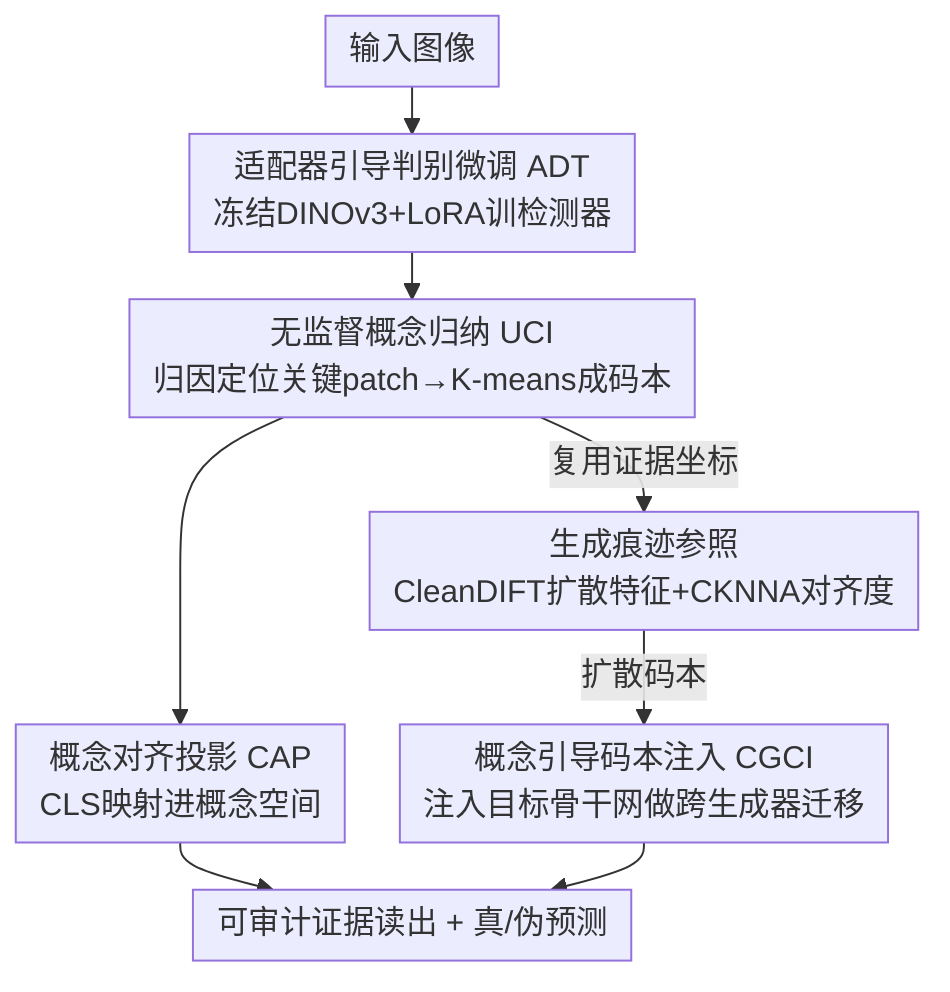

# ForensicConcept: Transferable Forensic Concepts for AIGI Detection

**会议**: ICML 2026  
**arXiv**: [2606.07034](https://arxiv.org/abs/2606.07034)  
**代码**: https://github.com/EthanAdamm/FORENSICCONCEPT  
**领域**: AIGC检测 / 可解释性 / 表示对齐  
**关键词**: AI生成图像检测, 取证概念, 跨生成器泛化, 扩散特征对齐, CKNNA

## 一句话总结
针对 AI 生成图像（AIGI）检测器"在训练分布内很准、换个生成器就崩"且完全黑箱的问题，本文把检测器依赖的弥散证据显式抽成一本"取证概念码本"，再用扩散特征（CleanDIFT）作外部生成痕迹参照、用邻域结构一致性指标 CKNNA 度量骨干网证据与扩散痕迹的几何对齐度，并通过把扩散码本注入目标骨干网实现跨生成器迁移；GenImage 平均准确率 92.0%，且 CKNNA 越高迁移收益越大。

## 研究背景与动机

**领域现状**：AI 生成图像检测的主流做法是把它当二分类——训一个网络对每张图输出单一的"伪造概率"。在训练见过的生成器（如 SDv1.4）上，这类检测器准确率能轻松上 99%。

**现有痛点**：一旦换到训练时没见过的生成器（Midjourney、ADM、BigGAN 等），准确率断崖式下跌。更麻烦的是没人说得清"为什么会崩"——现有检测器是彻底的黑箱，只给一个分数，不告诉你它到底盯着图像的哪块证据做决策。无法理解证据，就既诊断不了泛化失败，也设计不出有原则的解法。

**核心矛盾**：作者怀疑检测器学到的是"生成器特定的捷径"（某个生成器残留的指纹），而非可跨生成器迁移的"取证痕迹"。但要验证这个猜想，必须先把"检测器依赖的证据"从黑箱里掏出来——而取证证据天然难掏：作者通过对比可视化发现，语义分类器（猫 vs 狗）盯的是眼睛、耳朵这类物体部件，而取证检测器的注意力**弥散**在背景、纹理、平滑区等大片零散区域，和语义线索性质完全不同。

**本文目标**：(1) 把这种空间上弥散的证据**显式刻画**出来；(2) 判断这些证据到底是真生成痕迹还是骨干网捷径；(3) 让证据能在不同骨干网之间**迁移**以提升泛化。

**切入角度**：作者观察到，虽然证据空间上零散，但把检测器关注的 patch 聚类后会形成**连贯的簇**——同簇 patch 共享相似纹理/边缘统计，且这些模式在不同生成器的图像间**反复出现**。这说明弥散证据在特征空间里其实有结构化的几何。作者把这些反复出现的模式叫做"取证概念"（forensic concepts）。

**核心 idea**：用"显式取证概念码本"代替黑箱分数来承载证据，并借助"扩散特征作外部参照 + CKNNA 度量对齐 + 码本注入做干预"这套组合，把弥散证据变成可审计、可迁移的单元。

## 方法详解

### 整体框架
ForensicConcept 由三个环节串成一条"先把证据掏出来 → 再用外部参照验证证据真假 → 最后通过注入证明证据可迁移"的链路。输入是图像，输出既有真/伪预测、又有可视化的取证概念证据读出。

第一环节**取证概念学习**（Section 3.1）：在预训练 DINOv3 上做适配器引导的判别微调（ADT），用 Transformer 归因定位决策关键 patch，对这些 patch 的 token 做 K-means 聚类，得到一本紧凑的取证概念码本，再用概念对齐投影（CAP）把 CLS 表示映射进概念空间。第二环节**生成痕迹参照**（Section 3.2）：因为第一环节学到的码本几何可能仍掺杂骨干网/数据集捷径，作者引入 CleanDIFT 扩散特征作为"外部、与生成过程绑定"的参照空间，用 CKNNA 量化骨干网证据与扩散痕迹的邻域结构一致性。第三环节**概念引导码本注入**（CGCI，Section 3.3）：把扩散导出的码本注入目标骨干网（如 CLIP），检验跨生成器收益是否与第二环节测出的对齐度相关——这是用"干预"来证明因果，而非只看相关。

### 关键设计

**1. ADT + UCI：把弥散证据归纳成显式取证概念码本**

这一对设计直接针对"证据掏不出来"的痛点。ADT（Adapter-Guided Discriminative Tuning）的关键是**不能为了判别力破坏表示几何**——如果直接全量微调 DINOv3，patch token 表示会漂移，后续归因和聚类就失去意义。所以作者冻结骨干参数 $\theta$，只在所有 Transformer block 插入 LoRA 适配器，外加一个轻量分类头 $g(\cdot)$ 作用在 CLS token 上，用标准二分类交叉熵 $\mathcal{L}_{\mathrm{cls}}$ 训练。这样既得到判别检测器，又让 patch 表示稳定可分析。

UCI（Unsupervised Concept Induction）负责从这个稳定的检测器里"定位 + 归纳"证据。定位用基于梯度的 Transformer 归因：为避免梯度饱和，先用 logit 目标 $\hat{y}_t(x)=(2y-1)\hat{y}_{\mathrm{cls}}(x)$ 统一真（$y=0$）伪（$y=1$）样本的归因方向；对每层每个注意力头算梯度加权相关性 $\mathbf{R}^{(l,h)}=\mathrm{ReLU}(\frac{\partial \hat{y}_t}{\partial \mathbf{A}^{(l,h)}}\odot \mathbf{A}^{(l,h)})$，头平均加残差后沿层做 attention-rollout 连乘 $\mathbf{R}(x)=\prod_{l=1}^{L}\tilde{\mathbf{R}}^{(l)}$，取 CLS→patch 的相关性作为每个 patch 的归因分，选 top-$k$ 当证据位置。把全数据集证据位置的 patch token 汇成集合 $\mathcal{U}$，对其做 K-means 得到码本 $\mathbf{C}=\{\mathbf{c}_1,\dots,\mathbf{c}_K\}$，每个原型对应一种反复出现的决策关键证据模式。这本码本就是"显式取证概念"——可视化、可审计，不再是黑箱分数。

**2. CAP：让概念空间真正参与决策而不只是事后解释**

光有码本还不够，如果它只是事后聚类、不影响预测，那它就只是一个解释工具，无法保证概念真的承载了判别信息。CAP（Concept-Aligned Projection）在冻结的 ADT 检测器上挂一条概念分支：用码本初始化一个可学投影 $\mathbf{W}_c\in\mathbb{R}^{d\times K}$（初值 $\mathbf{W}_c\leftarrow \mathbf{C}^\top$），把 CLS token 映射进概念空间 $\mathbf{s}(x)=\mathbf{z}_{\mathrm{cls}}(x)^\top \mathbf{W}_c$，再过概念头 $h$ 出预测。冻结骨干（含 LoRA），联合优化 $\mathcal{L}=\mathcal{L}_{\mathrm{cls}}+\lambda\mathcal{L}_{\mathrm{con}}$。这样概念空间被拉进监督回路，既产出与预测并列的证据读出，又保证码本里的概念确实是判别相关的，而非装饰。

**3. CleanDIFT 生成痕迹参照 + CKNNA：用外部参照判断证据是真痕迹还是捷径**

这是全文最巧的设计，针对"怎么知道学到的概念是真生成痕迹而非骨干网捷径"。作者的洞察是：要判断证据真假，需要一个**与生成过程绑定、且独立于检测器**的外部参照。扩散模型的内部表示恰好是这样的"生成痕迹"空间，而且已有研究显示 DINO 风格特征与扩散表示在概念层面存在对应。于是作者用 CleanDIFT 从 U-Net 某层抽出稠密扩散 token 网格 $\mathbf{D}^{(l)}(x)$ 作参照，把骨干特征标准化到 $16\times 16$ 分辨率，**复用第一环节的证据坐标** $\mathcal{I}_b(x)$ 做位置对齐配对 $(\mathbf{p}_{x,j},\mathbf{q}_{x,j})$。

度量用 CKNNA（neighborhood-structure consistency）：在骨干空间和扩散空间各自用余弦距离求 $k_{\mathrm{NN}}$ 近邻集 $\mathcal{N}^p(u),\mathcal{N}^q(u)$，对所有配对样本取近邻交集占比的平均：

$$\mathrm{CKNNA}_{k_{\mathrm{NN}}}(b,l)=\frac{1}{|\mathcal{P}|}\sum_{u\in\mathcal{P}}\frac{|\mathcal{N}^p(u)\cap \mathcal{N}^q(u)|}{k_{\mathrm{NN}}}$$

CKNNA 越大，说明骨干证据的邻域几何越贴近扩散痕迹，也就越"像真痕迹"。它不强求两个空间逐维相等，只比邻域结构——这正契合"不同骨干维度不同但几何可比"的需求。关键结论是：CKNNA **能预测迁移收益**——对齐越强的骨干，诱导出的取证概念越可迁移。把扩散关键证据位置的 token 聚类，还能得到一本扩散码本 $\mathbf{R}_b^{(l)}$ 供注入用。

**4. CGCI：用码本注入做干预，把"相关"坐实成"可迁移"**

CKNNA 只是相关性，作者用 CGCI（Concept-Guided Codebook Injection）做干预实验来证明因果：把扩散导出的码本 $\mathbf{C}$（行是生成痕迹原型）注入目标骨干网（如 CLIP），看跨生成器收益是否真和对齐度相关。注入分三步：先把 patch token 投到码本空间算归一化相似度 $\mathbf{S}=\frac{1}{\tau}\hat{\mathbf{Q}}\hat{\mathbf{C}}^\top$；FES（Forensic Evidence Scoring）对每个 patch 取其 top-$r$ 概念响应均值 $\mathrm{score}_{n,i}=\frac{1}{r}\sum_{t=1}^{r}S_{n,i,(t)}$ 作证据分（偏好响应集中在少数原型上的 patch），选 top-$m$ 个 patch；FEA（Forensic Evidence Aggregator）用 softmax 权重把选中 patch 聚成全局证据向量 $\mathbf{g}^{(n)}=\sum_i w_i^{(n)}\mathbf{X}_{\mathrm{sel},i}^{(n)}$。概念分支与原 CLS 分支并列预测，联合 BCE 优化。注入后跨生成器收益与 CKNNA 一致相关，从而把"对齐预测迁移"这条结论坐实。

## 实验关键数据

### 主实验
在 GenImage 上以 SDv1.4 为训练集、其余生成器为测试集，做跨生成器泛化对比（准确率 %）：

| 方法 | 来源 | Midjourney | ADM | VQDM | BigGAN | Mean |
|------|------|-----------|-----|------|--------|------|
| UnivFD | CVPR 2023 | 91.5 | 58.1 | 67.8 | 57.7 | 79.5 |
| NPR | CVPR 2024 | 81.0 | 76.9 | 84.1 | 84.2 | 88.6 |
| DRCT | ICML 2024 | 91.5 | 79.4 | 90.0 | 81.7 | 89.5 |
| Effort | ICML 2025 | 82.4 | 78.7 | 91.7 | 77.6 | 91.1 |
| **ForensicConcept** | – | 95.0 | 69.2 | 94.3 | **94.1** | **92.0** |

本文平均 92.0% 超过此前最好的 Effort（91.1%），尤其在 BigGAN（94.1，远超次高 84.2）和 VQDM 上优势明显——说明显式取证概念在差异大的生成器家族上更稳。在 GAN-family 基准上训扩散迁 GAN 拿到 90.1%，在分布漂移更强的 Chameleon 上拿到 84.4%。

### 消融实验（码本注入的作用）
GenImage 上对 CLIP 注入/不注入扩散码本对比（准确率 % 及相对基线的 ΔAcc）：

| 生成器 | CLIP (无注入) | CLIP (注入码本) |
|--------|--------------|----------------|
| Midjourney | 70.4 | 85.9 (+15.5) |
| ADM | 58.1 | 63.3 (+5.1) |
| GLIDE | 91.7 | 95.3 (+3.6) |
| VQDM | 76.9 | 84.4 (+7.5) |
| SDv1.4 (域内) | 99.9 | 99.0 (-0.9) |
| Wukong | 99.0 | 98.4 (-0.6) |

### 关键发现
- 注入扩散码本在**未见生成器**上收益最大（Midjourney +15.5、VQDM +7.5），而在域内/相近分布（SDv1.4、Wukong）上仅微跌 <1%——证明注入带来的是真正的跨生成器迁移能力，而非过拟合。
- CKNNA 对齐度能**预测**这种迁移收益：与扩散痕迹对齐越强的骨干，注入后泛化提升越大，给"为什么有些骨干证据更可迁移"提供了有原则的解释。
- 取证证据与语义证据性质截然不同：归因图显示检测器盯弥散的纹理/背景/平滑区，而非语义部件——这是把证据显式化、可视化的价值所在。

## 亮点与洞察
- **把"可解释性"从事后解释升级成可迁移的工具**：取证概念码本不只是给人看的解释，还能跨骨干网注入、直接提升泛化，解释性和性能在同一套框架里统一了。
- **用扩散特征当"测谎仪"**：以与生成过程绑定的 CleanDIFT 扩散痕迹为外部参照，配 CKNNA 邻域一致性，巧妙绕开了"没有真值无法判断证据真假"的死结；CKNNA 不比逐维相等只比邻域结构，天然适配异构骨干。
- **相关 → 干预的闭环论证**：先用 CKNNA 测出"对齐预测迁移"的相关性，再用 CGCI 码本注入做干预坐实因果，这套方法论比单看相关更有说服力，可迁移到其他"表示对齐预测下游迁移"的研究。
- 用 LoRA + 冻结骨干保表示几何，是"既要判别力又要可分析表示"两难下的实用折中。

## 局限与展望
- 整条链路依赖 CleanDIFT 扩散特征作参照，参照本身的质量与覆盖（哪些 U-Net 层、对哪些生成器有效）会影响 CKNNA 与注入收益，论文未充分探讨参照失配的情形。
- ADM 上注入收益偏小（+5.1）、本文绝对准确率也只有 69.2，说明对某些扩散变体的痕迹刻画仍不充分；弥散证据的归因质量受 Transformer rollout 近似影响。
- CKNNA 与迁移收益的"预测"目前是经验相关，缺乏理论保证；不同 $k_{\mathrm{NN}}$、不同骨干下相关性是否稳定需更系统验证。
- 改进方向：把多层/多生成器扩散参照融合成更鲁棒的痕迹空间，或把 CKNNA 直接当训练正则项，主动把骨干证据往扩散痕迹几何上拉。

## 相关工作与启发
- **vs 扩大数据/换强表示的泛化路线（如 DRCT、Effort）**：他们把检测器当黑箱、只优化聚合准确率，回答不了"学到什么证据、能否迁移"；本文直接把证据掏出来显式化，并给出可迁移性的度量与干预手段。
- **vs UnivFD 等用 VLM 预训练表示**：UnivFD 借 CLIP 表示提泛化但仍是黑箱分数；本文进一步把 CLIP 作注入目标，用扩散码本主动注入生成痕迹概念，把表示利用从"借现成特征"推进到"按对齐度定向迁移概念"。
- **vs 经典表示相似度（CKA/SVCCA）**：本文采用受柏拉图表示假说启发的 CKNNA 邻域一致性，比逐维相似度更适合度量异构骨干与扩散空间之间"证据几何"的对齐。

<!-- RELATED:START -->

## 相关论文

- [\[ICML 2026\] Deep Residual Injection for Full-Spectrum Forensic Signal Perception in Multimodal Large Language Models](deep_residual_injection_for_full-spectrum_forensic_signal_perception_in_multimod.md)
- [\[ACL 2026\] AEGIS: A Holistic Benchmark for Evaluating Forensic Analysis of AI-Generated Academic Images](../../ACL2026/aigc_detection/aegis_a_holistic_benchmark_for_evaluating_forensic_analysis_of_ai-generated_acad.md)
- [\[ICML 2026\] CORE: Conflict-Oriented Reasoning for General Multimodal Manipulation Detection](core_conflict-oriented_reasoning_for_general_multimodal_manipulation_detection.md)
- [\[ICML 2026\] Dissect and Prune: Enhancing Robustness in AI-Generated Image Detection](dissect_and_prune_enhancing_robustness_in_ai-generated_image_detection.md)
- [\[ICML 2026\] Black-Box Detection of LLM-Generated Text Using Generalized Jensen-Shannon Divergence](black-box_detection_of_llm-generated_text_using_generalized_jensen-shannon_diver.md)

<!-- RELATED:END -->
