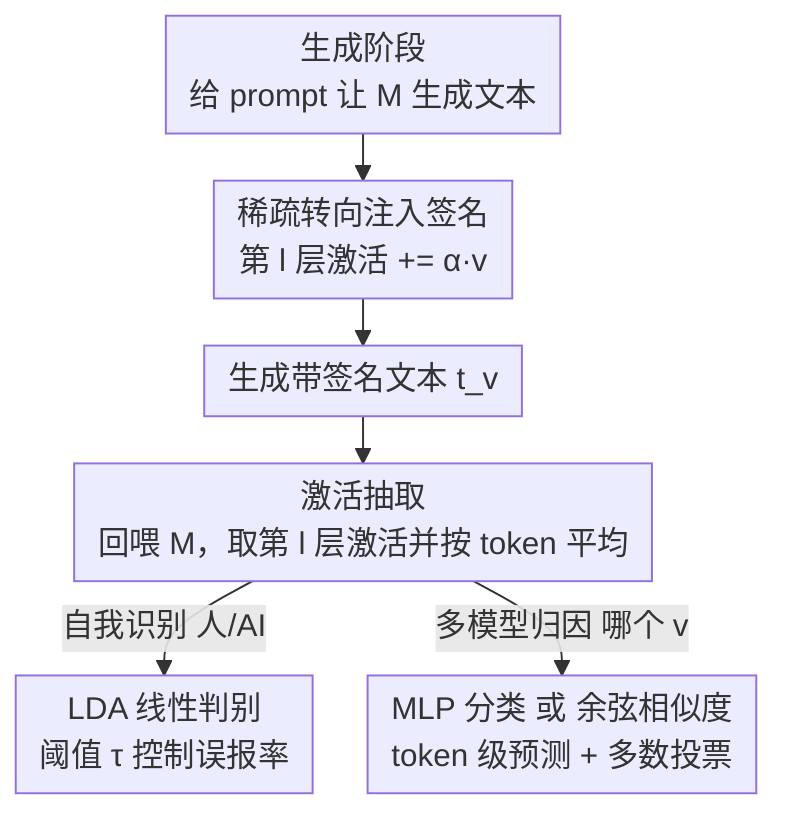

# LLM Self-Recognition: Steering and Retrieving Activation Signatures

**会议**: ICML 2026  
**arXiv**: [2606.06315](https://arxiv.org/abs/2606.06315)  
**代码**: https://github.com/Thibaud-Ardoin/LLM-Self-Recognition  
**领域**: AIGC 检测 / 模型水印 / 激活工程  
**关键词**: AI 文本检测、激活引导、自我识别、稀疏转向向量、模型归因

## 一句话总结
这篇论文不在 token 层加水印，而是在生成时往 LLM 残差流注入一个随机稀疏的转向向量，让模型自带可检测的"激活签名"，之后把文本回喂同一模型、从激活里用余弦相似度或轻量分类器把签名捞回来，在多种检测设定下达到 98% 以上准确率且几乎不损文本质量。

## 研究背景与动机
**领域现状**：随着 LLM 被大量用于内容生成，AI 文本的真实性与可溯源性越来越受关注。不仅要判断一段文本是不是 AI 写的，还要判断是哪个具体模型写的——这对审计、归因、防滥用至关重要。现有 AI 生成文本检测（AI-GTD）主要走两条路：一是水印，通过修改 token 概率分布（如 KGW 绿名单）或策略性选词来藏信息；二是事后分类器，利用生成文本的统计特性或在大规模标注语料上训练。

**现有痛点**：水印要嵌进生成流程，带来额外开销，而且鲁棒性和文本质量之间有 trade-off，限制了普及；事后分类器对跨域分布漂移敏感，而且天然不擅长区分"多个不同 LLM"。两条路都把签名当成"外挂"——要么改输出 token，要么靠外部统计。

**核心矛盾**：能不能不靠外部 token 层机制，而是利用模型**内部表示本身的结构**来嵌入和回收签名？近期可解释性研究发现两件事可以拼起来：其一，LLM 能以非平凡准确率"自我识别"——认出自己生成的输出（self-recognition），说明模型在生成里隐式编码了模型特定信息；其二，激活工程表明对内部激活做定向干预能引导行为、又基本不损质量。

**本文目标**：(1) 验证自我识别能力是否可靠，哪怕短文本、低熵场景；(2) 设计一个简单的转向式水印，能区分多个相同模型的不同实例、且不损质量；(3) 分析激活空间到底有多大容量来编码并回收一个随机信号。

**切入角度**：把 LLM 的**内部表示**当作藏信号和检测信号的"空间"。既然模型生成里天然有指纹，那就在推理时再注入一个故意设计的、容易回收的额外签名，让检测更可靠、还能支持多模型归因。

**核心 idea**：用一个随机稀疏向量在某一中间层引导生成，制造可检测的"激活指纹"；这个信号穿过 token 采样和重嵌入后仍能从激活里被余弦相似度直接捞回来——因为高维空间里随机向量几乎正交于语义流形，签名能和语义内容共存而不互相干扰。

## 方法详解

### 整体框架
方法分两段，对应两类任务。**自我识别**：判断一段文本是模型 $M$ 生成还是人写的，做法是把文本喂给 $M$、在中间层抽激活、对 token 级激活做平均得到定长表示，再用一个轻量线性分类器（LDA）判别。**多模型归因**：判断一段文本是同一基座模型的哪个"转向变体"生成的，做法是生成时往中间层激活加一个随机稀疏转向向量制造签名，检测时把文本回喂模型抽激活，用余弦相似度（训练自由）或训练好的 MLP（更强）把对应的转向向量认出来。整套都在白盒设定下进行——检测时假设能访问 $M$ 处理该文本时的内部激活。

### 关键设计

**1. 稀疏转向注入签名：在残差流里藏一个随机指纹**

传统水印改 token 概率会带来质量损失和开销。本文反其道，把签名藏进激活空间。给一个方向向量 $\boldsymbol{v}\in\mathbb{R}^d$ 和放大系数 $\alpha>0$，在生成的每一步把缩放后的向量加到第 $l$ 层的中间激活上：

$$\mathbf{A}_l(x_i)\leftarrow\mathbf{A}_l(x_i)+\alpha\boldsymbol{v}$$

这个干预把内部表示轨迹朝一个一致方向轻推，使生成文本 $t_{\boldsymbol{v}}$ 带上 $\boldsymbol{v}$ 的影响。关键在于 $\boldsymbol{v}$ **随机选取**（在多模型归因里每个变体一个不同向量，制造唯一水印）且**高度稀疏**——只有极小一部分维度非零（实验固定 99.7% 稀疏度）。为什么要稀疏？因为相比改动全部隐藏维度的稠密干预，稀疏转向引入的额外扰动更少、模型行为更稳定，能在"可检测性"和"质量损失"之间取得更好平衡（§3.4 实验证明稀疏向量的 trade-off 曲线明显优于稠密向量）。转向和激活抽取用同一层 $l$，简化流程。

**2. 激活抽取与聚合：把任意长文本压成定长表示**

检测前要先从模型里把信号拿出来。给一个 $L$ 层模型 $M$、token 序列 $\mathbf{x}=[x_0,\dots,x_{n-1}]$（prompt+补全，或 prompt-agnostic 设定下只有补全），在第 $l$ 层每个 token 下游取中间激活 $\mathbf{A}_l(x_i)\in\mathbb{R}^d$。抽取层固定在网络中部附近、对每个模型单独优化。为得到与 token 长度 $n$ 无关的定长表示，对 token 级激活做简单平均：

$$\mathbf{r}=\frac{1}{n}\sum_{i=0}^{n-1}\mathbf{A}_l(x_i)\in\mathbb{R}^d$$

这个 $\mathbf{r}$ 就是后续判别的输入。这一步看似平凡却必要——它让方法能处理任意长度文本，并把"信号分布在整段 token 上"这一鲁棒性来源汇聚起来。

**3. 双档归因：自我识别用 LDA，多模型用 MLP**

不同任务难度不同，本文配两套探针。**自我识别**（人 vs AI）相对简单，用轻量线性判别分析（LDA）：在标准化后的 $\mathbf{r}$ 上学一个仿射决策函数给文本打分，再用阈值 $\tau$ 卡到目标误报率。高维下 LDA 的协方差估计容易病态，于是用 Ledoit–Wolf 收缩估计正则化，80/20 划分训练/测试。**多模型归因**（区分 $K$ 个转向向量）更难，构造激活标注集 $\mathcal{D}=\{(\mathbf{A}_l(t_{\boldsymbol{v}_k,p}),k)\}$，按 prompt 集做 70/10/20 划分（保证 prompt 不跨集泄漏），训一个两层宽 32、只跑一个 epoch 的 MLP，按 token 预测转向索引 $k$，再多数投票聚合成文本级判定。因为检测在 token 级，所以能处理任意长度文本。

**4. 余弦相似度零样本回收：签名穿过离散化仍可直接捞回**

最反直觉的发现是：注入的稀疏信号竟然能熬过 token 采样和重嵌入这一道离散化。把带签名文本回喂**未转向**的基座模型，原始转向向量能从激活里被直接捞出——无需训练任何分类器。本文用集中测度（concentration of measure）来解释：高维激活空间里随机向量几乎正交于支配模型常规行为的语义流形，所以转向信号能和语义内容共存而不互相干扰，这种正交性让签名"隐形"地搭车而不破坏文本。检测时只需算收集到的激活与候选转向向量的余弦相似度，得到每 token 一个归因分数，多数投票给出全局判定。这套零样本几何方法虽不如训练好的 MLP，但准确率高得惊人，证明稀疏信号是**物理地编码进了生成序列**而非统计假象。

## 实验关键数据

### 实验设置
- **模型**：主用 Llama-3.1-8B；跨家族验证用 Ministral-3-8B（8B 级 MoE）；scalability 验证用 Llama-3.2-1B / 3B。问答任务用指令微调版。
- **数据集**：低熵自我识别用 XL-Sum 摘要（英文 BBC 子集，8192 篇文章+参考摘要，≤2048 字符）；长文问答用 ELI5；高熵开放生成用自建 Fresh News（训练截止后发布的新闻）。
- **固定超参**：放大系数 $\alpha=5$、稀疏度 99.7%，跨所有模型家族固定以便公平对比。

### 主实验一：自我识别 AUROC（XL-Sum，%）

| 模型 | Ours（有 prompt） | PPL（有 prompt） | Ours（无 prompt） | PPL（无 prompt） |
|------|------|------|------|------|
| Ministral-3-8B | 100 | 99.71 | 99.99 | 32.33 |
| Llama-3.1-8B | 99.99 | 99.19 | 99.16 | 47.86 |
| Llama-3.2-3B | 99.96 | 99.43 | 99.03 | 47.49 |
| Llama-3.2-1B | 99.82 | 97.07 | 98.58 | 52.27 |

激活分类器在低熵短摘要上就近乎完美，且**无 prompt 设定下仅掉至多 1 点**；而困惑度基线一旦没有 prompt 就基本掉到随机甚至反转（Ministral 无 prompt 仅 32.33，人写摘要反而困惑度更低）。

### 主实验二：多模型归因 F1（区分两个独立转向变体，%）

| 模型 | ELI5 Token | ELI5 Text | Fresh News Token | Fresh News Text |
|------|------|------|------|------|
| Ministral-3-8B | 99.3 | 100 | 94.6 | 100 |
| Llama-3.1-8B | 94.0 | 99.1 | 90.5 | 99.1 |
| Llama-3.2-3B | 83.3 | 95.5 | 75.5 | 88.3 |
| Llama-3.2-1B | 72.0 | 85.3 | 69.5 | 83.8 |

检测性能随模型规模上升，文本级（多数投票）明显高于 token 级。

### 关键发现
- **零样本 vs 训练对比（Table 3）**：余弦相似度文本级原文 84.6%、改写后 77.8%；训练 MLP 文本级原文 99.1%、改写后 89.3%——几何法虽逊于 MLP，但对简单余弦度量已属惊人，证明信号真实物理存在。
- **稀疏 > 稠密（§3.4）**：在"区分原始 vs 转向 Llama-3-8B"的难任务上，扫描 $\alpha$ 后稀疏 99.7% 向量的"检测率-质量"trade-off 曲线明显优于稠密向量，说明无需全维度广撒网，定向稀疏干预更鲁棒。
- **改写鲁棒性（§3.3）**：用 DIPPER-XXL 多句改写洗水印，本文方法比 KGW 绿名单水印更稳，尤其在自由生成场景几乎不掉——因为信号在高层表示空间跨多 token 聚合。
- **反直觉的 ELI5 > 开放生成**：低熵问答反而比开放生成更可分，作者推测与指令微调有关。
- **质量几乎无损**：用 NVIDIA NeMo Curator 的 quality-classifier-deberta 和 MMLU 验证，转向后质量与性能退化极小。

## 亮点与洞察
- **签名内生而非外挂**：不改 token 概率分布，而是利用模型自身表示结构来编码归因信号，从根上避开了传统水印"鲁棒性 vs 质量"的 trade-off，这是看问题的角度转换。
- **集中测度的妙用**：用"高维随机向量近似正交于语义流形"解释签名为何能和语义共存，把一个工程 trick 提升成有理论支撑的设计——稀疏随机向量正是这套几何的最佳载体。
- **信号穿越离散化的惊艳**：转向信号能熬过 token 采样+重嵌入、还能被余弦相似度零样本捞回，意味着"激活→离散 token→激活"这条路保留了方向对齐，对理解 LLM 表示的鲁棒性本身有启发。
- **可组合多比特水印的潜力**：当前 $N$ 路分类 scalability 有限，但叠加多个稀疏向量独立检测理论上能编码 $2^N$ 个身份，这个组合式多比特方向很有想象空间。

## 局限与展望
- **白盒前提**：检测时需要访问 $M$ 的内部激活，黑盒/纯 API 场景用不了，限制了对未知第三方模型的检测。
- **小模型掉点明显**：Llama-3.2-1B 在 Fresh News 上 token 级仅 69.5、归因 F1 也偏低，说明方法吃模型容量，小模型签名可分性弱。
- **多类 scalability 受限**：随转向身份数增加分类变难（Figure 2），当前单纯 $N$ 路分类不易扩到很多身份，组合式多比特方案尚停留在理论设想。
- **改写攻击仍有缺口**：改写后准确率会掉（如 MLP 文本级 99.1→89.3）；若同时改写人类文本，还会成为针对检测器的 spoofing，鲁棒性边界未完全封死。

## 相关工作与启发
- **vs token 层水印（KGW / kirchenbauer2023）**：他们改 token 概率分布或策略选词嵌信息，有质量 trade-off 且对改写敏感；本文在激活空间嵌签名，改写鲁棒性更好、质量几乎无损。
- **vs 事后统计分类器（DetectGPT / mitchell2023、困惑度）**：他们靠生成文本的统计特性，对分布漂移敏感、且不擅长区分多个 LLM；本文用内部激活，无 prompt 时仍稳，且天然支持多模型归因。
- **vs 激活工程（Panickssery2023、Li2023）**：他们用转向向量引导行为（情感、幻觉等沿语义方向）；本文用的是随机正交方向来藏签名而非改语义，目标从"改行为"变成"嵌可回收信号"，是激活工程的一个新用途。

## 评分
- 新颖性: ⭐⭐⭐⭐⭐ 把水印从 token 层搬进激活空间、随机稀疏向量 + 集中测度解释，视角新
- 实验充分度: ⭐⭐⭐⭐ 多模型/多数据集/改写鲁棒/稀疏消融齐全，但小模型与 scalability 留白
- 写作质量: ⭐⭐⭐⭐ 动机递进清晰、机制解释到位，部分细节（质量评估）压在附录
- 价值: ⭐⭐⭐⭐ 给 AI 文本归因提供白盒新范式，对审计/溯源有实际意义，受白盒前提限制

<!-- RELATED:START -->

## 相关论文

- [\[CVPR 2026\] Enabling Supervised Learning of Generative Signatures for Generalized AI-Generated Images Detection](../../CVPR2026/aigc_detection/enabling_supervised_learning_of_generative_signatures_for_generalized_ai-generat.md)
- [\[ICLR 2026\] Calibrating Verbalized Confidence with Self-Generated Distractors](../../ICLR2026/aigc_detection/calibrating_verbalized_confidence_with_self-generated_distractors.md)
- [\[CVPR 2026\] Investigating Self-Supervised Representations for Audio-Visual Deepfake Detection](../../CVPR2026/aigc_detection/investigating_self-supervised_representations_for_audio-visual_deepfake_detectio.md)
- [\[ACL 2026\] REFLEX: Self-Refining Explainable Fact-Checking via Verdict-Anchored Style Control](../../ACL2026/aigc_detection/reflex_self-refining_explainable_fact-checking_via_verdict-anchored_style_contro.md)
- [\[NeurIPS 2025\] QiMeng-NeuComBack: Self-Evolving Translation from IR to Assembly Code](../../NeurIPS2025/aigc_detection/qimeng-neucomback_self-evolving_translation_from_ir_to_assembly_code.md)

<!-- RELATED:END -->
