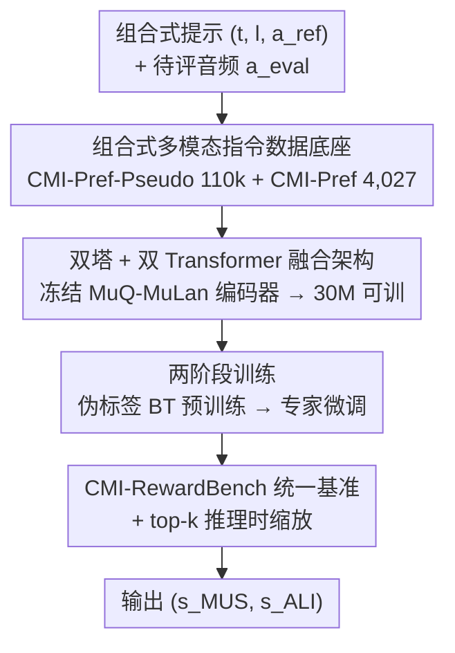

# CMI-RewardBench: Evaluating Music Reward Models with Compositional Multimodal Instruction

**会议**: ICML2026  
**arXiv**: [2603.00610](https://arxiv.org/abs/2603.00610)  
**代码**: 有（GitHub，论文称 Code is available；模型权重 CMI-RM、数据集 CMI-Pref / CMI-Pref-Pseudo 均开源）  
**领域**: 音频语音 / 音乐生成评估 / 奖励模型  
**关键词**: 音乐奖励模型, 组合式多模态指令, 偏好数据集, 推理时缩放, RLHF

## 一句话总结
针对现代音乐生成模型已能同时吃「文本 + 歌词 + 参考音频」却没有统一评估手段的窘境，本文造了一套生态——110k 伪标注的 CMI-Pref-Pseudo、4,027 条人工标注的 CMI-Pref、统一基准 CMI-RewardBench，以及一个仅约 30M 参数、能在单一架构里处理所有模态组合的奖励模型族 CMI-RM，并证明它和人类判断高度相关、还能通过 top-k 过滤实现音乐生成的「推理时缩放」。

## 研究背景与动机
**领域现状**：AIGC 音乐生成（Suno、Stable Audio、YUE、ACE-Step 等）已经进化到可以灵活接收多模态条件——纯文本、文本+歌词、文本+参考音频，甚至三者叠加做风格迁移/续写。但评估这些输出的能力严重滞后。

**现有痛点**：现有评估手段是碎片化、窄专用的。分布级指标（FAD、MAD、KAD）只在语料层面比对，给不了后训练/过滤需要的样本级信号；样本级 MOS 预测器（PAM、Audiobox、SongEval）只评「音乐性」单一维度；对齐指标（CLAP、CLaMP3、MuQ-MuLan）几乎只覆盖 text-to-audio，忽略歌词和音频提示；闭源系统（MusicRL、DRAGON）又无法复现。

**核心矛盾**：模型能力（灵活组合输入）和评估方法（刚性输入假设、单维度打分）之间的鸿沟越来越大。更根本的是数据稀缺——推荐系统的大规模交互数据捕捉的是「用户-曲目亲和度」（全局风格偏好），而不是「生成对齐度」（针对复杂多模态指令的逐样本细粒度比较排序），后者才是训练对齐模型所需。

**本文目标**：定义并衡量「组合式对齐」（compositional alignment）——不只是同时满足多个约束，而是一个统一模型能在**可选且变化**的输入条件下，自适应地与人类偏好保持一致，无论输入是纯文本、歌词引导还是音频参考，打分/排序都要稳定反映人类对音乐质量和指令遵循度的判断。

**切入角度**：与其继续做窄专用打分器，不如先把缺失的数据底座和统一基准补齐，再在此之上训一个参数高效、单一架构吃所有模态组合的奖励模型。作者发现即便是 Gemini-2.5-Pro 这样的前沿多模态 LLM，在该基准上也难以超过 80% 的人类一致率，说明这是一个真实且未解的能力缺口。

**核心 idea**：用「组合式多模态指令（CMI）」统一刻画音乐评估场景，配套构建偏好数据 + 统一基准 + 双塔参数高效奖励模型，让一个 ~30M 的模型同时充当音乐性和对齐度的人类代理。

## 方法详解

### 整体框架
CMI-RM 要解决的是：给定一个组合式提示 $\mathcal{P}=(t,l,a_{\text{ref}})$（可选文本描述 $t$、可选歌词 $l$、可选参考音频 $a_{\text{ref}}$）和一段待评音频 $a_{\text{eval}}$，输出两个标量分数——音乐性 $s_{\text{MUS}}$ 和对齐度 $s_{\text{ALI}}$，使其尽量贴合人类判断。整体可分三层：先用统一构造的偏好数据底座（伪标注大规模 + 人工高质量小规模）喂模型；模型本体是一个双塔 + 双 Transformer 融合的参数高效架构；训练分两阶段（伪标签 BT 预训练 → 专家微调）。最后这个奖励模型既在 CMI-RewardBench 上接受统一评测，又能在推理时给生成做 top-k 过滤。

### 关键设计

**1. 组合式多模态指令的数据底座：CMI-Pref-Pseudo + CMI-Pref**

训练对齐模型最缺的不是模型而是数据——既要规模又要质量，还要真正覆盖「文本 / 歌词 / 音频」三种条件的组合。作者用两套数据互补来解决：**CMI-Pref-Pseudo** 从 12 个开源模型 + 11 个商业 API（Suno v3.5–v5、Stable Audio、Minimax、Mureka、MusicGen、YUE、ACE-Step 等）蒸馏出多样化生成，其中 35.6% 的样本带音频提示做风格迁移/续写；用 Qwen3-Omni 做 LLM-judge 打两维偏好（音乐性 + 对齐度），初始 130k 经一致性过滤后保留 110k 对（跨 47,546 段生成、约 797 小时）。**CMI-Pref** 则是 31 位标注专家产出的 4,027 条高质量对，每对在两个维度各给偏好，外加 1–5 的置信分和决策理由；其中划出 1:1:1:1 平衡的 500 对测试集（text / text+lyrics / text+audio / text+audio+lyrics 四种条件），三位标注者复标的一致率为音乐性 75.2%、对齐 75.0%。这套数据在规模、时长和模态多样性上明显超过 PAM、MusicEval、AIME、MusicPref、Music Arena 等既有资源——尤其它是唯一同时带「歌词条件」和「音频到音频条件」的偏好数据。

**2. 双塔 + 双 Transformer 融合的参数高效架构（~30M）**

要让单一模型适配「任意模态可有可无」的输入，关键是把提示侧和待评音频侧解耦、再可控地交互。CMI-RM 采用两塔结构：所有编码器都**冻结**且来自 MuQ-MuLan（文本描述 $t$ 和歌词 $l$ 各自过文本编码器，参考音频 $a_{\text{ref}}$ 和待评音频 $a_{\text{eval}}$ 过音频编码器），缺失的模态直接当零张量处理，从而天然支持任意模态组合。提示侧用一个 4 层 **Prompt Transformer** 把三种提示嵌入拼接融合：$\mathbf{h}_{\text{prompt}}=\text{PromptTF}([\mathbf{E}_{t};\mathbf{E}_{l};\mathbf{E}_{a_{\text{ref}}}])$。再把融合后的提示和待评音频嵌入拼起来，过一个单层自注意力 **Joint Transformer** 建模提示↔生成音乐的交互：$\mathbf{h}_{\text{eval}}=\text{JointTF}([\mathbf{h}_{\text{prompt}};\mathbf{E}_{a_{\text{eval}}}])$。最后取待评音频对应的隐状态做时间池化、过轻量 MLP 同时吐两个分数：$(s_{\text{ALI}},s_{\text{MUS}})=\text{MLP}(\text{Pool}(\mathbf{h}_{\text{eval}}))$。因为编码器全冻结，可训练部分只剩两个 Transformer 和 MLP，总量约 30M，这也是它能匹敌甚至超过 SongEval 这类专用模型却轻得多的原因。

**3. 两阶段训练：伪标签 BT 预训练 → 专家微调**

数据底座是「大规模但带噪（伪标）」+「小规模但高质量（人工）」，直接混训会被噪声拖累，所以分两阶段。**Stage 1 偏好预训练**在 CMI-Pref-Pseudo 上跑 2k 步、batch 48，用 Bradley–Terry 建模成对偏好：$P(A>B)=\sigma\big(s_\theta(\mathcal{P},A)-s_\theta(\mathcal{P},B)\big)$，交叉熵优化、剔除平局对；为缓解伪标签带来的过度自信决策边界，加 0.2 的标签平滑。**Stage 2 专家微调**在 CMI-Pref 训练集 + MusicEval 训练集（共 6,647 样本）上做，batch 48，按验证早停（约 250 步选 checkpoint）。人工标注有两种格式：成对偏好仍用 BT 损失；标量评分 $(\mathcal{P},A,y),\,y\in[1,5]$ 则用回归损失。MUS 和 ALI 两个头在两阶段都联合优化，总损失取二者均值 $\mathcal{L}_{\text{total}}=\tfrac{1}{2}(\mathcal{L}_{\text{MUS}}+\mathcal{L}_{\text{ALI}})$。

**4. CMI-RewardBench 统一基准 + top-k 推理时缩放**

碎片化基准没法横向比较「一个模型能否在所有模态设置下都当好人类代理」，所以作者把异构资源整合成统一基准，全部用 held-out 数据：PAM 提供 500 条音乐性与文本-音乐对齐的标量评分；MusicEval 测试集提供 413 条标量音乐性评分；Music Arena 处理 2,800 条历史交互日志、过滤掉失败生成和平局/双差标签后留下 1,340 条干净成对偏好；CMI-Pref 测试集提供 500 条组合条件下的成对偏好。评测用两套协议适配异构标签：标量评分（PAM、MusicEval）报 LCC / SRCC / Kendall-Tau 相关性，成对偏好（Music Arena、CMI-Pref）报对人类标注的准确率。除了当评测器，作者还展示奖励模型可直接用于 **top-k 过滤**——对同一提示生成多个候选、用 CMI-RM 选高分者，实现音乐生成的「推理时缩放」，带来可测的质量增益。

### 损失函数 / 训练策略
- 成对偏好：Bradley–Terry + 交叉熵，剔除平局，Stage 1 标签平滑 0.2。
- 标量评分：对 $y\in[1,5]$ 做回归。
- 总目标：$\mathcal{L}_{\text{total}}=\frac{1}{2}(\mathcal{L}_{\text{MUS}}+\mathcal{L}_{\text{ALI}})$，两头联合优化。
- 关键超参：两阶段 batch 均为 48；Stage 1 2k 步，Stage 2 约 250 步早停。

## 实验关键数据

### 主实验
基准整合的各数据源与评测协议如下（均为 held-out）：

| 数据源 | 标签类型 | 测试规模 | 评测协议 |
|--------|---------|---------|---------|
| PAM | 标量（音乐性 + 文本-音乐对齐） | 500 | LCC / SRCC / K-Tau |
| MusicEval（测试集） | 标量（音乐性 MOS） | 413 | LCC / SRCC / K-Tau |
| Music Arena | 成对偏好（音乐性） | 1,340（过滤后） | 准确率 |
| CMI-Pref（测试集） | 成对偏好（音乐性 + 对齐） | 500（四模态 1:1:1:1） | 准确率 |

数据集与既有资源的对比（节选 Table 1，样本数对偏好数据指「对」、对 MOS 数据指音频片段）：

| 数据集 | 文本 | 歌词 | 音频条件 | 样本数 | 模型/API 数 |
|--------|------|------|---------|--------|------------|
| PAM | ✔ | ✗ | ✗ | 500 | 5 |
| MusicEval | — | ✗ | ✗ | 2,748 | 31 |
| AIME | ✔ | ✗ | ✗ | 15,600 | 12 |
| Music Arena | ✔ | ✔ | ✗ | 2,800 | 17 |
| **CMI-Pref-Pseudo** | ✔ | ✔ | ✔ | 110k | 23 |
| **CMI-Pref** | ✔ | ✔ | ✔ | 4,027 | 23 |

> 注：基准上各模型的逐任务准确率/相关性详表在缓存正文之后（⚠️ 完整 SOTA 对比数值以原文表格为准）；正文明确的关键结论是——即便 Gemini-2.5-Pro 这类前沿多模态 LLM 也难以超过 **80%** 的人类一致率，暴露出显著能力缺口。

### 消融 / 关键设置

| 设置 | 作用 | 说明 |
|------|------|------|
| 仅 Stage 1（伪标 BT 预训练） | 打底大规模偏好 | 2k 步 / batch 48 / 标签平滑 0.2，缓解伪标过自信 |
| + Stage 2（专家微调） | 高质量校准 | 6,647 样本 / 约 250 步早停，对齐人类细粒度偏好 |
| 冻结 MuQ-MuLan 编码器 | 参数高效 | 可训仅 ~30M，匹敌/超过 SongEval 等专用模型 |
| top-k 过滤 | 推理时缩放 | 用 CMI-RM 选高分候选，提升生成质量 |

### 关键发现
- 即使前沿 MLLM（Gemini-2.5-Pro）在该基准上一致率也难破 80%，说明组合式多模态音乐评估远未解决。
- ~30M 的 CMI-RM 用单一架构覆盖 CMI-RewardBench 全部设置，性能可比甚至优于 SongEval 这类专用开源 baseline，验证「参数高效 + 统一架构」的可行性。
- CMI-RM 不仅与人类判断强相关，还能当过滤器做 top-k 推理时缩放，给音乐生成带来可测增益——奖励模型从「评测器」变成「生成放大器」。

## 亮点与洞察
- **把「评估滞后」问题数据化**：作者没有止步于又造一个打分器，而是补齐了「伪标大规模 + 人工高质量 + 统一基准」整条生态，这种「先修地基再盖楼」的思路对任何评估滞后的生成子领域都可复用。
- **冻结编码器 + 双 Transformer 融合**：用 MuQ-MuLan 冻结编码器 + 缺失模态置零的设计，优雅地让一个模型吃任意模态组合，可训练量压到 ~30M——这个「轻量适配多模态」的范式可迁移到视频/图像的组合式奖励建模。
- **奖励模型即推理时放大器**：top-k 过滤把奖励模型用于生成侧，提示了一条不动生成模型权重就能提质的低成本路径。

## 局限与展望
- 伪标签由 Qwen3-Omni 生成，存在 LLM-judge 固有偏差；虽用一致性过滤 + 标签平滑缓解，但上限受 judge 能力约束。
- CMI-Pref 测试集仅 500 对、人类复标一致率约 75%，说明组合式偏好本身主观噪声不小，基准天花板受此影响。
- AIME、MusicPref、SongEval 因缺少与协议对齐的官方划分而未纳入主基准，未来可作为额外训练/测试资源扩展覆盖。
- 论文未在缓存正文给全各 baseline 的逐任务数值，复现需对照原文完整表格。

## 相关工作与启发
- **vs PAM / Audiobox / SongEval（MOS 预测器）**：它们只评音乐性单维、刚性输入；CMI-RM 同时输出音乐性与对齐度、支持任意模态组合，且参数更轻。
- **vs CLAP / CLaMP3 / MuQ-MuLan（对齐指标）**：这些几乎只覆盖 text-to-audio；本文新增歌词与音频到音频条件，并把对齐做成可训练的人类代理而非固定对比分。
- **vs Music Arena / AIME / MusicPref（偏好平台/数据）**：它们主要是 text-to-music；CMI-Pref 是首个同时带歌词与音频条件的大规模组合式偏好数据，并配套统一基准。
- **vs LLM-as-a-judge（AutoMV 等）**：依赖专有模型且无开源框架；本文证明前沿 MLLM 一致率难破 80%，并给出开源、参数高效的替代方案。

## 评分
- 新颖性: ⭐⭐⭐⭐⭐ 首次把「组合式多模态指令」统一刻画音乐评估，并补齐数据+基准+模型整条生态。
- 实验充分度: ⭐⭐⭐⭐ 跨 PAM/MusicEval/Music Arena/CMI-Pref 四源多协议评测，覆盖广；惟正文未列全逐任务数值。
- 写作质量: ⭐⭐⭐⭐ 动机与架构清晰，公式规范；部分结果需查附录表格。
- 价值: ⭐⭐⭐⭐⭐ 开源数据/权重/基准，且奖励模型可直接做推理时缩放，对音乐 AIGC 后训练实用价值高。

<!-- RELATED:START -->

## 相关论文

- [\[ACL 2026\] S2S-Arena: Evaluating Paralinguistic Instruction Following in Speech-to-Speech Models](../../ACL2026/audio_speech/s2s-arena_evaluating_paralinguistic_instruction_following_in_speech-to-speech_mo.md)
- [\[ICML 2026\] Towards Understanding Modality Interaction in Multimodal Language Models via Partial Information Decomposition](towards_understanding_modality_interaction_in_multimodal_language_models_via_par.md)
- [\[ICLR 2026\] EchoMind: An Interrelated Multi-level Benchmark for Evaluating Empathetic Speech Language Models](../../ICLR2026/audio_speech/echomind_an_interrelated_multi-level_benchmark_for_evaluating_empathetic_speech_.md)
- [\[ICML 2026\] MultiBreak: A Scalable and Diverse Multi-turn Jailbreak Benchmark for Evaluating LLM Safety](multibreak_a_scalable_and_diverse_multi-turn_jailbreak_benchmark_for_evaluating_.md)
- [\[ACL 2026\] Music Audio-Visual Question Answering Requires Specialized Multimodal Designs](../../ACL2026/audio_speech/music_audio-visual_question_answering_requires_specialized_multimodal_designs.md)

<!-- RELATED:END -->
