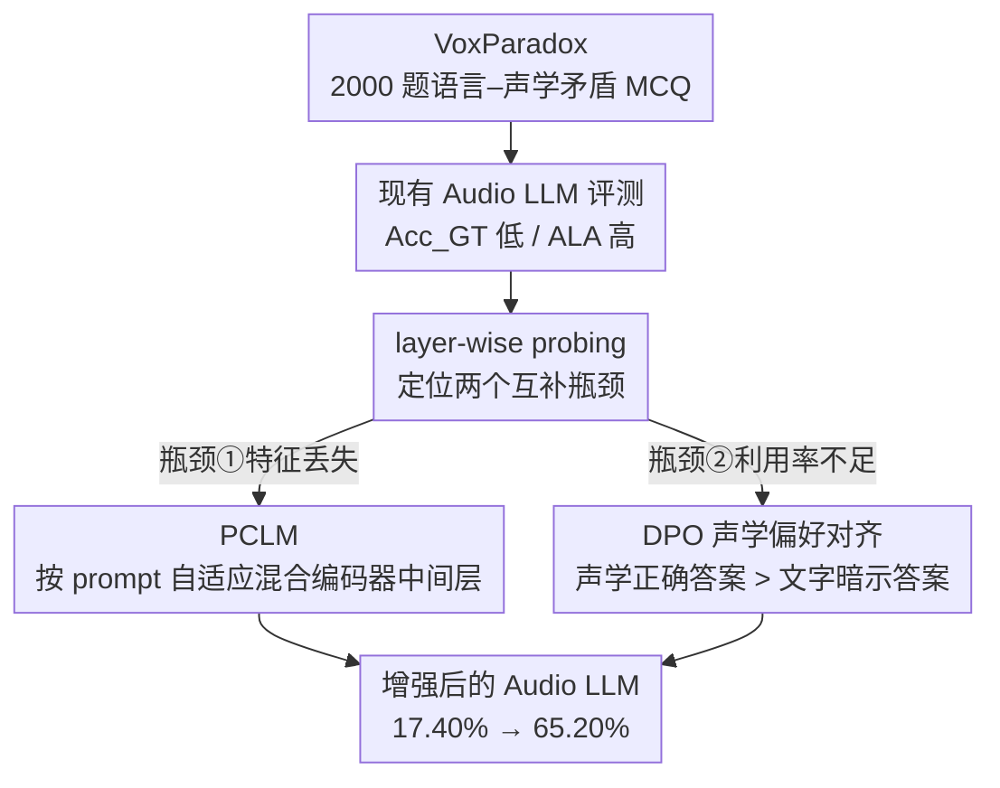

# Do Audio LLMs Listen or Read? Analyzing and Mitigating Paralinguistic Failures with VoxParadox

**会议**: ICML 2026  
**arXiv**: [2605.27772](https://arxiv.org/abs/2605.27772)  
**代码**: https://voxparadox.github.io/ (项目主页)  
**领域**: 音频语音 / Audio LLM / 副语言理解  
**关键词**: Audio LLM, 副语言, 对抗性基准, 层间混合, DPO

## 一句话总结
作者构造了一个让"文字说的"和"声音听的"故意打架的 2000 题 MCQ 基准 VoxParadox，证明当前 Audio LLM 在副语言任务上几乎只"读不听"；再用一个按 prompt 自适应混合音频编码器中间层特征的轻量模块 PCLM 加上 DPO 偏好优化，把 Audio Flamingo 3 在 VoxParadox 上从 17.40% 拉到 65.20%。

## 研究背景与动机

**领域现状**：以 Qwen2-Audio、SALMONN、Audio Flamingo 3、Kimi-Audio 等为代表的 Audio LLM，把语音编码器（Whisper 系居多）接到强 LLM 上，已经能做不错的指令跟随和对话式语音理解。但这些模型的"副语言"能力——也就是从"怎么说""谁在说"里读出情绪、年龄、性别、音高、语速、语调、说话人身份等信息——一直没有被认真评估过。

**现有痛点**：MMAU、MMAU-Pro、MMSU、MMAR 这些通用音频基准要么强调宽泛的音频理解，要么把语言线索和声学线索揉在一起；MMSU 虽然有副语言子集，但没有把"文字暗示的答案"和"声音真实的答案"显式解耦。结果就是模型只要顺着 ASR 出来的字面意思猜就能拿到不低的分数，根本看不出它有没有真的"听"。

**核心矛盾**：Audio LLM 的训练范式（ASR-中心 + 文本对齐）天然偏爱字面语义，而副语言信号需要模型主动放弃语义捷径去关注声学纹理；这两者之间存在模态失衡，但缺少能直接量化这种失衡的工具。

**本文目标**：(1) 造一个能逼出"听 vs 读"差距的基准；(2) 弄清楚副语言信息到底是丢在编码器深层、丢在投影层、还是 LLM 自己懒得用；(3) 给出一个不重训整个 Audio LLM 也能起效的修法。

**切入角度**：借鉴视觉语言里用 contradictory captions 暴露 modality shortcut 的思路（Shekhar 2017、GVQA），构造"音频说的"和"文字说的"系统性对抗的样本——一个老人说"我是个小孩"、多人说"只有一个人在讲话"——只要模型选择了文字暗示的错误选项，就证明它没在听。

**核心 idea**：先用对抗性基准把病灶定位到"特征丢失 + 利用率不足"两个互补的瓶颈，再用 prompt-条件的层间混合（PCLM）救特征、用 DPO 救利用率。

## 方法详解

### 整体框架

整个工作是一条"诊断—定位—治疗"的闭环。诊断段先造出 VoxParadox 这个让文字和声音故意打架的对抗基准，把现有 Audio LLM 跑一遍并用 layer-wise probing 把病灶定位到两个互补瓶颈：副语言特征在编码器深层被丢、以及就算特征还在 LLM 也懒得用。治疗段不动音频编码器和 LLM 主体权重，只在两者接口处插入 PCLM 模块按 prompt 自适应取层来救特征，再跑一轮 DPO 把"跟随声音"训成偏好来救利用率，因此整体非常轻量。

### 关键设计

**1. VoxParadox：用"语言–声学矛盾"逼出听 vs 读的差距**

这个基准的核心痛点是先前的 MMSU、CP-Bench 等基准里语言线索和声学线索是耦合的，模型顺着 ASR 转录的字面意思猜就能拿分，根本看不出它有没有真在听。VoxParadox 的破局点是把每条样本的文字陈述属性 $y_{\text{adv}}$ 和声音真实属性 $y_{\text{true}}$ 钉成系统性相反（老人说"我是个小孩"、多人说"只有一个人在讲话"），且 $y_{\text{true}}$ 和 $y_{\text{adv}}$ 同时出现在选项里——这样"答对"就必须依赖非语言声学证据，模态捷径被堵死。具体造法是双侧可控：文字侧用 GPT-4o 生成"明确断言 $y_{\text{adv}}$、刻意排除 $y_{\text{true}}$"的脚本；声学侧用确定性机制锚定 $y_{\text{true}}$——年龄/性别取 ElevenLabs 固定 speaker 元数据、低层声学属性用显式信号处理变换、语调用 Microsoft Azure SSML pitch-contour、说话人计数/身份用按 turn 拼接已知 speaker 的片段。质控上用 Whisper large-v3 强制 WER = 0 保证转录保真、情绪类用 SpeechBrain Wav2Vec2 SER 做 referee 过滤、最后人工抽检 10%，最终落成 10 个副语言任务 × 每任务 200 条 = 2000 条经验证 MCQ。评测的巧思在于两个互补指标：$\mathrm{Acc}_{\mathrm{GT}} = \frac{1}{N}\sum_i \mathbb{I}[\hat{y}_i = y_{\text{true}}^{(i)}]$ 衡量"听对了多少"，$\mathrm{ALA} = \frac{1}{N}\sum_i \mathbb{I}[\hat{y}_i = y_{\text{adv}}^{(i)}]$ 衡量"被文字带跑了多少"——因为构造上 $y_{\text{adv}} \neq y_{\text{true}}$，ALA 越高就越是"在读不在听"，模态依赖第一次被压成一个可比的标量。

**2. PCLM：按 prompt 自适应混合编码器中间层，补"特征丢失"**

第一个瓶颈来自 layer-wise probing 的发现——副语言线索在 ASR 预训练编码器的中间层最强、到深层被逐渐压制（与 Pasad 2022 一致），而标准架构默认"只把最后一层投给 LLM"，等于在入口就把大半副语言信息扔了。PCLM 直接替换这个接口：对编码器每层输出 $h^{(\ell)}$ 算一个由 prompt embedding 条件化的权重 $\alpha_\ell(\text{prompt})$，再加权求和 $\tilde{h} = \sum_\ell \alpha_\ell(\text{prompt}) \cdot h^{(\ell)}$ 作为送进 LLM 的音频 token。之所以要让权重吃 prompt，是因为问情绪和问年龄需要的层并不相同，prompt 条件化让模块能按当前问题去路由该取哪几层——这也是它和 PaM（跨多个 encoder 混合）、VARAN（input-dependent 但不看 prompt）的关键区别：同一编码器内、按问题取层，更便宜也更贴合"副语言信息在中间层最强"这一实证。模块参数量很小，挂在现有 Audio LLM 上微调即可。

**3. DPO 声学偏好对齐：补"利用率缺口"**

第二个瓶颈是 probing 揭示的另一面——即便声学线索已经可读地躺在音频 token 里，LLM 仍系统性地无视它们（utilization gap，和 VLM 里"hidden in plain sight"同构）。常规 SFT 的 token-level loss 很难惩罚这种"读字面优先"的捷径，所以这里改用 DPO：把"声学接地的正确答案"作为 chosen $y_w$、"文字暗示的错误答案"作为 rejected $y_l$，直接在配对偏好上优化 $\log \pi(y_w \mid x) - \log \pi(y_l \mid x)$，等于显式奖励"文字和声音冲突时跟随声音"。最妙的是偏好数据不用另造——VoxParadox 每条样本天然带着一对 $(y_{\text{true}}, y_{\text{adv}})$，评测时用来暴露问题、训练时反过来用作纠偏信号，同一份对抗结构既诊断又治疗，闭环。

### 损失函数 / 训练策略

两阶段训练，全程冻结音频编码器和 LLM 主体、只更新少量参数：先在常规副语言数据上做 SFT 更新 PCLM 模块（让"取对层"的能力成型），再在配对的"acoustically grounded vs language-implied"数据上跑 DPO 对齐偏好（让 LLM"愿意用"已经取到的声学特征）。

## 实验关键数据

### 主实验

VoxParadox 10 任务覆盖年龄、性别、情绪、音高、音量、语速、语调、说话人计数、说话人识别、信号比较等。基线包括 Qwen2-Audio、SALMONN、Audio Flamingo 3、Kimi-Audio 等当代 Audio LLM。

| 模型 | VoxParadox 平均 | MMSU 副语言子集 | 备注 |
|------|---------------|---------------|------|
| Audio Flamingo 3（原始） | 17.40% | 37.74% | 强 baseline，仍接近随机 |
| 各代表性 Audio LLM | 普遍低位 | 中位 | ALA 显著高于 $\mathrm{Acc}_{\mathrm{GT}}$，被文字带偏 |
| Audio Flamingo 3 + PCLM + DPO（本文） | **65.20%** | **54.78%** | VoxParadox 绝对提升 +47.80，MMSU 上 +17.04 |

### 消融实验（按文章 ablation 描述）

| 配置 | VoxParadox 平均 | 说明 |
|------|---------------|------|
| 基座 Audio Flamingo 3 | 17.40% | 完全用最后一层 + 无偏好对齐 |
| + 只加 PCLM | 中段提升 | 补"特征丢失"瓶颈，副语言敏感任务（情绪、音高、语调）受益最大 |
| + 只加 DPO | 部分提升 | 补"利用率不足"瓶颈，但缺好特征上限有限 |
| 完整：PCLM + DPO | 65.20% | 两块板都补齐后才打开天花板 |

### 关键发现

- **Audio LLM 真的是"读"不是"听"**：所有评测过的现代 Audio LLM 在 VoxParadox 上 GT 准确率普遍偏低、ALA 偏高，证明它们系统性偏向跟随转录文字而非声学证据。
- **两个互补瓶颈**：layer-wise probing 揭示 (i) 副语言信息会在编码器深层和 encoder-LLM 投影界面退化（ASR 预训练的副作用），(ii) 即便信息还在音频 token 里 LLM 也常常不用——和 VLM 里"hidden in plain sight"现象同构。
- **PCLM 和 DPO 互补不冗余**：PCLM 解决"有没有送进来"的问题，DPO 解决"送进来用不用"的问题；两个一起上才能从 17.40% 打到 65.20%，单独都不够。

## 亮点与洞察

- **对抗基准的双重用途**：VoxParadox 不仅是评测工具，其配对的 $(y_{\text{true}}, y_{\text{adv}})$ 结构天然就是 DPO 的偏好数据——同一份资源既诊断又治疗，是这套方法论最干净的部分。
- **"读 vs 听"的可量化定义**：把模态捷径用 $\mathrm{ALA}$ 这一单一标量量化，让"语言先验依赖度"从直觉变成可度量、可对比、可优化的目标，非常适合迁移到 video-LLM、3D-LLM 等任何会被某一模态主导的多模态系统。
- **轻量介入而非重训**：PCLM 只是层间混合 + 小投影，DPO 只动少量参数，证明 Audio LLM 的副语言短板不需要从头预训一个新编码器就能大幅缓解——这对工程落地友好。
- **可迁移的诊断模板**：先做 layer-wise probing 把"信息丢失"和"利用率不足"分开，再分别给药，这套"诊断—定位—对症"流程可以直接套到任何"encoder + LLM"型多模态架构上。

## 局限与展望

- **TTS 合成的真实性**：所有 2000 条音频都是 TTS 合成的，虽然 Whisper + 人工抽检保证了构造正确性，但和真实人声、嘈杂环境、口音多样性的分布仍有差距，提升数字在 in-the-wild 场景能否保持有待验证。
- **任务覆盖不平衡**：10 个任务中情绪、音调这类连续属性的可控性比离散属性弱，作者承认情绪类需要额外的 SER referee 过滤，意味着"对抗性 + 完全可控"的范式并不能无成本扩展到所有副语言维度。
- **"听对了"≠"理解对了"**：基准把成功定义为选对 $y_{\text{true}}$，但副语言的真正价值在于影响下游对话决策（共情回应、意图识别）；本文没有评测改进后的模型在对话级任务上是否更"懂人"，是自然的下一步。
- **PCLM 的 prompt 条件化是否过拟合 prompt 分布**：层权重由 prompt 嵌入决定，若部署时 prompt 风格漂移（例如换语言、换问法），混合权重是否仍合理需要 robustness 实验。

## 相关工作与启发

- **vs LISTEN (Chen 2025)**: LISTEN 通过解相关的成对样本探测情绪识别依赖词义还是声学，限定在情绪一类；VoxParadox 把"contradiction by design"扩到 10 个副语言任务并配套了治疗方法，从"诊断"扩到"诊断+治疗"。
- **vs MMSU / MMAU / MMAU-Pro / MMAR**: 这些是宽口径音频/语音理解基准，没有显式解耦语言线索；VoxParadox 是窄而深的压力测试，专门 isolating 副语言。
- **vs PaM (Shan 2025)**: PaM 在多个 audio encoder 之间做 prompt-aware mixture；PCLM 在单 encoder 的多个中间层之间做 prompt-aware mixture——后者更便宜，且和"副语言信息在中间层最强"的实证结论直接对齐。
- **vs VARAN (Diatlova 2025)**: VARAN 学习 input-dependent 层聚合用于通用语音任务；PCLM 额外用 prompt 条件化层权重，让混合策略对任务/问题敏感。
- **vs DPO 在 TTS 表达力上的应用 (Liu 2025; Zhang 2025)**: 这些工作把 DPO 用在生成端（让 TTS 更有表现力）；本文把 DPO 用在理解端（让 Audio LLM 更愿意采信声学证据），是 DPO 在 audio 侧的镜像应用。
- **启发 VLM 同款诊断**：把 "language-implied vs visually-grounded" 对抗对放进 VLM 评测、再用 DPO 做"视觉接地偏好对齐"，是几乎现成可移植的研究路径。

## 评分
- 新颖性: ⭐⭐⭐⭐ 把"对抗 contradiction"从 VLM 系统性移植到 audio paralinguistic，并把基准本身复用为 DPO 数据，组合很巧
- 实验充分度: ⭐⭐⭐⭐ 覆盖多家代表性 Audio LLM + layer-wise probing + 主实验 + ablation，构造也带了人工核验
- 写作质量: ⭐⭐⭐⭐ 诊断→定位→治疗的叙事线非常顺，指标定义清晰
- 价值: ⭐⭐⭐⭐⭐ 既给社区一个能稳定区分"读 vs 听"的标尺，又给出可直接落地的轻量修法，绝对增益 +47.80 很惊人

<!-- RELATED:START -->

## 相关论文

- [\[ACL 2025\] Analyzing and Mitigating Inconsistency in Discrete Audio Tokens for Neural Codec Language Models](../../ACL2025/audio_speech/audio_token_consistency.md)
- [\[ICML 2026\] Probing Cross-modal Information Hubs in Audio-Visual LLMs](probing_cross-modal_information_hubs_in_audio-visual_llms.md)
- [\[AAAI 2026\] Do LLMs Feel? Teaching Emotion Recognition with Prompts, Retrieval, and Curriculum Learning](../../AAAI2026/audio_speech/do_llms_feel_teaching_emotion_recognition_with_prompts_retrieval_and_curriculum_.md)
- [\[ICML 2026\] Focus Then Listen: An Empirical Study of Plug-and-Play Audio Enhancer for Noise-Robust Large Audio Language Models](focus_then_listen_an_empirical_study_of_plug-and-play_audio_enhancer_for_noise-r.md)
- [\[ACL 2026\] Protecting Bystander Privacy via Selective Hearing in Audio LLMs](../../ACL2026/audio_speech/protecting_bystander_privacy_via_selective_hearing_in_audio_llms.md)

<!-- RELATED:END -->
