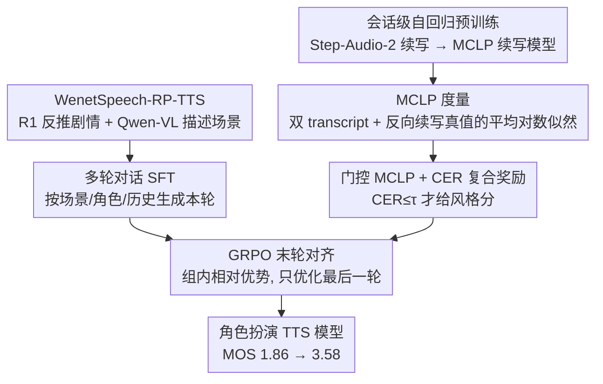

# Evaluating and Rewarding LALMs for Expressive Role-Play TTS via Mean Continuation Log-Probability

**会议**: ICML 2026  
**arXiv**: [2601.22661](https://arxiv.org/abs/2601.22661)  
**代码**: https://github.com/y-ren16/MCLP  
**领域**: 音频/语音  
**关键词**: Role-Play TTS, LALM, Mean Continuation Log-Probability, GRPO, 风格一致性  

## 一句话总结
本文把"预训练大音频语言模型对真值语音 token 的续写概率"包装成一个名为 MCLP 的客观风格一致性度量，再用 MCLP+CER 的门控混合奖励，通过 GRPO 在新构建的 WenetSpeech-RP-TTS 数据集上把角色扮演 TTS 的主观 MOS 从 1.86 推到 3.58。

## 研究背景与动机

**领域现状**：LLM 风格的 TTS（CosyVoice、VALL-E、Step-Audio 等）已经能做到很强的零样本音色克隆，最近的 Instruct-TTS 又允许用自然语言描述去控制风格；而 Speech Role-Playing Agent 类工作（OmniCharacter、SpeechRole、VoxRole 等）更进一步，希望模型在多轮对话里扮演特定人物。

**现有痛点**：在"角色扮演 TTS（RP-TTS）"这种**只控风格、不控音色**的场景下，现有方法两头不靠岸——Instruct-TTS 只能处理单句，把风格当作 utterance 级别的静态属性，无法跨多轮维持人设；Role-Playing Agent 把重心放在语义对齐而非声学风格，往往为了语义连贯牺牲表现力；想用 RL 拉齐风格又卡在**没有客观风格度量**这一根本瓶颈，只能退化到用情感分类器当代理奖励，结果只覆盖了情绪这一个维度。

**核心矛盾**：风格本身是连续、语境依赖、混杂韵律 / 情绪 / 副语言信息的"高维概念"，但现有评估和奖励都试图用离散标签（情绪类别、说话人 ID）去逼近它，必然丢信息；同时单一奖励（只看 CER 或只看相似度）极易触发 reward hacking——要么发出表现力极强但听不懂的"鬼话"，要么生成极清晰但平淡如开水的播报音。

**本文目标**：把这两件事一起解决——(1) 定义一个**可解释、连续、和人耳一致**的风格度量；(2) 把它接进 RL pipeline 的同时保住内容保真度。

**切入角度**：作者押了一个关键假设——在海量语音上预训练的 LALM **隐式学到了一个连续的语音风格隐空间**。给定一段转录文本和一段"候选语音"，如果候选的说话风格和真值一致，预训练 LALM 在用候选语音作上下文时，对真值语音 token 的续写概率就应该更高。这把"风格一致"翻译成了"续写似然"，刚好可以用一个数字量化。

**核心 idea**：把"预训练 LALM 对真值 audio token 的平均对数似然"直接当成风格度量 MCLP，既能离线评估，也能接进 GRPO 当 reward；再用 CER 做门控防止 reward hacking。

## 方法详解

### 整体框架

本文要解决的是"角色扮演 TTS 只控风格不控音色、却没有客观风格度量"的困境，做法是先训一个会续写语音的大音频语言模型（LALM），把它对真值语音 token 的平均对数似然 MCLP 当成风格一致性的标尺，再把这把标尺接进 RL 当奖励。整条 pipeline 分三阶段：先以 Step-Audio-2 为初始化在 300 万小时带转录语音上做会话级自回归预训练得到 MCLP 续写模型（损失只算在 audio token 上，学会"给定文本+前文语音续写当前句"）；再基于 Step-Audio-2-mini-Base 在自建的 WenetSpeech-RP-TTS 上做多轮对话 SFT，让模型按场景描述 $\mathcal{S}$、角色档案 $\mathcal{P}$、历史 $\mathcal{H}_{<j}$ 生成第 $j$ 轮的 interleaved TA4 token 序列；最后用 GRPO 只对每段对话的最后一轮做强化学习，奖励由 MCLP 风格分、CER 内容惩罚和一道清晰度门控聚合而成。

数据闭环全建在 WenetSpeech 上：先按 "YouTube + drama" 标签筛出 17k 视频、实际下载 8556 个，用 Demucs 去伴奏、pyannote 做说话人分离；再用 DeepSeek-R1 反推剧名/集数并基于全脚本生成角色档案 $\mathcal{P}$、用 Qwen-VL-7B 给每段场景生成环境描述 $\mathcal{S}$，按 5 秒静音切场景、30 秒封顶，最终留下 311k 场景 / 1435 小时，平均每场 7.3 句、涉及 2.33 位说话人；测试集做严格的视频级 hold-out，留 200 视频 900 场景，按 2–10 轮分层抽样保证每个轮次各 100 例。

### 关键设计

**1. MCLP 度量：用"双 transcript + 反向续写"把风格一致性变成一个似然标量**

痛点是风格连续、语境依赖、混杂韵律情绪，离散情感标签必然丢信息。作者押的假设是预训练 LALM 隐式学到了连续的语音风格隐空间，于是把上下文构造成 $\mathcal{H}=[\mathbf{w},\mathbf{z}^{eval},\mathbf{w}]$——同一段转录文本 $\mathbf{w}$ 出现两次、中间夹着候选音频 $\mathbf{z}^{eval}$，再让 LALM 在 $\mathcal{H}$ 之后去续写真值音频 $\mathbf{z}^{gt}$，把续写的平均对数似然定义为度量 $\text{MCLP}=\frac{1}{|\mathbf{z}^{gt}_A|}\sum_{k\in \mathbf{z}^{gt}_A}\log P_\theta(z_k^{gt}\mid \mathcal{H},z_{<k}^{gt})$，只在 audio token 子集 $\mathbf{z}^{gt}_A$ 上取平均。

这套设计的每个细节都服务于"让似然变化只反映风格"：重复 $\mathbf{w}$ 是为了在 teacher-forcing 下钉死文本内容，使候选音频导致的似然变化只能来自风格而非文本；用 Step-Audio-2 是因为它的 semantic speech tokenizer 主要保留语义和风格、丢弃音色细节，进一步把度量从"音色相似"偏到"风格相似"；故意反过来"用候选当上下文续写真值"而非正向，是因为真值长度固定，多个候选评估同一参考时分母对齐、可公平比较。最终 MCLP 比情感分类奖励多给出一个连续、密集、可解释的标量，覆盖了情感、韵律、节奏等所有被 LALM 编码进似然的风格维度。

**2. 门控 MCLP + CER 复合奖励：先逼模型"说人话"再追风格，封死 reward hacking**

单一奖励极易被 hack——只奖励风格会刷出听不懂的"鬼话"，只奖励清晰度会退化成平淡播报音。本文把奖励拆成两支并用硬门控聚合：风格分支 $R_{style}=\text{MCLP}(\mathbf{z}^{roll},\mathbf{z}^{gt})+C$ 加偏置 $C=15$ 把 MCLP 平移到正区间；内容分支 $R_{content}=\lambda\cdot\text{CER}(\hat{\mathbf{w}},\mathbf{w})$（$\lambda=10$），其中 $\hat{\mathbf{w}}$ 是把 rollout 用 Step-Audio Token2Wav 解码成波形、再过 ASR 转回的文本。最终奖励只在 $\text{CER}\le\tau=0.2$ 时取 $R(\mathbf{z})=R_{style}-R_{content}$，否则直接置 0。

这道门控本质是一条课程曲线：必须先翻过清晰度门槛才能拿到任何风格分，模型被迫先学会清晰发音再去优化表现力。消融正好印证——只给 MCLP 奖励 CER 会爆到 60%+（模型靠重复声学 pattern 刷分），只给 CER 奖励 MOS 跌到 2.33；唯有门控同时挡住"gibberish"退化路径、又让风格优化在清晰度达标后持续生效。

**3. GRPO 末轮对齐：只优化最后一轮、用组内相对优势稳训练**

为避免误差累积污染上下文，RL 阶段历史轮全部保持真值，只对每段对话的最后一轮 token 做策略优化。对每个 query $\mathbf{q}=(\mathcal{S},\mathcal{P},\mathcal{H})$ 采样 $G=8$ 个 rollout，用组内均值方差归一化得到相对优势 $\hat{A}_i=(R_i-\text{mean})/\text{std}$；目标函数是带 clip 的 importance ratio $\rho_{i,t}$ 乘 $\hat{A}_i$，再叠一项 token 级 KL 约束 $\beta\mathbb{D}_{KL}$（$\beta=0.001$）把策略锚在 SFT 附近、防止被风格奖励诱拐漂离。训练样本从 16,186 个高质量场景（2–6 轮、末句 >10 中文字符、非 Neutral 风格）采样——这三条筛选保证每个批次都是表现力提升空间大的句子，不在情感平淡的样本上浪费 rollout。相比 PPO，GRPO 不需要 critic 网络，在 32 张 H800 上迭代 1000 步更省显存。

### 损失函数 / 训练策略

SFT 用 1 epoch、batch 64、学习率 $1\times 10^{-5}$ 余弦衰减、最大序列 16384、AdamW（$\beta_1=0.9, \beta_2=0.95$, weight decay 0.1, grad clip 1.0），目标是 $\theta^*=\arg\min_\theta\sum -\log P_\theta(\mathbf{y}\mid \mathcal{S},\mathcal{P},\mathcal{H},\mathcal{I})$。RL 用学习率 $1\times 10^{-6}$、global batch 128、$G=8$ rollout、temperature 1.0、max decode 1024。

## 实验关键数据

### 主实验

| 模型 | 设置 | CER↓ | CAM++↑ | Emo2Vec↑ | MCLP↑ | MOS↑ |
|------|------|------|--------|----------|-------|------|
| Ground Truth | — | — | — | — | — | 4.461 |
| GPT-Audio | w/ history | 11.97 | 0.636 | 0.875 | -4.849 | 1.915 |
| MiMo-Audio-7B | w/ history | 10.60 | 0.699 | 0.902 | -4.753 | 2.484 |
| Step-Audio-2-mini | w/ history | 3.28 | 0.629 | 0.864 | -4.829 | 1.856 |
| OV-InstructTTS | w/o history | 7.19 | 0.669 | 0.900 | -4.768 | 2.864 |
| **Ours** | w/ history | **1.13** | **0.724** | **0.917** | **-4.636** | **3.576** |
| **Ours** | w/o history | **1.63** | **0.704** | **0.910** | **-4.687** | **3.576** |

CER 几乎打到 baseline 的 1/10（GPT-Audio w/o history 44.7% → 本文 w/o history 1.63%），MOS 比最强 Instruct-TTS（OV-InstructTTS 2.864）高 0.71 分、比最强 LALM（MiMo 2.484）高 1.09 分。

### 消融实验

| 配置 | CER (w/ hist) | MCLP (w/ hist) | MOS |
|------|---------------|----------------|-----|
| Step-Audio-2-mini（baseline） | 3.28 | -4.829 | 1.856 |
| + SFT only | 3.33 | -4.725 | 3.178 |
| Full（SFT + RL with hybrid reward） | **1.13** | -4.636 | **3.576** |
| w/o CER Reward（只刷 MCLP） | 61.14 | **-4.590** | 1.145 |
| w/o MCLP Reward（只刷 CER） | **0.78** | -4.752 | 2.331 |

### 关键发现
- SFT 单独就能把 MOS 从 1.86 拉到 3.18（+1.32），证明数据集本身有用；RL 阶段再加 0.40，证明 MCLP 奖励确实带来了 SFT 之上的额外风格收益。
- 去掉 CER 奖励是最戏剧化的——MCLP 反而**最高**（-4.59），但 CER 飙到 61%、MOS 跌到 1.15，验证了作者关于"reward hacking 会生成表现力极强的胡话"的预判，门控机制是必要的而非可选。
- 只用 CER 时 CER 跌到 0.78%（比 full model 还低）但 MOS 只有 2.33，说明清晰度极限不等于体验极限；MCLP 提供的是**人耳真正在乎但 CER/ASR 看不到**的那部分质量。
- 人类配对实验显示 $\Delta\text{MCLP}>0.1$ 时 win rate 超过 0.8，说明 MCLP 作为偏好预测器在分辨力够大的情况下高度可靠。

## 亮点与洞察
- **"反向续写 + 双重 transcript"是巧妙的归一化技巧**：直觉上应该是"用 GT 当上下文预测 eval"，但作者反过来"用 eval 当上下文预测 GT"——理由是 GT 长度固定可以做公平归一化，且 teacher-forcing 文本后变化只能来自风格；这种"借 LALM 的语言先验把模糊概念变成似然"的范式可迁移到 image style、video motion 等任何有强生成先验的模态。
- **门控混合奖励是一个通用 RL-for-TTS 模板**：硬门控 + 平移到正区间 + 一个内容惩罚的组合，比简单加权和更难被 hack，可以直接套到 emotion-TTS、accent-TTS 等任何"风格+内容"双目标场景。
- **数据 pipeline 中"用 LLM 反推剧情、用 VLM 描述场景"的自动标注路径**展示了如何用现有大模型给传统 ASR 语料二次提质——一份纯语音语料经过 R1 + Qwen-VL 加工就长出了角色档案和场景描述两层结构化标注。

## 局限与展望
- 主实验只在中文 drama 上做，附录虽给了 English 初步结果但缺多语种系统验证，跨语言 MCLP 是否仍然有效需要进一步证据。
- 评估域局限在影视剧，audiobook（长篇叙事）、game NPC（短促反应）、virtual assistant（中性指令）这些差异更大的域没覆盖，门控阈值 $\tau$ 和奖励系数 $C, \lambda$ 是否需要 per-domain 重调未知。
- 场景与角色描述全部由 LLM/VLM 自动生成，存在标注噪声和偏置（例如 R1 可能臆造剧情或人设），下游 RL 的上限受这层噪声制约；可以考虑加入少量人工校验的 gold-standard 集做 self-distillation。
- MCLP 续写模型本身是一个 7B 量级的 LALM，做奖励时每个 rollout 都要前向一次，RL 计算成本会显著高于一个轻量情感分类器；后续可以蒸馏一个小尺寸 MCLP estimator。

## 相关工作与启发
- **vs CosyVoice3 / Higgs / OV-InstructTTS**：它们都靠 instruction prompt 控制单句风格，无法吃多轮 audio history；本文证明把多轮历史塞进 LALM context + 用 RL 拉齐风格能拿到比单句 Instruct-TTS 高 0.7+ MOS 的提升。
- **vs 情感分类奖励（Wang 2025, Gao 2025b）**：那条路用离散 emotion label 做 reward，本文用连续似然，能覆盖韵律节奏等情感之外的维度，且在 MCLP 这一项上 reward 信号天然密集不会塌陷。
- **vs Speech Role-Playing Agent（SpeechRole, VoxRole, OmniCharacter）**：它们重在端到端语义对齐，本文专注 content-specified 设定下的声学风格对齐，把"说什么"和"怎么说"解耦后，可作为 Agent 的 TTS 后端模块复用。

## 评分
- 新颖性: ⭐⭐⭐⭐ "用预训练 LALM 似然当连续风格度量"是 audio 领域少见但很自然的视角，反向续写 + 双 transcript 的设计有巧思。
- 实验充分度: ⭐⭐⭐⭐ 7 个强 baseline、客观+主观双评、消融能完整解释每个组件、人类配对实验验证度量本身，链条很扎实。
- 写作质量: ⭐⭐⭐⭐ 公式排版清晰、动机推导一气呵成，方法图和奖励门控的描述都很到位。
- 价值: ⭐⭐⭐⭐ MCLP 这个度量+RL pipeline 对 Role-Play TTS 是直接可用的工程方案，配套数据集对社区有持续贡献。

<!-- RELATED:START -->

## 相关论文

- [\[ACL 2026\] Computational Narrative Understanding for Expressive Text-to-Speech](../../ACL2026/audio_speech/computational_narrative_understanding_for_expressive_text-to-speech.md)
- [\[ICML 2026\] MultiBreak: A Scalable and Diverse Multi-turn Jailbreak Benchmark for Evaluating LLM Safety](multibreak_a_scalable_and_diverse_multi-turn_jailbreak_benchmark_for_evaluating_.md)
- [\[ACL 2026\] DRInQ: Evaluating Conversational Implicature with Controlled Context Variation](../../ACL2026/audio_speech/drinq_evaluating_conversational_implicature_with_controlled_context_variation.md)
- [\[ACL 2026\] ReStyle-TTS: Relative and Continuous Style Control for Zero-Shot Speech Synthesis](../../ACL2026/audio_speech/restyle-tts_relative_and_continuous_style_control_for_zero-shot_speech_synthesis.md)
- [\[ICML 2026\] CMI-RewardBench: Evaluating Music Reward Models with Compositional Multimodal Instruction](cmi-rewardbench_evaluating_music_reward_models_with_compositional_multimodal_ins.md)

<!-- RELATED:END -->
