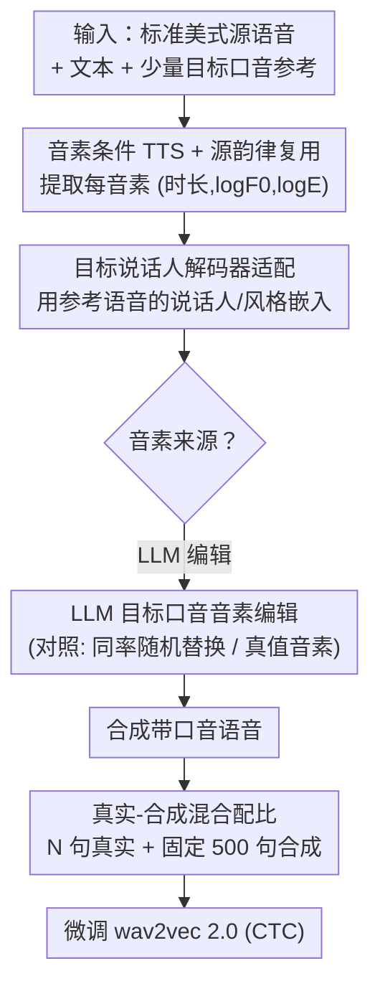

# Few-Shot Synthetic Accented Speech for ASR Fine-Tuning: What Helps and When?

**会议**: ICML2026  
**arXiv**: [2604.27273](https://arxiv.org/abs/2604.27273)  
**代码**: 待确认  
**领域**: 语音识别 / 合成数据 / 数据增强  
**关键词**: 带口音 ASR、合成语音、音素扰动、few-shot TTS、真实-合成混合  

## 一句话总结
用 few-shot TTS 合成带口音语音来微调 ASR，作者拆开"为什么有用"这个问题，发现真正起作用的多半是**音素空间的扰动增强**——随机替换音素就能拿到大部分增益，而 LLM 生成的"目标口音音素编辑"乃至 oracle 真值音素/韵律，相比随机基线只多出很小一截；同时合成数据在真实数据极少时能大幅降低训练方差，但固定配额的合成数据后期会稀释真实数据，真实-合成比例本身才是关键。

## 研究背景与动机
**领域现状**：ASR 在带口音语音上系统性掉点，已有大量 benchmark 和偏差分析记录这一差距。解决思路分两派：模型侧（口音 embedding、对抗目标、元学习去适配识别器）和数据侧（用语音转换或 TTS 合成带口音语音来增广训练集）。

**现有痛点**：两派往往都需要几分钟到几小时的真实带口音录音，而现实里某个口音常常只有零星几句可用。于是 few-shot 合成成了刚需，但 few-shot 口音合成本身很难——口音同时跨越音段发音、韵律、说话人相关声学等多个维度，靠手工规则或多语料库都不够干净。

**核心矛盾**：大家默认"合成带口音语音之所以帮到 ASR，是因为它把目标口音的发音模式喂给了识别器"。但这个因果解释从没被严格拆验过——也许识别器受益的根本不是"像不像目标口音"，而仅仅是"音素序列被扰动了"，相当于在音素空间做了噪声增强。

**本文目标**：把"合成带口音数据为什么有用"拆成两个可证伪的假设并做对照实验：(i) 目标口音音素编辑通过暴露口音特异发音来提升 ASR；(ii) 随机音素扰动通过在音素空间充当噪声增强、提升对发音变化的鲁棒性来提升 ASR。同时回答配额问题：在给定真实数据预算下，合成数据加多少有用、何时稳定训练、何时开始稀释真实样本。

**切入角度**：用 LLM 当"结构化编辑生成器"——它能从通用语音学知识 + 几个示例，为新句子提出目标口音发音改动，不需要为每句话都准备真值口音音标。再用**同编辑率的随机替换**作为扰动对照，用**真值口音音素/韵律**作为 oracle 上界，三者一比就能把"口音结构"和"纯扰动"的贡献分离开。

**核心 idea**：把合成带口音语音的增益做成一道"控制变量"实验——固定 TTS 与适配，只换音素来源（LLM 编辑 / 随机替换 / 真值），看下游 ASR 谁赢、赢多少。

## 方法详解

### 整体框架
整个系统是一条 **few-shot 合成带口音语音 → 微调 ASR** 的流水线：输入是一句标准美式英语源语音 + 它的文本 + 少量目标口音参考语音（默认 $K=10$ 句，约 36 秒），输出是一批"听起来偏目标口音"的合成语音，再拿去微调 wav2vec 2.0。流水线骨架是一个**音素条件的 TTS 声学模型**，关键在于它把每个音素的韵律控制量显式拿出来，于是可以"只改音素符号、保留源语音韵律"，从而把口音注入拆成两个独立阶段：先做**目标说话人解码器适配**把声学渲染拉向目标说话人/口音，再用 **LLM 编辑音素序列**注入目标口音的发音改动。真正的科学价值不在这条管线本身，而在于第二阶段的"音素来源"被设计成可替换的对照变量——这就是关键设计里 LLM 编辑 / 随机替换 / 真值音素三条岔路的来历。

### 关键设计

**1. 音素条件 TTS + 源语音韵律复用：让"只改符号不改韵律"成为可能**

这是整条流水线能做对照实验的物理前提。作者基于 Zaïdi 等人 2022 的音素条件 TTS 声学模型，用 ARPAbet 音素集表示发音；对每个音素 $i$ 关联一组韵律控制量 $(d_i, p_i, e_i)$，分别是以帧计的时长（22.05 kHz、256 样本 hop，约 11.6 ms/帧）、浊音帧上的平均 $\log F_0$、平均 $\log$ 能量。关键点是这些控制量**从源语音里靠文本对齐抽出来、再外部喂给解码器**，而不是模型内部预测。这样做有两层好处：一是复用真实源语音的音素级韵律，能保住自然的韵律多样性、拓宽合成数据分布；二是音素序列和韵律是解耦的，于是"把 W IH1 L 改成 V IH1 L"这种纯符号编辑可以单独进行，韵律按对齐直接拷贝过去。为逼解码器真的去跟随外部控制量，预训练时额外加了针对帧级 pitch/energy 轮廓的重建损失。

**2. 目标说话人解码器适配：在做任何符号编辑之前先把声学拉到目标口音**

只改音素符号还不够像目标口音，因为口音还有大量说话人相关的声学实现细节。于是第一阶段先做适配：用目标口音说话人的参考语音去微调 TTS 解码器，同时用从同一说话人抽的 speaker / style embedding 作为条件。这一步把声学渲染器整体平移到目标说话人和口音上——哪怕同样的"音素 + 韵律"输入，适配后也会被渲染得更接近这位说话人的真实发音方式。适配之后系统只生成这一位适配说话人的嗓音。实验里 Adapt-only（只适配、不做任何符号编辑）就把 AccSim 从 American TTS 的 0.27 提到 0.69（印度英语）、0.32 提到 0.61（韩国英语），说明大部分"听起来像口音"其实来自这一步声学适配，而非后面的音素编辑。

**3. 可替换的音素来源：LLM 编辑 vs 同率随机替换 vs 真值音素（本文的实验灵魂）**

这是把"口音结构 vs 纯扰动"分离开的核心装置。第二阶段对源音素序列做编辑，允许插入、删除、拆分、合并，只在为保持音素-韵律对齐时才动韵律；序列长度不变时韵律直接从源拷贝（例 will = W IH1 L 编辑为印度英语 V IH1 L，长度不变故韵律照搬）。关键是作者把"编辑器"设成可替换：
- **Adapt+LLM**：LLM 从语音学知识 + 少量配对示例为新句子提出目标口音发音改动；
- **Adapt+Random**：把均匀采样位置的音素换成均匀采样的 ARPAbet 音素，**编辑率严格对齐 LLM**（印度 19%、韩国 35%），这样和 LLM 唯一的差别就是"改得有没有语言学道理"；
- **Adapt+GT-phoneme / +prosody**：用 L2-ARCTIC 的感知音素标注（PPL）当真值口音音素（保留对齐的源韵律），再叠加从真实口音音频抽的真值韵律，作为 oracle 上界。

三条岔路喂给同一套 TTS、同一套适配，下游 ASR 谁赢就说明增益来自哪。结论是随机替换在下游 ASR 上逼近 LLM、oracle 真值也只比随机高一点点——即"扰动"贡献了大头。

**4. 真实-合成混合配比：合成数据是降方差工具，但有"稀释拐点"**

回答配额问题。Real+Synth 用 $N$ 句真实语音 + 固定 500 句 LLM 合成语音一起微调。设计动机是：真实数据极少时，最终性能严重依赖"恰好抽到哪几句"真实样本，方差很大；掺入合成数据能把这种采样依赖摊平。但合成池是固定 500 句，当真实样本越攒越多、信息量上来后，这一大坨固定合成数据反而会稀释新增真实样本携带的更强信号——于是存在一个**随口音而异的交叉点**：超过它之后纯真实微调反超混合。作者没有去优化混合权重，但明确指出真实-合成比例本身就是一个需要调的设计变量，而非"合成越多越好"。

### 损失函数 / 训练策略
TTS 预训练在 LJSpeech + ESD 英文子集（均为纯标准美式）上做，并加帧级 pitch/energy 重建辅助损失以强制解码器跟随外部韵律控制；解码器适配在目标说话人参考语音上微调。下游 ASR 统一用 wav2vec 2.0 Base + CTC 微调，微调句数 $N\in[1,500]$；Synthetic-only 用 $N$ 句合成，Real+Synth 用 $N$ 句真实 + 固定 500 句合成，所有结果在每个口音三位说话人的真实语音（各 500 句、共 1500 句）上评测并对 7 次运行取平均。

## 实验关键数据

### 主实验
数据：TTS 骨干在 LJSpeech + ESD 英文上预训练；带口音语音来自 L2-ARCTIC，标准美式源句来自 CMU Arctic 的 CLB 说话人。评测印度英语（TNI/RRBI/SVBI）与韩国英语（HKK/YDCK/YKWK）。声学指标：Whisper-small WER（可懂度代理）、UTMOS（自然度）、SpeechBrain 口音嵌入余弦相似度 AccSim。

合成语音的声学质量（Table 1，三说话人合并）：

| 口音 | 条件 | WER(%)↓ | UTMOS↑ | AccSim↑ |
|------|------|---------|--------|---------|
| 印度英语 | American TTS | 6.4 | 3.78 | 0.27 |
| 印度英语 | Adapt-only | 11.7 | 2.70 | 0.69 |
| 印度英语 | Adapt+LLM | 14.8 | 2.63 | 0.72 |
| 印度英语 | Adapt+Random | 47.2 | 2.31 | 0.68 |
| 印度英语 | Adapt+GT-phon.+pros. | 20.5 | 2.58 | 0.77 |
| 印度英语 | Real accent | 8.6 | 3.89 | 0.86 |
| 韩国英语 | American TTS | 7.3 | 3.72 | 0.32 |
| 韩国英语 | Adapt-only | 11.9 | 2.63 | 0.61 |
| 韩国英语 | Adapt+LLM | 33.8 | 2.51 | 0.61 |
| 韩国英语 | Adapt+Random | 93.4 | 2.12 | 0.58 |
| 韩国英语 | Adapt+GT-phon.+pros. | 21.6 | 2.65 | 0.62 |
| 韩国英语 | Real accent | 14.1 | 3.81 | 0.72 |

声学上看：适配负责把 AccSim 拉起来；随机替换声学最不可信（韩国英语 WER 飙到 93.4%）。但**下游 ASR 讲的是另一个故事**：Adapt+Random 在印度英语上逼近 Adapt+LLM、韩国英语上也只略差，说明 ASR 增益很大一部分来自音素空间的符号扰动，而非忠实的口音渲染。oracle 分析进一步印证——GT-phoneme 在标注的印度子集上和随机基线的差距通常 <1 个 WER 绝对点、$N$ 增大后几乎消失；即便 GT-phoneme+prosody 在最大预算下也只比随机高约 2 个点。

### 消融 / 分析实验

| 配置 / 分析 | 关键结果 | 说明 |
|------|---------|------|
| Adapt+Random vs Adapt+LLM (下游 ASR) | 印度近乎持平、韩国略差 | 大部分增益来自音素扰动增强 |
| GT-phoneme vs Random (oracle) | 差距 <1 WER 点、大 $N$ 几乎归零 | 口音结构在小预算时有用，大预算被扰动追平 |
| GT-phoneme+prosody vs Random | 最大预算约 +2 WER 点 | 加真值韵律也只多一点点 |
| Real+Synth 降方差 ($N{=}3$) | 印度 std 3.11→0.49；韩国 2.71→0.09 | 真实极少时合成大幅稳住训练 |
| Real+Synth 增益区间 | 印度 19.48%→16.81%($N{=}3$)，拐点 $N{\approx}8$；韩国 20.40%→15.83%($N{=}5$)，拐点 $N{\approx}25$ | 固定合成配额后期稀释真实数据，拐点随口音变 |
| 样本效率 $K$ 扫描 | $K{=}3$ 即够（AccSim 0.67→0.74，UTMOS 1.85→2.46 后近平台） | 解码器适配最吃样本，LLM 从 $K{=}0$ 到 15 几乎不变 |

### 关键发现
- **扰动 > 结构**：在这套 few-shot ASR 微调设置里，"把音素扰一扰"解释了大部分增益；忠实的目标口音编辑只多出很小的边际，oracle 真值音素/韵律也没拉开差距。这等于给"合成口音必须像真口音"这一常识泼了冷水。
- **合成数据的价值是降方差，不是涨上限**：真实样本极少时混合训练把 run-to-run 标准差打到原来的零头；但合成配额固定时会出现"稀释拐点"，真实-合成比例必须随口音调。
- **生成器极省样本**：只需 3 句目标口音参考就能建出可用的合成集；LLM 编辑甚至在零示例（$K{=}0$）下也几乎不退化，说明它主要靠预训练里的口音知识在推理；解码器适配才是最吃参考数据的环节。
- **跨说话人可迁移**：在单个合成说话人上训练的 ASR 能泛化到同口音其它说话人（Table 2），说明合成集装的是口音相关的变化、而非单一说话人特征。

## 亮点与洞察
- **把"为什么有用"做成对照实验**：同编辑率随机替换 + oracle 真值音素/韵律两个对照，干净地把"口音结构贡献"与"纯扰动贡献"分离，这种"诊断性实验设计"比再刷一个 SOTA 更有信息量。
- **声学指标和下游指标的背离很有教育意义**：随机替换声学 WER 高到离谱（93.4%），下游 ASR 却几乎不输 LLM——提醒大家别拿合成语音的"像不像/好不好听"去预测它对训练的价值。
- **韵律解耦的工程巧思**：把每音素韵律外部抽取再喂回，并用 pitch/energy 重建损失逼解码器跟随，使"只改音素符号、保源韵律"成为可操作的实验旋钮——这套解耦思路可迁移到任何"想单独消融发音 vs 韵律 vs 音色"的合成研究。
- **LLM 当 few-shot 音素编辑器**：不需要逐句真值音标，靠通用语音学知识 + 几个示例就能给新句子提发音改动，且零示例也稳——对缺标注的低资源口音很实用。

## 局限与展望
- **只覆盖两个口音家族**：印度英语和韩国英语，结论能否推广到差异更大的口音未知；作者也承认应扩展到更多口音。
- **"扰动 > 结构"可能与设置耦合**：用的是 wav2vec 2.0 + CTC、合成预算最多 500 句、L2-ARCTIC 数据；换更大模型、更大预算或更真实的部署数据，结构信号是否会重新变重要值得验证。
- **稀释拐点未被建模**：真实-合成比例目前是事后观察到的现象，作者没有学习或优化混合权重；一个自适应配比策略是明显的下一步。
- **合成数据的伦理风险**：口音群体内部差异大，简化的合成表示可能漏掉真实说话人的多样性，部署时需要跨说话人/口音评测并透明披露数据来源，警惕偏差放大。

## 相关工作与启发
- **vs 模型侧适配（口音 embedding / 对抗 / 元学习）**：那一派改识别器本身，本文走数据侧、用合成数据微调；本文优势是不动模型结构、对任意 ASR 通用，但增益机制被证明很大程度是增强而非真口音建模。
- **vs 传统 TTS/VC 数据增广**：以往合成口音增广常需数分钟到数小时真实口音，本文把生成器压到 3 句参考、LLM 零示例可用，是真正的 few-shot；同时它不只追求"合成得像"，而是反问"像不像到底重不重要"。
- **vs 影响函数式的"哪条数据有用"分析**：本文用 oracle 控制变量直接量化不同合成来源对下游的贡献，给"合成数据价值评估"提供了一个可复用的诊断范式。

## 评分
- 新颖性: ⭐⭐⭐⭐ 不是新 SOTA，而是把"合成口音为什么有用"做成可证伪的对照实验，视角新颖
- 实验充分度: ⭐⭐⭐⭐ 两口音六说话人、7 次平均、随机/oracle 双对照 + 配比与样本效率扫描，扎实
- 写作质量: ⭐⭐⭐⭐ 假设-对照-结论链条清晰，声学与下游指标的背离讲得透
- 价值: ⭐⭐⭐⭐ 给"合成数据增强口音 ASR"祛魅，结论（扰动为主 + 比例为王）对实践有直接指导

<!-- RELATED:START -->

## 相关论文

- [\[CVPR 2026\] TAPE: Task-Adaptive Prototype Evolution in Audio-Language Models for Fully Few-shot Class-incremental Audio Classification](../../CVPR2026/audio_speech/tape_task-adaptive_prototype_evolution_in_audio-language_models_for_fully_few-sh.md)
- [\[ICLR 2026\] Knowing When to Quit: Probabilistic Early Exits for Speech Separation](../../ICLR2026/audio_speech/knowing_when_to_quit_probabilistic_early_exits_for_speech_separation.md)
- [\[ACL 2026\] Mind the Pause: Disfluency-Aware Objective Tuning for Multilingual Speech Correction with LLMs](../../ACL2026/audio_speech/mind_the_pause_disfluency-aware_objective_tuning_for_multilingual_speech_correct.md)
- [\[AAAI 2026\] MF-Speech: Achieving Fine-Grained and Compositional Control in Speech Generation via Factor Disentanglement](../../AAAI2026/audio_speech/mf-speech_achieving_fine-grained_and_compositional_control_in_speech_generation_.md)
- [\[ACL 2026\] Towards Fine-Grained and Multi-Granular Contrastive Language-Speech Pre-training](../../ACL2026/audio_speech/towards_fine-grained_and_multi-granular_contrastive_language-speech_pre-training.md)

<!-- RELATED:END -->
