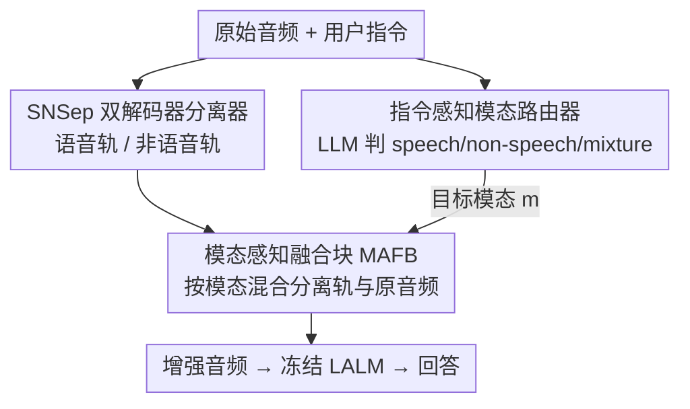

# Focus Then Listen: An Empirical Study of Plug-and-Play Audio Enhancer for Noise-Robust Large Audio Language Models

**会议**: ICML 2026  
**arXiv**: [2603.04862](https://arxiv.org/abs/2603.04862)  
**代码**: [项目页](https://sites.google.com/view/ftl-lalm)  
**领域**: 音频语音 / 大音频语言模型 / 噪声鲁棒  
**关键词**: LALM, 即插即用增强器, 语音/非语音分离, 指令感知, 噪声鲁棒

## 一句话总结
本文提出 Focus-Then-Listen（FTL）——一个**不动 LALM 参数**的即插即用音频增强器：先把输入波形分成语音/非语音两轨，再用一个 LLM 路由器根据用户指令判断该"听哪一类"，最后用模态感知融合块生成任务自适应的增强音频喂给大音频语言模型，从而在各种噪声条件下提升感知与推理性能。

## 研究背景与动机
**领域现状**：大音频语言模型（LALM，如 Audio Flamingo 3、Qwen3-Omni、Fun-Audio-Chat）把音频感知接到 LLM 上，统一做语音识别、声学场景分析、音频问答等任务，是音频理解的新范式。

**现有痛点**：真实环境里音频几乎从不干净——语音和非语音声音往往重叠。这里的"噪声"是**相对任务而言**的：做语音识别时背景声是噪声，做环境声分析时语音反而是干扰。LALM 在这种"成分互相干扰"的条件下性能显著掉点，可能误判用户意图，在安全关键场景尤其危险。

**核心矛盾**：现有补救手段各有死穴。① 噪声感知微调（noise-aware fine-tuning）需要任务特定的带噪数据、训练昂贵，且真实噪声无穷无尽根本覆盖不全，还可能灾难性遗忘、损害干净数据上的表现；② SSEU-Bench 用 CoT 提示分解任务，但提升主要在音频标注上、且需逐任务设计提示；③ SEE 这类基于嵌入的方法**假设噪声是预先定义好的**（如高斯噪声）、训练时还要纯噪声录音——这与本文设定根本冲突：这里噪声不可预定义，而是任务依赖的（语音任务里非语音是噪声，反之亦然）。

**本文目标**：在**完全不微调 LALM** 的前提下，提供一个通用、可插拔的前端，让任意 LALM 在带噪条件下都更鲁棒；噪声的定义要能随用户意图动态变化。

**切入角度**：模仿人类听音过程——面对混杂声音时，人会**先根据意图选择性聚焦**到相关成分，再去理解。

**核心 idea**：把"先聚焦后聆听"做成一个前置增强器——从用户指令推断任务相关的音频模态，产出过滤后、模态对齐的信号交给 LALM，放大任务相关信息、压制无关成分。

## 方法详解

### 整体框架
FTL 是一个三段串行的前端：原始音频 $S_{ra}$ 先经**音频分离器**拆成语音轨 $S_{sp}$ 与非语音轨 $S_{ns}$；再由**模态路由器**（一个 LLM）读用户指令，输出目标模态 $m\in\{\text{speech},\text{non-speech},\text{mixture}\}$；最后**模态感知融合块（MAFB）**按 $m$ 把对应分离轨与原始音频混合，生成任务自适应的增强音频 $S_{en}$，喂给下游 LALM 产生回答。整条链路 LALM 自身参数完全不变，故称"即插即用"。

### 关键设计

**1. 指令感知模态路由器：让"什么是噪声"随用户意图动态决定**

本文最根本的观察是噪声不可预定义、而是任务依赖的，所以增强前必须先知道"这次该聚焦哪一类声音"。FTL 直接用一个 LLM（Qwen3-8B 或 ChatGPT5.2）当路由器：读用户指令，若任务只要语音信息就输出 "speech"，只要非语音内容就输出 "non-speech"，需要兼顾两者的复杂任务则输出 "mixture"。路由正确率用 Correct Rate（CR）衡量，即目标模态被正确预测的样本比例。这一步把"人类先按意图聚焦"显式化，也是整套增强能对症下药的前提——路由错了，后面融合就会增强错的成分。

**2. SNSep 双解码器语音/非语音分离器：为"语音 vs 非语音"这对特定划分定制**

要分离就得有分离器，但现成模型不合用：SE-Mamba（SEM）是按**语音增强**目标训练的（从混合里估计增强语音，再相减得非语音），SAM-Audio（SAM）是生成式分离、可能造出原音频里不存在的成分而误导下游理解。于是作者自研 **SNSep**：在短时傅里叶变换（STFT）域用**掩码（masking）**方式分离，骨干取自 AudioSep，采用**双解码器**结构——一个解码器重建语音轨、另一个并行解码器独立抽取非语音轨。训练数据为各 50 小时的语音与非语音，按 $-10$ 到 $10$ dB 的随机 SNR 混合、统一重采样到 16 kHz。分离记为

$$S_{sp},\,S_{ns} = \mathrm{Sep}(S_{ra}).$$

**3. 模态感知融合块（MAFB）：在"增强力度"和"信号保真"之间按模态调权**

直接把分离出的纯净轨喂给 LALM 有风险——分离不完美时会带 artifact，反而误导理解。MAFB 因此不"全用分离轨"，而是按路由结果把分离轨与原始音频做凸组合：

$$S_{en}=\begin{cases}\alpha_{sp}S_{sp}+(1-\alpha_{sp})S_{ra}, & m=\text{speech}\\[2pt]\alpha_{ns}S_{ns}+(1-\alpha_{ns})S_{ra}, & m=\text{non-speech}\\[2pt]S_{ra}, & m=\text{mixture}\end{cases}$$

系数 $\alpha_{sp}=0.5$、$\alpha_{ns}=0.9$ 由消融经验确定。混入原始音频既保留自然声学、避免分离 artifact 主导，又在 "mixture" 时干脆退回原音频不做破坏。语音任务用较低 $\alpha_{sp}=0.5$（更看重保真），非语音任务用较高 $\alpha_{ns}=0.9$（更激进地压制语音干扰），体现了对两类任务不同需求的调权。

### 损失函数 / 训练策略
只有 SNSep 需要训练，沿用 AudioSep 的配置；模态路由器与 LALM 都是现成模型、零训练。整个 FTL 不对 LALM 反向传播，纯前端推理。

## 实验关键数据

### 主实验
感知任务用 SSEU-Bench：ASR（指标 WER%，越低越好）与音频标注 AT（指标 mAP%，越高越好），在不同 SNR 下评测；推理任务用自建的 MMAU-Pro-Ctrl（指标 QA-ACC%）。下游 LALM 含 AF3、FAC、Q3O，路由器用 Qwen3-8B。

| 任务/指标 | LALM | 无 FTL | 有 FTL | 条件 |
|------|------|------|------|------|
| ASR WER% | AF3 | 27.45 | 25.39 | SNR-Speech $-10$ dB |
| ASR WER% | FAC | 31.67 | 28.41 | SNR-Speech $-10$ dB |
| ASR WER% | Q3O | 20.42 | 18.61 | SNR-Speech $-10$ dB |
| AT mAP% | AF3 | 27.36 | 31.56 | SNR-Non-Speech $-10$ dB |
| AT mAP% | FAC | 16.34 | 20.75 | SNR-Non-Speech $-10$ dB |
| AT mAP% | Q3O | 31.33 | 37.27 | SNR-Non-Speech $-10$ dB |

可见 FTL 在低 SNR（干扰最强）时增益最明显，对三个 LALM 都成立；干净条件（$+\infty$）下基本持平、不掉点。

### 消融实验
分离器选择（AF3 上，Table 4）：

| 分离器 | ASR WER% @$-10$dB | AT mAP% @$-10$dB | 说明 |
|------|------|------|------|
| 无 FTL | 27.45 | 27.36 | 基线 |
| SAM | 28.72 | 31.98 | 生成式，ASR 反而变差（造出虚假成分） |
| SEM | 23.83 | 33.67 | 语音增强目标，低 SNR ASR 最好 |
| SNSep | 25.39 | 31.56 | 本文，专为语音/非语音分离、整体均衡 |

路由器质量（MMAU-Pro-Ctrl，Table 3）：

| 路由器 | 语音 CR% | 非语音 CR% | 备注 |
|------|------|------|------|
| Qwen3-8B | 23.8 | 0.0 | 非语音一律预测 "mixture"，等于不增强、无增益 |
| ChatGPT5.2 | 88.5 | 47.7 | 路由准确，推理增益最大 |
| GroundTruth | 100.0 | 100.0 | 上界 |

### 关键发现
- **低 SNR 下增益最大**：干扰越强、FTL 帮助越明显；干净音频不受损，说明前端"该出手时才出手"。
- **路由是瓶颈**：Qwen3-8B 在非语音推理上 CR=0%（总猜 "mixture"），直接让增益归零；换成 ChatGPT5.2（CR 88.5%/47.7%）才把推理提上去——印证设计 1 的核心地位。
- **更好的路由不总带来更好的推理**：GroundTruth 路由（100% 准确）有时还略逊于 ChatGPT5.2，说明高层语义推理对增强的依赖比低层感知更微妙、增强并非越"对"越好。
- **分离器各有所长**：SEM 在低 SNR ASR 上反超 SNSep，但它是为语音增强训练的；SNSep 胜在语音/非语音两类任务上整体均衡，且不会像 SAM 那样生成虚假成分误导理解。

## 亮点与洞察
- **把"噪声"重新定义为任务相对量**：不预设噪声类型，而靠用户指令动态决定该聚焦哪类声音——这一视角让方法天然适配"语音任务里非语音是噪声、反之亦然"的现实，是相对 SEE 等"噪声预定义"方法的关键突破。
- **凸组合保真这一小设计很实用**：MAFB 不盲信分离结果，混入原音频抵消 artifact，$\alpha_{sp}/\alpha_{ns}$ 差异化取值（0.5 vs 0.9）体现对两类任务需求的细调，可直接迁移到其他"分离后再用"的前端。
- **完全 training-free 于 LALM**：只训一个小分离器、路由器和 LALM 都现成，意味着任何新 LALM 来了都能直接套，工程上极友好。

## 局限与展望
- **强依赖路由器质量**：路由器是单点瓶颈，弱 LLM（Qwen3-8B 在非语音上 CR=0%）会让整套方法失效；如何让小模型也路由可靠是关键短板。
- **融合系数靠经验固定**：$\alpha_{sp}=0.5$、$\alpha_{ns}=0.9$ 由消融选出、全局共用，未随 SNR / 任务自适应，可能不是各场景最优。
- **只支持语音/非语音二分**：现实音频可能有多类重叠声源，"speech vs non-speech"的粗划分难以应对更细粒度的目标声提取。
- **"更准路由未必更好推理"未深究**：作者观察到 GroundTruth 有时逊于 ChatGPT5.2，但没解释机理，留下一个有趣的开放问题。

## 相关工作与启发
- **vs 噪声感知微调（Hu 2024 / Ding 2025）**：他们用海量带噪数据微调 LALM，代价高、覆盖不全、易遗忘；FTL 不动 LALM，靠前端增强达成鲁棒，可插拔、可换底座。
- **vs SSEU-Bench 的 CoT 提示**：CoT 分解任务但增益集中在音频标注、需逐任务设计提示；FTL 用统一的指令感知增强，覆盖感知与推理两类任务。
- **vs SEE (Zhang 2026)**：SEE 假设噪声预定义、训练需纯噪声录音；FTL 把噪声当任务相对量、无需预定义，适用范围更广。

## 评分
- 新颖性: ⭐⭐⭐⭐ 首个为 LALM 做指令感知、语音/非语音互扰缓解的即插即用增强器
- 实验充分度: ⭐⭐⭐⭐ 覆盖 3 个 LALM、感知+推理、多 SNR 与分离器/路由器消融，但任务划分较窄
- 写作质量: ⭐⭐⭐⭐ 动机贴近人类直觉、结构清晰，公式与表格充分
- 价值: ⭐⭐⭐⭐ training-free、可换底座，对噪声鲁棒音频理解有实际工程价值

<!-- RELATED:START -->

## 相关论文

- [\[AAAI 2026\] DiffA: Large Language Diffusion Models Can Listen and Understand](../../AAAI2026/audio_speech/diffa_large_language_diffusion_models_can_listen_and_understand.md)
- [\[CVPR 2026\] AudioStory: Generating Long-Form Narrative Audio with Large Language Models](../../CVPR2026/audio_speech/audiostory_generating_long-form_narrative_audio_with_large_language_models.md)
- [\[AAAI 2026\] AHAMask: Reliable Task Specification for Large Audio Language Models without Instructions](../../AAAI2026/audio_speech/ahamask_reliable_task_specification_for_large_audio_language.md)
- [\[ACL 2026\] Temporal Contrastive Decoding: A Training-Free Method for Large Audio-Language Models](../../ACL2026/audio_speech/temporal_contrastive_decoding_a_training-free_method_for_large_audio-language_mo.md)
- [\[AAAI 2026\] Listening Between the Frames: Bridging Temporal Gaps in Large Audio-Language Models](../../AAAI2026/audio_speech/listening_between_the_frames_bridging_temporal_gaps_in_large_audio-language_mode.md)

<!-- RELATED:END -->
