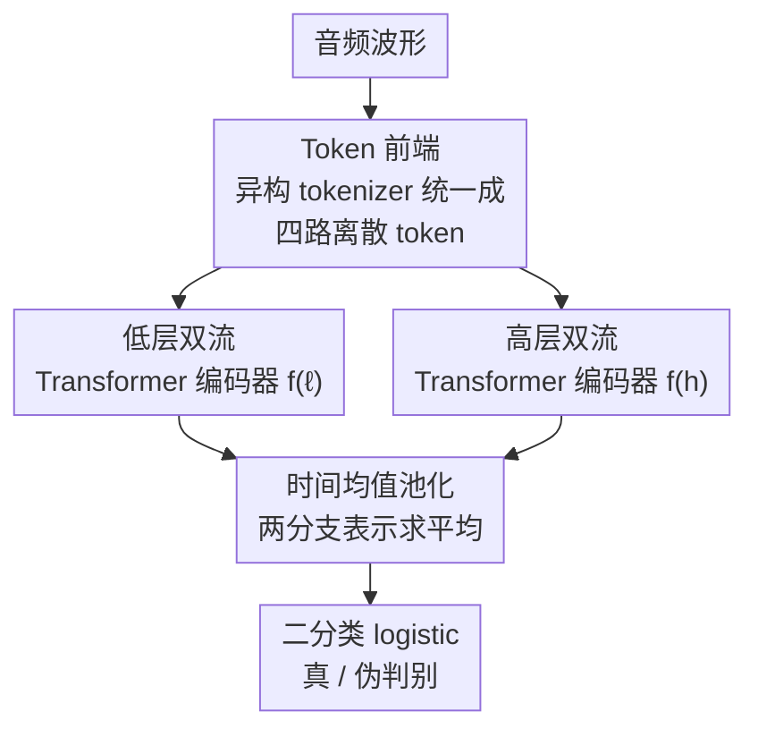

# Probing Token Spaces under Generator Shift in AI-Generated Music Detection

**会议**: ICML2026  
**arXiv**: [2606.08663](https://arxiv.org/abs/2606.08663)  
**代码**: https://github.com/MAAP-LAB/CoMoE  
**领域**: 音频/语音 · AI 生成内容检测  
**关键词**: AI音乐检测, 神经音频编解码, 离散token, 生成器迁移, 跨源泛化

## 一句话总结
这篇论文把 AI 音乐检测里被当成"预处理细节"的 **token 空间**（用哪种 tokenizer）提升为一个**主实验变量**：通过固定下游分类器 CoMoE、只替换输入 token，并在新构造的 MoM-open 上做"训练时只见一种伪造生成器、测试时换生成器"的 source-restricted 评测，证明在生成器迁移场景下不同 token 空间的鲁棒性差距巨大（Fake-Udio 上 X-Codec token 89.0% AUC vs EnCodec token 58.6%）。

## 研究背景与动机

**领域现状**：AI 音乐检测要判断一段音乐是人创作的还是生成模型（Suno、Udio、DiffRhythm 等）产出的。现有检测器多基于频谱图、原始波形或连续自监督表征（如 MERT、Wav2Vec2），并在 SONICS、CLAM 等标准 benchmark 上报出接近饱和的高分。

**现有痛点**：标准 benchmark 的训练/测试集往往共享同一批生成器，检测器很可能学到了**生成器特有的指纹伪影**而非"伪造 vs 真实"的本质区别。部署时检测器必须面对**训练中从未出现过的生成器源**，此时标准 split 上的高分会严重高估真实鲁棒性。

**核心矛盾**：到底是什么决定了"换生成器后还能不能检测出来"？现有工作把注意力放在分类器结构设计上，却忽略了**输入表征（token 空间）本身**可能才是控制跨生成器鲁棒性的关键。而 codec 风格的离散 token 不是单一表征——不同 tokenizer 诱导出不同的码本、时间率和量化行为，这让"选哪个 tokenizer"从预处理细节变成了一个实验自变量。

**本文目标**：(i) 把 tokenizer 选择从预处理细节抬升为受控实验变量；(ii) 构造一个可复现、带 source-restricted split 的开放 benchmark；(iii) 量化在生成器迁移下不同 token 空间的差异。

**切入角度**：作者赌的是"codec 风格离散 token 提供了一种不同于连续声学/语义特征的取证视角"——神经 codec 用残差量化（RVQ）把音频表示成多路码本序列，可能暴露出码本使用、token 转移、量化层级等连续特征池化后看不到的伪造痕迹。要验证这一点，必须**控制变量**：固定分类器、固定训练配方，只换 token。

**核心 idea**：用一个**固定的、紧凑的分类器 CoMoE** 当"探针"，让所有差异都只反映输入 token 空间，再用 source-restricted 评测把生成器迁移这个维度逼出来。

## 方法详解

### 整体框架
方法由两块拼成：一个**受控探针 CoMoE**（把"换 tokenizer"变成唯一变量），和一套**评测协议 MoM-open + source-restricted split**（把"生成器迁移"这个隐藏难度逼出来）。CoMoE 的数据流是：任意音频经某个 tokenizer 前端被统一映射成**四路离散 token 流**（两路低层、两路高层），低层两路与高层两路分别送进两个结构完全相同的 Transformer 编码器，时间维均值池化得到两个分支表示，二者求平均后接一个二分类 logistic 头输出真/伪。

整条 pipeline 里**唯一被替换的就是 tokenizer 前端**——分类器架构、训练配方、评测协议全部冻结，所以任意两行 CoMoE 结果的差异都干净地归因于 token 空间本身。

### 关键设计

**1. CoMoE：固定下游、只换 token 空间的受控探针**

要回答"是 token 空间还是分类器决定鲁棒性"，必须把分类器钉死。CoMoE 消费四路离散 token 流 $\mathbf{T}=(\mathbf{T}^{(\ell_1)},\mathbf{T}^{(\ell_2)},\mathbf{T}^{(h_1)},\mathbf{T}^{(h_2)})$，其中每路 $\mathbf{T}^{(s)}\in\{0,\dots,C-1\}^{L}$（码本大小 $C=1024$，截断/补齐到固定长度 $L$）。低层两路与高层两路各送进一个 4 层、隐藏维 $d=256$、4 头的 Transformer 编码器，时间均值池化后得两个分支表示：

$$\mathbf{h}^{(\ell)}=\mathrm{Pool}\big(f^{(\ell)}(\mathbf{T}^{(\ell_1)},\mathbf{T}^{(\ell_2)})\big),\quad \mathbf{h}^{(h)}=\mathrm{Pool}\big(f^{(h)}(\mathbf{T}^{(h_1)},\mathbf{T}^{(h_2)})\big)$$

两个分支表示平均后过 logistic 头 $\hat{y}=\sigma(\mathbf{w}^\top \mathbf{z}+b)$，其中 $\mathbf{z}=\tfrac{1}{2}(\mathbf{h}^{(\ell)}+\mathbf{h}^{(h)})$。低/高双分支的设计借鉴了"语义+底层伪影互补"的双路思路（如 AIGC 图像检测里的 AIDE），让不同码本层级承载不同取证信息。所有 CoMoE 变体共用这套四流分类器——这正是它能当"探针"的前提：结果差异里没有分类器变量的污染。

**2. Token 前端：把异构 tokenizer 统一到同一个四流接口**

不同 tokenizer 码本数、时间率、量化方式各不相同，直接比较没有可比性。作者用一条统一规则把它们都映射到"两路低层 + 两路高层"：对 RVQ codec 取**早期码本当低层、晚期码本当高层**；对 MERT 这类自监督模型取**浅层当低层、深层当高层**。具体地——EnCodec 24kHz 取码本 $q=0,1$ 当低层、$q=6,7$ 当高层；DAC 44kHz 取 $q=0,1$ 与 $q=7,8$；X-Codec mini（音乐训练的语义感知 codec，12 路 RVQ）取 $q=0,1$ 与 $q=10,11$；MERT $k$-means 则对第 $\{0,1,11,12\}$ 层帧特征做 MiniBatch $k$-means 离散化，层 $0,1$ 当低层、层 $11,12$ 当高层。"早期/晚期、浅层/深层"这个映射是**受控接口而非理论约束**，目的是让所有 tokenizer 站在同一条起跑线上接受比较。

**3. MoM-open 与 source-restricted 切分：把生成器迁移这个隐藏难度逼出来**

原始 MoM-CLAM benchmark 依赖 YouTube 来源的真实音频，难以再分发/复现。作者用可自由再分发的 **FMA-medium + MTG-Jamendo** 替换真实那一半、保留原始伪造生成器协议，重建出 **MoM-open**（共 146,309 条）。真正的杀手锏是**切分协议**：除了常规 base split，还设计了"只保留某一真实源训练"的 real-source 受限（Real-FMA / Real-Jamendo）和"只保留某一伪造生成器训练、测试见其余未见生成器"的 **fake-source 受限**（Fake-Suno3.5 / Fake-Udio）。验证集只从训练保留的源里采、阈值绝不用 held-out 生成器选。这套切分的意义在于：base 与 real-restricted 几乎饱和（区分度低），而 fake-source restriction 才是真正暴露 token 空间差异的"显微镜"。

### 损失函数 / 训练策略
所有 CoMoE 变体共用同一配方：AdamW、12 个 epoch、学习率 $2\times10^{-4}$、label smoothing 0.05、seed 42、单张 H100。指标用 AUC 与 held-out-fake 检测率（后者阈值 $\tau^\star$ 由最大化验证集 F1 选出后固定套用到每个未见生成器源）。另有两个非 CoMoE 基线：MLP(MERT)（均值池化 MERT 特征 + 小 MLP）与 CLAM（原 benchmark 的双率参考检测器，MERT + Wav2Vec2 加权交叉注意力）。

## 实验关键数据

### 主实验
跨生成器 OOD AUC（%）。base 与 real-restricted 几乎饱和，差异都挤在 fake-source 受限两列。括号外为绝对值。

| 模型 | base | Fake-Suno3.5 | Fake-Udio |
|------|------|--------------|-----------|
| CLAM | 99.92 | **97.72** | 66.51 |
| MLP (MERT) | 99.77 | 86.87 | 67.45 |
| CoMoE (X-Codec) | 99.93 | 86.97 | **89.04** |
| CoMoE (DAC) | 99.82 | 88.33 | 77.28 |
| CoMoE (EnCodec) | 96.44 | 85.15 | 58.64 |
| CoMoE (MERT $k$-means) | 99.83 | 92.22 | 73.26 |
| MERT-continuous（同 backbone） | 99.87 | 93.84 | 71.91 |

### 操作点分析
验证集阈值固定后套到未见伪造源的 held-out-fake 检测率（%）——和 AUC 排名会背离。

| 模型 | Fake-Suno3.5 | Fake-Udio |
|------|--------------|-----------|
| CLAM | 71.0 | 2.6 |
| MLP (MERT) | 60.1 | 26.0 |
| CoMoE (X-Codec) | 38.7 | **45.1** |
| CoMoE (DAC) | 61.4 | 29.2 |
| CoMoE (EnCodec) | 43.8 | 23.5 |
| CoMoE (MERT $k$-means) | 51.9 | 17.3 |
| MERT-continuous | 49.9 | 7.8 |

### 关键发现
- **token 空间身份是固定架构下的主导因素**：所有 CoMoE 行共用分类器，Fake-Udio 上 EnCodec 跌到 58.64%、DAC 77.28%、X-Codec 高达 89.04%——差异全部来自输入 token。而且没有"全能最优 token"：MERT $k$-means 在 Fake-Suno3.5 上最强（92.22%），X-Codec 在 Fake-Udio 上最强，说明最佳 token 空间随目标生成器而变。
- **CLAM 的崩塌最戏剧**：base 99.92% 的强基线在 Fake-Udio 上 AUC 掉到 66.51%，对应的 held-out 检测率只有 2.6%（几乎全漏报）——典型的"在标准 split 上鲁棒只是假象"。
- **音乐预训练表征不足以解释增益**：MLP(MERT) 在 base/real-restricted 很强但 fake-restricted 大跌，说明 X-Codec 的优势不能简单归因于"用了音乐预训练表征"，**序列化的 token 结构**也起作用。
- **离散化本身不解释 AUC，但影响操作点稳定性**：MERT-continuous 用同 backbone 换连续特征，Fake-Suno3.5 上 AUC 反而更高（93.84 vs 92.22），但 Fake-Udio 的 held-out 检测率从 17.3% 崩到 7.8%——AUC 和操作点行为会分叉，fake-source 评测必须同时看排名指标和操作点指标。

## 亮点与洞察
- **把"预处理细节"重新框定为"主实验变量"**：这篇论文最大的价值不是某个 SOTA 数字，而是一个研究范式上的提醒——在生成器迁移下，token 空间应当像模型架构一样被系统性消融，而不是随手选一个 tokenizer 就开跑。这个洞察可直接迁移到语音 deepfake、AIGC 图像/视频检测等所有"换生成器就掉点"的取证任务。
- **受控探针的方法论很干净**：冻结一切、只动一个变量，是把"表征 vs 分类器"这类纠缠问题解耦的标准做法，CoMoE 是这一思路在 codec token 上的轻量实现，复现成本低（单卡 H100、12 epoch）。
- **AUC 与操作点背离的警示**：CLAM 在 Fake-Udio 上 AUC 还有 66.51% 看似"非随机"，但固定阈值下检测率仅 2.6%，提醒做迁移评测时只报 AUC 会掩盖部署时的真实失效。

## 局限与展望
- 作者承认 **MoM-open 是开放重建**，真实那半换成了 FMA/Jamendo，与原 MoM-CLAM 并非严格等价；且 X-Codec mini 在血缘上不是完全独立于 YuE 相关工具链（可能存在表征-生成器的潜在泄漏）。
- **没有控制训练池规模**：不同生成器的训练样本量差异很大（Suno-v3.5 有 28,611 条、Suno-v2 仅 660 条），fake-source 受限的强弱可能部分被样本量混淆。
- **只是诊断、未给解法**：论文证明了 token 空间重要，但没有提出"如何在生成器迁移下选/融合 token 空间"的方法。作者展望未来应评测更多生成器源、控制训练池规模、并测试 calibration 或 fusion 在生成器迁移下的效果。

## 相关工作与启发
- **vs CLAM（双率连续表征检测器）**：CLAM 用 MERT + Wav2Vec2 连续流加权交叉注意力，在 base 上最强但生成器迁移时崩塌；本文用固定分类器 + 离散 token，发现 codec 离散 token（尤其 X-Codec）在 Fake-Udio 上反而更鲁棒，区别在于本文把表征当变量而非把分类器当变量。
- **vs SONICS（mel 频谱时频 tokenization）**：SONICS 在 mel 频谱上做时间/频谱 tokenization，仍属频谱路线；本文系统比较的是 codec 风格离散 token，并指出它们在跨生成器评测下从未被系统对比过。
- **vs 语音 deepfake 检测**：codec token 与量化层级早已在语音 deepfake 取证里当线索用，本文把这一思路引入音乐 deepfake，并补上"不同 tokenizer 诱导不同离散空间、必须当实验变量"这一关键认识。

## 评分
- 新颖性: ⭐⭐⭐⭐ 把 token 空间从预处理抬升为主实验变量的视角新颖，但方法本身是受控探针而非新模型
- 实验充分度: ⭐⭐⭐⭐ 多 tokenizer × 多 split 的对照干净，AUC+操作点双指标到位；但未控训练池规模、生成器源数量有限
- 写作质量: ⭐⭐⭐⭐ 受控变量逻辑清晰，结论与表格自洽
- 价值: ⭐⭐⭐⭐ 诊断性强、可直接迁移到其他生成内容取证任务，但只诊断未给解法

<!-- RELATED:START -->

## 相关论文

- [\[ICML 2026\] MusicDET: Zero-Shot AI-Generated Music Detection](musicdet_zero-shot_ai-generated_music_detection.md)
- [\[ACL 2025\] Double Entendre: Robust Audio-Based AI-Generated Lyrics Detection via Multi-View Fusion](../../ACL2025/audio_speech/double_entendre_robust_audio-based_ai-generated_lyrics_detection_via_multi-view_.md)
- [\[ICML 2026\] Probing Cross-modal Information Hubs in Audio-Visual LLMs](probing_cross-modal_information_hubs_in_audio-visual_llms.md)
- [\[ACL 2026\] Analyzing Reasoning Shifts in Audio Deepfake Detection under Adversarial Attacks: The Reasoning Tax versus Shield Bifurcation](../../ACL2026/audio_speech/analyzing_reasoning_shifts_in_audio_deepfake_detection_under_adversarial_attacks.md)
- [\[AAAI 2026\] Aligning Generative Music AI with Human Preferences: Methods and Challenges](../../AAAI2026/audio_speech/aligning_generative_music_ai_with_human_preferences_methods_and_challenges.md)

<!-- RELATED:END -->
