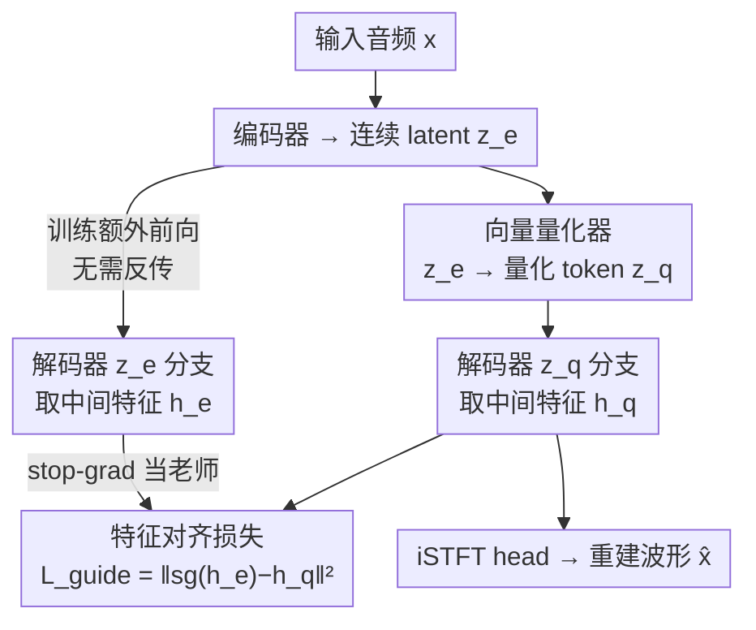

# Self-Guidance: Enhancing Neural Codecs via Decoder Manifold Alignment

**会议**: ICML2026  
**arXiv**: [2606.12940](https://arxiv.org/abs/2606.12940)  
**代码**: [demo 站点](https://sgvqvae.github.io/sgvqvae-demo)（demo，代码未明确开源）  
**领域**: 语音编解码 / 音频 tokenizer / VQ-VAE  
**关键词**: 神经语音编解码、量化误差、解码器流形对齐、自引导、低码率

## 一句话总结
在 VQ-VAE 语音编解码器训练时，让解码器同时吃「量化后 token」和「量化前连续 latent」两条路，用一个轻量特征对齐损失逼着前者的解码器内部特征去对齐后者，从而在零推理开销下显著提升重建保真度，并能把码本缩小 4 倍而不掉点。

## 研究背景与动机
**领域现状**：以 SoundStream、EnCodec 为代表的神经语音编解码器，本质是 VQ-VAE——编码器把音频压成连续 latent $z_e$，向量量化器用最近邻搜索把 $z_e$ 映射到有限码本里的 token $z_q$，再由解码器从 $z_q$ 重建波形。这些离散 token 直接喂给 LLM 做 next-token prediction，是当下 speech LLM / TTS 的基石。

**现有痛点**：量化天然是有损的。论文在 Section 3.2 用 EnCodec、BigCodec 做了一个很关键的对照实验：如果让解码器直接吃**量化前**的连续 latent $z_e$（绕过量化），重建质量明显比吃量化 token $z_q$ 要好（例如 EnCodec 的 STOI 从 0.88 升到 0.95）。这说明量化误差 $e_q=\lVert z_e - z_q\rVert_2$ 是限制保真度的主要瓶颈——它砍掉了本可送给解码器的信息。

**核心矛盾**：要压量化误差，主流做法要么用残差多码本（RVQ）做分层量化，要么把码本直接堆大（TS3Codec、XCodec2 把码本扩到 $2^{16}$ 以上）。这两条路对编解码本身有效，却把负担甩给了下游 LLM：分层码本需要复杂机制塞进自回归 Transformer；而音频码本不像文本有 BPE 这种层次子词结构，单纯扩大码本只是把一个扁平、无结构的词表撑大，让自回归序列建模的复杂度指数上升。

**本文目标**：在不改量化器、不扩码本、不增推理成本的前提下，把量化误差对最终音质的伤害降下来，同时让码本更小以利下游 LLM。

**切入角度**：作者换了个视角——与其一味改进量化器去缩小 $e_q$，不如**让解码器对量化器的不完美变得鲁棒**。既然解码器吃连续 latent 时能产出高质量音频，那就把这条「高保真路径」当成内部老师，逼着解码器在吃量化 token 时也产出相似的内部特征。

**核心 idea**：用量化前 latent $z_e$ 自己当训练时的内部引导信号，在解码器中间特征上加一个特征映射损失，把「吃 $z_q$」和「吃 $z_e$」两条路的解码器流形对齐——作者称之为 self-guidance（SG）。

## 方法详解

### 整体框架
self-guidance 的目标是让解码器在面对带量化误差的 $z_q$ 时，也能输出接近「吃干净 $z_e$」时的高保真特征。标准 VQ-VAE 训练只用原始音频 $x$ 当重建目标，隐式地希望两条路输出一致，但作者的初步分析表明这种隐式约束不足以消除量化伪影，需要**显式**引导。

做法是在训练时给解码器加一条额外前向：除了常规的 $z_q \to$ 解码器，再让量化前的 $z_e$ 也走一遍解码器，分别取出两路的中间特征 $h_q$（来自 $z_q$ 分支）和 $h_e$（来自 $z_e$ 分支），其中 $h$ 取 XCodec2 解码器里最后一个 Transformer block 的输出（再往后是 iSTFT head 重建波形）。然后用一个特征映射损失把 $h_q$ 拉向 $h_e$。整套机制只在训练时多一次前向、且该前向不需要反传，推理时完全不动。

### 关键设计

**1. 自引导特征对齐损失：用量化前 latent 当内部老师**

针对的痛点是：量化误差让解码器丢了信息，而标准重建损失只盯着波形、管不住解码器内部表示怎么塌。作者引入特征映射损失

$$\mathcal{L}_{\text{guide}} = \lVert \text{sg}(h_e) - h_q \rVert_2^2$$

其中 $\text{sg}(\cdot)$ 是 stop-gradient。这里的精妙之处有两点：一是把「吃干净 latent 的那一路输出 $h_e$」当成高保真目标，但用 stop-gradient 冻住它——只让 $z_q$ 分支去追 $z_e$ 分支，而不会反过来把高质量分支拖坏；二是它直接在解码器的**内部流形**上做约束，而非只在最终波形上，相当于显式告诉解码器「不管输入是 $z_q$ 还是 $z_e$，你内部该长成同一个样」。作者通过统计与可视化（量化误差分布、隐特征对齐误差 $\lVert h_e - h_q\rVert_2^2$ 的直方图）证实：开启 SG 后两路特征的对齐误差显著收窄，且这是解码器侧的对齐效果，而非反过来去规整编码器。

**2. 对齐点放在 Transformer backbone 输出：避开 iSTFT 与对抗损失干扰**

为什么 $h$ 偏偏取最后一个 Transformer block 的输出，而不是更靠后的波形？因为 XCodec2 的声学解码器不用堆叠卷积上采样，而是 Transformer backbone + iSTFT head 的结构。把对齐点选在 Transformer 输出有两个理由：(i) Transformer 占了解码器绝大部分可学习参数，容量足够大，最能从自引导中获益；(ii) iSTFT head 把隐特征和最终波形生成分开了，在 Transformer 输出处对齐可以避免波形级重建/对抗损失对特征对齐的相互干扰。这是一个把通用 SG 思想落到具体 SOTA 架构上的关键工程判断。

**3. 端到端单阶段训练，几乎零额外开销**

不同于经典自蒸馏需要一个预训练好的教师模型，SG 把「教师」就放在同一次端到端训练里——$z_e$ 分支既是数据流的一部分又充当老师。总训练目标为

$$\mathcal{L}_{\text{total}} = \lambda_{guide}\mathcal{L}_{\text{guide}} + \mathcal{L}_{\text{semantic}} + \mathcal{L}_{\text{acoustic}} + \mathcal{L}_{\text{adv}}$$

分别是自引导损失、语义特征 MSE、多尺度 Mel 谱 L1、以及多周期 + 谱判别器的对抗损失。由于 $z_e$ 分支的额外前向**不需要反向传播**，实测每 epoch 时间从 25668.0s 仅增到 25783.8s（<0.5%），相比判别器、梯度同步等开销几乎可忽略。这让 SG 成为一个「白嫖」式增益：改动只需在训练时给解码器加一次前向、把 $\mathcal{L}_{\text{guide}}$ 加进生成器损失。

### 损失函数 / 训练策略
在 XCodec2 官方实现上改两处即可：训练时给解码器加 $z_e$ 的额外前向、把 $\mathcal{L}_{\text{guide}}$ 加进生成器损失。所有码本规模（8192 / 16384 / 65536）共用同一套训练；在 LibriSpeech 全量 960 小时、16kHz 上训练 60 万步，8×RTX 4090，约 237.75 小时。$\lambda_{guide}$ 的敏感性分析见原文附录。

## 实验关键数据

### 主实验
在 LibriSpeech test-clean 上，对 XCodec2 加 SG 后六项指标几乎全面提升，且在大码本（65536）下拿到低码率单码本编解码器的 SOTA。

| 编解码器 | 帧率 | 码本 | PESQ↑ | STOI↑ | MCD↓ | WER↓ | SIM↑ |
|----------|------|------|-------|-------|------|------|------|
| Ground Truth | — | — | 4.64 | 1.000 | 0.00 | 2.5 | 1.00 |
| XCodec2 | 50Hz | 8192 | 2.03 | 0.892 | 3.84 | 4.1 | 0.72 |
| **XCodec2+SG** | 50Hz | 8192 | **2.13** | **0.898** | **3.60** | **3.8** | **0.73** |
| XCodec2 | 50Hz | 65536 | 2.28 | 0.910 | 3.57 | 3.2 | 0.79 |
| **XCodec2+SG** | 50Hz | 65536 | **2.39** | **0.915** | **3.41** | 3.2 | **0.80** |
| TS3Codec | 50Hz | 131072 | 2.23 | 0.910 | 3.50 | 3.6 | 0.68 |

注意 XCodec2+SG 用 65536 码本就超过了 TS3Codec 用 131072 码本的结果（PESQ 2.39 vs 2.23）。

### 4× 码本压缩 / 泛化性

| 验证维度 | 关键结果 |
|----------|----------|
| 4× 码本压缩 | 16384 码本 + SG 的重建曲线追平 65536 基线（4× 缩小不掉保真度） |
| 量化器泛化 | 在 FSQ / SimVQ / Residual FSQ 上均有提升 |
| 解码器泛化 | 在 Transformer 型 XCodec2 与 RNN/CNN 型 BigCodec 上均有效 |
| 下游 TTS | 更小码本简化 token 建模空间，显著改善基于 LLM 的语音合成 |
| 训练开销 | 每 epoch 仅增 <0.5%（25668.0s → 25783.8s）；推理零改动 |

### 关键发现
- 最直接的证据是隐特征对齐误差 $\lVert h_e - h_q\rVert_2^2$ 直方图：开 SG 后分布明显左移、收窄，说明解码器内部流形真的被对齐了，而非只是波形指标好看。
- 「4× 码本压缩不掉点」是对下游最有价值的结论——它把对大码本的依赖解开，等于在保真度不变的前提下给 LLM 一个更小、更易建模的词表。
- 增益在多种量化器与多种解码器骨干上都成立，说明 SG 不是绑死某种归纳偏置的 trick，而是一个对 VQ-VAE 解码器普适的训练范式。

## 亮点与洞察
- 视角切换很漂亮：别人都在「缩小量化误差」，作者转去「让解码器对量化误差免疫」，绕开了改量化器→连累下游 LLM 的死循环。
- stop-gradient 的用法是点睛之笔：把吃干净 latent 的高保真路径冻住当老师，只单向拉量化路径，避免「为了对齐把好路径也拉差」。
- 几乎零成本：额外前向不反传、推理不变，这种「免费午餐」式改进极易被现有 codec 直接采纳。
- 可迁移性强：「用同一网络处理干净 / 退化输入并对齐内部特征」的思路，可推广到任何存在信息有损中间步骤的自编码器（如有损压缩、量化感知训练）。

## 局限与展望
- 实验只在英文 LibriSpeech 上验证，跨语种、带噪、音乐等更复杂音频的泛化未知。
- 对齐点的选择（最后一个 Transformer block）是基于 XCodec2 结构的经验判断，换到纯卷积上采样解码器时该选哪层、是否仍有效，论文未系统讨论。
- $\mathcal{L}_{\text{guide}}$ 用的是简单 L2 特征对齐，是否还有更贴合感知/语义的对齐度量（如多层、加权对齐）值得探索。
- 增益虽稳定但单点幅度不大（PESQ 多在 +0.1 量级），真正的杀手锏是「4× 码本压缩」带来的下游收益，而非重建指标本身的大跳。

## 相关工作与启发
- **vs 残差/大码本量化器（RVQ、TS3Codec、XCodec2 原版）**: 它们从量化器侧压误差但把负担转嫁给下游 LLM；SG 不动量化器，从解码器侧消化误差，反而让码本能缩小。
- **vs 自蒸馏（self-distillation）**: 两者都用特征映射损失，但自蒸馏需要预训练教师、且通常针对泛化/校准；SG 把教师设为同次训练里「吃量化前 latent」的那一路，单阶段端到端，专门针对 VQ-VAE 解码器对量化误差的鲁棒性这一未被充分探索的瓶颈。
- **vs 直接喂连续 latent**: 初步实验显示喂 $z_e$ 能涨点，但推理时拿不到 $z_e$（必须离散化才能给 LLM）；SG 把这条高保真路径的「知识」蒸到吃 $z_q$ 的解码器里，等于在保留离散化的同时偷到连续路径的好处。

## 评分
- 新颖性: ⭐⭐⭐⭐ 视角切换（鲁棒化解码器而非改量化器）干净且未被充分探索，但机制本身（特征对齐 + stop-grad）较经典。
- 实验充分度: ⭐⭐⭐⭐ 跨码本/量化器/解码器骨干 + 下游 TTS + 统计可视化，验证较全；语种与音频类型偏单一。
- 写作质量: ⭐⭐⭐⭐ 动机—观察—方法链条清晰，初步对照实验铺垫到位。
- 价值: ⭐⭐⭐⭐ 零推理开销 + 4× 码本压缩对 speech LLM 实用性强，易被采纳。

<!-- RELATED:START -->

## 相关论文

- [\[ICLR 2026\] MAPSS: Manifold-Based Assessment of Perceptual Source Separation](../../ICLR2026/audio_speech/mapss_manifold-based_assessment_of_perceptual_source_separation.md)
- [\[ICML 2026\] Multimodal Fusion via Self-Consistent Task-Gradient Fields](multimodal_fusion_via_self-consistent_task-gradient_fields.md)
- [\[ACL 2026\] An Exploration of Mamba for Speech Self-Supervised Models](../../ACL2026/audio_speech/an_exploration_of_mamba_for_speech_self-supervised_models.md)
- [\[ICLR 2026\] Toward Complex-Valued Neural Networks for Waveform Generation](../../ICLR2026/audio_speech/toward_complex-valued_neural_networks_for_waveform_generation.md)
- [\[ACL 2025\] MultiMed: Multilingual Medical Speech Recognition via Attention Encoder Decoder](../../ACL2025/audio_speech/multimed_multilingual_medical_speech_recognition_via_attention_encoder_decoder.md)

<!-- RELATED:END -->
