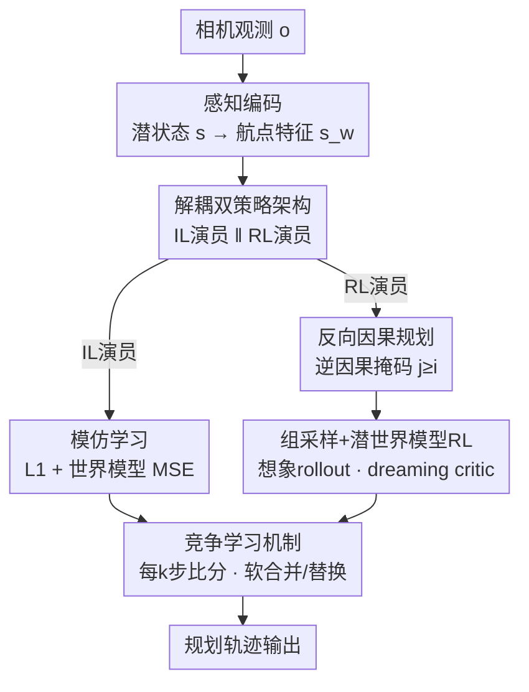

# CoIRL-AD: Collaborative-Competitive Imitation-Reinforcement Learning in Latent World Models for Autonomous Driving

**会议**: ICML2026  
**arXiv**: [2510.12560](https://arxiv.org/abs/2510.12560)  
**代码**: https://github.com/SEU-zxj/CoIRL-AD  
**领域**: 自动驾驶 / 世界模型 / 强化学习  
**关键词**: 端到端驾驶, 离线RL, 模仿学习, 潜空间世界模型, 双策略竞争  

## 一句话总结
CoIRL-AD 用两个独立的演员分别扛模仿学习（IL）和强化学习（RL）、靠一个潜空间世界模型"想象"未来轨迹来给 RL 算长程奖励，再用一套"谁强谁带谁"的竞争机制让两者互相传递有益行为，从而在**没有外部仿真器的离线真实驾驶数据**上把 RL 稳稳整合进端到端驾驶，在跨城泛化和长尾场景上取得显著提升。

## 研究背景与动机
**领域现状**：端到端（E2E）已是自动驾驶主流范式，让梯度贯穿感知-预测-规划。绝大多数 E2E 方法靠模仿学习（IL，常以监督学习形式用专家轨迹直接监督输出）训练。

**现有痛点**：IL 在固定数据分布上优化，但部署时智能体会诱导出自己的状态分布；小预测误差会把车推进训练时没见过的状态并随时间累积，导致 IL 智能体泛化差、长尾场景拉胯。RL 本可用奖励信号补救，但**真实驾驶用的是离线数据集**——若引入外部仿真器（如 CARLA）就把问题从离线 RL 变成了在线 RL，还带来 sim-to-real gap。

**核心矛盾**：离线真实驾驶数据集被**近最优专家演示**主导，几乎没有次优/非专家行为，导致难以学到不同动作之间的价值差异；而潜空间世界模型只在专家数据上训过，对分布外（OOD）动作的预测会有偏，RL 优化时这种偏差会造成**价值高估**、强化次优行为、训练不稳。再加上把 IL 和 RL 塞进**同一个策略**联合优化时，行为克隆与奖励最大化两个目标会产生**梯度冲突**。

**本文目标**：在没有外部仿真器的离线真实驾驶场景下，回答"RL 到底怎么用才能提升性能"——分解为(1)如何在专家主导的离线数据上构造可探索的 RL 框架、(2)如何稳定地把 IL 与 RL 整合而不互相打架。

**切入角度**：既然单策略联合优化会梯度冲突、两阶段先IL后RL在此设定下又不稳，那就**把 IL 和 RL 解耦成两个演员**，再让它们以"竞争"而非"强行融合"的方式交换有益行为。

**核心 idea**：用解耦的双策略 + 潜空间世界模型"做梦"算长程奖励 + 竞争机制把 RL 锚定在专家级驾驶附近，三者合起来在离线设定下稳定地用 RL 增强 IL。

## 方法详解

### 整体框架
给定相机观测 $o$，感知模块编码出潜状态 $s\in\mathbb{R}^{B\times N_t\times D}$；用航点查询 $Q_w$ 经交叉注意力抽出航点特征 $s_w$，规划头解码成动作序列 $\tau_a=\{a_1,\dots,a_n\}$（每个 $a_i\in\mathbb{R}^2$ 是 x/y 位移）。在这套共享主干上，CoIRL-AD 长出**两个独立演员**：IL 演员用 L1 损失模仿专家轨迹、并联合训练一个潜空间世界模型；RL 演员用逆因果掩码做规划、组采样多条候选轨迹、让世界模型想象未来状态、由 critic 给长程优势。每隔 $k$ 步，竞争机制比较两演员的累计奖励分、把赢家的参数（软合并或直接替换）传给输家。世界模型只在 IL 阶段学，RL 阶段冻结世界模型只更新 RL 演员和 critic。推理时架构与基线一致，不引入额外延迟。

### 关键设计

**1. 解耦双策略架构：把模仿和奖励最大化拆给两个演员，根治梯度冲突**

把 IL 和 RL 塞进同一个策略时，行为克隆（贴着专家）和奖励最大化（鼓励探索）两个目标方向不一致，梯度互相打架。作者直接把规划模块**解耦成 IL 演员和 RL 演员**，分别由 $L_{IL}$ 和 $L_{RL}$ 优化，从而把模仿学习与 RL 的探索噪声隔离开。两演员共享感知等底层模块但各有自己的规划头，这样 IL 演员始终提供一个"专家级"的稳定锚点，RL 演员则可以放心探索而不污染模仿信号。这是整个方法的骨架——后面的世界模型 RL 和竞争机制都挂在这对解耦演员上。

**2. 反向因果规划：让早期动作"先想清楚去哪、再决定怎么走"**

规划头单次前向预测整条 $\tau_a$，忽略了步间依赖。一个直觉做法是加因果掩码引入时间因果性，$\pi_i(a_i|s_{w,j\le i})$。但人类驾驶其实是"先决定去哪、再落实低层动作"，且实车部署中只执行第一个动作就重规划，**越早的动作越重要**。据此作者反其道用**逆因果掩码**：第 $i$ 个动作以当前及未来航点特征为条件，

$$\pi_i(a_i|s_{w,i},\dots,s_{w,n})=\pi_i(a_i|s_{w,j\ge i}).$$

这让早期动作拿到更丰富的上下文、后期动作约束更松。它只改变条件顺序、不直接影响轨迹平滑度。消融（Tab. 3）显示：对纯 IL 基线用逆因果反而掉点，但用在 CoIRL-AD 里能同时降 L2 和碰撞率——说明逆因果主要利好 RL 演员的探索目标（最大化累计奖励）。

**3. 组采样 + 潜世界模型 RL：用"想象的未来"在专家主导的离线数据上算长程奖励**

离线数据被专家行为主导、动作多样性极低，难以学价值差异。作者借鉴 GRPO 引入**组采样**：从随机策略采 $G$ 条轨迹增加行为多样性。为此给规划头加一个**随机头**输出每个动作的标准差 $\sigma_i$，把动作建模成高斯 $\pi_i(a_i|s_{w,j\ge i})=\mathcal{N}(\mu_i,\sigma_i^2 I)$。奖励由模仿奖励 $r_{imi}^{(i)}=e^{-\|a_i-a_i^e\|_2}$ 和碰撞奖励 $r_{col}^{(i)}=1-\text{CollisionDetection}(\cdot)$ 相乘得到 $r_i=r_{col}^{(i)}\cdot r_{imi}^{(i)}$。光用即时奖励不够，于是用**潜空间世界模型**对每条采样轨迹想象未来状态 $\hat{s'^{(g)}}=\text{LatentWorldModel}(s,\tau_a^{(g)})$，再训一个 critic $V$ 估长程优势

$$A_{long}^{(g)}=\Big(\sum r^{(g)}+\gamma V(\hat{s'^{(g)}})\Big)-V(s),$$

组内 Z-score 归一化后作为优势权重（这套"演员 + 做梦 critic + 组采样"记作 ADCGS）。两个稳定化技巧：**step-aware 机制**让每条采样序列里只有一个动作随机、其余取策略众数，保证位置轨迹 $\tau_{pos}$ 平滑；**双 critic 技巧**用一个 EMA 参考 critic 稳住学习 critic。另外加一个小系数 $\beta$ 的 BC 正则 $L_{bc}$ 充当类似 KL 正则的弱专家引导，$L_{RL}=L_{act}+L_{cri}+\beta\cdot L_{bc}$。

**4. 竞争学习机制：谁强谁带谁，把 RL 锚定在专家附近、从崩坏中恢复**

解耦之后两演员各练各的，还需要让它们交换有益行为。作者每 $k$ 次迭代比较两演员的累计奖励分差 $\Delta r_{acc}$，配两个阈值 $\lambda_{min},\lambda_{max}$ 和插值系数 $p$，自适应更新**输家**的参数：(1) 两者相近则都不动；(2) 差距中等则**软合并**逐步把赢家知识灌给输家，$\textit{loser.weight}:=\textit{loser.weight}\cdot p+\textit{winner.weight}\cdot(1-p)$；(3) 差距很大则直接用赢家参数**替换**输家。这套机制防止某一方过早独大，又让一方持续占优时加速收敛。它本质上是给放飞的离线 RL 套了根缰绳：当 RL 演员因价值高估或利用世界模型误差而退化时，竞争把更强演员（往往是 IL 锚点）的信息传过来，把 RL 拉回专家级驾驶附近。分析（Fig. 5）显示，没有竞争时对想象未来状态的价值估计 $V(\hat{s_{t+1}})$ 会严重高估并快速膨胀，有竞争时则趋于平稳。

### 损失函数 / 训练策略
IL 侧 $L_{IL}=L_{imi}+\alpha\cdot L_{wm}$，其中 $L_{imi}=\|\tau_a-\tau_a^e\|$、$L_{wm}=\text{MSE}(s',\hat{s'})$、$\alpha=0.2$（沿用 LAW，未来观测对应 1.5 秒后）。RL 侧 $L_{RL}=L_{act}+L_{cri}+\beta\cdot L_{bc}$，actor/critic 联合优化。世界模型在 IL 阶段学，RL 阶段冻结、只更新 RL 演员与 critic。

## 实验关键数据

### 主实验
在 nuScenes 上按 1s/2s/3s 预测时域报告平均 L2 位移误差与碰撞率，基线为 LAW。CoIRL-AD 在 L2、碰撞率、以及综合 $\text{L2}\cdot\text{Col}$ 上全面领先；即便不用时序增强也已拿到最低碰撞率，加上时序增强（†）后 L2 进一步大降：

| 方法 | L2 Avg ↓ | Col Avg ↓ | L2·Col ↓ |
|------|------|------|------|
| LAW | 0.66 | 0.22 | 0.15 |
| CoIRL-AD (w/o wm) | 0.65 | 0.20 | 0.13 |
| CoIRL-AD | 0.63 | 0.18 | 0.11 |
| CoIRL-AD† (时序增强) | 0.45 | 0.17 | 0.08 |

由于 nuScenes 多为覆盖良好的简单场景，平均指标会稀释难例上的提升。作者进一步在跨城和长尾上验证 RL 的真正价值——**跨城泛化**（Singapore 训、Boston 测）提升尤为夸张：

| 方法 | L2 Avg ↓ | Col Avg ↓ | L2·Col ↓ |
|------|------|------|------|
| LAW | 0.93 | 0.69 | 0.64 |
| CoIRL-AD | 0.70 | 0.22 | 0.15 (↓77%) |

长尾场景（按基线高 L2 / 高碰撞率切出的两个子集）上，引入 RL 同样带来对基线的大幅改进。

### 消融实验
逆因果掩码与 IL-RL 整合策略两组消融（均不用时序增强）最有说服力：

| 配置 | L2 Avg ↓ | Col Avg ↓ | L2·Col ↓ | 说明 |
|------|------|------|------|------|
| LAW (纯 IL) | 0.66 | 0.22 | 0.15 | 基线 |
| 纯 RL | 6.55 | 4.93 | 32.29 | 离线纯 RL 直接崩 |
| 两阶段 (先IL后RL) | 4.22 | 4.32 | 18.23 | 在此设定下严重失稳 |
| loss 合并 | 0.76 | 0.23 | 0.17 | 单策略联合优化，掉点 |
| 解耦 w/o 竞争 | 0.72 | 0.29 | 0.21 | RL 放飞、价值高估 |
| 解耦 w/ 竞争 (完整) | 0.63 | 0.18 | 0.11 | 唯一同时改善 L2 与碰撞 |
| CoIRL-AD (inv. AR) | 0.63 | 0.18 | 0.11 | 逆因果最优 |
| CoIRL-AD (AR) | 0.72 | 0.25 | 0.18 | 标准因果反而差 |

### 关键发现
- **竞争是成败关键**：在所有 IL-RL 整合策略里，只有"解耦 + 竞争"能同时改善 L2 和碰撞率；去掉竞争（解耦 w/o comp）就因价值高估退化到 0.72/0.29。
- **两阶段在此设定下失效**：尽管两阶段 IL→RL 在 DeepSeek-R1 等领域很成功，但在离线驾驶里因世界模型对 OOD 动作有偏、导致价值高估而严重失稳（L2 4.22）。
- **逆因果只利好 RL**：对纯 IL 用逆因果掉点，用在 CoIRL-AD 里才涨；IL/RL 用不匹配掩码会让共享模块学到不一致表示、削弱知识迁移。
- **世界模型不可或缺**：去掉潜世界模型（w/o wm）后 3 秒时域碰撞率明显回升，证明把学到的世界模型当"反应式仿真器"对离线 RL 既有效又关键。
- **训练动态印证设计**：早期（<20k 迭代）IL 演员赢得多、领跑学习；待世界模型编码出驾驶动力学后，RL 演员靠组采样探索后来居上、后期占优——形似两阶段但 IL/RL 始终联合训练，IL 梯度持续利好感知等共享组件。

## 亮点与洞察
- **"竞争"替代"融合"是最巧的一步**：不强行把两个冲突目标拼进一个 loss，而是让两个演员各自最优、再用比分驱动的软合并/替换交换知识——既避开梯度冲突，又天然给离线 RL 提供了一个永远在线的专家锚点防止崩坏。
- **用世界模型"做梦"算长程优势**绕开了离线 RL 没有真实 next-state 的硬伤：组采样轨迹的未来状态全靠潜世界模型想象，配 dreaming critic 把即时奖励扩展成长程价值，这套思路可迁移到任何"有专家数据、无仿真器"的离线决策任务。
- **逆因果掩码这个反直觉设计**点出"早期动作更重要、应拿更多未来上下文"，且明确只对 RL 探索有益——是个可复用的小 trick。
- **零额外推理成本**：与基线共享推理架构，所有复杂度都在训练侧，工程落地友好。

## 局限与展望
- **指标天花板受 nuScenes 平均场景稀释**：作者自己承认简单场景占比高会稀释难例提升，真正的价值要靠跨城/长尾子集才看得出，nuScenes 平均 L2 的绝对提升幅度有限。
- **奖励较简陋**：当前只用模仿奖励 × 碰撞奖励，碰撞检测还是非反应式仿真；作者也提到在 Navsim 等数据集上可构造含舒适度、TTC 的更丰富奖励——说明现有奖励对真实驾驶质量的刻画偏粗。
- **依赖人工标注**：规则奖励要用数据集里人工标注的地图和包围框算碰撞，迁移到无标注数据上需另想办法。
- **稳定性高度依赖竞争超参**：$k$、$\lambda_{min}/\lambda_{max}$、$p$、$\beta$ 等一堆阈值控制着合并/替换行为，调参空间不小，鲁棒性有待更多数据集验证。

## 相关工作与启发
- **vs 两阶段 IL→RL（AutoVLA / RAD / TrajHF）**：它们先 IL 预训再 RL 微调，本文证明这套在离线驾驶设定下会因世界模型偏差而失稳；CoIRL-AD 改成 IL/RL 始终联合 + 竞争，稳定性和性能都更好。
- **vs 单阶段联合优化（ReCogDrive / BC-SAC）**：它们把 IL 和 RL 损失加权进单策略，会有目标冲突；本文用双演员竞争从根上避开冲突。
- **vs 基于仿真器的 RL 驾驶（Think2Drive / Imagine2Drive，依赖 CARLA）**：本文不用外部仿真器，直接从离线真实数据学世界模型当反应式仿真器，避开 sim-to-real gap，也不把问题变成在线 RL。
- **vs 世界模型驾驶（LAW / World4Drive / WoTE）**：那些主要用世界模型预测未来视觉潜变量做场景理解或轨迹评估；本文把潜世界模型当"策略学习的反应式仿真器"，让 RL 演员与之交互想象未来、优化奖励驱动行为。

## 评分
- 新颖性: ⭐⭐⭐⭐⭐ "解耦双演员 + 竞争"在无仿真器的离线真实驾驶上稳定整合 IL/RL，思路新颖且切中梯度冲突与价值高估两大痛点
- 实验充分度: ⭐⭐⭐⭐ nuScenes 主结果 + 跨城 + 长尾 + 多组消融完整；但仅一个数据集、奖励较简
- 写作质量: ⭐⭐⭐⭐⭐ 动机层层递进，方法各模块的"为什么"讲得透，训练动态分析到位
- 价值: ⭐⭐⭐⭐ 跨城泛化 L2·Col ↓77% 很亮眼，离线 RL+世界模型的范式对真实驾驶落地有参考意义

<!-- RELATED:START -->

## 相关论文

- [\[AAAI 2026\] WorldRFT: Latent World Model Planning with Reinforcement Fine-Tuning for Autonomous Driving](../../AAAI2026/autonomous_driving/worldrft_latent_world_model_planning_with_reinforcement_fine-tuning_for_autonomo.md)
- [\[NeurIPS 2025\] RAW2Drive: Reinforcement Learning with Aligned World Models for End-to-End Autonomous Driving](../../NeurIPS2025/autonomous_driving/raw2drive_reinforcement_learning_with_aligned_world_models_for_end-to-end_autono.md)
- [\[CVPR 2026\] DLWM: Dual Latent World Models enable Holistic Gaussian-centric Pre-training in Autonomous Driving](../../CVPR2026/autonomous_driving/dlwm_dual_latent_world_models_enable_holistic_gaussian-centric_pre-training_in_a.md)
- [\[ICML 2026\] DeepSight: Long-Horizon World Modeling via Latent States Prediction for End-to-End Autonomous Driving](deepsight_long-horizon_world_modeling_via_latent_states_prediction_for_end-to-en.md)
- [\[ICML 2026\] Constrained Multi-Objective Reinforcement Learning with Max-Min Criterion](constrained_multi-objective_reinforcement_learning_with_max-min_criterion.md)

<!-- RELATED:END -->
