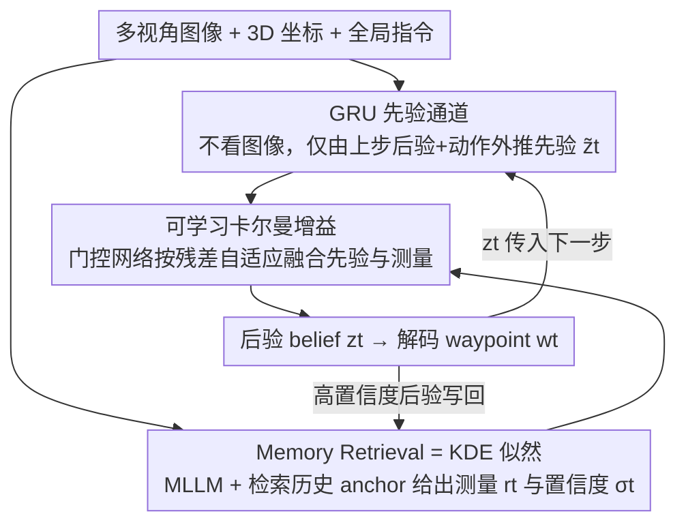

# Mitigating Error Accumulation in Continuous Navigation via Memory-Augmented Kalman Filtering

**会议**: ICML 2026  
**arXiv**: [2602.11183](https://arxiv.org/abs/2602.11183)  
**代码**: https://github.com/yinntag/Neuro-Kalman (有)  
**领域**: 具身智能 / UAV 视觉语言导航 / 状态估计  
**关键词**: 卡尔曼滤波, 记忆库检索, 状态漂移, VLN, 贝叶斯估计

## 一句话总结
把无人机连续 VLN 的 step-by-step 预测重写成"递归贝叶斯估计 = GRU 先验 + 记忆库似然 + 可学习卡尔曼增益"的闭环, 在 TravelUAV 上仅用 10% 数据微调就把 L1-Full 的 SR 从 17.6% 推到 25.9%, 同时把 100 步后还在不断累积的位置漂移压平到 30–40 米。

## 研究背景与动机
**领域现状**：当下的连续 UAV VLN 系统（TravelUAV、OpenVLN、NavFoM 等）基本都是 dead-reckoning 范式——拿当前一帧多视角图像 + 全局指令, 直接预测下一个 waypoint, 再把新位置 plug 回去做下一步, 一路 roll-out 出完整轨迹。

**现有痛点**：这种开环 roll-out 的最大问题是**误差会沿着时间复利累加**。任何一步的偏差都会污染下一步的"内部位置信念", 而全局语言指令是从初始位置规划的, 一旦内部信念漂离真实坐标, 后续 waypoint 就会和语言指令的 grounding 全部错位, 论文叫这个现象 "state drift", 实测在 >100 步后位置 L2 误差呈线性发散直到撞墙。

**核心矛盾**：现有方法把所有精力都堆在"如何把先验估计做得更准"上（更大的 MLLM、更多预训练数据）, 却**没有任何显式的纠错机制**——预测一旦输出就直接被相信, 没有一个 update step 用观测来反向修正先验。这正好对应贝叶斯滤波里"只有 prediction, 没有 update"的退化情形。

**本文目标**：(1) 把 navigation 显式建模成 Bayes filter $P(\mathbf{z}_t|o_{1:t}, w_{1:t-1}) \propto P(o_t|\mathbf{z}_t) P(\mathbf{z}_t|\mathbf{z}_{t-1}, w_{t-1})$; (2) 在不更新模型权重的前提下, 用历史观测在线纠正当前信念; (3) 在 10% 训练数据下也能跑赢 100% 数据的 baseline。

**切入角度**：作者注意到一个被普遍忽略的数学等价——**attention-based memory retrieval 本质上就是 Nadaraya-Watson 核回归对似然 $P(o_t|\mathbf{z}_t)$ 的核密度估计**。这意味着只要把一个 memory bank 接上 softmax attention, 就免费拿到了一个似然估计器, 完全不需要学习一个显式的概率模型。

**核心 idea**：用"GRU 先验 + 检索得到的历史 anchor 似然 + 可学习卡尔曼增益"的三段式架构, 把卡尔曼滤波的 prediction-update 循环直接搬到 VLN 的隐空间里, 让模型在每一步都用历史观测把当前 belief 拉回真实流形。

## 方法详解

### 整体框架
NeuroKalman 要解决的是连续 VLN 里 belief state 沿时间不断漂走的问题, 做法是把每一步的 waypoint 预测从"一次性开环外推"改写成"先验外推 + 历史观测纠正"的递归贝叶斯滤波闭环。输入是每步的多视角图像 $v_t$、当前 3D 坐标 $p_t$ 和全局指令 $l$, 模型在一个 $d$ 维潜在 belief state $\mathbf{z}_t$ 上工作：先由 GRU 不看图像地外推一个先验 $\tilde{\mathbf{z}}_t$, 再由 MLLM 结合当前视觉和从 memory bank 检索回来的历史 anchor 给出测量 $\mathbf{r}_t$ 与置信度 $\sigma_t$, 最后用一个可学习卡尔曼增益把两者融成后验 $\mathbf{z}_t$, 解码出 waypoint $w_t$ 并把 $\mathbf{z}_t$ 传给下一步, 形成 prediction-update 的滤波循环。

### 关键设计

**1. GRU 先验通道：把 dead-reckoning 隔离成纯运动学证据**

误差累积的根源在于先验和测量纠缠在一起、无法独立纠错, 所以这条通道刻意"瞎跑"——只吃上一步后验和上一步动作、完全不接当前视觉: $\mathbf{h}_t = \mathrm{GRU}([\mathbf{z}_{t-1}, \mathbf{w}_{t-1}], \mathbf{h}_{t-1})$, $\tilde{\mathbf{z}}_t = \mathrm{MLP}_{prior}(\mathbf{h}_t)$。这样先验就是一条纯运动学的外推, 视觉信息被完整留给 update 通道当作另一份独立证据。之所以非要切干净, 是因为一旦先验里混进视觉, "预测"和"测量"就不再独立, 卡尔曼融合赖以成立的最优性前提就破了; 同时 GRU 的时间递归天然带来平滑性, 能帮后面的融合滤掉测量里的高频噪声。

**2. Memory Retrieval = KDE 似然：把 attention 解释成非参贝叶斯估计**

似然 $P(o_t|\mathbf{z}_t)$ 在高维视觉空间里几乎无法写出显式概率模型, 本文绕开这个难题的办法是用样本去做核密度估计。作者从 Nadaraya-Watson 核回归出发, 把对 memory bank $\mathcal{M} = \{(\mathbf{k}_i, \mathbf{v}_i)\}_{i=1}^{N}$ 的检索写成 $\hat{\mathbf{z}}_{evi} = \sum_i \mathcal{K}(\mathbf{f}_t, \mathbf{f}_i) \mathbf{f}_i / \sum_j \mathcal{K}(\mathbf{f}_t, \mathbf{f}_j)$, 一旦取核函数 $\mathcal{K}(\mathbf{x}, \mathbf{y}) = \exp(\mathbf{x}^\top \mathbf{y}/\sqrt{d})$, 这个式子就**精确退化成 softmax attention**——也就是说 attention 不是工程 trick, 而是对似然做 KDE 的离散实现。这个等价的好处是似然估计器免费挂进了 MLLM pipeline, 而 memory bank 里存的是已评估过的固定 anchor、不需要梯度更新, 天然适合 test-time 在线纠正。写入则用 post-correction 策略：只有 $\sigma_t > 0.5$ 的后验对应视觉特征才写回, 让证据库永远只收"已被卡尔曼修正、模型又自报高置信度"的样本, 避免噪声 anchor 污染检索。

**3. 可学习卡尔曼增益：用门控网络替代显式协方差噪声模型**

经典卡尔曼需要显式估计过程噪声 $\mathbf{Q}$ 和测量噪声 $\mathbf{R}$ 才能算增益, 在深度隐空间里这两个协方差既难定义也难标定, 于是本文直接把增益学出来。把"残差 (innovation)" $\mathbf{r}_t - \tilde{\mathbf{z}}_t$ 和置信度的 MLP 投影 $\phi(\sigma_t)$ 拼起来过一个门控网络, 得到逐维度的增益 $\mathbf{K}_t = \mathrm{Sigmoid}(\mathbf{W}_g [(\mathbf{r}_t - \tilde{\mathbf{z}}_t); \phi(\sigma_t)] + \mathbf{b}_g)$, 再做 $\mathbf{z}_t = \tilde{\mathbf{z}}_t + \mathbf{K}_t \odot (\mathbf{r}_t - \tilde{\mathbf{z}}_t)$ 完成 Bayesian update——这与经典卡尔曼 $\mathbf{z}_{post} = \mathbf{z}_{prior} + \mathbf{K}_t(\mathbf{y}_t - \mathbf{H}\mathbf{z}_{prior})$ 在 $\mathbf{H} = \mathbf{I}$ 时代数上完全等价。可学习增益的价值在消融里很直观: 固定增益全线翻车, $\mathbf{K}_t = 0.1$ 几乎只信先验导致灾难性 drift (SR=0%), $\mathbf{K}_t = 0.9$ 几乎只信测量又吃不到时间平滑 (SR=18%); 把增益交给 innovation 大小自适应, 模型才能逐步、逐维度地在"侧重平滑"和"侧重纠偏"之间切换, 跨噪声 regime 都稳。

### 损失函数 / 训练策略
冻结 EVA-CLIP 视觉 backbone 和 Vicuna-7B 语言 backbone, 只对 visual projector、waypoint predictor 和 LoRA 层算梯度; 在主 waypoint loss 之外, 额外加 $L_1$ 监督同时作用在先验 $\tilde{\mathbf{z}}_t$ 和测量 $\mathbf{r}_t$ 上 (系数 0.2), 强迫两条通道都能独立预测 waypoint, 防止其中一条被 free-ride。Adam, lr=$5\mathrm{e}{-5}$, batch=16, 4×A6000。所有实验都是先用 100% 数据预训练, 再在固定的 10% 训练轨迹子集上微调。

## 实验关键数据

### 主实验

TravelUAV 的 UAV-Need-Help 基准: 12,149 条人操轨迹, 20 个训练场景 + 2 个 Unseen-Map 场景, 89 个物体类别; 度量 NE↓ (米)、SR↑、OSR↑、SPL↑; 难度按距离 <250 m / ≥250 m 分 Easy/Hard, 按指令辅助强度分 L1/L2/L3。

| 划分 | 方法 | NE↓ | SR↑ | OSR↑ | SPL↑ |
|---|---|---|---|---|---|
| L1 Test-Seen Full | TravelUAV (100% 数据) | 106.28 | 16.10 | 44.26 | 14.30 |
| L1 Test-Seen Full | TravelUAV-FT (10% 数据) | 99.79 | 17.56 | 41.89 | 14.71 |
| L1 Test-Seen Full | OpenVLN | 125.97 | 14.39 | 28.03 | 12.94 |
| L1 Test-Seen Full | **NeuroKalman (10% 数据)** | **71.56** | **25.86** | **58.73** | **22.43** |
| L1 Test-Seen Hard | TravelUAV-FT | 143.85 | 13.70 | 36.85 | 12.15 |
| L1 Test-Seen Hard | **NeuroKalman** | **105.07** | **20.11** | **53.90** | **18.21** |
| L1 Unseen-Object | NavFoM | 108.04 | 29.83 | 47.99 | 27.20 |
| L1 Unseen-Object | **NeuroKalman** | **71.01** | **32.48** | **60.82** | **28.50** |
| L1 Unseen-Map | TravelUAV-FT | 117.84 | 4.68 | 19.03 | 3.17 |
| L1 Unseen-Map | **NeuroKalman** | **100.32** | **8.34** | **34.15** | **7.12** |

最猛的一组对比是 Test-Seen-Hard: 10% 数据微调下 NeuroKalman 的 SR (20.1%) 已经超过 100% 数据训练的 TravelUAV (12.8%), NE 从 152 降到 105。

### 消融实验

| 配置 | NE↓ | SR↑ | 说明 |
|---|---|---|---|
| $\mathbf{K}_t = 0.1$ (只信先验) | 217.09 | 0.00 | 没纠正, 全程漂走, 完全不能 navigate |
| $\mathbf{K}_t = 0.5$ (固定均权) | 83.14 | 24.12 | 比 baseline 好, 但还没自适应增益强 |
| $\mathbf{K}_t = 0.9$ (主要信测量) | 100.96 | 18.05 | 丢了时间平滑性, 检索噪声反噬 |
| **可学习 $\mathbf{K}_t$** | **71.56** | **25.86** | 自适应调权 |
| memory 长度 $M = 5$ | 84.39 | 21.23 | 历史 anchor 不够 |
| **$M = 10$** | **71.56** | **25.86** | sweet spot |
| $M = 15$ | 77.17 | 23.77 | 引入过时 anchor 反成噪声 |
| 写入阈值 $\sigma_t = 0.3$ | 82.45 | 20.50 | 低门槛, 噪声 anchor 污染 memory |
| **$\sigma_t = 0.5$** | **71.56** | **25.86** | 最佳 |
| TravelUAV + Post-hoc 经典 KF | 96.67 | 18.17 | 输出空间几何平滑只能小幅救命, 必须在 latent 里做 |

### 关键发现
- **学习增益 vs 固定增益的差距高达 25 个 SR 点**——固定 $\mathbf{K}_t = 0.1$ 直接归零, 说明开环 dead-reckoning 不加任何修正就是灾难性的, 而盲信测量也不行, 关键是要有 per-step、per-dimension 的不确定性感知。
- **memory 长度有明显 U 型曲线**, $M = 10$ 最佳; 这暗示着在 100–200 步级别的 UAV 轨迹里, 大约 10 个高质量历史 anchor 已经足够覆盖局部 manifold, 再多反而引入"几十步以前已经过时"的视觉, 干扰 attention。
- **post-hoc 在输出空间套经典卡尔曼 (恒速模型) 只能把 SR 从 16.1% 推到 18.2%**, 远不如 NeuroKalman 的 25.9%; 这是论文最有力的对照——证明纠错必须在 latent 语义空间里做, 而不是在 (x, y, z) 坐标上做几何平滑。
- **drift 曲线**: TravelUAV 的位置 $L_2$ 误差在 100 步后线性发散直到失败终止; NeuroKalman 在初期上升到 ~30–40 米后**stop growing**, 直观地把 Kalman 闭环的效果可视化了。

## 亮点与洞察
- **"attention = KDE likelihood" 的数学等价**是真正的 unifying insight——以前大家都把检索增强当 engineering trick, 这篇明确指出它是非参贝叶斯似然估计的离散化, 让 retrieval-augmented 方法第一次有了概率论解释, 这套观点完全可以迁移到任何"prediction + retrieval"的架构 (RAG-LLM、世界模型、TTA)。
- **post-correction 写入策略**很巧妙: memory 只接受已经被卡尔曼修正过、且模型自报高置信度的样本, 等于让记忆库永远只存"已验证 anchor", 避免传统 retrieval cache 那种"越脏越被检索, 越被检索越脏"的恶性循环。
- **10% 数据反超 100% 数据**这个现象的解释很关键——dead-reckoning 模型在数据多的时候靠的是"记住所有可能的 transition", 一旦数据少就过拟合; 而 NeuroKalman 把"长程一致性"显式当成 inductive bias 编进架构, 不需要数据量去 emerge 这个能力, 这是结构化先验打败 brute-force scaling 的一个干净案例。

## 局限与展望
- 作者承认 GRU 做 prior 在超长 horizon 下会有信息衰减, 但坦率说他们的贡献在贝叶斯纠错框架本身, GRU 可以无痛换成 Transformer/Mamba 等。
- 自己发现的局限: (1) memory bank 的 $M=10$ 调得很硬, 不同场景/任务最优值可能不一样, 没有自适应 $M$ 的机制; (2) post-correction 写入用的是固定 $\sigma_t > 0.5$ 阈值, 早期 trajectory 模型置信度普遍偏低时可能存不下任何 anchor; (3) 实验全部在 AirSim 仿真里, 真实 UAV 上视觉噪声、运动学失配是否还能 hold 没验证; (4) 把 KDE 等价当核心理论亮点, 但实际架构里就是普通 attention, 工程贡献和理论贡献之间的"增量"被某种程度上夸大了。
- 改进思路: 让 memory 写入阈值 $\sigma_t$ 也变成可学习的; 用 contrastive loss 显式拉开 "prior-only" 和 "measurement-only" 两条通道, 进一步保证它们的独立性 (卡尔曼最优融合的前提)。

## 相关工作与启发
- **vs TravelUAV / OpenVLN**: 都是 step-by-step waypoint regression, 没有显式纠错通道, 长 horizon 必然 drift; 本文等于在他们的 backbone 外面套了一层贝叶斯纠错环。
- **vs MapNet / SkyVLN / OpenFly 这类拓扑地图记忆**: 它们把 memory 当"被动 buffer"做特征拼接, 本文则把 memory 当"概率证据"做贝叶斯融合, 是 "passive aggregation" → "active correction" 的范式切换。
- **vs FEEDTTA / FSTTA 等 TTA 方法**: 这些方法靠在线梯度更新模型权重来对抗分布漂移, 在 VLN 里缺乏可靠监督, 容易把已有错误进一步强化; NeuroKalman 不动权重, 只在 belief state 上做修正, 更安全。
- **vs KalmanNet / Backprop-KF 等 Deep Bayesian Filtering**: 他们能学好 transition, 但似然在高维视觉里很难定义; 本文用 KDE-attention 把似然问题彻底交给检索来解, 算是给这条线提供了一个高维视觉版本。

## 评分
- 新颖性: ⭐⭐⭐⭐ "attention = KDE likelihood" 的等价、加把卡尔曼 prediction-update 完整搬进 VLN latent 空间, 是个干净有理论支撑的新视角。
- 实验充分度: ⭐⭐⭐⭐ Seen/Unseen-Map/Unseen-Object 三档 + L1/L2/L3 三档 + drift 可视化 + 多个 ablation, 但只在 TravelUAV 一个 benchmark 上跑略显单薄。
- 写作质量: ⭐⭐⭐⭐ 贝叶斯框架→KDE 等价→架构落地的推导链条非常清晰, 一气呵成。
- 价值: ⭐⭐⭐⭐ 在长 horizon、低数据这两个 VLN 真实痛点上都给出了显著增益, 而且方法可以无痛迁移到其他"先验 + 检索"的 sequential decision 任务。

<!-- RELATED:START -->

## 相关论文

- [\[ICLR 2026\] MARC: Memory-Augmented RL Token Compression for Efficient Video Understanding](../../ICLR2026/autonomous_driving/marc_memory-augmented_rl_token_compression_for_efficient_video_un.md)
- [\[ICML 2026\] Plug-and-Play Label Map Diffusion for Universal Goal-Oriented Navigation](plug-and-play_label_map_diffusion_for_universal_goal-oriented_navigation.md)
- [\[NeurIPS 2025\] Continuous Simplicial Neural Networks](../../NeurIPS2025/autonomous_driving/continuous_simplicial_neural_networks.md)
- [\[CVPR 2026\] Spatial Retrieval Augmented Autonomous Driving](../../CVPR2026/autonomous_driving/spatial_retrieval_augmented_autonomous_driving.md)
- [\[ICCV 2025\] Occupancy Learning with Spatiotemporal Memory](../../ICCV2025/autonomous_driving/occupancy_learning_with_spatiotemporal_memory.md)

<!-- RELATED:END -->
