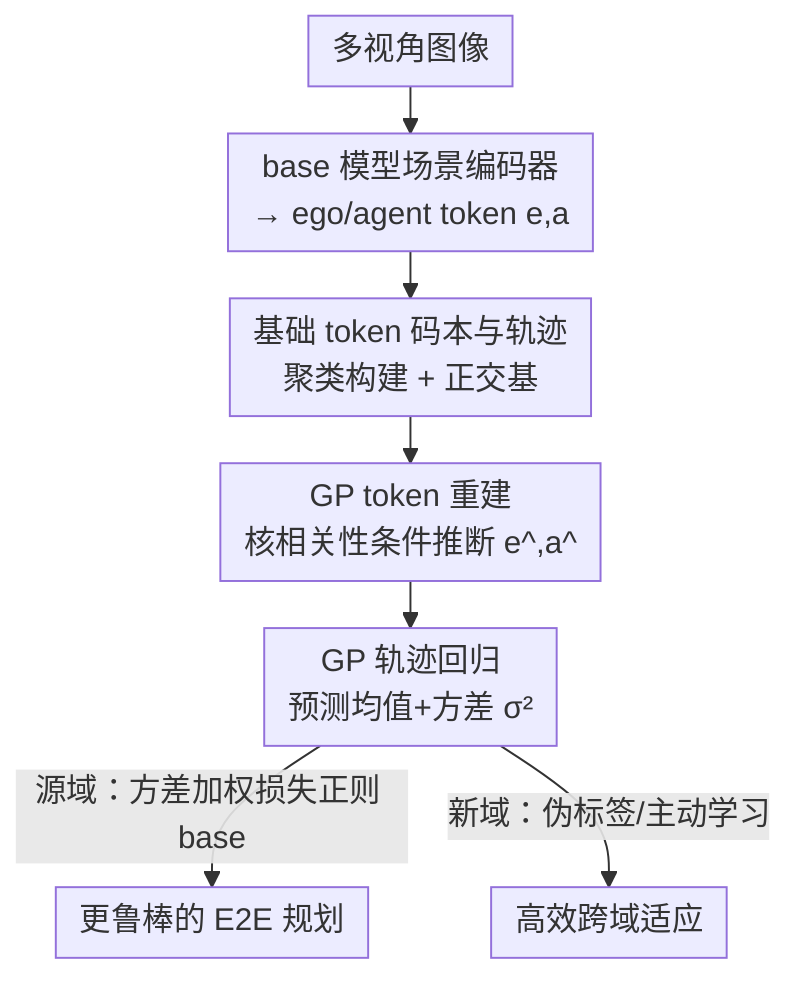

# RoCA: Robust Cross-Domain End-to-End Autonomous Driving

**会议**: ICML 2026  
**arXiv**: [2506.10145](https://arxiv.org/abs/2506.10145)  
**代码**: 待确认  
**领域**: 自动驾驶 / 端到端规划 / 域泛化  
**关键词**: 端到端自动驾驶, 高斯过程, 跨域适应, 不确定性, 长尾鲁棒性

## 一句话总结
RoCA 给端到端自动驾驶模型挂一个基于高斯过程的即插即用模块——学一组覆盖多样驾驶场景的基础 token 及其对应轨迹，对新场景按相似度概率推断未来轨迹，既在源域训练时用 GP 的不确定性正则化提升泛化，又在新域上用伪标签和主动学习高效适应，无需 LLM、不增加推理开销。

## 研究背景与动机

**领域现状**：自动驾驶正从「感知-预测-规划」分模块流水线转向端到端（E2E）联合优化（UniAD、VAD、SparseDrive 等），后者因端到端联合优化整体性能更好。近期一波工作把 LLM/MLLM 接进来，想借其开放世界知识提升长尾鲁棒性。

**现有痛点**：① E2E 模型在罕见场景下鲁棒性差，根源是 nuScenes 等大规模数据集本身长尾——简单事件占主导、安全攸关的极端 case 覆盖少，而标准训练协议又偏向高频场景，进一步压低长尾权重。② 接 LLM 看似能泛化，却带来新麻烦：LLM 并不保证跨域（不同城市/光照/相机/天气）驾驶性能；为新域重训这些巨模型代价高昂、要大量指令数据；而且即便有世界知识，数据不平衡的根本问题若不在训练中显式处理仍然存在。

**核心矛盾**：跨域部署需要的是「对新场景能可靠泛化 + 能低成本适应 + 显式对抗长尾」，而 LLM 路线在这三点上都不理想——它贵、不保证跨域、且没正面解决数据不平衡。

**本文目标**：在**只用多视角图像、不依赖 LLM、不增加推理计算**的前提下，做到三件事——源域训练更鲁棒、跨域泛化更强、新域适应更高效。

**切入角度**：作者不去堆世界知识，而是把「驾驶场景的多样性」显式编码进一个可学习的轨迹码本，并用高斯过程（GP）把「当前场景与已知场景的相似度」变成对未来轨迹的概率推断。GP 天然给出预测方差，可同时当不确定性度量和长尾再加权的依据。

**核心 idea**：用 GP 对「编码 ego/agent 信息的 token」建立联合概率分布——学一组基础 token（basis）及其一一对应的代表轨迹，对任意新场景做一次「相似度 lookup」就能概率地推出未来轨迹；再把 GP 当 teacher 正则化 base 模型、当不确定性指引适应。

## 方法详解

### 整体框架

整个 E2E 流水线 = **base 模型 + RoCA 模块**。base 模型（如 VAD、SparseDrive）含一个场景编码器 $st(\cdot;\theta_{st})$，把多视角图像变成 ego token $\mathrm{e}$ 和 agent token $\mathrm{a}$；以及一个运动规划器 $h(\cdot;\theta_h)$，吃这些 token 预测 ego 与周车轨迹。RoCA 模块 $g(\cdot;\theta_g,\kappa)$ 则在 token 空间上套一个高斯过程：它维护一个可学习的**基础 token 码本**和一一对应的**代表轨迹**，通过核函数 $\kappa$ 计算新场景 token 与基础 token 的相关性，条件推断出未来轨迹及其方差。

训练分两步落地：源域里先正常训好 base 模型，再用「token 重建损失 $\mathcal{L}_{rec}$ + 轨迹监督损失 $\mathcal{L}_{sup}$」训 RoCA，最后把训好的 RoCA 当 teacher、用 $\mathcal{L}_{gp}$ 对 base 模型做正则化 finetune。新域适应时：有真值就用真值监督 + GP 正则；无真值就纯用 RoCA 产生的伪标签（$\mathcal{L}_{gp}$）更新 base 模型，从而支持离线大批量日志、在线流式两种无监督适应。轨迹预测沿用 anchor-based 方式：先把轨迹分到预定义组（ego 有 $N_{ego}$ 组、agent 有 $N_{agent}$ 组），再预测残差，最终轨迹 = anchor + 残差。

### 关键设计

**1. 基础 token 码本与轨迹：把驾驶场景多样性显式编码成可 lookup 的字典**

针对「数据长尾、模型记不住罕见场景」这个痛点，RoCA 不靠数据量，而是构造一个可学习码本 $\mathcal{B}=\{\mathbf{B}_k=\{\mathrm{b}_{j,k}\}_{j=1}^{C}\}_{k=1}^{N_{code}}$：共 $N_{code}$ 个基础组、每组 $C$ 个 $D$ 维 token，每组代表一种轨迹模式（左转/右转/直行等）。这些基础 token 要学会张成跨场景的 ego/agent token 空间。它们与一组安全轨迹 $\{\mathbf{W}_k\}$ **双射**对应：先从训练集真值采样 $N_{code}\cdot C$ 条代表轨迹，聚类成 $N_{code}$ 组，每组 $\mathbf{W}_k$ 含 $C$ 条相似轨迹，每条轨迹 $\mathrm{w}_{j,k}$ 配一个可学习基础 $\mathrm{b}_{j,k}$。于是「token ↔ 轨迹」的映射被显式刻进字典，新场景来了只需查它最像哪些基础。

**2. 基于 GP 的 token 重建：让基础 token 学会张成真实激活流形**

光有码本不够，得保证基础 token 真的覆盖真实 token 流形——否则 lookup 查不准。RoCA 用 GP 重建来训练基础：给定 base 模型的 $\mathrm{e}$，先用核距离 + MLP（$\text{MLP}(\kappa(\mathrm{e},\mathbf{B}))$ 出分类 logits）把它分到某组 $\mathrm{c}_\mathrm{e}$，再写出 $\mathrm{e}$ 与该组基础 $\mathbf{B}_{\mathrm{c}_\mathrm{e}}$ 的联合高斯分布，得到预测均值（即重建）

$$\hat{\mathrm{e}}=\mathbf{b}_{anchor,c_e}+\kappa(\mathrm{e},\mathbf{B}_{\mathrm{c}_\mathrm{e}})\kappa(\mathbf{B}_{\mathrm{c}_\mathrm{e}})^{-1}\bar{\mathbf{B}}_{\mathrm{c}_\mathrm{e}}$$

与方差 $\sigma_\mathrm{e}^2=\kappa(\mathrm{e})-\kappa(\mathrm{e},\mathbf{B}_{\mathrm{c}_\mathrm{e}})\kappa(\mathbf{B}_{\mathrm{c}_\mathrm{e}})^{-1}\kappa(\mathrm{e},\mathbf{B}_{\mathrm{c}_\mathrm{e}})^\top+\sigma_{noise}^2\mathbb{I}$。重建损失为

$$\mathcal{L}_{rec}=\tfrac{1}{\sigma^2_\mathrm{e}}|\hat{\mathrm{e}}-\mathrm{e}|^2+\log(\sigma_\mathrm{e})+\tfrac{1}{\sigma^2_\mathrm{a}}|\hat{\mathrm{a}}-\mathrm{a}|^2+\log(\sigma_\mathrm{a})+\|\mathbf{B}_{\mathrm{c}_\mathrm{a}}\mathbf{B}_{\mathrm{c}_\mathrm{a}}^\top-\mathbb{I}\|^2+\|\mathbf{B}_{\mathrm{c}_\mathrm{e}}\mathbf{B}_{\mathrm{c}_\mathrm{e}}^\top-\mathbb{I}\|^2,$$

前四项是高斯假设下的极大似然（方差自动给难样本加权），后两项强制基础**正交**以避免冗余坍缩。原始 $\mathrm{e},\mathrm{a}$ 当固定 target、不回传梯度，保证 base 表征不被带偏。

**3. 基于 GP 的轨迹预测：用相似度 lookup 概率地推出未来轨迹**

这是模块的输出环节，机制与重建同构：对新场景 token 先分组，再用 GP 回归推断 ego 轨迹均值

$$\hat{\mathrm{p}}_\mathrm{w}=\mathbf{w}_{anchor,\mathrm{c}_\mathrm{e}}+\kappa(\mathrm{e},\mathbf{B}_{\mathrm{c}_\mathrm{e}})\kappa(\mathbf{B}_{\mathrm{c}_\mathrm{e}})^{-1}\bar{\mathbf{W}}_{\mathrm{c}_\mathrm{e}}$$

与方差 $\sigma_w^2$（形式同上）。注意此处核相关性乘的是**轨迹**码本 $\bar{\mathbf{W}}$ 而非 token 码本——即「当前 token 像哪些基础，就借它们的轨迹按相关性加权」。这种概率形式天然支持泛化：新场景的预测由它与已知基础的相似度决定；而 GP 方差给出有原则的不确定性度量。agent 轨迹同理得到 $\hat{\mathrm{p}}_{w,a},\sigma_{w,a}^2$。

**4. 方差加权监督 + GP-teacher 正则 + 不确定性驱动适应：把方差变成对抗长尾和跨域的杠杆**

GP 吐出的方差不是副产品，而是贯穿训练与适应的核心杠杆。源域监督损失 $\mathcal{L}_{sup}$ 用 $1/\sigma_\mathrm{w}^2$ 给规划/运动损失加权并配 $\log(\sigma_\mathrm{w})$ 项（极大似然），等于**自动给不确定/困难的长尾预测更大权重**，正面纠偏「训练偏向高频场景」；另加 triplet loss $\mathcal{L}_{tpt}$ 把相似驾驶模式拉近、相异（左转 vs 右转）推远，细化嵌入空间。把训好的 RoCA 当 teacher 后，$\mathcal{L}_{gp}$ 让 base 模型的预测去对齐 GP 的概率预测（含 KL 散度项 $D_{KL}$），起到正则化、抗训练噪声的作用。适应阶段：有真值用 $\mathcal{L}=\mathcal{L}_{sup}+\mathcal{L}_{gp}$；无真值仅用 $\mathcal{L}_{gp}$ 做无监督更新；主动学习里则用 GP 方差挑「最不确定/最有信息量」的数据优先标注微调，让跨域适应既准又省。

### 损失函数 / 训练策略
源域三步：① 标准训 base；② 用 $\mathcal{L}_{rec}+\mathcal{L}_{sup}$ 训 RoCA（基础 token、MLP、核参数）；③ 用 $\mathcal{L}_{gp}$ 把 RoCA 当 teacher 正则 finetune base。$\mathcal{L}_{sup}$ 含方差加权的 planning/motion 损失、ego/agent 分类损失、triplet 损失。适应阶段按是否有真值在「真值+GP 正则」与「纯 GP 伪标签」间切换，并支持在线流式与主动学习。

## 实验关键数据

在闭环（Bench2Drive）与开环、跨域（Bench2Drive→nuScenes 模拟到真实、跨城市、图像退化如恶劣天气/低光/运动模糊）多设定下评测，RoCA 作为可插到不同 E2E 模型上的通用框架。

### 主实验

Bench2Drive 220 条挑战路线闭环评测（节选）：

| 方法 | DS↑ | SR↑ | Efficiency↑ | Ability Mean↑ |
|------|-----|-----|-------------|------|
| VAD | 42.35 | 15.0 | 157.94 | 18.07 |
| SparseDrive-S | 51.01 | 27.8 | 103.1 | 36.28 |
| ORION | 77.74 | 54.6 | 151.48 | 54.72 |
| **RoCA (VAD)** | 56.90 | 34.3 | 175.42 | 40.45 |
| **RoCA (SSR)** | 59.81 | 41.0 | 110.61 | 48.98 |
| **RoCA (ORION)** | **80.38** | **58.2** | 181.06 | **61.11** |

挂上 RoCA 后，每个 base 模型的驾驶得分（DS）与成功率（SR）都明显提升：VAD 的 DS 从 42.35→56.90、SR 从 15.0→34.3；接到最强的 ORION 上仍把 DS 推到 80.38、SR 58.2，说明 RoCA 是正交的增益、不挑 base。

### 跨域适应实验

Bench2Drive→nuScenes 模拟到真实迁移（L2/碰撞，越低越好；括号内为**无真值标签**的域适应结果）：

| 方法 | Zero-shot L2↓ | Zero-shot Col.↓ | Fine-tuned L2↓ | Fine-tuned Col.↓ |
|------|------|------|------|------|
| SparseDrive-S | 1.17 | 0.34 | 0.65 | 0.14 |
| DiMA | 0.94 | 0.26 | 0.61 | 0.19 |
| **RoCA (VAD-Tiny)** | **0.85** | **0.24** | 0.63 (0.73) | 0.12 (0.17) |

RoCA(VAD-Tiny) 的 zero-shot L2 0.85、碰撞 0.24 优于一众基线（含用 LLM 的 DiMA）；微调后即便**完全不用目标域真值**（括号值 0.73/0.17）也接近用真值的水平，验证了无监督跨域适应的可行性。

### 关键发现
- **GP 正则带来在域+跨域双重增益**：源域用 GP 的不确定性加权和 teacher 正则，既提升本域规划又增强跨域鲁棒。
- **不确定性是省标注的关键**：用 GP 方差做主动学习挑数据，跨域适应更准也更省，凸显「方差可用」这一设计的实际价值。
- **不依赖 LLM 也能强泛化**：相比 DiMA/ORION 等 LLM 路线，RoCA 仅多视角图像、无额外推理开销，仍在长尾与退化场景上占优。
- **即插即用**：在 VAD/SSR/SparseDrive/ORION 上一致提升，证明是与具体 base 解耦的通用模块。

## 亮点与洞察
- **把 GP 用在 token 空间而非像素/轨迹原始空间**：在 base 模型已抽好的语义 token 上做相似度推断，既保留概率性又不增加推理负担，是巧妙的接入点。
- **基础 token 与轨迹双射 + 正交约束**：码本既覆盖多样场景又不冗余坍缩，让「lookup 推轨迹」既有泛化性又稳定。
- **方差一物多用**：同一个 GP 方差同时充当难样本加权、teacher 不确定性、主动学习采样依据，设计极简却串起训练-适应全链路。
- **无标签也能适应**：用 RoCA 当 teacher 产伪标签更新 base，契合「日志未标注 / 在线流式」的真实部署约束，可迁移到其它需冷启动适应的任务。

## 局限与展望
- **依赖码本与聚类质量**：基础轨迹来自源域真值聚类，若目标域出现源域码本完全未覆盖的全新模式，lookup 可能失准。
- **GP 计算与超参**：核矩阵求逆、$N_{code}/C$、核类型（RBF）等都需调，论文对码本规模的敏感性披露有限。⚠️ 以原文为准。
- **误分组风险**：token 先分组再 GP 推断，分组错误会直接污染轨迹预测（与一般 anchor/路由方法同源的隐患）。
- **改进方向**：让码本在目标域在线增量扩充以覆盖新模式、引入更可扩展的稀疏 GP 近似降低大码本下的开销。

## 相关工作与启发
- **vs LLM 驱动的 E2E（DiMA / ORION 等）**: 他们靠 MLLM 世界知识提升长尾，但贵、不保证跨域、重训成本高；RoCA 不用 LLM、零额外推理开销，用 GP 概率推断显式建模多样性与不确定性，跨域更省更稳。
- **vs 纯视觉 E2E（UniAD / VAD / SparseDrive / SSR）**: 它们效率高但在域移和长尾上吃力；RoCA 作为即插模块挂上去就一致提升 DS/SR，并新增跨域适应能力。
- **vs 传统域适应/归一化方法**: 域不变目标、归一化等手段难处理安全攸关的边缘 case；RoCA 用 GP 不确定性把长尾再加权与数据选择统一进一个概率框架。

## 评分
- 新颖性: ⭐⭐⭐⭐ 把 GP + 可学习轨迹码本用于 E2E 跨域驾驶，视角新且避开 LLM
- 实验充分度: ⭐⭐⭐⭐⭐ 闭环/开环/sim2real/跨城/退化/主动学习多设定，多 base 验证
- 写作质量: ⭐⭐⭐⭐ 框架清晰、公式完整，符号略密
- 价值: ⭐⭐⭐⭐⭐ 不增推理开销、支持无标签适应，部署友好

<!-- RELATED:START -->

## 相关论文

- [\[CVPR 2026\] Percept-WAM: Perception-Enhanced World-Awareness-Action Model for Robust End-to-End Autonomous Driving](../../CVPR2026/autonomous_driving/percept-wam_perception-enhanced_world-awareness-action_model_for_robust_end-to-e.md)
- [\[ICML 2026\] DeepSight: Long-Horizon World Modeling via Latent States Prediction for End-to-End Autonomous Driving](deepsight_long-horizon_world_modeling_via_latent_states_prediction_for_end-to-en.md)
- [\[CVPR 2026\] ActiveAD: Planning-Oriented Active Learning for End-to-End Autonomous Driving](../../CVPR2026/autonomous_driving/activead_planning-oriented_active_learning_for_end-to-end_autonomous_driving.md)
- [\[CVPR 2026\] CausalVAD: De-confounding End-to-End Autonomous Driving via Causal Intervention](../../CVPR2026/autonomous_driving/causalvad_de-confounding_end-to-end_autonomous_driving_via_causal_intervention.md)
- [\[CVPR 2026\] Scaling-Aware Data Selection for End-to-End Autonomous Driving Systems](../../CVPR2026/autonomous_driving/scaling-aware_data_selection_for_end-to-end_autonomous_driving_systems.md)

<!-- RELATED:END -->
