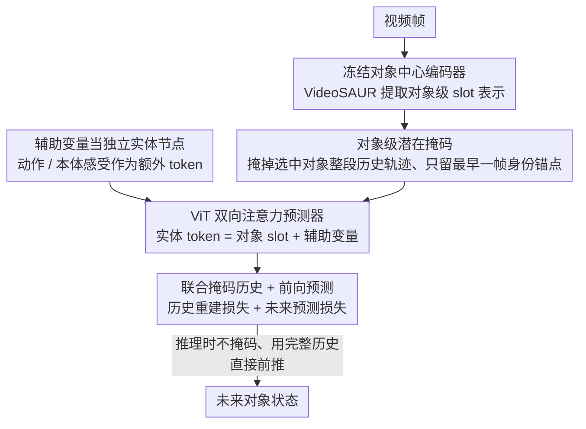

# Causal-JEPA: Learning World Models through Object-Level Latent Masking

**会议**: ICML2026  
**arXiv**: [2602.11389](https://arxiv.org/abs/2602.11389)  
**代码**: https://github.com/galilai-group/cjepa  
**领域**: 因果推理/世界模型  
**关键词**: 世界模型, 对象级掩码, JEPA, 因果归纳偏置, 对象中心表示  

## 一句话总结

提出 C-JEPA，将 JEPA 的掩码预测从图像 patch 级别扩展到对象级别潜在表示，通过对象级掩码作为潜在干预迫使模型学习交互依赖的动态，在反事实推理上比无掩码基线提升约 20%，在控制任务中仅用 1% 的 token 即达到可比性能且规划加速 8 倍以上。

## 研究背景与动机

**领域现状**：世界模型通过在潜在空间中学习、预测和推理环境动态，为可扩展的规划和控制提供统一框架。对象中心表示（如 Slot Attention）作为一种有用的抽象，已被广泛用于学习视觉动态和构建世界模型。

**现有痛点**：单纯使用对象中心表示不足以捕获交互依赖的动态。现有研究表明，如果没有显式引导交互学习的机制，模型容易退化为依赖对象自身动态或利用偶然相关性。现有方法通过分离时间动态和对象交互、正则化注意力稀疏性、利用图结构或依赖下游任务特定方法来强制交互，但这些方案要么引入额外的架构约束，要么依赖重建损失。

**核心矛盾**：现有的 patch 级掩码预测方法（如 I-JEPA、V-JEPA）优化的是局部 patch 相关性，无法强制要求对象级别的交互推理。交互结构如何通过学习目标本身变得功能上必要，仍然是一个开放问题。

**本文目标**：设计一个简单灵活的对象中心世界模型，使交互推理成为最小化预测目标的必要条件，而非通过架构约束或重建损失来强制。

**切入角度**：如果在训练时掩码某个对象的历史潜在轨迹，模型就必须从其他对象的状态演化中推断被掩码对象的状态——这本质上构成了反事实式的预测查询，阻止了平凡的时间插值等捷径。

**核心 idea**：将 JEPA 的掩码预测从 patch 级别提升到对象级别，通过对象级潜在掩码作为观察性干预，迫使预测器依赖交互相关变量，从而引入因果归纳偏置。

## 方法详解

### 整体框架

C-JEPA 想解决的是：对象中心世界模型容易走捷径，只看单个对象自身怎么运动、不去学对象之间的交互。它的做法是把"学交互"变成预测任务本身绕不开的必答题——训练时直接把某个对象在整段历史里的潜在轨迹抹掉，模型要还原它就只能从别的对象怎么演化里反推。整条链路是：冻结的对象中心编码器（如 VideoSAUR）先把视频帧拆成对象级 slot 表示 $S_t = \{s_t^1, \dots, s_t^N\}$，接着对选中的对象在历史窗口内做掩码、只留最早一帧当身份锚点，最后由一个 ViT 风格的双向注意力预测器同时干两件事：补回被掩码的历史 slot、预测未来 slot。推理时不再掩码，直接拿完整历史往前推。

### 关键设计

**1. 对象级潜在掩码：让被掩对象只能靠交互反推**

patch 级掩码（I-JEPA、V-JEPA）优化的是局部 patch 相关性，模型可以靠时间插值蒙混过关，根本不需要理解谁和谁在交互。C-JEPA 把掩码粒度提到对象级别：给定掩码索引集 $\mathcal{M} \subset \{1,\dots,N\}$，被掩对象在整个历史窗口内的 slot 都被替换成掩码 token $\tilde{z}_\tau^i = \phi(z_{t_0}^i) + e_\tau$，其中 $\phi$ 是线性投影，$z_{t_0}^i$ 是最早时间步留下的身份锚点，$e_\tau$ 是带时间位置编码的可学习嵌入。这里身份锚点不是可有可无的细节——slot 表示有置换等变性，如果连最早一帧都抹掉，Transformer 根本不知道是哪个实体被掩了，所以必须保留它来标定身份。掩掉整段轨迹后，模型要恢复这个对象的状态就没有自身历史可依赖，只能去看其他对象怎么动、怎么碰撞，本质上就是在训练里制造了一个反事实式的查询，把"靠自动态插值"这条捷径堵死。

**2. 联合掩码历史 + 前向预测：两项损失把交互推理逼成必要条件**

只掩历史还不够，得让预测目标同时管住"部分可观察下别偷懒"和"正常往前建模"两件事。总损失写成 $\mathcal{L}_{\text{mask}} = \mathcal{L}_{\text{history}} + \mathcal{L}_{\text{future}}$：预测器吃进掩码后的序列 $\bar{Z}_\mathcal{T}$、输出 $\hat{Z}_\mathcal{T} = f(\bar{Z}_\mathcal{T})$，其中 $\mathcal{L}_{\text{history}}$ 只对历史窗口里被掩掉的对象 token 算 L2 重建误差，$\mathcal{L}_{\text{future}}$ 对所有未来 token 算 L2 预测误差。历史项专门压制"在缺信息时退化成只看自动态"的倾向，未来项保证模型还是个正经的前向世界模型。两项一起，交互推理就从"可学可不学"变成最小化这个目标时绕不开的必要条件。

**3. 辅助变量当独立实体节点：动作/本体感受不混进 slot**

动作和本体感受信号该怎么喂给模型是个容易踩坑的点——拼到对象 slot 里会污染对象表示。C-JEPA 把它们当成独立 token：实体集合定义为 $Z_t = \{S_t, U_t\}$，其中 $U_t = \{a_t, p_t\}$ 装动作 $a_t$ 和本体感受 $p_t$，这些辅助变量作为额外的条件 token 直接进注意力计算，而不和对象 slot 混在一起。这样既保住了对象表示的纯净，又让模型能显式建模"动作如何作用到对象"的交互；实验里这种独立实体的处理方式明显优于拼接做法。

## 实验关键数据

### 主实验——CLEVRER 视觉问答

| 模型 | 编码器 | 掩码数 $\|\mathcal{M}\|$ | 整体准确率 (%) | 反事实 per-opt (%) | 反事实 per-que (%) |
|------|--------|------|---------|---------|---------|
| OC-JEPA | VideoSAUR | 0 | 82.79 | 79.53 | 47.68 |
| C-JEPA | VideoSAUR | 4 | **89.40** | **88.67** | **68.81** |
| SlotFormer | SAVi | — | 79.44 | 79.28 | 47.29 |
| SlotFormer (无重建) | SAVi | — | 44.94 | 55.62 | 11.10 |
| OCVP-Seq | SAVi | — | 83.11 | 83.21 | 56.06 |
| C-JEPA | SAVi | 2 | **83.88** | **85.16** | **60.19** |

### Push-T 机器人操控任务

| 模型 | Token 数 × 维度 | 成功率 (%) | 规划时间 |
|------|-----------------|-----------|---------|
| DINO-WM | 196 × 384 | 91.33 | 5763 秒 |
| DINO-WM-Reg. | 196 × 384 | 88.00 | — |
| OC-DINO-WM | 6 × 128 | 60.67 | — |
| OC-JEPA | 6 × 128 | 76.00 | — |
| C-JEPA | 6 × 128 | **88.67** | **673 秒 (8×加速)** |

### 关键发现
- 对象级掩码的增益在反事实推理上最为显著：反事实 per-question 准确率从 47.68% 提升到 68.81%（+21.13%），远大于整体准确率提升（+6.61%），说明掩码确实增强了反事实推理而非仅提高预测精度
- 过度掩码会移除有意义的依赖关系：使用 SAVi 编码器时掩码 4 个对象反而下降 4%，说明最优掩码比例取决于编码器的表示质量
- C-JEPA 仅用 1.02% 的 token 空间（6×128 vs 196×384）即达到与 patch 级世界模型可比的控制性能，规划速度提升超 8 倍
- SlotFormer 去掉重建损失后性能暴跌 34.5%，说明其严重依赖像素级监督；C-JEPA 完全不需要重建损失

## 亮点与洞察
- **对象级掩码即潜在干预**：将掩码操作重新诠释为对预测器观察性的干预，本质上在训练中制造反事实查询。这一视角巧妙地将自监督掩码学习与因果推理联系起来，且不需要真实的因果图或多环境数据
- **效率-性能兼得**：对象中心表示将 token 数从 196 降到 6，结合对象级掩码恢复了因表示压缩而损失的性能，实现了 8 倍规划加速。这一范式对实时机器人控制有直接价值
- **影响邻域理论**：形式化了"最小充分上下文变量集"的概念，证明对象级掩码使交互推理成为最优预测的必要条件，为掩码策略提供了理论基础

## 局限与展望
- 性能受限于对象中心编码器质量：SAVi 编码器上过度掩码导致性能下降，说明编码器的表示能力是系统瓶颈
- 未在具有显式时间因果图的数据集上验证影响邻域的正确性
- 实验场景相对简单（CLEVRER 合成视频、Push-T 2D 操控），更复杂的 3D 场景和多智能体交互有待验证
- 未来方向：联合微调对象中心编码器避免表示坍塌；扩展到更复杂的交互环境

## 相关工作与启发
- **JEPA 系列**：I-JEPA → V-JEPA → V-JEPA2，本文将 JEPA 首次与对象中心世界模型结合
- **DINO-WM**：patch 级世界模型基线，性能好但 token 开销大；C-JEPA 用对象级表示实现了等价性能
- **SlotFormer / OCVP-Seq**：对象中心世界模型前作，依赖重建损失或架构分离来引导交互学习
- **启发**：对象级掩码作为归纳偏置的思路可迁移到其他需要交互推理的领域，如多智能体强化学习、社会行为预测、分子动力学模拟等

<!-- RELATED:START -->

## 相关论文

- [\[ICLR 2026\] Distributional Equivalence in Linear Non-Gaussian Latent-Variable Cyclic Causal Models](../../ICLR2026/causal_inference/distributional_equivalence_in_linear_non-gaussian_latent-variable_cyclic_causal_.md)
- [\[ICLR 2026\] Beyond DAGs: A Latent Partial Causal Model for Multimodal Learning](../../ICLR2026/causal_inference/beyond_dags_a_latent_partial_causal_model_for_multimodal_learning.md)
- [\[NeurIPS 2025\] Bi-Level Decision-Focused Causal Learning for Large-Scale Marketing Optimization](../../NeurIPS2025/causal_inference/bi-level_decision-focused_causal_learning_for_large-scale_marketing_optimization.md)
- [\[ECCV 2024\] Understanding Physical Dynamics with Counterfactual World Modeling](../../ECCV2024/causal_inference/understanding_physical_dynamics_with_counterfactual_world_modeling.md)
- [\[ICLR 2026\] Adjusting Prediction Model Through Wasserstein Geodesic for Causal Inference](../../ICLR2026/causal_inference/adjusting_prediction_model_through_wasserstein_geodesic_for_causal_inference.md)

<!-- RELATED:END -->
