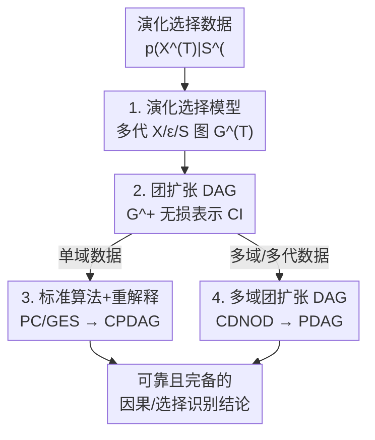

# Causal Modeling of Selection in Evolution

**会议**: ICML2026  
**arXiv**: [2606.05689](https://arxiv.org/abs/2606.05689)  
**代码**: 待确认  
**领域**: 因果推断 / 因果发现  
**关键词**: 选择偏差, 演化选择, 因果发现, 图模型, 条件独立

## 一句话总结
论文指出"选择"其实分**静态选择**（一次性过滤）和**演化选择**（多代差异繁殖累积）两种，现有图模型把二者混为一谈、在演化数据上会得出错误的因果发现；作者定义了显式刻画演化的因果图模型，并证明它的条件独立约束可以用一个"团扩张 DAG"无损表示，从而能直接套用标准 PC/GES/CDNOD 算法、只需重新解释输出。

## 研究背景与动机

**领域现状**：因果发现要从观测数据里识别因果关系，但观测到的依赖未必来自因果——一个关键干扰源就是**选择（selection）**：数据是被某种系统性、往往不可观测的机制"挑"出来才被看到的。主流做法（FCI 及其各种扩展）统一用同一套图建模：在原因果图上额外加入代表选择的二值指示变量 $S$，把"被选中"建模为对 $S=1$ 取条件，再用条件下的图约束做发现。

**现有痛点**：这套范式把所有选择都当成**一次性过滤**来处理。但作者论证，现实里"选择"叙事其实有两种形态：

- **静态选择**：从全局总体中一次性抽出一个子总体，如政治调查中"邮寄/电话招募偏向某教育收入群体"的志愿者偏差。这类用标准图模型刻画是对的。
- **演化选择**：通过**多轮差异化繁殖适应度**反复作用，观测数据是被一段历史轨迹塑造出来的"最新一代"，如免疫适应、抗生素耐药、工业革命时曼彻斯特深色蛾增多、社会规范涌现。

**核心矛盾**：演化选择下，观测数据**不是任何固定时刻全局总体的子集**，而是经历了多代"选择—繁殖—遗传"后存活下来的一代。繁殖与选择耦合，会通过遗传在当代数据里留下**额外的条件依赖**，这是一次性过滤的静态模型无法刻画的。直接套静态模型会把这些依赖误读成直接因果关系或直接被选——即**假阳性发现**（Lemma 1）。

**本文目标**：(1) 形式化定义能表示演化选择数据生成过程的因果图模型；(2) 刻画它在数据中蕴含的条件独立（CI）约束；(3) 给出可靠（sound）且完备（complete）的识别流程，并把单域推广到多代/多环境的异质数据。

**核心 idea**：用显式的多代图 $\mathcal{G}^{(T)}$ 描述演化，然后证明它对观测变量的全部 CI 约束**等价于**在一个去掉了隐变量和选择变量的"团扩张 DAG" $\mathcal{G}^+$ 上的 d-分离——于是识别算法退化成标准形式，只是结论解释要换一套语义。

## 方法详解

### 整体框架

论文要解决的是：当数据是演化选择的产物时，怎样的因果图模型才正确、又怎样从数据里识别它。整条逻辑链是：**先定义演化选择模型 $\mathcal{G}^{(T)}$（说清数据怎么生成）→ 证明它的 CI 约束可被一个普通 DAG（团扩张 DAG $\mathcal{G}^+$）无损表示 → 因此直接跑标准因果发现算法、再按新语义重新解释输出 → 单域推广到多域以提升可识别性**。

### 关键设计

**1. 演化选择模型：用多代图把"选择—繁殖—遗传"显式画出来**

针对"静态模型刻画不了演化"这个根本痛点，作者定义了演化选择模型 $\mathcal{G}^{(T)}$（Definition 1）。它从一个静态图 $\mathcal{G}$（顶点 $X\cup\{S\}$，仅作直观摘要用）展开成一个跨 $T$ 代的 DAG，含三类顶点：各代性状变量 $X^{(t)}$、各代外生可遗传因子 $\epsilon^{(t)}$（如基因、家族资源，通常不可观测，作为结构因果模型的噪声项）、二值繁殖指示 $S^{(t)}$（$S^{(t)}=1$ 表示第 $t$ 代个体成功繁殖、把 $\epsilon^{(t)}$ 传给下一代）。四类边分别是：代内性状因果 $X^{(t)}_i\to X^{(t)}_j$、性状影响繁殖 $X^{(t)}_i\to S^{(t)}$、外生因子驱动性状 $\epsilon^{(t)}_i\to X^{(t)}_i$、以及遗传/变异 $\epsilon^{(t)}_i\to\epsilon^{(t+1)}_i$。观测数据被定义为 $p(X^{(T)}\mid S^{(0)}=\cdots=S^{(T-1)}=1)$，简写 $p(X^{(T)}\mid S^{(<T)}=1)$——即"所有祖先代都成功繁殖"这一条件下的最新一代。

这个建模有几个巧妙的取舍：繁殖数量被抽象掉，因为多个后代可看成给定亲代 $X^{(t)}$ 下从 $X^{(t+1)}$ 的 i.i.d. 抽样，"生几个"可通过重加权等价吸收进 $p(S^{(t)}=1\mid X^{(t)})$；机制允许跨代变化（曼彻斯特蛾在污染期/治理后适应度反转），但即便不变，后面的马尔可夫性质照样成立；遗传因子被假设独立作用（为可识别性，作者承认这是局限）。关键论断是 Lemma 1：若 $\mathcal{G}^{(T)}$ 中成立 d-分离 $A^{(T)}\perp_d B^{(T)}\mid C^{(T)},S^{(<T)}$，则 $\mathcal{G}$ 中必有 $A\perp_d B\mid C,S$，但**反之不成立**——演化会引入静态模型里没有的额外依赖，正是它导致假发现。

**2. 团扩张 DAG：把无穷代图的 CI 压缩成一个普通 DAG**

$\mathcal{G}^{(T)}$ 随 $T$ 增长、含大量隐变量，直接分析很重。作者证明它对观测变量的 CI 结构其实可以被一个**仅在 $X$ 上、无隐变量无选择变量**的 DAG 精确表示，称为团扩张 DAG $\mathcal{G}^+$（Definition 2）：取一个对 $\mathcal{G}$ 拓扑的排序 $\pi$，则 $X_i\to X_j\in\mathcal{G}^+$ 当且仅当 $X_i\to X_j\in\mathcal{G}$，或者 $\{X_i,X_j\}\subseteq\mathrm{an}_{\mathcal{G}}(S)$ 且 $\pi(X_i)<\pi(X_j)$。直白说：**把所有"卷入选择"的变量（$S$ 的祖先）两两连成一个有向团**，这些新增邻接恰好补上了 Lemma 1 里演化引入、而静态图丢失的依赖。

核心结论 Theorem 1：对任意 $T\ge 1$ 和不相交 $A,B,C$，$\mathcal{G}^{(T)}$ 中 $A^{(T)}\perp_d B^{(T)}\mid C^{(T)},S^{(<T)}$ 当且仅当 $\mathcal{G}^+$ 中 $A\perp_d B\mid C$。它带来三个重要推论：① 不同 $T$ 下分布 $p(X^{(T)}\mid S^{(<T)}=1)$ 会变、甚至不收敛，但蕴含的 CI **不变**，所以实践中无需知道数据是第几代、也不必假设演化已达平衡；② 当繁殖完全随机（$\mathrm{pa}_{\mathcal{G}}(S)=\varnothing$）时 $\mathcal{G}^+$ 退化回 $\mathcal{G}$，静态图够用；③ 演化选择只能被**证伪、不能被证实**——永远无法断言某 $X_i$ 卷入了选择，只能断言它**没有**，因为任何 CI 都能用"无选择"的 $\mathcal{G}^+$ 等价表示。作者还特意说明：标准 MAG–FCI 流水线在这里不仅把分析复杂化，还会**不完备**（某些本可识别的结构被当成模糊），所以才另起 $\mathcal{G}^+$ 这套更简洁的刻画。

**3. 复用标准算法 + 换一套解释：识别流程退化但语义升级**

既然全部 CI 都能由不含隐变量/选择的 $\mathcal{G}^+$ 表示，识别就退化成标准形式（Algorithm 1）：把数据当作"从来没有选择和演化"，直接跑 PC 或 GES（或任何在因果充分性+忠实性下可靠完备的非参方法），输出一个 CPDAG。这看似自相矛盾——讲了半天选择复杂性，最后说可以无视？作者强调：复杂性**不在算法构造、而在对输出的解释**。

Theorem 2 给出新语义：邻接的可靠完备性——$X_i,X_j$ 在 CPDAG 中相邻当且仅当二者**有直接因果关系，或都卷入选择**（$\{X_i,X_j\}\subseteq\mathrm{an}_{\mathcal{G}}(S)$）；定向的可靠性——任何被定向的 $X_i\to X_j$ 都是真因果，且 $X_j$ **不卷入选择**；定向的完备性——任何未定向边都无法进一步识别。对比静态设定，这里的"伪依赖"不再只出现在直接被选变量之间，而是被演化**传播到间接卷入选择的变量**；且选择的存在性原则上无法从数据证实（实践中若检测到一个团、其两两直接因果在先验上都不合理，则"共同卷入选择"是有力替代解释）。论文用三个场景强调误用的代价：忽略选择→把所有邻接误读成因果；当成静态用 FCI→漏掉"共同间接卷入选择"的可能、还会期待 PAG 里出现实际永不出现的边型；正确建模演化但默认走 MAG–FCI→对本可识别结构仍输出模糊。

**4. 多域泛化：用机制变化提升可识别性**

针对单域只能识别到 $\mathcal{G}^+$ 的 CPDAG 这一上限，作者把框架推广到异质数据（多代或多环境，统称多域）。先定义"机制跨域变化"（Definition 3：选择机制 $p(S^{(t)}\mid X^{(t)})$ 或某 $X_i$ 的因果机制在不同域参数化不同，变化变量集记 $I$）。然后构造多域团扩张 DAG $\mathcal{G}^{+I}$（Theorem 3）：在 $\mathcal{G}^+$ 上加一个辅助域指示顶点 $\zeta$，对每个 $X_i\in I$ 连 $\zeta\to X_i$；特别地，若选择本身或卷入选择的变量发生变化（$\mathrm{an}_{\mathcal{G}}(S)\cap I\ne\varnothing$），则把 $\zeta$ 连向 $\mathrm{an}_{\mathcal{G}}(S)\setminus\{S\}$ 全体。$\zeta$ 与 $X$ 间的 CI（即分布跨域的不变性）对应 $\mathcal{G}^{+I}$ 里的 d-分离。识别上（Algorithm 2）直接套 CDNOD 等标准多域方法，输出 $X\cup\{\zeta\}$ 上的 PDAG。Theorem 4 证明 Algorithm 2 能定向更多边（且定向全部可识别的），Theorem 2 的全部结论照样成立。两点洞察：选择存在性仍无法证实（$S$ 不出现在 $\mathcal{G}^{+I}$）；当选择变化时，卷入选择的变量在 $\mathcal{G}^{+I}$ 里都被 $\zeta$ 直接"因果"指向——这对应"环境与演化影响性状往往通过改变适应度偏好、而非直接改变性状本身"的常识。

## 实验关键数据

### 静态 vs 演化选择模型的对照

| 维度 | 静态选择模型（现有范式） | 演化选择模型（本文 $\mathcal{G}^{(T)}$） |
|------|--------------------------|------------------------------------------|
| 数据语义 | 全局总体的一次性子集 | 历经多代选择—繁殖的最新一代 |
| 选择结构 | 一次性过滤 $S$ | 跨代繁殖指示 $S^{(t)}$ + 遗传 $\epsilon^{(t)}\!\to\!\epsilon^{(t+1)}$ |
| CI 刻画 | 在 $\mathcal{G}$ 上对 $S$ 取条件 | 等价于团扩张 DAG $\mathcal{G}^+$ 的 d-分离（Thm 1） |
| 演化数据上 | 漏掉额外依赖 → 假发现（Lemma 1） | 可靠完备识别（Thm 2 / 4） |
| 选择存在性 | 有时可确认 | 只能证伪、不能证实 |

### 合成数据：保守解释提升因果邻接精度

合成数据按 Definition 1 生成：先在 $d\in\{10,15,20\}$ 个观测变量上随机 Erdős–Rényi 图（平均度 2），加一个有 $d/5$ 个父节点的选择变量 $S$，用线性 SEM 实例化；每代每样本按 $S^{(t)}$ 的分位名次产生 0–5 个后代，后代继承 $\epsilon^{(t+1)}=\epsilon^{(t)}+$ 单位方差高斯扰动，迭代 $T$ 代。目标是验证 Theorem 2——只有 CPDAG 里**被定向**的边才保证是真因果。

| 配置（$d=20$，50 次随机） | 因果邻接精度 | 说明 |
|----------------------------|--------------|------|
| PC（本文保守解释） | 更高、跨代 $T$ 稳定 | 只把定向边当因果 |
| PC（标准解释） | 偏低 | 把所有邻接当因果，含伪邻接 |
| GES（本文保守解释） | 更高 | 同上 |
| GES（标准解释） | 最低 | GES 倾向输出更密的图、未定向边多 |

### 关键发现
- **本文解释一致优于标准解释**，且精度随代数 $T$ 基本不变，印证 Theorem 1"CI 不随 $T$ 变化"——无需知道数据处于第几代。
- 标准 GES 精度最低，主要因为它输出更稠密、未定向边更多；但其**已定向**的边仍然可靠，与理论一致。
- 真实数据覆盖 7 个数据集（果蝇基因表达 DGRP、人类颅骨 Cranial、玉米 Panzea、哺乳动物 PanTHERIA、鸟类 AVONET、跨国选举调查 CSES、美国人口微数据 PUMS）。学到的子图多与领域知识吻合：如颅骨形状是下游、选择更可能作用在气候与饮食的上游团；鸟喙形态是下游、选择更可能作用于翼/跗骨等运动性状。
- 作者坦承缺乏带真值因果图的演化选择数据集，只能用 DGRP 的 eQTL 配对作部分真值、其余六个用 LLM 生成的伪真值做定量参考，故真实数据评估**以定性为主**。

## 亮点与洞察
- **概念层面的"正名"最有价值**：把长期被混用的"选择"拆成静态/演化两类，并用一个反例（$X_1,X_3$ 在 $\mathcal{G}^{(T)}$ 中经 $\epsilon^{(T)}$ 开放路径 d-连通，却被静态图错误判为 d-分离）说清静态模型为何会假阳性，这种"先证明现有范式错在哪"的写法很有说服力。
- **"复杂建模 → 退化算法"的反转很漂亮**：先把演化图建得很重，再证明 CI 可由无隐变量的 $\mathcal{G}^+$ 表示，于是直接复用 PC/GES/CDNOD——把全部难度从"造新算法"转移到"换解释语义"，工程上几乎零成本。
- **"只能证伪不能证实选择"是可迁移的认识论结论**：它提醒任何做选择偏差分析的人，不要轻易宣称"某变量被选择"，这一保守性可推广到一般观测研究的解读。
- 用 $\zeta$ 辅助节点把"机制跨域变化"编码成 CI、再套标准多域方法，是把异质性转化为可识别性增益的通用套路。

## 局限与展望
- **遗传因子独立假设**：作者明确承认 $\epsilon_i$ 独立作用是为可识别性所做的简化，现实中基因会互相调控、一个性状受多基因控制；放开会消掉大部分可用 CI、需要更强的参数化隐变量模型。
- **选择存在性不可证实**：理论上无法从数据确认某变量卷入选择，只能依赖先验把"团内两两直接因果不合理"解读为"共同卷入选择"，结论带主观成分。
- **真实数据缺真值**：评估以定性为主，定量部分依赖不完整的 eQTL 真值或 LLM 伪真值，说服力受限；亟需带真因果图的演化选择基准数据集。
- 假设因果与选择**结构**跨域固定、只允许参数化变化，对结构本身演变（如新性状出现）尚未覆盖。

## 相关工作与启发
- **vs FCI 及其扩展（局部/序列/干预版）**：它们都在统一的静态选择图上做发现，把选择当一次性过滤；本文证明这在演化数据上会假阳性，并给出专门的演化模型与等价的 $\mathcal{G}^+$ 表示。
- **vs MAG–FCI 标准流水线**：即便正确建模了演化，直接走 MAG–FCI 仍不完备（某些可识别结构被当模糊）；本文改用团扩张 DAG，既简化分析又恢复完备性。
- **vs 演化生物学模型（Fisher 原理、适应度地形、现代综合）**：那些不是因果框架；"演化/互惠因果"文献又偏哲学、缺形式化图处理。本文填补了"用因果图模型刻画并从数据识别演化机制"的空白。

## 评分
- 新颖性: ⭐⭐⭐⭐⭐ 首次形式化区分静态/演化选择并给出等价的团扩张 DAG 表示，概念与理论双新。
- 实验充分度: ⭐⭐⭐⭐ 合成数据严谨验证理论，真实数据覆盖 7 个领域，但缺真值、定量评估偏弱。
- 写作质量: ⭐⭐⭐⭐⭐ 用反例和自问自答把抽象图论讲得清晰，三场景误用分析很到位。
- 价值: ⭐⭐⭐⭐⭐ 纠正了被广泛默认的建模错误，对生物/社会等所有含世代过程的因果发现有方法论意义。

<!-- RELATED:START -->

## 相关论文

- [\[ICML 2026\] Towards a Holistic Understanding of Selection Bias for Causal Effect Identification](towards_a_holistic_understanding_of_selection_bias_for_causal_effect_identificat.md)
- [\[ICML 2025\] Latent Variable Causal Discovery under Selection Bias](../../ICML2025/causal_inference/latent_variable_causal_discovery_under_selection_bias.md)
- [\[AAAI 2026\] Causal Inference Under Threshold Manipulation: Bayesian Mixture Modeling and Heterogeneous Treatment Effects](../../AAAI2026/causal_inference/causal_inference_under_threshold_manipulation_bayesian_mixtu.md)
- [\[ECCV 2024\] Understanding Physical Dynamics with Counterfactual World Modeling](../../ECCV2024/causal_inference/understanding_physical_dynamics_with_counterfactual_world_modeling.md)
- [\[ICML 2026\] Controllable Generative Sandbox for Causal Inference](controllable_generative_sandbox_for_causal_inference.md)

<!-- RELATED:END -->
