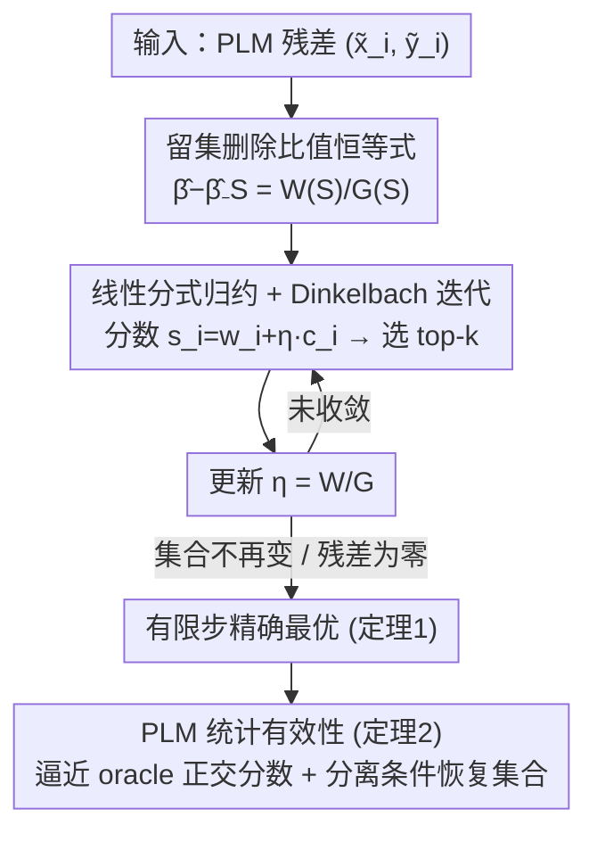

# Finding Most Influential Sets

**会议**: ICML2026  
**arXiv**: [2606.05919](https://arxiv.org/abs/2606.05919)  
**代码**: https://github.com/nk027/findingMIS  
**领域**: 因果推断 / 数据归因 / 影响诊断 / 组合优化  
**关键词**: 最具影响力集合（MIS）、留集删除、线性分式优化、Dinkelbach 方法、偏线性模型、Neyman 正交  

## 一句话总结
要找"删掉后最大改变某个估计量的 size-$k$ 子集"（最具影响力集合 MIS）本来需要在 $\binom{n}{k}$ 个子集里穷举、根本算不动；本文证明只要留集删除效应能写成**线性分式**形式，MIS 选择就坍缩成一串"选 top-$k$"的子问题，用 Dinkelbach 方法做到每轮 $\mathcal{O}(n)$、有限步终止，并在偏线性模型里给出从"固定输入精确最优"到"统计意义上恢复 oracle 集合"的完整理论保证。

## 研究背景与动机
**领域现状**：最具影响力集合（Most Influential Sets, MIS）是这样一类训练子集——删掉它们会让某个目标量（回归系数、处理效应、预测值）产生最大变化。它是可解释性、问责、公平性、鲁棒性审计、数据筛选的目标特异诊断工具：能告诉你"是哪一小撮样本在驱动结论"。

**现有痛点**：精确找 MIS 要在 $\binom{n}{k}$ 个子集上取最大值，组合爆炸到连中等规模数据都算不动——例如评 $\binom{100}{10}$ 个集合、每个 1 微秒也要约 200 天，$k{=}11$ 就涨到约 4.5 年。于是文献要么退而求其次用鲁棒估计去"控制"最坏敏感性而非"识别"它，要么用一阶近似（影响函数）和贪心启发式。

**核心矛盾**：集合影响和单点影响**本质不同**，因为样本之间会交互——有些点互相加强，有些点互相掩盖。两种坏现象由此而生：一是**联合影响**（joint），单看每个点都不重要，一起删才爆发；二是**掩盖**（masking），某些点在单点排序里显得无关紧要，只有在别的点被删掉之后影响才浮现。结果是：影响函数这类一阶/单点近似会漏掉联合与掩盖；贪心选择（每步加边际增益最大的点）隐含假设"不同 $k$ 的最优集是嵌套的"，但边际增益同时依赖当前集合的分子和分母，早期错误选择会把最优 size-$k$ 集合永久排除。

**贪心为什么会失败（论文的反例）**：找 $n{=}5$ 的 3-MIS 时，点 A 是单点影响最大的，贪心第一步就选它、此后搜索被锁死在含 A 的集合里；但真正的最优 3-MIS 是最左边三个点——它们单看都不如 A，影响是联合且被掩盖的，凑齐三个才累积出足够的分数、删掉足够的曲率把拟合线压平。贪心选了 A 就回不了头，永远找不到这个最优集。

**本文目标**：为"留集删除效应能写成比值形式"的影响目标，造一个高效、精确的 size-$k$ MIS 选择算法，并把它从"固定输入的优化精确性"一路接到"统计上恢复真正的 oracle 影响集"。

**核心 idea**：留集删除效应是关于被删集合的**线性分式函数**，于是组合搜索可以转成一维参数优化——用 Dinkelbach 方法，每个子问题退化成"选 top-$k$ 个分数"，从而 $\mathcal{O}(n)$ 每轮、有限步收敛。

## 方法详解

### 整体框架
方法建立在偏线性模型（PLM，即去偏机器学习/DML 的标准设定）上：$y_i = x_i\beta_0 + g_0(Z_i) + u_i$，其中 $x_i$ 是处理、$\beta_0$ 是关心的参数、$g_0$ 是协变量 $Z_i$ 的未知扰动函数。用一阶残差化（Robinson 估计）把 $y,x$ 都减去对 $Z$ 的拟合得到残差 $\tilde y_i,\tilde x_i$，二阶段就是 $\tilde y$ 对 $\tilde x$ 的 OLS：$\hat\beta = \sum \tilde x_i\tilde y_i / \sum \tilde x_i^2$。整条方法链是这样转的：先证明"删掉集合 $\mathbb{S}$ 后 $\hat\beta$ 的变化"有一个**精确的有限样本比值恒等式**（不是影响函数近似），分子是被删走的分数、分母是剩下的残差曲率；这个比值是线性分式的，于是把"在 $\binom{n}{k}$ 里找最大比值"用 Dinkelbach 方法转成"对一个标量参数 $\eta$ 反复选 top-$k$ 分数 + 更新 $\eta$"的迭代；再证这个迭代有限步、精确解出固定输入下的全局最优；最后处理一个统计问题——经验输入是用估计的扰动函数残差化来的，借 Neyman 正交说明经验目标一致逼近 oracle 正交分数目标、在分离条件下能精确恢复 oracle 集合。

### 关键设计

**1. 留集删除的比值恒等式：把"删一个集合改变多少"写成精确的分数/曲率比**

这是全文的支点。对固定的残差化输入 $(\tilde x_i,\tilde y_i)$，删掉集合 $\mathbb{S}$ 后系数的精确变化是

$$\hat\beta-\hat\beta_{-\mathbb{S}}=\frac{\sum_{s\in\mathbb{S}}\tilde x_s\tilde r_s}{\sum_{t\notin\mathbb{S}}\tilde x_t^2},\qquad \tilde r_s := \tilde y_s-\hat\beta\tilde x_s.$$

它从全样本正规方程减去 $\mathbb{S}$ 的贡献直接推出，是**精确的有限样本删除恒等式，而非无穷小影响函数近似**——这点关键，因为影响函数对极端影响和集合影响本就不准。恒等式把两种机制分离开：分子 $W(\mathbb{S})=\sum_{s\in\mathbb{S}}\tilde x_s\tilde r_s$ 是从正规方程里被移走的"分数"，分母 $G(\mathbb{S})=\sum_{t\notin\mathbb{S}}\tilde x_t^2$ 是删除后剩下的"残差曲率"。于是一个集合之所以有影响，要么因为它删走了一批方向一致的大分数，要么因为它删走了高曲率样本、放大了剩余的分数不平衡。$W$ 和 $G$ 各自可加，但它们的比值不可加——正是这种不可加性数学化地解释了联合影响和掩盖：边际删一个 $i$ 的增益 $\frac{W+w_i}{G-c_i}-\frac{W}{G}$ 里，第二项依赖 $\mathbb{S}$ 已累积的分数，所以一个点的价值会随"和谁一起删"而变。

**2. 线性分式归约 + Dinkelbach 迭代：把组合搜索压成一串"选 top-$k$"**

痛点是直接在 $\binom{n}{k}$ 上最大化比值算不动。本文把影响分量映射成权重和成本 $w_i:=\tilde x_i\tilde r_i$、$c_i:=\tilde x_i^2$、$T:=\sum_i c_i$，于是目标 $\frac{W(\mathbb{S})}{G(\mathbb{S})}=\frac{\sum_{i\in\mathbb{S}}w_i}{T-\sum_{i\in\mathbb{S}}c_i}$ 是标准线性分式（假设 1：$G(\mathbb{S})>0$，否则用岭稳定的 $G+\lambda$）。用 Dinkelbach 方法引入辅助参数 $\eta$，定义 $F_\eta(\mathbb{S})=W(\mathbb{S})-\eta G(\mathbb{S})=\sum_{i\in\mathbb{S}}(w_i+\eta c_i)-\eta T$。由于 $-\eta T$ 与 $\mathbb{S}$ 无关，**对固定 $\eta$ 最大化 $F_\eta$ 就等价于选分数 $s_i(\eta)=w_i+\eta c_i$ 最大的 $k$ 个**。算法 1 于是交替做两件事：按当前 $\eta$ 选 top-$k$ 得到 $S^{(t+1)}$，再更新 $\eta^{(t+1)}=W(S^{(t+1)})/G(S^{(t+1)})$，直到集合不再变化（等价于 Dinkelbach 残差为零）。每轮三步——算分数 $\mathcal{O}(n)$、线性时间选 top-$k$ 为 $\mathcal{O}(n)$（或用 size-$k$ 堆 $\mathcal{O}(n\log k)$）、算 $W,G$ 为 $\mathcal{O}(k)$——总计每轮 $\mathcal{O}(n)$ 时间与内存。算法 2 进一步沿 $k=1,\dots,K$ 追踪整条 MIS 路径，用上一个 size 的解 $\eta^\star$ 暖启动下一个 size，减少迭代数。实测整个网格中位数仅 3 次迭代、最多 6 次。

**3. 有限步精确最优：把"启发式"升级成"带全局最优证书的精确算法"**

贪心和影响函数都只是近似，本文要的是精确。定理 1 给出保证：固定 $n$、$k\in\{1,\dots,n-1\}$ 且假设 1 成立时，记 $\mathcal{R}_k$ 为所有 size-$k$ 子集能取到的比值集合、$M=|\mathcal{R}_k|$，则对任意初值 $\eta^{(0)}$，算法 1 在至多 $M+1$ 次比值更新内终止，并返回全局最优 $\mathbb{S}_k^{\max}\in\arg\max_{|\mathbb{S}|=k} W(\mathbb{S})/G(\mathbb{S})$。证明思路是：令 $H(\eta)=\max_{|\mathbb{S}|=k}\{W-\eta G\}$，因 $G>0$，$H(\eta)$ 的符号与 $\eta^\star-\eta$ 一致；每轮把 $\eta$ 更新到所选集合的比值，从下方更新严格增大比值、从上方更新落到不超过 $\eta^\star$ 的可行比值、残差为零即最优，于是算法要么终止、要么在有限集合 $\mathcal{R}_k$ 里严格向上走，至多 $M$ 次更新就停。在权重/成本绝对连续且非退化时，不同可行比值相等的概率为零，故 $\hat{\mathbb{S}}_k^{\max}$ 几乎必然唯一。

**4. 偏线性模型的统计有效性：从"固定输入精确"接到"统计上恢复 oracle 集"**

定理 1 只保证"对给定残差化输入精确"，但现实里 $w_i,c_i$ 是用**估计的**扰动函数残差化出来的，真正的问题是经验问题是否接近基于未知真值残差 $v_i=x_i-h_0(Z_i),\,u_i=y_i-x_i\beta_0-g_0(Z_i)$ 的 oracle 问题。本文定义 oracle 一阶正交目标 $Q_n^{\mathrm{or}}(\mathbb{S})=\sum_{i\in\mathbb{S}}\phi_i$，其中 $\phi_i=v_iu_i/\mu_v$、$\mu_v=\mathbb{E}[v_i^2]$；经验缩放目标 $\widehat Q_n(\mathbb{S})=n(\hat\beta-\hat\beta_{-\mathbb{S}})$。在假设 2（均匀残差化分数稳定性：生成分数误差 $\delta_{n,k}$、分母波动 $\rho_{n,k}$ 等均为 $o_p(1)$，由交叉拟合 + 有界矩 + 足够快的一阶段收敛率支撑）下，定理 2 给出 $\sup_{|\mathbb{S}|=k}|\widehat Q_n(\mathbb{S})-Q_n^{\mathrm{or}}(\mathbb{S})|=o_p(1)$，因而值一致；若 oracle 最大化集唯一且分离间隙 $\Gamma_{n,k}$ 足够大，则 $\Pr(\hat{\mathbb{S}}_k^{\max}=\mathbb{S}_k^{\mathrm{or}})\to 1$，即精确恢复 oracle 集合。这里 Neyman 正交是关键：它让一阶段扰动估计的误差被"正交化"掉，使经验排序在极限下由正交分数 $v_iu_i/\mathbb{E}[v_i^2]$ 主导。作者还提醒（备注）：值一致比集合恢复更稳健——两个 oracle 集若一阶值几乎相等，微小的一阶段或抽样误差就能改变被选集合的身份，却几乎不改变最大影响值。

### 损失函数 / 训练策略
本文不是学习型方法，没有训练损失；"优化"指的是组合层面的比值最大化。实现上用 size-$k$ 堆排序、R + Rcpp 写就，单线程在 Ryzen AI Max+ Pro 395 上运行；一阶段扰动函数用梯度提升 + 5 折交叉拟合估计。

## 实验关键数据

### 主实验
作者在仿真里验证精确性与规模化、在应用里把 MIS 轨迹当诊断工具用（随机实验、线性化预测、benchmark 回归）。关键诊断量包括沿 $k$ 的影响轨迹、非嵌套事件 $\hat{\mathbb{S}}_k\not\subset\hat{\mathbb{S}}_{k+1}$ 与集合重叠的 Jaccard 指数。

精确性与规模化（仿真）：

| 评测 | 设置 | 结果 |
|------|------|------|
| 优化精确性 vs 穷举/贪心 | $n\leq 50,\,k\leq 3$，含异方差/重尾/混合/非线性/内生/自相关/掩盖等设计，每设计 >10,000 次蒙特卡洛 | 算法 1 **始终**命中穷举最优；贪心**有时**返回次优集 |
| 残差化恢复 | 两组各 3 个植入影响点 + 掩盖 + 非参数混杂，$n\in\{1000,5000,10000\}$，GBT + 5 折交叉拟合 | 影响值贴近 oracle；强影响集可靠恢复、弱分离集收敛更慢（印证定理 2：值逼近条件弱于集合恢复） |
| 运行时与可行性 | 单变量回归网格，最大 $n=10^6,\,k=10^5$，中位 100 次运行 | 中位墙钟 <200 ms；整网格 Dinkelbach 中位 3 次迭代、最多 6 次 |

### 速度与可行性对比

| 对照 | 规模 | 时间 / 结论 |
|------|------|------|
| 穷举 | $\binom{100}{10}$ / $\binom{100}{11}$ | 约 200 天 / 约 4.5 年（1 μs/集合）——根本不可行 |
| 本文算法 1 | $n=10^6,k=10^5$ | <200 ms |
| 贪心 (Kuschnig 2021) | $n=10^4,k=50$ | 约 200 ms（同等时间下规模小得多） |
| 影响函数近似 (Broderick 2023) | 多种 $(n,k)$ | 本文通常更快，常达一个数量级 |
| 本文极限压测 | $n=10^8,k=10^7$ | 约 60 s；$n=10^9,k=10^8$ 约 15 分钟（内存受限） |

暖启动稳健性：$n=10^8,k=10^7$ 时，把暖启动换成 $\eta^{(0)}\in\{10^3,\dots,10^{18}\}$ 的对抗初值，收敛也只多 1 次迭代（5→6）。

### 关键发现
- **精确算法稳赢贪心**：上万次蒙特卡洛里算法 1 始终等于穷举真值，而贪心会在联合/掩盖设计上踩坑返回次优——把"近似启发式"换成"带最优证书的精确解"是实打实的提升。
- **可行性边界被推开几个数量级**：原本要算几个月到几年的精确 MIS，现在毫秒到秒级搞定，$n$ 直接做到 $10^9$。
- **值一致 ≠ 集合一致**：强影响集恢复可靠，弱分离集只能保证影响值逼近而不保证选中同一个集合——这与定理 2 的理论刻画吻合，也提醒实践者区分"影响有多大"和"到底是哪些点"。
- **暖启动 + 有限步终止**让沿 $k$ 追踪整条 MIS 路径几乎免费，且对初值极不敏感。

## 亮点与洞察
- **一个精确恒等式撬动全局**：留集删除的比值恒等式是有限样本精确的，而非影响函数近似，这让后续"线性分式 → Dinkelbach → 有限步最优"一气呵成；分子/分母分别对应"分数 vs 曲率"也给了影响一个清晰的力学解释。
- **把组合优化降到 $\mathcal{O}(n)$ 每轮**：识别出"线性分式 + 固定 $\eta$ 退化成 top-$k$"是点睛之笔——这一步把 $\binom{n}{k}$ 的噩梦变成排序，且中位仅 3 次迭代。
- **优化精确性与统计有效性双层保证**：既证了"对给定输入全局最优"（定理 1），又用 Neyman 正交把它接到"统计上恢复 oracle 集"（定理 2），罕见地把组合优化和半参数推断缝在一起。
- **可迁移的归约范式**：任何"留集删除效应能写成线性分式"的估计量（不止 PLM 系数，还有预测值、处理效应）都能套这套 Dinkelbach 归约——对数据归因、公平性/鲁棒性审计是通用工具。

## 局限与展望
- **依赖线性分式结构**：方法的前提是留集删除效应能写成比值形式；非线性目标、非 OLS 二阶段或更复杂估计量不一定有这种结构，适用面受此约束。
- **单变量比值 / 标量处理**：主体围绕 $x_i\in\mathbb{R}$ 的标量处理与单系数目标展开，多维处理的推广引用到了配套工作，本文正文未充分展开。
- **集合恢复需要分离条件**：弱分离或多个近似等值的 oracle 集时，只能保证影响值逼近、不能保证选中正确集合——实践中"哪些点"可能不稳定。
- **统计保证靠假设 2**：均匀分数稳定性依赖交叉拟合 + 足够快的一阶段收敛率，扰动函数估计很差时理论不再适用。

## 相关工作与启发
- **vs 影响函数 (Koh & Liang; Broderick 2023)**：影响函数是一阶/单点近似，对极端影响和集合影响不准、会漏联合与掩盖；本文用精确删除恒等式 + 精确组合优化，既准又（通常）更快一个数量级。
- **vs 贪心选择 (Kuschnig 2021)**：贪心隐含"不同 $k$ 的最优集嵌套"假设，会被掩盖反例困住；本文证明 MIS 路径可非嵌套，并给出有限步全局最优算法绕开该假设。
- **vs 鲁棒估计 (Huber-Ronchetti)**：鲁棒估计是"控制"最坏敏感性，本文是"识别"最具影响力的具体子集——目标互补，后者提供可解释、目标特异的诊断。
- **vs 影响上界 (Moitra-Rohatgi; Freund-Hopkins)**：那一系给最坏影响的界，本文直接精确找出达到该影响的集合，且做到大规模可计算。

## 评分
- 新颖性: ⭐⭐⭐⭐⭐ 用线性分式 + Dinkelbach 把"算不动的精确 MIS"降到 $\mathcal{O}(n)$ 每轮，视角清新
- 实验充分度: ⭐⭐⭐⭐ 上万次蒙特卡洛验证精确性 + 直到 $n=10^9$ 的规模化 + 多领域应用，扎实（应用部分偏诊断展示）
- 写作质量: ⭐⭐⭐⭐⭐ 从恒等式到算法到统计保证逻辑环环相扣，反例把贪心失败讲得透
- 价值: ⭐⭐⭐⭐⭐ 让此前不可计算的精确影响诊断变得可用，对归因/审计/因果稳健性是实用利器

<!-- RELATED:START -->

## 相关论文

- [\[ICCV 2025\] A Visual Leap in CLIP Compositionality Reasoning through Generation of Counterfactual Sets](../../ICCV2025/causal_inference/a_visual_leap_in_clip_compositionality_reasoning_through_gen.md)
- [\[AAAI 2026\] I-CAM-UV: Integrating Causal Graphs over Non-Identical Variable Sets Using Causal Additive Models with Unobserved Variables](../../AAAI2026/causal_inference/i-cam-uv_integrating_causal_graphs_over_non-identical_variable_sets_using_causal.md)
- [\[ICML 2026\] Density-Guided Robust Counterfactual Explanations on Tabular Data under Model Multiplicity](density-guided_robust_counterfactual_explanations_on_tabular_data_under_model_mu.md)
- [\[ICML 2026\] An Odd Estimator for Shapley Values](an_odd_estimator_for_shapley_values.md)
- [\[ICML 2026\] Investigating Memory in Model-Free RL with POPGym Arcade](investigating_memory_in_model-free_rl_with_popgym_arcade.md)

<!-- RELATED:END -->
