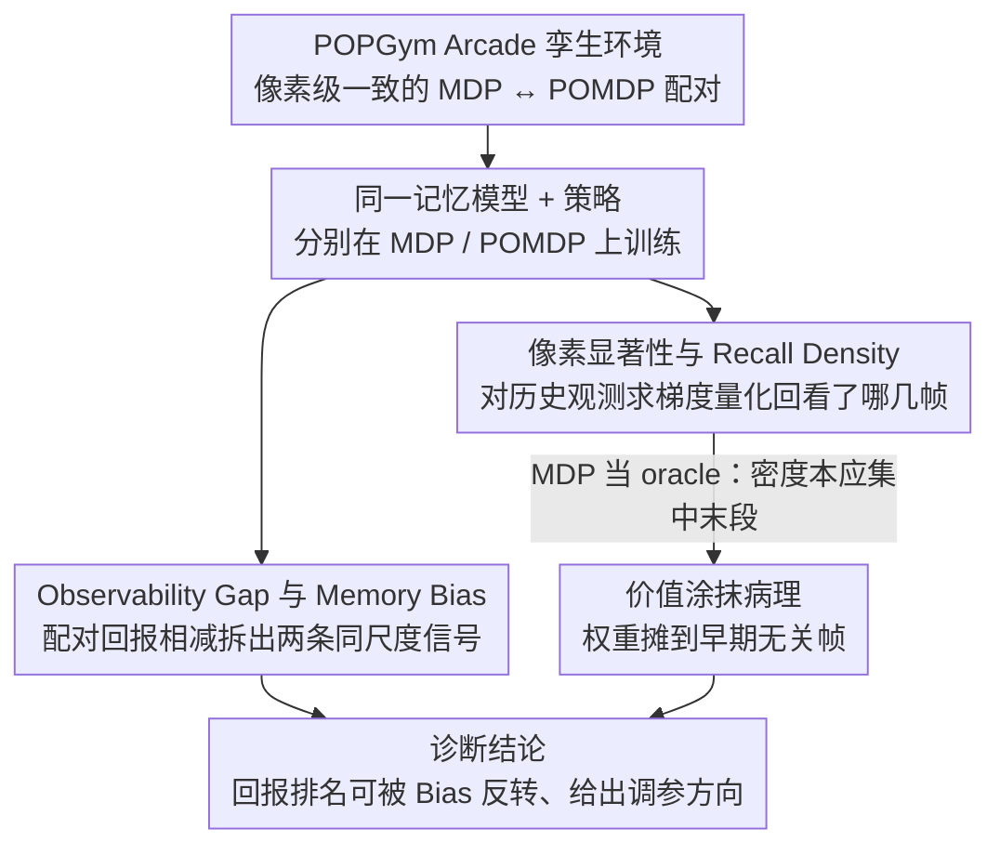

# Investigating Memory in Model-Free RL with POPGym Arcade

**会议**: ICML2026 Spotlight  
**arXiv**: [2503.01450](https://arxiv.org/abs/2503.01450)  
**代码**: https://github.com/bolt-research/popgym-arcade  
**领域**: 强化学习 / POMDP / 记忆模型  
**关键词**: model-free RL, POMDP, 记忆模型, recurrent state, 价值涂抹

## 一句话总结
本文指出仅用回报来比较 RL 记忆模型并不可靠，作者构建了一个 GPU 加速的 MDP/POMDP "孪生"基准 POPGym Arcade，并提出 Observability Gap、Memory Bias、像素显著性和 Recall Density 四个工具，借此揭示了一种"价值涂抹（value smearing）"病理：记忆模型会把价值信用错误地分摊到无关的历史观测上，进而导致单个 OOD 观测就能通过 recurrent state 长期污染策略。

## 研究背景与动机

**领域现状**：在部分可观测决策（POMDP）场景下，主流做法是在策略前接一个记忆模型 $f$（RNN/GRU/LRU/Transformer/SSM 等），把历史轨迹 $\mathbf{x}_t=(o_0,a_0,\dots,o_t)$ 压成一个固定大小的潜 Markov 状态 $\hat{s}_t$，再用其上的策略 $\pi(\cdot\mid\hat{s}_t)$ 交互。评估记忆模型的事实标准就是：在若干 POMDP 任务上比较平均回报。

**现有痛点**：深度 RL 对模型规模、观测尺寸、任务难度、优化器、随机种子都极度敏感，而记忆模型本身又会引入额外的参数量、优化难度和正则效应。结果是：两种记忆模型在 POMDP 上的回报差异，根本无法判断到底来自"对部分可观测性的缓解"还是来自这些"无关混淆因素"。文献甚至出现了"在 MDP 上加记忆反而更好、在 POMDP 上加记忆反而更差"的悖论现象。

**核心矛盾**：回报这一标量同时承载了"策略能力"和"记忆能力"，把两者纠缠在一起。要诚实地评估记忆，必须能在保持其它变量不变的前提下，单独度量"加了记忆"和"换成部分观测"各自带来的影响——这就要求一组**真正同源**的 MDP/POMDP 孪生任务，且共享同一份观测/动作空间，以便复用同一个模型。

**本文目标**：(1) 构造一个共享 (Ω, A) 的 MDP/POMDP 孪生基准；(2) 给出能把回报"拆解"成可观测性差距与记忆偏差的度量；(3) 给出可视化和量化记忆使用模式的工具；(4) 用这些工具去诊断现有记忆模型实际学到了什么。

**切入角度**：作者注意到，只要给同一个底层 MDP 套上一个观测函数 $O$，就能得到与之配对的 POMDP；如果两者的状态/观测空间在像素层面完全一致，就可以用同一套网络分别训练，差值就自然分离出"部分可观测带来的难度"。在此基础上对 $Q$ 值或策略对历史观测求梯度，则可量化"哪一帧历史在影响当前决策"。

**核心 idea**：用 MDP/POMDP 孪生任务把回报分解为 **Observability Gap**（部分可观测带来的损失）+ **Memory Bias**（引入记忆带来的副作用），再用 **梯度型 Recall Density** 衡量记忆实际"回看"了哪些时刻，发现并刻画"价值涂抹"病理。

## 方法详解

### 整体框架
本文要解决的是"如何诚实地评估 RL 记忆模型"：回报这一标量把"会不会推断状态"和"加模块本身的副作用"纠缠在一起，无法分辨。POPGym Arcade 的破局思路是给每个底层任务造一对像素层面完全一致的 MDP/POMDP 孪生环境，于是同一个网络可以分别在两者上训练，回报的差值就自然剥离出"部分可观测带来的难度"。在这套孪生底座上，作者再叠两组诊断工具：一组用配对回报相减把回报拆成 Observability Gap 与 Memory Bias 两条同尺度信号，另一组用对历史观测求梯度的方式量化"当前决策到底回看了哪几帧"，最终用后者在 MDP 上的异常形态揭出"价值涂抹"病理。

### 关键设计

**1. POPGym Arcade 孪生环境：让 MDP 与 POMDP 像素级可比**

前两类度量要在统计上有意义，前提是 MDP 与 POMDP 必须共享相同的观测/动作空间和相同的最优可达回报上限，否则相减出来的差值就混进了"任务本身不一样"的噪声。作者把每个任务的状态拆成低维隐 Markov 状态 $\tilde{s}\in\tilde{S}$（如 MineSweeper 的雷位）和像素 Markov 状态 $s\in S$（如带数字提示的棋盘像素），两者都满足 Markov 性；只要再套上观测函数 $O:\tilde{S}\mapsto\Delta(\Omega)$ 就生成出 POMDP 孪生。由于所有任务统一到同一 $S=\Omega$（$128{\times}128{\times}3$ 或 $256{\times}256{\times}3$ 像素）与同一 $\{\uparrow,\downarrow,\leftarrow,\rightarrow,\times\}$ 五动作空间，单一网络可以跨任务复用，甚至能在训练中途从 POMDP 切回 MDP 做对照。10 个基础环境 × 12 种难度/观测组合给出 120 个任务，并标注 Reward Memory Length 是 $O(k)$（窗口帧叠加就能解）还是 $O(n)$（必须真正记忆）。整套环境在 JAX 中以纯 GPU 流水线实现，吞吐量比 CPU 版 Atari 快约 $10^4$ 倍——正是这点让作者能在 7 种记忆模型 × 5 种子 × 120 配置上跑完整 sweep，拿到统计置信。

**2. Observability Gap 与 Memory Bias：把回报拆成两条同尺度信号**

以往只看回报时，"GRU 比 Transformer 高 5 分"既可能因为 GRU 更会推断状态，也可能只是优化更容易或参数量更合适——三种原因被一个标量糊在一起。作者用两次配对相减把它拆开：固定记忆模型 $f$ 与策略 $\pi$，在孪生 MDP 与 POMDP 上各跑出回报，作差得 $\text{Gap}(f,\pi,\mathcal{M},\mathcal{P})=J(f,\pi,\mathcal{M})-J(f,\pi,\mathcal{P})$，刻画"$f$ 没能把轨迹完全还原成 Markov 状态"造成的损失；再固定底层 MDP，比较带记忆与不带记忆两个策略，作差得 $\text{Bias}(f,\pi,\mathcal{M})=J(f,\pi,\mathcal{M})-J(\pi,\mathcal{M})$，捕捉参数量、优化难度、隐式正则等"与可观测性无关"的副作用。两个差值都与回报同量纲，可直接比较量级。实验中 MinGRU 与 GRU 的 Bias 差（0.05）就和它们的 Gap 差（0.05）相当，意味着回报排名完全可能被 Bias 反转——这正是单看回报会得出"加记忆有时更好有时更差"矛盾结论的根源。

**3. 像素显著性与 Recall Density：量化当前决策回看了哪几帧**

光有 Gap/Bias 还回答不了"模型有没有把记忆用对地方"，需要在轨迹层面看清信息流向。给定轨迹 $\mathbf{x}_n$，先按 Eq.1 递推出 $\hat{s}_0,\dots,\hat{s}_n$，再对每帧历史观测求 $Q$（或 $\pi$）的输入梯度，链式法则同时穿过 CNN 和记忆模型：

$$\sum_{a_n}\lVert\nabla_{o_t}Q(\hat{s}_n,a_n)\rVert_2^2=\sum_{a_n}\Big\lVert\frac{\partial Q}{\partial \hat{s}_n}\frac{\partial \hat{s}_n}{\partial o_t}\Big\rVert_2^2$$

把它叠成像素热力图就能直观看到"哪几帧被记住了"。为避免在单条轨迹上"挑樱桃"，作者再对 $L_1$ 梯度范数做轨迹内归一化得到经验密度 $\delta_Q(\mathbf{x}_n,t)$，把绝对时刻 $t$ 映射到归一化时间 $\tau=t/n\in[0,1]$，跨多条轨迹取均值，得到 Recall Density $\mathbb{E}_{\pi,f}[\delta_Q(\mathbf{x},\tau)]$（并提供 $\pi$ 梯度版本以兼容策略梯度方法）。它的关键好处是跨轨迹长度、跨模型都可比，于是可以拿 MDP 当 oracle：MDP 下 $V^*(s_t)$ 理论上只依赖当前状态，密度本应集中在 $\tau\to 1$，一旦实测把大量权重摊到 $\tau<0.66$ 的早期片段，就是"价值涂抹"的直接证据。

### 损失函数 / 训练策略
主算法采用片上 TD($\lambda$) 的 Q-learning 实现 PQN（Gallici et al., 2024），刻意避开 target network、replay buffer、共享主干等常见混淆因素；同时在附录中用 PPO 与 DQN 复现关键结论以排除算法效应。所有记忆模型都加了一条**绕过记忆**的 skip connection，让策略在 MDP 上有"忽略记忆"的能力——这一设计也使得后面观察到的"记忆仍涂抹历史"更具说服力。共测试 7 种记忆模型：Transformer、Recurrent Linear Transformer、Linear TTT、Gated DeltaNet、MinGRU、GRU、LRU SSM。

## 实验关键数据

### 主实验

| 评测维度 | 工具 | 关键发现 |
|----------|------|----------|
| 跨 7 种记忆模型在所有任务上聚合 | Return / Gap / Bias 三联图（Fig. 5） | Memory Bias 在不同模型间差异显著且全部为负；MinGRU 与 GRU 的 Bias 差（0.05）与 Gap 差（0.05）量级相同——回报排名完全可以被 Bias 颠倒 |
| BattleShip / MineSweeper 上 sweep 层数 $L$ 与隐藏维 $H$ | Gap–Bias Pareto 前沿（Fig. 6） | 层数 $L\uparrow$ 通常恶化 Bias；隐藏维 $H\uparrow$ 通常改善 Gap；两条曲线构成 Pareto 前沿，可用于挑容量 |
| MDP 上的像素显著性 + Recall Density | Fig. 3、Fig. 7 | 理论上 MDP 的 $V^*(s_t)$ 与 $s_{t-k},\dots,s_{t-1}$ 无关，密度应集中在 $\tau\in[0.66,1)$；实测却在 $\tau<0.66$ 区段获得显著权重——所有模型、所有任务均如此，即"价值涂抹" |
| OOD 注入实验 | 单帧噪声（Fig. 9） + 轨迹前缀打乱（Fig. 10） | 仅注入一帧 OOD 观测就能让 LRU 策略的相对 $Q$ 值与贪心动作发生显著扰动；打乱轨迹前缀（排除 CNN 混淆）后，效应在 BattleShip/MineSweeper（LRU）和 CartPole（Transformer）上依然成立——recurrent state 被 OOD 污染并将策略扰动延伸至远期 |

### 消融实验

| 配置 | 关键指标 | 说明 |
|------|---------|------|
| Full GRU / LRU 完整模型 | 训练曲线低方差收敛（Fig. 8） | 排除"价值涂抹是优化不稳定的伪影"这一备选解释 |
| 加 skip connection（策略可绕过记忆） | 仍出现 smear | 说明策略并未在 MDP 下选择"忽略记忆"，记忆模型确实学到了把信用涂抹到无关过去的解 |
| Transformer（无 recurrent state） | 在轨迹前缀打乱时仍受影响 | 表明 OOD 污染并非 RNN 特有，是部分可观测下记忆-策略联合解的共性问题 |
| 同实验在 PPO/DQN 复现（附录） | 现象一致 | 排除算法（on-policy 价值法）特异性 |

### 关键发现
- **价值涂抹是普遍现象**：MDP 下 $V$ 理应只依赖当前状态，但 7 种记忆模型在 10 个任务下的 Recall Density 都把大量权重摊到轨迹前 2/3，说明记忆–价值联合优化倾向于把"恰好出现在该轨迹的过去"当成解释变量，存在对当前策略下轨迹分布的过拟合。
- **回报不可信，必须看 Bias**：如果只看回报，会得到"加记忆就更好/更差"的相互矛盾结论；Bias 直接揭示记忆模型在没有可观测性问题时仍带来净负效应，意味着部分既有 SOTA 比较存在隐藏混淆。
- **OOD 污染是涂抹的实践代价**：因为价值被涂抹到无关历史，单个异常观测足以经由 recurrent state 长期改变策略，对真实世界部署/离线 RL 等场景构成实质风险。
- **可解释干预**：Gap 大就加大隐藏维 $H$（缓解状态混淆），Bias 负得多就降低层数 $L$（缓解优化难度），给出了一个具体可执行的调参方向。

## 亮点与洞察
- **"孪生 + 量纲相同的两个差值"** 是非常优雅的因果分解：把一个混杂量分解成 Gap 与 Bias 两条同尺度信号，方法学上把 RL 中"参数量/优化器/任务难度"的诸多混淆首次摆到台面上量化讨论，可推广到任何"加一个模块是否真有用"的评测场景。
- **用 MDP 当 oracle 去检验 POMDP 工具**：先在 ground-truth 已知的 MDP 上验证 Recall Density 的预期形态（应集中在末段），再用其异常来定义病理，是非常稳的实验范式，对未来评估其它"记忆/上下文/检索"模块都适用。
- **价值涂抹病理可迁移到 LLM**：作者明确指出，若现代 RLHF 后的 LLM 在长上下文 ICL 任务中也存在类似涂抹，可以解释为何模型对长上下文的"无关插入"高度敏感——这给把 Recall Density 类工具引入 LLM 长上下文诊断打开了想象空间。

## 局限与展望
- 实验集中在 **像素 model-free RL** 上，model-based RL（如世界模型）与 RL-finetuned LLM 是否存在同款涂抹尚未验证，作者建议下一步重点测量。
- "最佳记忆模型"的结论严重依赖比较轴的选择（这里选了隐藏维 $H$），换成参数量或 wall-clock 可能完全改变排名，因此 LRU 的"总体最优"应谨慎理解。
- POMDP 下没有 ground-truth credit 分布，目前只能用 MDP 替身论证涂抹现象的存在，未来需要可定量量化 POMDP 中涂抹强度的方法。
- 价值涂抹的根因（优化难度？过拟合轨迹分布？容量不足？）仍是猜想，需更系统的可控实验来证因果。
- 当前 Recall Density 以梯度范数为代理，对饱和激活或截断 BPTT 的模型可能低估真实信息流，未来可结合 attention rollout、积分梯度或行为干预实验做交叉验证。
- POPGym Arcade 的动作空间统一为 5 个离散动作，对连续控制 POMDP（如部分观测 MuJoCo）的迁移性还需后续工作扩展。

## 相关工作与启发
- **vs Morad et al. (POPGym, 2023)**：POPGym 主要提供 CPU 端 POMDP 基准并对比记忆模型回报；本文提供 GPU 端孪生 MDP/POMDP，**配套对照度量与梯度可解释工具**，把评估从"看回报"升级到"做因果分解"。
- **vs Ni et al. (2022, 2024)**：Ni 等同样强调对照实验（如把 reward memory length 单独剥离），但缺少跨任务共享的像素观测空间与梯度型 Recall Density；本文在度量工具与基准基础设施上更系统。
- **vs Kapturowski et al. (R2D2)** 与 **Elelimy et al. (2024)**：这些工作分析陈旧 recurrent state 的影响或学到的 recurrent state 分布，提供间接证据；本文 Recall Density 直接给出"输入→当前决策"的影响力分布，更接近因果性测度。

## 评分
- 新颖性: ⭐⭐⭐⭐⭐ 把 RL 记忆评估从"比回报"升级为"做因果分解 + 梯度可解释 + 病理诊断"，并首次刻画"价值涂抹"现象。
- 实验充分度: ⭐⭐⭐⭐⭐ 7 种记忆模型 × 10 任务 × 多难度 × 5 种子，并用 PQN/PPO/DQN 三套算法互相印证，结论稳健。
- 写作质量: ⭐⭐⭐⭐ 论点逻辑链清晰（基准 → 度量 → 病理 → 实践后果），定义形式化；个别图（Fig. 7）信息密度偏大略难读。
- 价值: ⭐⭐⭐⭐⭐ 重写了"记忆模型如何评估"的方法学，并直接撼动一批"加记忆就更好"的旧结论；JAX 化的孪生基准也是社区可直接复用的资产。

<!-- RELATED:START -->

## 相关论文

- [\[CVPR 2025\] Image Quality Assessment: Investigating Causal Perceptual Effects with Abductive Counterfactual Inference](../../CVPR2025/causal_inference/image_quality_assessment_investigating_causal_perceptual_effects_with_abductive_.md)
- [\[ICML 2026\] Density-Guided Robust Counterfactual Explanations on Tabular Data under Model Multiplicity](density-guided_robust_counterfactual_explanations_on_tabular_data_under_model_mu.md)
- [\[AAAI 2026\] Sparse Additive Model Pruning for Order-Based Causal Structure Learning](../../AAAI2026/causal_inference/sparse_additive_model_pruning_for_order-based_causal_structure_learning.md)
- [\[ACL 2026\] Better and Worse with Scale: How Contextual Entrainment Diverges with Model Size](../../ACL2026/causal_inference/better_and_worse_with_scale_how_contextual_entrainment_diverges_with_model_size.md)
- [\[ICLR 2026\] Adjusting Prediction Model Through Wasserstein Geodesic for Causal Inference](../../ICLR2026/causal_inference/adjusting_prediction_model_through_wasserstein_geodesic_for_causal_inference.md)

<!-- RELATED:END -->
