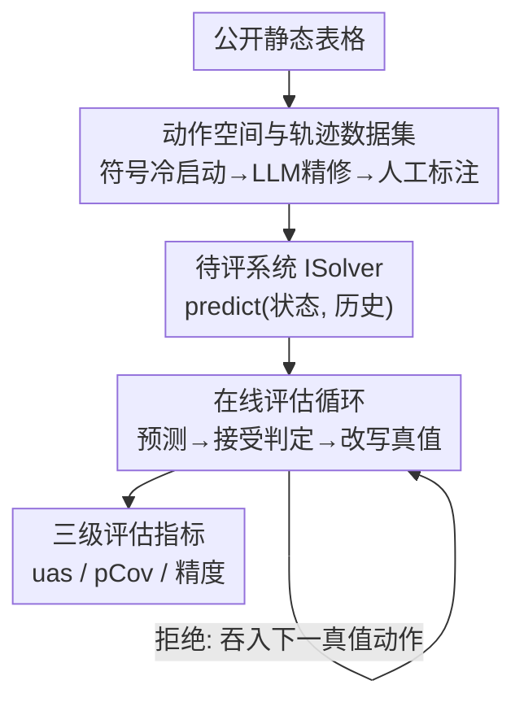

# A Benchmark and Framework for Evaluating Next Action Predictions in Spreadsheets

**会议**: ICML2026  
**arXiv**: [2606.13802](https://arxiv.org/abs/2606.13802)  
**代码**: https://github.com/Tej-55/NAPE  
**领域**: 代码智能 / 自动补全  
**关键词**: 表格自动补全, 动作预测, 在线评估, 用户行为建模, benchmark  

## 一句话总结
针对"电子表格没有像代码补全那样的下一步动作预测"这一空白，本文构造了首个表格动作预测基准 NAPE（52 条人工校验的建表轨迹、共 11,907 个低层动作），并提出一种**在线评估**框架——每个动作后让系统预测、模拟用户接受/拒绝、动态改写剩余真值，最终用"为用户省下的动作比例（uas）"来衡量真实收益；实验显示微调的 360M 小模型就能追平 GPT-5（都省 27% 动作）。

## 研究背景与动机
**领域现状**：在代码编辑里，预测式补全（从 Blue-Pencil 的符号重复编辑，到 IntelliCode 的整行补全，再到现代助手一次补多个函数）已经极大加速了开发者的工作。但在更高频使用的电子表格里，这类"观察用户操作序列、自动建议下一步"的补全功能几乎不存在。

**现有痛点**：表格里现有的辅助都局限在很窄的场景——FlashFill 只能补能从其他列推导出来的列；公式助手要等用户明确表达"我要写公式"才出手；最近的热点是基于自然语言意图的 agent（SheetCopilot 等）。但对于日常的重复性排版/录入，调用助手、组织 prompt、等待响应的成本反而高于直接手动操作，于是用户干脆全手动。

**核心矛盾**：要做"通用动作建议"，评估本身就极其困难。一是**没有编辑历史语料**——代码有细粒度的版本历史，表格却只有非常高层的"随时间演化"语料，拿不到逐步的操作序列；二是**动作空间复杂**——单个动作（涂色、加边框）虽简单，但不同动作发生在表格的不同位置、影响不同区域、顺序可以千变万化，而且没有清晰的"何时该预测"的触发点。最朴素的离线评估（teacher-forcing：总是喂正确的下一状态、每个预测独立对照固定真值）无法反映真实使用：用户接受一个建议后，后续要做的事会随之改变。

**本文目标**：拆成两个子问题——(1) 如何在缺少编辑历史的前提下造出高质量的建表轨迹数据；(2) 如何设计一个能反映"建议会改变后续状态"的端到端评估协议。

**核心 idea**：用"符号冷启动 + LLM 精修 + 人工标注"三阶段从静态表格反推出逼真的建表轨迹；并用**在线滚动评估**取代静态"给 x 预测 y"——每步预测后真的去执行、根据"净收益"决定接受与否、并动态改写剩余真值动作（删掉已满足的、补上撤销误操作的逆动作），最后衡量整条轨迹为用户省下的动作比例。

## 方法详解

### 整体框架
NAPE 由两部分组成。**离线侧是数据集构建管线**：从公开静态表格出发，经"符号冷启动 → LLM 精修 → 人工标注"三道工序，反推出 52 条从空白到成品的建表轨迹，每条由 9 类低层动作（见下）组成。**在线侧是评估循环**：把待评系统包成一个 `ISolver`（实现 `predict(状态 S, 历史 H) → 动作序列`），评估器维护"当前表格状态 S、历史 H、剩余真值动作 F"，反复执行"预测 → 按接受启发式判定 → 接受则执行预测并改写 F → 否则吞入下一个真值动作"，直到 F 清空（得到目标表格）或触发阈值。整套流程在三个粒度（动作级 / 预测级 / 轨迹级）上计算指标，其中"为用户省下的动作比例"是主指标。

### 关键设计

**1. 动作空间与轨迹数据集：把"静态成品"反推成"逼真的建表过程"**

要训练/评估动作预测，必须有逐步的操作序列，而公开语料只有成品表格。本文先定义一套覆盖建表的 9 类参数化动作作为标注词表：`input`（录入值/矩阵）、`merge`（合并）、`format`（数字格式）、`fill`（背景填充色）、`font`（字体属性：粗体/斜体/字号/颜色/下划线/字体名）、`border`（某一侧边框样式）、`align`（水平/垂直/朝向/换行）、`paste`（按样式/值/两者粘贴）、`autofill`（区域自动填充）。在此之上用三阶段反推轨迹：**符号冷启动**把成品逐单元格拆解成动作，再把相邻相同的动作合并成区间动作（如 `font(A1,bold)+font(A2,bold)` 合成 `font(A1:A2,bold)`），并通过采样不同的合并策略/区域顺序/排版顺序注入多样性，同时用 VLM 给每张表标注语义元数据（区域、依赖、粘贴范围）；**LLM 精修**用"裁判-编辑"循环修掉明显不自然的模式（把零散逐格排版合并成区间、删掉无用区域的杂散格式、调整成更自然的顺序），并校验改写后仍能还原目标表格；**人工标注**做最后一道，纠正残留的不自然子序列。作者强调标注介入很重——预标注轨迹与最终轨迹的平均归一化编辑距离达 0.69（中位 0.77），52 条里有 19 条几乎被重写（距离 >0.8）。最终数据集为 52 张表、11,907 个动作，单条长度 35–821（均值 229、中位 164），每个工作簿只取一张表以最大化多样性。

**2. 在线评估循环：让"接受一个建议会改变后续要做的事"被如实计入**

静态离线评估（每步独立对照固定真值）会高估系统：它允许模型反复建议同一个简单动作还显得很准，也从不考验模型修复自己先前错误建议的能力。本文改为**在策略（on-policy）滚动**：从空表开始，每轮 `solver.predict(S, H)` 给出零个或多个动作，由接受启发式 `accept` 判定是否采纳；一旦接受，就真的 `execute` 到状态 S 上，并用 `update` 改写剩余真值 F——删除已被满足的操作、对预测引入的"假阳性"动作在 F 头部**前插逆动作**来撤销、最后做 `patch` 校验改写后的 F 仍能产出原目标状态（如 Figure 1 里把误填的 C4 用 `fill(C4, empty)` 撤销）。被接受后还可选择立即用更新后的历史**再次预测**（repredict，对应用户连按 Tab 逐词补全）。它相比 teacher-forcing 离线评估有三点优势：建议会改变模型/用户后续的起点，错误会**累积**且后续预测依赖先前预测；模型无法靠重复建议同一个简单动作刷分；系统会被考验"修订/修复自己先前的建议"。

**3. 三级评估指标：用"净省下多少动作"而非裸精度衡量真实效用**

在最细的 **(单元格, 属性)** 粒度上，把预测态与目标态逐对比对，分成 TP（两态同值，正确预测）、FP（预测有、目标无，用户得撤销的多余编辑）、FN（目标需要、预测漏掉，用户得手动补）、MM（两态都有但值不同，错误编辑得纠正）。**预测级**（一轮提出的所有动作）给出精度 $\text{precision}=\text{TP}/(\text{TP}+\text{FP}+\text{MM})$ 和单次"省下动作数 uas"。**轨迹级**是系统在整条轨迹上的表现，主指标是省下动作比例

$$\text{uas}=\frac{L_{\text{initial}}-L_{\text{final}}}{L_{\text{initial}}}$$

即模拟用户接受后，相对原始所需动作数省下的比例（可正可负——负值意味着系统帮了倒忙）；另有接受率 ar、宏平均精度 prec，以及**可预测覆盖率 pCov**——系统正确产出的"可预测 (单元格,属性) 对"占 oracle 可预测集合的比例。这里的"可预测集合"来自一个 oracle 实验：对每条轨迹每一步，用 4 个前沿推理模型（各 2 次生成、高推理强度）喂全历史+当时表格截图去预测后续动作，取所有正确预测的并集；统计显示 52 条轨迹里 68% 的真值属性落在该并集内（每轨迹中位 66.3%，44/52 条超过 50%）。这把分数按"上下文里到底学得到多少"归一化，给出相对天花板的度量，而非被"本就不可预测的编辑"稀释的裸分。

### 一个完整示例
以 Figure 1 的一步为例：历史动作产生当前状态，剩余真值动作本应产出目标状态。系统在当前历史下预测 3 个动作——两个边框（与未来一致，正确）和一个填充（涂错了单元格）。在 (单元格,属性) 级，这次预测精度为 $7/8$。若被接受：`update` 会从未来里删掉那两个已满足的边框动作，并在未来头部**前插**一个 `fill(C4, empty)` 来撤销涂错的格子——于是原本 3 个未来动作变成 2 个，**净省下 1 个动作**。若被拒绝：未来不变，评估带着下一个用户动作进入 n+1 步继续。这一步把"接受会动态改写真值、错误建议要靠逆动作修复"这件事讲透。

## 实验关键数据

### 主实验
单动作 repredict 设置（步幅 $s{=}1$、上下文 $c{=}32$、greedy 接受），主指标为为用户省下的动作比例 uas（%）：

| 模型 | uas↑ | ar↑ | prec↑ | pCov↑ |
|------|------|-----|-------|-------|
| GPT-5-R（低推理） | 32.7 | 29.4 | 41.6 | 24.8 |
| GPT-5-R mini | 28.2 | 25.5 | 37.0 | 20.9 |
| GPT-5 | 27.4 | 30.9 | 44.8 | 20.7 |
| FT-SmolLM2-360M（微调） | 26.8 | 26.8 | 33.7 | 13.7 |
| FT-SmolLM2-135M（微调） | 23.2 | 23.1 | 30.6 | 13.0 |
| SmolLM2-360M（未微调） | 21.7 | 22.3 | 29.7 | 9.6 |
| GPT-5 mini | 18.0 | 16.8 | 21.9 | 10.7 |
| 在线 n-gram | 12.0 | 14.7 | 20.4 | 11.1 |
| LSTM | 5.7 | 5.5 | 12.4 | 2.4 |
| 训练 n-gram | 3.8 | 3.9 | 11.9 | 0.7 |

关键观察：**任务是可学的**——微调后的 360M 小模型（uas 26.8）几乎追平 GPT-5（27.4），且远超未微调同尺寸版本（21.7）；而传统序列模型（LSTM、n-gram、XGBoost）几乎无用（uas <6）。更强模型省得更多（GPT-5-R 推理版 32.7 vs GPT-5 mini 18.0）。

### 消融实验
超参数消融（单动作 repredict、GPT-5、greedy，∗为默认）：

| 维度 | 取值 | uas↑ | ar↑ | prec↑ | pCov↑ |
|------|------|------|-----|-------|-------|
| 步幅 s | 1∗ | 27.4 | 30.9 | 44.8 | 20.7 |
| 步幅 s | 2 | 22.6 | 36.5 | 48.4 | 15.9 |
| 步幅 s | 4 | 16.8 | 42.3 | 53.2 | 9.4 |
| 步幅 s | 8 | 10.6 | 43.7 | 55.1 | 7.1 |
| 上下文 c | 8 | 19.9 | 24.1 | 39.7 | 13.6 |
| 上下文 c | 32∗ | 27.4 | 30.9 | 44.8 | 20.7 |
| 上下文 c | 128 | 30.0 | 32.5 | 47.8 | 28.5 |
| 上下文 c | 512 | 30.8 | 33.7 | 47.9 | 31.0 |
| repredict | 开∗ | 27.4 | 30.9 | 44.8 | 20.7 |
| repredict | 关 | 20.3 | 30.6 | 44.1 | 15.2 |

### 关键发现
- **触发频率很关键**：每个动作都预测（$s{=}1$，uas 27.4）比每四个动作才预测一次（$s{=}4$，uas 16.8）省下更多动作——尽管步幅越大裸精度反而更高（$s{=}8$ 时 prec 55.1），说明只看精度会被误导，"好的触发时机或更便宜的模型"值得投入。
- **接受启发式必须看净收益**：低精度接受启发式会带来**负收益（uas −19%）**，即帮了倒忙，证明基于"对用户的净增益"来决定要不要采纳（abstention）至关重要。
- **上下文越长越好但收益递减**：$c$ 从 8→512，uas 从 19.9 升到 30.8、pCov 从 13.6 升到 31.0，但 32→512 的边际提升放缓。
- **repredict 有用**：开启逐步再预测把 uas 从 20.3 提到 27.4。
- **可预测天花板**：oracle 并集覆盖 68% 真值属性，为在线评估设定了性能上限。

## 亮点与洞察
- **把"代码补全"范式平移到表格，并先补齐评估基建**：作者没有急着造一个补全模型，而是先指出"评估"才是真正的拦路虎，于是同时交付数据集 + 在线评估协议，这种"先立标尺"的工作对一个空白方向更有奠基价值。
- **在线评估的"动态改写真值"很巧**：接受一个建议后用 `update`/`patch` 删除已满足动作、前插逆动作撤销假阳性，并校验仍能还原目标——这让"建议改变后续工作量"被如实计入，是离线 teacher-forcing 做不到的。
- **uas 这个以"净省下动作"为核心的指标可迁移**：任何"系统建议会改变用户后续操作"的交互式预测任务（IDE 重构建议、设计工具、命令行补全）都可以借用"模拟接受 → 改写剩余工作 → 计净收益"的评估思路，而不是只看裸精度。
- **小模型可追平大模型的结论很实用**：360M 微调模型追平 GPT-5，说明这类高频、低层、强模式的补全更适合用本地小模型低延迟部署，而非每步都调昂贵的大模型。

## 局限与展望
- **数据规模偏小**：52 条轨迹（11,907 动作）虽经人工精校，但覆盖的表格风格/领域有限，且严重依赖人工标注（19/52 条几乎重写），扩展成本高。
- **接受行为是模拟的**：在线评估用启发式 `accept` 模拟用户决策，并非真实用户研究；真实用户的接受/拒绝模式、对误建议的容忍度可能与启发式不同。
- **可预测天花板依赖 oracle 模型**：68% 的上界由当时几款前沿模型的并集给出，会随模型进步而变化，并非绝对可预测性。
- **停止决策仍是难点**：多动作设置考验模型"何时停"，而 SLM/经典模型缺乏自主停止能力只能用单动作 repredict；如何让小模型学会自主决定预测长度是后续方向。
- **触发器是明确的改进口**：实验显示"每步预测"才省得多但成本高，设计便宜的触发器（判断何时值得调用模型）是直接的工程优化方向。

## 相关工作与启发
- **vs 代码补全（Blue-Pencil / IntelliCode / 现代编程助手）**：它们依托代码丰富的版本历史做行/函数级补全；本文把同样的"观察操作序列、预测下一步"思路搬到表格，但必须自己反推编辑历史、并定义低层动作空间。
- **vs FlashFill / 公式建议（SpreadsheetCoder）**：这些只在极窄场景（按例补列、显式求公式）生效；本文做的是**通用低层动作**建议，覆盖排版/录入/边框等全部建表操作。
- **vs 表格 agent（SheetCopilot / SpreadsheetBench）**：agent 走自然语言意图、适合复杂一次性任务；本文针对的是高频重复的小编辑，这类场景调用 agent 的成本反而高于手动，因此需要低延迟的预测式补全而非 agent。
- **vs teacher-forced 离线评估**：离线评估给定正确下一状态、每个预测独立打分，无法反映"接受改变后续状态、错误会累积、需修复自己先前建议"；本文的在线评估正是补上这三点。

## 评分
- 新颖性: ⭐⭐⭐⭐⭐ 首个表格通用动作预测基准 + 动态改写真值的在线评估协议，开辟空白方向
- 实验充分度: ⭐⭐⭐⭐ 覆盖 LLM/微调 SLM/经典模型三族基线 + 多维超参消融，但数据规模偏小、用户接受为模拟
- 写作质量: ⭐⭐⭐⭐ 问题动机与评估设计讲得清楚，Figure 1 的一步示例很有助理解
- 价值: ⭐⭐⭐⭐⭐ 给"表格补全"这个高频却空白的方向立起了数据与评估标尺，并给出可迁移的 uas 评估范式

<!-- RELATED:START -->

## 相关论文

- [\[ACL 2026\] LogicEval: A Systematic Framework for Evaluating Automated Repair Techniques for Logical Vulnerabilities in Real-World Software](../../ACL2026/code_intelligence/logiceval_a_systematic_framework_for_evaluating_automated_repair_techniques_for_.md)
- [\[ACL 2025\] TeXpert: A Multi-Level Benchmark for Evaluating LaTeX Code Generation by LLMs](../../ACL2025/code_intelligence/texpert_a_multi-level_benchmark_for_evaluating_latex_code_generation_by_llms.md)
- [\[ACL 2025\] FEA-Bench: A Benchmark for Evaluating Repository-Level Code Generation for Feature Implementation](../../ACL2025/code_intelligence/feabench_repo_code_gen.md)
- [\[ACL 2025\] DynaCode: A Dynamic Complexity-Aware Code Benchmark for Evaluating Large Language Models in Code Generation](../../ACL2025/code_intelligence/dynacode_a_dynamic_complexity-aware_code_benchmark_for_evaluating_large_language.md)
- [\[ICML 2026\] AlgoVeri: An Aligned Benchmark for Verified Code Generation on Classical Algorithms](algoveri_an_aligned_benchmark_for_verified_code_generation_on_classical_algorith.md)

<!-- RELATED:END -->
