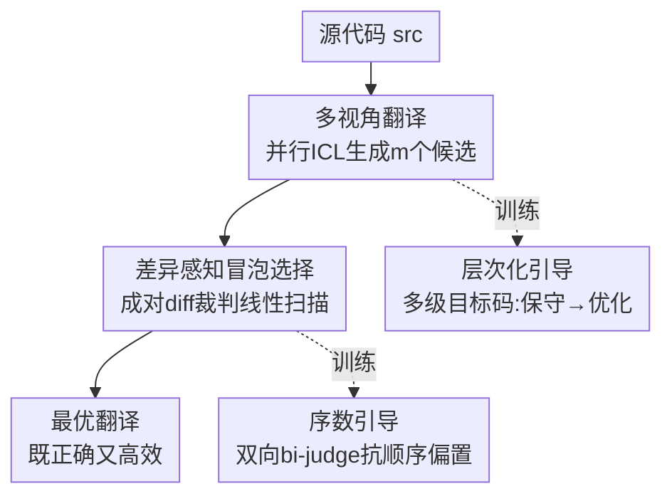

# Bridging Functional Correctness and Runtime Efficiency Gaps in LLM-Based Code Translation

**会议**: ICML 2026  
**arXiv**: [2606.17683](https://arxiv.org/abs/2606.17683)  
**代码**: 待确认  
**领域**: 代码智能 / 代码翻译 / LLM  
**关键词**: 代码翻译, 运行时效率, 并行ICL, LLM-as-a-judge, 层次化引导

## 一句话总结
针对"LLM 翻译出来的代码虽然功能对、但跑得比人写的慢"这一被忽视的问题，提出 SwiftTrans 框架：先用并行 ICL 生成多视角候选翻译，再用差异感知的成对裁判按冒泡方式线性时间选出最优候选，并配套层次化引导和序数引导两套训练策略，让一个 Qwen2.5-3B 在功能正确性和运行效率上同时超过 GPT-5。

## 研究背景与动机
**领域现状**：代码翻译（把 C 翻成 Python、Java 翻成 Go 这类跨语言迁移）是遗留系统迁移、跨平台开发的刚需。LLM 出现后，靠简单 prompt 就能做初步翻译，于是大量工作都在卷"功能正确性"（Computational Accuracy），并且确实越做越好。

**现有痛点**：几乎没人管"翻译出来的代码跑得快不快"。作者的预研究发现两个扎心事实：(1) LLM 翻译的程序普遍比人写的同语言程序慢——因为 LLM 倾向于照搬源代码的逻辑和结构，这虽然降低了出错风险，却把源语言里的低效写法也一并继承了，还忽略了目标语言特有的优化（比如 Python 的内置函数、C 的指针）；(2) 想同时保住正确性和效率很难——直接堆复杂 prompt（强调效率）或者事后优化（先翻对再加速）确实能提速，但往往以牺牲正确性为代价，光靠 prompt engineering 解决不了。

**核心矛盾**：正确性和效率之间存在一个被现有方法放大的 trade-off。让模型"激进优化"会引入复杂度从而破坏正确性，让模型"保守照搬"又牺牲效率。单一的、固定的翻译策略无法适配难度各异的任务。

**本文目标**：拆成两个子问题——(1) 怎么让模型产出从"保守正确"到"激进高效"的多样化候选；(2) 怎么从这些差异极其细微（有时只差几个 token）的候选里准确选出既对又快的那一个。

**切入角度**：与其逼一个固定模型既对又快，不如"先广撒网生成多样候选，再精挑细选"。多样性靠并行 ICL（每个候选喂不同的演示集），选择靠差异感知的成对裁判。

**核心 idea**：用"多视角探索 + 差异感知选择"的两阶段流水线，把"既要正确又要高效"这个矛盾从单模型内部解耦到"生成多样性"和"选择准确性"两个可独立优化的环节。

## 方法详解

### 整体框架
给定一段源代码，SwiftTrans 分两个阶段工作。第一阶段 **Multi-Perspective Exploration**：MpTranslator 通过并行 ICL 生成 $m$ 个差异化的候选翻译（每个候选看到一组不同的演示样例）。第二阶段 **Difference-Aware Selection**：DiffSelector 作为成对的 LLM-as-a-judge，用冒泡排序式的线性扫描，从候选里一遍选出最优。两个组件背后各有一套训练策略撑腰——MpTranslator 用层次化引导（Hierarchical Guidance）训练，DiffSelector 用序数引导（Ordinal Guidance）训练。整套流水线的妙处在于：靠这两套训练，一个轻量开源模型（如 Qwen2.5-3B）就能逼平甚至超过 GPT-5 这类大模型。

### 关键设计

**1. 多视角并行 ICL：用不同演示集逼出真正多样的候选**

传统的重复采样（repeated sampling）从同一个 prompt 反复采，因为输入上下文固定，输出会困在一个很窄的语义空间里，"多样"只是表面的随机噪声。MpTranslator 换了个思路：给源代码 $src$ 构造 $m$ 个演示集，每个演示集里放随机数量（0 到 $K$ 个）的"源—目标"翻译示例对，这些示例对从一个大演示库 $\mathcal{C}$ 里采样。每个演示集生成一个候选，$m$ 个演示集并行跑出 $m$ 个候选。这样做有两个好处：演示提供了比 zero-shot 更丰富的上下文信号（翻译质量更高），而且不同的上下文真正诱导出不同的翻译行为（多样性是结构性的，不是采样温度堆出来的）。实验里 $m=10$、$K=3$。

**2. 层次化引导训练：教模型"上下文越丰富、翻译越激进高效"**

普通指令微调（IFT）直接用在 MpTranslator 上有两个毛病：训练时只喂源代码、推理时却要喂演示，输入分布不一致会掉性能；而且 IFT 只学单一标准答案，容易导致 diversity collapse。作者的解法是构造**多级目标码**。从 Codeforces 等平台收集源代码，用一组强模型（DeepSeek-Coder-V2-16B、gpt-oss-20B、Qwen3-Coder-30B）先生成功能正确的初始翻译，再迭代编辑加速最多 $n$ 轮（$n=3$），编译器借平台测试用例过滤掉错误的或没提速的版本。最终每个源代码对应一串翻译 $\{tgt^0, tgt^1, \dots, tgt^n\}$：$tgt^0$ 只保证正确，$tgt^{1\dots n}$ 是逐级优化、每级至少比上一级快 10% 的版本。训练时的关键技巧是**把演示集大小绑定到优化级别**：对级别 $t$ 的目标码 $tgt^t$，采样大小为 $t$ 的演示子集 $\mathcal{D}^t$（$tgt^0$ 用空集 $\mathcal{D}^0=\emptyset$），损失为

$$\mathcal{L}_{\text{hg}} = -\frac{1}{n+1}\sum_{t}\sum_{i}\log p\left(tgt^t_i \mid \mathcal{D}^t, src, tgt^t_{<i}\right)$$

这一绑定让模型学到：上下文稀疏时给保守翻译、上下文丰富时给激进高效翻译，从而在推理期能按任务难度灵活调档。

**3. 差异感知的成对裁判：把"细微差异"显式 diff 出来再判**

候选都来自同一段源代码，彼此差异往往极小（有时只差几个 token），让 LLM 直接判优劣很容易看走眼。DiffSelector 采用成对比较，每次只看两个翻译，而且**把其中一个当成另一个的修改版**，用 GNU diff 算出 unified diff 格式的差异（图中的 $\text{diff}(tgt_1, tgt_2)$）显式呈现给裁判，让它聚焦在"改了哪里、改得好不好"上，而不是从头通读两段几乎一样的代码。这种"显式高亮差异"的设计是它区别于传统 LLM-as-a-judge 的核心。

**4. 冒泡选择：把 $\mathcal{O}(n^2)$ 的两两比较压成 $\mathcal{O}(n)$ 单遍扫描**

如果每对候选都比一遍再选最优，$n$ 个候选要 $\mathcal{O}(n^2)$ 次比较，太贵。作者借冒泡排序的思路：把 DiffSelector 当成成对比较器，候选当成待排序元素。先比 Py-A 和 Py-B 留下更好的，再拿赢家去比 Py-C，依次扫到底。一遍只需 $n-1$ 次比较，复杂度降到 $\mathcal{O}(n)$，单趟就锁定最优候选。

**5. 序数引导训练：双向 bi-judge 损失，抗候选顺序偏置**

DiffSelector 还要训得更准更稳。作者利用翻译质量的天然序关系——"又对又快 ≻ 对但慢 ≻ 错"。先用 MpTranslator 生成候选，按编译器反馈挑出一对不同质量的目标 $tgt^+$（正确高效）和 $tgt^-$（正确但慢），然后用一个**双向判断**的 bi-judge 损失训练裁判：既要判 $tgt^+ \succ tgt^-$ 时回答"Yes"，也要判反过来摆放 $tgt^- \succ tgt^+$ 时回答"No"：

$$\mathcal{L}_{\text{og}} = -\frac{1}{2}\left[\log p(\text{Yes} \mid src, tgt^+ \succ tgt^-) + \log p(\text{No} \mid src, tgt^- \succ tgt^+)\right]$$

双向训练让裁判对 prompt 里候选的摆放顺序不敏感，缓解了 LLM-as-a-judge 著名的位置偏置问题。

### 损失函数 / 训练策略
两个组件用同一批开源 LLM（如 Qwen2.5-3B）做全参数微调，学习率 1e-5，每个翻译场景约 15k 训练实例。覆盖 C、C++、Go、Java、Python 五种语言、共 20 个翻译方向。MpTranslator 用 $\mathcal{L}_{\text{hg}}$、DiffSelector 用 $\mathcal{L}_{\text{og}}$ 分别训练。

## 实验关键数据

为支撑效率评测，作者扩展了 CodeNet 和 F2SBench（给每个样本加 10 个效率敏感测试用例 + 基线执行时间），并新建 **SwiftBench**——专门收集本身就含低效写法（冗余计算、次优算法）的源程序，且只用 2025 年 6–10 月新发布的题目以防数据泄漏。评测指标为 Computational Accuracy（CA，功能正确率）和 Execution Time（ET，平均运行时间），用 Judge0 沙箱每程序跑 5 次取均值。

### 主实验（功能正确率 CA %，跨四种目标语言平均）

| 方法 | 模型 | CodeNet | F2SBench | SwiftBench | Avg. |
|------|------|---------|----------|------------|------|
| Cor.-Only | Qwen3-Next-80B | 78.0 | 64.2 | 77.6 | 73.3 |
| Cor.+Eff. | Qwen3-Next-80B | 75.6 | 57.1 | 73.1 | 68.6 |
| Cor.-Only | GPT-5 | 88.6 | 81.4 | 89.5 | 86.4 |
| Cor.+Eff. | GPT-5 | 84.4 | 73.1 | 82.0 | 79.8 |
| F2STrans (ICML'25) | Qwen2.5-3B | 86.4 | 73.4 | 86.2 | 82.0 |
| F2STrans (ICML'25) | Qwen2.5-7B | 89.7 | 75.8 | 88.1 | 84.6 |
| **SwiftTrans (Ours)** | **Qwen2.5-3B** | **92.x** | — | — | **>86.4** |

注：表中跨语言数值为按源语言到其余四语言平均后的近似汇总（原文给出每语言细分）。关键对比是：SwiftTrans 用 Qwen2.5-3B 这个小模型，在正确率上反超 GPT-5 的 Cor.-Only（86.4 Avg），同时（见原文 ET 部分）运行效率也优于各 prompt 工程基线。

### 消融 / Prompt 策略 trade-off（GPT-5，CA% Avg）

| Prompt 策略 | 含义 | CA Avg ↑ | 相对 Cor.-Only |
|------------|------|---------|---------------|
| Cor.-Only | 只强调正确性 | 86.4 | 基准 |
| Cor.+Eff. | 正确 + 额外强调效率 | 79.8 | −6.6（效率提升但正确率掉） |
| Cor.→Eff. | 先翻对再事后优化 | 62.7 | −23.7（正确率大幅崩塌） |

这张表直接量化了"正确性—效率"trade-off：任何试图用 prompt 把效率塞进来的策略都以正确率为代价，越激进（事后优化）掉得越狠，印证了"光靠 prompt engineering 解决不了"的预研究结论，反衬出 SwiftTrans"解耦生成多样性与选择准确性"的必要性。

### 关键发现
- **Prompt 工程治标不治本**：对比 Cor.-Only vs Cor.+Eff. vs Cor.→Eff. 三种 prompt 策略，强调效率或事后优化都能提速，但 CA 普遍掉点（如 GPT-5 从 86.4 掉到 79.8 / 62.7），印证了"正确性—效率"trade-off 不是靠 prompt 能绕过的。
- **小模型 + 好框架 > 大模型裸用**：Qwen2.5-3B 在 SwiftTrans 框架下超过 80B 的 Qwen3-Next 和 GPT-5，说明收益来自框架设计（多样候选 + 精准选择 + 两套引导训练），而非模型规模。
- **SwiftBench 最能区分能力**：因为源码本身含低效写法，只有真正能"消除低效"的模型才拿高分，单纯照搬源逻辑的方法在这里掉得最狠。

## 亮点与洞察
- **把"既要又要"解耦成"生成多样性 + 选择准确性"**：这是最聪明的一步。与其逼单模型同时兼顾正确与高效（必然 trade-off），不如让生成端只管广撒网、选择端只管精挑细选，两个目标各自可优化。
- **演示集大小当"难度旋钮"**：把 $|\mathcal{D}^t|$ 绑定到优化级别 $t$，让同一个模型在推理时能"看上下文行事"——稀疏给保守、丰富给激进，这个 trick 可迁移到任何需要"按难度调激进程度"的生成任务。
- **冒泡选择**：用经典排序算法的思路把成对裁判从 $\mathcal{O}(n^2)$ 压到 $\mathcal{O}(n)$，简单却实用，是把 LLM-as-a-judge 用在多候选选择上的低成本范式。
- **显式 diff + 双向 bi-judge**：前者让裁判聚焦细微差异，后者抗位置偏置，两个小设计直击 LLM-as-a-judge 的两大软肋。

## 局限与展望
- **依赖强模型 ensemble 造数据**：层次化训练数据要靠 DeepSeek/Qwen3-Coder 等大模型迭代加速生成，再用编译器过滤，构造成本不低，且质量上限受这些教师模型约束。
- **效率评测依赖外部沙箱**：ET 用 Judge0 在线沙箱测，跨硬件/负载的可复现性存疑，且"最慢保守翻译时间当基线"是相对宽松的参照。
- **加速深度固定**：$n=3$ 是个超参，是否对所有语言对/难度都最优、能否自适应没深入讨论。
- **每候选并行生成的真实开销**：$m=10$ 个候选并行 ICL + 冒泡选择虽然选择阶段是线性的，但生成阶段的算力成本（10 倍推理）在表里没有和 GPT-5 单次推理做公平的成本对照。

## 相关工作与启发
- **vs F2STrans (ICML 2025)**：F2STrans 用两阶段训练（SFT + 偏好学习）只优化功能正确性；本文在它基础上把"运行效率"提到与正确性同等地位，并补了多视角生成 + 差异感知选择两个新组件，正确率和效率双超。
- **vs 重复采样 (Brown et al., 2024)**：重复采样固定 prompt 反复采，多样性受限在窄语义空间；本文的并行 ICL 通过变化演示集获得结构性多样。
- **vs 事后优化方法 (Shypula et al., 2024)**：他们靠 RAG/CoT 在生成后加速代码；本文把效率内化进生成与选择流程，避免事后优化常见的"提速但破坏正确性"。
- **vs 普通 LLM-as-a-judge (Zheng et al., 2023)**：本文用显式 diff 高亮差异 + 双向 bi-judge 训练，专门解决"候选差异细微"和"位置偏置"两个老问题。

## 评分
- 新颖性: ⭐⭐⭐⭐ 第一个系统性把运行时效率提到与正确性同等地位的代码翻译框架，多视角 + 差异感知 + 双引导组合新颖
- 实验充分度: ⭐⭐⭐⭐ 三 benchmark、20 个语言方向、对比 GPT-5/F2STrans，并自建 SwiftBench；但生成端算力成本对照略缺
- 写作质量: ⭐⭐⭐⭐ 动机—方法—实验逻辑清晰，两套训练策略讲得明白
- 价值: ⭐⭐⭐⭐ 让小模型在实用代码翻译上反超大模型，且抓住了被忽视的效率维度，工程价值高

<!-- RELATED:START -->

## 相关论文

- [\[ICML 2026\] Towards Functional Correctness of Code Models with Selective Generation](towards_functional_correctness_of_large_code_models_with_selective_generation.md)
- [\[ACL 2026\] SolidCoder: Bridging the Mental-Reality Gap in LLM Code Generation through Concrete Execution](../../ACL2026/code_intelligence/solidcoder_bridging_the_mental-reality_gap_in_llm_code_generation_through_concre.md)
- [\[ICML 2026\] MatchFixAgent: Language-Agnostic Autonomous Repository-Level Code Translation Validation and Repair](matchfixagent_language-agnostic_autonomous_repository-level_code_translation_val.md)
- [\[ACL 2026\] Bootstrapping Code Translation with Weighted Multilanguage Exploration](../../ACL2026/code_intelligence/bootstrapping_code_translation_with_weighted_multilanguage_exploration.md)
- [\[ICML 2025\] Function-to-Style Guidance of LLMs for Code Translation](../../ICML2025/code_intelligence/function-to-style_guidance_of_llms_for_code_translation.md)

<!-- RELATED:END -->
