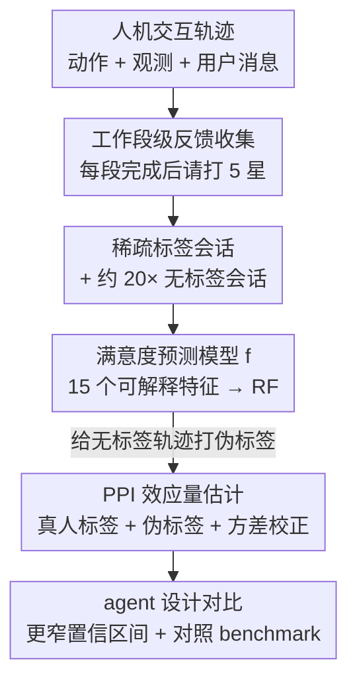

# How can we assess human-agent interactions? Case studies in software agent design

**会议**: ICML2026  
**arXiv**: [2510.09801](https://arxiv.org/abs/2510.09801)  
**代码**: 待确认（作者承诺开源 PULSE 框架代码 + 匿名化特征级数据集）  
**领域**: 代码智能 / 软件工程Agent / 评估  
**关键词**: 人机交互评估, 软件Agent, 预测驱动推断, 用户满意度, A/B测试

## 一句话总结
提出 PULSE 框架——收集用户反馈、训练一个 ML 模型预测用户满意度、再用预测驱动推断（PPI）把真人标签和模型伪标签结合起来高效估计 agent 设计改动的效应——并把它部署到开源编程 agent OpenHands 上，跨 1.5 万用户、3.6 万会话做了首个大规模真实环境 agent 设计评估，结果置信区间比标准 A/B 测试窄了约 40%，还发现 benchmark 表现和真人偏好会反相关（gpt-5 在 6/7 benchmark 上赢 claude-sonnet-4，但真人在 4/7 任务子集上更偏好 claude）。

## 研究背景与动机
**领域现状**：现有 agent 评估几乎全靠静态、任务级 benchmark（SWE-Bench 等）来量化"准确率"，覆盖软件工程、网页浏览、科学发现等领域。

**现有痛点**：这些 benchmark 几乎都建立在**完全自动化**的前提上——agent 独立完成一个良定义任务、没有用户反馈。但现实中的 agentic 系统是和人类监督者**协作**完成任务的。少数工作尝试模拟人机交互，但仍在受控的 benchmark 条件下；真人在环的研究又通常只评单个系统、不考察不同 agent 设计选择的影响。

**核心矛盾**：benchmark 准确率 ≠ 真实用户满意度。一边是可规模化但脱离协作场景的自动化 benchmark，一边是贴近现实但样本贵、噪声大、只有约 5% 交互会留下评分的真人反馈，两者难以兼得。

**本文目标**：分解成两个子问题——(1) 怎么在真人反馈稀疏且昂贵的条件下，**高效**地估计某个 agent 设计改动对用户满意度的效应？(2) 不同的 agent 设计决策（模型选择、规划、记忆）在**真实部署**里到底怎么影响开发者满意度，又和 benchmark 差多少？

**切入角度**：既然只有约 5% 交互有真人评分、剩下约 20 倍是无标签会话，那就训一个满意度预测模型给海量无标签轨迹打伪标签，再用预测驱动推断（PPI）把伪标签的方差降下来——PPI 不要求预测模型无偏或完美，系统性误差会用有标签数据校正。

**核心 idea**：用"真人标签 + 模型伪标签 + PPI 方差校正"三件套，把稀疏昂贵的真人评估变成统计上更有结论力的高效评估，并首次在真实部署的编程 agent 上跑通。

## 方法详解

### 整体框架
PULSE（Prediction-powered User Label Synthesis and Evaluation）是个三步框架：(1) **反馈数据收集**——在用户和 agent 聊天的界面里，每完成一个"工作段"就请用户打 5 星评分；(2) **训练满意度预测模型 $f$**——从用户/agent/任务完成状态里抽取可解释特征，训一个 ML 模型给没有评分的会话补满意度；(3) **比较 agent 设计**——用 A/B 测试框架 + 扩展的预测驱动推断，给"某个 agent 改动的效应量"算出有效的置信区间。

形式化上，每个工作段 $W_i=\{M_i,T_i,Y_i\}$，其中轨迹 $T_i=\{a_{i,1},o_{i,1},a_{i,2},\dots\}$ 是 agent 的动作-观测序列，$Y_i$ 是用户评分（可能为 $\emptyset$）。每个会话 $X_i=\{W_1,\dots,W_j\}$ 由一个或多个工作段组成，多段评分取平均 $\bar{Y}_i$。于是数据集 $\mathcal{D}=\{(X_i,\bar{Y}_i)\}\cup\{(\tilde{X_i},\emptyset)\}$ 同时含有标签会话和无标签会话。

### 关键设计

**1. 工作段级反馈收集：把评分锚定在刚完成的具体任务上**

痛点是"什么时候问反馈"——问早了任务没完成、问晚了用户记不清。作者把反馈收集设计成"每个工作段结束就问"：一个工作段是从用户发出命令、agent 进入 running、再回到 stopped 之间的所有事件，类似打车 app 完成行程后立刻让你评分。聊天界面这时弹出"给 agent 的表现打分"的 5 星评分。这样设计让评分**锚定在一个刚刚结束的具体任务**上，避免噪声或泛泛的判断。作者也讨论了隐式信号（停留时间、编辑行为）作为扩展，但因为先前研究显示这类信号未必和满意度一致，仍以显式评分为主。现实里只有约 5% 交互会留评分，这也正是后面要靠预测模型补标签的动因。

**2. 可解释特征 + ML 预测模型：在稀疏标签下打满意度伪标签**

处理 agent 轨迹的独特挑战是：标签样本少，而每条轨迹 $T_i$ 是动辄上万 token 的复杂对象，维度极高。作者没有把原始长轨迹直接喂模型，而是通过人在环迭代抽出 **15 个可解释特征**，分三类：①**基于用户**的（用户消息内容、情感、消息条数）；②**基于 agent** 的（任务类型如改 bug/写新功能、以及失败模式如测试不足/没遵循指令）；③**任务进展**的（软件工程里常用 git 动作信号，比如会话末尾 agent 推代码往往是满意的标志）。然后用这些特征训 logistic 回归、随机森林等模型当 $f$，并和"把完整原始轨迹直接丢给长上下文 LLM-as-a-judge（o3、gemini-2.5-pro）"的基线对比。结果 RF 在 MSE/MAE/相关性上全面胜过 LLM-as-a-judge——特征化后处理比"硬塞长轨迹"更可靠，且可解释特征还能告诉你哪些 agent 行为驱动满意度（最重要的是用户情感和 agent 的 git push）。

**3. PPI 效应量估计：用伪标签把置信区间压窄约 40%**

朴素效应量就是两个条件的平均满意度之差 $\widehat{\Delta}_{\text{naive}}=\frac{1}{n_{c_1}}\sum_{i\in c_1}Y_i-\frac{1}{n_{c_2}}\sum_{i\in c_2}Y_i$，但只能用稀疏的真人标签、置信区间很宽。作者把预测驱动推断（PPI）扩展进来：每个条件 $c$ 的均值估计带一个可调参数 $\lambda_c$，

$$\widehat{\mu}_c(\lambda_c)=\frac{1}{n_c}\sum_{i=1}^{n_c}Y_i+\lambda_c\Big(\frac{1}{N_c}\sum_{j=1}^{N_c}f(\tilde{X}_j)-\frac{1}{n_c}\sum_{i=1}^{n_c}f(X_i)\Big)$$

第一项是真人标签的样本均值，第二项用 $f$ 在 $N_c$ 个无标签轨迹上的预测、并用有标签轨迹上的预测做偏差校正——所以即使 $f$ 有系统误差也会被纠正。最优 $\lambda_c$ 由 $\widehat{\mathrm{Cov}}(Y,f(X)|Z=c_i)$ 和 $f$ 的方差的样本插值算出。增广效应量 $\widehat{\Delta}_{\text{augment}}=\widehat{\mu}_{c_1}(\widehat{\lambda}_{c_1})-\widehat{\mu}_{c_2}(\widehat{\lambda}_{c_2})$，配 Wald 置信区间。关键收益：跨 4 个实验，置信区间平均收窄 **39.5%**——有些原本不显著的对比（claude-3.7 vs claude-4、plan vs no-plan）用增广估计后变得统计显著。

### 损失函数 / 训练策略
预测模型 $f$ 用 $\mathcal{D}$ 里的有标签轨迹训练（共 $N=1747$ 条标签轨迹，平均评分 4.07，来自近 1000 名独立用户；约 20 倍无标签会话）。A/B 测试在会话级随机化，每个新会话固定分配一个 agent 变体；同一用户可在不同变体下贡献多条轨迹。每个 case study 每条件至少收 150 个标签、跑 2-3 周，统一用最好的 RF 模型当 $f$（不为每个 case study 单训）。

## 实验关键数据

### 主实验（三个 agent 设计 case study 的效应量）
跨 1.5 万用户、3.6 万会话，用 OpenHands 做 3 个 case study：① LLM 模型骨干、② 规划（task_tracker 工具展示 TASKS.md）、③ 记忆管理（把 max_step 从 120 降到 80）。

| Case Study | 对比 | 用户满意度差异 $\Delta_H$ | 结论 |
|------------|------|---------------------------|------|
| 1. LLM 模型 | claude-3.7 vs claude-4 | +5.86%（显著） | 换更强模型收益最大 |
| 1. LLM 模型 | claude-4 vs gpt-5 | −7.83%（显著） | 真人更偏好 claude-4 |
| 2. 规划 | 显示计划 vs 不显示 | +3.1%（显著但小） | 过程不如完成质量重要 |
| 3. 记忆 | max_step 120 → 80 | 无显著退化 | 省成本不掉体验 |

核心发现：**投资更强的基座模型（$\Delta=$ 6-8%）远比脚手架改动（$\Delta<$ 3%）更能提升用户满意度**——用户更在乎完成质量，而非 agent 怎么到达目标。gpt-5 被打低分的交互里用户消息少 32%、代码推送少 16%（说明用户提前放弃、觉得不值得推增量改动）。

### benchmark 对照 + 预测模型对比

| 对比维度 | 关键数据 | 说明 |
|----------|----------|------|
| PPI vs 朴素 A/B | 置信区间平均收窄 39.5% | 多个原本不显著的对比变显著 |
| $f$ 预测 vs LLM-as-judge | 相关性至少提升 26% | RF 全面胜过 o3/gemini-2.5-pro/claude-4 |
| 真人 vs benchmark（claude-3.7 vs claude-4） | $\rho=0.66$（中等正相关） | 此对比下 benchmark 还算对得上 |
| 真人 vs benchmark（claude-4 vs gpt-5） | $\rho=-0.18$（弱负相关） | benchmark 与真人偏好**反相关** |

最醒目的反例：**gpt-5 在 7 个 benchmark 里赢 claude-sonnet-4 共 6 个，但真人在 7 个任务子集里有 4 个更偏好 claude-sonnet-4**。最对得上的反而是测试生成、行政任务这类"非标准改 bug"的任务；最大的真人评分差来自"修复持续集成（CI）"而非单纯改代码库。

### 关键发现
- **benchmark 别照单全收**：benchmark 提升未必转化成真人满意度，部署里有额外的人机协作挑战；标准"改 bug"型 benchmark 恰恰最不对得上真人偏好。
- **PPI 是稀疏反馈下的关键杠杆**：CI 收窄约 40%，让原本被噪声淹没的设计差异变得可检测，CI 收窄幅度取决于 $f$ 对该测试样本的解释力。
- **可解释特征双赢**：既比 LLM-as-judge 准（相关性 +26%），又能解释满意度由什么驱动（用户情感 + agent 的 git push 最重要，但无单一特征完全预测评分）。
- **低评分是真问题的下游信号**：满意度和 git push（$r=0.117$）、git commit（$r=0.101$）正相关；手查 20 个低分会话发现高消息量和负情感往往是 CI 失败、缺依赖、端口/健康检查失败等具体交互摩擦的下游表现，而非纯态度。
- **规划的隐藏收益**：不显示计划时 agent 误解用户的概率高 12.8%，并导致分析不足（13.0%）、调试不足（14.4%）。

## 亮点与洞察
- **把 PPI 搬进人机交互评估**：之前 PPI 多用于临床试验/合成样本，本文是首次为"评估人机交互"训预测模型 $f$ 并用 PPI——其中"给人机轨迹找合适 $f$"本身就是新问题。
- **特征化打败硬塞长轨迹**：与其把上万 token 的轨迹直接喂长上下文 LLM-as-judge，不如抽 15 个可解释特征训 RF——既准又可解释，这个"先抽特征再建模"的思路可迁移到任何高维交互评估。
- **真实部署的反相关证据**：1.5 万真人用户的规模让"benchmark 强 ≠ 真人偏好"不再是猜测而是实证（$\rho=-0.18$），对整个 agent 评估社区是当头一棒。
- **可迁移的通用框架**：虽然落地在软件 agent，但 PULSE 的"工作段反馈 + 伪标签 + PPI"三件套对任何人机协作场景都适用，作者也承诺开源框架代码和匿名特征数据集。

## 局限与展望
- **作者承认的局限**：原始代码上下文因隐私不能共享，只能放匿名化的特征级数据集；只有约 5% 交互留评分、12.75% 用户在多个会话留评分，标签稀疏。
- **自己发现的局限**：有标签轨迹的用户消息量偏高（RBC=0.32），说明留评分的是更健谈/投入的用户，存在选择偏差（虽然其他 14 个特征差异都很小）；benchmark 对照只覆盖 case study 1、且任务子集每批仅 ≥35 个真人点，统计力有限。
- **适用范围**：核心结论锚定在 OpenHands 这一个开源编程 agent 上，外推到闭源 agent（Devin、Claude Code）或非软件领域需谨慎。
- **改进思路**：引入隐式信号（停留/编辑行为）补充显式评分；探索用 LLM 自动发现特征（附录已初步尝试）以减少人在环成本；扩展到更多领域验证框架通用性。

## 相关工作与启发
- **vs 静态/交互式 benchmark（SWE-Bench 等）**：它们假设完全自动化、无用户反馈；本文研究真实部署、同时变 agent 设计并把结果连回 benchmark，是首个这么做的大规模研究。
- **vs 对话满意度预测（文本嵌入 / LLM 方法）**：对话设置里每轮是纯文本交换，本文的 agent 轨迹把语言和改变状态的动作、工具调用、环境观测耦合在一起，标准对话方法在此失效，本文的特征化预测模型胜出。
- **vs 先前 PPI 应用（临床试验 / 数字孪生 / LLM 标注合成样本）**：那些场景有现成的 $f$ 或反事实，本文面对"评估人机交互没有显然的 $f$"这一新难点，给出了训练人机轨迹满意度模型的配方。

## 评分
- 新颖性: ⭐⭐⭐⭐⭐ 首个把 PPI 引入人机交互评估、并在真实部署的编程 agent 上做大规模设计评估的工作。
- 实验充分度: ⭐⭐⭐⭐⭐ 1.5 万用户、3.6 万会话、3 个 case study、7 个 benchmark 对照，规模与维度都扎实。
- 写作质量: ⭐⭐⭐⭐ 框架与统计推导清晰，benchmark 反相关的实证有冲击力；部分 CI 数字在正文呈现略乱。
- 价值: ⭐⭐⭐⭐⭐ 给 agent 评估社区敲警钟（benchmark≠真人偏好），并提供可复用的高效评估框架与开源承诺。

<!-- RELATED:START -->

## 相关论文

- [\[ICLR 2026\] CARD: Towards Conditional Design of Multi-agent Topological Structures](../../ICLR2026/code_intelligence/card_towards_conditional_design_of_multi-agent_topological_structures.md)
- [\[NeurIPS 2025\] Automated Multi-Agent Workflows for RTL Design](../../NeurIPS2025/code_intelligence/automated_multi-agent_workflows_for_rtl_design.md)
- [\[ICML 2026\] Physics Is All You Need? A Case Study in Physicist-Supervised AI Development of Scientific Software](physics_is_all_you_need_a_case_study_in_physicist-supervised_ai_development_of_s.md)
- [\[ICML 2026\] MARS: Modular Agent with Reflective Search for Automated AI Research](mars_modular_agent_with_reflective_search_for_automated_ai_research.md)
- [\[ICLR 2026\] ReasoningBank: Scaling Agent Self-Evolving with Reasoning Memory](../../ICLR2026/code_intelligence/reasoningbank_scaling_agent_self-evolving_with_reasoning_memory.md)

<!-- RELATED:END -->
