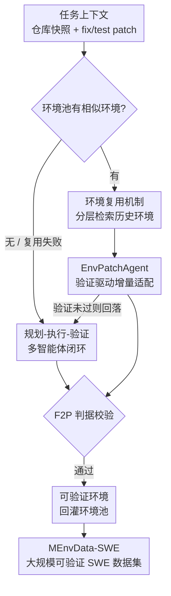

# MEnvAgent: Scalable Polyglot Environment Construction for Verifiable Software Engineering

**会议**: ICML2026  
**arXiv**: [2601.22859](https://arxiv.org/abs/2601.22859)  
**代码**: 已开源（论文称 code/benchmark/dataset 均在 GitHub，链接以原文为准）  
**领域**: 代码智能 / 软件工程 Agent  
**关键词**: 多语言环境构建, 多智能体, 可验证奖励, 环境复用, SWE 数据集

## 一句话总结
MEnvAgent 用「规划–执行–验证」三阶段多智能体闭环 + 环境复用机制，自动为 10 种语言的真实仓库搭建可执行、可验证（Fail-to-Pass）的 Docker 环境，在自建的 MEnvBench 上把 F2P 率提升 8.6%、构建耗时降低 43%，并据此造出迄今最大的多语言可验证 SWE 训练集 MEnvData-SWE。

## 研究背景与动机
**领域现状**：SWE-bench 这类「真实 issue 修复」基准已成为评测 LLM 编程能力的标准，OpenHands、SWE-Agent 等智能体要在仓库里定位问题、生成补丁、跑测试来验证解法。而这种「执行式验证」不仅用于评测，更是 RLVR（带可验证奖励的强化学习）等新训练范式的基石——没有能跑起来的环境，就没有可信的奖励信号。

**现有痛点**：可验证数据的规模受限于「能不能给一个仓库搭好可执行环境」。现有路线陷入两难：基于静态代码指标的方法（不真跑测试）虽然能规模化，但只能给出近似验证信号；人工搭建质量高却劳动密集，而且基本只覆盖 Python。跨语言、可执行、有质量保证的环境支持是一块空白。

**核心矛盾**：环境构建本身有两个硬骨头。其一是**复杂性**——非标准仓库依赖五花八门，版本冲突、编译错误频发，pytest / mvn test 等测试协议又各不相同，导致成功率低。其二是**耗时**——安装编译本就慢，且环境脆弱，一个错误往往逼着你「清盘重来」，大规模扩数据时这种重建开销高到难以承受。

**本文目标**：做一个能规模化、跨语言、自动产出可验证任务实例的环境构建框架，并配一套严格的多语言基准来证明它。

**核心 idea**：用**多智能体闭环**自主诊断并修复构建失败来攻克复杂性；用**环境复用机制**——检索相似历史环境、增量打补丁而非从零重建——来攻克耗时。

## 方法详解

### 整体框架
给定一个任务上下文（仓库快照 $R$、issue 及其 PR 拆出的 fix patch 与 test patch），环境构建的目标是确定一个配置三元组 $(B, \mathcal{P}, T)$：基础镜像 $B$、由一串安装命令组成的构建过程 $\mathcal{P}$、以及测试配置 $T$。构建出的环境记为 $S = \delta(B, \mathcal{P})$。合格标准不只是「能跑通」（Pass，$\varepsilon(R_{fix}, S, T)=0$），还要满足严格的 **Fail-to-Pass** 判据：

$$\varepsilon(R, S, T)=1 \;\land\; \varepsilon(R_{fix}, S, T)=0$$

即原始仓库状态 $R$ 上测试**必须失败**（复现了 issue），打上 fix patch 后**必须通过**（验证了修复）。这个「差分结果」才能保证环境是一个有效的可验证实例。

MEnvAgent 围绕这个目标分两条路协同：当池子里有相似历史环境时，走**环境复用**这条快车道（检索 + 增量补丁）；没有或复用失败时，回落到**规划–执行–验证多智能体闭环**从镜像逐步搭建。两条路最终都用 F2P 判据过一遍，验证通过的环境再回灌进环境池，供后续复用。

### 关键设计

**1. 规划–执行–验证多智能体闭环：把「搭不起来就重来」变成「自主诊断再迭代」**

这一设计直接对着「复杂性」痛点：单个 agent 很难一次性把陌生仓库的依赖、镜像、测试命令全配对。MEnvAgent 把过程拆成三阶段、由分工明确的专职 agent 协作。**规划阶段**由三个 agent 接力：Repository Analysis Agent 先摸清仓库的项目类型、依赖需求、入口点；Environment Setup Agent 据此选基础镜像并生成完整安装脚本 $\mathcal{P}$；Test Configuration Agent 再结合仓库结构与安装脚本合成兼容的测试配置 $T$，保证验证逻辑和环境设置对得上。**执行阶段**由 Environment Execution Agent 起容器跑 $\mathcal{P}$，并**实时盯终端输出**，能动态改命令现场修小错（缺包、版本冲突）；若多次尝试仍修不好，就放弃当前尝试、退回规划阶段重出方案。**验证阶段**由 Verification Agent 在容器里跑 $T$，若失败则做**错误归因**——判断是环境缺依赖还是测试命令不对——再把诊断反馈传回规划阶段指导下一轮。整个闭环让框架像人类工程师一样「试-诊-改」，把一次性失败转成可收敛的迭代，从而拉高成功率。

**2. 环境复用机制：用「分层检索」找到改动代价最小的历史环境**

这一设计对着「耗时」痛点：从原始镜像 $B$ 推导并执行完整 $\mathcal{P}$ 太贵，而同一仓库不同版本的环境其实高度相似。作者把问题重述为先从环境池 $\mathcal{S}_{pool}$ 里找一个适配成本 $\mathcal{C}_{adapt}$ 最小的相似环境：

$$S_{sim} = \mathop{\arg\min}_{S \in \mathcal{S}_{pool}} \mathcal{C}_{adapt}(S, R)$$

检索用的是一套**契合软件演化规律的分层策略**：先按**版本一致性**优先取与目标快照完全同版本的历史环境；找不到就放宽到同仓库的所有历史环境；再利用**向后兼容性**这一观察（新环境通常能支持旧依赖），从中挑一个**比目标快照新、但时间上最接近**的环境，以最小化兼容性风险。这样选出的 $S_{sim}$ 改动量小，避免了从零重建的主要开销。

**3. EnvPatchAgent：验证驱动的增量打补丁，把「复用」从赌博变成可收敛过程**

光检索到相似环境还不够——直接拿来用未必能跑通目标仓库。EnvPatchAgent 在一个反馈回环里生成增量命令序列 $\Delta\mathcal{P}$，把 $S_{sim}$ 适配到目标快照，得到 $S_{new}=\delta(S_{sim}, \Delta\mathcal{P})$，目标是满足 $\varepsilon(R, S_{new}, T)=1 \land \varepsilon(R_{fix}, S_{new}, T)=0$。流程是：先由 Test Configuration Agent 合成 $T$，在 $S_{sim}$ 里执行；**若直接通过就零成本复用**；若失败，EnvPatchAgent 分析诊断反馈、合成增量命令 $\Delta\mathcal{P}$ 打补丁，迭代直到满足 F2P 成功条件为止。消融显示这个 agent 是复用机制的命门——去掉它（只检索不打补丁、直接套用），复用成功率从 39% 暴跌到 25%，并因频繁回落到从零构建导致耗时反增 20%。

**4. MEnvBench 基准与 MEnvData-SWE 数据集：用严格执行式评测兜住质量**

为了既能严格评测又能落地产数据，作者构建了 **MEnvBench**：覆盖 10 种主流语言、200 个开源仓库、共 1000 个任务（10 语言 × 20 仓库 × 5 个来自不同历史版本的实例），强调**执行式评测 + 质量保证**，这是相对已有基准（语言窄、不可执行、缺质保）的关键补强。数据采集用两阶段管线：先按 >1000 star、>200 fork/issue/PR、主语言占比 >60% 等硬标准筛出约 8000 个仓库；再抽取 2018–2025 的 closed issue–PR 对、只留带 test patch 的、并用 LLM 打分（<5 分剔除），refine 出 213,766 个候选实例。评测用三个指标：Pass Rate（满足可执行性）、F2P Rate（满足严格有效性）、Time Cost（平均墙钟耗时）。进一步用 MEnvAgent 跑出 **MEnvData-SWE**——3005 个实例、覆盖 942 仓库 10 语言、全配可执行环境的迄今最大开源多语言可验证 SWE 数据集——并在其上收集解题轨迹用于下游微调。

## 实验关键数据

### 主实验
在 MEnvBench（10 语言平均）上对比最强基线 SWE-Factory，两种推理后端（开源 Kimi-K2、闭源 Gemini-3-Flash）都显著领先：

| 后端 | 方法 | F2P (%) | PASS (%) | TIME (s) |
|------|------|---------|----------|----------|
| Kimi-K2 | SWE-Factory | 26.2 | 34.5 | 6356 |
| Kimi-K2 | MEnvAgent | 35.7 (+9.5) | 45.9 (+11.4) | 3339 (-47.5%) |
| Gemini-3-Flash | SWE-Factory | 33.3 | 41.5 | 6175 |
| Gemini-3-Flash | MEnvAgent | 41.1 (+7.8) | 52.0 (+10.5) | 3808 (-38.3%) |
| 平均 | SWE-Factory | 29.8 | 38.0 | 6266 |
| 平均 | MEnvAgent | 38.4 (+8.6) | 49.0 (+11.0) | 3574 (-43.0%) |

在效率–质量散点图上，MEnvAgent 稳居「左上角」（耗时低、有效率高）；SWE-Factory 因低效的试错循环偏右（慢），Repo2Run / SWE-Bench-Live 偏下（有效环境产出能力弱）。

### 消融实验
在 Python 子集、每仓 10 实例上拆解环境复用机制（RSR = 复用成功率）：

| 配置 | RSR (%) | PASS (%) | TIME (s) | 说明 |
|------|---------|----------|----------|------|
| MEnvAgent (Full) | 39.0 | 59.0 | 2314 | 检索 + EnvPatchAgent 完整体 |
| w/o EnvPatchAgent | 25.0 | 52.0 | 2777 | 只检索直接套用，复用率掉、耗时反增 |
| w/o Reuse | 0.0 | 40.5 | 4283 | 每个任务从零构建 |

相比 w/o Reuse，完整框架把平均耗时降 46.0%、Pass Rate 提升 18.5%，因为复用绕开了从零解依赖这个最易出错的环节。

### 关键发现
- **EnvPatchAgent 是复用机制的核心**：去掉它复用成功率从 39% → 25%，并因频繁回落从零构建导致耗时不降反升，说明「检索到相似环境」必须配「验证驱动打补丁」才有价值。
- **数据规模驱动复用收益**：每仓实例数从 1 增到 10，复用成功率从几乎为 0 稳步升到 39%，Pass Rate 同步上升、Time Cost 同步下降——历史数据越多，复用越划算，框架在大规模数据积累场景下增益更大。
- **跨语言失败模式分化**：Go / Python 等生态标准化的语言 F2P 高；Java 因 Maven/Gradle 配置复杂常在环境搭建处失败（Gemini-3-Flash 在 Java 上的 setup 失败率约为 Kimi 的一半）；C/C++ 受 CMake 复杂配置与高资源消耗拖累，常因超时失败。这印证了 Verification Agent 做精确错误归因的必要性。
- **数据真能训出更强的 SWE 模型**：用 MEnvData-SWE 收集轨迹做拒绝采样微调后，Qwen2.5-Coder-32B-Instruct 在 SWE-bench Verified 上 Resolved Rate 从 7.5 → 54.6（+47.1），SWE-bench Multilingual 从 0.0 → 38.3（+38.3）；更强的 GLM-4.5-Air 也有 +4.8 / +5.4 的稳定增益。

## 亮点与洞察
- **把「环境构建」本身当成一个可验证、可优化的任务**：F2P 判据让「环境对不对」有了客观、可执行的判据，既能当评测指标，又能直接当 RLVR 的奖励来源——这是把 SWE 数据规模化的关键支点。
- **复用机制的检索策略很有工程智慧**：不靠语义 embedding，而是用「版本一致性 + 向后兼容性」这种贴合软件演化规律的启发式分层检索，简单、可解释，且天然契合「同仓库多版本高度相似」的现实。
- **检索 + 增量补丁 = 摊销构建成本**：单看一个任务复用未必快，但随着同仓库历史环境积累，后续任务能不断「站在前人肩膀上」增量适配，构建成本被摊薄——这个可迁移到任何需要反复搭重环境的场景（CI、依赖快照、Docker 层缓存）。
- **多 agent 分工对应构建流程的自然切分**：分析/选镜像/配测试/执行/验证各司其职，比单 agent 端到端更稳，且错误归因能精准定位是「环境缺依赖」还是「测试命令错」，让迭代有的放矢。

## 局限与展望
- 复用机制依赖**同仓库历史环境的积累**：在 1 实例/仓的稀疏场景复用成功率几乎为 0，冷启动阶段退化到从零构建，对全新仓库帮助有限。
- **C/C++ 等复杂编译生态仍是硬伤**：CMake 配置复杂、资源消耗高、易超时，F2P 明显低于 Go/Python，框架并未根本解决重编译语言的构建难题。
- F2P 率绝对值仍不高（平均 38.4%），意味着**多数真实仓库的环境仍搭不出有效的可验证实例**，离「任意仓库全自动可验证」还有距离。
- 评测/构建都重度依赖强 LLM（Kimi-K2、Gemini-3-Flash、专家模型 Claude-4.5-Sonnet），大规模产数据的 token 与时间成本本身也是一笔开销，论文未充分讨论其经济性边界。

## 相关工作与启发
- **vs SWE-Factory（最强基线）**：同为 agent 化环境构建框架，但 SWE-Factory 靠低效的试错循环，耗时高且无复用；MEnvAgent 用规划-执行-验证闭环 + 环境复用，在 10 语言上同时更准更快（F2P +8.6%、耗时 -43%）。
- **vs Repo2Run / 人工构建**：Repo2Run 是 Python 专用、扩展性受限，只能在 Python 子集评测；人工构建质量高但劳动密集、基本只覆盖 Python。MEnvAgent 把覆盖面拉到 10 种语言并全自动化。
- **vs 静态代码指标方法**：这类方法能规模化但只给近似验证信号；MEnvAgent 坚持执行式验证（真跑测试、F2P 判据），保证奖励信号可信，代价是更高的构建成本。
- **启发 RLVR / SWE 训练**：可验证环境是 RLVR 的奖励基础设施。MEnvAgent 提供了一条「自动造可验证环境 → 收集轨迹 → 微调」的规模化管线，为多语言 SWE 智能体训练补上了数据侧的关键一环。

## 评分
- 新颖性: ⭐⭐⭐⭐ 多智能体闭环不新，但「环境复用 + 验证驱动增量补丁」把构建成本摊销的思路在 SWE 环境构建里是实打实的新切口。
- 实验充分度: ⭐⭐⭐⭐⭐ 10 语言 1000 任务基准 + 双后端主实验 + 复用机制消融 + 数据规模分析 + 下游微调验证，链条完整。
- 写作质量: ⭐⭐⭐⭐ 问题形式化清晰、F2P 判据定义干净，图表支撑到位；部分细节压在附录。
- 价值: ⭐⭐⭐⭐⭐ 开源最大多语言可验证 SWE 数据集 + 基准 + 框架，直接服务于 RLVR 与 SWE 智能体训练，落地价值高。

<!-- RELATED:START -->

## 相关论文

- [\[ICLR 2026\] Ambig-SWE: Interactive Agents to Overcome Underspecificity in Software Engineering](../../ICLR2026/code_intelligence/ambig-swe_interactive_agents_to_overcome_underspecificity_in_software_engineerin.md)
- [\[ICLR 2026\] BOAD: Discovering Hierarchical Software Engineering Agents via Bandit Optimization](../../ICLR2026/code_intelligence/boad_discovering_hierarchical_software_engineering_agents_via_bandit_optimizatio.md)
- [\[ICML 2025\] Training Software Engineering Agents and Verifiers with SWE-Gym](../../ICML2025/code_intelligence/training_software_engineering_agents_and_verifiers_with_swe-gym.md)
- [\[ACL 2026\] EET: Experience-Driven Early Termination for Cost-Efficient Software Engineering Agents](../../ACL2026/code_intelligence/eet_experience-driven_early_termination_for_cost-efficient_software_engineering_.md)
- [\[ACL 2026\] Taming System Complexity: Demystifying Software Engineering Agents in Diagnosing Linux Kernel Faults](../../ACL2026/code_intelligence/taming_system_complexity_demystifying_software_engineering_agents_in_diagnosing_.md)

<!-- RELATED:END -->
