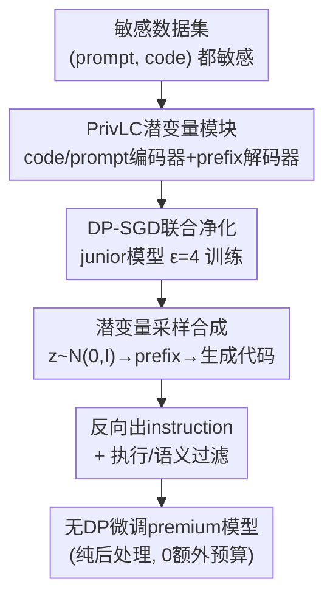

# PrivCode++: Latent-Conditioned Differentially Private Code Generation for Comprehensive Guarantees

**会议**: ICML2026  
**arXiv**: [2606.09145](https://arxiv.org/abs/2606.09145)  
**代码**: 有 [github.com/Liuzzyg/PrivCode_Plus](https://github.com/Liuzzyg/PrivCode_Plus)  
**领域**: 代码智能 / 差分隐私  
**关键词**: 差分隐私、代码生成、潜变量条件、prompt隐私、合成数据微调  

## 一句话总结
首个在"prompt 和 code 都敏感"的联合敏感场景下做差分隐私代码生成的工作：用一个 **Privacy-Free Latent Conditioning（PrivLC）潜变量模块**替代显式 prompt 条件，配上"DP 净化 + 无 DP 增益"两阶段流水线，在 $\epsilon=4$ 下既把效用拉回接近放松隐私假设的方法，又在 canary 泄漏测试上做到 0%。

## 研究背景与动机

**领域现状**：代码 LLM 普遍在 (自然语言 prompt, 代码) 指令对上微调；为了防止训练数据被记忆并泄漏，主流做法是用差分隐私（DP）生成合成数据替代敏感训练集，再拿合成数据去微调模型。

**现有痛点**：现有 DP 代码生成（如 PrivCode）只保护**代码片段**，默认 **prompt 是公开、无隐私的条件信号**。但现实里 prompt 本身常含敏感信息——示例代码片段、用户上下文、内部任务描述。一旦 prompt 也敏感、不能在生成时使用，代码合成就退化成**无条件生成**，效用、多样性、保真度全面崩塌（DP-SGD 噪声 + 代码刚性语法雪上加霜）。

**核心矛盾**：DP 代码合成的高效用**恰恰依赖 prompt 作条件**，而联合敏感设定下 prompt 又不许用。两个具体困难：(1) 没有显式 prompt，生成退化为无条件，代码相关性和结构变差；直接做 DP 指令微调（prompt+code token 一起在 DP-SGD 下优化）又被证实严重掉效用；(2) 现有 prompt-free 方案（潜变量、self-conditioning）仍是自回归 + 下一 token 似然最大化，概率质量集中在高似然区，输出多样性低、同质化严重，代码的刚性语法语义进一步放大这个问题。

**本文目标**：在 prompt 与 code **都视为敏感**的联合敏感设定下，找到一种**不依赖显式 prompt** 的有效条件机制，同时缓解 prompt-free 生成的效用与多样性退化。

**切入角度**：既然不能用显式 prompt，就学一个**连续潜变量条件空间**——把代码的句法结构和任务级语义（任务意图、功能需求、上下文约束）压进潜空间，让潜变量替 prompt 当条件信号；再借 VAE 先验采样引入"新颖但连贯"的结构多样性，对抗概率质量塌缩。

**核心 idea**：用 PrivLC 潜变量模块替代 prompt 条件，配 DP 净化 + 后处理增益两阶段——所有访问敏感数据的操作都在 DP-SGD 下完成，之后全是 DP 输出的纯后处理，**靠 DP 的后处理性质免费拿到额外效用**。

## 方法详解

### 整体框架
输入是敏感数据集 $\mathcal{D}=\{(p_i,c_i)\}$（prompt 和 code 都敏感），输出是一个**无 DP 约束、但全程满足 DP 保证**的代码合成模型 $\mathcal{M}_{\text{syn}}$。整体是 PrivCode 的两阶段范式（小 junior 模型扛 DP、大 premium 模型无 DP 增效）的扩展，但把"显式 prompt 条件"换成"潜变量条件"。

**第一阶段（隐私净化）**：在敏感代码上用 DP-SGD 联合训练 junior 模型 $\mathcal{M}_J$ 和 PrivLC 模块，把句法结构、语义、功能信息整合进一个潜在条件表示，缓解句法塌缩、提供任务级语义引导，并满足 $(\epsilon,\delta)$-DP。**第二阶段（效用增益）**：只在 DP 合规输出上操作——从先验采样潜变量、解码成 prefix embedding、条件生成代码片段，再用公开 LLM 把代码反向总结成 instruction，组成合成指令-代码对；经语法/语义过滤后，拿去无 DP 微调 premium 模型 $\mathcal{M}_P$。由于第二阶段全是 DP 输出的纯后处理，按 DP 后处理性质不增加任何隐私预算。

### 关键设计

**1. PrivLC 潜变量条件模块：用连续潜空间替代敏感 prompt**

针对"没了显式 prompt 就退化成无条件生成"的困难，PrivLC 学一个连续潜变量当条件信号。模块由代码编码器 $E^c$、prompt 编码器 $E^p$、prefix 解码器 $D$ 组成。给定代码 $c=(c_1,\dots,c_T)$，先用冻结的 junior 模型做一次前向拿到末层 token 表示 $h^c=f_{\mathcal{M}_J}(c)$，$E^c$ 聚合它并参数化一个对角高斯潜分布（标准 VAE 形式）：

$$(\mu^c,\log(\sigma^c)^2)=E^c(h^c),\quad q_\phi(z\mid c)=\mathcal{N}(\mu^c,\mathrm{diag}((\sigma^c)^2)),\ z^c\sim q_\phi(z\mid c)$$

潜变量 $z^c$ 被解码成 prefix embedding $\mathbf{e}_{\text{prefix}}=D(z^c)\in\mathbb{R}^{K\times d}$（实现里 $K=8$ 个虚拟 token），当作 soft prompt 拼到 token embedding 前面去条件自回归生成。为什么需要解码器：$z^c$ 是连续的、和 LLM 离散词表无关，必须映射成模型 embedding 层能吃的形式。这样 $\mathbf{e}_{\text{prefix}}$ 就提供了本该由显式指令给的条件信号，同时带来结构化多样性、对抗代码模型常见的重复/模板塌缩。

**2. VAE 正则 + prompt 对齐：把任务级语义注入潜空间**

光有代码潜变量还不够"懂任务意图"。作者一方面用 VAE 的 KL 约束把后验拉向标准正态先验 $\mathcal{L}_{\text{VAE}}=\mathrm{KL}(q_\phi(z\mid c)\,\|\,\mathcal{N}(0,I))$，使潜空间可从先验采样生成；另一方面引入辅助 prompt 编码器 $E^p$，把敏感指令也编码成 $z^p=E^p(h^p)$，再用对比目标对齐 code-诱导与 prompt-诱导的潜变量：

$$\mathcal{L}_{\text{align}}=-\log\frac{\exp(\langle z^c,z^p\rangle/\tau)}{\sum_{p'}\exp(\langle z^c,z^{p'}\rangle/\tau)}$$

这给 $z^c$ 提供了来自指令的 grounded 监督，更强地保证潜变量保留任务意图、上下文约束、功能需求等任务级信息。关键是：prompt 编码器只在**训练时**用敏感指令、且全程在 DP-SGD 下，生成阶段完全不碰原始 prompt，所以这份任务语义是"隔着 DP 屏障"学来的。

**3. 两阶段 DP 净化 + 纯后处理增益：靠后处理性质免费拿效用**

直接把 prompt+code 一起 DP-SGD 微调（DPFT）会因参数空间大、噪声累积、自然语言梯度干扰结构化代码学习而严重掉效用。PrivCode++ 沿用 PrivCode 的两阶段思路并扩展到联合敏感：第一阶段所有组件（$\mathcal{M}_J$、$E^c$、$E^p$、$D$）在统一隐私会计下用 DP-SGD 联合优化，共享同一个 $(\epsilon,\delta)$-DP；第二阶段从先验 $z_i\sim\mathcal{N}(0,I)$ 采样、解码 prefix、让 DP 合规的 $\mathcal{M}_J^{\text{DP}}$ 自回归生成代码 $\hat c_i\sim\prod_t P_{\mathcal{M}_J^{\text{DP}}}(\hat c_{i,t}\mid\mathbf{e}_{\text{prefix}}^{(i)},\hat c_{i,<t})$，再用强力外部 LLM $\mathcal{M}_{\text{ext}}$ 把代码反向总结成 instruction，经执行 + round-trip 语法/语义过滤后微调 premium 模型 $\mathcal{M}_P$。由于第二阶段输入全是第一阶段 DP 机制的输出、后续不再访问原始敏感数据，整条增益管线是 DP 输出的纯后处理，按后处理性质**不消耗任何额外隐私预算**——这是它能在强隐私下还保住高效用的根本原因。

### 损失函数 / 训练策略
第一阶段总目标含四项：prefix 条件下的代码 CE 损失 $\mathcal{L}_{\text{CE}}=-\sum_t\log P_{\mathcal{M}_J}(c_t\mid\mathbf{e}_{\text{prefix}},c_{<t})$、AST 相关的 $\mathcal{L}_{\text{KL}}^{\text{AST}}$（⚠️ 具体形式见原文附录 A.1，以原文为准）、VAE 的 $\mathcal{L}_{\text{VAE}}$、对比对齐 $\mathcal{L}_{\text{align}}$。隐私会计用 Rényi DP，$\epsilon=4$、$\delta=10^{-5}$；junior 模型用 Qwen2.5-Coder-1.5B，$E^c/E^p$ 为两层 MLP（$E^c$ 带 VAE 重参数化双线性头），$D$ 把潜变量映射到 8 个虚拟 token，所有微调用 LoRA 降本，prompt 抽取器/round-trip 用 Llama-3.1-70B-Instruct。

## 实验关键数据

### 主实验
四个 premium 模型、$\epsilon=4$ 下的 Pass@1（节选 Qwen2.5-Coder-7B 的 instruct 与 complete 关键列）：

| 方法 | HE (Instruct) | HE+ | BCB-Full (Inst) | HE (Complete) | MBPP (Comp) | BCB-Full (Comp) |
|------|------|------|------|------|------|------|
| PrivCode（放松隐私，仅护 code） | 66.5 | 61.0 | 22.9 | 43.9 | 77.9 | 27.9 |
| DPFT（联合 DP 微调） | 62.2 | 57.9 | 17.9 | 29.9 | 32.0 | 15.9 |
| PC-Uncond（无条件） | 64.6 | 58.5 | 17.0 | 32.9 | 24.9 | 17.6 |
| PC-PromptEmb（仅 prompt 条件） | 54.9 | 48.2 | 17.6 | 58.5 | 73.3 | 38.5 |
| PC-PreEmb（公开预训练 prefix） | 65.9 | 57.9 | 19.0 | 51.2 | 58.5 | 32.0 |
| **PrivCode++** | **68.3** | **60.4** | **21.6** | **64.0** | **77.8** | **43.3** |

在联合敏感保护方法里 PrivCode++ 一致最优，指令任务 Pass@1 最高 +8.2、代码补全最高 +19.3；甚至在多个指标上反超只保护 code、隐私假设更松的 PrivCode（如 BigCodeBench Complete-Full 从 27.9 提到 43.3）。作者归因于潜变量合成：从高斯先验采样在效用增益阶段引入了超出原数据集的新颖而连贯的结构与功能模式。

### 消融实验
各变体对应去掉 PrivCode++ 的一个机制：

| 配置 | 表现 | 说明 |
|------|------|------|
| Full（PrivCode++） | 最优 | 完整潜变量条件 + 两阶段 |
| DPFT | 最差之一 | prompt+code 联合 DP-SGD，噪声累积 + NL 梯度干扰结构化代码 |
| PC-Uncond | 最差之一（CodeGemma 上一度全 0） | 无条件生成，无句法/任务语义引导 |
| PC-PromptEmb | 中等 | 仅靠 prompt embedding 条件，结构信号弱于 code |
| PC-PreEmb | 中等 | 公开预训练 prefix，缺敏感语料的领域适配 |

### 关键发现
- **潜变量条件是效用核心**：去掉条件（PC-Uncond）直接崩，仅 prompt 条件（PC-PromptEmb）因 prompt 句法/结构信号弱于 code 也明显逊色——说明"用 code 学出的潜变量"才是有效条件的来源。
- **隐私保护近乎完美**：在 prompt / code / joint 三类 canary 泄漏测试中，PrivCode++ 在所有设定下达到 **0% 泄漏**；而非 DP 微调在 joint canary 注入 100 次时高达 100% 泄漏，连原 PrivCode 在 joint canary 上仍有最高 ~40% 的类别级泄漏。
- **不靠外部模型能力刷分**：附录把 $\mathcal{M}_{\text{ext}}$、round-trip 模型当可替换模块、甚至替换 junior 合成器后效果仍稳，说明增益来自方法本身而非外部强 LLM。

## 亮点与洞察
- **"潜变量当 soft prompt"是绕开 prompt 隐私的巧解**：把不能用的敏感 prompt 换成隔着 DP 屏障学出的连续条件信号，既保了隐私又没丢条件性，思路可迁移到任何"条件本身敏感"的可控生成任务。
- **把高效用全压进 DP 后处理阶段**：所有访问敏感数据的步骤在第一阶段一次性付清隐私预算，第二阶段靠后处理性质免费增效——这是 DP 合成数据范式里很干净的预算分配，0 额外预算拿大幅效用提升。
- **VAE 先验采样对抗代码塌缩**：从 $\mathcal{N}(0,I)$ 采样引入"新颖但连贯"的结构多样性，针对代码刚性语法导致的同质化输出，比纯自回归似然最大化更能保多样性。
- **反超放松隐私的 baseline**：联合敏感（更强隐私）却在多个指标上打过只护 code 的 PrivCode，颠覆了"隐私越强效用越差"的直觉。

## 局限与展望
- **依赖强外部 LLM 做 instruction 反推**：虽然附录论证不靠其能力刷分，但 prompt 抽取/round-trip 用的是 Llama-3.1-70B，落地成本和"代码→好 instruction"的质量仍是依赖项。
- **junior 模型偏小**：用 1.5B 的 Qwen2.5-Coder 当 DP 净化模型，更大 junior 在联合敏感下的噪声-效用权衡尚未充分探讨。
- **DP 数据点假设**：沿用"每条截断 (prompt, code) 序列当一个 DP 数据点"的标准假设，承认序列内相关性存在但未建模，邻接数据集以单条序列存在与否区分。
- **AST 相关损失细节**：$\mathcal{L}_{\text{KL}}^{\text{AST}}$ 的推导被放到附录，正文较简，复现需对照原文附录 A.1。

## 相关工作与启发
- **vs PrivCode（Liu et al., 2025）**：同样两阶段（junior DP + premium 无 DP），但 PrivCode 假设 prompt 公开、只护 code；本文扩展到 prompt 也敏感的联合敏感设定，用潜变量条件替代显式 prompt，隐私更全面、效用反而更高。
- **vs DPFT（联合 DP 指令微调）**：把 prompt+code token 一起 DP-SGD 优化，参数空间大、噪声累积严重、NL 梯度干扰结构化代码，效用大幅退化；本文用潜变量条件避开了直接优化整条指令序列。
- **vs 潜变量/可控文本生成（Bowman 等）与 prefix/prompt-tuning（Li & Liang、Lester 等）**：这些方法忽略隐私约束，而 DP 语言建模通常在 token 空间、不利用潜结构做可控性；本文把潜变量学习整合进 DP-SGD，用潜表示在保 DP 的同时把敏感 prompt 与代码生成解耦。

## 评分
- 新颖性: ⭐⭐⭐⭐⭐ 首个联合敏感（prompt+code 都敏感）DP 代码生成，潜变量替 prompt 的思路新颖
- 实验充分度: ⭐⭐⭐⭐ 四个 premium 模型、四基准、三类 canary 泄漏 + 多语言/可替换模块附录验证
- 写作质量: ⭐⭐⭐⭐ 动机和两阶段逻辑清晰，但部分损失（AST KL）细节下放附录
- 价值: ⭐⭐⭐⭐⭐ 让"prompt 也敏感"的真实场景能用 DP 代码合成，0% 泄漏 + 反超放松隐私 baseline

<!-- RELATED:START -->

## 相关论文

- [\[NeurIPS 2025\] Searching Latent Program Spaces](../../NeurIPS2025/code_intelligence/searching_latent_program_spaces.md)
- [\[ICML 2026\] HE-SNR: Uncovering Latent Logic via Entropy for Guiding Mid-Training on SWE-bench](he-snr_uncovering_latent_logic_via_entropy_for_guiding_mid-training_on_swe-bench.md)
- [\[ACL 2025\] CoCo-Bench: A Comprehensive Code Benchmark for Multi-task Large Language Model Evaluation](../../ACL2025/code_intelligence/coco-bench_a_comprehensive_code_benchmark_for_multi-task_large_language_model_ev.md)
- [\[ICML 2026\] Towards Functional Correctness of Code Models with Selective Generation](towards_functional_correctness_of_large_code_models_with_selective_generation.md)
- [\[ICML 2026\] AlgoVeri: An Aligned Benchmark for Verified Code Generation on Classical Algorithms](algoveri_an_aligned_benchmark_for_verified_code_generation_on_classical_algorith.md)

<!-- RELATED:END -->
