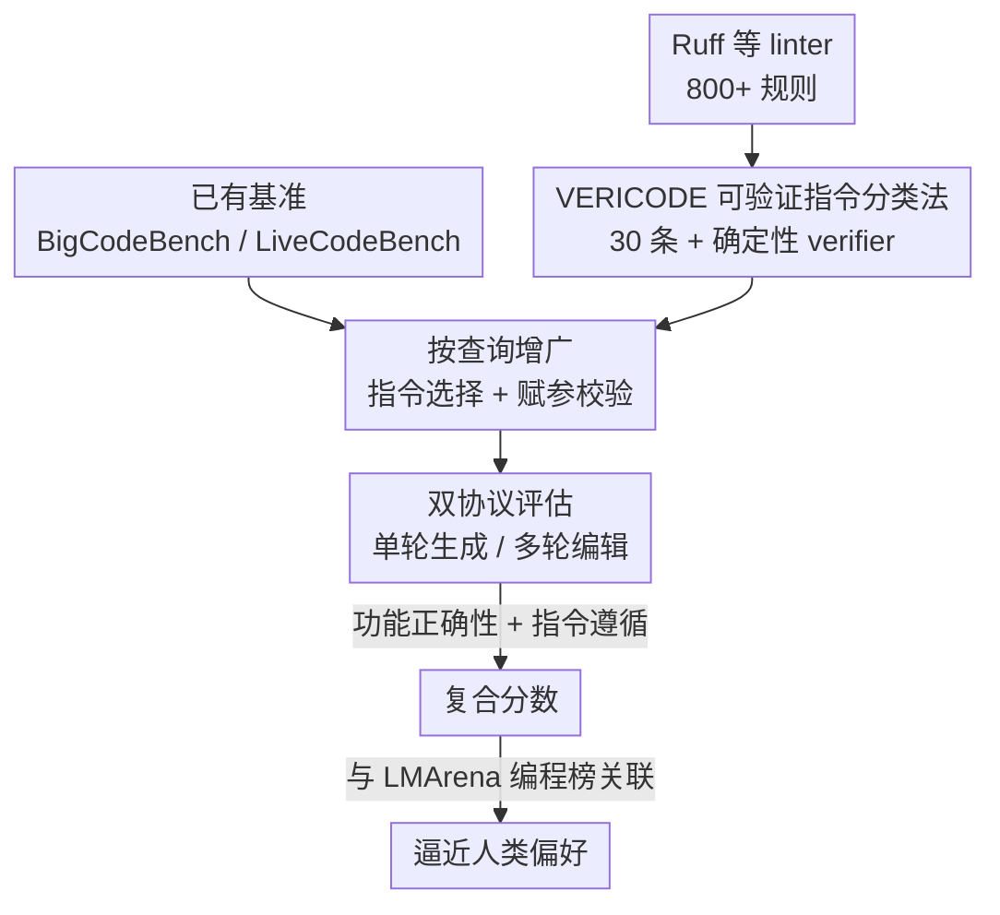

# SWE-IF: Aligning Code Evaluation with Human Preference

**会议**: ICML 2026  
**arXiv**: [2510.07315](https://arxiv.org/abs/2510.07315)  
**代码**: 见论文（Google DeepMind / UIUC）  
**领域**: 代码智能 / 代码评估基准 / 指令遵循  
**关键词**: 可验证指令、vibe coding、指令遵循、代码评估、人类偏好对齐

## 一句话总结
针对「代码评估只看 pass@k 功能正确性、却和真实用户偏好脱节」的问题，本文提出 VERICODE（30 条带确定性 verifier 的可验证代码指令分类法）和 SWE-IF 测试床，把功能正确性与「指令遵循」一起测，评测 31 个 LLM 后发现：功能正确性 + 指令遵循的复合分数最贴近人类偏好，而指令遵循才是高端模型之间真正的区分点。

## 研究背景与动机
**领域现状**：LLM 催生了所谓「vibe coding」——用户用自然语言反复让模型改代码，直到通过自己心里的「vibe check」（感觉对、读着顺、保留意图、还得正确）。当前主流代码评估却几乎都锚定在 `pass@k` 上，只测单元测试是否通过。

**现有痛点**：`pass@k` 只衡量功能正确性，完全抽掉了用户真正在意的非功能性期望——是否符合项目代码风格、文档是否清晰、改动是否最小化且聚焦、是否在多轮交互里保留了之前的意图。后果很直接：在 Copilot Arena 这种大规模人类选优场景里，代码 LLM 的排名和它们在主流功能基准上的分数呈弱相关甚至负相关。也就是说，模型可以刷榜很高，实际却过不了用户的 vibe check。

**核心矛盾**：评估指标（功能正确性）和真实评价目标（人类偏好）之间存在系统性错位。而且 `pass@k` 还是 RLVR 训练的主导奖励信号，等于把优化方向也带偏到一个不完整的「代码质量」定义上。

**本文目标**：把「指令遵循」（Instruction Following, IF）这块被忽略的拼图量化出来，并验证它是否就是 vibe check 里缺失的关键成分。这需要解决两个子问题：(1) 如何把模糊的「非功能性期望」变成可机器自动判定的信号；(2) 如何在已有基准上把功能正确性和 IF 一起测，并和人类偏好做关联。

**切入角度**：作者假设——非功能性指令的遵循程度，是 vibe check 中除功能正确性之外的重要且被低估的成分。要让这个假设可检验，关键是「可验证」：每条指令都得有一个确定性的、返回二值通过/失败的 verifier，这样既能客观评测，又能当作可扩展的奖励信号。

**核心 idea**：用工业级 linter / 静态分析把「人类对代码的非功能性偏好」编码成一套 30 条可验证指令（VERICODE），再用它增广现有基准得到 SWE-IF 测试床，最终用「功能正确性 + IF」的复合分数去逼近人类偏好。

## 方法详解

### 整体框架
SWE-IF 不是一个新模型，而是一套「把人类偏好变成可自动评测信号」的评估方法论，由三段串起来：先**离线**构建 VERICODE 指令分类法（含确定性 verifier）；再用它**按查询增广**已有代码基准（BigCodeBench、LiveCodeBench），为每道题挑出相关且互不冲突的指令子集并赋参；最后在**单轮 / 多轮两种交互协议**下评测模型，分别算功能正确性与指令遵循两个维度，并把复合分数和人类偏好榜做关联。

### 关键设计

**1. VERICODE：把非功能性偏好编码成可机器判定的可验证指令**

痛点在于「代码风格好不好、文档清不清晰」这类期望本来很主观，没法像单元测试那样自动判分。VERICODE 的做法是：每条指令都强制配一个**确定性 verifier**，输入代码、输出二值 pass/fail。30 条指令分到五个类别——编码风格与约定（9）、逻辑与代码模式（9）、文档与注释（6）、错误处理与异常管理（4）、库与 API 约束（2）。verifier 优先复用 linter 规则（如行长用 Ruff 的 `E501`、函数分支数上限用 `PLR0912`、docstring 风格用 `D` 系列、异常别名归一用 `UP024`、强制用 `pathlib` 替代 `os/glob/open` 用 `PTH`），没有现成规则的就用 AST 分析 + 正则自己实现，所有 verifier 共享「返回二值」的统一接口。

它的杀手锏是 **Parameters 字段带来的可扩展性**：一条指令可以挂可调参数（如 `line length` 取 79/88、`max branches` 取 2–4、docstring `convention` 取 Google/NumPy/PEP 257），于是 30 条核心指令能被程序化地展开成数百条不同难度的可检查约束。这让指令集既能覆盖五大非功能性维度，又能按需调难度，给后续训练提供可扩展、可复现的奖励来源。

**2. 多阶段构建：用「难度过滤」保证指令对先进模型仍有诊断价值**

如果指令太简单（强模型轻松满足），测出来全是满分就没有区分度。作者用三阶段构建来保证质量：先**来源采集**——从工业标准 Python linter Ruff（聚合 800+ 规则）拉候选池，并补充静态分析覆盖不到的「整段回复级」指令（如在代码块后追加 JSON 说明）；再**范围与相关性过滤**——自顶向下合并重叠规则，优先保留更宽泛、跨任务通用的指令；最关键的是**难度过滤**——用 Gemini 2.5 Flash 在更难的 BigCodeBench-Hard 上跑，测每条指令的遵循率与 `pass@1`，凡是遵循成功率 >90% 且不引起功能退化的指令一律删掉，只留下能挑战先进 LLM 的非平凡约束；最后由作者团队的领域专家人工 review + 实现 verifier。这一步直接决定了 SWE-IF「连最强模型都做不满」的诊断力。

**3. 按查询增广：用 LLM 选择器挑出相关且互不冲突的指令子集**

直接把 30 条全堆给模型既不真实也会互相打架。增广流程是：对每个用户查询，先把 30 条指令随机排列成有序列表，再让一个 **LLM 选择器**单遍扫描，按两条标准决定保留/丢弃每条——**相关性**（该指令确实和这道题有关、会影响实现）与**非冲突**（不与本遍已选中的指令矛盾）。选完后再让 LLM 给每条指令**赋具体参数**（prompt 里提供支持的键、类型、范围与推荐值），最后做**规则级校验**：未定义的参数键删掉、非法值回退到默认。作者对比了 Gemini 2.5 Pro 和 Claude 4 Opus 两个选择器，最终用 Claude 4 Opus 增广（无效参数率 0.96% vs 2.47%）。BigCodeBench（1140 题）增广成 **Big-SWE-IF**、LiveCodeBench v1–v6（1055 题）增广成 **Live-SWE-IF**，每题挂 5 条指令，合计 1 万多次指令级评测。

**4. 双协议评估 + 复合指标：把交互模式和两类指标摊开测**

单一打分掩盖了真实交互的差异，所以评估同时跑两种协议：**单轮生成**把所有选中指令和原始查询一次性给模型，要求一遍满足全部约束；**多轮编辑**先让模型对原始查询出初版，再逐条揭示指令，每轮带上完整历史让模型增量修改，取最后一轮代码评测。指标分两轴：功能侧用单元测试，报告加入 $k$ 条指令后的**功能退化率** $\text{FR}_k = (S_0 - S_k)/S_0$（$S_k$ 是注入 $k$ 条指令后的功能分、$S_0$ 是原始查询的分）；指令遵循侧用两个粒度——指令级 $\text{IF}_{\text{instruction}} = \frac{1}{k}\sum_{j=1}^{k} I_j$（逐条 verifier 通过取平均）和任务级 $\text{IF}_{\text{task}} = \mathbb{1}[\sum_{j=1}^{k} I_j = k]$（必须全条通过）。两轴一起看，才能暴露「功能 vs 指令遵循」的此消彼长。

### 一个完整示例
拿一道 Big-SWE-IF 的题走一遍：原始查询是「写个函数读取若干文件并汇总」。增广阶段选择器从 30 条里挑出 5 条相关且不冲突的指令并赋参，比如「每个函数最多 2 个分支」「用 Google 风格 docstring」「行长不超过 88」「用 `pathlib` 替代 `os.path`」「异常统一用 `OSError`」。

- **单轮**：这 5 条和原查询一次性给模型，模型出一版代码。verifier 跑 `PLR0912`/`D`/`E501`/`PTH`/`UP024` 逐条判定，单元测试同时判功能。常见结果是——为了塞下 5 条约束，模型在重构时不小心改坏了逻辑，`pass@1` 掉了几个百分点（功能退化），但指令满足得也不全。
- **多轮**：先让模型对原查询出初版，再一条条揭示指令、每轮改一次。模型能针对性地逐条改（指令遵循更高），但反复改动累积起来更容易碰坏功能（功能退化更大）。

这正是论文反复强调的权衡：单轮保功能、多轮保遵循，同一批任务、同一批约束，只是交互模式不同，模型行为就明显分叉。

## 实验关键数据

### 主实验
评测 31 个 LLM（覆盖 Gemini、Claude、OpenAI、DeepSeek、Qwen、Grok、Gemma、Mistral、MiniMax、Kimi 共 10 个家族），每题挂 5 条指令，上下文统一截到 32768 token。下表节选代表性模型在 5 条指令下的**任务级指令遵循分（越高越好）**：

| 模型 | Big 单轮 | Big 多轮 | Live 单轮 | Live 多轮 |
|------|---------|---------|----------|----------|
| Gemini 2.5 Pro | 30.70 | 33.68 | 29.57 | 32.80 |
| Claude 4 Opus | **46.75** | 42.11 | 35.17 | 43.70 |
| GPT-5 | 34.39 | 48.51 | — | — |
| Kimi K2 | 30.18 | 44.04 | — | — |

即便最强的 Claude 4 Opus，5 条指令下任务级 IF 也只有 46.75%（Big）/ 40.95%（Live，单轮），说明同时满足多条约束对 SOTA 模型仍是难题。

### 功能退化 / 消融分析
下表是 5 条指令下的**功能退化率**（%，越低越好；负值表示反而略升）：

| 模型 | Big 单轮 | Big 多轮 | Live 单轮 | Live 多轮 |
|------|---------|---------|----------|----------|
| Gemini 2.5 Pro | 1.39 | 5.04 | 2.45 | 2.23 |
| Claude 4 Opus | -2.08 | 3.78 | 8.96 | 2.34 |
| o4 mini | 9.56 | 8.05 | 12.29 | 15.92 |
| Kimi K2 | 2.03 | 6.12 | 16.36 | 12.79 |

### 关键发现
- **非功能性指令会显著拖累功能**：虽然这些指令不针对功能，所有模型的 `pass@1` 都在掉；5 条指令下两个增广基准上平均分别掉 5.85% 和 6.61%。
- **单轮 vs 多轮是一对此消彼长**：单轮更保功能（Big 上平均退化从 1 条的 2.48% 升到 5 条的 5.76%）但遵循更少；多轮遵循更高（Big 上任务级 IF 比单轮高 3%–4.5%，Live 上差距拉到约 8%）但功能退化更大（Big 多轮从 3.18% 升到 9.31%）。
- **存在位置偏置**：处于中间位置的指令比开头/结尾的指令更不容易被遵循。
- **复合分数最贴近人类偏好**：在 LMArena 编程子集上，「功能正确性 + IF」的复合分数与模型评分的相关性高于任一单项指标，且在高端模型之间，**IF 才是关键区分点**——这正面支撑了「指令遵循是 vibe check 缺失拼图」的核心假设。

## 亮点与洞察
- **把主观偏好做成确定性奖励**：用 linter 规则当 verifier，让「代码风格/文档/异常处理」这类软期望变成二值可判信号，不仅能评测，还能直接喂给 RLVR 当奖励——这是从「评测」到「训练信号」的关键一跃。
- **Parameters 字段是省力杠杆**：30 条核心指令靠参数化展开成数百条不同难度约束，既控制了维护成本又保住了可扩展性，这个「少量模板 + 参数化」的思路可迁移到任何需要可验证约束的领域（如 SQL/前端规范、数据管线契约）。
- **难度过滤防止基准饱和**：主动删掉强模型已经做满的指令，确保基准持续有诊断力，这种「以当前 SOTA 为筛子」的构造法值得其他基准借鉴。
- **最 "啊哈" 的点**：刷榜分数和真实用户偏好竟可能负相关，而把被忽略的 IF 加进去后复合分数就对上了——它说明「评估指标错位」可能正是当前代码 LLM 体感与榜单割裂的根因。

## 局限与展望
- **目前只实例化了 Python**：verifier 重度依赖 Ruff 等 Python 工具链；框架号称语言无关，但其他语言的 verifier 仍需重新对接。
- **指令选择/赋参依赖 LLM**：增广管线用 LLM 选择器和赋参，虽有规则校验兜底，但选择质量本身受所用模型影响（论文也观察到 Gemini 与 Claude 选择器的无效参数率差异）。
- **人类偏好关联是观测性的**：复合分数与 LMArena 评分的关联是相关性证据，复合权重如何最优组合、是否因任务而异，仍需更系统的研究。
- **可验证 ≠ 全部偏好**：能被 linter / AST 判定的非功能性偏好只是 vibe check 的一部分，更难形式化的「意图保真」「可读性」仍未完全覆盖。

## 相关工作与启发
- **vs `pass@k` 系基准（HumanEval / BigCodeBench / LiveCodeBench）**：它们只测功能正确性，本文在其上叠加可验证指令、把 IF 也纳入评测，弥补了与人类偏好脱节的短板；同时复用其单元测试保证功能侧可比。
- **vs Copilot Arena / LMArena 等人类选优平台**：它们直接采集人类偏好但不可解释、难当训练信号；本文用确定性 verifier 给出可解释、可复现的代理指标，并验证其与人类偏好的关联。
- **vs RLVR（以 `pass@k` 为奖励）**：本文指出 `pass@k` 是不完整的奖励定义，VERICODE 提供了一组可扩展的非功能性可验证奖励，指向更贴近人类偏好的训练目标。

## 评分
- 新颖性: ⭐⭐⭐⭐⭐ 把「vibe check」拆成功能 + 可验证指令遵循，并实证 IF 是高端模型的关键区分点，视角新颖
- 实验充分度: ⭐⭐⭐⭐⭐ 31 个模型 × 10 家族 × 两基准 × 单/多轮 × 1–5 条指令，万次级评测且关联人类偏好榜
- 写作质量: ⭐⭐⭐⭐ 动机与发现清晰，指标定义严谨，唯部分结论依赖附录细节
- 价值: ⭐⭐⭐⭐⭐ 既是可复现基准也是可扩展奖励来源，对评测和 RLVR 训练都有直接用处

<!-- RELATED:START -->

## 相关论文

- [\[ACL 2025\] UTBoost: Rigorous Evaluation of Coding Agents on SWE-Bench](../../ACL2025/code_intelligence/utboost_rigorous_evaluation_of_coding_agents_on_swe-bench.md)
- [\[ICML 2026\] SWE-rebench V2: Language-Agnostic SWE Task Collection at Scale](swe-rebench_v2_language-agnostic_swe_task_collection_at_scale.md)
- [\[ACL 2026\] From If-Statements to ML Pipelines: Revisiting Bias in Code-Generation](../../ACL2026/code_intelligence/from_if-statements_to_ml_pipelines_revisiting_bias_in_code-generation.md)
- [\[ICML 2026\] CentaurEval: Benchmarking Human-in-the-Loop Value in Agentic Coding](centaureval_benchmarking_human-in-the-loop_value_in_agentic_coding.md)
- [\[NeurIPS 2025\] SWE-rebench: An Automated Pipeline for Task Collection and Decontaminated Evaluation of Software Engineering Agents](../../NeurIPS2025/code_intelligence/swe-rebench_an_automated_pipeline_for_task_collection_and_decontaminated_evaluat.md)

<!-- RELATED:END -->
