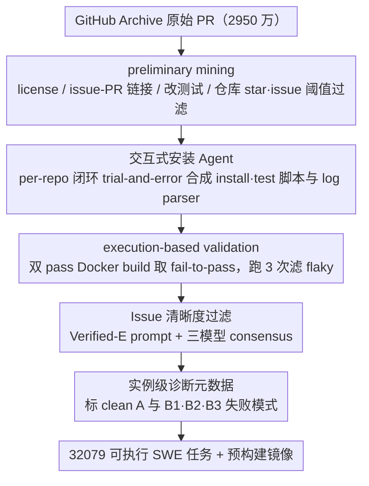

# SWE-rebench V2: Language-Agnostic SWE Task Collection at Scale

**会议**: ICML 2026  
**arXiv**: [2602.23866](https://arxiv.org/abs/2602.23866)  
**代码**: HuggingFace `nebius/SWE-rebench-V2` 与 `nebius/SWE-rebench-V2-PRs`  
**领域**: 代码智能 / SWE Agent 训练数据 / 多语言代码基准  
**关键词**: SWE Agent、可执行训练环境、多语言、自动化数据流水线、Issue 质量过滤

## 一句话总结
作者用"语言无关的统一构造流水线 + 交互式安装 Agent + 三模型集成的 Issue 清晰度过滤"，从 GitHub 上自动挖掘出 32,079 个跨 20 种语言、3,617 个仓库的可执行 SWE 任务（并附 12 万+ PR 衍生任务），每个任务都带预构建 Docker 镜像、fail-to-pass 测试以及实例级诊断元数据，为 SWE Agent 的大规模强化学习提供面向训练的、而非面向评测的稳定底料。

## 研究背景与动机

**领域现状**：以 SWE-bench 为代表的"仓库级 issue 解决"基准已成为 SWE Agent 的主流评测协议，而以测试通过为奖励信号的强化学习（RL）则成为推动 Agent 能力的主要手段。近来 SWE-Gym、Multi-SWE-RL、SWE-Factory、SetUpAgent、SWE-Bench++ 等都在试图自动化任务采集与环境搭建。

**现有痛点**：可用于训练（而非仅评测）的可执行任务依然稀缺：人工标注的 benchmark 规模太小且偏 Python，自动化流水线虽扩大了规模但大多仍是"评测优先"——缺少预构建镜像、缺少跨语言的稳定 fail-to-pass 信号、缺少描述与测试是否对齐的诊断信息，导致 RL 训练时奖励噪声极大、curriculum 难以设计。

**核心矛盾**：要让 RL 跑得稳，需要 (i) 安装依赖能复现、(ii) 测试运行确定性、(iii) 自然语言 spec 与测试 oracle 一致；而这三件事在跨语言场景下成本爆炸——每种生态有不同的构建系统、包管理器、测试 runner，逐仓手搓显然不可扩展。

**本文目标**：构造一条"language-agnostic"的端到端流水线——同一套工作流处理 20 种语言，仅靠少量可复用的语言模板（base image、runner、log parser）就能产出大规模、可复现、带诊断标签的可执行 SWE 训练任务。

**切入角度**：把全流程拆成五个阶段（preliminary mining → 交互式 setup synthesis → 双 pass 执行验证 → LLM 集成的 issue 清晰度过滤 → 元数据丰富），并对每个阶段做"yield vs 失败模式"量化，把质量控制内嵌到构造流水线本身。

**核心 idea**：以"interactive setup agent + 三 LLM judge 集成 + 实例级诊断标签"取代以往的"per-instance 人工验证"，在保留可执行性的前提下把数据规模推到训练所需的量级。

## 方法详解

### 整体框架
这项工作要解决的是"能用于 RL 训练、而非仅评测的可执行 SWE 任务太稀缺"的问题，做法是把任务构造拆成一条语言无关的五段式漏斗，把 2950 万个原始 PR 层层过滤到 3.2 万个稳定可执行任务（见 funnel 表）。第一段 preliminary mining 从 GitHub Archive 聚合 issue/PR 元数据、分布式克隆仓库后从本地 git 历史取 diff，按 license、issue-PR 链接、是否新增或改测试三层过滤，并对高资源语言（Python/Java/Go 卡 25 stars + 15 closed issues）和长尾语言（放宽到 10 stars + 1 closed issue）设不同阈值，保留约 2.17 万仓库、58 万候选；第三段 execution-based validation 用 multi-stage Docker build 把 base 层与仓库层分离，先打 test patch 跑全套测试、再叠加 solution patch 重跑得到 fail-to-pass 配对轨迹，每个任务跑 3 次、结构化结果不变才保留以滤掉 flaky。真正承载方法创新的是夹在中间和之后的三段——交互式 setup synthesis、issue clarity 过滤、metadata enrichment，下面分别展开。

### 关键设计

**1. 交互式安装 Agent：用闭环 trial-and-error 把"per-task 人工配环境"降成"per-repo 自动合成"**

跨 20 种语言、3.6k 仓库各有不同的构建系统、包管理器和测试 runner，逐仓手搓显然不可扩展；早期 SWE-rebench / SetUpAgent 在 Python 场景下"分析文件清单 → 生成指令"够用，但放到长尾构建系统就必须靠 trial-and-error 闭环才能覆盖。本文为每种语言预先用 Qwen3-Coder-480B 生成 base Dockerfile（如 Java 同时提供 JDK 11/17/21 多版本），再在其上叠装 mini-SWE-agent v1.14.4 + Qwen3-Coder-480B，让 Agent 通过"探索代码 → 跑安装 → 看报错 → 修脚本"的闭环自动产出可复现的 install/test 脚本和适配该仓库 stdout 的 log parser；关键工程约束是对每个仓库**只**做一次 setup 推断（取最新被挖到的 PR 对应 snapshot）再复用到所有任务，JVM 系强制要求 JUnit XML 等结构化报告以避免 stdout 顺序漂移，C/C++ 等编译型语言在打 patch 后强制插入 rebuild 防止跑到旧 binary，而 log parser 则靠"从一次成功跑取样 → LLM 合成解析器 → 在该仓库其它 trace 上验证 → 最多重试 5 次"自举。

它之所以有效，是因为闭环本身比模型放大更值钱：同等模型下交互式 pass@1 $= 25.8\%$ 远超非交互的 $12.1\%$，即便用更小的 Qwen3-30B 跑交互式（$17.4\%$）也已经超过 Qwen3-480B 跑非交互的 $12.1\%$；而 per-repo（而非 per-task）合成把约 535K 次 API 调用、$1.9$K USD 的总成本压到可接受范围。

**2. 多 LLM 集成的 Issue 清晰度过滤：在能跑通的任务上再剔除欠规约题面，保护 RL 奖励信号**

题面写不清会导致"Agent 答不对 → 测试挂"，把欠规约 issue 当作合格样本会直接污染训练奖励，而单个 LLM judge 又容易把"啰嗦但其实不清晰"的 issue 误判为合格。本文以 SWE-bench Verified 的 1699 条人工 well-specified 标注为 ground truth，做了三层 ablation：prompt 层比较 Rebench V1 / SPICE / Verified / Verified+ / Verified-E（后两者分别为 GPT-5.2 重写版与"喂入 patch + test patch"的增强版），单模型层中 gpt-oss-120b 综合 F1 最高、Claude Opus-4.5 与 Gemini 3 Pro 走高 precision 路线，集成层则发现三模型平均分给出最优 F1（$0.43$）、三模型 consensus 给出最优 precision（$0.88$，但 recall 仅 $0.06$）。

为了保护下游训练信号纯净，作者最终选择 Verified-E prompt + 三模型 consensus 的"宁缺毋滥"配置——consensus 等价于一次廉价的人工双盲复核；同时把这一步放在执行验证之后而非之前，是因为只有真能跑出 fail-to-pass 的任务才值得花 token 去评 issue 质量。

**3. 基于失败模式的实例级诊断元数据：显式标注缺陷而非追求 zero-defect，让下游按 curriculum 选样**

自动化流水线必然带噪声，与其奢求 zero-defect、或一刀切扔掉所有可疑任务（既损规模又未必准），不如承认缺陷并显式标注，让训练者自己做 stratified filtering。具体做法是先在 300 任务 $\times$ 7 个前沿模型（Claude Opus-4.5 / GLM-4.7 / Gemini 3 / DeepSeek-V3.2 等）$\times$ 3 次重跑的轨迹库里人工归纳出三种系统性失败模式——B1=测试套件耦合、B2=隐含命名要求、B3=外部依赖，再用 gpt-oss-120b 加 meta-prompt 把这套标签自动打回整库，给每个任务标上 clean (A) vs B1/B2/B3；下游训练者由此可按 curriculum 自主选样：SFT 暖启用 A 子集，RL 鲁棒性微调时引入 B1 任务并配 partial reward，B3 任务只给配备网页工具的 Agent。

为验证标签真有判别力，作者做了一次"A vs B\*"对照——在同语言、同改动规模下采样 60 任务，所有模型在 A 上的 pass@3 普遍是 B\* 子集的 $5$–$8$ 倍（如 Gemini $34.0\%$ vs $4.0\%$），说明这套诊断标签不是装饰而是 curriculum 设计的真凭据。

### 损失函数 / 训练策略
本工作不做端到端 RL 训练（作者在 Limitations 中明确这是 future work），而是验证训练所需的前提性质：可执行、非平凡、跨模型 pass@k 仍有 headroom、A/B\* 标签可分。

## 实验关键数据

### 主实验

| 阶段 | 输入 PR | 输出 PR | 输出仓库 | 说明 |
|------|---------|---------|---------|------|
| 原始 | $2.95\text{e}7$ | — | $1.45\text{e}5$ | GitHub Archive 全量 |
| 含测试 | $8.59\text{e}6$ | — | $1.02\text{e}5$ | 必须新增/改测试 |
| issue-PR 链接 | $8.06\text{e}5$ | — | $5.08\text{e}4$ | 强约束，约 10$\times$ 损失 |
| 仓库级过滤 | $5.84\text{e}5$ | — | $2.17\text{e}4$ | star/issue 阈值 |
| F2P 成功 | $4.13\text{e}4$ | — | 4006 | 安装+验证通过 |
| Issue 清晰度过滤 | $3.30\text{e}4$ | — | 3701 | 三模型 consensus |
| 三跑稳定 | $\mathbf{3.21\text{e}4}$ | — | $\mathbf{3617}$ | 最终发布 |

### 消融实验

| 配置 | pass@1 | pass@10 | 说明 |
|------|--------|---------|------|
| Non-interactive (Qwen3-480B) | 12.1 | 15.7 | 三步固定流程 baseline |
| mini-SWE-agent (Qwen3-30B, 32k) | 17.4 | 46.1 | 小模型 + 交互即超越大模型非交互 |
| mini-SWE-agent (DeepSeek-V3.2, 32k) | 20.3 | 59.8 | |
| mini-SWE-agent (Qwen3-480B, 32k) | 25.8 | 58.8 | 主配置 |
| mini-SWE-agent (Qwen3-480B, 128k) | **27.1** | **62.7** | 长上下文边际收益有限 |

### 关键发现
- **"交互"比"模型放大"更值钱**：Qwen3-30B 交互式 pass@1 $= 17.4\%$ 已经远超 Qwen3-480B 非交互的 $12.1\%$——闭环 debug 是必需品而非锦上添花。
- **issue 链接是最严重的瓶颈**：从"含测试的 860 万 PR"到"既有测试又有 issue 链接的 80 万 PR"直接掉一个数量级，这正是作者额外释放 12 万 PR 衍生任务（不依赖 issue 链接）的动机。
- **A/B\* 元数据真的有信号**：在 Code A 子集上 GLM-4.7 pass@3 $= 34.0\%$，B\* 子集上仅 $6.0\%$，差距 $5$–$8\times$，证明诊断标签不是装饰而是 curriculum 设计的真凭据。
- **Issue 过滤偏好高 precision**：作者最终选三模型 consensus（precision $0.88$，recall $0.06$），宁可丢掉真正清晰但被一个 judge 否决的题，也不让噪声 issue 污染训练奖励。

## 亮点与洞察
- **"per-repo 而非 per-task 合成 setup"是规模化的根本杠杆**：21,692 个仓库的安装代理跑了约 535K 次 API 调用、总成本约 $1.9$K USD，平均 $0.0873$ 美元/仓库；同样的预算若按 per-task 做将上一个数量级。这种"配置一次、收获该仓所有任务"的思路对任何需要环境搭建的领域（不止 SWE）都适用。
- **失败模式驱动元数据，而非元数据驱动失败模式**：作者先让 7 个前沿模型跑出大量失败轨迹，再归纳出 B1/B2/B3 三类共性缺陷，最后才让 LLM 把这套标签批量打回整库——这种"经验先验 + LLM 标注"的范式比"一开始就头脑风暴 100 种可能的缺陷"更扎实。
- **承认数据集是配置基底而非黄金标准**：4006 个 F2P 成功仓库中只有 3617 通过三跑稳定性测试（约 10% 被剔为 flaky），同时 PR 衍生任务里 23% 含一定 solution 泄漏（仅 2.4% 显式泄漏），作者全部如实标注并附诊断信号——这种"释放标签让用户自决"的态度比强行清洗更尊重下游研究者。

## 局限与展望
- 不做端到端 RL 训练 ablation：作者承认在 32k 任务 $\times$ 20 语言上做一次像样的 RL 实证需要巨大算力，因此只验证"前提性质"。导致"过滤后训练真的更好"这个最关心的问题仍未实证。
- Docker 镜像无法消除外部依赖漂移：包仓库、系统包、网络资源仍会变更，需要持续维护。
- 单 Docker 容器假设排除了多服务 / 数据库 / 队列等复杂系统：长尾的 enterprise 级仓库仍打不进来。
- PR 衍生任务的泄漏问题：$23\%$ 有泄漏、$2.4\%$ 显式泄漏；用作 RL 训练时需配合泄漏检测器，否则模型可能直接背答案。

## 相关工作与启发
- **vs SWE-rebench v1 (Badertdinov 2025)**：v1 仅 Python，自动化但评测导向；v2 把工作流统一到 20 语言并显式释放预构建镜像，是 v1 的"语言泛化 + 训练定向"版。
- **vs SWE-Factory (Guo 2026)**：SWE-Factory 主打四语言 + 多 Agent builder，本文胜在语言广度、实例级诊断元数据和 PR 衍生扩展。
- **vs SPICE (Oliva 2025)**：SPICE 用多 pass consensus 标 issue clarity / test coverage，本文直接把 LLM judge 集成嵌进流水线 + 校准到 SWE-bench Verified 的人工标注上，是"把 SPICE 当组件用"。
- **vs SWE-smith / SWE-Flow**：后两者走合成路线、可扩展性强但缺真实噪声；本文坚持真实 issue 路线 + 元数据增强，奖励信号更贴近线上分布。
- 启发：把"per-task 人工 → per-repo 自动 + 实例级标签"的两层抽象迁移到其他需要复杂环境的训练数据（如桌面/浏览器 Agent、CTF 安全题、生信工作流），可能同样把成本压一个数量级。

## 评分
- 新颖性: ⭐⭐⭐⭐ — 单看每个组件都有前作，但"language-agnostic 全流水线 + 训练定向 + 诊断元数据"的组合在 SWE 训练数据领域是首次成体系。
- 实验充分度: ⭐⭐⭐⭐ — 流水线 funnel、setup ablation、issue 过滤 ablation、A/B\* 验证齐备；缺一个真正的端到端 RL 训练验证，扣一星。
- 写作质量: ⭐⭐⭐⭐⭐ — 失败模式、成本、限制都坦诚交代，附录指明所有 prompt 与 parser 例子。
- 价值: ⭐⭐⭐⭐⭐ — 直接堵住 SWE Agent RL 训练的最大瓶颈，且数据集 + 镜像 + 代码全开源，社区价值极高。

<!-- RELATED:START -->

## 相关论文

- [\[NeurIPS 2025\] SWE-rebench: An Automated Pipeline for Task Collection and Decontaminated Evaluation of Software Engineering Agents](../../NeurIPS2025/code_intelligence/swe-rebench_an_automated_pipeline_for_task_collection_and_decontaminated_evaluat.md)
- [\[ICML 2026\] MatchFixAgent: Language-Agnostic Autonomous Repository-Level Code Translation Validation and Repair](matchfixagent_language-agnostic_autonomous_repository-level_code_translation_val.md)
- [\[ICML 2026\] HE-SNR: Uncovering Latent Logic via Entropy for Guiding Mid-Training on SWE-bench](he-snr_uncovering_latent_logic_via_entropy_for_guiding_mid-training_on_swe-bench.md)
- [\[ACL 2026\] SWE-QA: Can Language Models Answer Repository-level Code Questions?](../../ACL2026/code_intelligence/swe-qa_can_language_models_answer_repository-level_code_questions.md)
- [\[ICML 2026\] SWE-IF: Aligning Code Evaluation with Human Preference](swe-if_aligning_code_evaluation_with_human_preference.md)

<!-- RELATED:END -->
