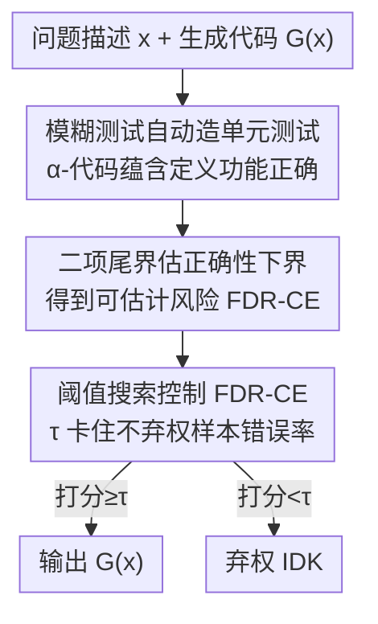

# Towards Functional Correctness of Code Models with Selective Generation

**会议**: ICML 2026  
**arXiv**: [2505.13553](https://arxiv.org/abs/2505.13553)  
**代码**: https://github.com/trustml-lab/selective-code-generation  
**领域**: 代码生成 / 可信机器学习  
**关键词**: 选择性生成、代码幻觉、FDR 控制、模糊测试、单元测试自动生成

## 一句话总结
用模糊测试自动生成大量单元测试来判定生成代码的功能正确性，并据此学一个会"主动弃权"的选择性代码生成器，在不弃权的回答里以 PAC 风格保证把代码幻觉率（FDR-CE）压到用户指定阈值以下。

## 研究背景与动机
**领域现状**：大模型写代码已经很强，但近期工作几乎都在"提升通过率"（如 DeepSeek-R1、OpenAI-IOI 用 RL 微调，CodeT/AlphaCode 用排序选最优解），都是在**间接**降低功能幻觉。

**现有痛点**：没有方法去**直接控制**"生成的代码不满足需求功能"这件事的发生率。自然语言生成那边已经有成熟的认证式幻觉控制（conformal prediction、selective prediction），但搬不到代码上——因为它们都依赖"文本蕴含"（textual entailment）来判定一个答案对不对，而人类很难标注两段代码是否功能等价。

**核心矛盾**：控制代码幻觉的真正瓶颈，是**判定两段代码功能是否等价**这件事本身极难。自然语言里人可以标注蕴含标签去训练判别模型，代码因为形式"不自然"做不到。已有的 HumanEval 这类基准靠人手写几个单元测试来验，但测试数量太少，覆盖不全；而且 `pass@k` 对测试数量敏感、也无法刻画"部分正确"的程序。

**本文目标**：给定一个现成代码生成器 $G$，学一个选择函数让它在"没把握"时返回 IDK（I don't know），从而把**不弃权回答中的错误率**控制在指定水平，同时尽量少弃权（保持选择效率）。

**切入角度**：代码有一个自然语言没有的杀手锏属性——**可执行**。既然能跑，就能自动造大量单元测试来逼近"功能正确性"这个真值，绕开"人难以标注代码蕴含"的死结。

**核心 idea**：用模糊测试（fuzzing）这种动态分析工具自动批量生成单元测试，把"代码蕴含"重新定义为"通过率达标"，再套用选择性生成的 FDR 控制框架，得到带认证保证的选择性代码生成器；同时把自动生成的测试也用于评测，称这套评测范式为 FuzzEval。

## 方法详解

### 整体框架
方法要解决的是"给一个代码生成器装上一个会弃权的开关，并保证开着的时候错误率受控"。整条管线分三段：先用模糊测试自动造单元测试，把"生成代码是否正确"变成一个可统计估计的量（$\alpha$-代码蕴含）；再把这个量当伪标签，用二项分布尾界给每个生成结果估一个正确性下界，定义出可估计的风险 FDR-CE；最后在校准集上搜一个置信阈值 $\tau$，让"不弃权样本中的估计错误率 + 估计误差"被卡在用户给的 $\varepsilon_S$ 之下，并给出 PAC 风格的高概率保证。

### 关键设计

**1. α-代码蕴含：用"通过率达标"重定义代码功能正确**

代码没法像句子那样让人标注蕴含关系，作者干脆用可执行性把"正确"操作化。设单元测试生成器 $\mathcal{F}(\mathbf{x})$ 从问题描述产出一批输入-输出状态对 $(\mathbf{u},\mathbf{v})$，则称 $\mathcal{F}(\mathbf{x})$ **$\alpha$-蕴含**一段代码 $\hat{\mathbf{y}}$，当且仅当它在这些测试上的期望正确率达标：

$$\mathbb{P}\{\hat{\mathbf{y}}(\mathbf{u})=\mathbf{v}\}\ge 1-\alpha,\quad (\mathbf{u},\mathbf{v})\sim\mathcal{F}(\mathbf{x}).$$

这里 $\alpha$ 是一个松弛旋钮：$\alpha$ 越小越严格。作者只取**单向**蕴含（$\hat{\mathbf{y}}$ 满足参考代码 $\mathbf{y}$ 的所有功能即算对，允许它多做别的），而不强求双向功能等价——因为对代码生成来说单向已足够，且双向判定代价更高。相比以往只盯"找反例证明不等价"的程序等价文献，这个定义把"对不对"变成一个可以用统计估计的概率量，是后面所有保证的地基。

**2. 二项尾界 + 自适应样本量：把"对不对"变成可估计的正确性下界**

真实的 $E_\alpha$（蕴含集）拿不到，作者把它估出来当伪标签函数。对每个问题跑 $n_\mathbf{x}$ 个自动测试，数通过个数 $\hat{k}$，用 Clopper-Pearson 那套**下二项尾界**估期望正确率的下界 $\hat{L}$，于是有高概率成立的保证 $\mathbb{P}\{\hat{L}\le \mathbb{P}\{\bar{\mathbf{y}}(\mathbf{u})=\mathbf{v}\}\}\ge 1-\varepsilon_E$。据此定义**估计蕴含集** $\hat{E}_{\alpha,\varepsilon_E}(\mathbf{x})=\{\bar{\mathbf{y}}\mid \hat{L}\ge 1-\alpha\}$。

关键巧思是**样本量自适应**：测试想造多少就造多少（fuzzer 随便跑），所以作者按"判定这段代码难易"动态加测试——一直加 $n_\mathbf{x}$ 直到下界 $\hat{L}>1-\alpha$，越模棱两可的代码就喂越多测试才下结论，封顶 $n_{\max}$。这把估计误差直接绑到了可控参数 $\varepsilon_E$ 上，为下一步把真风险夹住做铺垫。

**3. FDR-CE 控制算法：搜一个阈值，把不弃权样本的错误率卡死**

把估计蕴含集接回选择性生成框架。选择函数取标量参数化 $\hat{s}(\mathbf{x})=\mathbb{1}(f(\mathbf{x},G(\mathbf{x}))\ge\tau)$，打分 $f$ 默认用长度归一化对数概率 $f_{\text{norm}}$，作者还提出一个混合打分把它和留出测试的 pass@1 各取一半：$f_{\text{mixed}}=0.5 f_{\text{norm}}+0.5\,\text{pass@1}$。核心结论（Lemma 4.2）是真风险被估计风险加一个常数夹住：$\mathcal{R}_\alpha(\hat{S})\le \varepsilon_E + \mathcal{R}_{\alpha,\varepsilon_E}(\hat{S})$。于是算法在校准集上解一个一维优化：

$$\min_{\tau}\ \tau\quad \text{s.t.}\quad \varepsilon_E+\hat{U}_{\text{Binom}}\!\left(\hat{k};|\hat{\mathbf{Z}}|,\tfrac{\delta_S}{\lceil\log_2|\mathbf{Z}|\rceil}\right)\le\varepsilon_S,$$

即在"FDR-CE 受控于 $\varepsilon_S$"的约束下**把 $\tau$ 压到最小**（$\tau$ 越小弃权越少、选择效率越高）。$\log_2$ 那项是对一维阈值搜索做的多重检验校正。若约束不可行，就返回它能保证的最小风险 $\hat{U}$。最终定理 4.3 给出 PAC 风格保证：$\mathbb{P}\{\mathcal{R}_\alpha(\hat{S})\le\hat{U}\}\ge 1-\delta_S$，**全程不需要人对代码蕴含打任何标签**。

**4. 模糊测试做测试生成器 + FuzzEval：用动态分析探索更广执行路径**

具体的 $\mathcal{F}$ 用 fuzzing 实现（如 Atheris）：从种子分布采二进制流当种子随机初始化函数入参，再按覆盖率变异种子去探索更宽的执行路径；对带参考代码 $\mathbf{y}$ 的问题，反复执行参考代码收集多组 $(\mathbf{u},\mathbf{v})$ 随机选一组当真值对。和把 fuzzing 当"找 bug"工具不同，这里反过来用它**广撒执行路径**来逼近功能。作者进一步主张：在有参考代码和 fuzz harness 的评测基准上，用自动测试替代人手测试更严格，称之为 **FuzzEval**（与 HumanEval 对照）——因为代码越复杂执行路径指数爆炸，人手写测试根本覆盖不过来。

### 损失函数 / 训练策略
本方法是对现成生成器 $G$ 的**后处理校准**，不微调 $G$。"训练"指的是在 i.i.d. 校准集 $\mathbf{Z}$（$|\mathbf{Z}|=n$）上解上面那个一维阈值优化、求出 $\tau$ 与上界 $\hat{U}$。可调参数为目标风险 $\varepsilon_S$、失败概率 $\delta_S$、蕴含松弛 $\alpha$、估计误差 $\varepsilon_E$。整套方法可叠在任意基线（CodeT / LDB / SFS / GRPO 微调模型）之上，给它们额外加一层 FDR-CE 统计保证。

## 实验关键数据

实验覆盖 4 个生成器（GPT-4o、Gemini-1.5 Pro、DeepSeek-R1、CodeLlama-13B）、4 个数据集（APPS-f / MBPP-f / HumanEval-f / Mercury-f，"-f" 表示配了 fuzz 测试）、4 种编程语言。核心看两件事：FDR-CE 是否被压到目标 $\varepsilon_S$ 以下（达标越好），以及在达标前提下选择效率（不弃权比例）够不够高。

### 主实验
GPT-4o 上 SCG 与基线对比（$\alpha=0.35,\delta_S=0.1,\varepsilon_E=0.05$；加粗表示满足保证）：

| 数据集 | 方法 | 1-pass@1 ↓ | FDR-CE ↓ | 效率 ↑ |
|--------|------|-----------|---------|--------|
| APPS-f ($\varepsilon_S=0.3$) | 不选择 ($\tau=-\infty$) | 0.436 | 0.431 | 1.000 |
| APPS-f | SCG-manual | 0.293 | 0.291 | 0.497 |
| APPS-f | **SCG** | 0.227 | **0.224** | 0.337 |
| MBPP-f ($\varepsilon_S=0.4$) | 不选择 | 0.299 | 0.294 | 1.000 |
| MBPP-f | **SCG** | 0.304 | **0.300** | 0.996 |
| HumanEval-f ($\varepsilon_S=0.3$) | 不选择 | 0.185 | 0.207 | 1.000 |
| HumanEval-f | **SCG** | 0.069 | **0.049** | 0.164 |

读法：不选择时 FDR-CE 普遍超标（APPS-f 0.431 远高于 0.3），SCG 通过弃权一部分把 FDR-CE 拉回 $\varepsilon_S$ 以下。任务越难（APPS）需要弃权越多、效率越低（0.337）；任务相对容易（MBPP，目标也放宽到 0.4）几乎不用弃权也达标（效率 0.996）。

### 叠加到其他生成器（Table 2，GPT-3.5-Turbo，混合打分）

| 基线 | 指标 | w/o SCG | w/ SCG |
|------|------|---------|--------|
| Base | FDR-CE ↓ (MBPP-f) | 0.491 | **0.145** |
| CodeT (Chen 2023a) | FDR-CE ↓ | 0.498 | **0.148** |
| LDB (Zhong 2024) | FDR-CE ↓ | 0.442 | **0.142** |
| SFS (Light 2025) | FDR-CE ↓ | 0.483 | **0.140** |

四个基线（含排序/调试增强方法）原本 FDR-CE 都在 0.44~0.50，叠上 SCG（$\varepsilon_S=0.25$）后一律降到 0.14~0.15 区间、满足保证，效率仍维持在 0.58~0.66。说明 SCG 是**可插拔的额外统计保证层**，不挑底座。

### 关键发现
- **弃权效率随任务难度变化**：HumanEval 这类简单题，达标所需弃权少；APPS 这类难题必须大幅弃权，效率与正确性是天然 trade-off，由 $\varepsilon_S$ 调节。
- **混合打分更优**：把 $f_{\text{norm}}$（对数概率）与留出测试的 pass@1 各半融合，比纯用对数概率更能区分对错，效率更高。
- **能叠在 RL 微调之上**：DeepSeek-R1（GRPO 微调）已经很强，SCG 仍能在其上再加一道 FDR-CE 的统计保证（图 2c），二者正交。
- $\alpha$、$\varepsilon_S$ 越严，弃权越多、效率越低，曲线平滑可控（图 3）。

## 亮点与洞察
- **把"代码可执行"这一独有属性变成认证工具**：自然语言幻觉控制卡在"人难标注蕴含"，代码反而能靠跑测试自动造真值——这是从语言到代码迁移选择性生成最关键的一跃，思路非常干净。
- **样本量自适应是被低估的巧点**：fuzzer 想造多少测试就造多少，于是把"难判定的代码多喂测试"做成了机制，让二项尾界的估计误差变成可调参数 $\varepsilon_E$，直接进了风险上界。
- **可插拔 + 不碰底座**：作为后处理校准，不微调生成器、能叠在任意排序/调试/RL 方法之上，工程落地友好；想给已有 pipeline 加"安全阀"时这套迁移成本极低。
- FuzzEval 这个副产品本身有价值：对复杂程序，自动 fuzz 测试比人手 HumanEval 覆盖更全，可作为更严格评测的参考。

## 局限与展望
- **要有参考代码和 fuzz harness**：FuzzEval 与基于 fuzzing 的测试生成依赖参考实现和可执行的 fuzzing 桩，对没有参考代码、副作用重（IO/网络/并发）的真实工程代码适用性受限。
- **单向蕴含的盲区**：只验"包含参考功能"，允许生成代码多做别的事——若多出的功能恰好有害（如多写文件、引入副作用），单向蕴含判不出来。
- **效率在难任务上偏低**：APPS-f 上效率仅约 0.34，意味着三分之二的题被弃权，实用性取决于下游对"宁缺毋滥"的容忍度。
- **i.i.d. 与校准集假设**：PAC 保证建立在校准集与测试同分布上，分布漂移（新语言、新题型）下保证可能失效；自动测试本身的偏差也会经 $\varepsilon_E$ 传入。

## 相关工作与启发
- **vs 选择性文本生成 (Lee et al., 2024)**：本文直接继承其 FDR-E 分解与选择性生成框架，区别在于把"文本蕴含"换成可执行的"$\alpha$-代码蕴含"，并用 fuzzing 自动造测试当真值，从而把语言领域的认证控制搬进代码领域。
- **vs 排序式方法 (CodeT / AlphaCode / S\*)**：它们用单元测试给采样解排序选最优，目标是提升 pass 率；本文用测试判定 $\alpha$-蕴含并控制 FDR-CE，目标是**直接控错误率**，且可叠在它们之上提供额外保证。
- **vs RL 微调 (DeepSeek-R1 / OpenAI-IOI)**：微调用测试当执行反馈提升性能；本文不改模型权重，做后处理校准，二者正交可组合。
- **vs EvalPlus / Mercury 等自动造测试**：同样自动生成测试，但它们靠 LLM 变异种子，本文用安全社区验证多年的动态分析（fuzzing）探索执行路径，并配上 FDR-CE 的统计保证。

## 评分
- 新颖性: ⭐⭐⭐⭐⭐ 首个直接控制代码功能幻觉率的认证式方法，"可执行性→自动真值→选择性生成"的迁移很巧。
- 实验充分度: ⭐⭐⭐⭐ 覆盖 4 生成器/4 数据集/4 语言并能叠加多基线，但难任务效率偏低、依赖参考代码限制了场景广度。
- 写作质量: ⭐⭐⭐⭐ 理论推导（蕴含定义→尾界→PAC 保证）层层递进清晰，符号略密。
- 价值: ⭐⭐⭐⭐ 给可信代码生成提供了可插拔的"安全阀"，对高安全标准系统有实际意义。

<!-- RELATED:START -->

## 相关论文

- [\[ICML 2026\] Bridging Functional Correctness and Runtime Efficiency Gaps in LLM-Based Code Translation](bridging_functional_correctness_and_runtime_efficiency_gaps_in_llm-based_code_tr.md)
- [\[ICML 2026\] Poison with Style: A Practical Poisoning Attack on Code Large Language Models](poison_with_style_a_practical_poisoning_attack_on_code_large_language_models.md)
- [\[ICML 2026\] Locally Coherent Parallel Decoding in Diffusion Language Models](locally_coherent_parallel_decoding_in_diffusion_language_models.md)
- [\[ACL 2026\] Ro-SLM: Onboard Small Language Models for Robot Task Planning and Operation Code Generation](../../ACL2026/code_intelligence/ro-slm_onboard_small_language_models_for_robot_task_planning_and_operation_code_.md)
- [\[ICML 2026\] AlgoVeri: An Aligned Benchmark for Verified Code Generation on Classical Algorithms](algoveri_an_aligned_benchmark_for_verified_code_generation_on_classical_algorith.md)

<!-- RELATED:END -->
