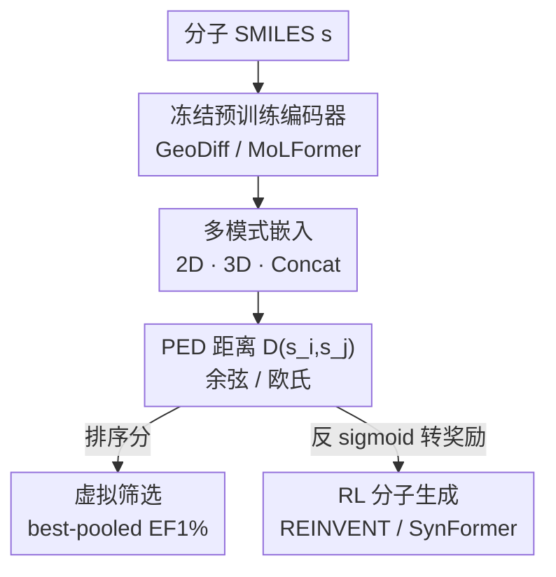

# Advancing Ligand-based Virtual Screening and Molecular Generation with Pretrained Molecular Embedding Distance

**会议**: ICML 2026  
**arXiv**: [2604.24474](https://arxiv.org/abs/2604.24474)  
**代码**: 待确认  
**领域**: 计算生物学 / 药物发现  
**关键词**: 配体虚拟筛选, 分子生成, 预训练分子嵌入, 分子相似度, 强化学习奖励

## 一句话总结
这篇论文提出直接用**冻结的预训练分子模型**（GeoDiff、MoLFormer）算嵌入之间的距离（PED）当分子相似度，不做任何相似度专项训练，就能同时用于虚拟筛选的候选排序和分子生成的奖励信号；它和工业标准的 3D 相似度（ROCS/ROSHAMBO2）强相关，在 LIT-PCBA 上 EF1% 反超传统度量，还把生成采样最高提速 3.3×。

## 研究背景与动机
**领域现状**：配体相似度是基于配体的药物发现（ligand-based drug discovery）的核心计算引擎——「结构/药效团相似的分子大概率结合同一口袋、产生相似活性」。它既是**虚拟筛选**的主排序启发式（从海量库里按和已知活性模板的相似度挑候选），也是 **RL 分子生成**的奖励来源（相似度驱动生成器探索生物活性区域）。

**现有痛点**：传统度量卡在速度与精度的二难。手工描述符和 2D 指纹（如 ECFP4/Tanimoto）刚性、低维，抓不住复杂生物机制；3D 形状+药效团对齐（ROCS、ROSHAMBO2）虽是工业金标准，却要做昂贵的构象生成和空间对齐，难以扩到大库。而近年的深度学习相似度方法又多半**依赖相似度专项监督或昂贵的数据构造**——监督法受限于小而稀的靶点特异数据集，对比学习则要用「预定义的相似度工具」去造配对数据，等于还是被旧度量绑定，泛化差。

**核心矛盾**：想要又快又准又通用的相似度函数，但「准」目前=贵的 3D 对齐，「快」=糙的 2D 指纹，「学一个」又=要标注/要旧度量造样本。

**切入角度**：预训练分子模型（在海量无标注分子上学过广谱化学知识）的嵌入空间，可能**本身就隐含了结构与药效团信息**——以往这类模型只在 QSAR/ADMET 等下游任务上 finetune 用，**直接拿它的嵌入距离当相似度函数这件事几乎没人系统研究过**。作者赌的就是：不微调、不要相似度监督，冻结模型的嵌入距离能不能匹配甚至超过昂贵的 3D 对齐？

**核心 idea**：提出 **PED（Pretrained Embedding Distance）**——冻结预训练分子编码器，把两个分子映成向量、算它们的距离当相似度，零专项训练，既当虚拟筛选的排序分，又当分子生成的奖励。

## 方法详解

### 整体框架
PED 本身极简：给定一个**冻结**的预训练分子编码器 $f(\cdot)$，把分子（SMILES 串 $s$）映成嵌入 $\mathbf{z}=f(s)\in\mathbb{R}^d$，两个分子的相似度就用嵌入间的距离度量

$$D(s_i,s_j)=\mathrm{dist}\big(f(s_i),f(s_j)\big)$$

其中 $\mathrm{dist}$ 取余弦距离或欧氏距离。论文用两个**架构截然不同**的预训练模型实例化 PED，并按表示来源分 2D / 3D / Concat 三种模式；再把这把「通用相似度尺」分别插进虚拟筛选（当排序分）和分子生成（当奖励）两条下游管线。整张图就是「冻结模型 → 多模式嵌入 → 距离 → 两类应用」。

### 关键设计

**1. 用两个异构预训练模型实例化 PED，并拆出 2D/3D/Concat 多模式**

为验证「嵌入距离能抓住结构与空间信息」，作者刻意选两个**来源不同**的冻结模型。**GeoDiff** 是扩散式构象生成模型，靠去噪目标 $\mathcal{L}_{\text{GeoDiff}}=\sum_{t}\gamma_t\mathbb{E}\|\epsilon-\hat\epsilon_\theta(\mathcal{C}_t,t)\|^2$ 训练，内部是双编码器：2D 的 GIN 编拓扑、3D 的等变 SchNet 编空间结构——天然能掏出三种嵌入：GIN 给 2D、SchNet 给 3D、两者 $\ell_2$ 归一化后拼接给 Concat，都对原子做 mean-pool 得定长向量。**MoLFormer** 则是在 11 亿条 SMILES 上做掩码语言建模的 Transformer，对 token 级输出 mean-pool 成全局嵌入，提供纯序列（2D 特性）表示。一个走 3D 几何、一个走 SMILES 序列，两条完全不同的路径都能给出有意义的 PED，正是为了证明这种「嵌入即相似度」的普适性，而非某个特定模型的巧合。

**2. 虚拟筛选里的 best-pooled EF1% 排序**

把 PED 当排序分时，给定参考配体和候选库，对所有分子算嵌入、按 PED **升序**排（距离越小越相似、越优先）。指标用 LIT-PCBA 基准上的 1% 富集因子

$$\mathrm{EF}1\%=\frac{N_{\text{actives}}^{1\%}}{N^{1\%}}\Big/\frac{N_{\text{actives}}}{N_{total}}$$

衡量 top-1% 子集里活性分子的富集程度。痛点是每个靶点常有**多个**参考配体，论文用 **best-pooled** 策略：每个候选 $s_i$ 对所有参考取**最小距离** $D_{\text{pool}}(s_i)=\min_j D(s_i,s_r^{(j)})$（若用相似度则取最大），给每个候选「匹配任一已知配体的最好机会」，更贴近实战中多参考配体搜库的场景。

**3. 把 PED 转成生成奖励：反 sigmoid 有界化 + 偏好欧氏距离**

分子生成是「以参考模板为中心的迭代优化环」：每步生成器采一批候选，相似度/距离打分当奖励，再更新模型把分布推向参考化合物所在的化学空间。要把 PED 接进来，得把「距离」翻成「越近越高」的有界奖励——用**反 sigmoid 函数**把 PED 映到 $[0,1]$，距离越小奖励越高。这里有个关键选择：相比余弦距离，**原始欧氏距离无界、动态范围更大、奖励信号更有信息量**，所以生成实验优先用欧氏 PED。最终打分函数把 PED 分和一个惩罚不良子结构的约束项**等权**相加，兼顾相似度优化与化学有效性。这套奖励插进两个代表性框架验证：**REINVENT**（基于 SMILES 的 RL，预训练先验保证有效性，用增广似然平衡奖励与先验）和 **SynFormer**（可合成生成，Transformer+扩散，先解码「砌块-反应」序列再组装分子，用 REINFORCE 变体微调）。

### 损失函数 / 训练策略
PED **本身不训练**——编码器全程冻结，没有任何相似度专项监督或微调，这正是它「通用、可扩展」卖点的来源。需要训练的只有下游生成器：REINVENT/SynFormer 在各自预训练先验基础上，用 PED 派生的奖励做 RL 微调（增广似然 / REINFORCE），把生成分布推向参考分子周围。

## 实验关键数据

### 主实验
**(a) PED 与传统 3D 相似度的相关性**（AmpC 上采 200k 分子，按 ROCS 3D combination 分箱均匀采样；负相关=高对齐，因距离小=相似度高）：

| PED 模式 | 对齐的 ROCS 度量 | Pearson r |
|--------|------|------|
| GeoDiff 2D | color（药效团） | −0.60 |
| GeoDiff 3D | shape（形状） | −0.60 |
| GeoDiff Concat | combination | −0.67 |
| MoLFormer | combination | −0.63 |

GeoDiff 3D 在所有 ROCS 度量上都比 2D 更稳；MoLFormer 对 color 高于 shape（−0.64 vs −0.48），与其 SMILES 的 2D 特性一致。

**(b) LIT-PCBA 虚拟筛选**（15 靶点，EF1% 余弦 PED，跨参考配体 boxplot）：

| 方法 | 平均 mean EF1% | 平均 best-pooled EF1% |
|------|------|------|
| MoLFormer 余弦 PED | **4.53 ± 2.79** | **6.15** |
| 2D ECFP4 相似度 | 3.94 ± 2.43 | 4.83 |

8 个「对 3D 形状筛选友好」（ROCS EF1%>2）的靶点里 PED 拿下 7 个 >2，剩余 7 个非友好靶点里也有 6 个 >2——说明 PED 不只在 3D 友好靶点上行。

### 消融实验（生成：scaffold 多样性 / 预测 pIC50，参考 BTK 抑制剂 BMS-986195）

| 框架 / 奖励 | top-5000 唯一 scaffold 比 | 预测 pIC50（scaffold 均衡 top-500） |
|------|------|------|
| REINVENT / ROSHAMBO2 | 7.94% | 7.40 ± 0.69（基线） |
| REINVENT / GeoDiff 3D | **35.16%** | 8.83 ± 1.29（Δ=0.71） |
| REINVENT / MoLFormer | 12.84% | **10.27 ± 1.34（Δ=0.92）** |
| SynFormer / GeoDiff 2D | **46.36%** | 8.81 ± 0.87（Δ=0.61） |
| SynFormer / MoLFormer | 5.04% | 8.31 ± 0.74（Δ=0.39） |

### 关键发现
- **效率是最大卖点**：生成采样里 GeoDiff 提速 1.5×、MoLFormer 提速 3.3×（REINVENT），SynFormer 里两者也约 2×——靠绕开昂贵的构象生成与空间对齐。
- **没有单一最优模式**：虚拟筛选 MoLFormer 最强；生成里 REINVENT 受益于 MoLFormer 和 GeoDiff 3D（pIC50 最高、Δ 最大），SynFormer 则偏好 GeoDiff 2D；最优 PED 模式随框架而变。
- **多样性 vs 成药性权衡**：GeoDiff 2D/Concat 在 SynFormer 里 scaffold 多样性高，但分子常落在 MW/TPSA/LogP/QED 理想区间外；REINVENT 因奖励里带不良子结构过滤，成药性整体更稳。
- 用 Boltz-2 预测 BTK 结合力，PED 引导生成的分子在多数情形预测 pIC50 高于 ROSHAMBO2，支持其生物相关性。

## 亮点与洞察
- **「免训练复用预训练嵌入当相似度尺」这个视角很省**：以往预训练分子模型都要 finetune 才用，本文证明冻结嵌入的**距离**直接就是一把好用的相似度尺，零标注、零相似度监督、还能无缝同时服务筛选和生成两类任务——一把尺子两处用。
- **最 aha 的是「扩散构象模型的内部嵌入隐含 3D 形状/药效团信息」**：GeoDiff 本是为生成构象训练的，但它 3D SchNet 编码器的嵌入距离竟和 ROCS shape 强相关（r=−0.60），说明几何生成模型顺带学到了可迁移的空间相似度，不必再跑显式对齐。
- 「用反 sigmoid 把无界距离转成有界奖励、且故意选动态范围更大的欧氏距离让奖励更有信息量」是个可直接迁移到其他「距离→RL 奖励」场景的实用 trick。

## 局限与展望
- **没有湿实验验证**：生成分子的活性/安全性全靠 Boltz-2 预测的 pIC50，作者自己在 Impact Statement 承认未做实验合成与 assay，therapeutic potential 尚未确认。
- **生成实验是单靶点单参考的 case study**（BTK 抑制剂 BMS-986195 一个参考化合物），结论的普适性需更多靶点验证。
- **没有统一的最优配置**：哪个模型、哪种模式、哪种距离最好都随任务/框架漂移，实际用还得逐场景调，缺乏一个稳健默认。
- SynFormer 因砌块式生成，高多样性模式常伴随理化性质越界，多样性与成药性难兼得。

## 相关工作与启发
- **vs DrugCLIP / S-MolSearch（对比学习相似度）**：它们**显式为相似度学习而训练**（DrugCLIP 对齐蛋白口袋与分子、S-MolSearch 用亲和力信号造软标签），仍需专项监督或构造配对；PED 用的是**非相似度专项**的冻结预训练模型，直接取嵌入距离，零专项训练。
- **vs ROCS / ROSHAMBO2（3D 对齐金标准）**：传统 3D 对齐准但要构象生成+空间对齐、极贵难扩库；PED 把「对齐」隐式吸进预训练嵌入里，免显式对齐、最高 3.3× 提速，且 EF1% 还能反超。
- **vs REINVENT/SynFormer 原生奖励**：本文不改生成框架，只把奖励里的相似度打分换成 PED，证明「奖励函数侧」换一把更快的相似度尺就能换来更优的潜在结合力和不同的多样性谱。

## 评分
- 新颖性: ⭐⭐⭐⭐ 「冻结预训练嵌入距离直接当通用相似度」视角清晰，但 PED 本身机制简单，更像一篇扎实的系统性研究。
- 实验充分度: ⭐⭐⭐⭐ 相关性+筛选+生成三任务、两模型多模式都覆盖，但生成只单靶点 case study、无湿实验。
- 写作质量: ⭐⭐⭐⭐ 动机的速度/精度二难讲得透，图表组织清楚。
- 价值: ⭐⭐⭐⭐ 即插即用、最高 3.3× 提速、零标注，对大规模药物发现工程落地很实用。

<!-- RELATED:START -->

## 相关论文

- [\[AAAI 2026\] S2Drug: Bridging Protein Sequence and 3D Structure in Contrastive Representation Learning for Virtual Screening](../../AAAI2026/computational_biology/s2drug_bridging_protein_sequence_and_3d_structure_in_contrastive_representation_.md)
- [\[NeurIPS 2025\] AANet: Virtual Screening under Structural Uncertainty via Alignment and Aggregation](../../NeurIPS2025/computational_biology/aanet_virtual_screening_under_structural_uncertainty_via_alignment_and_aggregati.md)
- [\[ICLR 2026\] Unified Biomolecular Trajectory Generation via Pretrained Variational Bridge](../../ICLR2026/computational_biology/unified_biomolecular_trajectory_generation_via_pretrained_variational_bridge.md)
- [\[ICML 2026\] Constrained Flow Optimization via Sequential Fine-Tuning for Molecular Design](constrained_flow_optimization_via_sequential_fine_tuning_for_molecular_design.md)
- [\[ICML 2026\] Learning the Neighborhood: Contrast-Free Multimodal Self-Supervised Molecular Graph Pretraining](learning_the_neighborhood_contrast-free_multimodal_self-supervised_molecular_gra.md)

<!-- RELATED:END -->
