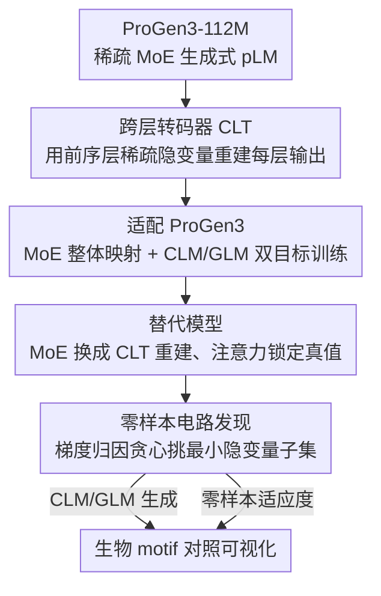

# Circuit Tracing in Autoregressive Protein Language Models

**会议**: ICML2026  
**arXiv**: [2606.16044](https://arxiv.org/abs/2606.16044)  
**代码**: https://github.com/amirgroup-codes/ProGenMech （可视化器 https://protmech.github.io/）  
**领域**: 计算生物 / 机制可解释性 / 蛋白质语言模型  
**关键词**: 跨层转码器, 电路发现, ProGen3, 稀疏 MoE, 生物 motif

## 一句话总结
ProGenMech 把"跨层转码器（CLT）"这套机制可解释性工具首次搬到**自回归生成式**蛋白质语言模型 ProGen3 上，用一套零样本电路发现算法找出不到 2% 的稀疏隐变量电路，既能复现 ProGen3 的生成概率分布和零样本适应度打分，又能把电路对应到激酶 HRD/DFG 等真实保守生物 motif。

## 研究背景与动机
**领域现状**：蛋白质语言模型（pLM）已经能在结构预测、适应度估计、蛋白设计上做到 SOTA，生成式 pLM 甚至能造出自然界没有的新蛋白序列。但模型内部"怎么把生物功能编码进去、怎么跨层组合结构约束、怎么协调逐位生成"基本是黑箱。

**现有痛点**：现有机制可解释性工具有两类，都不对路。稀疏自编码器（SAE）只能把某一层的激活分解成可解释特征，**抓不到跨层计算**；逐层转码器（PLT，per-layer transcoder）虽然能近似每层 MLP，但每层独立重建，**抓不到上下文沿深度的累积**。更关键的是，此前唯一在 pLM 上用 CLT 的工作 ProtoMech 只做了 ESM2——而 ESM2 是**掩码表示模型**，根本不做生成，因此暴露不出"生成"这个核心能力对应的电路。

**核心矛盾**：要解释"生成"，就得有个能忠实复现自回归生成计算、又跨层连通的替代模型；但生成式 SOTA 模型 ProGen3 偏偏用了稀疏 MoE 架构 + CLM/GLM 双任务目标，这两点让标准 CLT 没法直接套。

**本文目标**：把 CLT 适配到 ProGen3，做到（1）忠实近似它在因果生成和 span 填充两种模式下的计算；（2）找出负责生成与适应度预测的最小稀疏电路；（3）验证电路对应真实生物 motif。

**核心 idea**：用"跨层转码器替代模型 + 零样本（无监督探针）电路发现"，把生成式蛋白模型的内部计算拆成可解释、可追踪的稀疏隐变量电路。

## 方法详解

### 整体框架
ProGenMech 的流程是：拿 ProGen3-112M（$L=10$ 层、$d_{\text{model}}=384$）当被解释对象，先训练一个 CLT 作为它的**替代模型**——CLT 在每一层用来自所有前序层的稀疏隐变量去重建该层 MoE 的输出，等于把每层的 MoE 计算换成一个稀疏、可解释的隐空间。训练完后，针对具体任务（CLM 生成 / GLM 填充 / 零样本适应度打分）跑一套零样本电路发现算法，贪心地挑出能复现该任务行为的最小隐变量子集，最后把这些隐变量对应到具体氨基酸和已知生物 motif 上可视化。

### 关键设计

**1. 跨层转码器 CLT：用前序所有层的稀疏隐变量重建每层，抓住跨层累积计算**

这是直接针对 PLT"每层独立、抓不到上下文累积"痛点的设计。CLT 给每层一个编码器，把残差流输入 $\mathbf{x}^{\ell}$ 映射成稀疏隐变量 $\mathbf{a}^{\ell}=\text{TopK}(\mathbf{W}_{\text{enc}}^{\ell}(\mathbf{x}^{\ell}-\mathbf{b}_{\text{pre}}^{\ell})+\mathbf{b}^{\ell}_{\text{enc}})$，其中 TopK 算子只保留 $k$ 个最大幅度的隐变量、其余清零来强制稀疏。关键在解码：第 $\ell$ 层的输出不是只用本层隐变量重建，而是把**所有前序层** $1,\dots,\ell$ 的隐变量都汇进来：

$$\hat{\mathbf{y}}^{\ell}=\sum_{\ell^{\prime}=1}^{\ell}\mathbf{W}_{\text{dec}}^{\ell^{\prime}\rightarrow\ell}\mathbf{a}^{\ell^{\prime}}+\mathbf{b}_{\text{pre}}^{\ell}$$

正因为每层重建都依赖之前各层，CLT 能保留"上下文沿深度累积"的层间通路，而不是把每层割裂开。训练用 MSE 重建损失 $\mathcal{L}_{\text{MSE}}=\sum_{\ell}\|\mathbf{y}^{\ell}-\hat{\mathbf{y}}^{\ell}\|_2^2$，再加一个辅助损失 $\mathcal{L}_{\text{aux}}$——它用 top-$k_{\text{aux}}$ 隐变量去重建重建残差 $\mathbf{e}^{\ell}=\mathbf{y}^{\ell}-\hat{\mathbf{y}}^{\ell}$，专门减少训练中长期不激活的"死隐变量"，最终目标 $\mathcal{L}_{\text{CLT}}=\mathcal{L}_{\text{MSE}}+\alpha\mathcal{L}_{\text{aux}}$。代价是解码矩阵数量随层数按 $\mathcal{O}(L^2)$ 增长（编码器只是 $\mathcal{O}(L)$），所以整个 CLT 约 115M 参数，比被解释的 112M 模型还大。

**2. 适配 ProGen3：把整个 MoE 当一个映射、并按 2:1 混入 CLM/GLM 训练**

标准 CLT 是对着 MLP 层做的，而 ProGen3 用稀疏 MoE，每层把残差流动态路由到一部分专家子网络，没法直接套。作者的处理很务实：把 $\mathbf{x}^{\ell}$ 定为 MoE 层的输入、$\mathbf{y}^{\ell}$ 定为所有专家子网络聚合后的最终输出，**把整个 MoE 当成一个单一函数映射**来近似，于是 CLT 学到的是一个统一的稀疏隐空间，刻画专家集合的总体计算（代价是抹掉了内部路由逻辑，这也是作者承认的局限）。另一面，ProGen3 是 CLM（左到右自回归生成）+ GLM（span 填充）双任务训练的，CLT 若只见过一种模式就覆盖不了完整生成能力。所以训练时按 ProGen3 原配方设 CLM:GLM = 2:1（即 1/3 序列被部分掩码），掩码 span 长度从五个高斯混合 $\mathcal{N}(10,5),\mathcal{N}(30,10),\mathcal{N}(70,20),\mathcal{N}(200,50),\mathcal{N}(400,100)$ 等概率采样，最大掩码比例从 $\{0.15,0.25,0.5,0.8\}$ 按概率 $\{0.28,0.3,0.28,0.14\}$ 采样，确保 CLT 见过各种掩码状态。

**3. 零样本电路发现：以 KL 散度为归因目标贪心挑最小隐变量电路**

ProtoMech 在 ESM2 上靠**有监督探针**找电路（分类/回归），但自回归 pLM 没有现成标签，这条路走不通。本文改成零样本：目标计算直接定为"模型生成/打分时的内部概率分布"。具体做法是先固定一个**替代模型**——前向时把 MoE 输出换成 CLT 电路重建 $\hat{\mathbf{y}}^L$，但**注意力头输出锁定为真值 ProGen3 的**（因为作者发现把注意力也一起替换会因重建误差累积导致严重性能崩塌）。然后跑贪心搜索：对每个隐变量算一个归因分（它对降低"原始 logits 与重建 logits 间平均 KL 散度"的贡献），按归因幅度排序、小批量增量加入候选电路，直到 KL 散度 $\leq 1.2\times$ 完整 CLT 基线（生成任务），或恢复至少 70% 原始 Spearman 相关（适应度任务）。生成任务只看生成 token 的 KL，适应度任务看整个 logit 矩阵的 KL。一个细节：评估生成质量不像 NLP 那样追求复现单个 next token，而是用原始 ProGen3 的负对数似然 NLL 给生成片段打分当功能代理，因为 pLM 的价值在"生成功能上合理的序列"而非复现某个真值 token。

**4. 电路可视化与生物 motif 对照：用虚拟边把隐变量连成可读的计算图**

光有一组隐变量还不够，得让它对应到生物含义。作者把电路画成图：节点是可解释隐变量、边是隐变量间的"虚拟影响"。对给定输入，每层取归因分最高的 5 个节点；分析适应度地形时还额外纳入野生型与突变体间激活变化最大的 5 个节点。边权 $A_{s\rightarrow t}=a_s w_{s\rightarrow t}$ 定义为源节点激活 $a_s$ 乘上"目标节点预激活对源的梯度"，其中 $w_{s\rightarrow t}$ 用冻结注意力与 layernorm 分母下的雅可比算出。拿到节点后，找出驱动该隐变量激活的具体氨基酸，与 Swiss-Prot 中 top-10 最大激活序列交叉比对来检测保守 motif，再投影到蛋白结构上看空间分布是否靠近已知功能位点。

### 一个例子：追踪激酶 HRD motif 的生成电路
以激酶蛋白（UniProt P83104）在 CLM 模式下生成 HRD motif（位置 133–135，催化环的一部分，负责结合底物肽做磷酸化）为例：早期层先认基础生化模式——第 1 层隐变量 L1/3183 和第 2 层 L2/1754 都激活在精氨酸（R）上（催化活性的基本构件）；这股信息喂进第 5 层 L5/1090，它识别出整段保守催化环；再进第 7 层 L7/2070，把上下文收窄到催化环里的 HRD motif 并点出与之相互作用的 ATP 结合位点；最后第 8 层 L8/897（电路里归因分最大）专门负责检测 HRD 里的天冬氨酸（D）。整条电路恰好呈现"早期层认基础生化模式 → 中间层处理复杂功能 motif → 后期层敲定 next-token"的层级分工。类似地，在 GRB2 适应度打分里，高适应度变体 H26D 让"稳定性"相关隐变量 L10/225 的归因分涨了 58%+，而低适应度变体 Y51D 让"结合"相关隐变量 L10/3297 的归因分降了约 57%——都和实验数据吻合。

## 实验关键数据

### 主实验
在 Swiss-Prot（30% 序列同一性聚类、采样 1000 条）上做 CLM/GLM 生成，在 ProteinGym 8 个 DMS 适应度数据集上做零样本打分。CLM 用 top-$p$ 采样（$p=0.95$, $T=0.5$，低温放大分布差异），逐步喂真值激活防止误差累积。likelihood 恢复率定义为 $e^{\text{NLL}_{PG3}-\text{NLL}_{rep}}\times100$。

| 任务 | 指标 | ProGen3 原始 | ProGenMech (CLT) | PLT 基线 |
|------|------|------|------|------|
| CLM 生成（全隐变量） | NLL ↓ | 2.00±0.62 | 2.50±0.42（恢复 ~60%） | 2.57±0.36 |
| CLM 生成（电路） | NLL ↓ | 2.00±0.62 | 2.54±0.39（恢复 58%，719±339 隐变量, <2%） | 2.59±0.36 |
| GLM 填充（全隐变量） | NLL ↓ | 2.91±0.44 | 2.89±0.46 | 2.87±0.43 |
| 零样本适应度（全隐变量） | Spearman ↑ | 0.29±0.15 | 0.28±0.12（恢复 ~95%） | 0.25±0.12 |
| 零样本适应度（电路） | Spearman ↑ | 0.29±0.15 | 0.23±0.13（恢复 80%，256±334 隐变量, 0.6%） | 0.22±0.12 |

### 分析与消融

| 设置 | 关键现象 | 说明 |
|------|---------|------|
| CLT vs PLT（CLM） | CLT NLL 全面更低 | 跨层重建比逐层更接近 ProGen3 分布 |
| 完全递归替换（含注意力） | 性能大幅下降 | 重建注意力会累积误差，故锁定注意力为真值 |
| GLM 模式 | CLT 与 PLT 几乎并列 | 112M 模型本身就难做好填充（NLL 2.91 远高于 CLM 2.00） |
| 适应度电路 steering | 干预后 NLL 与基线分布上不可区分 | 生成端和打分端能力脱节，112M 太小 |

### 关键发现
- **电路极度稀疏**：CLM 生成电路只用 719±339 个隐变量（<2%），适应度电路只用 256±334 个（0.6%），就能恢复大部分行为，说明 ProGen3 的核心计算高度可压缩。
- **GLM 上没拉开差距是因为模型本身弱**：112M 的 ProGen3 填充能力差（NLL 2.91 ≫ CLM 的 2.00），作者预期放大到 219M/339M 会重现 CLM 上 CLT 优于 PLT 的优势。
- **生成与打分能力脱节**：试图通过干预适应度电路 steering 出高功能序列失败，生成片段始终过不了低复杂度区域过滤——说明该规模模型"会打分但不会照着分布生成"。

## 亮点与洞察
- **把生成式蛋白模型纳入机制可解释性**：此前 pLM 的 CLT 只做过掩码模型 ESM2，本文第一次覆盖自回归生成 + span 填充，补上了"生成"这一最核心能力的可解释性空白。
- **零样本电路发现绕开了标签难题**：用"复现内部概率分布的 KL 散度"做归因目标，不需要监督探针，天然适配没有现成标签的自回归生成场景，这套思路可迁移到任何生成式领域模型。
- **MoE 整体映射是个聪明的工程折衷**：把整个专家集合当单一函数近似，用一个统一隐空间换来可训练性——虽然抹掉路由逻辑，但作者也指明了 crosscoder / 专家专属隐空间是更原则化的后续方向。
- **电路对应真实生物学**：HRD/DFG motif、GRB2 结合/稳定性位点都能在电路里找到对应隐变量，且高/低适应度变体的归因变化方向与实验一致，提供了"可解释、生物学可信"的解释。

## 局限与展望
- **规模太小**：112M ProGen3 生成端弱，GLM 上 CLT 优势被淹没，steering 也失败，多处结论都押注在"放大到更大变体能解决"。
- **MoE 路由被抹掉**：把整个 MoE 当单一映射，丢失了内部路由信息；更忠实的做法需要专家专属隐空间或 crosscoder。
- **解释靠人工**：电路要靠人手动解析、与生物注释交叉比对，受限于已有生物知识，可能漏掉尚未表征的机制；自动注释流水线是关键下一步。
- **参数开销大**：CLT 解码矩阵随层数 $\mathcal{O}(L^2)$ 增长，放大到深层模型时训练成本会快速膨胀。

## 相关工作与启发
- **vs SAE（稀疏自编码器）**: SAE 只对单层激活做可解释因子分解，抓不到跨层计算；本文用 CLT 显式建模层间通路。
- **vs PLT（逐层转码器）**: PLT 每层独立重建，抓不到上下文沿深度累积；CLT 把前序所有层隐变量汇入当前层重建，CLM 上 NLL 全面更低。
- **vs ProtoMech（ESM2 上的 CLT）**: ProtoMech 只做掩码表示模型、靠有监督探针找电路；本文扩到生成式 ProGen3，并改用零样本电路发现，暴露生成相关电路。

## 评分
- 新颖性: ⭐⭐⭐⭐⭐ 首次把 CLT 机制可解释性搬到自回归 + MoE 生成式蛋白模型，并提出零样本电路发现。
- 实验充分度: ⭐⭐⭐⭐ CLM/GLM/适应度三任务 + 真实生物 motif 验证，但只在 112M 单规模、qualitative 部分集中在两个蛋白。
- 写作质量: ⭐⭐⭐⭐ 方法与生物案例叙述清晰，公式完整；部分结论较依赖"放大能解决"的预期。
- 价值: ⭐⭐⭐⭐ 为可解释、可操控的蛋白生成打下基础，零样本电路发现思路有跨领域迁移潜力。

<!-- RELATED:START -->

## 相关论文

- [\[ICML 2026\] Protein Circuit Tracing via Cross-layer Transcoders](protein_circuit_tracing_via_cross-layer_transcoders.md)
- [\[ICLR 2026\] Tracing Pharmacological Knowledge in Large Language Models](../../ICLR2026/computational_biology/tracing_pharmacological_knowledge_in_large_language_models.md)
- [\[ICML 2026\] SIGMA: Structure-Invariant Generative Molecular Alignment for Chemical Language Models via Autoregressive Contrastive Learning](sigma_structure-invariant_generative_molecular_alignment_for_chemical_language_m.md)
- [\[ICML 2026\] Protein Autoregressive Modeling via Multiscale Structure Generation](protein_autoregressive_modeling_via_multiscale_structure_generation.md)
- [\[ICML 2026\] Viral Proteins Reveal Geometry of Protein Language Models](viral_proteins_reveal_geometry_of_protein_language_models.md)

<!-- RELATED:END -->
