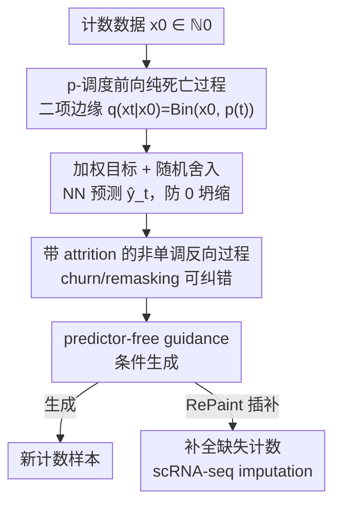

# CountsDiff: A Diffusion Model on the Natural Numbers for Generation and Imputation of Count-Based Data

**会议**: ICML2026  
**arXiv**: [2604.03779](https://arxiv.org/abs/2604.03779)  
**代码**: https://github.com/rsoatto/countsdiff  
**领域**: 计算生物学 / 扩散模型 / 单细胞 RNA 测序  
**关键词**: 离散扩散, 自然数生成, 单细胞插补, Blackout 扩散, 非单调反向过程

## 一句话总结
针对生物测序计数（scRNA-seq、ATAC-seq 等本质上是自然数）既不适合连续扩散也不适合类别扩散的问题，本文提出 CountsDiff——一个直接在自然数集 $\mathbb{N}_0$ 上运行的扩散框架，把 Blackout 扩散用「生存概率调度 $p(t)$ + 显式损失加权」重新参数化，并补齐连续时间训练、无分类器引导、churn/remasking（attrition）非单调反向轨迹与随机舍入等现代扩散工具，在 CIFAR-10/CelebA 图像和单细胞 RNA-seq 插补上以最简实例就匹敌甚至超过 SOTA 离散生成模型和专用插补方法。

## 研究背景与动机
**领域现状**：扩散模型是当前生成建模的 SOTA，在连续域（图像、音频、视频）和离散类别域（tokenized 文本）都被充分研究。但生物测序数据——全基因组测序、RNA-seq（含 scRNA-seq）、ATAC-seq、宏基因组 read counts——是丰度的直接测量，形式是**自然数**。

**现有痛点**：自然数像实数一样是无界有序集，却又是离散的，现有两类方案都有硬伤。**方案一**把自然数松弛到实数训连续扩散：但它在远大得多的实值分布空间上优化、只在推理时量化，作者用玩具数据证明这种「先连续后量化」常常失效（甚至 mode collapse）。**方案二**把每个数（到某上限）当独立类别训类别扩散：但它**忽略数值的天然序关系**，且类别数一大计算就爆炸。

**核心矛盾**：自然数同时具备「有序」和「离散」两个属性，连续扩散丢了离散性、类别扩散丢了序关系，没有框架同时尊重这两点。

**本文目标**：直接在 $\mathbb{N}_0:=\{0,1,2,\dots\}$ 上定义扩散，既保留离散性又利用序结构，并让它拥有现代扩散模型的完整工具箱（连续时间、引导、churn）。

**切入角度**：Blackout 扩散（Santos et al., 2023）已经能在计数域上做一个纯死亡过程、给出二项边缘分布，但它公式晦涩、缺现代工具、还有 0 坍缩失败模式。作者发现可以用「生存概率 $p(t)$」这一更直观的量重参数化它，从而把高斯扩散里成熟的噪声调度、加权、引导、churn 一一搬过来。

**核心 idea**：用生存概率调度 $p(t)$ 重写计数扩散的前向死亡过程，再把连续扩散的整套现代手段（加权目标、引导、非单调反向、随机舍入）系统地移植到自然数上。

## 方法详解

### 整体框架
CountsDiff 在自然数上建一条「前向腐蚀 + 反向生成」的扩散管线。前向是一个由生存概率 $p(t)$ 控制的**非齐次纯死亡过程**：从数据 $x_0$ 出发，每步只能减一，边缘分布严格为二项 $q(x_t\mid x_0)=\binom{x_0}{x_t}p(t)^{x_t}(1-p(t))^{x_0-x_t}$，$p(t)$ 从 1 单调降到 0，控制信息被破坏的速率。反向时神经网络在每个时刻预测「还剩多少元素」$\hat{y}_t$（经 softplus 保正、再随机舍入到整数），然后按带 attrition 的二项反向步重建样本；条件生成靠 predictor-free guidance；插补任务则用 RePaint 算法免重训地接上。整条管线的每个组件都刻意与高斯/类别扩散的对应件对齐，使其设计空间可直接复用既有调度与技巧。

### 关键设计

**1. 生存概率 $p(t)$ 重参数化的前向死亡过程**

Blackout 扩散把前向固定为 $\mu_i(t)=i$ 的纯死亡过程、$p(t)=e^{-t}$，公式晦涩且不灵活。CountsDiff 把它推广成一个**以 $p$-调度为参数**的非齐次纯死亡过程：转移率 $\mathbf{R}^{(\text{fw})}_{i,j}(t)=i\mu(t)(\delta_{i-1,j}-\delta_{i,j})$，并选取 $\mu(t)$ 使边缘恰为二项分布 $q(x_t\mid x_0)=\binom{x_0}{x_t}p(t)^{x_t}(1-p(t))^{x_0-x_t}$。命题 3.1 证明：只要 $p:[0,1]\to[0,1]$ 可微、单调递减、$p(0)=1,p(1)=0$，就存在对应的 CountsDiff 前向过程；Blackout 是其特例。关键洞察是作者证明了 CountsDiff 前向过程按 $p$-调度的信噪比，与高斯扩散按噪声调度 $\bar\alpha_t$ 的信噪比**完全一致**——这意味着任何高斯扩散的噪声调度都能直接搬到计数域。本文据此采用余弦调度 $p(t)=\cos(\tfrac{\pi t}{2})^2$（源自 Nichol & Dhariwal），它相比 Blackout 原调度有理论优势、训练也更稳定。

**2. 加权目标 + 随机舍入（防 0 坍缩）**

训练目标统一写成 $\mathbb{E}_{t\sim\phi}\big[w(t)(\hat{y}_t-y_t\log\hat{y}_t)\big]$，其中 $\hat{y}_t=\text{softplus}(\text{NN}_\theta(x_t,t))$，预测的是「剩余元素数」$y_t=x_0-x_t$。当 $w(t)=\tfrac{-p'(t)}{(1-p(t))\phi(t)}$ 时损失恰好回到 NLL；由于该目标逐点最小化于 $\hat{y}_t=y$，**任意 $w(t)>0$ 都不改变最优解，只影响训练动态**——这给了一个自由调节的加权旋钮，正对应高斯扩散里损失加权与重要性采样的关系。对余弦调度作者取 $w(t)=\tfrac{\pi}{2}\sin(\pi t)$，它能从「匹配高斯扩散常用 sigmoid 加权」或「匹配 Blackout 的 $-p'(t)$」两条正交启发各自推出。另一个易被忽视的细节是**舍入**：推理时要把实值预测转成整数，但朴素四舍五入会在 $\hat{y}<0.5$（近零计数频繁出现）时坍缩到 0；Blackout 用的 Poisson 近似在小 $y$ 下也不忠实。作者改用随机舍入 $\hat{y}_{\text{clipped}}=\lfloor\hat{y}\rfloor+\xi,\ \xi\sim\text{Bernoulli}(\hat{y}-\lfloor\hat{y}\rfloor)$，**保持期望不变又保留精确二项抽样**，从原理上防住 0 坍缩。

**3. 带 attrition 的非单调反向过程（churn/remasking）**

与公式 3 对应的标准反向过程是纯生过程，轨迹**单调递增**——类似掩码扩散里 unmasking 的不可逆性：一旦模型「过冲」就无法纠错、误差会累积。离散扩散靠 remasking 解决这点。CountsDiff 把反向过程推广到允许 **attrition**（非零死亡率，用出生补偿），得到一个保持相同二项边缘的非单调生灭过程（命题 3.2）：给定 attrition 率 $\sigma_{t,s}\in[0,\sigma_{t,s}^{\max}]$，按 $x_s=n_t+b_t$ 采样，其中 $n_t\sim\text{Bin}(x_t,1-\sigma_{t,s})$、$b_t\sim\text{Bin}(x_0-x_t,\beta_{t,s})$。$\sigma_{t,s}$ 类比高斯扩散的 churn 和离散扩散的 remasking——「出生 = unmask、死亡 = remask」，于是作者直接借用 ReMDM 的 remasking 策略 ReMDM-rescale（$\sigma_{t,s}=\eta_{\text{rescale}}\sigma_{t,s}^{\max}$）作起点。因为训练只依赖边缘分布，这一整族生灭反向过程对同一个训好的模型都合法，采样时把 $x_0-x_t$ 换成网络预测 $\hat{y}$ 迭代即可。

**4. Predictor-free guidance + RePaint 插补**

为支持条件生成，作者把 Nisonoff et al. (2025) 的连续时间离散引导适配到自然数：引导率 $\mathbf{R}^{(\text{rev})}(t;\gamma\mid c)=\mathbf{R}^{(\text{rev})}(t\mid c)^{\gamma}\,\mathbf{R}^{(\text{rev})}(t)^{1-\gamma}$，对 CountsDiff 简化为 $\hat{y}^{(\gamma)}=(\hat{y}\mid c)^{\gamma}\,\hat{y}^{\,1-\gamma}$，把它代入二项反向过程即得引导样本；实现上训单一网络、以概率 $p_{\text{uncond}}$ 随机置零类别嵌入来同时输出条件/无条件预测。对插补任务则套用图像 inpainting 的 RePaint 算法（**无需重训**）：每步反向后，把已观测项重置为其加噪后的真值，只对被掩盖项重采样——直接把生成模型变成计数插补器。

### 损失函数 / 训练策略
- 目标：$\mathbb{E}_{t\sim\phi}[w(t)(\hat{y}_t-y_t\log\hat{y}_t)]$，预测剩余元素数，softplus 保正。
- 调度：余弦 $p(t)=\cos(\tfrac{\pi t}{2})^2$，加权 $w(t)=\tfrac{\pi}{2}\sin(\pi t)$。
- 引导：predictor-free，$p_{\text{uncond}}=0.1$，强度 $\gamma$ 可调。
- 采样：带 attrition 的二项反向 + 随机舍入；attrition 由 $\eta_{\text{rescale}}$ 控制。
- 骨干：图像用 U-Net（沿用 Santos et al. 2023 超参），玩具/计数用小 MLP。

## 实验关键数据

### 主实验
**玩具计数（10 维稀疏负二项，约 50% 零、最大计数近 50）** 各维方差对比（越接近真值越好，节选 5 维）：

| 模型 | Dim0 | Dim1 | Dim2 | Dim3 | Dim4 |
|------|------|------|------|------|------|
| True（目标） | 0.78 | 4.71 | 0.10 | 0.12 | 0.28 |
| **CountsDiff** | 0.55 | 1.99 | 0.07 | 0.08 | 0.21 |
| Gaussian | 0.19 | 0.46 | 0.01 | 0.02 | 0.05 |
| Masked | 3.06 | 9.22 | 1.89 | 2.49 | 7.27 |

高斯扩散严重 mode collapse（方差远小于真值，增容量/调 lr 都无效）；掩码扩散方差爆炸（过拟合离群点、易生成「幻觉」并丢失维度间相关性）；CountsDiff 方差最贴近真值。

**CIFAR-10 图像（50k 采样的 FID/IS，节选 Table 1）**：

| $p$-调度 | $\gamma$ | $\eta_{\text{rescale}}$ | FID ↓ | IS ↑ |
|---------|---------|------------------------|-------|------|
| FI Discrete（≈Blackout） | uncond | none | 5.73 | 9.12 |
| FI Continuous | uncond | none | 5.44 | 9.09 |
| **FI Continuous** | 1.0 | 0.01 | **5.20** | 9.64 |
| Cosine | uncond | none | 5.76 | 9.29 |
| Cosine | 1.0 | 0.01 | 5.26 | 9.85 |
| Cosine | 2.0 | 0.02 | 11.55 | **9.93** |

把 FI 调度从离散推广到连续时间即降 FID；适度引导 + 小幅非零 attrition 进一步提升 FID/IS（最佳 FID 5.20）；FI 调度 FID 略优、余弦调度 IS 略优（更高保真但稍欠多样性）。

### scRNA-seq 插补
在胎儿/心脏细胞图谱上做三种缺失场景（胎儿 50% MCAR、胎儿 25% 低偏 MNAR、心脏 50% MCAR），对比朴素基线、scRNA-seq 专用方法（MAGIC/GAIN/HI-VAE/scGPT/xTrimoGene 等）与各扩散框架（Forest-Diffusion/ReMDM/Blackout），指标含点级（RMSE、bias、Spearman）与分布级（ED、MMD、SWD、scFID）。胎儿 50% MCAR 节选：

| 方法 | Spearman ↑ | RMSE ↓ | ED ↓ | log(scFID) ↓ |
|------|-----------|--------|------|--------------|
| Zero imputation | N/A | 1.91 | 1.44 | −2.35 |
| Mean imputation | 0.17 | 1.31 | 0.17 | −5.01 |
| Conditional Mean | 0.20 | 1.12 | 0.15 | −6.23 |
| MAGIC | 0.21 | 1.88 | 1.44 | −2.35 |
| scIDPMs(5-sample) | 0.10 | 1.89 | — | — |

> 论文结论：即便这一「最简实例」也能匹敌或超过 SOTA 离散生成模型与领先 scRNA-seq 插补方法，且 CountsDiff 设计空间仍有大量未挖掘的提升空间（⚠️ CountsDiff 与各 baseline 的完整逐指标数值以原文 Table 2/3 及附录为准）。

### 关键发现
- 现有扩散框架在**极简**计数玩具上就暴露失败：高斯坍缩、掩码过拟合离群点，凸显「直接在 $\mathbb{N}_0$ 上建模」的必要性。
- 适度引导 + 小幅 attrition 同时改善 FID 和 IS；attrition 过大（$\eta_{\text{rescale}}\to 1$）会过度平滑、抹掉纹理与透视——attrition 本质是「纠正过冲」的平滑旋钮。
- 余弦调度训练曲线更稳定，与其在高斯扩散中的原始动机一致。
- 仅用从既有框架直接搬来的设计选择，就在图像质量/多样性上获得显著提升，说明 CountsDiff 的设计空间有望支撑计数扩散的系统性快速进展。

## 亮点与洞察
- **「重参数化打通设计空间」的范式**：用生存概率 $p(t)$ 重写后，作者证明计数扩散与高斯扩散信噪比逐点一致，于是噪声调度、加权、引导、churn 全部「免费」搬过来——把一个孤立框架接入成熟生态，这种「找对参数化以复用既有工具」的思路极具迁移价值。
- **随机舍入防 0 坍缩**：一个看似工程性的小技巧，却从原理上（保期望 + 精确二项抽样）解决了近零计数的失败模式，对任何稀疏计数生成都通用。
- **attrition = 计数域的 churn/remasking**：把高斯 churn 与离散 remasking 统一解释为「出生/死亡」，让单调反向过程变可纠错，且对同一模型构成一整族合法采样器。
- **免重训插补**：RePaint 直接复用，使生成模型零成本变插补器，对 scRNA-seq 这类缺失普遍的数据极实用。

## 局限与展望
- 作者明确说这只是「初始实例」，设计空间（调度、加权、attrition、引导）远未优化，留有大量提升余量。
- 前向过程要求 $p(t)$ 单调递减且端点固定，调度选择空间受此约束。
- scRNA-seq 实验聚焦胎儿/心脏图谱与若干缺失模式，更广的测序模态（ATAC-seq、宏基因组）尚待验证。
- attrition 与引导强度需调参，过大 attrition 会过度平滑——超参敏感性仍需经验把控。

## 相关工作与启发
- **vs Blackout 扩散（Santos et al., 2023）**：本文是其严格推广——Blackout 是 $p(t)=e^{-t}$ 的特例；CountsDiff 用 $p$-调度重参数化并补齐连续时间、引导、attrition、随机舍入，还修了 Blackout 的 0 坍缩。
- **vs 连续扩散（松弛到实数，如 Forest-Diffusion）**：连续扩散在更大实值空间优化、推理时才量化，本文证明其在稀疏计数上易失效；CountsDiff 直接在 $\mathbb{N}_0$ 上建模、尊重离散性。
- **vs 类别扩散（ReMDM/MDLM 等掩码扩散）**：类别扩散忽略数值序关系且类别数大时计算爆炸、易过拟合离群点；CountsDiff 借二项结构保留序关系，attrition 也对应 remasking。
- **vs scRNA-seq 专用插补（MAGIC/scGPT/HI-VAE 等）**：本文以通用计数扩散框架的最简实例即匹敌/超过这些专用方法，且天然给出生成式不确定性。

## 评分
- 新颖性: ⭐⭐⭐⭐⭐ 首个把现代扩散完整工具箱系统移植到自然数计数域，并以信噪比对齐打通与高斯扩散的设计空间。
- 实验充分度: ⭐⭐⭐⭐ 玩具/图像/scRNA-seq 三档验证、baseline 丰富；惟正文未给全逐指标数值，需查附录。
- 写作质量: ⭐⭐⭐⭐ 公式与命题严谨、动机层层递进；推导细节多在附录，正文偏概览。
- 价值: ⭐⭐⭐⭐⭐ 开源、面向真实生物计数数据，且「最简实例即 SOTA」留足后续优化空间。

<!-- RELATED:START -->

## 相关论文

- [\[CVPR 2026\] MMCP-GEN: A Modality-Extensible Diffusion Language Model for Conditional Protein Sequence Generation](../../CVPR2026/computational_biology/mmcp-gen_a_modality-extensible_diffusion_language_model_for_conditional_protein_.md)
- [\[ICML 2026\] TD3B: Transition-Directed Discrete Diffusion for Allosteric Binder Generation](td3b_transition-directed_discrete_diffusion_for_allosteric_binder_generation.md)
- [\[ICML 2026\] Scalable Single-Cell Gene Expression Generation with Latent Diffusion Models](scalable_single-cell_gene_expression_generation_with_latent_diffusion_models.md)
- [\[AAAI 2026\] Distributional Priors Guided Diffusion for Generating 3D Molecules in Low Data Regimes](../../AAAI2026/computational_biology/distributional_priors_guided_diffusion_for_generating_3d_molecules_in_low_data_r.md)
- [\[ICLR 2026\] Ultra-Fast Language Generation via Discrete Diffusion Divergence Instruct](../../ICLR2026/computational_biology/ultra-fast_language_generation_via_discrete_diffusion_divergence_instruct.md)

<!-- RELATED:END -->
