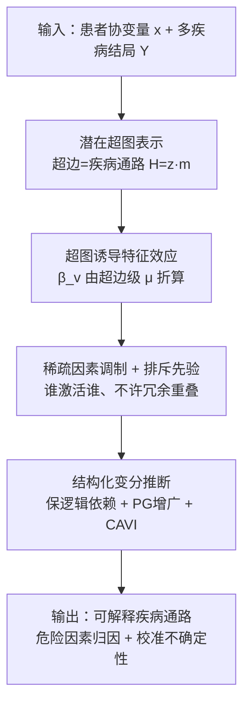

# Disentangling Latent Risk Pathways via Bayesian Hypergraph Inference

**会议**: ICML 2026  
**arXiv**: [2606.07677](https://arxiv.org/abs/2606.07677)  
**代码**: [github.com/Naomi-Ding/BHPI](https://github.com/Naomi-Ding/BHPI)  
**领域**: 计算生物 / 贝叶斯结构学习  
**关键词**: 贝叶斯超图, 多疾病建模, 结构化变分推断, 排斥先验, 电子健康档案  

## 一句话总结
针对电子健康档案（EHR）里"多疾病、长尾稀有、共享危险因素"的建模难题，作者把多疾病风险重构成"危险因素调制的潜在疾病通路"，用一张**潜在超图**（超边=共享危险因素的疾病子集）来表达高阶结构，配上一个**排斥先验**保证通路稀疏可辨识，再用一套**保持逻辑依赖的结构化变分推断**做可扩展、带校准不确定性的后验估计。

## 研究背景与动机

**领域现状**：EHR 让我们能在人群尺度上同时建模成百上千种疾病风险。现实里一个人常同时易患多病，疾病患病率从常见慢病到罕见病跨度极大，而年龄、吸烟、社会因素等共享通路会在疾病间诱发复杂依赖。

**现有痛点**：疾病间的依赖**不是对所有危险因素都一样**——不同危险因素以不同方式组织疾病。比如年龄同时抬高心血管和代谢病风险，吸烟主要影响呼吸和肿瘤类疾病。这些疾病分组是**重叠的、本身带不确定性的、且因危险因素而异的**。现有方法都接不住这个目标：独立的疾病专属模型（如逻辑回归）透明但把疾病当孤立任务，无法为罕见病借力、不确定性校准差；多任务/联合建模能共享信息却多是黑箱，把所有危险因素纠缠进单一潜空间，看不清"哪个因素经哪条通路起作用"；结构化的疾病网络/共病模型又往往把所有因素聚合成一张相关结构，无法按因素拆解，且难以扩展到现代 EHR 规模。

**核心矛盾**：真正的目标不是单纯预测，而是要**学到危险因素特异、可重叠的潜在结构**，且这结构是**高阶的**（疾病成组、而非成对），同时还得在长尾、数据有限的情况下给出**校准的不确定性**。统计效率（为罕见病借力）和结构化归纳偏置（可解释、可辨识）必须兼得。

**本文目标**：回答一个核心流行病学问题——某个危险因素是经由哪些共享疾病通路施加影响的，我们对这个结构有多确定？分解为：(i) 在含低患病率疾病的多相关结局上预测风险；(ii) 恢复可解释、可重叠的潜在疾病通路。

**切入角度**：作者的关键洞察是**表征层面的**——标准图和多任务模型只捕获成对相关或纠缠的共享效应，而病因通路本质上是高阶的、涉及一组疾病。所以应该用**超图的超边**来表达通路。

**核心 idea**：把多疾病建模重构为"发现潜在的、危险因素调制的疾病通路"——疾病是超图节点，超边是共享危险因素影响模式的疾病子集，危险因素**直接作用在超边上**，从而把因素影响与单个结局解耦，天然支持重叠的、因素特异的疾病组织，并用全贝叶斯框架给出结构与效应传播的校准不确定性。

## 方法详解

### 整体框架

BHPI（Bayesian Hypergraph Pathway Inference）是一个生成式贝叶斯模型 + 一套可扩展推断算法。生成侧自上而下是四层：观测模型把潜在通路结构连到二值疾病结局；潜在超图用关联矩阵 $H$ 编码"哪些疾病属于哪条通路"；超图诱导的特征效应把超边级效应折算成疾病级危险因素系数；稀疏的、带排斥先验的因素-超边效应决定"哪个危险因素激活哪条通路"。推断侧则用一套**结构化变分推断**：因为超边存在、疾病成员、效应之间有硬逻辑依赖（存在→成员→效应），标准 mean-field 会把这些依赖打散导致不确定性失准，作者设计了保持这些耦合的变分族 + Pólya–Gamma 增广 + 坐标上升（CAVI）来求解。

整张图的输入是患者协变量 $\boldsymbol{x}_i\in\mathbb{R}^P$ 和多疾病二值结局 $Y_{i,v}$，输出是疾病通路结构（超图）、危险因素到通路的归因、以及两者上的后验不确定性。

### 关键设计

**1. 潜在疾病超图：用超边表达高阶、可重叠的疾病通路**

成对图和全局共享表征只能表达"两两相关"或"纠缠的共享效应"，而病因是一组疾病一起被某个危险因素模式驱动——这是高阶的。作者用超图 $\mathcal{G}=(\mathcal{V},\mathcal{E})$，节点 $\mathcal{V}$ 是疾病、每条超边 $e$ 表示一组疾病对输入特征的共享响应模式，用关联矩阵 $H\in\{0,1\}^{V\times E}$ 编码，$H_{v,e}=1$ 表示疾病 $v$ 属于通路 $e$。超边允许重叠，于是一种疾病可同时参与多条通路。疾病级特征效应由超边级效应诱导：

$$\beta_{j,v}=d_v^{-1}\cdot\sum_{e=1}^{E}H_{v,e}\,\mu_{j,e},\quad d_v=E^{1/2},$$

其中 $\mu_{j,e}$ 是危险因素 $j$ 对超边 $e$ 的效应，归一化常数 $d_v=E^{1/2}$ 稳定诱导效应的方差、让风险量级不随 $E$ 增大而漂移。这个构造的妙处是：一种疾病可经不同通路被不同特征影响，一个特征也可作用于多个疾病子集——把"危险因素影响"从"单个结局"上解耦出来，正是可解释归因的根。

**2. 排斥先验：逼出稀疏、可辨识的通路，防止潜结构塌缩**

如果不加约束，同一个危险因素可能被多条高度重叠的超边冗余地解释，结构既不稀疏也不可辨识——这在罕见病弱信号下尤其会退化成无意义解。结构上，超边先有二值存在指示 $z_e\sim\text{Bernoulli}(r_e)$，存在的前提下才有疾病成员 $m_{v,e}$，关联矩阵 $H_{v,e}=z_e\cdot m_{v,e}$，把"全局超边发现"和"超边内疾病组成"分层开。在因素侧，对超边效应用 spike-and-slab 先验 $\mu_{j,e}\mid\gamma_{j,e}\sim(1-\gamma_{j,e})\delta_0+\gamma_{j,e}\mathcal{N}(0,\sigma_\mu^2)$，由选择子 $\gamma_{j,e}$ 决定特征 $j$ 是否影响超边 $e$。关键的排斥先验则惩罚"同一特征选中高度重叠的多条超边"：

$$\mathcal{R}_{\text{rep}}(\boldsymbol{\gamma}_j\mid H)\propto\exp\Big\{-\lambda\sum_{e_1<e_2}O(S_{e_1},S_{e_2})\cdot\gamma_{j,e_1}\gamma_{j,e_2}\Big\},$$

其中 $S_e=\{v:H_{v,e}=1\}$，重叠系数 $O(S_{e_1},S_{e_2})=\frac{|S_{e_1}\cap S_{e_2}|}{\min(|S_{e_1}|,|S_{e_2}|)}\in[0,1]$（取 1 表示完全重叠），$\lambda$ 控排斥强度。它鼓励**单个特征内部**通路解耦可辨识，同时**允许不同特征间**通路重叠。再叠加逻辑约束 $z_e=0\Rightarrow m_{v,e}=\gamma_{j,e}=\mu_{j,e}=0$、$\gamma_{j,e}=0\Rightarrow\mu_{j,e}=0$，保证只在全局激活的超边上选因素，结构既连贯又稳。

**3. 结构化变分推断：保住"存在→成员→效应"的逻辑依赖**

后验难算有两重：逻辑回归似然非共轭，加上组合的潜在超图 + 硬逻辑约束。作者先用 Pólya–Gamma 增广引入 $\omega_{i,v}\sim\mathrm{PG}(1,\tilde{\eta}_{i,v})$ 把似然变成条件高斯，从而得到闭式 CAVI 更新。难点在于标准 mean-field（如 $q(z_e)\prod_v q(m_{v,e})$）会给 $\{z_e=0,m_{v,e}=1\}$ 这种逻辑上不可能的配置分配非零概率，破坏校准。于是作者设计**条件依赖的变分族**：把成员 $m_{v,e}$、效应选择 $\gamma_{j,e}$ 的后验都**条件在 $z_e$ 上**，并保证"零保持（zero-preservation）"——一旦 $q(z_e)$ 收缩到 0，对应的 $q(m_{v,e}\mid z_e=0)$、$q(\gamma_{j,e}\mid z_e=0)$、$q(\mu_{j,e})$ 都塌缩到 0 处的 Dirac，干净地剔除失活通路。$q(z_e)$ 的更新像一个"全局开关"，汇聚下游疾病成员和因素稀疏的证据来剪掉冗余超边。整套算法的单次迭代复杂度约 $\mathcal{O}(N\cdot E\cdot(P+V))$，随样本数与超图维度线性扩展，可上大规模 EHR。

### 损失函数 / 训练策略
推断目标是最小化变分族与真后验的 KL 散度、等价于最大化 ELBO，用坐标上升变分推断（CAVI）逐因子更新。其中**排斥感知更新**是亮点：$\gamma_{j,e}$ 的 Bernoulli 参数 $\nu_{j,e}^\ast$ 被排斥先验耦合到同特征的其他超边上，更新变成一场"竞争性选择"——把组合重叠替换成变分期望 $\mathbb{E}_q[O(S_e,S_{e'})]$ 作为排斥惩罚，抑制同一特征同时激活冗余通路，从而保证学出稀疏可辨识的潜在结构（完整流程见原文 Algorithm 1）。

## 实验关键数据

### 主实验

因为真实 EHR 没有潜在超图的 ground truth，作者用模拟数据评结构恢复 + 预测，再用 UK Biobank 验证真实场景。模拟设 $V=30$ 疾病、$E=5$ 超边，疾病可参与多超边；危险因素影响稀疏（首个预测子影响多超边、其余各影响单超边），非零效应取自 $\mathcal{N}(\mu,0.5^2)$、$\mu\in\{1,1.5,2\}$；样本量 $N\in\{2000,5000\}$，每设置 50 次重复、60/20/20 划分。下表为模拟数据上的预测 AUC（×100，括号内标准差）：

| 模型 | N=2000 | N=5000 |
|------|--------|--------|
| **BHPI（本文）** | **75.00 (0.83)** | **74.63 (0.46)** |
| Optimal Logistic | 73.86 (0.83) | 74.15 (0.49) |
| LightGBM | 68.50 (0.94) | 69.68 (0.56) |
| Binary Relevance | 71.50 (0.94) | 72.61 (0.64) |
| Classifier Chain | 71.25 (1.03) | 72.63 (0.63) |
| RAkELd | 70.99 (0.95) | — |

BHPI 在预测 AUC 上与最优逻辑回归持平或略胜、明显高于 LightGBM 和多标签基线，**同时**还能产出潜在通路结构和校准不确定性——后者是所有基线都给不了的。

### 能力对比

| 能力 | 独立模型(逻辑回归) | 多任务/黑箱 | 共病网络 | **BHPI** |
|------|------------------|------------|---------|----------|
| 为罕见病借力 | ✗ | ✓ | 部分 | ✓ |
| 高阶（成组）结构 | ✗ | ✗ | ✗(成对) | ✓ |
| 危险因素特异通路 | ✗ | ✗(纠缠) | ✗(聚合) | ✓ |
| 校准不确定性 | 差 | 有限 | 有限 | ✓ |

### 关键发现
- **排斥先验是稳定长尾推断的关键**：它阻止同一因素冗余地用多条重叠超边解释，缓解潜结构塌缩；没有它，罕见病的弱信号会把解推向退化。
- **结构化 VI 决定不确定性是否可信**：保住"存在→成员→效应"逻辑依赖的零保持，是校准的前提；标准 mean-field 会给逻辑不可能的配置分概率，导致失准。
- **罕见病估计改善 + 预测不掉**：通过超图借力，BHPI 在长尾疾病上的估计更好，而整体预测 AUC 仍与强基线竞争。
- **可解释 + 可扩展兼得**：单迭代 $\mathcal{O}(N\cdot E\cdot(P+V))$ 线性复杂度让框架能上 UK Biobank 这类大队列，恢复出稳定、可解释的疾病通路。

## 亮点与洞察
- **把"危险因素如何组织疾病"这件事建成可推断的潜在超图**：超边=通路、因素作用在超边上，这一表征选择直接解耦了"哪个因素经哪条通路起效"，比成对图和黑箱多任务都更贴病因学的真实结构。
- **排斥先验 + 重叠系数**是个干净的可辨识性机制：单特征内排斥、跨特征允许重叠，既防塌缩又不过度约束，思路可迁移到任何"会冗余激活的稀疏选择"问题。
- **结构化 VI 的"零保持"是把生成模型的硬逻辑约束搬进近似后验的范本**：对任何带"存在→成员"层级离散结构的贝叶斯模型都有借鉴价值。
- 全程贝叶斯给出的是结构与效应上的**校准不确定性**，这在精准医疗/流行病学里比单点预测更有决策价值。

## 局限与展望
- 超边数 $E$ 是预设上界，虽有存在指示 $z_e$ 自动剪枝，但上界设置和先验超参（$\lambda$、各 Beta/Inv-Gamma）仍需调，自动选 $E$ 是自然延伸。
- 结构恢复的定量评估依赖模拟（真实 EHR 无 ground truth），模拟的生成过程与真实病因机制的吻合度会影响结论外推。
- 观测模型是线性 logistic（$\tilde{\eta}_{i,v}=\alpha_v+\boldsymbol{x}_i^\top\boldsymbol{\beta}_v$），对高度非线性的危险因素交互可能表达不足；与神经特征提取结合是潜在方向。
- 变分近似（尤其排斥项用期望重叠替代组合重叠）会带来近似误差，与 MCMC 的差距在大规模下未充分刻画。

## 相关工作与启发
- **vs 独立疾病模型（罚项/贝叶斯逻辑回归）**：它们透明但把疾病当孤立任务、不借力、罕见病不确定性差；BHPI 通过超图共享危险因素效应为罕见病借力。
- **vs 多任务学习 / 表征共享**：MTL 用共享潜因子/神经架构隐式捕获共性，但表征是黑箱、看不清疾病分组、对结构本身缺不确定性；BHPI 显式、可解释且带校准不确定性。
- **vs 共病网络 / 多标签学习**：共病网络把所有因素聚合成单一相关结构、无法按因素拆解，多标签捕获结局依赖但缺特征特异调制；BHPI 做的正是危险因素特异的高阶解耦。
- **vs 超图表示学习（超图神经网络）**：现有超图 NN 多假设超图结构已知或用启发式相似度推断；本文把超图拓扑当作**潜在随机变量**在全贝叶斯生成框架里推断，专为解耦危险因素调制而设计。

## 评分
- 新颖性: ⭐⭐⭐⭐⭐ 把多疾病建模重构为潜在超图通路推断 + 排斥先验，表征视角独到
- 实验充分度: ⭐⭐⭐⭐ 模拟可控评估 + UK Biobank 实证，但结构恢复定量仍主要靠模拟
- 写作质量: ⭐⭐⭐⭐⭐ 动机—生成模型—推断算法层层递进，逻辑约束讲得很清楚
- 价值: ⭐⭐⭐⭐⭐ 可解释 + 校准不确定性 + 罕见病借力，对精准医疗/流行病学很有用

<!-- RELATED:START -->

## 相关论文

- [\[ICML 2026\] iLoRA: Bayesian Low-Rank Adaptation with Latent Interaction Graphs for Microbiome Diagnosis](ilora_bayesian_low-rank_adaptation_with_latent_interaction_graphs_for_microbiome.md)
- [\[AAAI 2026\] ProtSAE: Disentangling and Interpreting Protein Language Models via Semantically-Guided Sparse Autoencoders](../../AAAI2026/computational_biology/protsae_disentangling_and_interpreting_protein_language_models_via_semantically-.md)
- [\[ICML 2026\] Transformed Latent Variable Multi-Output Gaussian Processes](transformed_latent_variable_multi-output_gaussian_processes.md)
- [\[ICML 2026\] Scalable Single-Cell Gene Expression Generation with Latent Diffusion Models](scalable_single-cell_gene_expression_generation_with_latent_diffusion_models.md)
- [\[ICML 2026\] Towards Universal Gene Regulatory Network Inference: Unlocking Generalizable Regulatory Knowledge in Single-cell Foundation Models](towards_universal_gene_regulatory_network_inference_unlocking_generalizable_regu.md)

<!-- RELATED:END -->
